# GHSL Data Package 2023

*Public release GHS P2023*

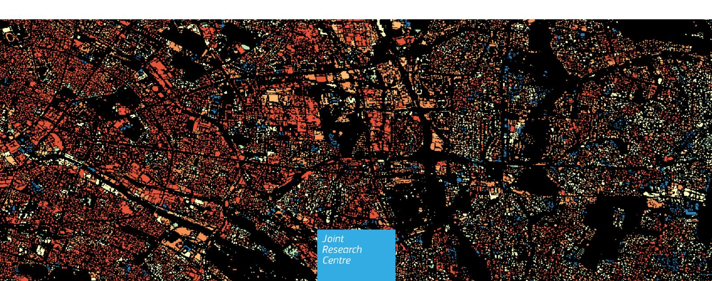

This publication is a Scientific Information Systems and Databases report by the Joint Research Centre (JRC), the European Commission's science and knowledge service. It aims to provide evidence-based scientific support to the European policymaking process. The contents of this publication do not necessarily reflect the position or opinion of the European Commission. Neither the European Commission nor any person acting on behalf of the Commission is responsible for the use that might be made of this publication. For information on the methodology and quality underlying the data used in this publication for which the source is neither Eurostat nor other Commission services, users should contact the referenced source. The designations employed and the presentation of material on the maps do not imply the expression of any opinion whatsoever on the part of the European Union concerning the legal status of any country, territory, city or area or of its authorities, or concerning the delimitation of its frontiers or boundaries.

#### **Contact information**

Name: Thomas Kemper Address: Via Fermi, 2749 21027 ISPRA (VA) - Italy - TP 267 European Commission - DG Joint Research Centre

Space, Security and Migration Directorate Disaster Risk Management Unit E.1 Email: thomas.kemper@ec.europa.eu

Tel.: +39 0332 78 5576

GHSL project: [JRC-GHSL@ec.europa.eu](mailto:JRC-GHSL@ec.europa.eu) GHSL Data[: JRC-GHSL-DATA@ec.europa.eu](mailto:JRC-GHSL-DATA@ec.europa.eu)

#### **EU Science Hub**

[https://joint-research-centre.ec.europa.eu](https://joint-research-centre.ec.europa.eu/)

JRC133256

print ISBN 978-92-68-19156-9 doi:10.2760/20212 KJ-03-23-103-EN-C

PDF ISBN 978-92-68-02341-9 [doi:10.2760/098587](https://doi.org/10.2760/098587) KJ-03-23-103-EN-N

Luxembourg: Publications Office of the European Union, 2024

© European Union, 2024

The reuse policy of the European Commission documents is implemented by the Commission Decision 2011/833/EU of 12 December 2011 on the reuse of Commission documents (OJ L 330, 14.12.2011, p. 39). Unless otherwise noted, the reuse of this document is authorised under the Creative Commons Attribution 4.0 International (CC BY 4.0) licence [\(https://creativecommons.org/licenses/by/4.0/\)](https://creativecommons.org/licenses/by/4.0/). This means that reuse is allowed provided appropriate credit is given and any changes are indicated.

All content © European Union, 2024

How to cite this report: European Commission, *GHSL Data Package 2023*, Publications Office of the European Union, Luxembourg, 2024, doi:10.2760/098587, JRC133256

# **Contents**

| Co | ntents      |        |                                                                                                                                                | i  |
|----|-------------|--------|------------------------------------------------------------------------------------------------------------------------------------------------|----|
| Ab | stract      |        |                                                                                                                                                | 1  |
| 1  | Introductio | on     |                                                                                                                                                | 2  |
|    | 1.1 Over    | view   |                                                                                                                                                | 2  |
|    | 1.2 Ratio   | nale   |                                                                                                                                                | 3  |
|    | 1.3 Histo   | ry and | d Versioning                                                                                                                                   | 3  |
|    | 1.4 Main    | Chara  | acteristics                                                                                                                                    | 5  |
| 2  | Products    |        |                                                                                                                                                | 6  |
|    |             |        | -S R2023A - GHS built-up surface spatial raster dataset, derived from Sentinel-2 Landsat, multi-temporal (1975-2030)                        | 6  |
|    | 2.1.1       | Def    | initions                                                                                                                                       | 7  |
|    | 2.1         | .1.1   | The building                                                                                                                                   | 7  |
|    | 2.1.        | .1.2   | The built-up surface (BUSURF)                                                                                                                  | 7  |
|    | 2.1.        | .1.3   | The built-up fraction (BUFRAC)                                                                                                                 | 7  |
|    | 2.1         | .1.4   | The residential (RES) domain                                                                                                                   | 7  |
|    | 2.1         | .1.5   | The "non-residential domain" (NRES)                                                                                                            | 7  |
|    | 2.1.2       | Exp    | ected Errors                                                                                                                                   | 12 |
|    | 2.1         | .2.1   | Errors in the 2018 predictions                                                                                                                 | 12 |
|    | 2.1.        | .2.2   | Errors in the multi-temporal predictions                                                                                                       | 17 |
|    | 2.1.3       | lmp    | rovements compared to the previous release                                                                                                     | 20 |
|    | 2.1.4       | Inpı   | ıt Data                                                                                                                                        | 22 |
|    | 2.1.        | .4.1   | Remotely sensed image data                                                                                                                     | 22 |
|    | 2.1.        | .4.2   | High-level semantic abstraction data                                                                                                           | 22 |
|    | 2.1.5       | Tecl   | nnical Details                                                                                                                                 | 23 |
|    | 2.1.6       | Sun    | nmary statistics                                                                                                                               | 24 |
|    | 2.1.7       | Hov    | v to cite                                                                                                                                      | 24 |
|    |             |        | -H R2023A - GHS building height, derived from AW3D30, SRTM30, and Sentinel-2 8)                                                             | 26 |
|    | 2.2.1       | Def    | initions                                                                                                                                       | 26 |
|    | 2.2.2       | Inpı   | ıt data                                                                                                                                        | 27 |
|    | 2.2.3       | Exp    | ected errors                                                                                                                                   | 30 |
|    | 2.2.4       | Tecl   | hnical Details                                                                                                                                 | 31 |
|    | 2.2.5       | Hov    | v to cite                                                                                                                                      | 31 |
|    |             |        | -V R2023A - GHS built-up volume spatial raster datasets derived from joint assessm Isat, and global DEM data, for 1975-2030 (5yrs interval) |    |
|    | 2.3.1       | Inpı   | ıt Data                                                                                                                                        | 33 |
|    | 2.3.2       | Tecl   | nnical Details                                                                                                                                 | 33 |
|    | 2.3.3       | Sun    | nmary statistics                                                                                                                               | 34 |
|    | 2.3.4       | Нον    | <i>v</i> to cite                                                                                                                               | 34 |

|     |        |       | -C R2023A - GHS Settlement Characteristics, derived from Sentinel-2 composite (201; 2023A data                                                 |    |
|-----|--------|-------|---------------------------------------------------------------------------------------------------------------------------------------------------|----|
|     | 2.4.1  | Inpu  | t data                                                                                                                                            | 43 |
|     | 2.4.2  | •     | nical Details                                                                                                                                     |    |
|     | 2.4.3  |       | to cite                                                                                                                                           |    |
| 2.5 | GHS-P  |       | 2023A - GHS population spatial raster dataset multi-temporal (1975-2030)                                                                          |    |
|     | 2.5.1  |       | ovements compared to the previous release                                                                                                         |    |
|     | 2.5.2  |       | t Data                                                                                                                                            |    |
|     | 2.5.3  | •     | nical Details                                                                                                                                     |    |
|     | 2.5.4  |       | mary statistics                                                                                                                                   |    |
|     | 2.5.5  |       | to cite                                                                                                                                           |    |
|     |        |       | R2023A - GHS settlement layers, application of the Degree of Urbanisation methodol POP R2023A and GHS-BUILT-S R2023A, multitemporal (1975-2030)   |    |
|     | 2.6.1  | Impr  | ovements compared to the previous release                                                                                                         | 50 |
|     | 2.6.2  |       | -SMOD classification rules                                                                                                                        |    |
|     | 2.6.3  | GHS-  | -SMOD L2 spatial raster dataset and L1 aggregation                                                                                                | 53 |
|     | 2.6.4  | Inpu  | t Data                                                                                                                                            | 57 |
|     | 2.6.5  | Tech  | nical Details                                                                                                                                     | 57 |
|     | 2.6.5  | 5.1   | GHS-SMOD raster spatial raster dataset                                                                                                            | 58 |
|     | 2.6.5  | 5.2   | GHS-SMOD urban centre entities                                                                                                                    | 58 |
|     | 2.6.5  | 5.3   | GHS-SMOD dense urban cluster entities                                                                                                             | 58 |
|     | 2.6.6  | Sum   | mary statistics                                                                                                                                   | 59 |
|     | 2.6.7  | How   | to cite                                                                                                                                           | 61 |
|     |        |       | 2023A - GHS Degree of Urbanisation Classification, application of the Degree of thodology (stage II) to GADM 3.6 layer, multitemporal (1975-2030) | 62 |
|     | 2.7.1  | Impr  | ovements compared to previous release                                                                                                             | 63 |
|     | 2.7.2  | GHS   | L Territorial Units Classification                                                                                                                | 63 |
|     | 2.7.2  | 2.1   | Territorial units classification Level 1                                                                                                          | 63 |
|     | 2.7.2  | 2.2   | Territorial units classification Level 2                                                                                                          | 64 |
|     | 2.7.2  | 2.3   | Classification workflow                                                                                                                           | 65 |
| 2.8 | A cons | isten | t nomenclature for the Degree of Urbanisation                                                                                                     | 65 |
|     | 2.8.1  | How   | to use the statistics tables                                                                                                                      | 66 |
|     | 2.8.2  | Inpu  | t Data                                                                                                                                            | 66 |
|     | 2.8.3  | Tech  | nical Details                                                                                                                                     | 67 |
|     | 2.8.3  | 3.1   | GHS-DUC Summary Statistics Table                                                                                                                  | 67 |
|     | 2.8.3  | 3.2   | GHS-DUC Admin Classification layers                                                                                                               | 68 |
|     | 2.8.4  | Sum   | mary statistics                                                                                                                                   | 74 |
|     | 2.8.5  | How   | to cite                                                                                                                                           | 76 |
|     |        |       | -LAUSTAT R2023A - GHS built-up surface statistics in European LAU, multitemporal                                                                  | 77 |
|     | 201    | Innu  | t data                                                                                                                                            | 77 |

|    | 2.9.2      | Technical Details                                                                    | 77 |
|----|------------|--------------------------------------------------------------------------------------|----|
|    | 2.9.3      | How to cite                                                                          | 77 |
|    |            | SDATA R2023A - GHSL data supporting the production of R2023A Data Package (GHS-BUILT |    |
|    | 2.10.1     | Technical Details                                                                    | 78 |
|    | 2.10.2     | How to cite                                                                          | 79 |
| 3  | Conclusion | S                                                                                    | 80 |
| Re | ferences   |                                                                                      | 81 |

### **Abstract**

The Global Human Settlement Layer (GHSL) project produces new global spatial information, evidence-based analytics and knowledge describing the human presence on Earth. It operates in a fully open and free data and methods access policy. The knowledge generated with the GHSL is supporting the definition, the public discussion and the implementation of European policies and the monitoring of international frameworks such as the 2030 Development Agenda. The GHSL is the core data set of the Exposure Mapping Component under the Copernicus Emergency Management Service. GHSL data continue to support the GEO Human Planet Initiative that is committed to developing a new generation of measurements and information products providing new scientific evidence and a comprehensive understanding of the human presence on the planet and that can support global policy processes with agreed, actionable and goal-driven metrics.

This document describes the public release of the GHSL Data Package 2023 (GHS P2023). This release provides improved built-up (including surface, volume and height) and population products as well as a new settlement model and classification of administrative and territorial units according to the "Degree of Urbanisation" framework.

**Prior to cite this report, please access the updated version available at:**

[http://ghsl.jrc.ec.europa.eu/documents/GHSL\\_Data\\_Package\\_2023.pdf](http://ghsl.jrc.ec.europa.eu/documents/GHSL_Data_Package_2023.pdf)

# **1 Introduction**

#### **1.1 Overview**

The Global Human Settlement Layer (GHSL) project produces global spatial information, evidence-based analytics, and knowledge describing the human presence on the planet. The GHSL relies on the design and implementation of spatial data processing technologies that allow automatic data analytics and information extraction from large amounts of heterogeneous geospatial data including global, fine-scale satellite image data streams, census data, and crowd sourced or volunteered geographic information sources.

This document accompanies the public release of the GHSL Data Package 2023 (GHS P2023) and describes its contents.

Each product is named according to the following convention:

GHS-<name>\_<spatial extent>\_<release>

For example, a product name GHS-BUILT-V\_GLOBE\_R2023A indicates the built-up volume (BUILT-V) produced globally in the release R2023A.

Each product can be made by one or more datasets and layers. A layer is named with a unique identifier according to the following convention:

GHS\_<name>\_<Epoch>\_<spatialExtent>\_<release>\_<projection>\_<resolution>\_<version>

For example, a layer name GHS\_BUILT\_V\_E2030\_GLOBE\_R2023A\_54009\_100\_V1\_0 indicates the built-up volume (GHS\_BUILT\_V) in the epoch 2030 (E2030), included in the release R2023A, in World Mollweide projection (ESRI:54009) at 100m of spatial resolution, version 1.0.

The GHSL Data Package 2023 contains the following products:

GHS-BUILT-S R2023A - GHS built-up surface spatial raster dataset, derived from Sentinel-2 composite (2018) and Landsat, multitemporal (1975-2030)

GHS-BUILT-H R2023A - GHS building height, derived from AW3D30, SRTM30, and Sentinel-2 composite (2018)

GHS-BUILT-V R2023A - GHS built-up volume spatial raster datasets derived from joint assessment of Sentinel-2, Landsat, and global DEM data, for 1975-2030 (5 years interval)

GHS-BUILT-C R2023A - GHS Settlement Characteristics, derived from Sentinel-2 composite (2018) and other GHS R2023A data

GHS-POP R2023A - GHS population spatial raster dataset multitemporal (1975-2030)

GHS-SMOD R2023A - GHS settlement layers, application of the Degree of Urbanisation methodology (stage I) to GHS-POP R2023A and GHS-BUILT-S R2023A, multitemporal (1975-2030)

GHS-DUC R2023A - GHS Degree of Urbanisation Classification, application of the Degree of Urbanisation methodology (stage II) to GADM 14.1 layer, multitemporal (1975-2030)

GHS-SDATA R2023A - GHS release R2023A supporting data

GHS-BUILT-LAUSTAT R2023A - GHS built-up surface statistics in European LAU, multitemporal (1975-2020)

1 Global ADMinistrative boundaries layer:<https://gadm.org/>

#### **1.2 Rationale**

Open data and free access are core principles of the GHSL (Melchiorri et al., 2019). They are aligned with the Directive on the re-use of public sector information (Directive 2003/98/EC2 ). The free and open access policy facilitates the information sharing and collective knowledge building, thus contributing to a democratisation of the information production.

The GHSL Data Package 2023 contains the new GHSL data produced at the European Commission Directorate General Joint Research Centre in the Directorate for Space, Security and Migration in the Disaster Risk Management Unit (E.1) in the period 2022-2023.

### **1.3 History and Versioning**

Previous GHSL releases relied on the processing of Landsat imagery for producing the GHS-BUILT information layer. The Landsat satellite platforms collect Earth observation data since the beginning of the civilian space programs in the 1970s. In January 2008, Barbara Ryan, the Associate Director for Geography at the U.S. Geological Survey (USGS), and Michael Freilich, NASA's Director of the Earth Science Division, signed off a Landsat Data Distribution Policy that made Landsat images free to the public. The USGS announced the freeand-open data policy on April 21, 2008. The Global Land Survey (GLS) data sets were created as a collaboration between NASA and the USGS from 2009 through 2011.3 Each of these collections were created using the primary Landsat sensor in use at the time for each collection epoch. Early global experiments on the GHS-BUILT production by the European Commission's Joint Research Centre (JRC) date back to 2014, using as input GLS1975, GLS1990, GLS2000, and a collection of Landsat 8 imagery of the year 2014, autonomously selected and downloaded by the JRC from the USGS portal. These data constitute the first set of data evidences used to support the GHSL epochs 1975, 1990, 2000, and 2014 (Pesaresi, Ehrlich, et al., 2016).

Copernicus, previously known as GMES (Global Monitoring for Environment and Security), is the European Union's Earth observation programme. It relies as well on a free-and-open data access policy. Sentinel-1 is the first of the Copernicus Programme satellite constellation using active radar sensor technology. The first satellite, Sentinel-1A, was launched on 3 April 2014, and Sentinel-1B was launched on 25 April 2016. In December 2016 the JRC successfully completed the first experiment of Sentinel-1 global data processing in the frame of the Global Human Settlement Layer (GHSL) project (Corbane et al., 2017). Sentinel-2 (S2) is an Earth observation mission from the Copernicus Programme that systematically acquires optical imagery at high spatial resolution (10 m to 60 m) over land and coastal waters. The launch of the first satellite, Sentinel-2A, occurred 23 June 2015. Sentinel-2B was launched on 7 March 2017. In 2018, the JRC produced the first Sentinel-2 cloud-free global pixel based image composite from L1C data for the period 2017-2018 for public use, leveraging on the Google Earth Engine platform (Corbane, Politis, et al., 2020). In October 2020, the JRC successfully completed the first public release of global built-up areas assessment from these Sentinel-2, 10m-resolution Copernicus imagery data (Corbane, Syrris, et al., 2020).

In 2016, the first public GHSL Data Package was released (GHS P2016). It consisted in several multi-temporal and multi-resolution raster products, including built-up area spatial raster datasets (GHS-BUILT), population spatial raster datasets (GHS-POP), a settlement model (GHS-SMOD) and selected quality spatial raster datasets. The first GHS-BUILT product included in that release was generated from Landsat image data using the URBAN class generated from MODIS 500m-resolution data as learning set (Pesaresi, Ehrlich, et al., 2016), (Schneider et al., 2010). The population spatial raster datasets (GHS\_POP\_GPW41MT\_GLOBE\_R2016A) were produced in collaboration with Columbia University (New York City, USA), Center for International Earth Science Information Network (CIESIN) in 2015. The GHS-SMOD spatial raster datasets (GHS\_SMOD\_POP\_GLOBE\_R2016A) present an implementation of the Degree of Urbanization (DEGURBA)4 model using as input the population grid cells (European Commission & Statistical Office of the European Union, 2021) .

In 2018, the second version of the multi-temporal GHS-BUILT was released (GHS R2018), re-processing the same Landsat images, but with an improved learning set obtained by the introduction of the built-up areas collected from the classification of Sentinel-1 Synthetic-aperture radar (SAR) data at 20m-resolution (Corbane

2 http://eur-lex.europa.eu/legal-content/en/ALL/?uri=CELEX:32003L0098

3 https://www.usgs.gov/landsat-missions/global-land-survey-gls

4 https://ghsl.jrc.ec.europa.eu/degurba.php

et al., 2017). In the GHS P2019 release the GHS-POP and GHS-SMOD data derived from these improved GHS-BUILT datasets were distributed.

In 2020, a new single-epoch GHS-BUILT dataset was released (GHS R2020) by processing of 10m-resolution Sentinel-2 imagery data of year 2018 and by introducing as improvement of the learning set new data on building footprints or human settlement delineation made available from open efforts of Microsoft and Facebook on classification of VHR image data (Corbane, Syrris, et al., 2020).

In 2022, the JRC released GHS P2022, which builds upon the past experience and data with two main objectives: A) augment the thematic contents of the built-up area information; and B) reconnect and rebuild the historical information contained in the GHSL rooting on the historical Landsat imagery with the new, recent data coming from the Sentinel mission at higher spatial resolution. Several innovative aspects are included in the new GHS-BUILT of the GHS P2022.

After the publication of the GHS P2022 new independent data showed an anomaly in the performance of the multi-temporal model that was not visible during the model development5 . According to the JRC internal tests, the anomaly was expected to introduce a positive bias in predicted change rates of built-up surfaces and builtup volumes after the year 2000. The positive bias is especially remarkable in the rural domain as set by the GHS-SMOD R2022A.

The new release GHS P2023 fixes the anomaly in the multi-temporal modelling mechanism and recalculates the multi-temporal built-up surfaces, built-up volumes, population, and degree of urbanization spatial raster datasets (SMOD) accordingly. Moreover, some other improvements are applied in the POP estimates and downscaling mechanisms. The 10m-resolution products directly derived from the Sentinel-2 image composite of the year 2018 remains substantially the same in the GHS P2023 as compared to the GHS P2022, with some marginal improvements. The GHS-LAND product is not affected by the introduced changes and therefore it remains as a R2022 dataset. Here below some of the key features of the GHS P2023:

- 1. sub-pixel built-up surface fraction estimates at 10m-resolution
- 2. a Boolean classification of the built-up surfaces in residential (RES) vs. non-residential (NRES) semantic abstractions at 10m-resolution
- 3. average building height estimates at 100m-resolution
- 4. spatial-temporal interpolations of the built-up surface information at 100m-resolution and in equal time (5-year) intervals from 1975 to 2030.
- 5. Population distribution at spatial resolution of 100m in 5-year intervals between 1975 and 2030.
- 6. allocation of population according to the presence of residential (RES) built-up volume
- 7. country total population time series aligned to the latest UN World Population Prospects 2022 (United Nations, Department of Economic and Social Affairs, Population Division, 2022)
- 8. temporal population estimates anchored to the UN "urban agglomeration" population time series of the latest UN World Urbanization Prospects 2018 (United Nations, Department of Economic and Social Affairs, Population Division, 2018)

The settlement classification layer (GHS-SMOD) benefits from improvements in built-up surface and population spatial raster datasets and is based on the specifications of the Degree of Urbanisation (stage I) framework (European Commission & Statistical Office of the European Union, 2021).

This new GHS-SMOD layer and the new GHS-POP spatial raster datasets are used to update the GADM 4.1 Degree of Urbanisation Classification (GHS-DUC), the classification of territorial units according to the stage II of the Degree of Urbanisation framework (European Commission & Statistical Office of the European Union, 2021).

As in all previous releases, the GHS P2023 is available at the GHSL download portal [\(https://ghsl.jrc.ec.europa.eu/download.php\)](https://ghsl.jrc.ec.europa.eu/download.php) and as GHSL collection in JRC Open Data Repository [\(http://data.jrc.ec.europa.eu/collection/ghsl\)](http://data.jrc.ec.europa.eu/collection/ghsl). The current data release contains the most up-to-date products and

5 <https://ghsl.jrc.ec.europa.eu/p2022Release.php>

datasets, and thus, data users should be aware that the quality of the GHS P2023 data exceeds the quality of the estimates published in previous releases.

## **1.4 Main Characteristics**

In order to facilitate data analytics - as it was done in previous issues - the release includes a set of multiresolution products created by aggregation of the main products. Additionally, the density spatial raster datasets are produced in an equal-area projection using grid cells of 100 m and 1 km spatial resolution. For example, the multi-temporal population spatial raster datasets were produced based on grid cells of 100 m spatial resolution, and they were then aggregated to 1 km2 . Most of the datasets will be provided also in a warped version to WGS84 coordinate system, at 3 arcsec and 30 arc sec resolutions.

The differences between the products in the previous GHS P2019 and those in the current GHS P2023 release are substantial. They include new and more precise 10m-resolution sub-pixel fraction built-up surface estimations, new semantics (i.e., residential vs. non-residential), building height estimates, and new seamless interpolated spatial raster datasets at 100m-resolution with equal time intervals of 5 years from 1975 to 2030.

Moreover, an improved approach for the production of population spatial raster datasets was applied. Total population time series by country are aligned to the latest UN World Population Prospects 2019 (United Nations, Department of Economic and Social Affairs, Population Division, 2019). The local temporal population estimates (i.e. at census polygon level) are derived using a new model that takes into account the UN 'city' population time series of the latest UN World Urbanization Prospects 2018 (United Nations, Department of Economic and Social Affairs, Population Division, 2018). Finally, the population distribution takes advantage of the residential (RES) vs. non-residential (NRES) semantic abstractions by weighting the dasymetric population disaggregation according to the presence of residential (RES) and non-residential (NRES) built-up volume.

The subsections of Section 2 introduce briefly each product (including more details on differences with the corresponding past version). Dedicated reports are under preparation.

#### **Terms of Use**

The data in this data package are provided free-of-charge © European Union, 2023. Reuse is authorised, provided the source is acknowledged. The reuse policy of the European Commission is implemented by a Decision of 12 December 2011 (2011/833/EU). For any inquiry related to the use of these data please contact the GHSL data producer team at the email address: [JRC-GHSL-DATA@ec.europa.eu](mailto:JRC-GHSL-DATA@ec.europa.eu)

**Disclaimer**: The JRC data are provided "as is" and "as available" in conformity with the [JRC Data Policy](https://publications.europa.eu/en/publication-detail/-/publication/00ee64f1-249f-4c8d-bbcc-0a4f6a151732/language-en)6 and the [Commission Decision on reuse of Commission documents](http://eur-lex.europa.eu/eli/dec/2011/833/oj) (2011/833/EU). Although the JRC guarantees its best effort in assuring quality when publishing these data, it provides them without any warranty of any kind, either express or implied, including, but not limited to, any implied warranty against infringement of third parties' property rights, or merchantability, integration, satisfactory quality and fitness for a particular purpose. The JRC has no obligation to provide technical support or remedies for the data. The JRC does not represent or warrant that the data will be error free or uninterrupted, or that all non-conformities can or will be corrected, or that any data are accurate or complete, or that they are of a satisfactory technical or scientific quality. The JRC or as the case may be the European Commission shall not be held liable for any direct or indirect, incidental, consequential or other damages, including but not limited to the loss of data, loss of profits, or any other financial loss arising from the use of the JRC data, or inability to use them, even if the JRC is notified of the possibility of such damages.

**Prior to cite this report, please access the updated version available at:** [http://ghsl.jrc.ec.europa.eu/documents/GHSL\\_Data\\_Package\\_2023.pdf](http://ghsl.jrc.ec.europa.eu/documents/GHSL_Data_Package_2023.pdf)

JRC Data Policy <https://doi.org/10.2788/607378>

# **2 Products**

# **2.1 GHS-BUILT-S R2023A - GHS built-up surface spatial raster dataset, derived from Sentinel-2 composite and Landsat, multi-temporal (1975-2030)**

The GHS-BUILT-S spatial raster dataset depicts the distribution of the built-up (BU) surfaces estimates between 1975 and 2030 in 5 year intervals and two functional use components a) the total BU surface and b) the nonresidential (NRES) BU surface. The data is made by spatial-temporal interpolation of five observed collections of multiple-sensor, multiple-platform satellite imageries: Landsat (MSS, TM, ETM sensor) data supports the 1975, 1990, 2000, and 2014 epochs, while a Sentinel-2 (S2) image composite (GHS-composite-S2 R2020A) supports the 2018 epoch.

The sub-pixel built-up fraction (BUFRAC) estimate at 10m resolution is produced from the 10m-resolution Sentinel-2 image composite, using as learning set a composite of data from GHS-BUILT-S2 R2020A, Facebook settlement delineation, Microsoft, and Open Street Map (OSM) building delineation. The inferential engine is a multiple-quantization-minimal-support (MQMS) generalization of the symbolic machine learning (SML) approach (Pesaresi, Syrris, et al., 2016). The SML for the classification of the Sentinel-2 data uses in input both radiometric and multi-scale morphological image descriptors (Pesaresi, Corbane, et al., 2016), including functional (i.e. RES, NRES) delineation of the built-up areas. In particular, the multiscale decomposition of the image information it is supported by the characteristic-saliency-levelling (CSL) model (Pesaresi et al., 2012) from generalization of the image segmentation based on the derivative of the morphological profile (DMP) (Pesaresi & Benediktsson, 2001). The multi-scale CSL it is solved by using a computationally efficient approach (Ouzounis et al., 2012). The inference is computed in data tiles of 100×100 km size.

The non-residential (NRES) built-up surface domain is predicted from S2 data by observation of radiometric, textural, and morphological features in a multi-faceted image processing framework merging global unsupervised rule-based reasoning and inductive locally-adaptive methods leveraging on pixel-wise spectral indexes, textural assessments, and object-oriented shape analysis. Textural analysis is performed by multiscale, anisotropic and rotation-invariant contrast measurements using increasing displacement vectors of the co-occurrence matrix selecting the areas where contrast of large objects dominate the textural contrast generated by smaller image structures (Gueguen et al., 2012, Pesaresi et al., 2008). The connected component ("object") image analysis is solved by a segmentation of salient image structure based on the watershed of the inverse of the saliency layer as defined in the "characteristics-saliency-levelling" CSL (Pesaresi et al., 2012).

As in previous GHSL releases (Corbane et al., 2019; Pesaresi, Ehrlich, et al., 2016), the multi-temporal (MT) process works stepwise from recent epochs to past epochs, deleting the BU information if the decision is supported by empirical evidences from satellite data of the specific epoch. By definition, the process can only decrease the amount of built-up surface going from recent to past epochs. In this release, a similar logic generalized to the continuous prediction domain is applied within an object-oriented image processing framework. Salient spatial units are delineated by the watershed of the inverse of the continuous BUFRAC function at 10m resolution. This is done in order to increase the robustness of the change detected by the system, vs. the changing sensor data geometry (origin of the grid, resolution, projection) of the supporting image data in the various epochs. For each evaluated epoch and available Landsat scene, the probability Φ that any specific sensor sample (pixel or grid cell) can be associated to the foreground "built-up" (BU) vs. the background "non-built-up" (NBU) information semantic is evaluated, by observing the statistical association between the combinations of the quantized reflectance values and the training data. This inferential process is solved by multiple-quantization-minimal-support (MQMS) generalization of the symbolic machine learning (SML) approach (Pesaresi, Syrris, et al., 2016). The semantic Φ extracted at the pixel level of the different Landsat scenes in arbitrary geometries is aggregated to the data segments using a surface-weighted average. The final prediction on the amount of built-up surface change for each segment is solved by a multiple decision support approach evaluating ensemble linear regression model predictions from the semantic association of Φ to the BU vs. NBU class abstraction hypothesis, stratified in different data domains characterized by different expected sensor bias in discrimination of BU vs. NBU classes, that are cumulated and maximized from all the available input satellite scenes in the various epochs. Finally, the predictions on built-up surface change are aggregated by averaging at a uniform sample size of 100m grid cells and are used to build the final raster data.

In the intermediate epochs not covered by direct satellite observations, in areas not covered by satellite imageries (i.e. satellite data gaps in the 1975 epoch), or in the future epochs 2025 and 2030, the BU prediction it is solved by spatial-temporal interpolation or extrapolation based on a rank-optimal spatial allocation method. This supporting spatial optimization function combines static and dynamical components: the static component is determined by the observation of the empirical association between the occurrence of specific land form combinations (slope, elevation, water) and the occurrence of human settlement development from remotely sensed data. The dynamical component is based on the spatial dynamics of the BU surface in the observed epochs, decomposed in a change (growth, or shrink) vs inertial (i.e. unchanged) BU dynamical field components.

### **2.1.1 Definitions**

#### *2.1.1.1 The building*

Since the initial concept of the GHSL (Pesaresi et al., 2013) the adopted definition is the same as the INSPIRE "building" abstraction [\(https://inspire.ec.europa.eu/id/document/tg/bu\)](https://inspire.ec.europa.eu/id/document/tg/bu), limited to the above-ground case, and without the "permanent" characterization of the built-up structures, allowing to be inclusive to temporary settlements as associated to slums, rapid migratory patterns, or displaced people because of natural disasters or crisis . "*… Buildings are constructions above (and/or underground) which are intended or used for the shelter of humans, animals, things, the production of economic goods or the delivery of services and that refer to any structure (permanently) constructed or erected on its site…*" . In short, and taking in to account the remotesensing technology characteristics and limitations, the implicit GHSL abstraction of the "building" can be summarized as: "*any roofed structure erected above ground for any use*".

#### *2.1.1.2 The built-up surface (BUSURF)*

The built-up surface is the gross surface (including the thickness of the walls) bounded by the building wall perimeter with a spatial generalization matching the 1:10K topographic map specifications, that it also informally called "building footprint".

#### *2.1.1.3 The built-up fraction (BUFRAC)*

The built-up fraction (BUFRAC) is the share of the raster sample (i.e. pixel or grid cell) surface that is covered by the built-up surface.

#### *2.1.1.4 The residential (RES) domain*

The RES domain is defined as the built-up surface dedicated prevalently for residential use. The residential use is defined as from INSPIRE: *"…Areas used dominantly for housing of people. The forms of housing vary significantly between, and through, residential areas. These areas include single family housing, multi-family residential, or mobile homes in cities, towns and rural districts if they are not linked to primary production. It permits high density land use and low density uses. This class also includes residential areas mixed with other non-conflicting uses and other residential areas…*" 7

#### *2.1.1.5 The "non-residential domain" (NRES)*

The "non-residential domain" (NRES) is defined as the domain of the BUFRAC>0 complement of the RES domain. This can be worded also as "*any built-up surface not included in the RES class*". As a logical corollary of the fact that in the RES domain definition also mixture with other not conflicting uses is allowed, the complement NRES domain is characterized by uses not compatible with the human residence.

#### **Examples:**

Let assume a 100m resolution spatial raster dataset with a 100×100 = 10,000 square meters of surface per spatial sample (pixel, or cell grid) of this spatial raster dataset. Moreover, let be the built-up surface predicted at the sample X of this grid BUSURFx = 750 square meters.

The corresponding built-up fraction estimate will be : BUFRACx = 750 / 10,000 = 0.075

Let assume in the sample x of 100×100m resolution the total BUSURFx = 4380 square meters, while the NRES BUSURFx = 850 square meters. Then the residential built-up surface RES BUSURFx can be predicted as RES BUSURFx = 4380 – 850 = 3530 square meters.

7 [https://inspire.ec.europa.eu/codelist/HILUCSValue/5\\_ResidentialUse](https://inspire.ec.europa.eu/codelist/HILUCSValue/5_ResidentialUse)

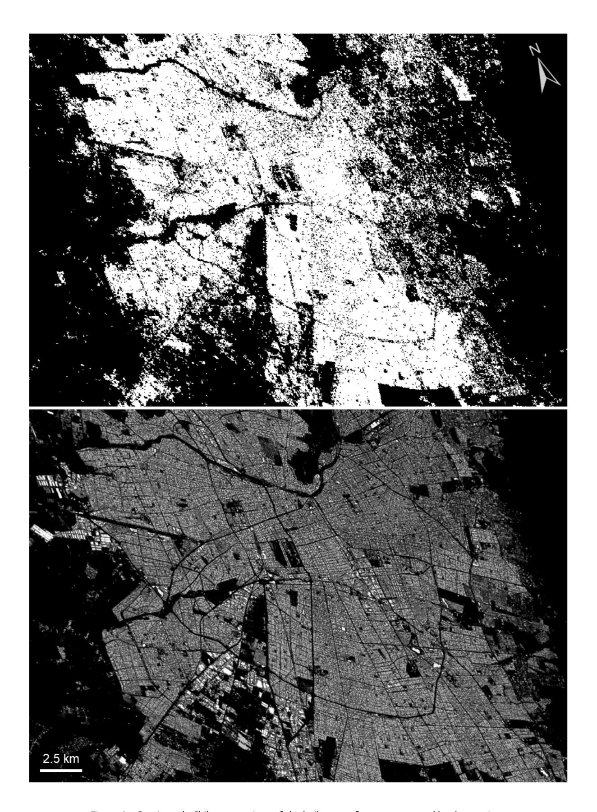

Figure 1 - Santiago de Chile: comparison of the built-up surfaces as assessed by the previous GHS\_BUILT\_LDSMT\_GLOBE\_R2018A for the epoch 2014 from Landsat image data with a Boolean 30m-resolution method (upper), vs the new GHS-BUILT-S\_GLOBE\_R2023A for the epoch 2018 from Sentinel-2 image data with a continuous 10m-resolution method (lower).

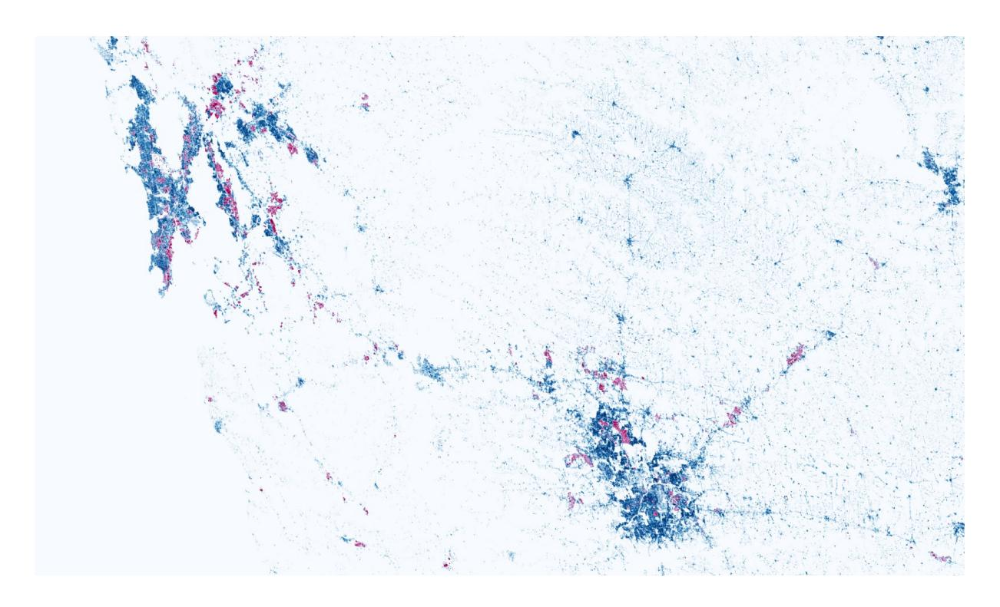

Figure 2 - Mumbai-Pune (India): residential (RES) and non-residential (NRES) components of the built-surfaces estimated for the GHSL 2020 epoch. RES and NRES are represented with blue and magenta, respectively.

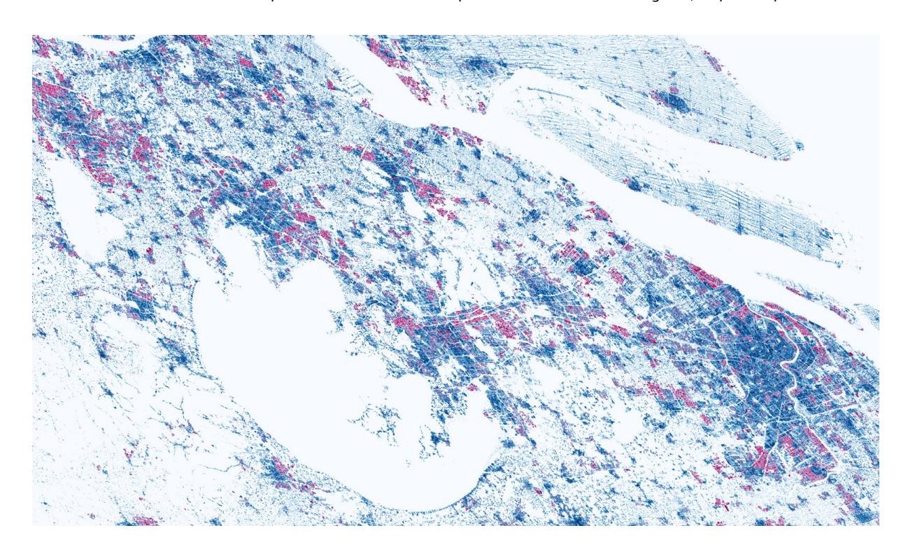

Figure 3 - Shanghai-Changzhou (China): residential (RES) and non-residential (NRES) components of the built-surfaces estimated for the GHSL 2020 epoch. RES and NRES are represented with blue and magenta, respectively.

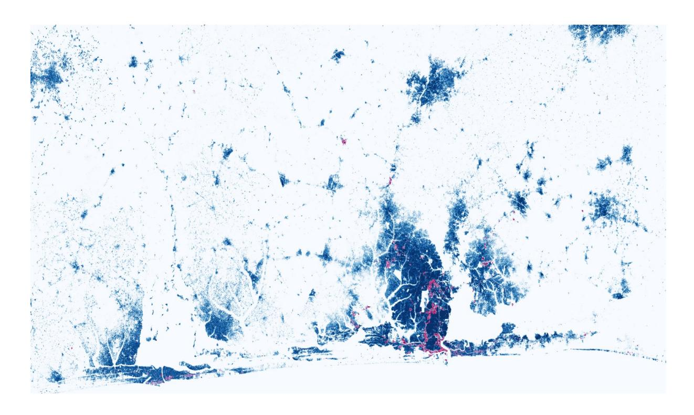

Figure 4 - Lagos-Porto Novo-Abeokuta (Nigeria): residential (RES) and non-residential (NRES) components of the builtsurfaces estimated for the GHSL 2020 epoch. RES and NRES are represented with blue and magenta, respectively.

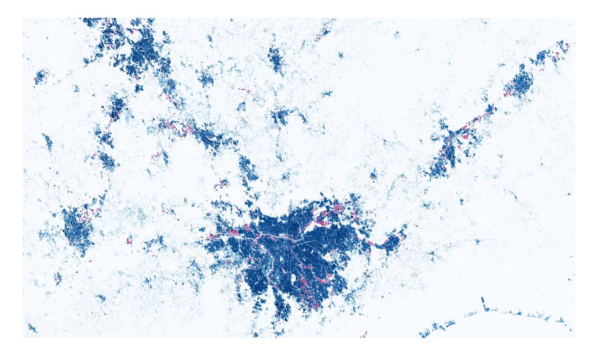

Figure 5 - Sao Paulo- Campinas - Sao Jose dos Campos (Brazil): residential (RES) and non-residential (NRES) components of the built-surfaces estimated for the GHSL 2020 epoch. RES and NRES are represented with blue and magenta, respectively.

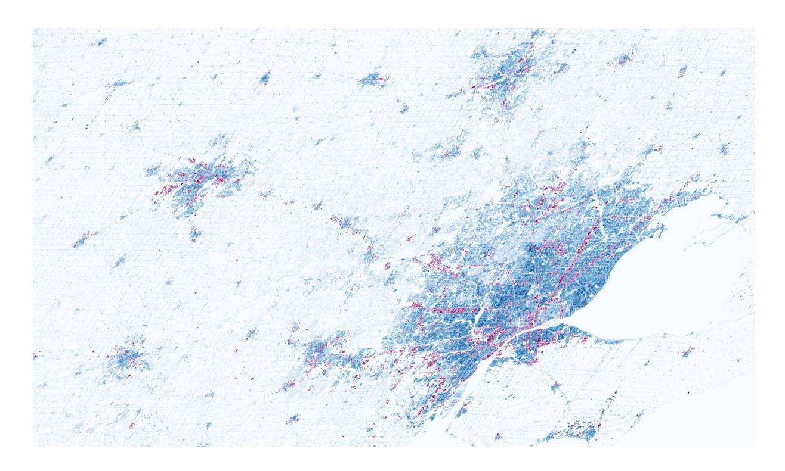

Figure 6 - Detroit-Lansing-Flint (United States): residential (RES) and non-residential (NRES) components of the builtsurfaces estimated for the GHSL 2020 epoch. RES and NRES are represented with blue and magenta, respectively.

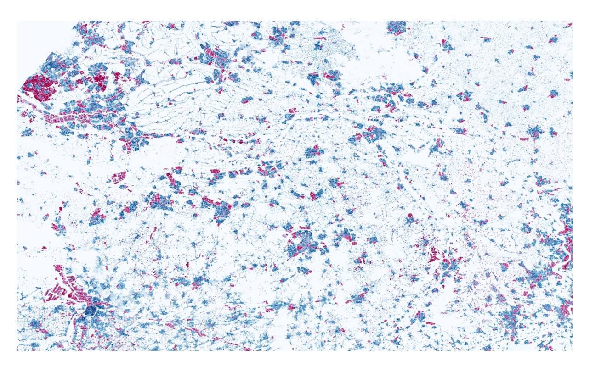

Figure 7 - The Hague - Rotterdam- Antwerp (The Netherlands): residential (RES) and non-residential (NRES) components of the built-surfaces estimated for the GHSL 2020 epoch. RES and NRES are represented with blue and magenta, respectively.

#### **2.1.2 Expected Errors**

The estimation of the GHS-BUILT-S errors is currently ongoing, and will be delivered in peer-reviewed publications targeting the different GHS-BUILT-S thematic aspects possibly in 2023-2024.

The ongoing error assessment it is solved by two complementary approaches a) comparing model predictions with human visual inspection of the same imagery data input, and b) comparing model predictions with other data of presumably higher accuracy after passing consistency and completeness checks. In the following, it is adopted a pragmatic approach by considering synonyms "accuracy metrics" or "agreement metrics", both measuring the agreement between the reference data and the model predictions, in both (a) and (b) approaches.

#### *2.1.2.1 Errors in the 2018 predictions*

On the error assessment approach (a) a total of 1 million sample points it is under assessment for the four Boolean classes listed below:

1. NBU\_WATER : non built-up water surfaces

2. NBU\_LAND: non built-up land surfaces

3. BU\_RES: residential built-up surfaces

4. BU\_NRES: non-residential built-up surfaces

A stratified uniform random sampling schema it is applied targeting an equalized number of samples for the four considered classes, uniformly distributed across the whole global landmass with the exception of Antarctica. Each random sample was visually inspected in three independent inspection campaigns (trials), performed by nine distinct professional photo-interpreters that were randomly assigned to each sample interpretation task. Each human labelling decision was accompanied by a high (H) vs. low (L) score of the confidence in the label assignment.

The results summarized here are aggregated from the first tranche of 250,000 validation points, which were available at the date of the report.

The class assignment from the different trials in each random sample is not necessarily the same, reflecting possibly different opinions of the human interpreters on the same sample. These uncertainties can be solved by two approaches: a) a voting schema and b) subsampling of the observations minimizing the human disagreement domain. This subsampling is done by using a metric called the Joint Agreement High Confidence (JAHC), which is defined as the domain where all the three independent human interpretations provide the same class answer, all of them with a high confidence score, so it represents the domain with the highest confidence of the human interpretation results. Among the 250,000 considered points, 155,649 (62.26%) are JAHC points, accordingly to the first tranche of 250,000 observed points discussed here. Observing the geographic distribution, the JAHC share ranges from 57.1% to 70.1% of Europe and Oceania, respectively [\(Table 1\)](#page-16-2).

Table 1 – Total and JAHC samples per Region, sorted by decreasing Joint Agreement High Confidence share of the human interpretation of S2 data.

| Region  | N Samples (All) | N Samples JAHC (*) | JAHC share |  |  |
|---------|-----------------|-----------------------|------------|--|--|
| Oceania | 13,542          | 9,505                 | 70.19%     |  |  |
| America | 78,061          | 50,094                | 64.17%     |  |  |
| Africa  | 38,779          | 24,596                | 63.43%     |  |  |
| ALL     | 250,000         | 155,649               | 62.26%     |  |  |
| Asia    | 71,279          | 43,821                | 61.48%     |  |  |
| Europe  | 48,339          | 27,633                | 57.17%     |  |  |

(\*) Joint Agreement High Confidence (JAHC) samples

Table 2 and Table 3 show the confusion matrix and the accuracy metrics for the 4-class classification scenario, by solving the human uncertainty using the voting schema, and the subsampling to the JAHC universe, respectively. In both cases, per-class Precision and Recall scores (also called Producer and User accuracy) are summarized in the horizontal and vertical highlighted rows, respectively. The voting approach including both High and Low confidence scores of the human labelling, yields an overall accuracy of 82.6% on the 250,000 reference points (Table 2), while the subsampling on the high confidence high agreement of the JAHC domain yields an overall accuracy of 90.5% on the 155,649 reference points passing the agreement and confidence tests (Table 3).

Table 4 shows the summary of the 4-class agreement metrics by sub-regions of the world8 ordered by decreasing accuracy scores, focusing the attention on the optimal JAHC human interpretation domain. Significative positive accuracy extrema are collected in South East Asia (94.8%) and Melanesia (95.2%), while the worst region is the Central Africa and Southern Africa, yielding an 86.4% and 83.8% accuracy, respectively.

Table 2 – Reference set by voting schema, any confidence level: confusion matrix and accuracy or agreement metrics

| Label                      |       | OBSERVED NBU_WATER | OBSERVED NBU_LAND | OBSERVED BU_RES | OBSERVED BU_NRES | Total predicted | Total predicted [%] | Metrics         |       |
|----------------------------|-------|-----------------------|----------------------|--------------------|---------------------|--------------------|------------------------|-----------------|-------|
|                            |       | 99.5%                 | 56.8%                | 88.7%              | 83.3%               |                    |                        |                 |       |
| PREDICTED NBU_WATE R | 95.5% | 52,323                | 2,401                | 1                  | 43                  | 54,768             | 21.9%                  | Precisi on   | 82.1% |
| PREDICTED NBU_LAND      | 98.6% | 215                   | 30,575               | 75                 | 159                 | 31,024             | 12.4%                  | Recall          | 86.2% |
| PREDICTED BU_RES        | 73.3% | 2                     | 11,446               | 63,750             | 11,746              | 86,944             | 34.8%                  | Accura cy    | 82.6% |
| PREDICTED BU_NRES       | 77.4% | 31                    | 9,389                | 8,037              | 59,807              | 77,264             | 30.9%                  | Specifi city | 94.3% |
| Total observed          |       | 52,571                | 53,811               | 71,863             | 71,755              | 250,000            |                        | F1 score     | 82.5% |
| Total observed [%]   |       | 21.0%                 | 21.5%                | 28.7%              | 28.7%               |                    |                        |                 |       |

Table 3 – Reference set by subsampling in the JAHC domain: confusion matrix and accuracy or agreement metrics

| Label                      |       | OBSERVED NBU_WATER | OBSERVED NBU_LAND | OBSERVED BU_RES | OBSERVED BU_NRES | Total predicted | Total predicted [%] | Metrics         |       |
|----------------------------|-------|-----------------------|----------------------|--------------------|---------------------|--------------------|------------------------|-----------------|-------|
|                            |       | 99.9%                 | 73.5%                | 95.0%              | 91.9%               |                    |                        |                 |       |
| PREDICTED NBU_WATE R | 98.0% | 47,873                | 994                  | 0                  | 0                   | 48,867             | 31.4%                  | Precisi on   | 90.1% |
| PREDICTED NBU_LAND      | 99.8% | 60                    | 28,439               | 5                  | 0                   | 28,504             | 18.3%                  | Recall          | 90.6% |
| PREDICTED BU_RES        | 85.3% | 0                     | 3,344                | 34,761             | 2,633               | 40,738             | 26.2%                  | Accura cy    | 90.5% |
| PREDICTED BU_NRES       | 79.3% | 2                     | 5,933                | 1,824              | 29,781              | 37,540             | 24.1%                  | Specifi city | 97.0% |
| Total observed          |       | 47,935                | 38,710               | 36,590             | 32,414              | 155,649            |                        | F1 score     | 89.6% |
| Total observed [%]   |       | 30.8%                 | 24.9%                | 23.5%              | 20.8%               |                    |                        |                 |       |

&lt;sup>8 Sub-regions are drafted accordingly to the UN world population prospect 2022 definitions (<a href="https://population.un.org/wpp/">https://population.un.org/wpp/</a>)

\_

Table 4 – Agreement metrics by sub-region in the JAHC domain, ordered by decreasing overall accuracy. Precision and Recall are also called "Producer Accuracy" and "User Accuracy", respectively.

| Region                    | Precision | Recall | Overall Accuracy | Specificity | F1 Score | N Samples |
|---------------------------|-----------|--------|------------------|-------------|----------|-----------|
| Polynesia                 | 91.9%     | 95.7%  | 98.0%            | 99.4%       | 93.5%    | 355       |
| Micronesia                | 73.2%     | 70.5%  | 97.4%            | 99.2%       | 71.6%    | 352       |
| Melanesia                 | 88.5%     | 84.2%  | 95.2%            | 98.5%       | 85.6%    | 1,653     |
| South Eastern Asia        | 94.1%     | 93.9%  | 94.8%            | 98.3%       | 93.7%    | 10,794    |
| Seven seas open ocean     | 74.2%     | 62.5%  | 94.8%            | 97.8%       | 66.9%    | 193       |
| Western Europe            | 91.5%     | 96.1%  | 94.3%            | 98.2%       | 93.3%    | 2,270     |
| Middle Africa             | 92.0%     | 85.3%  | 93.8%            | 97.9%       | 87.1%    | 5,527     |
| Central America           | 92.3%     | 94.6%  | 93.7'            | 98.0%       | 93.2%    | 4,514     |
| Caribbean                 | 92.2%     | 94.1%  | 93.7%            | 98.0%       | 92.76    | 1,487     |
| Australia and New Zealand | 91.7%     | 91.7%  | 93.5%            | 97.9%       | 91.4%    | 6,952     |
| Eastern Europe            | 92.4%     | 90.3%  | 92.8%            | 97.7%       | 90.7%    | 18,060    |
| Eastern                   | 90.2%     | 92.3%  | 91.7%            | 97.4%       | 90.3%    | 15,631    |
| Western Africa            | 92.1%     | 85.8%  | 91.5%            | 97.0%       | 87.2%    | 4,380     |
| Southern Asia             | 90.3%     | 91.76  | 90.8%            | 96.9%       | 90.2%    | 9,009     |
| ALL                       | 90.1%     | 90.6%  | 90.5%            | 97.0%       | 89.6%    | 155,649   |
| Northern Africa           | 88.7%     | 86.9%  | 89.5%            | 96.4%       | 87.4%    | 4,782     |
| Northern Europe           | 87.4%     | 89.9%  | 89.3%            | 96.6%       | 87.8%    | 3,533     |
| South America             | 88.0%     | 88.2%  | 89.1%            | 96.6%       | 86.8%    | 21,434    |
| Eastern Africa            | 88.9%     | 34.5%  | 88.5%            | 96.3%       | 84.7%    | 6,989     |
| Southern Europe           | 85.4%     | 91.8%  | 87.7%            | 96.3%       | 86.4%    | 3,770     |
| Northern America          | 88.6%     | 84.0%  | 87.1%            | 95.8%       | 84.3%    | 22,659    |
| Western Asia              | 87.0%     | 88.9%  | 86.6%            | 95.5%       | 87.3%    | 5,019     |
| Central Asia              | 88.0%     | 83.6%  | 86.4%            | 95.7%       | 83.9%    | 3,368     |
| Southern Africa           | 85.2%     | 85.7%  | 83.8%            | 94.9%       | 83.5%    | 2,918     |

[Table 5](#page-19-0) shows the 2-class agreement in model detection of (a) the BU vs. NBU and (b) the WATER vs. LAND abstraction semantics from the S2 data as compared with human visual inspection of the same image data in the high confidence JAHC domain. The performances are aggregated by regions in the world and ordered by accuracy value added of the R2023 vs. the previous R2019 GHSL release if evaluated using the same reference samples. Noticeable is the increase in the BU vs. NBU accuracy of the new release in Asia and Africa (+23.54%, + 22.69%, respectively), while the least increase in accuracy is yielded in Europe (+13.55%).

Table 5 - Accuracy performances in model detection as compared with human visual inspection of the same image data. Jaccard similarity (also called intersection-over-union), Overall Accuracy, Commission Error and Omission Error. (a) the BU vs. NBU and (b) the WATER vs. LAND abstraction semantics. (right) the new GHSL release R2023, (left) the previous GHSL release R2019 tested vs. the same reference data

|                      |                  |                       |                     | GHSL R2019 / LDS_SML2019 |                    | GHSL R2023 / S2_SML2023 |                     |                      |                    |                                    |
|----------------------|------------------|-----------------------|---------------------|--------------------------|--------------------|-------------------------|---------------------|----------------------|--------------------|------------------------------------|
| (a) BU vs NBU     | N samp les | Jaccard similarity | Overall accuracy | Commissi on error     | Omissio n error | Jaccard similarity   | Overall accuracy | Commissi on error | Omissio n error | Increase of Overall Accuracy |
| Asia                 | 43,82 1       | 42.71%                | 70.51%              | 0.08744                  | 0.55314            | 88.29%                  | 94.05%              | 0.11702              | 0.00013            | 23.54%                             |
| Africa               | 24,59 6       | 34.77%                | 70.37%              | 0.10282                  | 0.63797            | 86.53%                  | 93.06%              | 0.13466              | 0.00000            | 22.69%                             |
| Oceania              | 9,505            | 19.54%                | 76.95%              | 0.58935                  | 0.72184            | 91.43%                  | 98.04%              | 0.08568              | 0.00000            | 21.09%                             |
| ALL                  | 155,6 49      | 48.38%                | 75.47%              | 0.12162                  | 0.48148            | 88.14%                  | 94.04%              | 0.11854              | 0.00007            | 18.56%                             |
| America              | 50,09 4       | 56.83%                | 78.34%              | 0.09401                  | 0.38766            | 88.87%                  | 94.48%              | 0.11124              | 0.00003            | 16.14%                             |
| Europe               | 27,63 3       | 65.53%                | 80.53%              | 0.13341                  | 0.27412            | 89.62%                  | 94.09%              | 0.10379              | 0.00000            | 13.55%                             |
| (b) WATER vs LAND |                  |                       |                     |                          |                    |                         |                     |                      |                    |                                    |
| Oceania              | 9,505            | 74.33%                | 85.82%              | 0.05663                  | 0.22095            | 99.00%                  | 99.43%              | 0.00303              | 0.00700            | 13.61%                             |
| Africa               | 24,59 6       | 53.87%                | 88.01%              | 0.00353                  | 0.46030            | 97.17%                  | 99.21%              | 0.02826              | 0.00000            | 11.21%                             |
| Asia                 | 43,82 1       | 62.55%                | 89.59%              | 0.00967                  | 0.37088            | 98.78%                  | 99.68%              | 0.01105              | 0.00117            | 10.10%                             |
| ALL                  | 155,6 49      | 68.07%                | 90.00%              | 0.02445                  | 0.30746            | 97.84%                  | 99.32%              | 0.02034              | 0.00129            | 9.32%                              |
| America              | 50,09 4       | 77.78%                | 92.99%              | 0.02270                  | 0.20552            | 98.30%                  | 99.41%              | 0.01580              | 0.00123            | 6.42%                              |
| Europe               | 27,63 3       | 82.39%                | 94.83%              | 0.00272                  | 0.17420            | 99.23%                  | 99.73%              | 0.00698              | 0.00069            | 4.90%                              |

On the error assessment approach (b) the preliminary error scores in prediction of the BUFRAC were estimated vs. observed built-up surfaces from building footprints available in vector format at scale 1:10K. The test set is made by the global collection of building footprints used for quality control during the GHSL production.

[Table 6](#page-20-0) shows the expected errors of the new GHS-BUILT-S R2023A release at 10m resolution stratified by class of the Copernicus Global Land cover at 100m resolution (Buchhorn et al., 2020).

[Table 7](#page-20-1) shows the expected errors of the new GHS-BUILT-S R2023A release at 100m resolution as compared to the previous GHSL release made from Boolean classification of Landsat data (GHS-BUILT R2018A) and as compared to the predictions included in the continuous "urban cover fraction" (UCF) of the Copernicus Global Land cover at 100m resolution (Buchhorn et al., 2020). The test data are subdivided in two geographical strata ("non-US" and "US") in order to control the performances of the model in different settlement pattern conditions.

The capacity of GHS-BUILT-S R2023A to predict the BUFRAC (quasi continuous, 64 levels) in a globallyrepresentative set of almost 50,000 test cases of 80x80 meter size visually inspected with a Boolean interpretation schema at 10m resolution (See et al., 2022), yield a Pearson Correlation Coefficient of the linear least square regression equal to 0.81363. To be noticed that the correlation is systematically decreased by the fact that the reference data is not spatially aligned with the GHSL data, and by the fact that the GHSL uses a continuous classification schema of the 10m-res raster samples, while the reference data used in See et al. applies a human interpretation schema based on Boolean classification.

[Table 8](#page-21-1) shows the amount of total built-up surface and NRES built-up surface assessed by the GHS-BUILT-S R2023A data (epoch 2020) stratified by land use classes in United States (NLUD9 ; Theobald, 2014), and Europe

9 Land Use Classification and Map for the US [http://csp-inc.org/public/NLUD2010\\_20140326.zip](http://csp-inc.org/public/NLUD2010_20140326.zip)

(CLC10), ordered by the GHSL NRES surface share. The table shows the empirical association between the NRES class and the land use classes. To be noticed that the measured association is only indicative and systematically decreased by the fact that the GHSL data is derived from 10m-resolution imagery and consequently has a much higher spatial precision as compared to the land use data used as reference, which is defined with a minimal mapping unit in the order of hectares.

Table 6 – Expected errors of the new GHS-BUILT-S R2023A release at 10m resolution stratified by class of the Copernicus Global Land cover at 100m resolution (Buchhorn et al., 2020).

| CODE | LABEL                                                     | RMSE  | MAE   | NSAMPLES      |
|------|-----------------------------------------------------------|-------|-------|---------------|
|      | 0 Not Classified                                          | 0.122 | 0.070 | 7,509         |
|      | 20 Shrubs                                                 | 0.120 | 0.056 | 555,261,719   |
|      | 30 Herbaceous vegetation                                  | 0.136 | 0.060 | 1,310,171,720 |
|      | 40 Cultivated and managed vegetation agriculture cropland | 0.071 | 0.020 | 914,235,915   |
|      | 50 Urban / built up                                       | 0.296 | 0.218 | 337,089,799   |
|      | 60 Bare soil or sparse vegetation                         | 0.192 | 0.111 | 123,557,016   |
|      | 70 Snow and Ice                                           | 0.001 | 0.000 | 13,447,153    |
|      | 80 Permanent water bodies                                 | 0.028 | 0.005 | 116,262,034   |
|      | 90 Herbaceous wetland                                     | 0.062 | 0.019 | 63,299,127    |
|      | 100 Moss and lichen                                       | 0.006 | 0.001 | 347,875       |
|      | 111 Closed forest, evergreen needle leaf                  | 0.071 | 0.025 | 573,176,106   |
|      | 112 Closed forest, evergreen, broad leaf                  | 0.012 | 0.002 | 575,661,481   |
|      | 113 Closed forest, deciduous needle leaf                  | 0.069 | 0.018 | 19,610        |
|      | 114 Closed forest, deciduous broad leaf                   | 0.035 | 0.007 | 751,956,669   |
|      | 115 Closed forest, mixed                                  | 0.027 | 0.006 | 145,625,305   |
|      | 116 Closed forest, unknown                                | 0.071 | 0.026 | 142,841,787   |
|      | 121 Open forest, evergreen needle leaf                    | 0.101 | 0.042 | 111,872,259   |
|      | 122 Open forest, evergreen broad leaf                     | 0.023 | 0.005 | 2,599,647     |
|      | 123 Open forest, deciduous needle leaf                    | 0.000 | 0.000 | 181           |
|      | 124 Open forest, deciduous broad leaf                     | 0.067 | 0.021 | 168,233,648   |
|      | 125 Open forest, mixed                                    | 0.048 | 0.012 | 1,299,363     |
|      | 126 Open forest, unknown                                  | 0.107 | 0.043 | 839,029,693   |
|      | 200 Open sea                                              | 0.072 | 0.025 | 144,012,925   |
|      |                                                           |       |       |               |
|      | Total                                                     | 0.075 | 0.034 | 6,890,008,541 |

Table 7 – Expected error scores in prediction of the built-up surface fraction (BUFRAC) at the aggregated 100m and 1km resolution.

|                                    |       | Non-US |            | US    |       |            | Total |       |            |
|------------------------------------|-------|--------|------------|-------|-------|------------|-------|-------|------------|
| Prediction at 100m resolution      | RMSE  | MAE    | N Samples  | RMSE  | MAE   | N Samples  | RMSE  | MAE   | N Samples  |
| GHS-BUILT-S R2022                  | 0.062 | 0.035  | 32,418,503 | 0.062 | 0.035 | 35,886,736 | 0.062 | 0.035 | 68,305,239 |
| GHS-BUILT R2018A                   | 0.194 | 0.129  | 32,418,503 | 0.308 | 0.213 | 35,886,736 | 0.258 | 0.177 | 68,305,239 |
| Copernicus Global Land Service UCF | 0.255 | 0.173  | 32,418,503 | 0.285 | 0.195 | 35,886,736 | 0.272 | 0.186 | 68,305,239 |
| Prediction at 1km resolution       | RMSE  | MAE    | N Samples  | RMSE  | MAE   | N Samples  | RMSE  | MAE   | N Samples  |
| GHS-BUILT-S R2022                  | 0.036 | 0.026  | 301,940    | 0.038 | 0.030 | 329,121    | 0.037 | 0.028 | 631,061    |
| GHS-BUILT R2018A                   | 0.144 | 0.110  | 301,940    | 0.259 | 0.209 | 329,121    | 0.213 | 0.170 | 631,061    |
| Copernicus Global Land Service UCF | 0.195 | 0.148  | 301,940    | 0.242 | 0.193 | 329,121    | 0.223 | 0.175 | 631,061    |

10 Corine Land Cover European seamless 100m raster database (Version 20b2) <https://land.copernicus.eu/pan-european/corine-land-cover/clc2018?tab=metadata>

Table 8 – The amount of total built-up surfaces, the NRES built-up surfaces assessed in the GHS-BUILT-S R2023A data and the NRES built-up surface share stratified by land use classes in United States (NLUD) and Europe (CLC), ordered by decreasing NRES surface share.

| LUSOURCE LUCLASS |     | LABEL1              | LABEL2                                       | LABEL3                                                                                 | BUTOT m2    | BUNRES m2  | NRES_share |
|------------------|-----|---------------------|----------------------------------------------|----------------------------------------------------------------------------------------|-------------|------------|------------|
| NLUD             | 251 | Built-up            | Transportation                               | Airports (developed)                                                                   | 371014506   | 253357093  | 68.29%     |
| CLC              | 121 | Artificial surfaces | Industrial, commercial and transport units   | Industrial or commercial units                                                         | 7649839186  | 5056391057 | 66.10%     |
| CLC              | 123 | Artificial surfaces | Industrial, commercial and transport units   | Port areas                                                                             | 327183968   | 215970214  | 66.01%     |
| NLUD             | 231 | Built-up            | Industrial                                   | Factory, plant                                                                         | 1619490370  | 1045588694 | 64.56%     |
| NLUD             | 223 | Built-up            | Commercial                                   | Entertainment (stadiums, amusement, etc.)                                              | 53632078    | 33581582   | 62.61%     |
| NLUD             | 221 | Built-up            | Commercial                                   | Office                                                                                 | 1614791936  | 978439733  | 60.59%     |
| NLUD             | 222 | Built-up            | Commercial                                   | Retail/shopping centers                                                                | 1742663387  | 1039508683 | 59.65%     |
| CLC              | 124 | Artificial surfaces | Industrial, commercial and transport units   | Airports                                                                               | 170180711   | 98086496   | 57.64%     |
| NLUD             | 233 | Built-up            | Industrial                                   | Confined animal feeding                                                                | 88703844    | 50398369   | 56.82%     |
| NLUD             | 249 | Built-up            | Institutional                                | Prison/penitentiary                                                                    | 16152586    | 8924402    | 55.25%     |
| NLUD             | 241 | Built-up            | Institutional                                | Schools (dev)                                                                          | 225846287   | 123608473  | 54.73%     |
| NLUD             | 242 | Built-up            | Institutional                                | Schools (undeveloped)                                                                  | 598016804   | 326285150  | 54.56%     |
| NLUD             | 243 | Built-up            | Institutional                                | Medical (hospitals, nursing home, etc.)                                                | 367951278   | 196239687  | 53.33%     |
| NLUD             | 244 | Built-up            | Institutional                                | Government/public                                                                      | 86726621    | 44112906   | 50.86%     |
| CLC              | 212 | Agricultural areas  | Arable land                                  | Permanently irrigated land                                                             | 622458355   | 268234717  | 43.09%     |
| CLC              | 132 | Artificial surfaces | Mine, dump and construction sites            | Dump sites                                                                             | 40734981    | 12866115   | 31.58%     |
| NLUD             | 261 | Built-up            | Transportation                               | Rural buildings, cemetery                                                              | 1242246217  | 391906221  | 31.55%     |
| NLUD             | 341 | Production          | Timber                                       | Timber harvest                                                                         | 165945723   | 46319990   | 27.91%     |
| CLC              | 122 | Artificial surfaces | Industrial, commercial and transport units   | Road and rail networks and associated land                                             | 224903444   | 57729502   | 25.67%     |
| CLC              | 133 | Artificial surfaces | Mine, dump and construction sites            | Construction sites                                                                     | 94362978    | 22856256   | 24.22%     |
| NLUD             | 255 | Built-up            | Transportation                               | Undeveloped                                                                            | 173761477   | 39555968   | 22.76%     |
| CLC              | 213 | Agricultural areas  | Arable land                                  | Rice fields                                                                            | 32328402    | 6089237    | 18.84%     |
| CLC              | 131 | Artificial surfaces | Mine, dump and construction sites            | Mineral extraction sites                                                               | 142861969   | 24980523   | 17.49%     |
| NLUD             | 330 | Production          | Mining                                       | Mining strip mines, quarries, gravel pits                                              | 8185807     | 1420084    | 17.35%     |
| NLUD             | 245 | Built-up            | Institutional                                | Military/DOD/DOE (dev)                                                                 | 104554407   | 17490907   | 16.73%     |
| NLUD             | 246 | Built-up            | Institutional                                | Military/DOD (training)                                                                | 217411481   | 31391901   | 14.44%     |
| CLC              | 211 | Agricultural areas  | Arable land                                  | Non-irrigated arable land                                                              | 7385826240  | 982409064  | 13.30%     |
| CLC              | 141 | Artificial surfaces | Artificial, non-agricultural vegetated areas | Green urban areas                                                                      | 165087965   | 20670163   | 12.52%     |
| NLUD             | 252 | Built-up            | Transportation                               | Highways, railways                                                                     | 1042336050  | 121981507  | 11.70%     |
| CLC              | 111 | Artificial surfaces | Urban fabric                                 | Continuous urban fabric                                                                | 2160143750  | 194234820  | 8.99%      |
| CLC              | 222 | Agricultural areas  | Permanent crops                              | Fruit trees and berry plantations                                                      | 398088530   | 33459968   | 8.41%      |
| NLUD             | 411 | Recreation          | Developed park                               | Urban park                                                                             | 202120970   | 16703263   | 8.26%      |
| CLC              | 142 | Artificial surfaces | Artificial, non-agricultural vegetated areas | Sport and leisure facilities                                                           | 586211113   | 45131809   | 7.70%      |
| CLC              | 231 | Agricultural areas  | Pastures                                     | Pastures                                                                               | 4571276116  | 337410401  | 7.38%      |
| NLUD             | 310 | Production          | General                                      | General agricultural                                                                   | 158011938   | 11520002   | 7.29%      |
| NLUD             | 313 | Production          | Cropland                                     | Orchards                                                                               | 71453036    | 4800693    | 6.72%      |
| CLC              | 112 | Artificial surfaces | Urban fabric                                 | Discontinuous urban fabric                                                             | 30206040355 | 1990977548 | 6.59%      |
| NLUD             | 314 | Production          | Cropland                                     | Sod & switch grass                                                                     | 14887041    | 933461     | 6.27%      |
| NLUD             | 311 | Production          | Cropland                                     | Cropland/row crops                                                                     | 3107157034  | 190204508  | 6.12%      |
| CLC              | 242 | Agricultural areas  | Heterogeneous agricultural areas             | Complex cultivation patterns                                                           | 4975196695  | 283937849  | 5.71%      |
| NLUD             | 213 | Built-up            | Residential                                  | Suburban (1–2.5 ac)                                                                    | 9335940633  | 520592660  | 5.58%      |
| CLC              | 243 | Agricultural areas  | Heterogeneous agricultural areas             | Land principally occupied by agriculture, with significant areas of natural vegetation | 2121377478  | 109108914  | 5.14%      |
| NLUD             | 321 | Production          | Rangeland                                    | Grazed                                                                                 | 3116664551  | 160096140  | 5.14%      |
| CLC              | 221 | Agricultural areas  | Permanent crops                              | Vineyards                                                                              | 391114177   | 19693622   | 5.04%      |
| NLUD             | 214 | Built-up            | Residential                                  | Exurban (2.5–10 ac)                                                                    | 8778472493  | 408859021  | 4.66%      |
| NLUD             | 211 | Built-up            | Residential                                  | Dense urban (>0.1 ac)                                                                  | 1461479361  | 64398593   | 4.41%      |
| CLC              | 223 | Agricultural areas  | Permanent crops                              | Olive groves                                                                           | 436848677   | 17939775   | 4.11%      |
| NLUD             | 415 | Recreation          | Developed park                               | Resort/ski area                                                                        | 43570356    | 1739805    | 3.99%      |
| NLUD             | 410 | Recreation          | Undifferentiated park                        | General park                                                                           | 201511693   | 7926588    | 3.93%      |
| NLUD             | 421 | Recreation          | Natural park                                 | Natural park                                                                           | 144612371   | 5448426    | 3.77%      |
| NLUD             | 417 | Recreation          | Developed park                               | Campground/ranger station                                                              | 20170842    | 710508     | 3.52%      |
| CLC              | 244 | Agricultural areas  | Heterogeneous agricultural areas             | Agro-forestry areas                                                                    | 44227686    | 1378654    | 3.12%      |
| CLC              | 241 | Agricultural areas  | Heterogeneous agricultural areas             | Annual crops associated with permanent crops                                           | 149655325   | 4474819    | 2.99%      |
| NLUD             | 412 | Recreation          | Developed park                               | Golf course                                                                            | 202243104   | 5893655    | 2.91%      |
| NLUD             | 312 | Production          | Cropland                                     | Pastureland                                                                            | 3456950217  | 91632160   | 2.65%      |
| NLUD             | 212 | Built-up            | Residential                                  | Urban (0.1–1)                                                                          | 16435713363 | 399274360  | 2.43%      |
| NLUD             | 215 | Built-up            | Residential                                  | Rural (10–40 ac)                                                                       | 5350324389  | 111117959  | 2.08%      |
| NLUD             | 422 | Recreation          | Natural park                                 | Designated recreation area                                                             | 203351      | 2066       | 1.02%      |

#### *2.1.2.2 Errors in the multi-temporal predictions*

Preliminary error assessment results in the multi-temporal domain include the comparison of model-predicted built-up surfaces vs. observed built-up surfaces as deduced from the rasterization of vector building footprint data including the year of construction that are available in France, Spain, the Netherlands, Switzerland and the US (Uhl & Leyk, 2022). [Table 9](#page-22-0) shows the number of valid samples used in the preliminary multi-temporal test by country and by degree of urbanization spatial raster dataset (GHS-SMOD 1km epoch 2020) URBAN vs. RURAL stratification.

Table 9 – number of valid samples used in the MT test

|             | RURAL     | URBAN     | ALL       |
|-------------|-----------|-----------|-----------|
| France      | 2,862,465 | 658,771   | 3,521,236 |
| Netherlands | 207,186   | 309,022   | 516,208   |
| Spain       | 929,967   | 550,710   | 1,480,677 |
| Switzerland | 6,244     | 17,600    | 23,844    |
| USA         | 87,947    | 132,451   | 220,398   |
| Grand Total | 4,093,809 | 1,668,554 |           |

[Figure 8](#page-22-1) shows the time series of agreement measures estimated by a generalized version of the Jaccard similarity index to the continuous numerical domain (Costa, 2022) of the built-up surface predictions at 100m of spatial resolution in the temporal domain 1975-2015 in 5 year intervals. Besides the aforementioned ruralurban stratification, some alternative products were used, assessing similar information as the GHS-BUILT-S. In particular, the BENCHMARK(R2022A) case is the GHSL data released in June 2022, the GHSL R2023A is the current release, the PRIOR(GHS\_B\_P2019) is the previous GHSL release (Corbane et al., 2019), the PRIOR(GISA) is the Global Impervious Surface Area (Huang et al., 2022), and the PRIOR(WSF\_EVO) is the World Settlement Footprint Evolution product (Marconcini et al., 2021). According to these empirical evidences, the new R2023A discussed here i) improves the accuracy of the previous release R2022A in both the URBAN and RURAL application domains in all the predicted epochs, and ii) among the considered alternative sources, it is the best predictor of the built-up surfaces at 100m resolution in both the URBAN and RURAL application domains in all the predicted epochs.

[Figure 9](#page-23-0) and [Figure 10](#page-23-1) show the temporal evolution of the predicted and observed (REF) normalized built-up surfaces in the considered test areas, in the URBAN 2020 and RURAL 2020 stratum, respectively, in three different GHSL models: The R2019, the R2022A, and the current R2023A. The built-up surfaces are normalized by the respective average in all the considered epochs. According to these results i) the new R2023A release is more sensitive to the change in URBAN domain as compared to the previous releases R2019, R2022 [\(Figure 9\)](#page-23-0) and ii) the new release R2023 fixes the issue on the unrealistic change rates in the RURAL domain observed in the R2022 [\(Figure 10\)](#page-23-1).

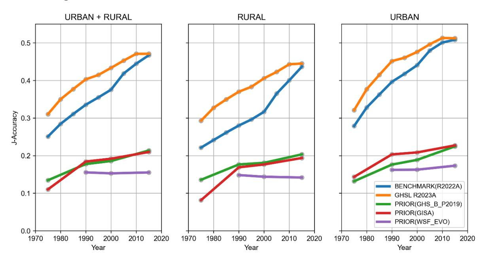

Figure 8 - Multi-temporal accuracy estimations in URBAN and RURAL domains, and across both domains. J-Accuracy is the generalized version of the Jaccard similarity index to the continuous numerical domain (Costa, 2022)

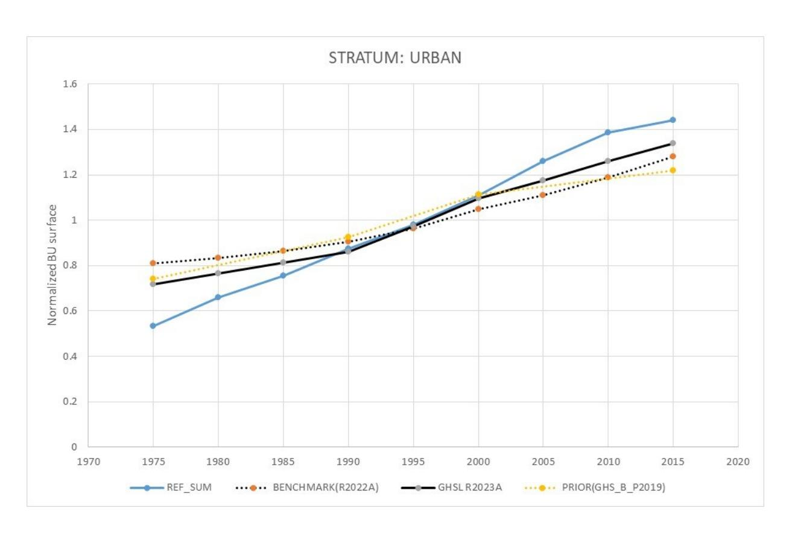

Figure 9 – Temporal evolution of the predicted and observed (REF\_SUM) normalized built-up surfaces in the considered test areas, URBAN 2020 stratum.

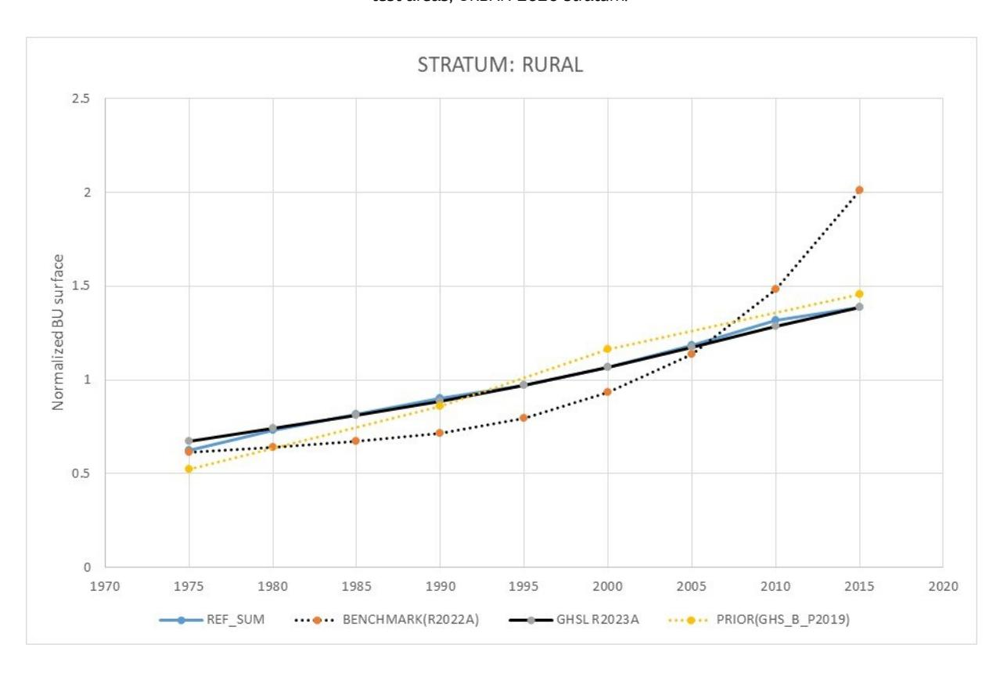

Figure 10- Temporal evolution of the predicted and observed (REF\_SUM) normalized built-up surfaces in the considered test areas, RURAL 2020 stratum.

#### **2.1.3 Improvements compared to the previous release**

*Improved input* 

Improved input data used in this release includes: improved satellite imagery and new prior knowledge and learning set.

Regarding improved satellite imagery we have included a more populated historical Landsat data series, a new epoch 2018 from Sentinel-2 with 10m spatial resolution vs. previous 30m Landsat data.

Regarding new prior knowledge and learning set we have included new BU labels as i) the GHS-BUILT-S2 R2020A11 that is a probability to the BU class spatial raster dataset derived from Sentinel-2 global image composite for reference year 2018 using Convolutional Neural Networks (GHS-S2Net; Corbane, Syrris, et al., 2020) and ii) the buildings and the settlement delineation derived from VHR imagery by Microsoft12 and Facebook13 open efforts, the new BU change map as included in the GHS-BUILT R2018A, GHS built-up spatial raster dataset, derived from Landsat, multi-temporal (1975-1990-2000-2014), and Land Use and other information included in National land use data (US NLCD14, EU CORINE15) and Volunteered geographical information by Open Street Map (OSM)16 on LANDUSE, ROADS, RIVER, STREAMS.

List of Countries where Microsoft building footprint data were available during the GHSL production: USA, Canada, Australia, Uganda, Tanzania, Nigeria, Kenya, Argentina, Bolivia, Brazil, Chile, Colombia, Ecuador, Guyana, Paraguay, Peru, Uruguay, Venezuela.

List of Countries where high resolution settlement layer (HRSL) data from Facebook were available during the GHSL production: Albania, Algeria, American Samoa, Andorra, Angola, Anguilla, Antigua and Barbuda, Argentina, Aruba, Australia, Austria, Bahamas, Bahrain, Bangladesh, Barbados, Belarus, Belgium, Belize, Benin, Bhutan, Bolivia, Bosnia and Herzegovina, Botswana, Brazil, British Virgin Islands, Brunei, Bulgaria, Burkina Faso, Burundi, Cabo Verde, Cambodia, Cameroon, Cayman Islands, Central African Republic, Chad, Chile, Colombia, Comoros, Congo, Cook Island, Costa Rica, Cote d'Ivoire, Croatia, Czechia, Democratic Republic of the Congo, Djibouti, Dominica, Dominican Republic, Ecuador, Egypt, El Salvador, Equatorial Guinea, Eritrea, Estonia, Federated States of Micronesia, Fiji, France, French Guiana, French Polynesia, Gabon, Gambia, Gibraltar, Georgia, Germany, Ghana, Greece, Grenada, Guadeloupe, Guam, Guatemala, Guinea, Guinea Bissau, Guyana, Haiti, Honduras, China Hong Kong Special Administrative Region, Hungary, Iceland, Indonesia, Iraq, Ireland, Italy, Jamaica, Japan, Jordan, Kazakhstan, Kenya, Kingdom of Eswatini, Kiribati, Kuwait, Kyrgyzstan, Laos, Latvia, Lebanon, Lesotho, Liberia, Libya, Liechtenstein, Lithuania, Luxemburg, China Macao Special Administrative Region, Madagascar, Malawi, Malaysia, Maldives, Mali, Malta, Marshall Islands, Mauritania, Mauritius, Mayotte, Mexico, Moldova, Monaco, Mongolia, Montserrat, Mozambique, Namibia, Naura, Nepal, Netherlands, New Caledonia, New Zealand, Nicaragua, Niger, Nigeria, The former Yugoslav Republic of Macedonia, Northern Mariana Islands, Oman, Palau, Panama, Papua New Guinea, Paraguay, Peru, Philippines, Poland, Portugal, Puerto Rico, Qatar, Reunion, Romania, Rwanda, Saint Kitts and Nevis, Saint Lucia, Saint Vincent and the Grenadines, Samoa, San Marino, Sao Tome and Principe, Saudi Arabia, Senegal, Serbia, Seychelles, Sierra Leone, Singapore, Slovakia, Slovenia, Solomon Islands, South Africa, South Korea, Spain, Sri Lanka, Suriname, Switzerland, Taiwan, Tajikistan, Thailand, Timor Leste, Togo, Tonga, Trinidad and Tobago, Tunisia, Turkmenistan, Turks and Caicos, Tuvalu, Uganda, United Arab Emirates, United Kingdom, United Republic of Tanzania, Uruguay, US Virgin Islands, United States of America, Uzbekistan, Vanuatu, Vietnam, Wallis and Futuna Islands, Zambia, Zimbabwe

#### *Improved Output*

Several improvements regarding the assessment of the built-up surfaces are included in this new release, as compared to the previous GHSL data. They may be summarized in the following points:

11 https://ghsl.jrc.ec.europa.eu/download.php?ds=buS2

12 https://github.com/microsoft/USBuildingFootprints

13 https://research.fb.com/downloads/high-resolution-settlement-layer-hrsl/

14 https://www.mrlc.gov/data

15 https://land.copernicus.eu/pan-european/corine-land-cover/clc2018

16 https://www.openstreetmap.org/

The accuracy of the Boolean prediction of BU vs. NBU surfaces has improved from the 75.47% of the previous R2019 to the 94.04% of the current R2022/R2023 using the same reference data. Accuracy improvements are remarkable in Asia and Africa [\(Table 5\)](#page-19-0). The WATER vs. LAND Boolean discrimination has also improved significantly as compared to the previous release R2019 [\(Table 5\)](#page-19-0).

The prediction of the continuous built-up surface improved considerably with a MAE at 100m-resolution that drops from 0.117 of the previous release to the 0.035 of the current release [\(Table 7\)](#page-20-1).

The new GHSL release includes a new classification of the non-residential (NRES) built-up surfaces that was not available in the previous releases. This feature will improve the usability of the new GHSL data in applications requiring a functional classification of the built environment.

The new GHSL release produces data at equal intervals in the time period 1975-2030 using a spatial-temporal interpolation process, while previous GHSL releases were reporting data in arbitrary points in time where satellite images were available. This will further enhance the usability of the new GHSL data in trend and projection analysis requiring consistent time intervals (see section [2.1\)](#page-10-1).

The accuracy of the multi-temporal built-up surface prediction of the new release R2023A has improved with respect to all previous releases (R2022, R2019) in all epochs [\(Figure 8\)](#page-22-1). The unrealistic built-up surface change rate in RURAL domain noticed in the R2022 has been fixed in the new release R2023 [\(Figure 10\)](#page-23-1).

Table 10 - Summary of the characteristics of the new GHS-BUILT data vs. the previous releases

| Data Characteristics                                                                                | GHS-BUILT R2018A                                                         | GHS-BUILT-S R2023A                                                                       |  |
|-----------------------------------------------------------------------------------------------------|--------------------------------------------------------------------------|------------------------------------------------------------------------------------------|--|
| Definition of the built-up class abstraction                                                        | INSPIRE "BUILDING" roofed structure above ground for any use | INSPIRE "BUILDING" roofed structure above ground for any use                    |  |
| Definition of the NRES vs. RES class abstraction                                                 | Not available                                                            | Derived from INSPIRE "residential" use definition                                     |  |
| Built-up surface : class                                                                            | Boolean                                                                  | Continuous                                                                               |  |
| Built-up surface : RES vs. NRES class                                                               | Not available                                                            | Boolean                                                                                  |  |
| Built-up surface : spatial resolution                                                               | 30m                                                                      | 10m                                                                                      |  |
| Built-up surface : observed epochs                                                                  | 4 (1975,1990,2000,2014)                                                  | 5 (1975,1990,2000,2014,2018)                                                             |  |
| Built-up surface : change map                                                                       | Pixel-based                                                              | Segment-based                                                                            |  |
| Building height : measurement                                                                       | Not available                                                            | Continuous                                                                               |  |
| Building height : spatial resolution                                                                | Not available                                                            | 100m                                                                                     |  |
| Building height : observed epoch                                                                    | Not available                                                            | 2018                                                                                     |  |
| Built-up surface : spatial resolution of the generalized grids                                   | 250m 1km                                                              | 100m 1km                                                                              |  |
| Built-up volume : spatial resolution of the generalized grids                                    | Not available                                                            | 100m 1km                                                                              |  |
| Equal-time-interval spatial-temporal interpolated grids of built-up surfaces and volume | Not available                                                            | 12 epochs (1975, 1980, 1985, 1990, 1995, 2000, 2005, 2010, 2015, 2020, 2025, 2030) |  |
| Future grids projections                                                                            | Not available                                                            | 2025 and 2030                                                                            |  |

#### **2.1.4 Input Data**

#### *2.1.4.1 Remotely sensed image data*

The remotely sensed image data supporting this GHSL release are collected by the Landsat and the Sentinel platforms, organized in five epochs: 1975, 1990, 2000, 2014, and 2018.

The Landsat data used in input include 35479 individual scenes organized in four epochs 1975, 1990, 2000, and 2014. The average absolute time tolerance of the image data collection time vs. the nominal time barycentre of the epoch is 2.0, 2.2, 1.2, and 0.8 years for the 1975, 1990, 2000, and 2014 epochs, respectively. The aggregated time precision of all the data in the four epochs is of 1.5 years. The empirical time barycentre for the epochs 1975, 1990, 2000, and 2014 is the year 1975.1, 1989.4, 2000.8, and 2013.2, respectively.

| Row Labels 🔻 | Count of YEAR | Average of YEAR | Average of ABS_Tim | neTolerance |
|--------------|---------------|-----------------|--------------------|-------------|
| <b>■1975</b> | 7355          | 1975.1          |                    | 2.0         |
| L1           | 4403          | 1973.4          |                    | 1.6         |
| L2           | 1880          | 1976.8          |                    | 1.8         |
| L3           | 1072          | 1979.3          |                    | 4.3         |
| <b>■1990</b> | 8011          | 1989.4          |                    | 2.2         |
| L4           | 258           | 1983.5          |                    | 6.5         |
| L5           | 7475          | 1989.4          |                    | 2.0         |
| L6           | 278           | 1994.3          |                    | 4.3         |
| □ 2000       | 9774          | 2000.8          |                    | 1.2         |
| L5           | 459           | 2004.7          |                    | 5.7         |
| L6           | 8827          | 2000.4          |                    | 0.7         |
| L7           | 488           | 2005.5          |                    | 5.5         |
| <b>2014</b>  | 10339         | 2013.2          |                    | 0.8         |
| L5           | 638           | 2009.6          |                    | 4.4         |
| L7           | 259           | 2009.5          |                    | 4.5         |
| L8           | 9442          | 2013.5          |                    | 0.5         |
| Grand Total  | 35479         | 1996.5          |                    | 1.5         |
|              |               |                 |                    |             |

Table 11 - Summary of the Landsat Image data used in input

The epoch 2018 is derived from the GHS\_composite\_S2\_L1C\_2017-2018\_GLOBE\_R2020A17 that represents a global, cloud-free pixel-based composite created from the Sentinel-2 data archive (Level L1C) available in Google Earth Engine18 for the period January 2017 - December 2018.

#### *2.1.4.2 High-level semantic abstraction data*

Several high-level semantic datasets are used in the process with the function of prior knowledge supporting the various phases of data classification to obtain BU surface fraction estimates, the historical change detection in the BU surfaces, and the land use classification of RES vs. NRES BU surfaces.

BU class abstraction labels: i) the GHS-BUILT-S2 R2020A19 that is a probability to the BU class spatial raster dataset derived from Sentinel-2 global image composite for reference year 2018 using Convolutional Neural Networks (GHS-S2Net) and ii) the buildings derived from VHR imagery by Microsoft20 and the settlement delineation from Facebook21 open efforts

20 https://github.com/microsoft/USBuildingFootprints

21 https://research.fb.com/downloads/high-resolution-settlement-layer-hrsl/

17 https://ghsl.jrc.ec.europa.eu/download.php?ds=compositeS2

18 https://developers.google.com/earth-engine/datasets/catalog/COPERNICUS\_S2

19 https://ghsl.jrc.ec.europa.eu/download.php?ds=buS2

Multi-temporal assessments: i) the BU change map GHS built-up spatial raster dataset, derived from Landsat, multi-temporal (1975-1990-2000-2014) of the GHSL R2019 (Corbane et al., 2019), ii) GISA the Global Impervious Surface Area (Huang et al., 2022), and WSF\_EVO the World Settlement Footprint Evolution product (Marconcini et al., 2021).

Land Use and other: information included in National land use data (US NLUD22, EU CORINE23) and Volunteered geographical information by Open Street Map (OSM)24 on LANDUSE, ROADS, RIVER, STREAMS

#### **2.1.5 Technical Details**

*Author*: Pesaresi, Martino; Politis Panagiotis *Product name*: GHS-BUILT-S\_GLOBE\_R2023A

*Spatial extent*: Global

*Temporal extent*: from 1975 to 2030, 5 years interval

*Coordinate Systems*: World Mollweide (ESRI:54009), WGS84 (EPSG:4326)

Spatial resolution available: 10 m, 100 m, and 1 km, 3ss, 30ss

*Encoding*: integer (Byte, UInt16, UInt32), unit: built square meters in the grid cell

*Data organisation*: GeoTIFF file (10 m, 100m, 1km, 3 ss, 30 ss) with overview images (OVR). Data tiles of 100x100 km size in GeoTIFF format (10 m, 100 m, 1 km, 3 ss, 30 ss). Tile schema in shapefile format

[Table 12](#page-27-1) outlines the technical characteristics of the datasets released in this data package.

Disclaimer: the re-projection of the World Mollweide version of the GHS-BUILT-S\_GLOBE\_R2023A to coordinate systems requires specific technical knowledge. No responsibility is taken for workflows developed independently by users.

Table 12 - Technical details of the datasets in GHS-BUILT-S\_GLOBE\_R2023A

| GHS-BUILT-S_GLOBE_R2023A                                                  |                                                                                                           |                                     |  |  |
|---------------------------------------------------------------------------|-----------------------------------------------------------------------------------------------------------|-------------------------------------|--|--|
| ID                                                                        | Description                                                                                               | Resolution (projection)          |  |  |
| GHS_BUILT_S_E <epoch>_GLOBE_R2023A_<proj>_<res>_V1_0</res></proj></epoch> | BU surface <epoch> 1975-2030; <proj> 54009, 4326; <res> 100, 1000, 3ss, 30ss</res></proj></epoch> | 100 m, 1000 m                       |  |  |
|                                                                           | Encoding: UInt16 (100 m), UInt32 (1 km)                                                                | World Mollweide (ESRI:54009)     |  |  |
|                                                                           | Values range: 0-10000 (100 m, 3 ss), 0-1000000 (1 km, 30 ss)                                           | 3 ss, 30 ss WGS84 (EPSG:4326) |  |  |
|                                                                           | NoData: 65535 (100 m), empty (3 ss), 4294967295 (1000 m), empty (30 ss)                                |                                     |  |  |
| GHS_BUILT_S_E2018_GLOBE_R2023A_54009_10_V1_0                              | BUFRAC at 10m spatial resolution for E2018                                                             |                                     |  |  |
|                                                                           | Encoding: Byte                                                                                            | 10 m World Mollweide             |  |  |
|                                                                           | Values range: 0-100                                                                                       | (ESRI:54009)                        |  |  |
|                                                                           | NoData: 255                                                                                               |                                     |  |  |

23 https://land.copernicus.eu/pan-european/corine-land-cover/clc2018

22 https://www.mrlc.gov/data

24 https://www.openstreetmap.org/

| GHS-BUILT-S_NRES_GLOBE_R2023A                                                  |                                                                                                                                                                                                                                                                                                                                   |                                                                                         |  |
|--------------------------------------------------------------------------------|-----------------------------------------------------------------------------------------------------------------------------------------------------------------------------------------------------------------------------------------------------------------------------------------------------------------------------------|-----------------------------------------------------------------------------------------|--|
| ID                                                                             | Description                                                                                                                                                                                                                                                                                                                       | Resolution (projection)                                                              |  |
| GHS_BUILT_S_NRES_E <epoch>_GLOBE_R2023A_<proj>_<res>_V1_0</res></proj></epoch> | Non-residential BU surface <epoch> 1975-2030; <proj> 54009, 4326; <res> 100m, 1000, 3ss, 30ss Encoding: UInt16 (100 m), UInt32 (1 km) Values range: 0-10000 (100 m, 3 ss), 0- 1000000 (1 km, 30 ss) NoData: 65535 (100 m), empty (3 ss), 4294967295 (1000 m), empty (30 ss),</res></proj></epoch> | 100 m, 1000 m World Mollweide (ESRI:54009) 3 ss, 30 ss WGS84 (EPSG:4326) |  |
| GHS_BUILT_S_NRES_E2018_GLOBE_R2023A_54009_10_V1_0                              | NRES 10m (boolean) at 10m spatial resolution for E2018 Encoding: Byte Values range: 0:non-NRES ; 1:NRES NoData: 255                                                                                                                                                                                                   | 10 m World Mollweide (ESRI:54009)                                                 |  |

#### **2.1.6 Summary statistics**

Table 13 - Summary statistics of predicted surface (square meters) of built-up total (BUTOT) and the built-up nonresidential (BUNRES) component, per years of prediction

| YEAR | BUTOT           | BUNRES         | NRES SHARE |
|------|-----------------|----------------|------------|
| 1975 | 173,579,688,013 | 14,851,659,436 | 8.56%      |
| 1980 | 194,287,591,836 | 15,786,940,488 | 8.13%      |
| 1985 | 220,083,865,086 | 16,824,775,584 | 7.64%      |
| 1990 | 249,833,100,538 | 17,952,331,271 | 7.19%      |
| 1995 | 280,112,957,342 | 20,040,927,733 | 7.15%      |
| 2000 | 315,676,641,605 | 22,572,549,796 | 7.15%      |
| 2005 | 345,785,691,160 | 24,500,768,168 | 7.09%      |
| 2010 | 382,248,138,896 | 26,910,963,662 | 7.04%      |
| 2015 | 422,815,687,372 | 29,654,448,253 | 7.01%      |
| 2020 | 464,586,276,041 | 32,175,346,993 | 6.93%      |
| 2025 | 491,637,335,418 | 34,010,908,125 | 6.92%      |
| 2030 | 509,277,184,552 | 35,391,231,420 | 6.95%      |

#### **2.1.7 How to cite**

#### Dataset:

*Pesaresi, Martino; Politis, Panagiotis (2023): GHS-BUILT-S R2023A - GHS built-up surface grid, derived from Sentinel2 composite and Landsat, multitemporal (1975-2030). European Commission, Joint Research Centre (JRC) [Dataset] doi: 10.2905/9F06F36F-4B11-47EC-ABB0-4F8B7B1D72EA PID: http://data.europa.eu/89h/9f06f36f-4b11-47ec-abb0-4f8b7b1d72ea*

#### Concept & Methodology:

*Pesaresi, Martino, Marcello Schiavina, Panagiotis Politis, Sergio Freire, Katarzyna Krasnodębska, Johannes H. Uhl, Alessandra Carioli, et al. (2024). Advances on the Global Human Settlement Layer by Joint Assessment of Earth Observation and Population Survey Data. International Journal of Digital Earth 17 (1). doi:10.1080/17538947.2024.2390454*

Essential methodological background:

*Pesaresi M, Corban C, Julea A, Florczyk A, Syrris V, Soille P. Assessment of the Added-Value of Sentinel-2 for Detecting Built-up Areas. Remote Sensing 8 (4); 2016. p. 299. JRC99996*

*Pesaresi M; Syrris V; Julea A. A New Method for Earth Observation Data Analytics Based on Symbolic Machine Learning. Remote Sensing 8 (5); 2016. p. 399. JRC99747*

*Pesaresi M. Global fine-scale information layers: the need of a paradigm shift. In: Soille P, Marchetti PG, editors. Proceedings of the 2014 conference on Big Data from Space (BiDS`14). Luxembourg (Luxembourg): Publications Office of the European Union; 2014. p. 8-11. JRC92345*

*Pesaresi M, Ouzounis G, Gueguen L. A new compact representation of morphological profiles: report on first massive VHR image processing at the JRC. In Conference Proceedings: Sylvia S. Shen, Paul E. Lewis, editors. Algorithms and Technologies for Multispectral, Hyperspectral, and Ultraspectral Imagery XVIII. Vol. 8390. SPIE; 2012. JRC70542*

*Gueguen L, Soille P, Pesaresi M. A New Built-Up Presence Index Based On Density of Corners. In Conference Proceedings: Geoscience and Remote Sensing Symposium (IGARSS), 2012 IEEE International. Piscataway (USA): IEEE; 2012. p. 5398-5401. JRC68582*

*Ouzounis G, Pesaresi M, Soille P. Differential area profiles: decomposition properties and efficient computation. IEEE Transactions on Pattern Analysis and Machine Intelligence 34 (8); 2012. p. 1533-1548. JRC59388*

*Pesaresi M, Gerhardinger A, Kayitakire F. A Robust Built-up Area Presence Index by Anisotropic Rotation-invariant Textural Measure. IEEE Journal of Selected Topics in Applied Earth Observations and Remote Sensing 1 (3); 2008. p. 180-192. JRC37845*

*Pesaresi M, Benediktsson J. A New Approach for the Morphological Segmentation of High-Resolution Satellite Imagery.. IEEE Transactions on Geoscience and RS 39 (2); 2001. JRC19264* 

# **2.2 GHS-BUILT-H R2023A - GHS building height, derived from AW3D30, SRTM30, and Sentinel-2 composite (2018)**

This spatial raster dataset depicts the distribution of the building heights generalized at the resolution of 100m, and referred to the year 2018. The input data used to predict the building heights are the ALOS Global Digital Surface Model "ALOS World 3D - 30m (AW3D30)25, the NASA Shuttle Radar Topographic Mission data - 30m (SRTM30)26 , and the Sentinel-2 global pixel based image composite from L1C data for the period 2017-201827 that is the support of the year 2018 in this release.

The first global attempt to produce an estimate of the building heights was done in the so called "GHSL\_LABEL" product as described in (Pesaresi, Ehrlich, et al., 2016) and tested in (Bechtel et al., 2018) in support to the urban local climate zones (LCZ) taxonomy. The use of the global DEM for prediction of building heights using linear regression techniques was introduced in (Pesaresi et al., 2021). In the application of those techniques included in the GHS-BUILT-H R2023A, the building heights are first predicted from the filtering of a composite of the AW3D30 and SRTM30 global DEMs, by generalization of the linear regression to a multiple-objective case targeting different estimates of 100m-res generalized vertical components of built surfaces: Average of the Net Building Height (ANBH), Average of the Gross Building Height (AGBH) and volume total (VOL) that are linked by analytical relations. They independently estimate the same variable (ANBH) from different filtering of the same DEMs and different regression coefficients, in conjunction with the BUSURF included in the GHS-BUILT-S R2023A data. The different independent estimates of the ANBH generated by the global DEMs are composed by minimization of the expected error, and they are used to estimate the linear regression coefficient predicting the ANBH from the density of shadow markers as observed in 10m-resolution Sentinel-2 image data, of each specific data tile (100×100km). These last ANBH predictions from the S2 data are used to update the final ANBH prediction included in this GHSL release.

#### **2.2.1 Definitions**

The built-up volume (BUVOL) is the volume of the built space above ground, expressed in cubic meters Be , the surface of the grid sample x

The Average of the Net Building Height of the sample () is defined as:

 = / = ∗

The Average of the Gross Building Height of the sample x (AGBHx) is defined as:

 = / = ∗

Developing the above, the can be derived as

/ = / =

#### **Examples**

Let assume a sample x of a grid with 100m of spatial resolution, then Sx = 10,000 square meters. The builtup surface in this sample it is predicted as BUSURFx = 750 square meters, corresponding to a BUFRACx = 0.075. Moreover, in the same sample the ANBHx is predicted as ANBHx = 11.5 meters.

The total built-up volume in this sample will be BUVOLx = BUSURFx \* ANBHx = 750 \* 11.5 = 8625 cubic meters. In the same sample x, the AGBHx will be predicted as 0.8625 meters.

The total built-up volume in this sample will be BUVOLx = Sx \* AGBHx = 10,000 \* 0.865 = 8625 cubic meters. While the ratio AGBHx/ANBHx = 0.075, corresponds to the BUFRACx in the same sample x

25 [https://www.eorc.jaxa.jp/ALOS/en/dataset/aw3d30/aw3d30\\_e.htm](https://www.eorc.jaxa.jp/ALOS/en/dataset/aw3d30/aw3d30_e.htm)

26 [https://cmr.earthdata.nasa.gov/search/concepts/C1000000240-LPDAAC\\_ECS.html](https://cmr.earthdata.nasa.gov/search/concepts/C1000000240-LPDAAC_ECS.html)

27 GHS-composite-S2 R2020A<https://ghsl.jrc.ec.europa.eu/download.php?ds=compositeS2>

#### **2.2.2 Input data**

The input data for the GHS-BUILT-H R2023A are: the ALOS Global Digital Surface Model "ALOS World 3D - 30m" (AW3D30), the NASA Shuttle Radar Topographic Mission data - 30m (SRTM30), and the global, pixel-based Sentinel-2 image composite from L1C data for the period 2017-2018.

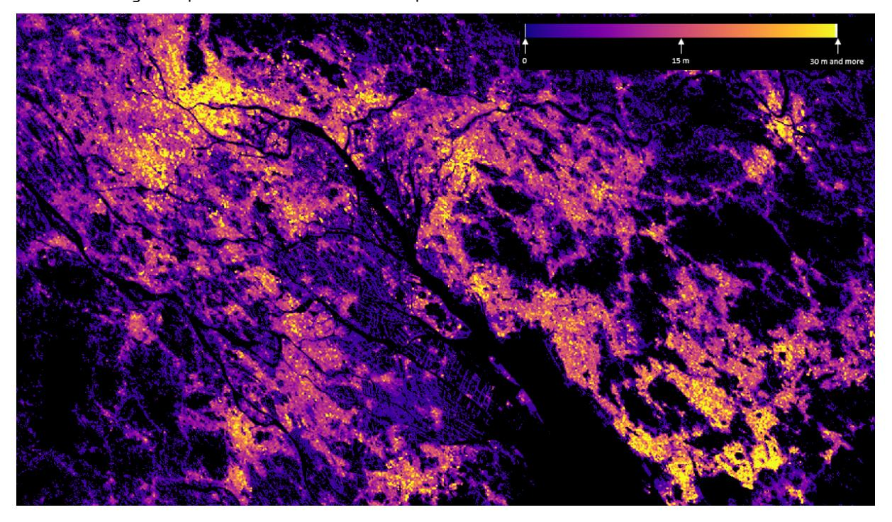

Figure 11 – Average building height (ANBH 100m) estimates in Guangzhou - Shenzhen (China).

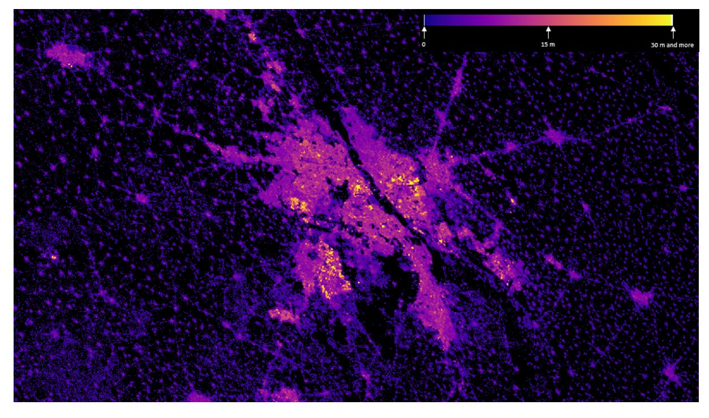

Figure 12 - Average building height (ANBH 100m) estimates in Delhi (India).

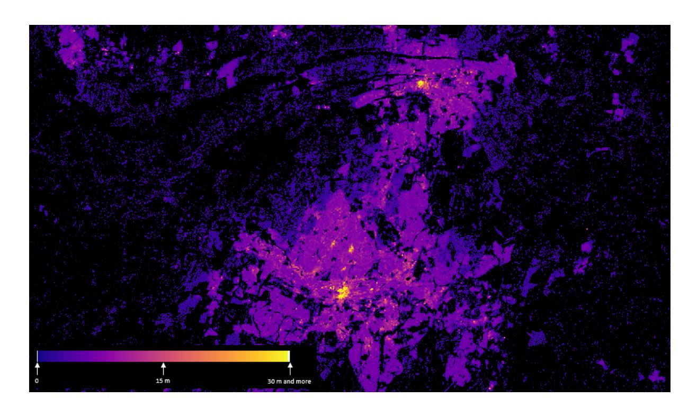

Figure 13 - Average building height (ANBH 100m) estimates in Pretoria – Johannesburg (South Africa).

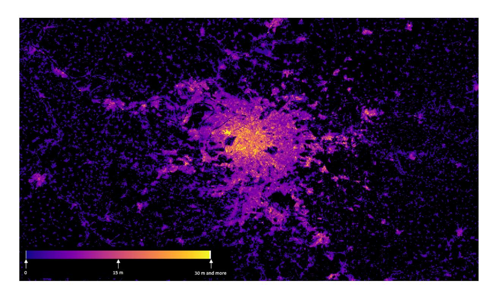

Figure 14 - Average building height (ANBH 100m) estimates in Paris (France).

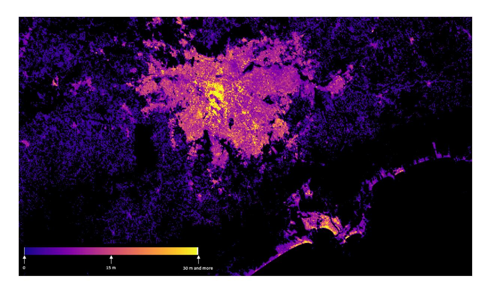

Figure 15 - Average building height (ANBH 100m) estimates in Sao Paulo – Santos (Brazil).

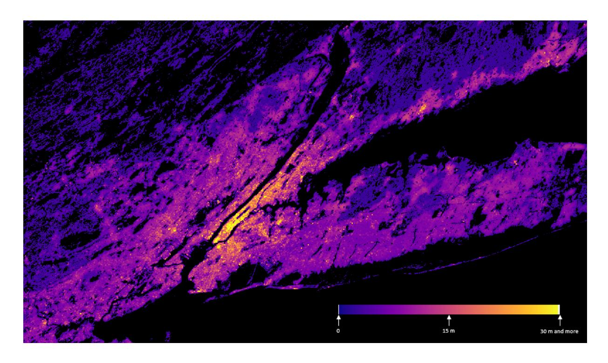

Figure 16 - Average building height (ANBH 100m) estimates in New York (United States).

#### **2.2.3 Expected errors**

The estimation of the GHS-BUILT-H error is currently ongoing, and will be delivered in a peer-reviewed publication, possibly in 2023-2024. A comparison with independent measurements not used in the model development and collected in 38 functional urban areas in the frame of the Copernicus Land Monitoring Service28, Urban Atlas, Building Height 2012, set the expected errors in predicting the ANBH included in this release as 1.97m of Mean Absolute Error (MAE) and 3.55m of Root Mean Square Error (RMSE), with a standard deviation of 0.87 and 1.25 meters, respectively.

Table 14 – Errors of ANBH 100m in predicting the Copernicus Building Height generalized at the same spatial resolution

| TEST CASE IS001L1_REYKJAVIK_UA2012_DHM_v010 ME001L1_PODGORICA_UA2012_DHM_v010 XK001L1_PRISTINA_UA2012_DHM_v010 RS001L1_BEOGRAD_UA2012_DHM_v010 AL001L1_TIRANA_UA2012_DHM_v010 NO001L2_OSLO_UA2012_DHM_v010 SI001L1_LJUBLJANA_UA2012_DHM_v010 BA001L1_SARAJEVO_UA2012_DHM_v010 SE001L1_STOCKHOLM_UA2012_DHM_v010 SK001L1_BRATISLAVA_UA2012_DHM_v010 HR001L2_GRAD_ZAGREB_UA2012_DHM_v010 IE001L1_DUBLIN_UA2012_DHM_v010 FI001L2_HELSINKI_UA2012_DHM_v010 CY001L1_LEFKOSIA_UA2012_DHM_v010 BG001L2_SOFIA_UA2012_DHM_v010 CH004L1_BERN_UA2012_DHM_v010 DK001L2_KOBENHAVN_UA2012_DHM_v020 UK001L2_LONDON_UA2012_DHM_v020 LT001L1_VILNIUS_UA2012_DHM_v010 MK001L1_SKOPJE_UA2012_DHM_v010 HU001L2_BUDAPEST_UA2012_DHM_v010 IT001L2_ROMA_UA2012_DHM_v010 DE001L1_BERLIN_UA2012_DHM_v020 AT001L2_WIEN_UA2012_DHM_v010 EL001L1_ATHINA_UA2012_DHM_v020 LV001L0_RIGA_UA2012_DHM_v010 ES001L2_MADRID_UA2012_DHM_v020 CZ001L1_PRAHA_UA2012_DHM_v010 NL002L2_AMSTERDAM_UA2012_DHM_v020 EE001L1_TALLINN_UA2012_DHM_v010 | Observed ANBH max 43.17 54.48 43.00 168.91 64.53 55.60 42.90 82.18 62.81 77.00 66.61 43.98 50.34 25.79 119.71 70.00 124.43 131.60 165.00 96.58 60.19 85.57 77.00 151.97 68.60 122.13 264.00 57.00 120.00 112.20 | Observed ANBH average 5.58 5.79 7.00 6.85 6.24 6.81 6.33 6.55 7.51 8.52 7.84 6.63 7.33 7.33 9.59 8.17 7.14 7.66 8.14 8.28 8.86 10.36 9.42 9.79 9.96 9.61 12.24 9.76 9.08 8.32 | Predicted MAE Observed vs. 0.24 0.33 0.59 0.69 0.72 1.02 1.05 1.37 1.39 1.39 1.43 1.43 1.65 1.65 1.67 1.79 1.82 2.07 2.08 2.10 2.13 2.24 2.26 2.29 2.32 2.37 2.39 2.41 2.44 2.49 | Predicted RMSE Observed vs. 1.00 1.22 1.87 2.18 1.78 2.30 2.19 2.74 2.97 3.29 2.85 2.48 2.98 2.68 3.54 3.66 3.23 3.36 4.07 4.11 3.37 4.09 3.95 3.90 3.53 4.79 4.70 4.05 4.31 4.33 | Number of Samples 103182 137558 51457 177645 147009 49706 26719 33597 131914 36005 63172 92095 78704 20169 44083 13714 58052 182840 38955 19196 51940 127649 111079 42863 61187 29770 87854 48665 39733 15452 |
|---------------------------------------------------------------------------------------------------------------------------------------------------------------------------------------------------------------------------------------------------------------------------------------------------------------------------------------------------------------------------------------------------------------------------------------------------------------------------------------------------------------------------------------------------------------------------------------------------------------------------------------------------------------------------------------------------------------------------------------------------------------------------------------------------------------------------------------------------------------------------------------------------------------------------------------------------------------------------------------------------------------------------------------------------------------------------------------------------|-----------------------------------------------------------------------------------------------------------------------------------------------------------------------------------------------------------------------------------------------------------------------------------------------------------|----------------------------------------------------------------------------------------------------------------------------------------------------------------------------------------------------------------------------------------------------------------------------|-------------------------------------------------------------------------------------------------------------------------------------------------------------------------------------------------------------------------------------------------------------------------------|--------------------------------------------------------------------------------------------------------------------------------------------------------------------------------------------------------------------------------------------------------------------------------|---------------------------------------------------------------------------------------------------------------------------------------------------------------------------------------------------------------------------------------------------------------------------------------------------------|
|                                                                                                                                                                                                                                                                                                                                                                                                                                                                                                                                                                                                                                                                                                                                                                                                                                                                                                                                                                                                                                                                                                   |                                                                                                                                                                                                                                                                                                           |                                                                                                                                                                                                                                                                            |                                                                                                                                                                                                                                                                               |                                                                                                                                                                                                                                                                                |                                                                                                                                                                                                                                                                                                         |
|                                                                                                                                                                                                                                                                                                                                                                                                                                                                                                                                                                                                                                                                                                                                                                                                                                                                                                                                                                                                                                                                                                   |                                                                                                                                                                                                                                                                                                           |                                                                                                                                                                                                                                                                            |                                                                                                                                                                                                                                                                               |                                                                                                                                                                                                                                                                                |                                                                                                                                                                                                                                                                                                         |
|                                                                                                                                                                                                                                                                                                                                                                                                                                                                                                                                                                                                                                                                                                                                                                                                                                                                                                                                                                                                                                                                                                   |                                                                                                                                                                                                                                                                                                           |                                                                                                                                                                                                                                                                            |                                                                                                                                                                                                                                                                               |                                                                                                                                                                                                                                                                                |                                                                                                                                                                                                                                                                                                         |
|                                                                                                                                                                                                                                                                                                                                                                                                                                                                                                                                                                                                                                                                                                                                                                                                                                                                                                                                                                                                                                                                                                   |                                                                                                                                                                                                                                                                                                           |                                                                                                                                                                                                                                                                            |                                                                                                                                                                                                                                                                               |                                                                                                                                                                                                                                                                                |                                                                                                                                                                                                                                                                                                         |
|                                                                                                                                                                                                                                                                                                                                                                                                                                                                                                                                                                                                                                                                                                                                                                                                                                                                                                                                                                                                                                                                                                   |                                                                                                                                                                                                                                                                                                           |                                                                                                                                                                                                                                                                            |                                                                                                                                                                                                                                                                               |                                                                                                                                                                                                                                                                                |                                                                                                                                                                                                                                                                                                         |
|                                                                                                                                                                                                                                                                                                                                                                                                                                                                                                                                                                                                                                                                                                                                                                                                                                                                                                                                                                                                                                                                                                   |                                                                                                                                                                                                                                                                                                           |                                                                                                                                                                                                                                                                            |                                                                                                                                                                                                                                                                               |                                                                                                                                                                                                                                                                                |                                                                                                                                                                                                                                                                                                         |
|                                                                                                                                                                                                                                                                                                                                                                                                                                                                                                                                                                                                                                                                                                                                                                                                                                                                                                                                                                                                                                                                                                   |                                                                                                                                                                                                                                                                                                           |                                                                                                                                                                                                                                                                            |                                                                                                                                                                                                                                                                               |                                                                                                                                                                                                                                                                                |                                                                                                                                                                                                                                                                                                         |
| LU001L1_LUXEMBOURG_UA2012_DHM_v010                                                                                                                                                                                                                                                                                                                                                                                                                                                                                                                                                                                                                                                                                                                                                                                                                                                                                                                                                                                                                                                                | 51.71                                                                                                                                                                                                                                                                                                     | 9.46                                                                                                                                                                                                                                                                       | 2.64                                                                                                                                                                                                                                                                          | 4.12                                                                                                                                                                                                                                                                           | 5253                                                                                                                                                                                                                                                                                                    |
| PT001L2_LISBOA_UA2012_DHM_v010                                                                                                                                                                                                                                                                                                                                                                                                                                                                                                                                                                                                                                                                                                                                                                                                                                                                                                                                                                                                                                                                    | 78.27                                                                                                                                                                                                                                                                                                     | 8.39                                                                                                                                                                                                                                                                       | 2.71                                                                                                                                                                                                                                                                          | 4.23                                                                                                                                                                                                                                                                           | 70512                                                                                                                                                                                                                                                                                                   |
| PL001L2_WARSZAWA_UA2012_DHM_v010                                                                                                                                                                                                                                                                                                                                                                                                                                                                                                                                                                                                                                                                                                                                                                                                                                                                                                                                                                                                                                                                  | 113.91                                                                                                                                                                                                                                                                                                    | 9.01                                                                                                                                                                                                                                                                       | 2.82                                                                                                                                                                                                                                                                          | 4.31                                                                                                                                                                                                                                                                           | 55279                                                                                                                                                                                                                                                                                                   |
| FR001L1_PARIS_UA2012_DHM_v010                                                                                                                                                                                                                                                                                                                                                                                                                                                                                                                                                                                                                                                                                                                                                                                                                                                                                                                                                                                                                                                                     | 174.22                                                                                                                                                                                                                                                                                                    | 9.71                                                                                                                                                                                                                                                                       | 2.85                                                                                                                                                                                                                                                                          | 4.57                                                                                                                                                                                                                                                                           | 134717                                                                                                                                                                                                                                                                                                  |
| MT001L1_VALLETTA_UA2012_DHM_v010                                                                                                                                                                                                                                                                                                                                                                                                                                                                                                                                                                                                                                                                                                                                                                                                                                                                                                                                                                                                                                                                  | 39.16                                                                                                                                                                                                                                                                                                     | 8.27                                                                                                                                                                                                                                                                       | 2.97                                                                                                                                                                                                                                                                          | 4.10                                                                                                                                                                                                                                                                           | 7200                                                                                                                                                                                                                                                                                                    |
| BE001L2_BRUXELLES_BRUSSEL_UA2012_DHM_v010                                                                                                                                                                                                                                                                                                                                                                                                                                                                                                                                                                                                                                                                                                                                                                                                                                                                                                                                                                                                                                                         | 86.94                                                                                                                                                                                                                                                                                                     | 10.48                                                                                                                                                                                                                                                                      | 3.17                                                                                                                                                                                                                                                                          | 4.82                                                                                                                                                                                                                                                                           | 20449                                                                                                                                                                                                                                                                                                   |
| RO001L1_BUCURESTI_UA2012_DHM_v010                                                                                                                                                                                                                                                                                                                                                                                                                                                                                                                                                                                                                                                                                                                                                                                                                                                                                                                                                                                                                                                                 | 209.00                                                                                                                                                                                                                                                                                                    | 8.67                                                                                                                                                                                                                                                                       | 3.84                                                                                                                                                                                                                                                                          | 5.73                                                                                                                                                                                                                                                                           | 27442                                                                                                                                                                                                                                                                                                   |
| TR001L1_ANKARA_UA2012_DHM_v010                                                                                                                                                                                                                                                                                                                                                                                                                                                                                                                                                                                                                                                                                                                                                                                                                                                                                                                                                                                                                                                                    | 162.65                                                                                                                                                                                                                                                                                                    | 12.06                                                                                                                                                                                                                                                                      | 3.92                                                                                                                                                                                                                                                                          | 7.57                                                                                                                                                                                                                                                                           | 72799                                                                                                                                                                                                                                                                                                   |
| SUM                                                                                                                                                                                                                                                                                                                                                                                                                                                                                                                                                                                                                                                                                                                                                                                                                                                                                                                                                                                                                                                                                               |                                                                                                                                                                                                                                                                                                           |                                                                                                                                                                                                                                                                            |                                                                                                                                                                                                                                                                               |                                                                                                                                                                                                                                                                                | 2515615                                                                                                                                                                                                                                                                                                 |
| Average                                                                                                                                                                                                                                                                                                                                                                                                                                                                                                                                                                                                                                                                                                                                                                                                                                                                                                                                                                                                                                                                                           |                                                                                                                                                                                                                                                                                                           |                                                                                                                                                                                                                                                                            | 1.97                                                                                                                                                                                                                                                                          | 3.55                                                                                                                                                                                                                                                                           |                                                                                                                                                                                                                                                                                                         |
| Standard Deviation                                                                                                                                                                                                                                                                                                                                                                                                                                                                                                                                                                                                                                                                                                                                                                                                                                                                                                                                                                                                                                                                                |                                                                                                                                                                                                                                                                                                           |                                                                                                                                                                                                                                                                            | 0.87                                                                                                                                                                                                                                                                          | 1.25                                                                                                                                                                                                                                                                           |                                                                                                                                                                                                                                                                                                         |

28 <https://land.copernicus.eu/local/urban-atlas/building-height-2012>

### **2.2.4 Technical Details**

*Author*: Pesaresi, Martino; Politis, Panagiotis *Product name*: GHS-BUILT-H\_GLOBE\_R2023A

*Spatial extent*: Global *Temporal extent*: 2018

*Coordinate Systems*: World Mollweide (ESRI:54009), , WGS84 (EPSG:4326)

*Spatial resolution available:* 100m, 3ss

*Encoding*: Values are expressed as decimals (Float32) reporting about the average height of the built surfaces in meters.

*Data organisation* (\*): GeoTIFF file (100m, 3ss) with overview images (OVR). Data tiles of 100×100 km size in GeoTIFF format (100 m, 3ss). Tile schema in shapefile format

[Table 15](#page-35-2) outlines the technical characteristics of the datasets released in this data package.

Table 15 - Technical details of the datasets in GHS-BUILT-H\_GLOBE\_R2023A

| GHS-BUILT-H_GLOBE_R2023A                                            |                                                                                                          |                                                 |
|---------------------------------------------------------------------|----------------------------------------------------------------------------------------------------------|-------------------------------------------------|
| ID                                                                  | Description                                                                                              | Resolution (Projection/Coordinate system) |
| GHS_BUILT_H_AGBH_E2018_GLOBE_R2023A_ <proj>_<res>_V1_0</res></proj> | Average of the Gross Building Height AGBH 2018 <proj> 54009, 4326; <res> 100, 3ss</res></proj> | 100 m World Mollweide (ESRI:54009)        |
|                                                                     | Encoding: Float32 NoData: 255 (100 m), empty (3 ss)                                                   | 3 ss WGS84 (EPSG:4326)                       |

| GHS-BUILT-H_ANBH_GLOBE_R2023A                                       |                                                                                                        |                                                 |  |
|---------------------------------------------------------------------|--------------------------------------------------------------------------------------------------------|-------------------------------------------------|--|
| ID                                                                  | Description                                                                                            | Resolution (Projection/Coordinate system) |  |
| GHS_BUILT_H_ANBH_E2018_GLOBE_R2023A_ <proj>_<res>_V1_0</res></proj> | Average of the Net Building Height ANBH 2018 <proj> 54009, 4326; <res> 100, 3ss</res></proj> | 100 m World Mollweide (ESRI:54009)        |  |
|                                                                     | Encoding: Float32 NoData: 255 (100 m), empty (3 ss)                                                 | 3 ss WGS84 (EPSG:4326)                       |  |

#### **2.2.5 How to cite**

#### Dataset:

*Pesaresi, Martino; Politis, Panagiotis (2023): GHS-BUILT-H R2023A - GHS building height, derived from AW3D30, SRTM30, and Sentinel2 composite (2018). European Commission, Joint Research Centre (JRC) [Dataset] doi: 10.2905/85005901-3A49-48DD-9D19-6261354F56FE PID: http://data.europa.eu/89h/85005901-3a49- 48dd-9d19-6261354f56fe*

Concept & Methodology:

*Pesaresi, Martino, Marcello Schiavina, Panagiotis Politis, Sergio Freire, Katarzyna Krasnodębska, Johannes H. Uhl, Alessandra Carioli, et al. (2024). Advances on the Global Human Settlement Layer by Joint Assessment of Earth Observation and Population Survey Data. International Journal of Digital Earth 17 (1). doi:10.1080/17538947.2024.2390454*

Essential methodological background:

*Pesaresi M., Corbane C., Ren C., and Edward N. (2021) Generalized Vertical Components of built-up areas from global Digital Elevation Models by multi-scale linear regression modelling. PLOS ONE 16, e0244478, doi.org/10.1371/journal.pone.0244478*

*Pesaresi M, Ehrlich D, Ferri S, Florczyk A, Carneiro Freire S, Halkia S, Julea A, Kemper T, Soille P, Syrris V. Operating procedure for the production of the Global Human Settlement Layer from Landsat data of the epochs 1975, 1990, 2000, and 2014. EUR 27741. Luxembourg (Luxembourg): Publications Office of the European Union; 2016. JRC97705*

*Bechtel, B., Pesaresi, M., Florczyk, A. and Mills, G., Beyond built-up – information on the internal makeup of urban areas, 2017, ISBN 978-1-138-05460-8, JRC107558*

# **2.3 GHS-BUILT-V R2023A - GHS built-up volume spatial raster datasets derived from joint assessment of Sentinel-2, Landsat, and global DEM data, for 1975- 2030 (5yrs interval)**

This spatial raster dataset depicts the distribution of built-up volumes, expressed as number of cubic meters. The data reports about the total built-up volume and the built-up volume allocated to dominant nonresidential (NRES) uses. Data are spatial-temporal interpolated from 1975 to 2030 in 5 year intervals.

The data is made by application of the formula: = ∗ , where:

the ANBHx is the GHS-BUILT-H R2023A - GHS building height, derived from AW3D30, SRTM30, and Sentinel-2 composite (2018),

the BUSURFx is the GHS-BUILT-S R2023A - GHS built-up surface spatial raster dataset, derived from Sentinel-2 composite and Landsat, multitemporal (1975-2030).

#### **2.3.1 Input Data**

GHS-BUILT-H R2023A - GHS building height, derived from AW3D30, SRTM30, and Sentinel-2 composite (2018)

GHS-BUILT-S R2023A - GHS built-up surface spatial raster dataset, derived from Sentinel-2 composite and Landsat, multitemporal (1975-2030).

#### **2.3.2 Technical Details**

*Author*: Pesaresi, Martino; Politis Panagiotis

*Product name*: GHS-BUILT-V\_GLOBE\_R2023A

*Spatial extent*: Global

*Temporal extent*: from 1975 to 2030, 5 year intervals

*Coordinate Systems*: World Mollweide (ESRI:54009), WGS84 (EPSG:4326)

*Spatial resolution available*: 100 m, 1 km, 3 ss, 30 ss

*Encoding*: integers (UInt32), unit: built cubic meters in the grid cell

*Data organisation* (\*): Global GeoTIFF file (100m, 1km, 3 ss, 30 ss) with overview images (OVR). Data tiles of 100x100 km size in GeoTIFF format (100 m, 1 km, 3 ss, 30 ss). Tile schema in shapefile format

Disclaimer: the re-projection of the World Mollweide version of the GHS-BUILT-V\_GLOBE\_R2023A to coordinate systems requires specific technical knowledge. No responsibility is taken for workflows developed independently by users.

Table 16 - Technical details of the datasets in GHS-BUILT-V\_GLOBE\_R2023A

| GHS-BUILT-V_GLOBE_R2023A                                                  |                                                                                                                                                                                                                       |                                                                                         |
|---------------------------------------------------------------------------|-----------------------------------------------------------------------------------------------------------------------------------------------------------------------------------------------------------------------|-----------------------------------------------------------------------------------------|
| ID                                                                        | Description                                                                                                                                                                                                           | Resolution (projection)                                                              |
| GHS_BUILT_V_E <epoch>_GLOBE_R2023A_<proj>_<res>_V1_0</res></proj></epoch> | BU volume <epoch> 1975-2030; <proj> 54009, 4326; <res> 100, 1000, 3ss, 30ss Encoding: UInt32 Values range: 0-Inf NoData: 4294967295 (100 m, 1000 m), empty (3 ss, 30 ss)</res></proj></epoch> | 100 m, 1000 m World Mollweide (ESRI:54009) 3 ss, 30 ss WGS84 (EPSG:4326) |

| GHS-BUILT-V_NRES_GLOBE_R2023A                                                  |                                                                                                                                                                                                                                       |                                                                                         |
|--------------------------------------------------------------------------------|---------------------------------------------------------------------------------------------------------------------------------------------------------------------------------------------------------------------------------------|-----------------------------------------------------------------------------------------|
| ID                                                                             | Description                                                                                                                                                                                                                           | Resolution (projection)                                                              |
| GHS_BUILT_V_NRES_E <epoch>_GLOBE_R2023A_<proj>_<res>_V1_0</res></proj></epoch> | Non-residential BU volume <epoch> 1975-2030; <proj> 54009, 4326; <res> 100, 1000, 3ss, 30ss Encoding: UInt32 Values range: 0-Inf NoData: 4294967295 (100 m, 1000 m), empty (3 ss, 30 ss)</res></proj></epoch> | 100 m, 1000 m World Mollweide (ESRI:54009) 3 ss, 30 ss WGS84 (EPSG:4326) |

#### **2.3.3 Summary statistics**

Table 17 - Summary statistics of predicted volume (cubic meters) of built-up total (BUTOT) and the built-up nonresidential (BUNRES) component, per years of prediction

| YEAR | BUTOT             | BUNRES          | NRES SHARE |
|------|-------------------|-----------------|------------|
| 1975 | 1,129,952,305,446 | 134,109,143,376 | 11.87%     |
| 1980 | 1,225,670,049,980 | 141,078,645,356 | 11.51%     |
| 1985 | 1,341,196,753,484 | 148,797,422,293 | 11.09%     |
| 1990 | 1,471,122,254,588 | 157,136,525,872 | 10.68%     |
| 1995 | 1,653,175,411,641 | 174,539,946,785 | 10.56%     |
| 2000 | 1,864,118,315,177 | 195,902,923,083 | 10.51%     |
| 2005 | 2,014,382,538,998 | 210,263,443,082 | 10.44%     |
| 2010 | 2,192,988,285,999 | 228,366,725,208 | 10.41%     |
| 2015 | 2,380,114,472,309 | 248,515,023,305 | 10.44%     |
| 2020 | 2,531,668,628,948 | 264,364,383,272 | 10.44%     |
| 2025 | 2,614,195,282,484 | 274,606,925,785 | 10.50%     |
| 2030 | 2,667,539,817,459 | 281,491,357,563 | 10.55%     |

#### **2.3.4 How to cite**

#### Dataset:

*Pesaresi, Martino; Politis, Panagiotis (2023): GHS-BUILT-V R2023A - GHS built-up volume grids derived from joint assessment of Sentinel2, Landsat, and global DEM data, multitemporal (1975-2030). European Commission, Joint Research Centre (JRC) [Dataset] doi: 10.2905/AB2F107A-03CD-47A3-85E5-139D8EC63283 PID: http://data.europa.eu/89h/ab2f107a-03cd-47a3-85e5-139d8ec63283*

#### Concept & Methodology:

*Pesaresi, Martino, Marcello Schiavina, Panagiotis Politis, Sergio Freire, Katarzyna Krasnodębska, Johannes H. Uhl, Alessandra Carioli, et al. (2024). Advances on the Global Human Settlement Layer by Joint Assessment of Earth Observation and Population Survey Data. International Journal of Digital Earth 17 (1). doi:10.1080/17538947.2024.2390454*

#### Essential methodological background:

*Pesaresi, M., Corbane, C., Ren, C., and Edward, N. (2021). Generalized Vertical Components of built-up areas from global Digital Elevation Models by multi-scale linear regression modelling. PLOS ONE 16, e0244478. https://doi.org/10.1371/journal.pone.0244478*

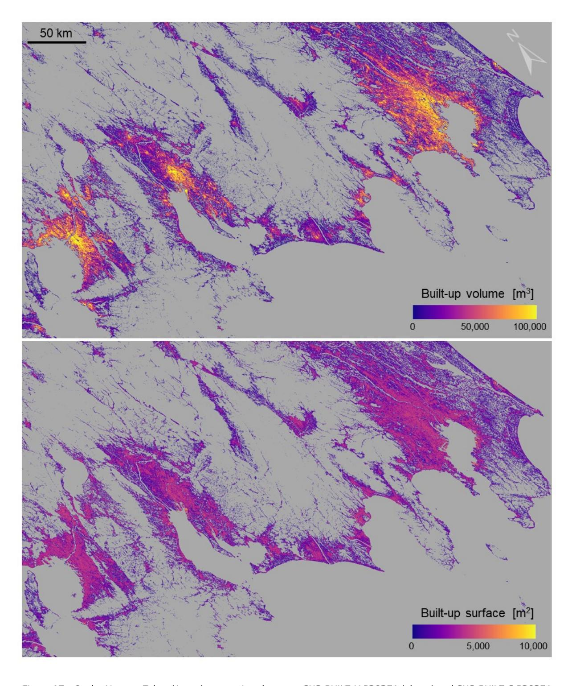

Figure 17 - Osaka-Nagoya-Tokyo (Japan): comparison between GHS-BUILT-V R2023A (above) and GHS-BUILT-S R2023A (below), year 2020.

# **2.4 GHS-BUILT-C R2023A - GHS Settlement Characteristics, derived from Sentinel-2 composite (2018) and other GHS R2023A data**

The GHS-BUILT-C spatial raster datasets delineate the boundaries of the human settlements at 10m resolution, and describe their inner characteristics in terms of the morphology of the built environment and the functional use.

The Morphological Settlement Zone (MSZ) delineates the spatial domain of all the human settlements at the neighbourhood scale of approx. 100m, based on the spatial generalization of the built-up surface fraction (BUFRAC) function. The objective is to fill the open spaces that are surrounded by large patches of built space. MSZ, open spaces, and built spaces basic class abstractions are derived by mathematical morphology and spatial filtering (opening, closing, regional maxima) from the BUFRAC function. They are further classified accordingly to the information regarding vegetation intensity, water surfaces (GHS\_LAND\_GLOBE\_R2022A), road surfaces (OSM highways), functional use (GHS-BUILT-C\_FUN\_GLOBE\_R2023A), and building height (GHS-BUILT-H\_GLOBE\_R2023A).

#### **Morphological Settlement Zone delineation**

First, the spatial domain it is split in two sub-domains, "open spaces" vs. "built spaces". The "Built spaces" set is derived from the BUFRAC continuous function, filtered for detecting salient raster samples that may summarize the function itself, also called "built-up markers" (BUMARKER). The BUMARKER set it is defined by the union of the morphological regional maxima (Vincent, 1993) of the BUFRAC function, with the raster samples dominated by the built-up surface class, so that BUFRACx > 0.5. The "open space" set is defined as the logical complement of the "built space" set.

Second, the BUMARKER set it is subdivided in the "COMPACT" vs. the "SPARSE" sets based on morphological filtering. The COMPACT set is defined by the opening of the closing of the BUMARKER, with a structuring element of a disk with 5 pixels (corresponding to 50 meters) radius. The SPARSE set is made by the BUMARKER in the logical complement of the COMPACT set.

Third, the Morphological Settlement Zone (MSZ) is defined as the Union of the hole-filled COMPACT set using a 4-connectivity rule and the dilation of the SPARSE set, using a minimal structure element of 2×2 (20×20m) pixels.

Fourth, the classification is applied to the samples belonging to the MSZ domain accordingly to the information regarding vegetation intensity from S2 imageries, water surfaces (GHS\_LAND\_GLOBE\_R2022A), road surfaces (OSM highways), functional use (GHS-BUILT-C\_FUN\_GLOBE\_R2023A), and building height (GHS-BUILT-H\_GLOBE\_R2023A). The building height information it is downscaled to the 10m-resolution using the connected components of the BUMARKERS as spatial units.

Figure 18 - Morphological Settlement Zone (MSZ) Legend

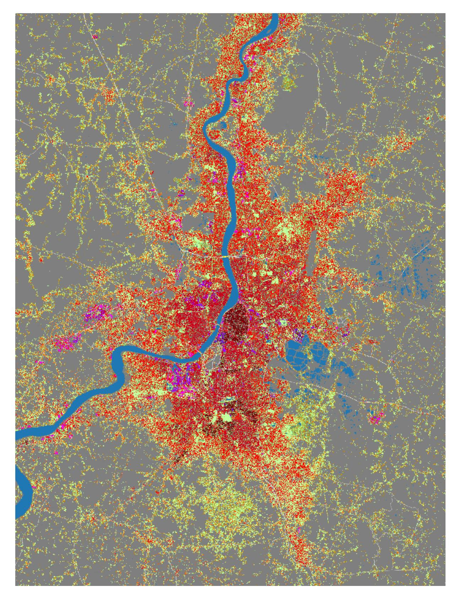

Figure 19 - Settlement Characteristics in Kolkata (India)

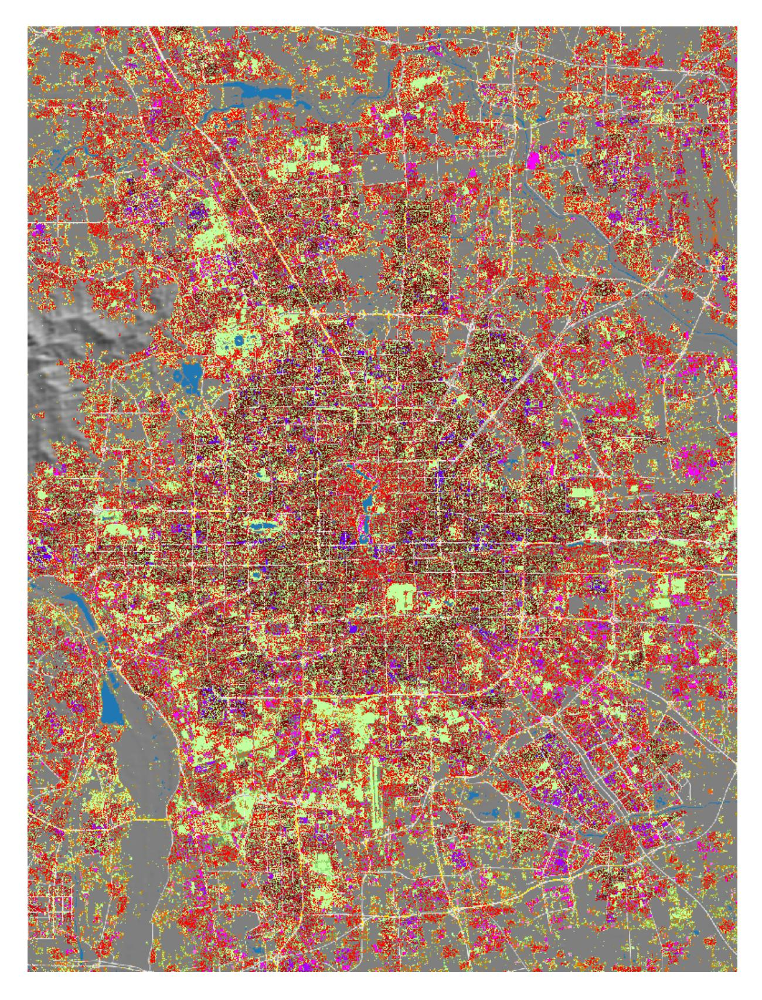

Figure 20 - Settlement Characteristics in Beijing (China)

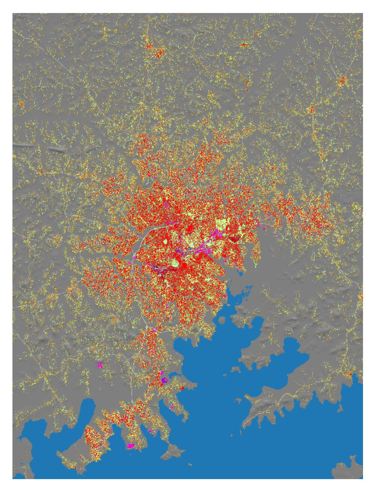

Figure 21 - Settlement Characteristics in Kampala (Uganda)

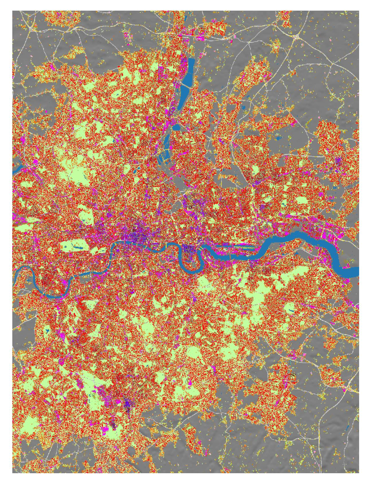

Figure 22 – Settlement Characteristics in London (United Kingdom)

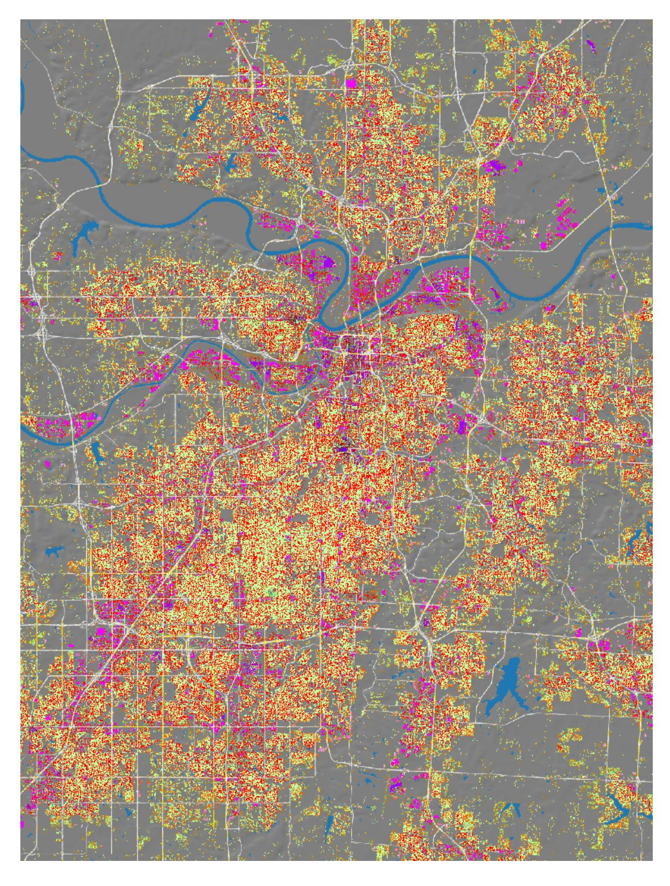

Figure 23 – Settlement Characteristics in Kansas City (United States)

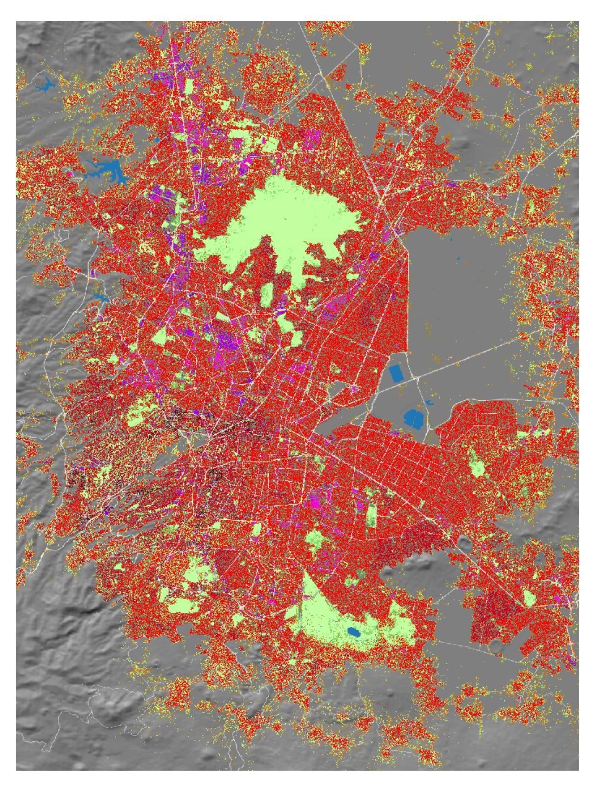

Figure 24 – Settlement Characteristics in Mexico City (Mexico)

#### **2.4.1 Input data**

Morphological filtering of the BUFRAC 10m-resolution

GHS\_BUILT\_S\_E2018\_GLOBE\_R2023A\_54009\_10\_V1\_0., maximal vegetation intensity from S2 image data, water surfaces (GHS\_LAND\_GLOBE\_R2022A), road surfaces (OSM highways), functional use (GHS-BUILT-C\_FUN\_GLOBE\_R2023A), and building height (GHS-BUILT-H\_GLOBE\_R2023A).

#### **2.4.2 Technical Details**

*Author*: Pesaresi, Martino; Politis Panagiotis *Product name*: GHS-BUILT-C\_GLOBE\_R2023A

*Spatial extent:* Global *Temporal extent*: 2018

*Coordinate Systems:* World Mollweide (ESRI:54009)

*Spatial resolution available*: 10m

*Encoding*: Integer (Byte)

*Data organisation*: Global VRT file (10 m) with overview images (OVR). Data tiles of 100x100 km size in GeoTIFF format (10 m). Tile schema in shapefile format

Table 18 - Technical details of the datasets in GHS-BUILT-C\_GLOBE\_R2023A

| GHS-BUILT-C_MSZ_GLOBE_R2023A                     |                                                                                                                                                                         |                                                 |
|--------------------------------------------------|-------------------------------------------------------------------------------------------------------------------------------------------------------------------------|-------------------------------------------------|
| ID                                               | Description                                                                                                                                                             | Resolution (Projection/Coordinate system) |
| GHS_BUILT_C_MSZ_E2018_GLOBE_R2023A_54009_10_V1_0 | Morphological Settlement Zone (MSZ) : classification by internal surface (soil sealed) and functional (BU RES/NRES) characteristics - 10m Encoding: Byte | 10 m World Mollweide (ESRI:54009)            |
|                                                  | Values range: 1-25 (see Figure 18) NoData: 255                                                                                                                    |                                                 |

| GHS-BUILT-C_FUN_GLOBE_R2023A                                                                                                                           |                                                            |  |  |  |
|--------------------------------------------------------------------------------------------------------------------------------------------------------|------------------------------------------------------------|--|--|--|
| Description                                                                                                                                            | Resolution (Projection/Coordinate system)            |  |  |  |
| Residential (RES) vs. non residential (NRES) functional classification of the built spatial domain defined as BUFRAC > 0 Encoding: Byte | 10 m World Mollweide (ESRI:54009)                       |  |  |  |
|                                                                                                                                                        | Values range: 0 (non-BU), 1 (RES), 2 (NRES) NoData: 255 |  |  |  |

### **2.4.3 How to cite**

#### Dataset:

*Pesaresi, Martino; Politis, Panagiotis (2023): GHS-BUILT-C R2023A - GHS Settlement Characteristics, derived from Sentinel2 composite (2018) and other GHS R2023A data. European Commission, Joint Research Centre (JRC) [Dataset] doi: 10.2905/3C60DDF6-0586-4190-854B-F6AA0EDC2A30 PID: http://data.europa.eu/89h/3c60ddf6-0586-4190-854b-f6aa0edc2a30*

#### Concept & Methodology:

*Pesaresi, Martino, Marcello Schiavina, Panagiotis Politis, Sergio Freire, Katarzyna Krasnodębska, Johannes H. Uhl, Alessandra Carioli, et al. (2024). Advances on the Global Human Settlement Layer by Joint Assessment of Earth Observation and Population Survey Data. International Journal of Digital Earth 17 (1). doi:10.1080/17538947.2024.2390454*

# **2.5 GHS-POP R2023A - GHS population spatial raster dataset multi-temporal (1975-2030)**

This GHS-POP spatial raster product (GHS-POP\_GLOBE\_R2023) depicts the distribution of human population [\(Figure 25\)](#page-49-1), expressed as the number of people per cell. Residential population estimates at 5 years interval between 1975 and 2030 are derived from the raw global census data harmonized by CIESIN for the Gridded Population of the World, version 4.11 (GPWv4.11) at polygon level, and disaggregated from census or administrative units to grid cells, informed by the distribution, classification and volume of built-up as mapped in the GHSL global layers per corresponding epoch. The disaggregation methodology is described in a peer reviewed paper (Freire et al., 2016). This is an updated and improved release of the product (GHS\_POP\_GLOBE\_R2022A) distributed within the GHSL Data Package 2022 (GHS P2022).

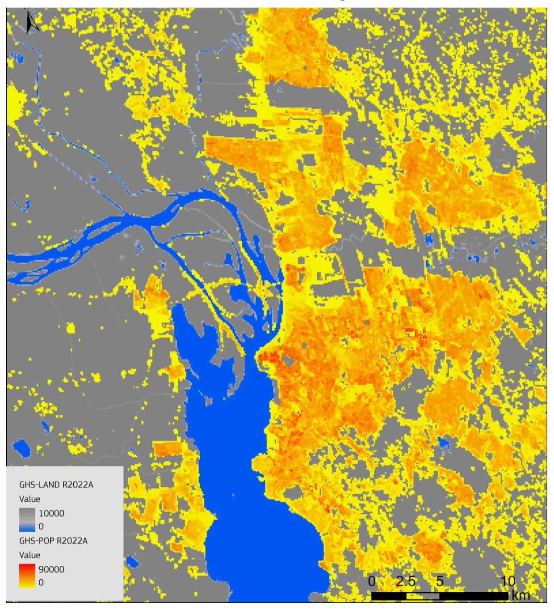

Figure 25 - GHS Population spatial raster dataset (GHS-POP) GHS\_POP\_E2020\_GLOBE\_R2023A\_54009\_100\_V1\_0 in Porto Alegre (Brazil).

#### **2.5.1 Improvements compared to the previous release**

The new GHSL population distribution spatial raster datasets release aimed at incorporating improvements originating from input datasets, namely population estimates and built-up presence. While the disaggregation relied essentially on the same clear and simple approach, there were significant differences to the input data that had a positive effect on the final quality and accuracy of population spatial raster datasets, along with new approach for temporal estimation of population and systematic revision of coastlines and unpopulated areas. Here, we describe the main differences between the currently released products (GHS-POP\_GLOBE\_R2023A) and the previous (GHS\_POP\_MT\_GLOBE\_R2019A and GHS\_POP\_MT\_GLOBE\_R2022A). [Figure 26](#page-50-1) summarizes the main steps and outputs resulting from the workflow implemented for production of GHS-POP R2023.

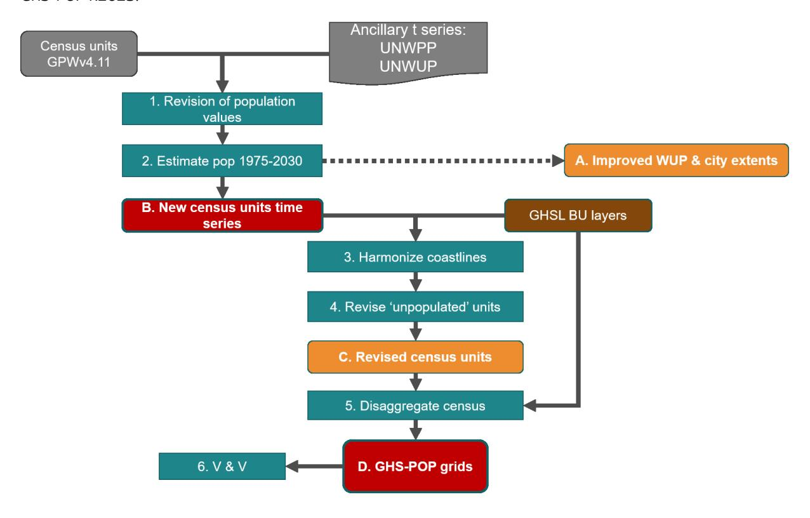

Figure 26 - Generalized workflow for producing GHS-POP R2022, with main steps (1-6) and intermediate and main outputs (A-D).

For the new GHS-POP (GHS-POP\_GLOBE\_R2023A), the new Sentinel/Landsat based GHS-BUILT-V (GHS-BUILT-V\_GLOBE\_R2023A, version 1.0) was used as target for disaggregation of population estimates. Total built-up volume (GHS-BUILT-V\_GLOBE\_R2023A) and non-residential built-up volume (GHS-BUILT-V\_NRES\_GLOBE\_R2023A) were combined by subtracting the non-residential volume from the total volume for all 5-year time steps between 1975 and 2030. Cells declared as "NoData" in built-up layers were treated as zero for population disaggregation.

The base source for population estimates (both census unit counts and geometries) was the raw dataset (census population at the census year and growth rates) of the Gridded Population of the World, version 4.11 (GPWv4.11), from CIESIN/SEDAC [\(https://sedac.ciesin.columbia.edu/data/collection/gpw-v4/whatsnewrev11\)](https://sedac.ciesin.columbia.edu/data/collection/gpw-v4/whatsnewrev11).

The population estimates at polygon level for each mapped epoch (5-year interval between 1975 and 2030) are obtained by applying for each unit the population growth rate computed by CIESIN within the census available dates and rapidly converging to the upper administrative level growth rate using a slow convergence to the national growth rate (WPP 2022) at 100 years from census epochs. The estimates are then rescaled to match (a) the total population time series at 'city' level from the extended database feeding the UN World Urbanisation Prospects 2018 (United Nations, Department of Economic and Social Affairs, Population Division, 2018), and (b) the total population time series at country level provided by the UN World Population Prospects 2022 (United Nations, Department of Economic and Social Affairs, Population Division, 2022). As the UN World Urbanisation Prospects 2018 provides the point location but not the boundaries for each 'city', the model performs an estimation of such boundaries starting from the coordinate pair for each settlement, after their

location is revised. This revision was conducted using Geocoding and Reverse Geocoding, as well as visual inspection, to ensure these coordinates correspond to the centre of the urban agglomeration. The model proceeds by aggregating administrative units (i.e. the census geometry provided by CIESIN) iteratively to match the total population of the city in the available census year. The units within the estimated boundaries are subject to the first rescaling procedure (a) at 'city' level (i.e. each UN 'city' determines the time series of the aggregated population of all units within each estimated boundary); while the other units are subject to the second procedure (b) at country level, to ensure the alignment with each country population time series estimated in UN WPP 2022 (medium variant). The set of estimated city boundaries matching UNWUP 2018 are released within this GHS P2023 data package in the GHS-SDATA product.

The previous releases of the GHS-POP (R2019 and R2022) already included some procedures aimed at further harmonising and critically revising the input population census data (GPW) provided by CIESIN. For the current release, those set of controls, checks and improvements were improved and expanded:

- 1. Revision of population values vs. an independent dataset (where available: EU)
- 2. Harmonisation of coastlines
- 3. Revision of unpopulated units

Control 1. aimed at mitigating large discrepancies between resident population counts in GPW and those of other authoritative sources. In this process, Denmark and Poland were flagged for inconsistencies between the population counts and distribution reported in GPW and those reported by ESTAT. Large discrepancies have been modified.

Coastlines are notoriously dynamic and their poor or outdated geospatial definition in census data can degrade the disaggregation of population along these critical areas. Therefore in this GHS-POP release, GPW coastlines were systematically modified to mitigate inconsistencies between the spatial extent of census data (or GADM) and built-up areas, since GHSL does not impose a coastline in mapping of these areas. This harmonisation has been carried out by extending all census units along coastlines (including those of inland water bodies) out using a 3 km buffer.

Units deemed as "unpopulated" in the GPW census data were critically assessed for presence of residential population, based on ancillary data (GHS-BUILT-S\_GLOBE\_R2023A) and very high-resolution imagery. Inconsistencies between census data and contradicting evidence were detected and reconciled accordingly, after confirmation.

Census units declared as "uninhabited" in GPW data but containing significant built-up surface in 2020 were selected for visual inspection with very high-resolution (VHR) imagery from web mapping services (Google maps and Bing). Those units where presence of residential built-up was confirmed by VHR imagery were selected for intervention. An automated method was applied to split and merge these polygons, based on geographical proximity, with those ones adjacent and containing resident population. This procedure was implemented while minimizing changes to source geometry, preserving the regional distribution of population, and the overall counts (Freire et al., 2018). This procedure modified 269 units in 31 countries.

GHS-POP product is produced in World Mollweide at 100 m, and then aggregated at 1 km. These two datasets are then warped to WGS 1984 coordinate system, at spatial resolutions of 3 arcsec and 30 arcsec respectively, by applying a thorough volume-preserving procedure (Maffenini et al., 2023).

#### **2.5.2 Input Data**

The new product GHS-BUILT-V\_GLOBE\_R2023A (version 1.0) was used to generate the target layers for disaggregation of population estimates by combining the GHS-BUILT-V\_GLOBE\_R2023A and GHS-BUILT-V\_NRES\_GLOBE\_R2023A. GHS-LAND\_GLOBE\_R2022A was used as land ancillary in case of absence of builtup in polygons. The base source of population estimates for the different epochs was the raw census data with geometry of the Gridded Population of the World, version 4.11(GPWv4.11), from CIESIN/SEDAC, with some modifications as described above, along with the UN World Population Prospects 2022 and the UN World Urbanization Prospects 2018. The ESTAT LAU2 population time series was used to control the population counts at LAU2 level in EU.

### **2.5.3 Technical Details**

*Author:* Marcello Schiavina, Sergio Freire, Joint Research Centre (JRC) European Commission; *Kytt MacManus*  Columbia University, Center for International Earth Science Information Network - CIESIN.

*Product name*: GHS\_POP\_GLOBE\_R2023A

*Spatial extent:* Global

*Temporal extent*: from 1975 to 2030, 5 years interval

*Coordinate Systems*: World Mollweide (ESRI: 54009) and WGS 1984 (EPSG: 4326)

*Spatial resolutions available*: 100 m, 1 km, 3 ss, 30 ss

*Encoding*: Population data float64 [0, ∞); population counts (ESRI: 54009; EPSG: 4326) and density (ESRI: 54009) NoData: -200

*Data organisation*: The spatial raster datasets are provided as GeoTIFF file as single global layer with pyramids or tiled.

[Table 15](#page-35-2) outlines the technical characteristics of the datasets released in this data package.

Table 19 - Technical details of the datasets in GHS\_POP\_GLOBE\_R2023A

| GHS_POP_GLOBE_R2023A                                                  |                                                                                                                                                                                                                          |                                                                               |  |  |
|-----------------------------------------------------------------------|--------------------------------------------------------------------------------------------------------------------------------------------------------------------------------------------------------------------------|-------------------------------------------------------------------------------|--|--|
| ID                                                                    | Description                                                                                                                                                                                                              | Resolution (Projection/Coordinate system)                               |  |  |
| GHS_POP_E <epoch>_GLOBE_R2023A_<proj>_<res>_V1_0</res></proj></epoch> | Population density <epoch> 1975- 2030; <proj> 54009, 4326; <res> 100m, 1000; 3ss 30ss Values are expressed as decimals Encoding:: Float64 Values range: 0-Inf NoData [-200]</res></proj></epoch> | 100 m, 1 km World Mollweide (ESRI:54009) 3ss, 30ss WGS84 (EPSG:4326) |  |  |

#### **2.5.4 Summary statistics**

Table 20 - Summary statistics of total population as obtained from the 1-km World Mollweide grid - total population adjusted to the UN WPP 2022 (United Nations, Department of Economic and Social Affairs, Population Division, 2022).

|                  | 1975          | 1980          | 1985          | 1990          |
|------------------|---------------|---------------|---------------|---------------|
|                  | 4,069,437,259 | 4,444,007,748 | 4,861,730,652 | 5,316,175,909 |
|                  | 1995          | 2000          | 2005          | 2010          |
| Total Population | 5,743,219,510 | 6,148,899,024 | 6,558,176,175 | 6,985,603,172 |
|                  | 2015          | 2020          | 2025          | 2030          |
|                  | 7,426,597,609 | 7,840,952,947 | 8,191,988,536 | 8,546,141,407 |

#### **2.5.5 How to cite**

#### Dataset:

*Schiavina, Marcello; Freire, Sergio; Alessandra Carioli; MacManus, Kytt (2023): GHS-POP R2023A - GHS population grid multitemporal (1975-2030). European Commission, Joint Research Centre (JRC) [Dataset] doi: 10.2905/2FF68A52-5B5B-4A22-8F40-C41DA8332CFE PID: http://data.europa.eu/89h/2ff68a52-5b5b-4a22- 8f40-c41da8332cfe*

Concept & Methodology:

*Pesaresi, Martino, Marcello Schiavina, Panagiotis Politis, Sergio Freire, Katarzyna Krasnodębska, Johannes H. Uhl, Alessandra Carioli, et al. (2024). Advances on the Global Human Settlement Layer by Joint Assessment of Earth Observation and Population Survey Data. International Journal of Digital Earth 17 (1). doi:10.1080/17538947.2024.2390454*

# **2.6 GHS-SMOD R2023A - GHS settlement layers, application of the Degree of Urbanisation methodology (stage I) to GHS-POP R2023A and GHS-BUILT-S R2023A, multitemporal (1975-2030)**

The GHS Settlement Model layers (GHS-SMOD) GHS-SMOD\_GLOBE\_R2023A delineate and classify settlement typologies [\(Figure 27\)](#page-53-1) via a logic of cell clusters population size, population and built-up area densities as defined by the stage I of the Degree of Urbanisation (European Commission & Statistical Office of the European Union, 2021) and recommended by the UN STAT COM. The GHS-SMOD is derived from the GHS-POP (GHS-POP\_GLOBE\_R2023A, version 1.0) and GHS-BUILT-S (GHS-BUILT-S\_GLOBE\_R2023A, version 1.0) released within this GHSL Data Package 2023 (GHS P2023).

The GHS Settlement Model layers GHS-SMOD\_GLOBE\_R2023A is composed by four datasets: the GHS-SMOD spatial raster dataset, the urban centre entities vector and the dense urban cluster. The first is a raster grid representing the settlement classification per grid cell and the other delineates the boundaries of settlement entities (i.e. urban centres and dense urban clusters, with main attributes, in vector files.

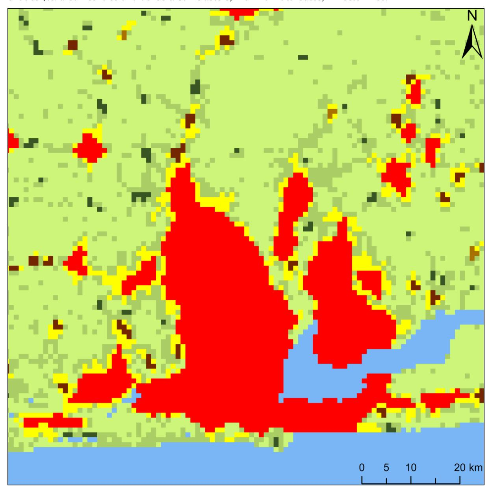

Figure 27 - GHS Settlement Model spatial raster dataset (GHS-SMOD) GHS-SMOD\_E2020\_GLOBE\_R2023A\_54009\_1K\_V2\_0 displayed in the area of Lagos (Nigeria) –Legend in [Table 21.](#page-58-0)

#### **2.6.1 Improvements compared to the previous release**

The GHS-SMOD spatial raster dataset is an improvement of the GHS-SMOD R2022A based on the specifications of the stage I of the Degree of Urbanisation methodology. The GHS-SMOD is provided at the detailed level (Second Level - L2) and the new classification benefits of the new population and built-up surface layers (GHS-POP\_GLOBE\_R2023A and GHS-BUILT-S\_GLOBE\_R2023A).

GHS-SMOD product is produced in World Mollweide at 1 km and then warped to WGS 1984 coordinate system, at spatial resolutions of 30 arcsec, using nearest neighbour algorithm.

#### **2.6.2 GHS-SMOD classification rules**

The "*Settlement model*" GHS-SMOD generates output spatial raster datasets and spatial entities by classifying 1 km2 grid cells, on the basis of population density, size and contiguity, with a classification schema organized in two separate hierarchical levels.

The input for the GHSL SMOD is a 1 km² population spatial raster dataset (GHS-POP\_GLOBE\_R2023A), the builtup surface (GHS-BUILT-S\_GLOBE\_R2023A) and the land layer (GHS-LAND\_GLOBE\_R2022A). Each grid cell has the same shape and size, thereby avoiding distortions caused by using units varying in shape and size. This is a considerable advantage when compared to methods based on the population size and density of local administrative units.

At the first hierarchical level, the GHSL SMOD classifies the 1 km² grid cells by identifying the following spatial entities: a) "Urban Centre", b) "Urban Cluster" and classifying all the other cells as "Rural Grid Cells".

The criteria for the definition of the spatial entities at the first hierarchical level are:

- *"Urban Centre" (also "High Density Cluster" - HDC)* An urban centre consists of contiguous grid cells (4-connectivity cluster) with a density of at least 1,500 inhabitants per km2 of permanent land, and has at least 50,000 inhabitants in the cluster with smoothed boundaries (3-by-3 conditional majority filtering29) and <15 km2 holes filled30;
- *"Urban Cluster" (also "Moderate Density Cluster" - MDC)* An urban cluster (or moderate density clusters) consists of contiguous grid cells (8-connectivity cluster) with a density of at least 300 inhabitants per km2 of permanent land and has a population of at least 5,000 in the cluster. (The urban centres are subsets of the corresponding urban clusters).

*The "Rural grid cells" (also "Mostly Low Density Cells" - LDC)* are all the other cells that do not belong to an Urban Cluster. Most of these will have a density below 300 inhabitants per km2 (grid cell); some may have a higher density, but they are not part of cluster with sufficient population to be classified as an Urban Cluster.

The settlement grid at level 1 represents these definitions on a layer grid. Each pixel is classified as follow:

- *Class 3: "Urban Centre grid cell"*, if the cell belongs to an Urban Centre;
- *Class 2: "Urban Cluster grid cell"*, if the cell belongs to an Urban Cluster and not to an Urban Centre;
- *Class 1: "Rural grid cell"*, if the cell does not belong to an Urban Cluster.

The second hierarchical level of the GHSL SMOD is a refinement of the DEGURBA set up to identify smaller settlements. It follows the same approach based on population density, population size and contiguity with a **nested classification** into the first hierarchical level. At the second hierarchical level, the GHSL SMOD

29 Water is excluded and majority is computed among populated or land (land >= 50%) pixels. Cases of draw with even number of pixels are taken as positive realisation.

30 In a few countries with relatively low-density urban development and a strong separation of land use functions, the Degree of Urbanisation generates multiple urban centres for a single city. Creating urban centres and dense urban clusters using both cells with a density of at least 1,500 inhabitants and cells that have an optimal built-up density on permanent land resolves this issue. Such highly built-up cells typically contain office parks, shopping malls or factories and the optimal threshold is identified according to the average built-up density (GHS-BUILT-S 2020) in clusters with a density of at least 1,500 inhabitants with a minimum population of 50,000 people.

classifies the 1 km² grid cells by identifying the following spatial entities: a) "Urban Centres" as at the first level; b) "Dense Urban Cluster" and c) "Semi-dense Urban Cluster" as parts of the "Urban Cluster", classifying all the other cells of "Urban Clusters" as "Suburban or peri-urban grid cells"; and identifying d) "Rural Cluster" within the "Rural grid cells". All the other cells belonging to the "Rural grid cells" are classified as "Low Density grid cells" or "Very Low Density grid cells" according to their cell population [\(Figure 28\)](#page-56-0).Here are reported the definition of the spatial entities at the second hierarchical:

- *"Urban Centre" (also "Dense, Large Settlement")* An urban centre consists of contiguous grid cells (4-connectivity cluster) with a density of at least 1,500 inhabitants per km2 of permanent land, and has at least 50,000 inhabitants in the cluster with smoothed boundaries (3-by-3 conditional majority filtering31) and <15 km2 holes filled30;
- *"Dense Urban Cluster" (also "Dense, Medium Cluster")* A Dense Urban Cluster consists of contiguous cells (4-connectivity cluster) with a density of at least 1,500 inhabitants per km2 of permanent land and has at least 5,000 and less than 50,000 inhabitants in the cluster;
- *"Semi-dense Urban Cluster" (also "Semi-dense, Medium Cluster")* A semi-dense urban cluster consists of contiguous (using four-point contiguity) grid cells within a urban cluster (level 1) at least 2 km away32 from a dense urban cluster or an urban centre with a density of at least 900 inhabitants per km2 and a collective population of at least 2,500 people;
- *"Rural cluster" (also "Semi-dense, Small Cluster")* A Rural Cluster consists of contiguous cells (8-connectivity cluster) with a density of at least 300 inhabitants per km2 of permanent land and has at least 500 and less than 5,000 inhabitants in the cluster.

The *"Suburban or peri-urban grid cells" (also Semi-dens grid cells)* are all the other cells that belong to an Urban Cluster but are not part of a Urban Centre, Dense Urban Cluster or a Semi-dense Urban Cluster.

The *"Low Density Rural grid cells" (also "Low Density grid cells")* are Rural grid cells with a density of at least 50 inhabitants per km2 of permanent land and are not part of a Rural Cluster.

The *"Very low density rural grid cells" (also "Very Low Density grid cells")* are cells with a density of less than 50 inhabitants per km2 of permanent land.

The GHSL SMOD classifies as *"Water grid cells"* all the cells with more than 0.5 share covered by permanent surface water that are not populated nor built.

The settlement grid at level 2 represents these definitions on a layer grid. Each pixel is classified as follow:

- *Class 30: "Urban Centre grid cell"*, if the cell belongs to an Urban Centre spatial entity;
- *Class 23: "Dense Urban Cluster grid cell"*, if the cell belongs to a Dense Urban Cluster spatial entity;
- *Class 22: "Semi-dense Urban Cluster grid cell"*, if the cell belongs to a Semi-dense Urban Cluster spatial entity;
- *Class 21: "Suburban or per-urban grid cell"*, if the cell belongs to an Urban Cluster cells at first hierarchical level but is not part of a Dense or Semi-dense Urban Cluster;
- *Class 13: "Rural cluster grid cell"*, if the cell belongs to a Rural Cluster spatial entity;
- *Class 12: "Low Density Rural grid cell"*, if the cell is classified as Rural grid cells at first hierarchical level, has more than 50 inhabitant and is not part of a Rural Cluster;
- *Class 11: "Very low density rural grid cell"*, if the cell is classified as Rural grid cells at first hierarchical level, has less than 50 inhabitant and is not part of a Rural Cluster;

31 Water is excluded and majority is computed among populated or land (land >= 50%) pixels. Cases of draw with even number of pixels are taken as positive realisation.

32 Measured as outside squares of 5x5 grid cells of 1km2 centred on all dense urban cluster and urban centre cells.

— *Class 10: "Water grid cell"*, if the cell has 0.5 share covered by permanent surface water and is not populated nor built.

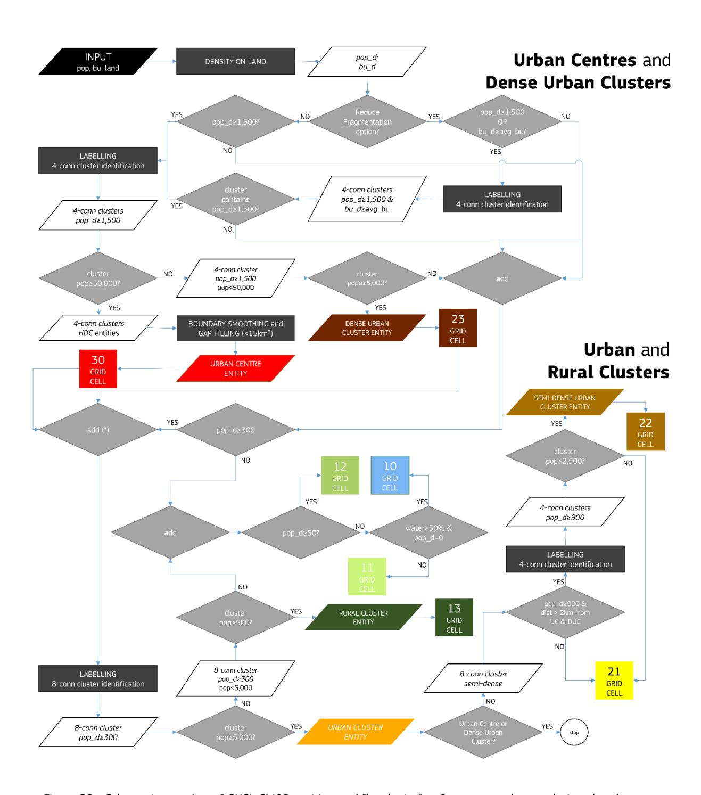

Figure 28 - Schematic overview of GHSL SMOD entities workflow logic. "pop" represents the population abundance per grid cell; "pop\_d" represents the population density on permanent land; "bu" represents the built-up share per grid cell; "bu\_d" represents the built-up density on permanent land. "DENSITY ON LAND" process fill built-up cells on water with max between 50% and built-up share value and population on water with global average built-up per capita. (\*) this procedure of enforcement logic allows the delineation of Urban Clusters Entities which contains by definition the Urban Centres and all 2X classes. Each entity has a corresponding vector boundary.

#### 2.6.3 GHS-SMOD L2 spatial raster dataset and L1 aggregation

Settlement typologies are identified in the GHS-SMOD grid at L2 with a two digit code (30 - 23 - 22 - 21 - 13 - 12 - 11 - 10), linking to grid level and municipal level description terms (both the municipal and grid level terms are accompanied by a technical term). **Classes 30 - 23 - 22 - 21 if aggregated form the "urban domain"**, **13 - 12 - 11 - 10 form the "rural domain"**. Table 23 shows the L2 grid cells population (expressed as people per square kilometre: people/km²) and built-up area (expressed as square kilometres: km²) expected characteristics in terms of min-max population and built-up density bounds. Table 22 presents the logic to define settlement typologies.

L1 classifies three settlement typologies as displayed in Table 24. Settlement typologies are identified at L1 with a single digit code (3 - 2 - 1), and grid level and municipal level terms (both the municipal and grid level are accompanied by a technical term), HDC for type 3, MDC for type 2, and LDC for type 1). Classes 3 - 2 if aggregated form the "urban domain". 1 forms the "rural domain".

[Table 25](#page-60-2) presents the logic to define settlement typologies as described in section [2.6.2.](#page-54-1) [Table 26](#page-61-2) shows the L1 grid cells population and built-up area characteristics in terms of min-max population and built-up density bounds.

Table 21 - Settlement Model L2 nomenclature

| Code | RGB               | Grid level term                     | Spatial entity (polygon)        | Other cells                                                            | Municipal level term                                |
|------|-------------------|----------------------------------------|------------------------------------|------------------------------------------------------------------------|--------------------------------------------------------|
|      |                   |                                        | Technical term                     | Technical term                                                         | Technical term                                         |
|      | 255               |                                        | URBAN CENTRE (UC)                  |                                                                        | CITY                                                   |
| 30   | 0 0            | URBAN CENTRE GRID CELL              | DENSE, LARGE CLUSTER            |                                                                        | LARGE SETTLEMENT                                       |
|      | 115               | DENSE URBAN                            | DENSE URBAN CLUSTER (DUC)       |                                                                        | DENSE TOWN                                             |
| 23   | 38 0           | CLUSTER GRID CELL                   | DENSE, MEDUM CLUSTER            |                                                                        | DENSE, MEDIUM SETTLEMENT                            |
|      | 168               | SEMI-DENSE URBAN                    | SEMI-DENSE URBAN CLUSTER (SDUC) |                                                                        | SEMI-DENSE TOWN                                        |
| 22   | 112 0          | CLUSTER GRID CELL                   | SEMI-DENSE, MEDIUM CLUSTER      |                                                                        | SEMI-DENSE, MEDIUM SETTLEMENT                    |
| 21   | 255 255        | SUBURBAN OR PERI-URBAN              |                                    | SUBURBAN OR PERI URBAN GRID CELLS SEMI-DEMSE GRID                | SUBURBAN OR PERI URBAN AREA                         |
|      | 0                 | GRID CELL                              |                                    | CELLS                                                                  | SEMI-DENSE AREA                                        |
|      | 55                | RURAL                                  | RURAL CLUSTER (RC)                 |                                                                        | VILLAGE                                                |
| 13   | 86 35          | CLUSTER GRID CELL                   | SEMI-DENSE, SMALL CLUSTER       |                                                                        | SMALL SETTLEMENT                                       |
|      | 171               | LOW DENSITY                            |                                    | LOW DENSITY RURAL                                                      | DISPERSED RURAL                                        |
| 12   | 205 102        | RURAL GRID CELL                     |                                    | GRID CELLS LOW DENSITY GRID CELLS                                | AREA LOW DENSITY AREA                               |
| 11   | 205 245 122 | VERY LOW DENSITY RURAL GRID CELL |                                    | VERY LOW DENSITY RURAL GRID CELLS VERY LOW DENSITY GRID CELLS | MOSTLY UNINHABITED AREA VERY LOW DENSITY AREA |
| 10   | 122 182 245 | WATER GRID CELL                     | -                                  | -                                                                      | -                                                      |

Table 22 - Settlement Model L2 synthetic explanation of logical definition and grid cell sets

|      |                                                                                                                          |                                                                       | Grid cell sets used in the logical definition (shares defined on land surface) |                                                                 |                                                                                                |  |
|------|--------------------------------------------------------------------------------------------------------------------------|-----------------------------------------------------------------------|--------------------------------------------------------------------------------|-----------------------------------------------------------------|------------------------------------------------------------------------------------------------|--|
|      |                                                                                                                          | Pdens:                                                                | Pmin:                                                                          | Bdens:                                                          | Tcon:                                                                                          |  |
| Code | Logical Definition at km2 grid cell 1                                                                           | Local Population Density lower bound ">" (people/km2 ) | Cluster Population lower bound ">" (people)                           | Local share of Built-up Area lower bound ">" (km2 ) | Topological constraints                                                                        |  |
| 30   | (((Pdens ∨ Bdens) ∧ Tcon) ∧ Pmin) ∨ ∨ [iterative_median_filter(3-by-3, excluding water)] ∨ [gap_fill(<15km2)]33 | 1,500                                                                 | 50,000                                                                         | Average in HDC                                                  | 4-connectivity clusters with at least 1 cell Pdens                                       |  |
| 23   | (((Pdens ∨ Bdens) ∧ Tcon) ∧ Pmin) ∧ ¬ 30                                                                              | 1,500                                                                 | 5,000                                                                          | Average in HDC                                                  | 4-connectivity clusters                                                                        |  |
| 22   | (((Pdens ∧ Tcon_1)) ∧ Tcon_2 ∧ Pmin) ∧ ¬ (30 ∨ 23)                                                                 | 900                                                                   | 2,500                                                                          | none                                                            | 1: 4-connectivity clusters; 2: farther than 2km (beyond 2 cells buffer) from 23 or 30 |  |
| 21   | ((((Pdens ∧ (30 ∨ 23)) ∧ Tcon) ∧ Pmin) ∧ ¬ (30 ∨ 23 ∨ 22))                                                            | 300                                                                   | 5,000                                                                          | none                                                            | 8-connectivity clusters                                                                        |  |
| 13   | ((Pdens ∧ Tcon) ∧ Pmin) ∧ ¬ (30 v 2X)                                                                                 | 300                                                                   | 500                                                                            | none                                                            | 8-connectivity clusters                                                                        |  |
| 12   | Pdens ∧ ¬ (30 ∨ 2X ∨ 13)                                                                                              | 50                                                                    | none                                                                           | none                                                            | none                                                                                           |  |
| 11   | Tcon ∧ ¬ (30 ∨ 2X ∨ 13 ∨ 12)                                                                                          | none                                                                  | none                                                                           | none                                                            | On Land (Land>=50% ∨ BU34>0% ∨ Pop>0)                                                    |  |
| 10   | Tcon                                                                                                                     | none                                                                  | none                                                                           | none                                                            | Not on Land                                                                                    |  |

33 The seeds for the related spatial entity is obtained before morphological operations

34 Retaining only contiguous BU at least partially on land.

Table 23 - Settlement Model L2 grid cells population and built-up area characteristics (densities on permanent land)

|      |                                                 | Population                                      | Built-up area                          |                                        |  |
|------|-------------------------------------------------|-------------------------------------------------|----------------------------------------|----------------------------------------|--|
| Code | Minimum density expected (people/km2 ) | Maximum density expected (people/km2 ) | Minimum density expected (share) | Maximum density expected (share) |  |
| 30   | 0                                               | ∞                                               | 0                                      | 1                                      |  |
| 23   | 0                                               | 50,000                                          | 0                                      | 1                                      |  |
| 22   | 900                                             | 5,000                                           | 0                                      | 1                                      |  |
| 21   | 300                                             | 5,000                                           | 0                                      | 1                                      |  |
| 13   | 300                                             | 5,000                                           | 0                                      | 1                                      |  |
| 12   | 50                                              | 500                                             | 0                                      | 1                                      |  |
| 11   | 0                                               | 50                                              | 0                                      | 1                                      |  |
| 10   | 0                                               | 0                                               | 0                                      | 0                                      |  |

Table 24 - Settlement Model L1 nomenclature

| Code | RGB | Grid level term | Spatial entity (polygon) | Other cells      | Municipal level term |
|------|-----|-----------------|-----------------------------|------------------|----------------------|
|      |     |                 | Technical term              | Technical term   | Technical term       |
|      | 255 |                 | URBAN CENTRE                |                  | CITIES               |
| 3    | 0   | URBAN CENTRE    | HIGH DENSITY                |                  | DENSELY POPULATED    |
|      | 0   | GRID CELL       | CLUSTER (HDC)               |                  | AREA                 |
|      |     |                 |                             |                  | TOWNS & SEMI-DENSE   |
|      | 255 | URBAN CLUSTER   | URBAN CLUSTER               |                  | AREA                 |
| 2    | 170 | GRID CELL       | MODERATE DENSITY            |                  | INTERMEDIATE         |
|      | 0   |                 | CLUSTER (MDC)               |                  | DENSITY AREA         |
|      | 115 |                 |                             | RURAL GRID CELLS | RURAL AREAS          |
| 1    | 178 | RURAL GRID CELL |                             | LOW DENSITY GRID | THINLY POPULATED     |
|      | 115 |                 |                             | CELL (LDC)       | AREA                 |

Table 25 - Settlement Model L1 synthetic explanation of logical definition and grid cell sets

|      |                                                                                                                   | Grid cell sets used in the logical definition (shares defined on land surface) |                                                                  |                                                                              |                                    |  |
|------|-------------------------------------------------------------------------------------------------------------------|-----------------------------------------------------------------------------------|------------------------------------------------------------------|------------------------------------------------------------------------------|------------------------------------|--|
| Code | Logical Definition at 1 km2 grid cell                                                                       | Pdens: Local Population Density lower bound ">" (people/km2 )   | Pmin: Cluster Population lower bound ">" (people) | Bdens: Local share of Built-up Area lower bound ">" (km2 ) | Tcon: Topological constrains |  |
| 3    | (((Pdens ∨ Bdens) ∧ Tcon) ∧ Pmin) ∨ ∨ [iterative_median_filter(3-by-3)] ∨ ∨ [gap_fill(<15km2 )] 35 | 1,500                                                                             | 50,000                                                           | Average in HDC                                                            | 4- connectivity clusters     |  |
| 2    | Pdens ∧ Pmin ∧ Tcon ∧ ¬ 3                                                                                | 300                                                                               | 5,000                                                            | none                                                                         | 8- connectivity clusters     |  |
| 1    | (((Pdens ∧ 3) ∧ Tcon) ∧ Pmin) ∧ ∧ ¬ 3§                                                                      | none                                                                              | none                                                             | none                                                                         | none                               |  |

Table 26 - Settlement Model L1 grid cells population and built-up area characteristics (densities on permanent land)

|      |                                                    | Population                                         | Built-up area                             |                                           |  |
|------|----------------------------------------------------|----------------------------------------------------|-------------------------------------------|-------------------------------------------|--|
| Code | Minimum density expected (people/km2 ) | Maximum density expected (people/km2 ) | Minimum density expected (share) | Maximum density expected (share) |  |
| 3    | 0                                                  | ∞                                                  | 0                                         | 1                                         |  |
| 2    | 0                                                  | 50,000                                             | 0                                         | 1                                         |  |
| 1    | 0                                                  | 5,000                                              | 0                                         | 1                                         |  |

#### **2.6.4 Input Data**

The input data are the multi-temporal GHS-BUILT-S and the GHS-POP grids of the GHSL Data Package 2023 (GHS P2023) and GHS-LAND R2022.

#### **2.6.5 Technical Details**

*Author*: Marcello Schiavina, Michele Melchiorri, Martino Pesaresi, Joint Research Centre (JRC) European Commission.

*Product name*: GHS\_SMOD\_GLOBE\_R2023A

*Spatial extent*: Global

*Temporal extent*: from 1975 to 2030, 5 years interval *Coordinate System*: World Mollweide (EPSG: 54009)

*Spatial resolution available:* 1 km

[Table 27](#page-62-3) outlines the technical characteristics of the datasets released in this data package.

35 The seeds for the related spatial entity is obtained before morphological operations

#### *2.6.5.1 GHS-SMOD raster spatial raster dataset*

*Encoding*: integer16 [30 – 23 – 22 – 21 – 13 – 12 – 11 – 10], No Data: -200

*Data organisation*: TIF with CLR colormap (L2\_colcod.tif.clr) file as single global layer or tiled.

#### *2.6.5.2 GHS-SMOD urban centre entities*

*Data organisation*: Shapefile (SHP) database with vector layer of Urban Centre entities boundaries (polygons). Attributes:

- ID\_UC\_G0: Unique Identifiers of the urban centre entity;
- POP\_2020: sum of GHS-POP within the spatial entity extent for 2020;
- BU\_2020: sum of GHS-BU within the spatial entity extent for 2020

#### *2.6.5.3 GHS-SMOD dense urban cluster entities*

*Data organisation*: Shapefile (SHP) database with vector layer of Urban Centre entities boundaries (polygons). Attributes:

- ID\_DUC\_G0: Unique Identifiers of the urban centre entity;
- POP\_2020: sum of GHS-POP within the spatial entity extent for 2020;
- BU\_2020: sum of GHS-BU within the spatial entity extent for 2020

Table 27 - Technical details of the datasets in GHS\_SMOD\_GLOBE\_R2023A

| GHS_SMOD_GLOBE_R2023A                                                       |                                                                                                                                                                                                   |                                                                |  |  |  |
|-----------------------------------------------------------------------------|---------------------------------------------------------------------------------------------------------------------------------------------------------------------------------------------------|----------------------------------------------------------------|--|--|--|
| ID                                                                          | Description                                                                                                                                                                                       | Resolution (Projection)                                        |  |  |  |
| GHS_SMOD_E <epoch>_GLOBE_R2023A_<proj>_<res>_V2 _0</res></proj></epoch> | Settlement typology codes for <epoch> 1975-2030 (5 years interval) <proj> 54009, 4326; <res> 1000; 30ss Encoding Int16 Values range: 10-30 NoData [-200]</res></proj></epoch> | 1 km World Mollweide (ESRI:54009) 30ss WGS84 (EPSG:4326) |  |  |  |
| GHS_SMOD_E2020_GLOBE_R2023A_54009_1000_UC_V 2_0                          | 2020 urban centre entities boundaries File format: shapefile                                                                                                                                   | 1 km (World Mollweide)                                      |  |  |  |
| GHS_SMOD_E2020_GLOBE_R2023A_54009_1000_DUC_ V2_0                         | 2020 dense urban cluster entities boundaries File format: shapefile                                                                                                                         | 1 km (World Mollweide)                                      |  |  |  |

#### **2.6.6 Summary statistics**

Table 28 - Summary statistics of total area in square kilometres of each settlement typology at global level as obtained from the 1-km GHS-POP spatial raster datasets L2.

|          | 1975               | 1980               | 1985               | 1990               | 1995               | 2000               |
|----------|--------------------|--------------------|--------------------|--------------------|--------------------|--------------------|
| 30       | 248,915            | 279,427            | 314,076            | 346,207            | 395,665            | 441,710            |
| 23       | 183,783            | 195,614            | 211,958            | 230,453            | 246,929            | 260,119            |
| 22       | 86,470             | 98,255             | 112,252            | 129,246            | 135,394            | 138,377            |
| 21       | 856,687            | 1,012,342          | 1,184,969          | 1,342,317          | 1,415,832          | 1,469,975          |
| 13       | 570,460            | 599,983            | 635,486            | 672,669            | 686,527            | 697,147            |
| 12       | 4,701,383          | 5,034,934          | 5,235,018          | 5,343,896          | 5,416,622          | 5,456,595          |
| 11       | 139,301,529        | 138,736,956        | 138,268,917        | 137,902,997        | 137,673,152        | 137,508,188        |
|          |                    |                    |                    |                    |                    |                    |
|          |                    |                    |                    |                    |                    |                    |
|          | 2005               | 2010               | 2015               | 2020               | 2025               | 2030               |
| 30 23 | 487,665 274,876 | 534,917 288,801 | 582,619 300,291 | 621,699 304,998 | 651,937 312,970 | 679,024 318,174 |
| 22       | 145,299            | 151,946            | 159,886            | 175,791            | 190,819            | 202,031            |
| 21       | 1,576,341          | 1,689,957          | 1,832,586          | 2,047,041          | 2,189,006          | 2,316,075          |
| 13       | 709,593            | 725,018            | 744,133            | 767,150            | 790,603            | 803,842            |
| 12       | 5,641,279          | 5,821,025          | 6,003,285          | 6,166,097          | 6,166,252          | 6,274,759          |

Table 29 - Summary statistics of total built-up area in square kilometres for each settlement typology at global level as obtained from the 1-km GHS-POP spatial raster datasets L2.

|    | 1975   | 1980    | 1985    | 1990    | 1995    | 2000    |
|----|--------|---------|---------|---------|---------|---------|
| 30 | 44,206 | 49,096  | 54,825  | 60,590  | 71,574  | 84,651  |
| 23 | 18,526 | 20,089  | 22,290  | 24,930  | 28,374  | 32,663  |
| 22 | 5,249  | 5,982   | 6,939   | 8,551   | 9,659   | 10,754  |
| 21 | 27,891 | 32,225  | 38,602  | 47,106  | 54,266  | 61,771  |
| 13 | 14,928 | 16,864  | 19,389  | 22,403  | 24,547  | 27,137  |
| 12 | 37,214 | 42,370  | 48,359  | 54,447  | 58,822  | 64,356  |
| 11 | 25,567 | 27,662  | 29,680  | 31,806  | 32,872  | 34,345  |
|    |        |         |         |         |         |         |
|    | 2005   | 2010    | 2015    | 2020    | 2025    | 2030    |
| 30 | 93,861 | 105,549 | 118,260 | 126,895 | 131,081 | 133,926 |
| 23 | 35,401 | 38,783  | 42,358  | 44,333  | 45,302  | 45,542  |
| 22 | 11,747 | 12,745  | 13,766  | 15,244  | 16,448  | 17,179  |
| 21 | 69,604 | 78,617  | 88,490  | 101,599 | 111,759 | 117,805 |
| 13 | 29,001 | 31,346  | 33,926  | 36,372  | 38,124  | 38,629  |
| 12 | 70,207 | 77,419  | 86,009  | 97,706  | 104,999 | 110,706 |

Table 30 - Summary statistics of total population in each settlement typology at global level as obtained from the 1-km GHS-POP spatial raster datasets L2.

|    | 1975          | 1980          | 1985          | 1990          | 1995          | 2000          |
|----|---------------|---------------|---------------|---------------|---------------|---------------|
| 30 | 1,305,821,406 | 1,473,912,741 | 1,662,459,429 | 1,876,250,691 | 2,155,704,952 | 2,457,343,570 |
| 23 | 754,747,453   | 773,323,081   | 805,981,181   | 858,378,876   | 914,571,306   | 956,018,101   |
| 22 | 150,353,205   | 169,716,349   | 191,711,874   | 217,752,835   | 228,378,235   | 233,592,678   |
| 21 | 613,572,549   | 716,798,033   | 836,596,183   | 955,079,919   | 1,011,678,522 | 1,052,985,875 |
| 13 | 436,615,120   | 449,946,255   | 470,478,351   | 494,679,921   | 506,733,500   | 515,853,120   |
| 12 | 609,096,425   | 657,813,071   | 691,410,154   | 710,985,450   | 722,534,752   | 730,506,901   |
| 11 | 199,231,101   | 202,498,218   | 203,093,480   | 203,048,217   | 203,618,242   | 202,598,779   |
|    | 2005          | 2010          | 2015          | 2020          | 2025          | 2030          |
| 30 | 2,711,292,080 | 2,981,364,381 | 3,260,377,559 | 3,495,154,483 | 3,709,023,562 | 3,936,814,620 |
| 23 | 992,705,771   | 1,030,053,684 | 1,055,789,679 | 1,046,937,208 | 1,055,498,154 | 1,065,784,786 |
| 22 | 243,044,104   | 252,374,086   | 263,453,199   | 284,435,528   | 303,551,136   | 317,766,353   |
| 21 | 1,127,847,939 | 1,204,613,299 | 1,295,380,917 | 1,430,017,614 | 1,526,312,866 | 1,607,269,138 |
|    |               |               |               |               |               |               |
| 13 | 522,400,657   | 529,851,289   | 536,388,931   | 539,994,014   | 549,468,030   | 553,066,843   |
| 12 | 755,654,740   | 783,606,957   | 815,011,138   | 851,203,677   | 858,268,318   | 878,269,530   |

Table 31 - Summary statistics of total area in square kilometres of each settlement typology at global level as obtained from the 1-km GHS-POP spatial raster datasets L1.

|   | 1975        | 1980        | 1985        | 1990        | 1995        | 2000        |
|---|-------------|-------------|-------------|-------------|-------------|-------------|
| 3 | 248,915     | 279,427     | 314,076     | 346,207     | 395,665     | 441,710     |
| 2 | 1,126,940   | 1,306,211   | 1,509,179   | 1,702,016   | 1,798,155   | 1,868,471   |
| 1 | 648,100,145 | 647,890,362 | 647,652,745 | 647,427,777 | 647,282,180 | 647,165,819 |
|   | 2005        | 2010        | 2015        | 2020        | 2025        | 2030        |
| 3 | 487,665     | 534,917     | 582,619     | 621,699     | 651,937     | 679,024     |
| 2 | 1,996,516   | 2,130,704   | 2,292,763   | 2,527,830   | 2,692,795   | 2,836,280   |
| 1 | 646,991,819 | 646,810,379 | 646,600,618 | 646,326,471 | 646,131,268 | 645,960,696 |

Table 32 - Summary statistics of total built-up area in square kilometres for each settlement typology at global level as obtained from the 1-km GHS-POP spatial raster datasets L1.

|   | 1975    | 1980    | 1985    | 1990    | 1995    | 2000    |
|---|---------|---------|---------|---------|---------|---------|
| 3 | 44,206  | 49,096  | 54,825  | 60,590  | 71,574  | 84,651  |
| 2 | 51,665  | 58,295  | 67,831  | 80,588  | 92,298  | 105,188 |
| 1 | 77,709  | 86,896  | 97,428  | 108,656 | 116,240 | 125,838 |
|   | 2005    | 2010    | 2015    | 2020    | 2025    | 2030    |
| 3 | 93,861  | 105,549 | 118,260 | 126,895 | 131,081 | 133,926 |
| 2 | 116,752 | 130,145 | 144,613 | 161,177 | 173,509 | 180,526 |
| 1 | 135,173 | 146,554 | 159,942 | 176,514 | 187,048 | 194,825 |

Table 33 - Summary statistics of total population in each settlement typology at global level as obtained from the 1-km GHS-POP spatial raster datasets L1.

|   | 1975          | 1980          | 1985          | 1990          | 1995          | 2000          |
|---|---------------|---------------|---------------|---------------|---------------|---------------|
| 3 | 1,305,821,406 | 1,473,912,741 | 1,662,459,429 | 1,876,250,691 | 2,155,704,952 | 2,457,343,570 |
| 2 | 1,518,673,207 | 1,659,837,463 | 1,834,289,238 | 2,031,211,630 | 2,154,628,064 | 2,242,596,654 |
| 1 | 1,244,942,646 | 1,310,257,545 | 1,364,981,984 | 1,408,713,588 | 1,432,886,494 | 1,448,958,800 |
|   | 2005          | 2010          | 2015          | 2020          | 2025          | 2030          |
| 3 | 2,711,292,080 | 2,981,364,381 | 3,260,377,559 | 3,495,154,483 | 3,709,023,562 | 3,936,814,620 |
| 2 | 2,363,597,814 | 2,487,041,068 | 2,614,623,795 | 2,761,390,351 | 2,885,362,156 | 2,990,820,277 |
| 1 | 1,483,286,281 | 1,517,197,723 | 1,551,596,255 | 1,584,408,113 | 1,597,602,819 | 1,618,506,509 |

#### **2.6.7 How to cite**

#### Dataset:

*Schiavina, Marcello; Melchiorri, Michele; Pesaresi, Martino (2023): GHS-SMOD R2023A - GHS settlement layers, application of the Degree of Urbanisation methodology (stage I) to GHS-POP R2023A and GHS-BUILT-S R2023A, multitemporal (1975-2030). European Commission, Joint Research Centre (JRC) [Dataset] doi: 10.2905/A0DF7A6F-49DE-46EA-9BDE-563437A6E2BA PID: http://data.europa.eu/89h/a0df7a6f-49de-46ea-9bde-563437a6e2ba*

#### Concept & Methodology:

*European Commission, and Statistical Office of the European Union, 2021. Applying the Degree of Urbanisation — A methodological manual to define cities, towns and rural areas for international comparisons — 2021 edition Publications Office of the European Union, 2021, ISBN 978-92-76-20306-3 doi: 10.2785/706535*

# **2.7 GHS-DUC R2023A - GHS Degree of Urbanisation Classification, application of the Degree of Urbanisation methodology (stage II) to GADM 3.6 layer, multitemporal (1975-2030)**

The GHS Degree of Urbanisation Classification (GHS-DUC) GHS-DUC\_GLOBE\_R2023A classifies all GADM 4.136 administrative units (from level 0 to level 5) by applying the stage II of the Degree of Urbanisation (European Commission & Statistical Office of the European Union, 2021) as recommended by the UN STAT COM. In total, 386,741 GADM units are classified. This is done according to a logic of majority of population (GHS-POP\_GLOBE\_R2023A) in unit overlaid to the settlement classification spatial raster dataset (GHS-SMOD\_GLOBE\_R2023A).

In GHS-DUC each GADM polygon (for all available GADM levels) is coded by Degree of Urbanisation Level 1 and Level 2, and has statistics on number of residents and built-up area surface. The GHS-DUC is derived from the GHS-POP (GHS-POP\_GLOBE\_R2023A, version 1.0) and GHS-SMOD (GHS-SMOD\_GLOBE\_R2023A, version 2.0) to compute population counts per epoch.

The GHS Degree of Urbanisation Classification GHS-DUC\_GLOBE\_R2023A is composed by:

- one summary Excel file collecting results at the finest level available per country for each epoch,
- 72 classification files of all GADM 4.1 units for each level (0-5) and each epoch (1975-2030, 5 years interval) released in CSV format.

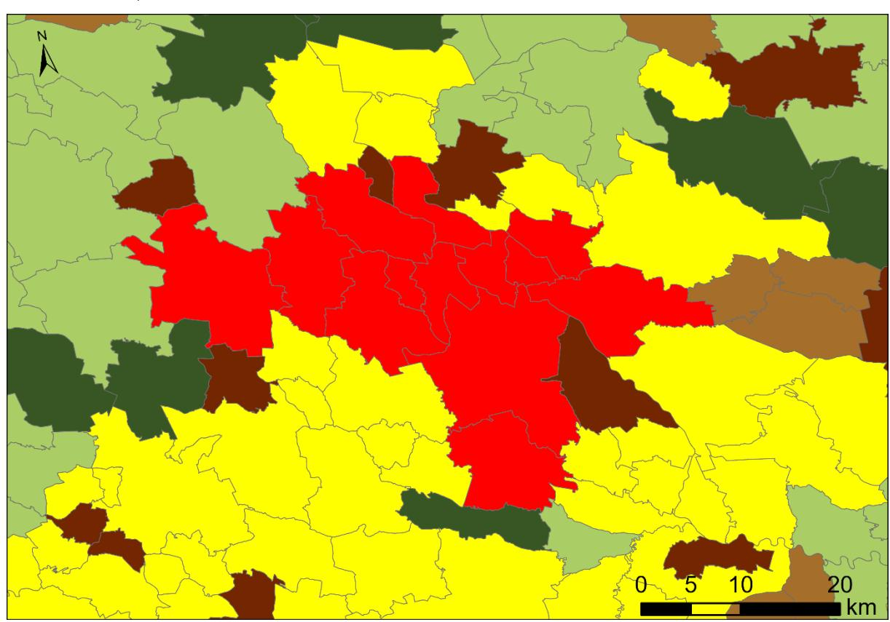

Figure 29 - GHS Degree of Urbanisation Classification (GHS-DUC) GHS-DUC\_GLOBE\_R2023A\_V2\_0\_GADM41\_2020\_level4 joined to the GADM 4.1 level 4 layer, displayed in the area of Katowice (Poland) showing the classification of local units by Degree of Urbanisation Level 2–Legend in [Table 34.](#page-69-2) The boundaries shown on this map do not imply official endorsement or acceptance by the European Union.

36 https://gadm.org/index.html

#### **2.7.1 Improvements compared to previous release**

This classification of administrative units and territories relies on the updated settlement classifications and population spatial raster datasets of GHS P2023 and includes all epochs between 1975 and 2030 at 5-year interval.

### **2.7.2 GHSL Territorial Units Classification**

The Degree of Urbanisation classifies local units based on population majority applied to the grid level classification. Each local unit is assigned exclusively one DEGURBA class at Level 1 and one at Level 2 (hierarchy based). Local units can be administrative units - such as municipalities - or statistical units - such as census enumeration or reporting areas.

#### *2.7.2.1 Territorial units classification Level 1*

Once all grid cells covered by GADM have been classified as urban centres, urban clusters and rural grid cells using the GHS-DUG Tool, the next step concerns overlaying these results onto local units, as follows ([Figure 31](#page-67-3)):

- **Cities (or densely populated areas):** local units that have at least 50% of their population in urban centres, **code 3**.
- **Towns and semi-dense areas (or intermediate density areas):** local units that have less than 50% of their population in urban centres and no more than 50% of their population in rural grid cells, **code 2**.
- **Rural areas (or thinly populated areas):** local units that have more than 50% of their population in rural grid cells, **code 1**.

**Urban areas** consist of cities plus towns and semi-dense areas.

In some countries, not all the small spatial units contain inhabitants. To classify the spatial units without any population, the same rules should be applied to their area as are applied to their population. For example, a small unpopulated spatial unit that has more than 50 % of its area in rural grid cells is classified as a rural area.

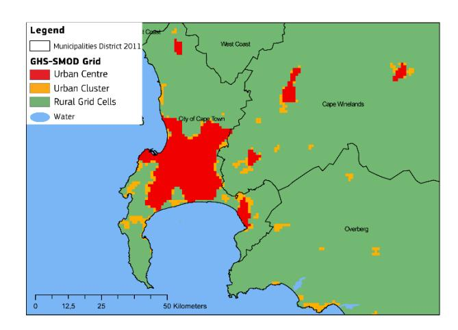

Figure 30 - Urban centre, urban cluster and rural grid cells around Cape Town, South Africa

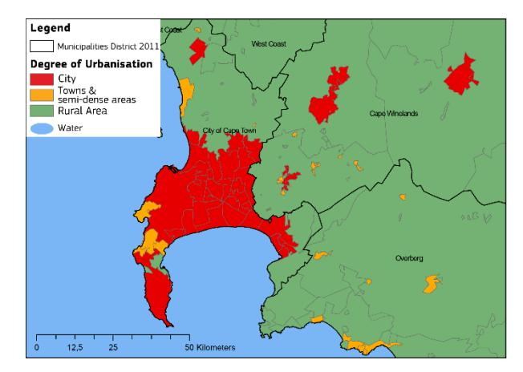

Figure 31 - City, towns & semi-dense areas and rural areas around Cape Town, South Africa (classification of Main Places units, note that Cape Peninsula is part of Cape Town Main Place)

#### *2.7.2.2 Territorial units classification Level 2*

Local units are classified as cities in identical manner to the Degree of Urbanisation level 1 ([Figure 33](#page-68-1)):

— A city consists of local units that have at least 50% of their population in an urban centre, **code 30**.

Local units classified as "towns and semi-dense areas" can be divided into three classes:

- **Dense Towns** have at least 50% of their population in dense urban clusters and urban centres, **code 23**.
- **Semi-dense Towns** have less than 50% of their population living in the combination of dense urban clusters and urban centres AND no more than 50% of their population living in the combination of suburban or peri-urban cells and rural grid cells, **code 22**.
- **Suburban or peri-urban areas** have more than 50% of their population living in the combination of suburban or peri-urban cells and rural grid cells, **code 21**.

Dense and semi-dense towns can be combined into towns. This reduces the number of classes and may be especially useful if the population share in semi-dense towns is low.

Local units classified as "rural areas" can be divided into three classes:

- **Villages** have at least 50% of their population living in the combination of rural clusters, urban clusters and urban centres, **code 13**.
- **Dispersed rural areas** have less than 50% of their population living in the combination of rural clusters, urban clusters and urban centres AND no more than 50% of their population living in very low-density rural grid cells, **code 12**.
- **Very dispersed rural areas** have more than 50% of their population living in very low-density rural grid cells, **code 11**.

As for Level 1, to classify the spatial units without any population, the same rules that are applied to population are applied to area.

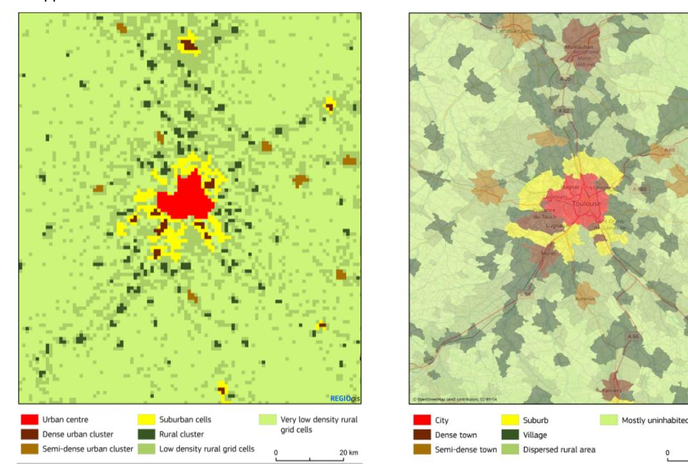

Figure 32 - Degree of urbanisation level 2 grid classification around Toulouse, France

Figure 33 - Degree of urbanisation level 2 local unit classification around Toulouse, France

## *2.7.2.3 Classification workflow*

The classification has been performed combining three inputs of different nature for each epoch and GADM level:

- two raster layers:
  - the settlement classification grid at 1 km for the processed year (GHS-SMOD);
  - the population grid at 100m resolution for the same epoch (GHS-POP);
- one vector layer of territorial units from GADM4.137 at the processed level.

The procedure begins with the rasterization of the vector layer. As suggested, the unit classification works better with the smallest administrative units available, therefore these are rasterized using a resolution of 50 m, snapped to the population grid, to reduce the number of units that will not have a representation in the raster layer. The settlement classification grid (at 1 km resolution) is oversampled using nearest neighbour algorithm to align with the 50-m territorial units' raster. The population grid is also oversampled and the values are then adjusted by dividing all original cells by the oversampling ratio (e.g. from 100 m to 50 m the ratio is 4, as 4 grid cells of 50 m compose each 100 m cell) assuming a uniform distribution of population within each cell.

Once the pre-processing of the layers is completed, the algorithm computes for each unit the share of population in each class of the settlement classification grid (both at Level 1 and 2), through zonal statistics, and assigns the class of the unit accordingly (i.e. following the classification rules described in section[s 2.7.2.1](#page-67-2) and [2.7.2.2\)](#page-68-0). When a unit is unpopulated it runs zonal statistics of areas per settlement classification.

Even if the working resolution is set at 50 m, it could happen that some small polygons could not be rasterised due to geospatial data processing constraints. In such cases the algorithm evaluates the class of these polygons by running separately the zonal statistics (i.e. one polygon at a time) and performing the rasterization procedure with "all touching cells" option. To avoid double counting of population, no population is assigned to such polygons, but the classification still considers population per class in the rasterised cells.

### **2.8 A consistent nomenclature for the Degree of Urbanisation**

Two sets of terms have been developed to describe each of the classes of the Degree of Urbanisation [\(Table](#page-69-2)  [34,](#page-69-2) [Table 35\)](#page-70-2). The first set uses simple and short terms such as city, town, suburb and village. The second set uses a more neutral and technical language. The second set can be helpful to avoid overlap with the terms used in the national definition.

Table 34 - Territorial Units classification L2 nomenclature

| Code | RGB         | Municipal level term Technical term |
|------|-------------|----------------------------------------|
| 30   | 255 0 0     | CITY                                   |
|      |             | LARGE SETTLEMENT                       |
| 23   | 115 38 0    | DENSE TOWN                             |
|      |             | DENSE, MEDIUM SETTLEMENT               |
|      | 168 112 0   | SEMI-DENSE TOWN                        |
| 22   |             | SEMI-DENSE, MEDIUM SETTLEMENT          |
|      | 255 255 0   | SUBURBS OR PERI-URBAN AREA             |
| 21   |             | SEMI-DENSE AREA                        |
|      | 55 86 35    | VILLAGE                                |
| 13   |             | SMALL SETTLEMENT                       |
|      | 171 205 102 | DISPERSED RURAL AREA                   |
| 12   |             | LOW DENSITY AREA                       |
|      | 205 245 122 | MOSTLY UNINHABITED AREA                |
| 11   |             | VERY LOW DENSITY AREA                  |

37 https://gadm.org/download\_world.html

Table 35 - Territorial Units classification L1 nomenclature

| Code | RGB         | Municipal level term      |
|------|-------------|---------------------------|
|      |             | Technical term            |
| 3    | 255 0 0     | CITY                      |
|      |             | DENSELY POPULATED AREA    |
|      | 255 170 0   | TOWNS & SEMI-DENSE AREA   |
| 2    |             | INTERMEDIATE DENSITY AREA |
|      | 115 178 115 | RURAL AREA                |
| 1    |             | THINLY POPULATED AREA     |

#### **2.8.1 How to use the statistics tables**

The classification of territorial units by Degree of Urbanisation has two principal objectives. Primarily to relate available statistics (e.g. Demographic and Health Surveys, statistics on labour, housing, etc.) to a DEGURBA classification (e.g. urban/rural). Second, to account urban and rural populations for administrative areas. Both applications would harmonise nationally collected statistics to a common urban and rural classification of territorial units, useful for international statistical comparison as recommended by the United Nations Statistical Commission.

To relate available national statistics to the corresponding GHS-DUC level, it is important to verify in the mapping table [Table 36](#page-73-0) the relation between the territorial unit for which the statistic is available and the corresponding GADM level. Once the territorial designation in the statistic matches a GADM level, the statistic can be coded by Degree of Urbanisation joining or relating the field identifying the administrative unit in the statistics table, to the GADM level classification of the units by Degree of Urbanisation with the GHS-DUC field 'DEGURBA\_L1' or 'DEGURBA\_L2'. This operation can be conducted using any of the GHS-DUC tables GHS-DUC\_GLOBE\_R2023A\_v1\_0\_GADM41\_*<year>*\_level*X*, where *<year>* correspond to the epoch, and *X* to the GADM Level in the specific table. To account urban and rural populations for administrative areas by Degree of Urbanisation the user can refer to the product GHS-DUC\_GLOBE\_R2023A\_v1\_0.xlsx. The table lists for all GADM countries and territories, the population per unit by Degree of Urbanisation class and the corresponding share for the finest GADM level. The table also includes statistics aggregated at global level and per epoch.

The epoch refers to the underlying GHS-POP and GHS-SMOD epoch used, keeping the GADM geometry fixed (version 4.1).

#### **2.8.2 Input Data**

The input data are the multi-temporal GHS-SMOD and GHS-POP spatial raster datasets of the GHSL Data Package 2023 (GHS P2023). Territorial units are the Global ADMinstrative Map 4.138

38 <https://gadm.org/data.html>

#### **2.8.3 Technical Details**

*Author*: Marcello Schiavina, Michele Melchiorri, Sergio Freire, Joint Research Centre (JRC) European Commission.

*Product name*: GHS\_DUC\_GLOBE\_R2023A

*Spatial extent:* Global

*Temporal extent*: from 1975 to 2030, 5 years interval

#### *2.8.3.1 GHS-DUC Summary Statistics Table*

*Data organisation:* XLSX with Global statistics of Population per DEGURBA class for each epoch, and sheets per epoch showing Territory or Country statistics of classification at the finest GADM level available.

Territory or Country statistics sheet attributes:

GADM code: Numerical ID of territory in GADM

GADM ISO: ISO code of territory in GADM

GADM NAME: Territory name in GADM

- Selected GADM Level: Finest available GADM level for territory
- GADM level type: Description of the selected level according to GADM attribute "ENGTYPE" for the level (When GADM entry is missing description "N/A" is reported)
- Total Units: Total Territory units at selected GADM level
- Total Area km2: Total Area of the territory in km2
- Average Area km2: Average unit size of the territory at selected GADM level
- Share of Urban Population: Share of population in administrative units classified as Urban (Cities, Towns and Suburbs)
- DEGURBA L1 Population
  - o Rural Area: Population of units classified as Rural Areas in Degree of Urbanisation level 1
  - o Town & Semi-Dense area: Population of units classified as Town & Suburbs in Degree of Urbanisation level 1
  - o City: Population of units classified as Cities in Degree of Urbanisation level 1
- DEGURBA L2 Population
  - o Mostly uninhabited area: Population of units classified as Mostly uninhabited Areas in Degree of Urbanisation level 2
  - o Rural dispersed area: Population of units classified as Rural dispersed Areas in Degree of Urbanisation level 2
  - o Village: Population of units classified as Villages in Degree of Urbanisation level 2
  - o Suburban or peri-urban area: Population of units classified as Suburbs or peri-urban areas in Degree of Urbanisation level 2
  - o Semi-dense Town: Population of units classified as Semi-dense Towns in Degree of Urbanisation level 2
  - o Dense Town: Population of units classified as Dense Towns in Degree of Urbanisation level 2
  - o City: Population of units classified as Cities in Degree of Urbanisation level 2
- Total Pop: Total Territory population
- DEGURBA L1 Units
  - o Rural Area: Number of units classified as Rural Areas in Degree of Urbanisation level 1

- o Town & Semi-Dense area: Number of units classified as Town & Suburbs in Degree of Urbanisation level 1
- o City: Number of units classified as Cities in Degree of Urbanisation level 1

#### DEGURBA L2 Units

- o Mostly uninhabited area: Number of units classified as Mostly uninhabited Areas in Degree of Urbanisation level 2
- o Rural dispersed area: Number of units classified as Rural dispersed Areas in Degree of Urbanisation level 2
- o Village: Number of units classified as Villages in Degree of Urbanisation level 2
- o Suburban or peri-urban area: Number of units classified as Suburbs or peri-urban areas in Degree of Urbanisation level 2
- o Semi-dense Town: Number of units classified as Semi-dense Towns in Degree of Urbanisation level 2
- o Dense Town: Number of units classified as Dense Towns in Degree of Urbanisation level 2
- o City: Number of units classified as Cities in Degree of Urbanisation level 2

#### *2.8.3.2 GHS-DUC Admin Classification layers*

*Data organisation*: CSV files to be joined to the original GADM4.1 layer at the respective level.

#### Attributes:

- GID\_<level>: GADM 4.1 ID at current level [join filed with GADM layer at respective level]
- GID\_0: GADM 4.1 ID at country or territory level0
- Tot\_Pop: Total population
- UCentre\_Pop: Urban Centre population
- UCluster\_Pop: Urban Cluster population
- Rural\_Pop: Rural Population
- UCentre\_share: Share of Urban Centre Population
- UCluster\_share: Share of Urban Cluster population
- Urban\_share: Share of Urban Population (Urban Centre + Urban Cluster)
- Rural\_share: Share of Rural Population
- DEGURBA\_L1: Classification according to Degree of Urbanisation level 1
- DUC\_Pop: Dense Urban Cluster Population
- SDUC\_Pop: Semi-dense Urban Cluster Population
- SUrb\_Pop: Suburban and peri-urban grid cells Population
- RC\_Pop: Rural Cluster Population
- LDR\_Pop: Low Density Rural grid cells Population
- VLDR\_Pop: Very Low Density Rural grid cells Population
- DUC\_share: Share of Dense Urban Cluster Population
- SDUC\_share: Share of Semi-dense Urban Cluster Population
- SUrb\_share: Share of Suburban and peri-urban grid cells Population
- RC\_share: Share of Rural Cluster Population
- LDR\_share: Share of Low Density Rural grid cells Population

- VLDR\_share: Share of Very Low Density Rural grid cells Population
- DEGURBA\_L2: Classification according to Degree of Urbanisation level 2

*Classified GADM level types per country or territory:* see [Table 36](#page-73-0)

[Table 37](#page-77-0) outlines the technical characteristics of the datasets released in this data package.

Table 36 - *GADM level type per country or territory (level 0 omitted as representing the full country or territory)*

| ISO ABW Aruba - - - AFG Afghanistan Province District - AGO Angola Province Municpality City Commune Council AIA Anguilla District - - | - - - - - - - | - - - |
|-------------------------------------------------------------------------------------------------------------------------------------------------------------------------------------------------------|---------------------------------|-------------|
|                                                                                                                                                                                                       |                                 |             |
|                                                                                                                                                                                                       |                                 |             |
|                                                                                                                                                                                                       |                                 |             |
|                                                                                                                                                                                                       |                                 |             |
|                                                                                                                                                                                                       |                                 | -           |
| ALA Aland Sub-Region Municipality -                                                                                                                                                       |                                 | -           |
| ALB Albania County NA NA                                                                                                                                                                  |                                 | -           |
| AND Andorra Parish - -                                                                                                                                                                    |                                 | -           |
| ARE United Arab Emirate Municipal Region Municipality Emirates                                                                                                                         | -                               | -           |
| ARG Argentina Province Part -                                                                                                                                                             | -                               | -           |
| ARM Armenia Province - -                                                                                                                                                                  | -                               | -           |
| ASM American Samoa District County Village                                                                                                                                                | -                               | -           |
| ATA Antarctica - - -                                                                                                                                                                      | -                               | -           |
| ATF French Southern District - -                                                                                                                                                          | -                               | -           |
| Territories ATG Antigua and Dependency - -                                                                                                                                             | -                               | -           |
| Barbuda                                                                                                                                                                                               |                                 |             |
| AUS Australia Territory Territory -                                                                                                                                                       | -                               | -           |
| AUT Austria State District Municipality                                                                                                                                                   | Cadastral                       | -           |
|                                                                                                                                                                                                       | community                       |             |
| AZE Azerbaijan Region District -                                                                                                                                                          | -                               | -           |
| BDI Burundi Province Commune Colline                                                                                                                                                      | Sous Colline                    | -           |
| BEL Belgium Region Capital Region Arrondissement                                                                                                                                          | Commune                         | -           |
| BEN Benin Department Commune Borough                                                                                                                                                      | -                               | -           |
| BES Bonaire, Sint Municipality - -                                                                                                                                                        | -                               | -           |
| Eustatius and Saba                                                                                                                                                                                 |                                 |             |
| BFA Burkina Faso Region Province Department                                                                                                                                               | -                               | -           |
| BGD Bangladesh Division Distict Upazilla                                                                                                                                                  | Union                           | -           |
| BGR Bulgaria Province Municipality -                                                                                                                                                      | -                               | -           |
| BHR Bahrain Governorate - -                                                                                                                                                               | -                               | -           |
| BHS Bahamas District - -                                                                                                                                                                  | -                               | -           |
| BIH Bosnia and District Canton Commune                                                                                                                                                    | -                               | -           |
| Herzegovina                                                                                                                                                                                           |                                 |             |
| BLM Saint-Barthelemy Parish Quarter -                                                                                                                                                     | -                               | -           |
| BLR Belarus Region District -                                                                                                                                                             | -                               | -           |
| BLZ Belize District - -                                                                                                                                                                   | -                               | -           |
| BMU Bermuda Parish - -                                                                                                                                                                    | -                               | -           |
| BOL Bolivia Department Province Distrito                                                                                                                                                  | -                               | -           |
| BRA Brazil State Municipality -                                                                                                                                                           | -                               | -           |
| BRB Barbados Parish - -                                                                                                                                                                   | -                               | -           |
| BRN Brunei District Mukim -                                                                                                                                                               | -                               | -           |
| BTN Bhutan District Village block -                                                                                                                                                       | -                               | -           |
| BVT Bouvet Island - - -                                                                                                                                                                   | -                               | -           |
| BWA Botswana District Sub-district -                                                                                                                                                      | -                               | -           |
| CAF Central African Prefecture Sub-prefecture - Republic                                                                                                                               | -                               | -           |
| CAN Canada Province Census Division Town                                                                                                                                                  | -                               | -           |
|                                                                                                                                                                                                       |                                 |             |
| CCK Cocos Islands - - -                                                                                                                                                                   | -                               | -           |
| CHE Switzerland Canton District Municipality                                                                                                                                              | -                               | -           |
| CHL Chile Region Province Municipality                                                                                                                                                    | -                               | -           |
| CHN China Province Prefecture City County City                                                                                                                                            | -                               | -           |
| CIV Côte d'Ivoire Autonomous Autonomous district Department district                                                                                                                   | Sub-prefecture                  | -           |
| CMR Cameroon Region Department Arrondissement                                                                                                                                             | -                               | -           |
| COD Democratic Province Territory - Republic of the                                                                                                                                    | -                               | -           |
| Congo                                                                                                                                                                                                 |                                 |             |
| COG Republic of the Region District -                                                                                                                                                     | -                               | -           |
| Congo COK Cook Islands Island Council - -                                                                                                                                              | -                               | -           |

| COL        | Colombia              | Commissiary            | Corregimiento Departamental | -                 | -            | -       |
|------------|-----------------------|------------------------|--------------------------------|-------------------|--------------|---------|
| COM        | Comoros               | Autonomous Island   | -                              | -                 | -            | -       |
| CPV        | Cabo Verde            | County                 | -                              | -                 | -            | -       |
| CRI        | Costa Rica            | Province               | Canton                         | District          | -            | -       |
| CUB        | Cuba                  | Province               | Municipality                   | -                 | -            | -       |
| CUW        | Curaçao               | -                      | -                              | -                 | -            | -       |
| CXR        | Christmas Island      | -                      | -                              | -                 | -            | -       |
| CYM        | Cayman Islands        | District               | -                              | -                 | -            | -       |
| CYP        | Cyprus                | District               | -                              | -                 | -            | -       |
|            |                       |                        |                                |                   |              |         |
| CZE        | Czechia               | Region                 | District                       | -                 | -            | -       |
| DEU        | Germany               | State                  | District                       | Municipality      | Town         | -       |
| DJI        | Djibouti              | Region                 | NA                             | -                 | -            | -       |
| DMA        | Dominica              | Parish                 | -                              | -                 | -            | -       |
| DNK        | Denmark               | Region                 | Municipality                   | -                 | -            | -       |
| DOM        | Dominican Republic | Province               | Municipality                   | -                 | -            | -       |
| DZA        | Algeria               | Province               | Chef-Lieu-Wilaya               | -                 | -            | -       |
| ECU        | Ecuador               | Province               | Canton                         | Cantonal Head     | -            | -       |
| EGY        | Egypt                 | Governorate            | Subdivision                    | -                 | -            | -       |
| ERI        | Eritrea               | Region                 | District                       | -                 | -            | -       |
| ESH        | Western Sahara        | Province               | -                              | -                 | -            | -       |
| ESP        | Spain                 | Autonomous             | Province                       | Comarca           | Municipality | -       |
|            |                       | Community              |                                |                   |              |         |
| EST        | Estonia               | County                 | Parish                         | Town              | -            | -       |
| ETH        | Ethiopia              | City                   | Zone                           | District          | -            | -       |
| FIN        | Finland               | Province               | Region                         | Sub-Region        | Municipality | -       |
| FJI        | Fiji                  | Division               | Province                       | -                 | -            | -       |
| FLK        | Falkland Islands      | -                      | -                              | -                 | -            | -       |
| FRA        | France                | Region                 | Department                     | Districts         | Canton       | Commune |
| FRO        | Faroe Islands         | Region                 | Commune                        | -                 | -            | -       |
| FSM        | Micronesia            | State                  | Municipality                   | -                 | -            | -       |
|            |                       |                        |                                |                   |              |         |
| GAB        | Gabon                 | Province               | Department                     | -                 | -            | -       |
| GBR        | United Kingdom        | Constituent Country | Unitary Authority              | Unitary authority | NA           | -       |
| GEO        | Georgia               | Autonomous Republic | District                       | -                 | -            | -       |
| GGY        | Guernsey              | Parish                 | -                              | -                 | -            | -       |
| GHA        | Ghana                 | Region                 | Municipality                   | -                 | -            | -       |
| GIB        | Gibraltar             | -                      | -                              | -                 | -            | -       |
| GIN        | Guinea                | Region                 | Prefecture                     | Sub-prefecture    | -            | -       |
| GLP        | Guadeloupe            | District               | Commune                        | -                 | -            | -       |
| GMB        | Gambia                | Independent City       | District                       | -                 | -            | -       |
| GNB        | Guinea-Bissau         | Region                 | Sector                         | -                 | -            | -       |
| GNQ        | Equatorial Guinea     | Province               | Districts Municipals           | -                 | -            | -       |
| GRC        | Greece                | Decentralized          | Region                         | Municipality      | -            | -       |
|            |                       | administration         |                                |                   |              |         |
|            |                       |                        |                                |                   |              |         |
| GRD        | Grenada               | Dependency             | -                              | -                 | -            | -       |
| GRL        | Greenland             | Commune                | -                              | -                 | -            | -       |
| GTM        | Guatemala             | Department             | Municipality                   | -                 | -            | -       |
| GUF        | French Guiana         | Arrondissement         | Commune                        | -                 | -            | -       |
| GUM        | Guam                  | Municipality           | -                              | -                 | -            | -       |
| GUY        | Guyana                | Region                 | Not Classified                 | -                 | -            | -       |
| HMD        | Heard Island and      | -                      | -                              | -                 | -            | -       |
|            | McDonald Island       |                        |                                |                   |              |         |
| HND        | Honduras              | Department             | Municipality                   | -                 | -            | -       |
| HRV        | Croatia               | County                 | Commune                        | -                 | -            | -       |
| HTI        | Haiti                 | Department             | District                       | Commune           | Sub-commune  | -       |
| HUN        | Hungary               | County                 | Subregion                      | -                 | -            | -       |
| IDN        | Indonesia             | Province               | Regency                        | Sub-district      | Village      | -       |
| IMN        | Isle of Man           | Parish District        | -                              | -                 | -            | -       |
| IND        | India                 | Union Territory        | District                       | Taluk             | -            | -       |
| IOT        | British Indian        | -                      | -                              | -                 | -            | -       |
|            | Ocean Territory       |                        |                                |                   |              |         |
| IRL        | Ireland               | County                 | Municipal District             | -                 | -            | -       |
| IRN        | Iran                  | Province               | County                         | -                 | -            | -       |
| IRQ        | Iraq                  | Province               | District                       | -                 | -            | -       |
| ISL        |                       |                        |                                |                   | -            |         |
|            |                       |                        |                                |                   |              |         |
|            | Iceland               | Region                 | Municipality                   | -                 |              | -       |
| ISR        | Israel                | District               | -                              | -                 | -            | -       |
| ITA        | Italy                 | Region                 | Province                       | Commune           | -            | -       |
| JAM        | Jamaica               | Parish                 | -                              | -                 | -            | -       |
| JEY JOR | Jersey Jordan      | Parish Province     | - Sub-Province              | - -            | - -       | - -  |

| JPN | Japan            | Prefecture        | Town                  | -                | -             | - |
|-----|------------------|-------------------|-----------------------|------------------|---------------|---|
| KAZ | Kazakhstan       | Region            | District              | -                | -             | - |
|     |                  |                   |                       |                  |               |   |
| KEN | Kenya            | County            | Constituency          | Ward             | -             | - |
| KGZ | Kyrgyzstan       | Province          | District              | -                | -             | - |
| KHM | Cambodia         | Province          | District              | Commune          | -             | - |
|     |                  |                   |                       |                  |               |   |
| KIR | Kiribati         | -                 | -                     | -                | -             | - |
| KNA | Saint Kitts and  | Parish            | -                     | -                | -             | - |
|     | Nevis            |                   |                       |                  |               |   |
|     |                  |                   |                       |                  |               |   |
| KOR | South Korea      | Metropolitan City | District              | Neighborhood     | -             | - |
| KWT | Kuwait           | Province          | -                     | -                | -             | - |
|     |                  |                   |                       |                  |               |   |
| LAO | Laos             | Province          | District              | -                | -             | - |
| LBN | Lebanon          | Governorate       | District              | Municipality     | -             | - |
| LBR | Liberia          | County            | District              | Clan             | -             | - |
|     |                  |                   |                       |                  |               |   |
| LBY | Libya            | District          | -                     | -                | -             | - |
| LCA | Saint Lucia      | Quarter           | -                     | -                | -             | - |
| LIE | Liechtenstein    | Commune           | -                     | -                | -             | - |
|     |                  |                   |                       |                  |               |   |
| LKA | Sri Lanka        | District          | Division              | -                | -             | - |
| LSO | Lesotho          | District          | -                     | -                | -             | - |
| LTU | Lithuania        | County            | District Municipality | -                | -             | - |
|     |                  |                   |                       |                  |               |   |
| LUX | Luxembourg       | District          | Canton                | Commune          | Commune (same | - |
|     |                  |                   |                       |                  | as level 3)   |   |
| LVA | Latvia           | Province          | District              | -                | -             | - |
|     |                  |                   |                       |                  |               |   |
| MAF | Saint-Martin     | -                 | -                     | -                | -             | - |
| MAR | Morocco          | Region            | Province              | District         | Rural Commune | - |
|     |                  |                   |                       |                  |               |   |
| MCO | Monaco           | -                 | -                     | -                | -             | - |
| MDA | Moldova          | District          | -                     | -                | -             | - |
| MDG | Madagascar       | NA                | NA                    | NA               | NA            | - |
|     |                  |                   |                       |                  |               |   |
| MDV | Maldives         | -                 | -                     | -                | -             | - |
| MEX | Mexico           | State             | Municipality          | -                | -             | - |
| MHL | Marshall Islands | Atol              | -                     | -                | -             | - |
|     |                  |                   |                       |                  |               |   |
| MKD | North Macedonia  | Municipality      | -                     | -                | -             | - |
| MLI | Mali             | District          | Circle                | Arrondissement   | Commune       | - |
| MLT | Malta            | Region            | Local council         | -                | -             | - |
|     |                  |                   |                       |                  |               |   |
| MMR | Myanmar          | Division          | District              | Village Township | -             | - |
| MNE | Montenegro       | Municipality      | -                     | -                | -             | - |
| MNG | Mongolia         | Province          | Sum                   | -                | -             | - |
|     |                  |                   |                       |                  |               |   |
| MNP | Northern Mariana | Municipality      | -                     | -                | -             | - |
|     | Islands          |                   |                       |                  |               |   |
| MOZ | Mozambique       | Province          | District              | Locality         | -             | - |
|     |                  |                   |                       |                  |               |   |
| MRT | Mauritania       | Region            | Department            | -                | -             | - |
| MSR | Montserrat       | Parish            | -                     | -                | -             | - |
|     |                  |                   |                       |                  |               |   |
| MTQ | Martinique       | Arrondissement    | Commune               | -                | -             | - |
| MUS | Mauritius        | Region            | -                     | -                | -             | - |
| MWI | Malawi           | District          | Town                  | Unknown          | -             | - |
|     |                  |                   |                       |                  |               |   |
| MYS | Malaysia         | State             | District              | -                | -             | - |
| MYT | Mayotte          | Commune           | -                     | -                | -             | - |
| NAM | Namibia          | Region            | Constituency          | -                | -             | - |
|     |                  |                   |                       |                  |               |   |
| NCL | New Caledonia    | Province          | Commune               | -                | -             | - |
| NER | Niger            | Department        | Arrondissement        |                  |               |   |
|     |                  |                   |                       | Commune          | -             | - |
|     |                  |                   |                       |                  |               |   |
| NFK | Norfolk Island   | -                 | -                     | -                | -             | - |
| NGA | Nigeria          | State             | Local Authority       | -                | -             | - |
|     |                  |                   |                       |                  |               |   |
| NIC | Nicaragua        | Autonomous        | Municipality          | -                | -             | - |
|     |                  | Region            |                       |                  |               |   |
| NIU | Niue             | -                 | -                     | -                | -             | - |
|     |                  |                   |                       |                  |               |   |
| NLD | Netherlands      | Province          | Municipality          | -                | -             | - |
| NOR | Norway           | County            | Municipality          | -                | -             | - |
| NPL | Nepal            | Development       | Administrative Zone   | District         | Village       | - |
|     |                  |                   |                       |                  |               |   |
|     |                  | Region            |                       |                  | development   |   |
|     |                  |                   |                       |                  | committee     |   |
| NRU | Nauru            | District          | -                     | -                | -             | - |
|     |                  |                   |                       |                  |               |   |
| NZL | New Zealand      | Region            | District              | -                | -             | - |
| OMN | Oman             | Region            | Province              | -                | -             | - |
|     |                  |                   |                       |                  |               |   |
| PAK | Pakistan         | Province          | Division              | District         | -             | - |
| PAN | Panama           | Province          | District              | Municipality     | -             | - |
| PCN | Pitcairn Islands | -                 | -                     | -                | -             | - |
|     |                  |                   |                       |                  |               |   |
| PER | Peru             | Region            | Province              | District         | -             | - |
| PHL | Philippines      | Province          | Municipality          | Village          | -             | - |
| PLW | Palau            | State             | -                     | -                | -             | - |
|     |                  |                   |                       |                  |               |   |
| PNG | Papua New        | Autonomous        | District              | -                | -             | - |
|     | Guinea           | Region            |                       |                  |               |   |
| POL | Poland           | Voivodeship       | County                | Municipality     | -             | - |
|     |                  |                   |                       |                  |               |   |
|     |                  |                   |                       | (urban)          |               |   |
| PRI | Puerto Rico      | Municipality      | -                     | -                | -             | - |
| PRK | North Korea      | Province          | County                | -                | -             | - |

| PRT | Portugal           | District           | Municipality        | Parish         | -       | -  |
|-----|--------------------|--------------------|---------------------|----------------|---------|----|
| PRY | Paraguay           | Department         | District            | -              | -       | -  |
| PSE | Palestine          | District           | Governorate         | -              | -       | -  |
|     |                    |                    |                     |                |         |    |
| PYF | French Polynesia   | Administrative     | -                   | -              | -       | -  |
|     |                    | subdivisions       |                     |                |         |    |
| QAT | Qatar              | Municipality       | -                   | -              | -       | -  |
| REU | Reunion            | Arrondissement     | Commune             | -              | -       | -  |
| ROU | Romania            | County             | Commune             | -              | -       | -  |
| RUS | Russia             | Republic           | District            | NA             | -       | -  |
| RWA | Rwanda             | Province           | District            | Sector         | Cell    | NA |
| SAU | Saudi Arabia       | Province           | Governorate         | -              | -       | -  |
|     |                    |                    |                     |                |         |    |
| SDN | Sudan              | State              | District            | Unknown        | -       | -  |
| SEN | Senegal            | Region             | Department          | Arrondissement | Commune | -  |
| SGP | Singapore          | Region             | -                   | -              | -       | -  |
| SGS | South Georgia      | -                  | -                   | -              | -       | -  |
|     | and the South      |                    |                     |                |         |    |
|     | Sand               |                    |                     |                |         |    |
| SHN | Saint Helena,      | Administrative     | Administrative Area | -              | -       | -  |
|     | Ascension and      | Area               |                     |                |         |    |
|     |                    |                    |                     |                |         |    |
|     | Tris               |                    |                     |                |         |    |
| SJM | Svalbard and Jan   | Territory          | -                   | -              | -       | -  |
|     | Mayen              |                    |                     |                |         |    |
| SLB | Solomon Islands    | Province           | Ward                | -              | -       | -  |
| SLE | Sierra Leone       | Province           | District            | Chiefdom       | -       | -  |
| SLV | El Salvador        | Department         | Municipality        | -              | -       | -  |
| SMR | San Marino         | Municipality       | -                   | -              | -       | -  |
|     |                    |                    |                     |                |         |    |
| SOM | Somalia            | Region             | District            | -              | -       | -  |
| SPM | Saint Pierre and   | Commune            | -                   | -              | -       | -  |
|     | Miquelon           |                    |                     |                |         |    |
| SRB | Serbia             | District           | Town Municipal      | -              | -       | -  |
| SSD | South Sudan        | State              | District            | Unknown        | -       | -  |
| STP | Sao Tome and       | Municipality       | NA                  | -              | -       | -  |
|     | Principe           |                    |                     |                |         |    |
|     |                    |                    |                     |                |         |    |
| SUR | Suriname           | District           | Ressort             | -              | -       | -  |
| SVK | Slovakia           | Region             | District            | -              | -       | -  |
| SVN | Slovenia           | Statistical Region | Commune Municipal   | -              | -       | -  |
|     |                    |                    | ity                 |                |         |    |
| SWE | Sweden             | County             | Municipality        | -              | -       | -  |
| SWZ | Swaziland          | District           | Constituency        | -              | -       | -  |
| SXM | Sint Maarten       | -                  | -                   | -              | -       | -  |
|     |                    |                    |                     |                |         |    |
| SYC | Seychelles         | District           | -                   | -              | -       | -  |
| SYR | Syria              | Governorate        | District            | -              | -       | -  |
| TCA | Turks and Caicos   | District           | -                   | -              | -       | -  |
|     | Islands            |                    |                     |                |         |    |
| TCD | Chad               | Region             | Department          | Sub-prefecture | -       | -  |
| TGO | Togo               | Region             | Prefecture          | Commune        | -       | -  |
| THA | Thailand           | Province           | District            | Sub district   | -       | -  |
| TJK | Tajikistan         | Districts of       | District            | NA             | -       | -  |
|     |                    |                    |                     |                |         |    |
|     |                    | Republican         |                     |                |         |    |
|     |                    | Subordin           |                     |                |         |    |
| TKL | Tokelau            | Atoll              | -                   | -              | -       | -  |
| TKM | Turkmenistan       | Province           | District            | -              | -       | -  |
| TLS | Timor-Leste        | District           | Subdistrict         | Community      | -       | -  |
| TON | Tonga              | Island Group       | NA                  | -              | -       | -  |
| TTO | Trinidad and       | Borough            | -                   | -              | -       | -  |
|     | Tobago             |                    |                     |                |         |    |
|     |                    |                    |                     |                |         |    |
| TUN | Tunisia            | Governorate        | Delegation          | -              | -       | -  |
| TUR | Turkey             | Province           | District            | -              | -       | -  |
| TUV | Tuvalu             | Town Council       | -                   | -              | -       | -  |
| TWN | Taiwan             | Province           | County              | -              | -       | -  |
| TZA | Tanzania           | Region             | District            | Ward           | -       | -  |
| UGA | Uganda             | District           | County              | Sub-county     | Parish  | -  |
| UKR | Ukraine            | ?                  | NA                  | -              | -       | -  |
|     |                    |                    |                     |                |         |    |
| UMI | United States      | Island             | -                   | -              | -       | -  |
|     | Minor Outlying Isl |                    |                     |                |         |    |
| URY | Uruguay            | Department         | Municipiality       | -              | -       | -  |
| USA | United States      | State              | County              | -              | -       | -  |
| UZB | Uzbekistan         | Region             | District            | -              | -       | -  |
| VAT | Vatican City       | -                  | -                   | -              | -       | -  |
| VCT | Saint Vincent and  | Parish             | -                   | -              | -       | -  |
|     | the Grenadines     |                    |                     |                |         |    |
|     |                    |                    |                     |                |         |    |
| VEN | Venezuela          | State              | Municipality        | -              | -       | -  |
| VGB | British Virgin     | District           | -                   | -              | -       | -  |
|     | Islands            |                    |                     |                |         |    |
|     |                    |                    |                     |                |         |    |

| VIR  | Virgin Islands, U.S. | District       | NA                    | -                  | -       | -       |
|------|----------------------|----------------|-----------------------|--------------------|---------|---------|
| VNM  | Vietnam              | Province       | District              | Townlet            | -       | -       |
| VUT  | Vanuatu              | Province       | Area council          | -                  | -       | -       |
| WLF  | Wallis and Futuna    | Kingdom        | District              | -                  | -       | -       |
| WSM  | Samoa                | District       | Unknown               | -                  | -       | -       |
| XAD  | Akrotiri and         | Sovereign Base | -                     | -                  | -       | -       |
|      | Dhekelia             | Area           |                       |                    |         |         |
| XCA  | Caspian Sea          | -              | -                     | -                  | -       | -       |
| XCL  | Clipperton Island    | -              | -                     | -                  | -       | -       |
| XKO  | Kosovo               | District       | Town Municipal        | -                  | -       | -       |
| XPI  | Paracel Islands      | -              | -                     | -                  | -       | -       |
| XSP  | Spratly Islands      | -              | -                     | -                  | -       | -       |
| YEM  | Yemen                | Governorate    | District              | -                  | -       | -       |
| ZAF  | South Africa         | Province       | District Municipality | Local Municipality | Ward    | -       |
| ZMB  | Zambia               | Province       | District              | -                  | -       | -       |
| ZNC  | Northern Cyprus      | District       | -                     | -                  | -       | -       |
| ZWE  | Zimbabwe             | City           | District              | Ward               | -       | -       |
| GADM | GADM NAME            | Level 1        | Level 2               | Level 3            | Level 4 | Level 5 |
| ISO  |                      |                |                       |                    |         |         |
| ABW  | Aruba                | -              | -                     | -                  | -       | -       |

Table 37 - Technical details of the datasets in GHS-DUC\_GLOBE\_R2023A

| GHS-DUC_GLOBE_R2023A                                               |                                                                                                                                                   |  |  |
|--------------------------------------------------------------------|---------------------------------------------------------------------------------------------------------------------------------------------------|--|--|
| ID                                                                 | Description                                                                                                                                       |  |  |
| GHS_DUC_GLOBE_R2023A_V2_0                                          | Global Degree of Urbanisation by epoch File format: excel table                                                                                |  |  |
| GHS_DUC_GLOBE_R2023A_V2_0_GADM41_E <epoch>_<level></level></epoch> | Degree of Urbanisation of GADM36 <level> 0-5 units in epoch 1975-2030 (5 years interval) File format: comma separated values file</level> |  |  |

#### **2.8.4 Summary statistics**

Table 38 - Summary statistics of total population in each administrative classification typology at global level as obtained from the 1-km GHS-SMOD grids L1 and L2 and GHS-POP 100m.

|                  | GLOBAL DEGURBA 1975 1980 1985 1990 |               |       |               |       |               |       |               |       |
|------------------|------------------------------------------------|---------------|-------|---------------|-------|---------------|-------|---------------|-------|
| Urban Population |                                                | 3,142,876,187 | 77.3% | 3,477,708,146 | 78.3% | 3,871,970,622 | 79.7% | 4,316,379,497 | 81.3% |
| DEGURBAL1        | City                                           | 1,229,964,629 | 30.2% | 1,383,038,083 | 31.1% | 1,563,399,448 | 32.2% | 1,753,466,916 | 33.5% |
|                  | Town & Semi Dense areas                     | 1,912,911,558 | 47.0% | 2,094,670,063 | 47.2% | 2,308,571,174 | 47.5% | 2,562,912,581 | 47.7% |
|                  | Rural Area                                     | 923,807,063   | 22.7% | 963,156,836   | 21.7% | 986,130,673   | 20.3% | 995,549,748   | 18.7% |
|                  | City                                           | 1,229,964,629 | 30.2% | 1,383,038,083 | 31.1% | 1,563,399,448 | 32.2% | 1,753,466,916 | 33.5% |
|                  | Dense Town                                     | 814,583,340   | 20.0% | 808,138,047   | 18.2% | 815,935,759   | 16.8% | 878,505,975   | 34.7% |
|                  | Semi-dense Town                                | 234,821,901   | 5.8%  | 267,648,384   | 6.0%  | 295,738,727   | 6.1%  | 338,392,976   | 4.6%  |
| DEGURBAL2        | Suburban or peri-urban area                 | 863,506,317   | 21.2% | 1,018,883,632 | 22.9% | 1,196,896,688 | 24.6% | 1,346,013,630 | 8.4%  |
|                  | Village                                        | 503,914,625   | 12.4% | 531,151,339   | 12.0% | 551,444,324   | 11.4% | 565,612,457   | 7.7%  |
|                  | Rural dispersed area                           | 376,380,386   | 9.3%  | 390,828,523   | 8.8%  | 396,325,625   | 8.2%  | 394,604,585   | 9.6%  |
|                  | Mostly uninhabited area                        | 43,512,051    | 1.1%  | 41,176,974    | 0.9%  | 38,360,723    | 0.8%  | 35,332,707    | 1.5%  |

| GLOBAL DEGURBA |                                |                       |       |                       |       |                       |       |                       |       |
|----------------|--------------------------------|-----------------------|-------|-----------------------|-------|-----------------------|-------|-----------------------|-------|
|                | Urban Population               | 1995 4,757,720,490 | 82.9% | 2000 5,180,022,071 | 84.3% | 2005 5,581,387,335 | 85.2% | 2010 6,001,317,887 | 86.0% |
| DEGURBAL1      | City                           | 2,032,321,162         | 35.4% | 2,357,371,004         | 38.4% | 2,611,317,944         | 39.9% | 2,880,118,873         | 41.5% |
|                | Town & Semi Dense areas     | 2,725,399,327         | 47.5% | 2,822,651,067         | 45.9% | 2,970,069,391         | 45.3% | 3,121,199,014         | 44.5% |
|                | Rural Area                     | 980,830,449           | 17.1% | 963,751,987           | 15.7% | 970,956,073           | 14.8% | 977,593,163           | 14.0% |
|                | City                           | 2,032,321,162         | 35.4% | 2,357,371,004         | 38.4% | 2,611,317,944         | 39.9% | 2,880,118,873         | 41.5% |
| DEGURBAL2      | Dense Town                     | 973,715,095           | 17.0% | 1,074,197,206         | 17.5% | 1,139,048,521         | 17.4% | 1,191,078,233         | 32.6% |
|                | Semi-dense Town                | 395,596,456           | 6.9%  | 381,409,413           | 6.2%  | 412,399,523           | 6.3%  | 440,876,326           | 3.8%  |
|                | Suburban or peri-urban area | 1,356,087,777         | 23.6% | 1,367,044,448         | 22.3% | 1,418,621,347         | 21.7% | 1,489,244,455         | 8.2%  |
|                | Village                        | 564,634,227           | 9.8%  | 558,774,796           | 9.1%  | 562,262,674           | 8.6%  | 563,853,536           | 5.5%  |
|                | Rural dispersed area           | 384,019,323           | 6.7%  | 375,979,623           | 6.1%  | 380,824,184           | 5.8%  | 387,916,170           | 7.5%  |
|                | Mostly uninhabited area        | 32,176,898            | 0.6%  | 28,997,568            | 0.5%  | 27,869,216            | 0.4%  | 25,823,458            | 1.0%  |

|                  | GLOBAL DEGURBA                 |               |       |               |       |               |       |               |       |
|------------------|--------------------------------|---------------|-------|---------------|-------|---------------|-------|---------------|-------|
|                  |                                | 2015          |       | 2020          |       | 2025          |       | 2030          |       |
| Urban Population |                                | 6,428,637,766 | 86.7% | 6,807,360,689 | 86.9% | 7,147,714,605 | 87.4% | 7,500,839,549 | 87.9% |
| DEGURBAL1        | City                           | 3,158,542,835 | 42.6% | 3,426,245,389 | 43.7% | 3,642,946,981 | 44.5% | 3,895,633,406 | 45.8% |
|                  | Town & Semi Dense areas     | 3,270,094,930 | 44.1% | 3,381,115,300 | 43.2% | 3,504,767,625 | 42.8% | 3,605,206,143 | 42.0% |
|                  | Rural Area                     | 990,398,283   | 13.3% | 1,025,100,433 | 13.1% | 1,035,104,823 | 12.6% | 1,035,587,257 | 12.1% |
|                  | City                           | 3,158,542,835 | 42.6% | 3,426,245,389 | 43.7% | 3,642,946,981 | 44.5% | 3,895,633,406 | 45.8% |
| DEGURBAL2        | Dense Town                     | 1,213,340,535 | 16.4% | 1,142,394,165 | 14.6% | 1,154,464,387 | 14.1% | 1,154,360,882 | 26.1% |
|                  | Semi-dense Town                | 452,136,914   | 6.1%  | 425,439,610   | 5.4%  | 445,646,041   | 5.4%  | 440,539,707   | 4.8%  |
|                  | Suburban or peri-urban area | 1,604,617,482 | 21.6% | 1,813,281,525 | 23.2% | 1,904,657,197 | 23.3% | 2,010,305,554 | 11.1% |
|                  | Village                        | 569,011,406   | 7.7%  | 589,379,526   | 7.5%  | 610,191,886   | 7.5%  | 604,077,202   | 4.4%  |
|                  | Rural dispersed area           | 398,192,939   | 5.4%  | 415,007,076   | 5.3%  | 405,573,817   | 5.0%  | 412,554,764   | 7.1%  |
|                  | Mostly uninhabited area        | 23,193,938    | 0.3%  | 20,713,831    | 0.3%  | 19,339,121    | 0.2%  | 18,955,292    | 0.6%  |

#### **2.8.5 How to cite**

#### Dataset:

*Schiavina, Marcello; Melchiorri, Michele; Freire, Sergio (2023): GHS-DUC R2023A - GHS Degree of Urbanisation Classification, application of the Degree of Urbanisation methodology (stage II) to GADM 4.1 layer, multitemporal (1975-2030). European Commission, Joint Research Centre (JRC) [Dataset] doi: 10.2905/DC0EB21D-472C-4F5A-8846-823C50836305 PID: http://data.europa.eu/89h/dc0eb21d-472c-4f5a-8846-823c50836305*

#### Concept & Methodology:

*European Commission, and Statistical Office of the European Union, 2021. Applying the Degree of Urbanisation — A methodological manual to define cities, towns and rural areas for international comparisons — 2021 edition Publications Office of the European Union, 2021, ISBN 978-92-76-20306-3 doi:10.2785/706535*

# **2.9 GHS-BUILT-LAUSTAT R2023A - GHS built-up surface statistics in European LAU, multitemporal (1975-2020)**

This product contains the summary statistics of GHS-BUILT-S multi-temporal (1975-2020) at Local Administrative Unit level (LAU) from the 2020 polygon layer provided by GISCO.

For each LAU the table contains the sum of built-up surface (GHS-BUILT-S) between 1975 and 2020 in 5 years interval, expressed in square kilometres.

#### **2.9.1 Input data**

The new product GHS-BUILT-S\_GLOBE\_R2023A (version 1.0) was used to compute the total built-up surface present at each epoch in EU LAU. The LAU geometry is obtained from GISCO39 .

### **2.9.2 Technical Details**

*Author*: Marcello Schiavina, Michele Melchiorri, Joint Research Centre (JRC) European Commission

*Product name*: GHS-BUILT-LAUSTAT\_EUROPE\_R2023A

Spatial extent: Global

*Temporal extent*: 1975-2020 (5 years interval)

*Data organisation*: Data are provided as excel table with LAU codes ("GISCO ID"), country code ("Country") and

built-up in square kilometres for each epoch

[Table 15](#page-35-2) outlines the technical characteristics of the datasets released in this data package.

Table 39 - Technical details of the datasets in GHS-BUILT-LAU2STAT\_EUROPE\_R2023A

| GHS-BUILT-LAU2STAT_EUROPE_R2023A        |                                          |  |  |  |  |
|-----------------------------------------|------------------------------------------|--|--|--|--|
| ID                                      | Description                              |  |  |  |  |
| GHS_BUILT_LAUSTAT_MT_EUROPE_R2023A_V1_0 | zonal sums of built-up surface MT by LAU |  |  |  |  |

#### **2.9.3 How to cite**

#### Dataset:

*Schiavina, Marcello; Melchiorri, Michele (2023): GHS-BUILT-LAUSTAT R2023A - GHS built-up surface statistics in European LAU, multitemporal (1975-2020). European Commission, Joint Research Centre (JRC) [Dataset] doi: 10.2905/C56D51B2-AA73-4DA8-8184-67D3D6816F16 PID: http://data.europa.eu/89h/c56d51b2-aa73- 4da8-8184-67d3d6816f16*

Concept & Methodology:

*Schiavina, Marcello; Melchiorri, Michele; Corbane, Christina; Freire, Sergio; Batista e Silva, Filipe (2022): Built-up areas are expanding faster than population growth: regional patterns and trajectories in Europe, Journal of Land Use Science, DOI: 10.1080/1747423X.2022.2055184*

39 <https://ec.europa.eu/eurostat/web/gisco/geodata/reference-data/administrative-units-statistical-units/lau>

# **2.10 GHS-SDATA R2023A - GHSL data supporting the production of R2023A Data Package (GHS-BUILT, GHS-POP)**

The GHS-SDATA product contains several intermediate data supporting the production of the R2023A with the function of baseline or quality control: consequently they have a downstream effect on the characteristics of the final information included in the R2023A. They are shared for the purpose of a better understanding of the GHSL data characteristics and facilitate the transparency of the GHSL production workflow.

GHS\_SDATA\_LDS\_QUANT reports about the quantity of Landsat image data measurements used by the GHSL for assessing each specific epoch, aggregated at 100m-resolution.

GHS\_SDATA\_WUP2018\_BOUNDARIES reports about the 'city' boundaries as have been estimated during the GHSL production from the UN World Urbanization Prospects 2018. WUP 2018 includes population time series for cities represented by single location points (coordinates). GHSL developed an automatic approach for inferring the city boundaries and extent in WUP database that is based on iterative aggregation of administrative units adjacent to the main unit (determined by WUP city coordinates), using density and compactness criteria to reach the WUP city population data in the available census year. The procedure leverages on the GHS-SmartDissolve tool (Schiavina et al., 2023).

#### **2.10.1 Technical Details**

*Author*: Pesaresi, Martino; Politis, Panagiotis; Schiavina, Marcello; Freire, Sergio; Maffenini, Luca

*Product name*: GHS-SDATA\_GLOBE\_R2023A

*Spatial extent*: Global

Table 40 - Technical details of the datasets in GHS-SDATA\_GLOBE\_R2023A

| GHS-SDATA_LDS-QUANT_GLOBE_R2023A                       |                                                                                                                                                                                                                                         |                                          |  |  |  |  |
|--------------------------------------------------------|-----------------------------------------------------------------------------------------------------------------------------------------------------------------------------------------------------------------------------------------|------------------------------------------|--|--|--|--|
| ID                                                     | Description                                                                                                                                                                                                                             | Resolution (projection)               |  |  |  |  |
| GHS_SDATA_LDS_QUANT_MT_GLO BE_R2023A_54009_100_V1_0 | Amount of Landsat image data observations supporting the multi temporal assessment in the different epochs Encoding: Byte Number of Bands: 4 (b1 : 1975, b2 : 1990, b3 :2000, b4 : 2014) Values range: 0-254 NoData: 255 | 100 m World Mollweide (ESRI:54009) |  |  |  |  |

| GHS-SDATA_WUP2018-BOUNDARIES_GLOBE_R2023A          |                                                                                                      |                                 |  |  |  |  |
|----------------------------------------------------|------------------------------------------------------------------------------------------------------|---------------------------------|--|--|--|--|
| ID Description Resolution (projection)    |                                                                                                      |                                 |  |  |  |  |
| GHS_SDATA_WUP2018_BOUNDA RIES_GLOBE_R2023A_V1_0 | Estimated city boundaries matching UN World Urbanization Prospects 2018 File format: shapefile | World Mollweide (ESRI:54009) |  |  |  |  |

#### **2.10.2 How to cite**

#### Dataset:

*Pesaresi, Martino; Maffenini, Luca; Freire, Sergio; Politis, Panagiotis; Schiavina, Marcello (2023): GHS-SDATA R2023A - GHS supporting data. European Commission, Joint Research Centre (JRC) [Dataset] doi: 10.2905/7520C0F6-A54C-41E7-8F13-1EA3ABFAC320 PID: http://data.europa.eu/89h/7520c0f6-a54c-41e7- 8f13-1ea3abfac320*

#### Concept & Methodology:

*Pesaresi, Martino, Marcello Schiavina, Panagiotis Politis, Sergio Freire, Katarzyna Krasnodębska, Johannes H. Uhl, Alessandra Carioli, et al. (2024). Advances on the Global Human Settlement Layer by Joint Assessment of Earth Observation and Population Survey Data. International Journal of Digital Earth 17 (1). doi:10.1080/17538947.2024.2390454*

# **3 Conclusions**

The release of the GHSL P2023 data package provides an update of the GHSL P2022. This update was necessary, because new independent data showed an anomaly in the performance of the multi-temporal model that was not visible during the model development. According to the JRC internal tests, the anomaly was introducing a positive bias in predicted change rates of built-up surfaces and built-up volumes after the year 2000. The positive bias is especially remarkable in the rural domain.

The new release GHS P2023 fixes the anomaly in the multi-temporal modelling mechanism and recalculates the multi-temporal built-up surfaces, built-up volumes, population, and degree of urbanization spatial raster datasets (SMOD) accordingly. This is an important improvement for a number of thematic applications that rely on the GHSL time series. With the historic reference data it is possible for the first time to quantify the accuracy of the multi-temporal model. Moreover, some other improvements are applied in the POP downscaling mechanism. The 10m-resolution products directly derived from the Sentinel-2 image composite of the year 2018 remains substantially the same in the GHS P2023 as compared to the GHS P 2022, with some marginal improvements.

This new data package will be the basis for the operational data production under the Copernicus Emergency Management Service (CEMS, https://emergency.copernicus.eu) that will provide updates of the data package every two years starting with the first update for the reference year 2022 under the guidance of the GHSL team to assure an alignment of the new data with the time series delivered by this data package.

### **References**

- Bechtel, B., Pesaresi, M., Florczyk, A. J., & Mills, G. (2018). Beyond built-up: The internal makeup of urban areas. *Urban Remote Sensing,*.
- Buchhorn, M., Smets, B., Bertels, L., Roo, B. D., Lesiv, M., Tsendbazar, N.-E., Herold, M., & Fritz, S. (2020). *Copernicus Global Land Service: Land Cover 100m: collection 3: epoch 2019: Globe* [Data set]. Zenodo. https://doi.org/10.5281/ZENODO.3939050
- Corbane, C., Pesaresi, M., Kemper, T., Politis, P., Florczyk, A. J., Syrris, V., Melchiorri, M., Sabo, F., & Soille, P. (2019). Automated global delineation of human settlements from 40 years of Landsat satellite data archives. *Big Earth Data*, *3*(2), 140–169. https://doi.org/10.1080/20964471.2019.1625528
- Corbane, C., Pesaresi, M., Politis, P., Syrris, V., Florczyk, A. J., Soille, P., Maffenini, L., Burger, A., Vasilev, V., Rodriguez, D., Sabo, F., Dijkstra, L., & Kemper, T. (2017). Big earth data analytics on Sentinel-1 and Landsat imagery in support to global human settlements mapping. *Big Earth Data*, *1*(1–2), 118–144. https://doi.org/10.1080/20964471.2017.1397899
- Corbane, C., Politis, P., Kempeneers, P., Simonetti, D., Soille, P., Burger, A., Pesaresi, M., Sabo, F., Syrris, V., & Kemper, T. (2020). A global cloud free pixel- based image composite from Sentinel-2 data. *Data in Brief*, *31*, 105737. https://doi.org/10.1016/j.dib.2020.105737
- Corbane, C., Syrris, V., Sabo, F., Politis, P., Melchiorri, M., Pesaresi, M., Soille, P., & Kemper, T. (2020). Convolutional neural networks for global human settlements mapping from Sentinel-2 satellite imagery. *Neural Computing and Applications*. https://doi.org/10.1007/s00521-020-05449-7
- Costa, L. da F. (2022). Further generalizations of the Jaccard index. *HAL Open Science Hal-03384438*. https://hal.science/hal-03384438/
- European Commission, & Statistical Office of the European Union. (2021). *Applying the Degree of Urbanisation - a methodological manual to define cities, towns and rural areas for international comparisons*. Publications Office of the European Union.
- Freire, S., MacManus, K., Pesaresi, M., Doxsey-Whitefield, E., & Mills, J. (2016). Development of new open and free multi-temporal global population grids at 250 m resolution. *Proc. of the 19th AGILE Conference on Geographic Information Science*, *250*.

- Freire, S., Schiavina, M., Florczyk, A., MacManus, K., Pesaresi, M., Corbane, C., Bokovska, O., Mills, J., Pistolesi, L., Squires, J., & Sliuzas, R. (2018). Enhanced data and methods for improving open and free global population grids: putting 'leaving no one behind' into practice. *International Journal of Digital Earth*, *11*(12). https://doi.org/10.1080/17538947.2018.1548656
- Gueguen, L., Soille, P., & Pesaresi, M. (2012). A new built-up presence index based on density of corners. *Proc. Int. Symp. on Geoscience and Remote Sensing (IGARSS)*.
- Huang, X., Song, Y., Yang, J., Wang, W., Ren, H., Dong, M., Feng, Y., Yin, H., & Li, J. (2022). Toward accurate mapping of 30-m time-series global impervious surface area (GISA). *International Journal of Applied Earth Observation and Geoinformation*, *109*, 102787.
- Maffenini, L., Schiavina, M., Freire, S., M. Melchiorri, & Kemper, T. (2023). *GHS-POPWARP User Guide*. Publications Office of the European Union. https://doi.org/10.2760/24288
- Marconcini, M., Metz-Marconcini, A., Esch, T., & Gorelick, N. (2021). Understanding current trends in global urbanisation-the world settlement footprint suite. *GI\_Forum*, *9*(1), 33–38.
- Melchiorri, M., Pesaresi, M., Florczyk, A. J., Corbane, C., & Kemper, T. (2019). Principles and Applications of the Global Human Settlement Layer as Baseline for the Land Use Efficiency Indicator—SDG 11.3.1. *ISPRS International Journal of Geo-Information*, *8*(2), 96. https://doi.org/10.3390/ijgi8020096
- Ouzounis, G. K., Pesaresi, M., & Soille, P. (2012). Differential Area Profiles: decomposition properties and efficient computation. *Pattern Analysis and Machine Intelligence, IEEE Transactions On*, *34*(8), 1533–1548. https://doi.org/10.1109/TPAMI.2011.245
- Pesaresi, M., & Benediktsson, J. A. (2001). A new approach for the morphological segmentation of highresolution satellite imagery. *Geoscience and Remote Sensing, IEEE Transactions On*, *39*(2), 309–320. https://doi.org/10.1109/36.905239
- Pesaresi, M., Corbane, C., Julea, A., Florczyk, A., Syrris, V., & Soille, P. (2016). Assessment of the Added-Value of Sentinel-2 for Detecting Built-up Areas. *Remote Sensing*, *8*(4), 299. https://doi.org/10.3390/rs8040299
- Pesaresi, M., Corbane, C., Ren, C., & Edward, N. (2021). Generalized Vertical Components of built-up areas from global Digital Elevation Models by multi-scale linear regression modelling. *PLOS ONE*, *16*(2), e0244478. https://doi.org/10.1371/journal.pone.0244478

- Pesaresi, M., Ehrlich, D., Ferri, S., Florczyk, A., Carneiro Freire Sergio, M., Halkia, S., Julea, A., Kemper, T., Soille, P., & Syrris, V. (2016). *Operating procedure for the production of the Global Human Settlement Layer from Landsat data of the epochs 1975, 1990, 2000, and 2014*. Publications Office of the European Union. http://publications.jrc.ec.europa.eu/repository/handle/111111111/40182
- Pesaresi, M., Gerhardinger, A., & Kayitakire, F. (2008). A Robust Built-Up Area Presence Index by Anisotropic Rotation-Invariant Textural Measure. *IEEE Journal of Selected Topics in Applied Earth Observations and Remote Sensing*, *1*(3), 180–192. https://doi.org/10.1109/JSTARS.2008.2002869
- Pesaresi, M., Huadong, G., Blaes, X., Ehrlich, D., Ferri, S., Gueguen, L., Halkia, M., Kauffmann, M., Kemper, T., Lu, L., Marin-Herrera, M. A., Ouzounis, G. K., Scavazzon, M., Soille, P., Syrris, V., & Zanchetta, L. (2013). A Global Human Settlement Layer From Optical HR/VHR RS Data: Concept and First Results. *IEEE Journal of Selected Topics in Applied Earth Observations and Remote Sensing*, *6*(5), 2102–2131. https://doi.org/10.1109/JSTARS.2013.2271445
- Pesaresi, M., Ouzounis, G. K., & Gueguen, L. (2012). A new compact representation of morphological profiles: Report on first massive VHR image processing at the JRC. *Algorithms and Technologies for Multispectral, Hyperspectral, and Ultraspectral Imagery XVIII*, *8390*, 839025.
- Pesaresi, M., Syrris, V., & Julea, A. (2016). A New Method for Earth Observation Data Analytics Based on Symbolic Machine Learning. *Remote Sensing*, *8*(5), 399. https://doi.org/10.3390/rs8050399
- Schiavina, M., Melchiorri, M., & Freire, S. (2023). A smart and flexible approach for aggregation of adjacent polygons to meet a minimum target area or attribute value. *Scientific Reports*, *13*(1), 4367. https://doi.org/10.1038/s41598-023-31253-z
- Schneider, A., Friedl, M. A., & Potere, D. (2010). Mapping global urban areas using MODIS 500-m data: New methods and datasets based on 'urban ecoregions.' *Remote Sensing of Environment*, *114*(8), 1733– 1746. https://doi.org/10.1016/j.rse.2010.03.003
- See, L., Georgieva, I., Duerauer, M., Kemper, T., Corbane, C., Maffenini, L., Gallego, J., Pesaresi, M., Sirbu, F., Ahmed, R., & others. (2022). A crowdsourced global data set for validating built-up surface layers. *Scientific Data*, *9*(1), 1–14.
- Theobald, D. M. (2014). Development and applications of a comprehensive land use classification and map for the US. *PloS One*, *9*(4), e94628.

- Uhl, J. H., & Leyk, S. (2022). MTBF-33: A multi-temporal building footprint dataset for 33 counties in the United States (1900-2015). *ArXiv Preprint ArXiv:2203.11078*.
- United Nations, Department of Economic and Social Affairs, Population Division. (2018). *World Urbanization Prospects: The 2018 Revision (ST/ESA/SER.A/420)*. United Nations.
- United Nations, Department of Economic and Social Affairs, Population Division. (2019). *World Population Prospects 2019, Online Edition. Rev. 1.*
- United Nations, Department of Economic and Social Affairs, Population Division. (2022). *World Population Prospects 2022, Data Sources.* UN DESA/POP/2022/DC/NO. 9.
- Vincent, L. (1993). Morphological grayscale reconstruction in image analysis: applications and efficient algorithms. *Image Processing, IEEE Transactions On*, *2*(2), 176–201. https://doi.org/10.1109/83.217222

# **List of Figures**

| Figure 1 - Santiago de Chile: comparison of the built-up surfaces as assessed by the previous GHS_BUILT_LDSMT_GLOBE_R2018A for the epoch 2014 from Landsat image data with a Boolean 30m resolution method (upper), vs the new GHS-BUILT-S_GLOBE_R2023A for the epoch 2018 from Sentinel-2 image data with a continuous 10m-resolution method (lower)8 |  |
|-----------------------------------------------------------------------------------------------------------------------------------------------------------------------------------------------------------------------------------------------------------------------------------------------------------------------------------------------------------------|--|
| Figure 2 - Mumbai-Pune (India): residential (RES) and non-residential (NRES) components of the built-surfaces estimated for the GHSL 2020 epoch. RES and NRES are represented with blue and magenta, respectively9                                                                                                                                           |  |
| Figure 3 - Shanghai-Changzhou (China): residential (RES) and non-residential (NRES) components of the built surfaces estimated for the GHSL 2020 epoch. RES and NRES are represented with blue and magenta, respectively9                                                                                                                                 |  |
| Figure 4 - Lagos-Porto Novo-Abeokuta (Nigeria): residential (RES) and non-residential (NRES) components of the built-surfaces estimated for the GHSL 2020 epoch. RES and NRES are represented with blue and magenta, respectively 10                                                                                                                      |  |
| Figure 5 - Sao Paulo- Campinas - Sao Jose dos Campos (Brazil): residential (RES) and non-residential (NRES) components of the built-surfaces estimated for the GHSL 2020 epoch. RES and NRES are represented with blue and magenta, respectively 10                                                                                                       |  |
| Figure 6 - Detroit-Lansing-Flint (United States): residential (RES) and non-residential (NRES) components of the built-surfaces estimated for the GHSL 2020 epoch. RES and NRES are represented with blue and magenta, respectively 11                                                                                                                    |  |
| Figure 7 - The Hague - Rotterdam- Antwerp (The Netherlands): residential (RES) and non-residential (NRES) components of the built-surfaces estimated for the GHSL 2020 epoch. RES and NRES are represented with blue and magenta, respectively 11                                                                                                         |  |
| Figure 8 - Multi-temporal accuracy estimations in URBAN and RURAL domains, and across both domains. J Accuracy is the generalized version of the Jaccard similarity index to the continuous numerical domain (Costa, 2022) 18                                                                                                                             |  |
| Figure 9 – Temporal evolution of the predicted and observed (REF_SUM) normalized built-up surfaces in the considered test areas, URBAN 2020 stratum 19                                                                                                                                                                                                       |  |
| Figure 10- Temporal evolution of the predicted and observed (REF_SUM) normalized built-up surfaces in the considered test areas, RURAL 2020 stratum 19                                                                                                                                                                                                       |  |
| Figure 11 – Average building height (ANBH 100m) estimates in Guangzhou - Shenzhen (China) 27                                                                                                                                                                                                                                                                    |  |
| Figure 12 - Average building height (ANBH 100m) estimates in Delhi (India) 27                                                                                                                                                                                                                                                                                   |  |
| Figure 13 - Average building height (ANBH 100m) estimates in Pretoria – Johannesburg (South Africa) 28                                                                                                                                                                                                                                                          |  |
| Figure 14 - Average building height (ANBH 100m) estimates in Paris (France) 28                                                                                                                                                                                                                                                                                  |  |
| Figure 15 - Average building height (ANBH 100m) estimates in Sao Paulo – Santos (Brazil) 29                                                                                                                                                                                                                                                                     |  |
| Figure 16 - Average building height (ANBH 100m) estimates in New York (United States) 29                                                                                                                                                                                                                                                                        |  |
| Figure 17 - Osaka-Nagoya-Tokyo (Japan): comparison between GHS-BUILT-V R2023A (above) and GHS BUILT-S R2023A (below), year 2020 35                                                                                                                                                                                                                           |  |
| Figure 18 - Morphological Settlement Zone (MSZ) Legend 36                                                                                                                                                                                                                                                                                                       |  |
| Figure 19 - Settlement Characteristics in Kolkata (India) 37                                                                                                                                                                                                                                                                                                    |  |
| Figure 20 - Settlement Characteristics in Beijing (China) 38                                                                                                                                                                                                                                                                                                    |  |
| Figure 21 - Settlement Characteristics in Kampala (Uganda) 39                                                                                                                                                                                                                                                                                                   |  |
| Figure 22 – Settlement Characteristics in London (United Kingdom) 40                                                                                                                                                                                                                                                                                            |  |
| Figure 23 – Settlement Characteristics in Kansas City (United States) 41                                                                                                                                                                                                                                                                                        |  |
| Figure 24 – Settlement Characteristics in Mexico City (Mexico) 42                                                                                                                                                                                                                                                                                               |  |
| Figure 25 - GHS Population spatial raster dataset (GHS-POP) GHS_POP_E2020_GLOBE_R2023A_54009_100_V1_0 in Porto Alegre (Brazil) 45                                                                                                                                                                                                                            |  |

| Figure 26 - Generalized workflow for producing GHS-POP R2022, with main steps (1-6) and intermediate and main outputs (A-D) 46                                                                                                                                                                                                                                                                                                                                                                                                                                                                                                                                                                              |  |
|----------------------------------------------------------------------------------------------------------------------------------------------------------------------------------------------------------------------------------------------------------------------------------------------------------------------------------------------------------------------------------------------------------------------------------------------------------------------------------------------------------------------------------------------------------------------------------------------------------------------------------------------------------------------------------------------------------------|--|
| Figure 27 - GHS Settlement Model spatial raster dataset (GHS-SMOD) GHS SMOD_E2020_GLOBE_R2023A_54009_1K_V2_0 displayed in the area of Lagos (Nigeria) –Legend in Table 21 49                                                                                                                                                                                                                                                                                                                                                                                                                                                                                                                             |  |
| Figure 28 - Schematic overview of GHSL SMOD entities workflow logic. "pop" represents the population abundance per grid cell; "pop_d" represents the population density on permanent land; "bu" represents the built-up share per grid cell; "bu_d" represents the built-up density on permanent land. "DENSITY ON LAND" process fill built-up cells on water with max between 50% and built-up share value and population on water with global average built-up per capita. (*) this procedure of enforcement logic allows the delineation of Urban Clusters Entities which contains by definition the Urban Centres and all 2X classes. Each entity has a corresponding vector boundary 52 |  |
| Figure 29 - GHS Degree of Urbanisation Classification (GHS-DUC) GHS DUC_GLOBE_R2023A_V2_0_GADM41_2020_level4 joined to the GADM 4.1 level 4 layer, displayed in the area of Katowice (Poland) showing the classification of local units by Degree of Urbanisation Level 2–Legend in Table 34. The boundaries shown on this map do not imply official endorsement or acceptance by the European Union 62                                                                                                                                                                                                                                                                                            |  |
| Figure 30 - Urban centre, urban cluster and rural grid cells around Cape Town, South Africa 63                                                                                                                                                                                                                                                                                                                                                                                                                                                                                                                                                                                                                 |  |
| Figure 31 - City, towns & semi-dense areas and rural areas around Cape Town, South Africa (classification of Main Places units, note that Cape Peninsula is part of Cape Town Main Place) 63                                                                                                                                                                                                                                                                                                                                                                                                                                                                                                                |  |
| Figure 32 - Degree of urbanisation level 2 grid classification around Toulouse, France 64                                                                                                                                                                                                                                                                                                                                                                                                                                                                                                                                                                                                                      |  |
| Figure 33 - Degree of urbanisation level 2 local unit classification around Toulouse, France 64                                                                                                                                                                                                                                                                                                                                                                                                                                                                                                                                                                                                                |  |

# **List of Tables**

| Table 1 – Total and JAHC samples per Region, sorted by decreasing Joint Agreement High Confidence share of the human interpretation of S2 data 12                                                                                                                                                                                                                                                                                |  |
|-------------------------------------------------------------------------------------------------------------------------------------------------------------------------------------------------------------------------------------------------------------------------------------------------------------------------------------------------------------------------------------------------------------------------------------|--|
| Table 2 – Reference set by voting schema, any confidence level: confusion matrix and accuracy or agreement metrics 13                                                                                                                                                                                                                                                                                                            |  |
| Table 3 – Reference set by subsampling in the JAHC domain: confusion matrix and accuracy or agreement metrics 13                                                                                                                                                                                                                                                                                                                 |  |
| Table 4 – Agreement metrics by sub-region in the JAHC domain, ordered by decreasing overall accuracy. Precision and Recall are also called "Producer Accuracy" and "User Accuracy", respectively 14                                                                                                                                                                                                                              |  |
| Table 5 - Accuracy performances in model detection as compared with human visual inspection of the same image data. Jaccard similarity (also called intersection-over-union), Overall Accuracy, Commission Error and Omission Error. (a) the BU vs. NBU and (b) the WATER vs. LAND abstraction semantics. (right) the new GHSL release R2023, (left) the previous GHSL release R2019 tested vs. the same reference data 15 |  |
| Table 6 – Expected errors of the new GHS-BUILT-S R2023A release at 10m resolution stratified by class of the Copernicus Global Land cover at 100m resolution (Buchhorn et al., 2020) 16                                                                                                                                                                                                                                          |  |
| Table 7 – Expected error scores in prediction of the built-up surface fraction (BUFRAC) at the aggregated 100m and 1km resolution 16                                                                                                                                                                                                                                                                                             |  |
| Table 8 – The amount of total built-up surfaces, the NRES built-up surfaces assessed in the GHS-BUILT-S R2023A data and the NRES built-up surface share stratified by land use classes in United States (NLUD) and Europe (CLC), ordered by decreasing NRES surface share 17                                                                                                                                                  |  |
| Table 9 – number of valid samples used in the MT test 18                                                                                                                                                                                                                                                                                                                                                                            |  |
| Table 10 - Summary of the characteristics of the new GHS-BUILT data vs. the previous releases 21                                                                                                                                                                                                                                                                                                                                    |  |
| Table 11 - Summary of the Landsat Image data used in input 22                                                                                                                                                                                                                                                                                                                                                                       |  |
| Table 12 - Technical details of the datasets in GHS-BUILT-S_GLOBE_R2023A 23                                                                                                                                                                                                                                                                                                                                                         |  |
| Table 13 - Summary statistics of predicted surface (square meters) of built-up total (BUTOT) and the built-up non-residential (BUNRES) component, per years of prediction 24                                                                                                                                                                                                                                                     |  |
| Table 14 – Errors of ANBH 100m in predicting the Copernicus Building Height generalized at the same spatial resolution 30                                                                                                                                                                                                                                                                                                        |  |
| Table 15 - Technical details of the datasets in GHS-BUILT-H_GLOBE_R2023A 31                                                                                                                                                                                                                                                                                                                                                         |  |
| Table 16 - Technical details of the datasets in GHS-BUILT-V_GLOBE_R2023A 33                                                                                                                                                                                                                                                                                                                                                         |  |
| Table 17 - Summary statistics of predicted volume (cubic meters) of built-up total (BUTOT) and the built-up non-residential (BUNRES) component, per years of prediction 34                                                                                                                                                                                                                                                       |  |
| Table 18 - Technical details of the datasets in GHS-BUILT-C_GLOBE_R2023A 43                                                                                                                                                                                                                                                                                                                                                         |  |
| Table 19 - Technical details of the datasets in GHS_POP_GLOBE_R2023A 48                                                                                                                                                                                                                                                                                                                                                             |  |
| Table 20 - Summary statistics of total population as obtained from the 1-km World Mollweide grid - total population adjusted to the UN WPP 2022 (United Nations, Department of Economic and Social Affairs, Population Division, 2022) 48                                                                                                                                                                                     |  |
| Table 21 - Settlement Model L2 nomenclature 54                                                                                                                                                                                                                                                                                                                                                                                      |  |
| Table 22 - Settlement Model L2 synthetic explanation of logical definition and grid cell sets 55                                                                                                                                                                                                                                                                                                                                    |  |
| Table 23 - Settlement Model L2 grid cells population and built-up area characteristics (densities on permanent land) 56                                                                                                                                                                                                                                                                                                          |  |
| Table 24 - Settlement Model L1 nomenclature 56                                                                                                                                                                                                                                                                                                                                                                                      |  |
| Table 25 - Settlement Model L1 synthetic explanation of logical definition and grid cell sets 57                                                                                                                                                                                                                                                                                                                                    |  |
| Table 26 - Settlement Model L1 grid cells population and built-up area characteristics (densities on permanent land) 57                                                                                                                                                                                                                                                                                                          |  |

| Table 27 - Technical details of the datasets in GHS_SMOD_GLOBE_R2023A 58                                                                                                                   |  |
|--------------------------------------------------------------------------------------------------------------------------------------------------------------------------------------------|--|
| Table 28 - Summary statistics of total area in square kilometres of each settlement typology at global level as obtained from the 1-km GHS-POP spatial raster datasets L2 59            |  |
| Table 29 - Summary statistics of total built-up area in square kilometres for each settlement typology at global level as obtained from the 1-km GHS-POP spatial raster datasets L2 59  |  |
| Table 30 - Summary statistics of total population in each settlement typology at global level as obtained from the 1-km GHS-POP spatial raster datasets L2 60                           |  |
| Table 31 - Summary statistics of total area in square kilometres of each settlement typology at global level as obtained from the 1-km GHS-POP spatial raster datasets L1 60            |  |
| Table 32 - Summary statistics of total built-up area in square kilometres for each settlement typology at global level as obtained from the 1-km GHS-POP spatial raster datasets L1 60  |  |
| Table 33 - Summary statistics of total population in each settlement typology at global level as obtained from the 1-km GHS-POP spatial raster datasets L1 60                           |  |
| Table 34 - Territorial Units classification L2 nomenclature 65                                                                                                                             |  |
| Table 35 - Territorial Units classification L1 nomenclature 66                                                                                                                             |  |
| Table 36 - GADM level type per country or territory (level 0 omitted as representing the full country or territory) 69                                                                  |  |
| Table 37 - Technical details of the datasets in GHS-DUC_GLOBE_R2023A 73                                                                                                                    |  |
| Table 38 - Summary statistics of total population in each administrative classification typology at global level as obtained from the 1-km GHS-SMOD grids L1 and L2 and GHS-POP 100m 74 |  |
| Table 39 - Technical details of the datasets in GHS-BUILT-LAU2STAT_EUROPE_R2023A 77                                                                                                        |  |
| Table 40 - Technical details of the datasets in GHS-SDATA_GLOBE_R2023A 78                                                                                                                  |  |

#### **GETTING IN TOUCH WITH THE EU**

#### **In person**

All over the European Union there are hundreds of Europe Direct centres. You can find the address of the centre nearest you online [\(european-union.europa.eu/contact-eu/meet-us\\_en\)](https://european-union.europa.eu/contact-eu/meet-us_en).

#### **On the phone or in writing**

Europe Direct is a service that answers your questions about the European Union. You can contact this service:

- by freephone: 00 800 6 7 8 9 10 11 (certain operators may charge for these calls),
- at the following standard number: +32 22999696,
- via the following form[: european-union.europa.eu/contact-eu/write-us\\_en.](https://european-union.europa.eu/contact-eu/write-us_en)

#### **FINDING INFORMATION ABOUT THE EU**

#### **Online**

Information about the European Union in all the official languages of the EU is available on the Europa website [\(european](https://european-union.europa.eu/index_en)[union.europa.eu\).](https://european-union.europa.eu/index_en)

#### **EU publications**

You can view or order EU publications at [op.europa.eu/en/publications.](https://op.europa.eu/en/publications) Multiple copies of free publications can be obtained by contacting Europe Direct or your local documentation centre [\(european-union.europa.eu/contact-eu/meet-us\\_en\).](https://european-union.europa.eu/contact-eu/meet-us_en)

#### **EU law and related documents**

For access to legal information from the EU, including all EU law since 1951 in all the official language versions, go to EUR-Lex [\(eur](https://eur-lex.europa.eu/)[lex.europa.eu\)](https://eur-lex.europa.eu/).

#### **Open data from the EU**

The portal [data.europa.eu](https://data.europa.eu/en) provides access to open datasets from the EU institutions, bodies and agencies. These can be downloaded and reused for free, for both commercial and non-commercial purposes. The portal also provides access to a wealth of datasets from European countries.

# Science for policy

The Joint Research Centre (JRC) provides independent, evidence-based knowledge and science, supporting EU policies to positively impact society

#### **EU Science Hub**

joint-research-centre.ec.europa.eu

- @EU\_ScienceHub
- **f** EU Science Hub Joint Research Centre
- (in) EU Science, Research and Innovation
- EU Science Hub
- @eu\_science

