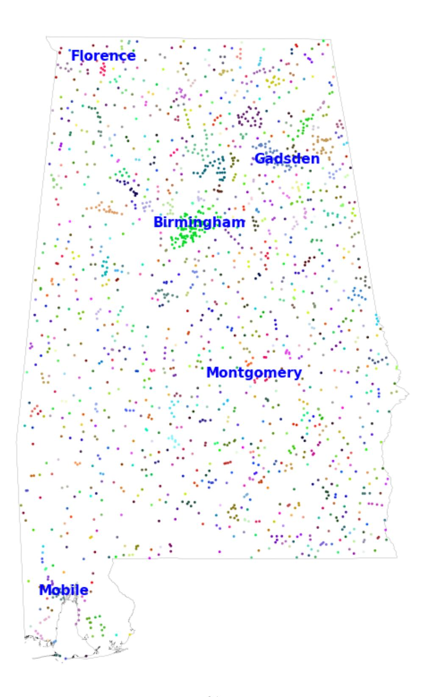
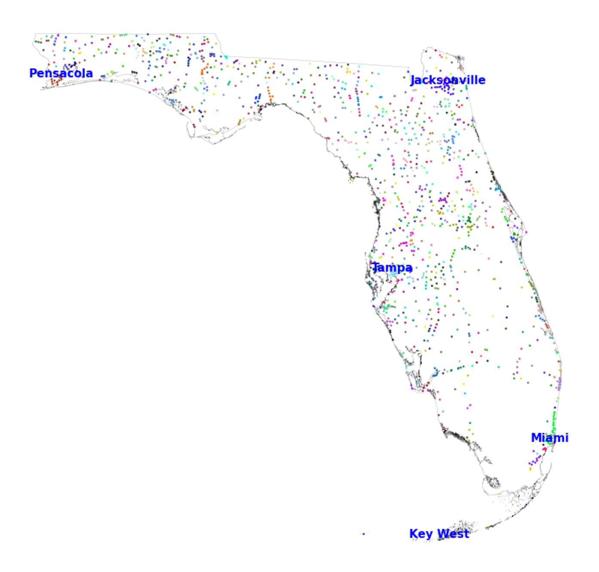
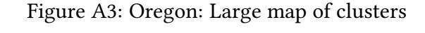
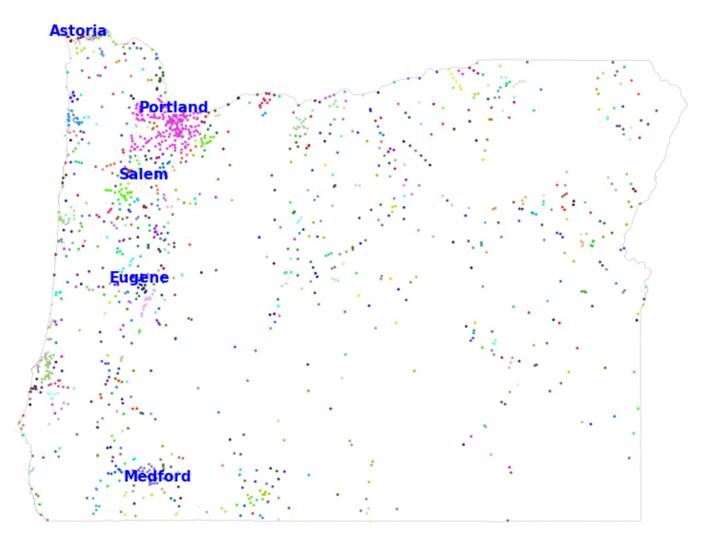
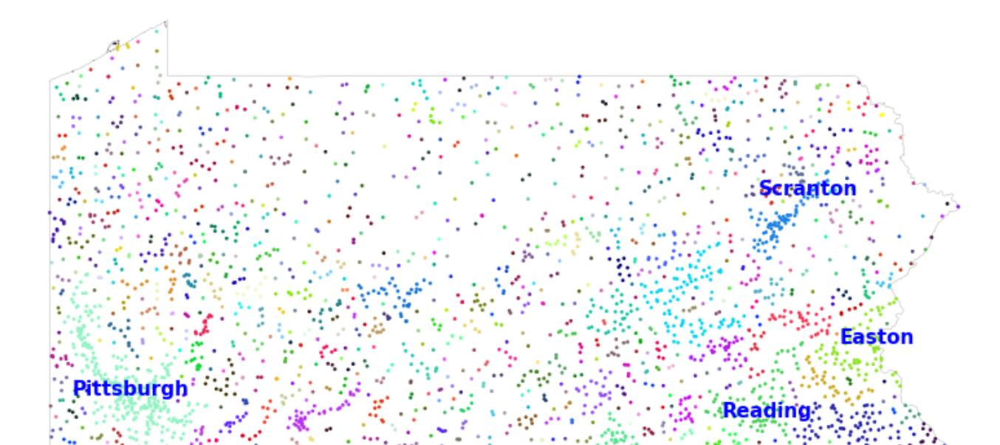
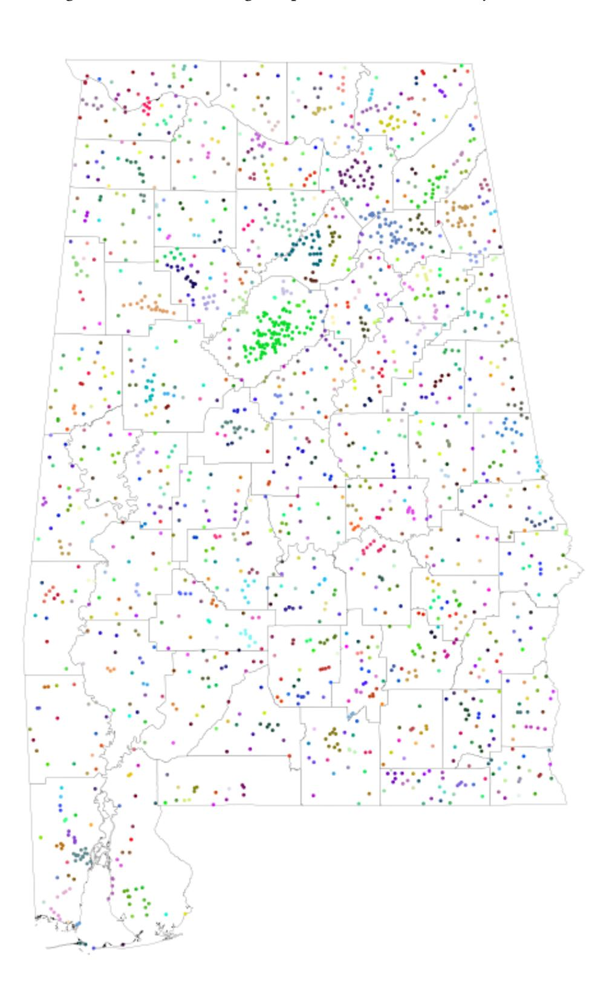
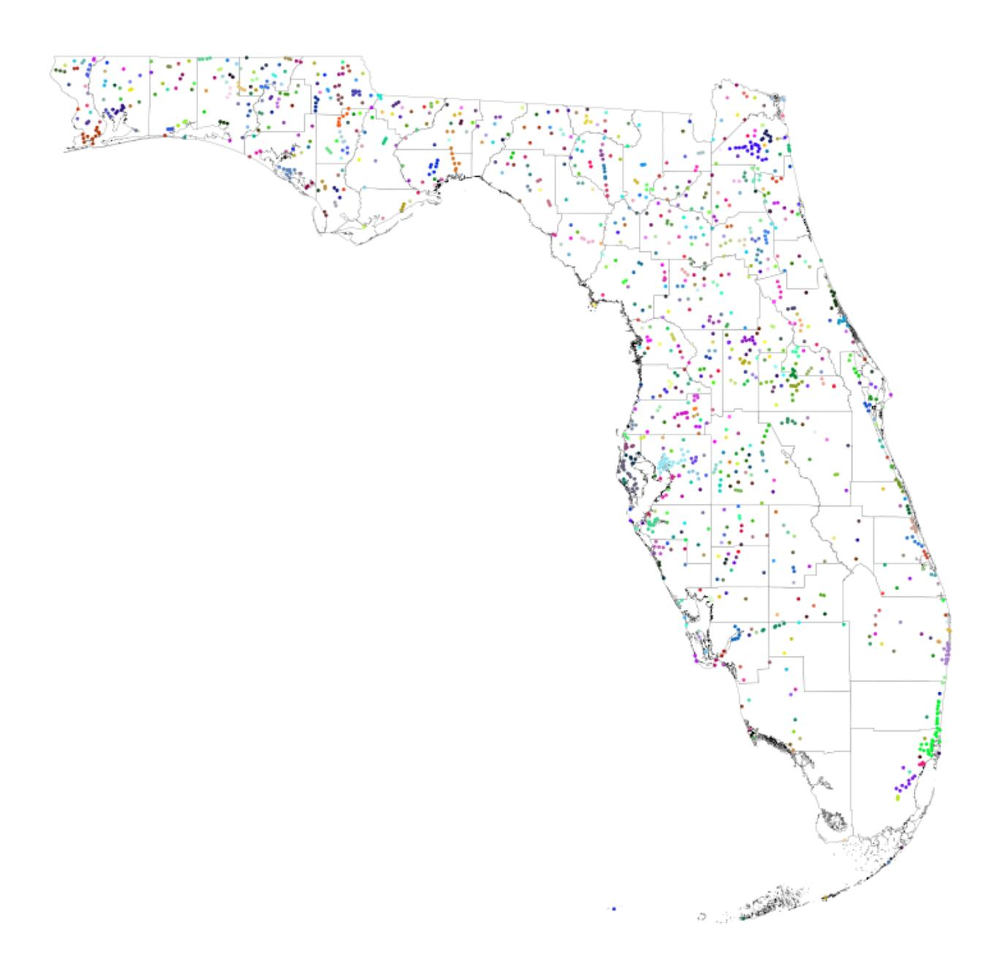
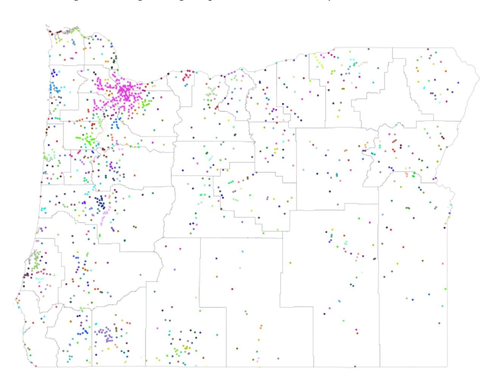
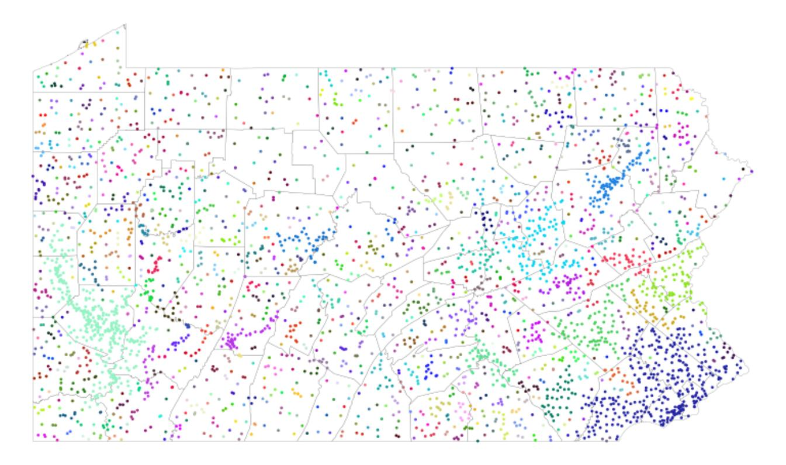

## A Data Appendix

is appendix describes that data and approach that we use to standardize place names in the historical censuses.

- Place name variables in IPUMS data:
  - 1. 1790–1820: township
  - 2. 1830: general township orig
  - 3. 1840: locality
  - 4. 1850: stdcity, us1850c 0043, us1850c 0053, us1850c 0054, us1850 0042
  - 5. 1860: us1860c 0040, us1860c 0042, us1860c 0036
  - 6. 1870: us1870c 0040, us1870c 0042, us1870c 0043, us1870c 0044, us1870c 0035, us1870c 0036
  - 7. 1880: mcdstr, us1880e 0071, us1880e 0069, us1880e 0072, us1880e 0070
  - 8. 1890: stdcity, us1900m 0045, us1900m 0052
  - 9. 1900: stdcity, us1900m 0045, us1900m 0052
  - 10. 1910: stdcity, us1910m 0052, us1910m 0053, us1910m 0063
  - 11. 1920: stdmcd, stdcity, us1920c 0057, us1920c 0058, us1920c 0068, us1920c 0069
  - 12. 1930: stdmcd, stdcity
  - 13. 1940: stdcity, us1940b 0073, us1940b 0074
- State variables in IPUMS data:
  - 1. 1790–1820: fullstate (name)
  - 2. 1830: self residence place state (name)
  - 3. 1840: fullstate (name)
  - 4. 1850: stateicp (code)
  - 5. 1860–1870: statep (code)
  - 6. 1880: stateicp (code)
  - 7. 1900–1940: statep (code)
- County variables in IPUMS data:
  - 1. 1790–1820: county (name)
  - 2. 1830: self residence place county (name)
  - 3. 1840: county (name)
  - 4. 1850: stcounty (code)

- 5. 1860–1870: countyicp (code)
- 6. 1880–1930: stcounty (code)
- 7. 1940: countyicp (code)

## Location cleaning procedure:

- Substitute mt. (and mt followed by a space) with mount, and st. with saint. Note that we cannot simply substitute st with saint because sometimes place names do end in st, but if the string starts with st followed by a space then we substitute it with saint
- Substitute Indian reservation with reservation to match external sources of place names
- Remove anything in parentheses (e.g., (i), (ii), etc.)
- Remove numbers, commas, question marks, periods, parentheses, and slashes (/)
- Remove range(s) if the word is preceded and followed by a space or if it it's at the end of the string and preceded by a space
- Remove substrings that match any of the following (note the space at the end or beginning of some strings): 'police jury', 'justice ward', 'court house', 'militia district', 'civil district', 'justice precinct', 'election district', 'undetermined', 'not stated', 'village', 'tract', 'ward', 'assembly district', 'district', 'no', 'precinct', 'subdivision', 'beat', 'plantation', 'census designated place', 'post office', 'township of ', 'town of ', 'borough of ', 'city of '
- Remove ward or township followed by a space if it's at the beginning of the string
- If the place name at this point contains "division" return an empty string (note that at this point we five already taken care of subdivisions etc.)
- Remove "[east, west, south, north] side" or "[east, west, south, north]ern side" from the string
- Substitute multiple spaces with only one
- If at this point the place name string has less than two characters or corresponds to town-ship(s) or ward(s) return an empty string
- Trim white spaces
- Force all letters to lowercase

## Extra Cleaning for Round 3:

- Drop hyphens (-)
- Drop cardinal points (south, north, east, west) and their adjectives (southern, northern, eastern, western)

- Drop township and point when preceded by a space
- Remove all the spaces to standardize our merge process

## Geotag procedure:

- Load GNIS data
- Load county shape le from NHGIS. We standardize IPUMS county variables to match 3 digit FIPS variables per IPUMS documentation. IPUMS county variables are usually identical to FIPS standards. An exception is Maryland, where IPUMS county identiers are shied relative to FIPS codes. We manually adjust these codes to match shapeles
- For all the decades at and aer 1900, we load the point place les downloaded from NHGIS. We standardize the place names to match the format of our raw census place strings.
- We determine the order in which we consider the raw census place name variables by ordering the variables from most unique places to least unique places within each year. e reason for this is that the more unique names there are, the more disaggregated this variable is likely to be. e more standardized the place name is, the fewer unique values of places we see in the raw les (for example, Charlestown and Boston may be combined into one place called Boston in some of the place name variables).
- We have lexicographic preferences over the sequence of census place names. In other words, we have three matching rounds that we apply to the rst place name in our ordered list, if do not get a match we move to the second one, and so on.
- For decades at and aer 1900, we try to match our census place names to NHGIS and GNIS places. ere are three matching rounds:
  - Round 1: nd the place name in the NHGIS/GNIS places le that is most similar to the one in the census microdata. We require that the potentially matching NHGIS/GNIS place needs to be in the same state and county as the place name from the IPUMS le (using historical boundaries) and also that the string matching score using the FuzzyWuzzy package in Python is ≥ 95.
  - Round 2: same thing as above with the slight dierence that the matching requirement is no longer a FuzzyWuzzy score ≥ 95 but a Levenshtein distance of 1. Since this threshold does not depend on the length of the place name, it is a less stringent requirement for shorter place names (but a stricter requirement for long ones). Note that here if there are multiple cities with a Levenshtein distance of 1, then we skip this step for that place.
  - Round 3: e same as round 1, with the exception that we apply the extra cleaning described above to the raw place names of cardinal references (e.g., strip Township, cardinal points, etc.).

- We begin by aempting to nd census places in the NHGIS place point data, and we then proceed to look in the GNIS le, where we consider the following feature classes in order: populated place, locale, civil, census, area, beach, harbor, island, military, mine, park, post oce, unknown, basin, bay, falls, rapids, reserve, reservoir, ridge, spring, stream, valley. e classes are ordered in terms of importance. at is, we rst try to match the census place names to cities in the GNIS feature class 'populated place', then we match the census place names to locales, and so on.
- For each class of places in GNIS, we rst drop the "distant duplicates," which we dene as all the places that have the same exact name and are more than 5km apart, because we are unsure which place to match to. Note that if two places have the same name and are within 5km, we keep the rst listed GNIS place.
- We look for matches in the NHGIS and GNIS features (in the order described above), rst completing round 1 for NHGIS places, GNIS populated places, GNIS locales, GNIS civil features,… until we match GNIS valleys. We then proceed to round 2, searching for NHGIS places, then GNIS populated places,… We then proceed to round 3.
- We have an extra step for the GNIS data where we take all places with duplicates more than 5km apart and we aempt to match our raw census place name to the GNIS duplicate in the correct county. If there are multiple matches within the same county, we keep the match with the lowest latitude.
- For 1850 data and all census years at or aer 1880, the census data contains enumeration districts and we use them to impute the coordinates of towns that we are not able to geocode in the previous steps. e procedure works as follows:
  - if an as-of-yet ungeocoded place is in the same state, county, and enumeration district as one (or more) place with known latitude and longitude, we assign the place name the same longitude and latitude as the already geocoded place (if multiple places within the same enumeration district have already been successfully geocoded, we use the mean of the previously geocoded coordinates);
  - if an as-of-yet ungeocoded place is in an enumeration district that is numerically between two (non-necessarily adjacent) enumerations districts that contain alreadygeocoded places and if the distance between these two enumeration districts is smaller than 50km, then we assign to the ungeocoded place the mean of the means of the already geocoded latitudes and longitudes of places in those enumeration districts. Note that this corresponds to the midpoint between the two mean coordinates of the geocoded enumeration districts. Note that we always use the average. For example, if we have enumeration districts 1, 2, 3, 4 and we have geocoded coordinates for 1 and 4 that are within 50km of each other, then enumeration districts 2 and 3 would receive the same coordinates, equal to the average of the coordinates of geocoded places in enumeration districts 1 and 4.

- We then have a second round of matching where we take as-of-yet ungeocoded places and search for them on Google Maps, taking the resulting longitude and latitude aer conrming that that Google-based longitude and latitude is in the correct historical county.
- We then have a penultimate round of matching that uses 1920 counties as our reference geography to test whether cities fall within the right county boundaries. e census data seem to use some county or state names before they were ocial (e.g., West Virginia in 1860). For this reason, when comparing the coordinates that we obtain through our matching procedure and the location on a contemporaneous map, we sometimes get false negatives (i.e., towns that are outside a county although they should fall within). is step is meant to x this problem by using a map with state and county boundaries that should be somewhat stable.
- Lastly, we take all geocoded places and look for towns in a specic state that are unique in a given year but geocoded in only some years and not others. is can happen, for example, if the enumeration district imputation step nds a place that was otherwise missing in other years. We take the longitude-latitude for that place in the geocoded year and assign it to the ungeocoded place with the same name in other years.

Figure A1: Alabama: Large map of clusters

Figure A2: Florida: Large map of clusters

Notes: is gure maps the geocoded places in Florida, highlighting the ve largest clusters (with Kcluster = 5)

Notes: is gure maps the geocoded places in Oregon, highlighting the ve largest clusters (with Kcluster = 5)

Figure A4: Pennsylvania: Large map of clusters

Notes: is gure maps the geocoded places in Pennsylvania, highlighting the ve largest clusters (with Kcluster = 5)

Figure A5: Alabama: Large map of clusters, with county borders

40

Notes: is gure maps the geocoded places in Florida, highlighting the county borders in Florida to emphasize the large number of geocoded places in our data relative to the smaller number of counties. Sets of adjacent places within the same cluster (Kcluster = 5) are mapped with the same color.

Figure A7: Oregon: Large map of clusters, with county borders

Notes: is gure maps the geocoded places in Oregon, highlighting the county borders in Oregon to emphasize the large number of geocoded places in our data relative to the smaller number of counties. Sets of adjacent places within the same cluster (Kcluster = 5) are mapped with the same color.

Notes: is gure maps the geocoded places in Pennsylvania, highlighting the county borders in Pennsylvania to emphasize the large number of geocoded places in our data relative to the smaller number of counties. Sets of adjacent places within the same cluster (Kcluster = 5) are mapped with the same color.