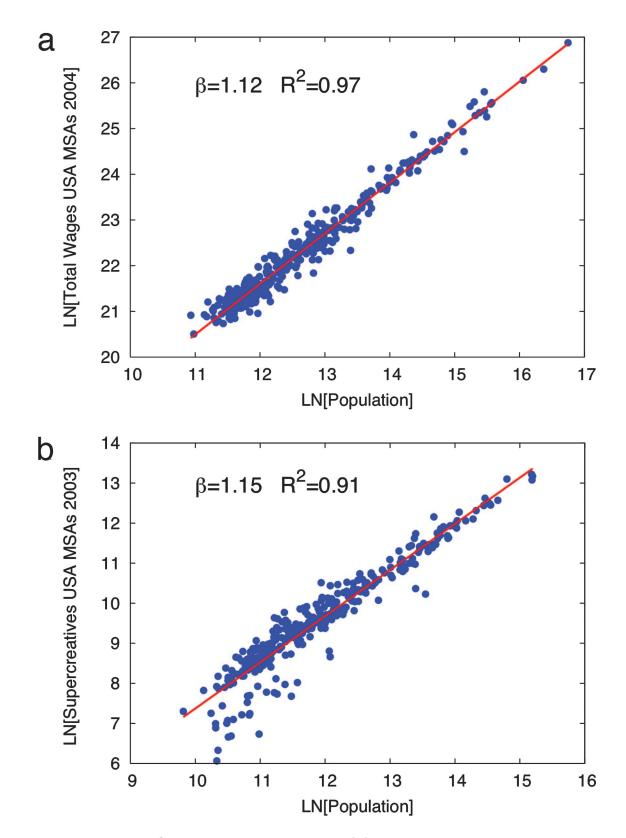
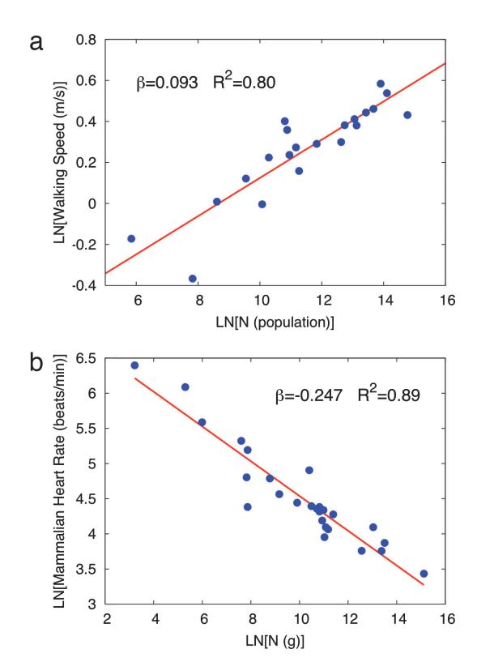
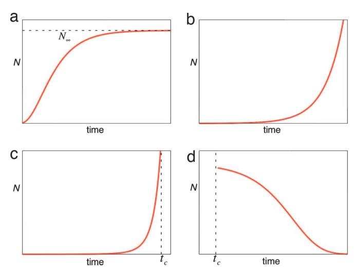
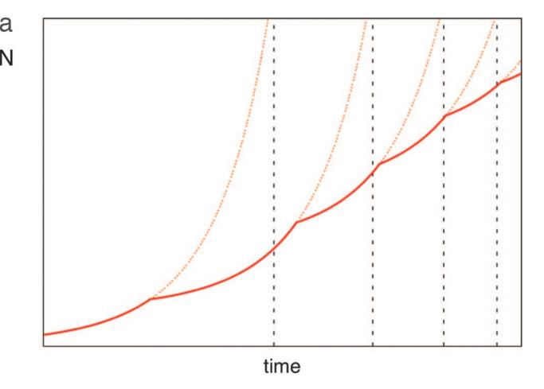
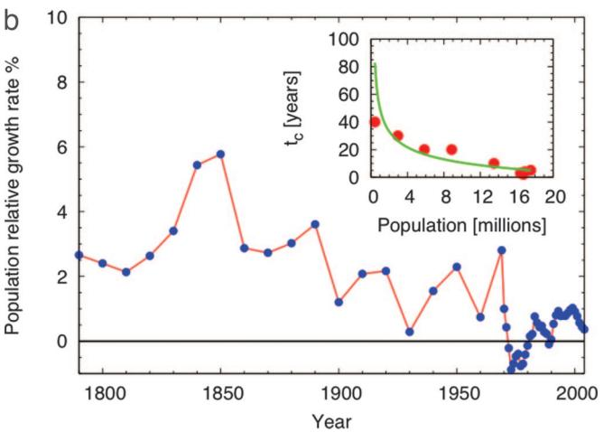

## Growth, innovation, scaling, and the pace of life in cities

Luís M. A. Bettencourt\*†, José Lobo‡, Dirk Helbing§, Christian Kühnert§, and Geoffrey B. West\*1

\*Theoretical Division, MS B284, Los Alamos National Laboratory, Los Alamos, NM 87545; ‡Global Institute of Sustainability, Arizona State University, P.O. Box 873211, Tempe, AZ 85287-3211; §Institute for Transport and Economics, Dresden University of Technology, Andreas-Schubert-Strasse 23, D-01062 Dresden, Germany; and ¶Santa Fe Institute, 1399 Hyde Park Road, Santa Fe, NM 87501

Edited by Elinor Ostrom, Indiana University, Bloomington, IN, and approved March 6, 2007 (received for review November 19, 2006)

Humanity has just crossed a major landmark in its history with the majority of people now living in cities. Cities have long been known to be society's predominant engine of innovation and wealth creation, yet they are also its main source of crime, pollution, and disease. The inexorable trend toward urbanization worldwide presents an urgent challenge for developing a predictive, quantitative theory of urban organization and sustainable development. Here we present empirical evidence indicating that the processes relating urbanization to economic development and knowledge creation are very general, being shared by all cities belonging to the same urban system and sustained across different nations and times. Many diverse properties of cities from patent production and personal income to electrical cable length are shown to be power law functions of population size with scaling exponents,  $\beta$ , that fall into distinct universality classes. Quantities reflecting wealth creation and innovation have  $\beta \approx 1.2 > 1$  (increasing returns), whereas those accounting for infrastructure display  $\boldsymbol{\beta}$  $\approx$  0.8 < 1 (economies of scale). We predict that the pace of social life in the city increases with population size, in quantitative agreement with data, and we discuss how cities are similar to, and differ from, biological organisms, for which  $\beta$ <1. Finally, we explore possible consequences of these scaling relations by deriving growth equations, which quantify the dramatic difference between growth fueled by innovation versus that driven by economies of scale. This difference suggests that, as population grows, major innovation cycles must be generated at a continually accelerating rate to sustain growth and avoid stagnation or collapse.

population | sustainability | urban studies | increasing returns | economics of scale

umanity has just crossed a major landmark in its history with the majority of people now living in cities (1, 2). The present worldwide trend toward urbanization is intimately related to economic development and to profound changes in social organization, land use, and patterns of human behavior (1, 2). The demographic scale of these changes is unprecedented (2, 3) and will lead to important but as of yet poorly understood impacts on the global environment. In 2000, >70% of the population in developed countries lived in cities compared with ≈40% in developing countries. Cities occupied a mere 0.3% of the total land area but  $\approx 3\%$  of arable land. By 2030, the urban population of developing countries is expected to more than double to ≈4 billion, with an estimated 3-fold increase in occupancy of land area (3), whereas in developed countries it may still increase by as much as 20%. Paralleling this global urban expansion, there is the necessity for a sustainability transition (4-6) toward a stable total human population, together with a rise in living standards and the establishment of long-term balances between human development needs and the planet's environmental limits (7). Thus, a major challenge worldwide (5, 6) is to understand and predict how changes in social organization and dynamics resulting from urbanization will impact the interactions between nature and society (8).

The increasing concentration of people in cities presents both opportunities and challenges (9) toward future scenarios of sustainable development. On the one hand, cities make possible economies of scale in infrastructure (9) and facilitate the optimized delivery of social services, such as education, health care, and efficient governance. Other impacts, however, arise because of human adaptation to urban living (9, 10–14). They can be direct, resulting from obvious changes in land use (3) [e.g., urban heat island effects (15, 16) and increased green house gas emissions (17)] or indirect, following from changes in consumption (18) and human behavior (10-14), already emphasized in classical work by Simmel and Wirth in urban sociology (11, 12) and by Milgram in psychology (13). An important result of urbanization is also an increased division of labor (10) and the growth of occupations geared toward innovation and wealth creation (19–22). The features common to this set of impacts are that they are open-ended and involve permanent adaptation, whereas their environmental implications are ambivalent, aggravating stresses on natural environments in some cases and creating the conditions for sustainable solutions in others (9).

These unfolding complex demographic and social trends make it clear that the quantitative understanding of human social organization and dynamics in cities (7, 9) is a major piece of the puzzle toward navigating successfully a transition to sustainability. However, despite much historical evidence (19, 20) that cities are the principal engines of innovation and economic growth, a quantitative, predictive theory for understanding their dynamics and organization (23, 24) and estimating their future trajectory and stability remains elusive. Significant obstacles toward this goal are the immense diversity of human activity and organization and an enormous range of geographic factors. Nevertheless, there is strong evidence of quantitative regularities in the increases in economic opportunities (25–29), rates of innovation (21, 22), and pace of life (11–14, 30) observed between smaller towns and larger cities.

In this work, we show that the social organization and dynamics relating urbanization to economic development and knowledge creation, among other social activities, are very general and appear as nontrivial quantitative regularities common to all cities, across urban systems. We present an extensive body of empirical evidence showing that important demographic, socioeconomic, and behavioral urban indicators are, on average,

Author contributions: L.M.A.B., J.L., and G.B.W. designed research; L.M.A.B., J.L., D.H., C.K., and G.B.W. performed research; L.M.A.B. and G.B.W. contributed new reagents/analytic tools; L.M.A.B., J.L., D.H., and C.K. analyzed data; and L.M.A.B., J.L., and G.B.W. wrote the paper.

The authors declare no conflict of interest.

This article is a PNAS Direct Submission.

Freely available online through the PNAS open access option.

Abbreviation: MSA, metropolitan statistical area.

†To whom correspondence should be addressed. E-mail: lmbett@lanl.gov.

This article contains supporting information online at www.pnas.org/cgi/content/full/0610172104/DC1.

© 2007 by The National Academy of Sciences of the USA

scaling functions of city size that are quantitatively consistent across different nations and times [note that the much studied "Zipf's law" (ref. 31) for the rank-size distribution of urban populations is just one example of the many scaling relationships presented in this work]. The most thorough evidence at present is for the U.S., where extensive reliable data across a wide variety of indicators span many decades. In addition, we show that other nations, including China and European countries, display particular scaling relationships consistent with those in the U.S.

Scaling and Biological Metaphors for the City. Scaling as a tool for revealing underlying dynamics and structure has been instrumental in understanding problems across the entire spectrum of science and technology. This approach has recently been applied to a wide range of biological phenomena leading to a unifying quantitative picture of their organization, structure, and dynamics. Organisms as metabolic engines, characterized by energy consumption rates, growth rates, body size, and behavioral times (32–34), have a clear counterpart in social systems (14, 35).

Cities as consumers of energy and resources and producers of artifacts, information, and waste have often been compared with biological entities, in both classical studies in urban sociology (14, 35) and in recent research concerned with urban ecosystems and sustainable development. Recent analogies include cities as "living systems" (36) or "organisms" (37) and notions of urban "ecosystems" (38) and urban "metabolism" (17, 38-40). Are these terms just qualitative metaphors, or is there quantitative and predictive substance in the implication that social organizations are extensions of biology, satisfying similar principles and constraints? Are the structures and dynamics that evolved with human socialization fundamentally different from those in biology? Answers to these questions provide a framework for the construction of a quantitative theory of the average city, which would incorporate, for example, the roles of innovation and economies of scale and predictions for growth trajectories, levels of social and economic development, and ecological footprints.

To set the stage, consider first some relevant scaling relations characterizing biological organisms. Despite its amazing diversity and complexity, life manifests an extraordinary simplicity and universality in how key structural and dynamical processes scale across a broad spectrum of phenomena and an immense range of energy and mass scales covering >20 orders of magnitude. Remarkably, almost all physiological characteristics of biological organisms scale with body mass, M, as a power law whose exponent is typically a multiple of 1/4 (which generalizes to 1/(d + 1) in d-dimensions). For example, metabolic rate, B, (the power required to sustain the organism) scales as  $B \propto M^{3/4}$ (32, 33). Because metabolic rate per unit mass,  $B/M \propto M^{-1/4}$ , decreases with body size, this relationship implies an economy of scale in energy consumption: larger organisms consume less energy per unit time and per unit mass. The predominance and universality of quarter-power scaling have been understood as a manifestation of general underlying principles that constrain the dynamics and geometry of distribution networks within organisms (e.g., the circulatory system). Highly complex, selfsustaining structures, whether cells, organisms, or cities, require close integration of enormous numbers of constituent units that need efficient servicing. To accomplish this integration, life at all scales is sustained by optimized, space-filling, hierarchical branching networks (32, 41), which grow with the size of the organism as uniquely specified approximately self-similar structures. Because these networks, e.g., the vascular systems of animals and plants, determine the rates at which energy is delivered to functional terminal units (cells), they set the pace of physiological processes as scaling functions of the size of the organism. Thus, the self-similar nature of resource distribution networks, common to all organisms, provides the basis for a

quantitative, predictive theory of biological structure and dynamics, despite much external variation in appearance and form.

Specifically, this theory predicts that characteristic physiological times, such as life spans, turnover times, and times to maturity scale as  $M^{1-\beta} \approx M^{1/4}$ , whereas associated rates, such as heart rates and evolutionary rates, scale as  $M^{\beta-1} \approx M^{-1/4}$ . Thus, the pace of biological life slows down with increasing size of the organism.

Conceptually, the existence of such universal scaling laws implies, for example, that in terms of almost all biological rates, times, and internal structure, an elephant is approximately a blown-up gorilla, which is itself a blown-up mouse, all scaled in an appropriately nonlinear, predictable way. This concept means that dynamically and organizationally, all mammals are, on the average, scaled manifestations of a single idealized mammal, whose properties are determined as a function of its size.

From this perspective, it is natural to ask whether social organizations also display universal power law scaling for variables reflecting key structural and dynamical characteristics. In what sense, if any, are small, medium, and large cities scaled versions of one another, thereby implying that they are manifestations of the same average idealized city? In this way, urban scaling laws, to exist, may provide fundamental quantitative insights and predictability into underlying social processes, responsible for flows of resources, information, and innovation.

## Results

Scaling Relations for Urban Indicators. To explore scaling relations for cities we gathered an extensive body of data, much of it never before published, across national urban systems, addressing a wide range of characteristics, including energy consumption, economic activity, demographics, infrastructure, innovation, employment, and patterns of human behavior. Although much data are available for specific cities, scaling analysis requires coverage of entire urban systems. We have obtained datasets at this level of detail mostly for the U.S., where typically more data are available and in more particular cases for European countries and China.

As we show below, the data assembled and examined here can be grouped into three categories: material infrastructure, individual human needs, and patterns of social activity. We adopted a definition of cities that is as much as possible devoid of arbitrary political or geographic boundaries, as integrated economic and social units, usually referred to as unified labor markets, comprising urban cores and including all administrative subdivisions with substantial fractions of their population commuting to work within its boundaries. In the U.S., these definitions correspond to metropolitan statistical areas (MSAs); in the European Union, larger urban zones (LUZs); and in China, urban administrative units (UAUs). More detailed definitions of city boundaries are desirable and an active topic of research in urban geography (3).

Using population, N(t), as the measure of city size at time t, power law scaling takes the form

$$Y(t) = Y_0 N(t)^{\beta}.$$
 [1]

Y can denote material resources (such as energy or infrastructure) or measures of social activity (such as wealth, patents, and pollution);  $Y_0$  is a normalization constant. The exponent,  $\beta$ , reflects general dynamic rules at play across the urban system. Summary results for selected exponents are shown in Table 1, and typical scaling curves are shown in Fig. 1. These results indicate that scaling is indeed a pervasive property of urban organization. We find robust and commensurate scaling exponents across different nations, economic systems, levels of development, and recent time periods for a wide variety of indicators. This finding implies that, in terms of these quantities,

**Table 1. Scaling exponents for urban indicators vs. city size**

| Y                                |      | 95% CI       | Adj-R2 | Observations | Country–year   |
|----------------------------------|------|--------------|--------|--------------|----------------|
| New patents                      | 1.27 | 1.25,1.29    | 0.72   | 331          | U.S. 2001      |
| Inventors                        | 1.25 | 1.22,1.27    | 0.76   | 331          | U.S. 2001      |
| Private R&D employment           | 1.34 | 1.29,1.39    | 0.92   | 266          | U.S. 2002      |
| Supercreative  employment        | 1.15 | 1.11,1.18    | 0.89   | 287          | U.S. 2003      |
| R&D establishments               | 1.19 | 1.14,1.22    | 0.77   | 287          | U.S. 1997      |
| R&D employment                   | 1.26 | 1.18,1.43    | 0.93   | 295          | China 2002     |
| Total wages                      | 1.12 | 1.09,1.13    | 0.96   | 361          | U.S. 2002      |
| Total bank deposits              | 1.08 | 1.03,1.11    | 0.91   | 267          | U.S. 1996      |
| GDP                              | 1.15 | 1.06,1.23    | 0.96   | 295          | China 2002     |
| GDP                              | 1.26 | 1.09,1.46    | 0.64   | 196          | EU 1999–2003   |
| GDP                              | 1.13 | 1.03,1.23    | 0.94   | 37           | Germany 2003   |
| Total electrical consumption     | 1.07 | 1.03,1.11    | 0.88   | 392          | Germany 2002   |
| New AIDS cases                   | 1.23 | 1.18,1.29    | 0.76   | 93           | U.S. 2002–2003 |
| Serious crimes                   | 1.16 | [1.11, 1.18] | 0.89   | 287          | U.S. 2003      |
| Total housing                    | 1.00 | 0.99,1.01    | 0.99   | 316          | U.S. 1990      |
| Total employment                 | 1.01 | 0.99,1.02    | 0.98   | 331          | U.S. 2001      |
| Household electrical consumption | 1.00 | 0.94,1.06    | 0.88   | 377          | Germany 2002   |
| Household electrical consumption | 1.05 | 0.89,1.22    | 0.91   | 295          | China 2002     |
| Household water consumption      | 1.01 | 0.89,1.11    | 0.96   | 295          | China 2002     |
| Gasoline stations                | 0.77 | 0.74,0.81    | 0.93   | 318          | U.S. 2001      |
| Gasoline sales                   | 0.79 | 0.73,0.80    | 0.94   | 318          | U.S. 2001      |
| Length of electrical cables      | 0.87 | 0.82,0.92    | 0.75   | 380          | Germany 2002   |
| Road surface                     | 0.83 | 0.74,0.92    | 0.87   | 29           | Germany 2002   |

Data sources are shown in *[SI Text](http://www.pnas.org/cgi/content/full//DC1)*. CI, confidence interval; Adj-*R*2, adjusted *R2*; GDP, gross domestic product.

cities that are superficially quite different in form and location, for example, are in fact, on the average, scaled versions of one another, in a very specific but universal fashion prescribed by the scaling laws of Table 1.

Despite the ubiquity of approximate power law scaling, there is no simple analogue to the universal quarter-powers observed in biology. Nevertheless, Table 1 reveals a taxonomic universality whereby exponents fall into three categories defined by 1 (linear), 1 (sublinear), and -1 (superlinear), with in each category clustering around similar values: (*i*) 1 is usually associated with individual human needs (job, house, household water consumption). (*ii*) 0.8 1 characterizes material quantities displaying economies of scale associated with infrastructure, analogous to similar quantities in biology. (*iii*) 1.1–1.3 -1 signifies increasing returns with population size and is manifested by quantities related to social currencies, such as information, innovation or wealth, associated with the intrinsically social nature of cities.

The most striking feature of the data is perhaps the many urban indicators that scale superlinearly ( -1). These indicators reflect unique social characteristics with no equivalent in biology and are the quantitative expression that knowledge spillovers drive growth (25, 26), that such spillovers in turn drive urban agglomeration (26, 27), and that larger cities are associated with higher levels of productivity (28, 29). Wages, income, growth domestic product, bank deposits, as well as rates of invention, measured by new patents and employment in creative sectors (21, 22) all scale superlinearly with city size, over different years and nations with exponents that, although differing in detail, are statistically consistent. Costs, such as housing, similarly scale superlinearly, approximately mirroring increases in average wealth.

One of the most intriguing outcomes of the analysis is that the value of the exponents in each class clusters around the same number for a plethora of phenomena that are superficially quite different and seemingly unrelated, ranging from wages and patent production to the speed of walking (see below). This behavior strongly suggests that there is a universal social dynamic at play that underlies all these phenomena, inextricably linking them in an integrated dynamical network, which implies, for instance, that an increase in productive social opportunities, both in number and quality, leads to quantifiable changes in individual behavior across the full complexity of human expression (10– 14), including those with negative consequences, such as costs, crime rates, and disease incidence (19, 42).

For systems exhibiting scaling in rates of resource consumption, characteristic times are predicted to scale as *N*1, whereas rates scale as their inverse, *N*1. Thus, if 1, as in biology, the pace of life decreases with increasing size, as observed. However, for processes driven by innovation and wealth creation, -1 as in urban systems, the situation is reversed: thus, the pace of urban life is predicted to increase with size (Fig. 2). Anecdotally, this feature is widely recognized in urban life, pointed out long ago by Simmel, Wirth, Milgram, and others (11–14). Quantitative confirmation is provided by urban crime rates (42), rates of spread of infectious diseases such as AIDS, and even pedestrian walking speeds (30), which, when plotted logarithmically, exhibit power law scaling with an exponent of 0.09 0.02 (*R*2 0.80; Fig. 2*a*), consistent with our prediction.

There are therefore two distinct characteristics of cities revealed by their very different scaling behaviors, resulting from fundamentally different, and even competing, underlying dynamics (9): material economies of scale, characteristic of infrastructure networks, vs. social interactions, responsible for innovation and wealth creation. The tension between these characteristics is illustrated by the ambivalent behavior of energy-related variables: whereas household consumption scales approximately linearly and economies of scale are realized in electrical cable lengths, total consumption scales superlinearly. This difference can only be reconciled if the distribution network is suboptimal, as observed in the scaling of resistive losses, where 1.11 0.06 (*R*2 0.79). Which, then, of these two dynamics, efficiency or wealth creation, is the primary determinant of urbanization, and how does each impact urban growth?

Fig. 1. Examples of scaling relationships. (a) Total wages per MSA in 2004 for the U.S. (blue points) vs. metropolitan population. (b) Supercreative employment per MSA in 2003, for the U.S. (blue points) vs. metropolitan population. Best-fit scaling relations are shown as solid lines.

Urban Growth Equation. Growth is constrained by the availability of resources and their rates of consumption. Resources, Y, are used for both maintenance and growth. If, on average, it requires a quantity R per unit time to maintain an individual and a quantity E to add a new one to the population, then this allocation of resources is expressed as Y = RN + E (dN/dt), where dN/dt is the population growth rate. This relation leads to the general growth equation:

$$\frac{dN(t)}{dt} = \left(\frac{Y_0}{E}\right)N(t)^{\beta} - \left(\frac{R}{E}\right)N(t).$$
 [2]

Its generic structure captures the essential features contributing to growth. Although additional contributions can be made, they can be incorporated by a suitable interpretation of the parameters  $Y_0$ , R, and E [for generalization, see supporting information (SI) *Text*]. The solution of Eq. 2 is given by

$$N(t) = \left[\frac{Y_0}{R} + \left(N^{1-\beta}(0) - \frac{Y_0}{R}\right) \exp\left[-\frac{R}{E}(1-\beta)t\right]\right]^{\frac{1}{1-\beta}}.$$
 [3]

This solution exhibits strikingly different behaviors depending on whether  $\beta < 1$ , >1, or = 1: When  $\beta = 1$ , the solution reduces to an exponential:  $N(t) = N(0)e^{(Y_0 - R)t/E}$  (Fig. 3b), whereas for  $\beta$  <1 it leads to a sigmoidal growth curve, in which growth ceases at large times (dN/dt = 0), as the population approaches a finite carrying capacity  $N_{\infty} = (Y_0/R)^{1/(1-\beta)}$  (Fig. 3a). This solution is characteristic of biological systems where the predictions of Eq. 2 are in excellent agreement with data (41). Thus, cities and, more generally, social organizations that are driven by economies of scale are destined to eventually stop growing (43-45).

Fig. 2. The pace of urban life increases with city size in contrast to the pace of biological life, which decreases with organism size. (a) Scaling of walking speed vs. population for cities around the world. (b) Heart rate vs. the size (mass) of organisms.

The character of the solution changes dramatically when growth is driven by innovation and wealth creation,  $\beta > 1$ . If N(0) < 1 $(R/Y_0)^{1(\beta-1)}$ , Eq. 2 leads to unbounded growth for N(t) (Fig. 3c). Growth becomes faster than exponential, eventually leading to an infinite population in a finite amount of time given by

$$t_c = -\frac{E}{(\beta - 1)R} \ln \left[ 1 - \frac{R}{Y_0} N^{1-\beta}(0) \right]$$

$$\approx \left[ \frac{E}{(\beta - 1)R} \right] \frac{1}{N^{\beta - 1}(0)}.$$
[4]

This growth behavior has powerful consequences because, in practice, the resources driving Eq. 2 are ultimately limited so the singularity is never reached; thus, if conditions remain unchanged, unlimited growth is unsustainable. Left unchecked, this lack of sustainability triggers a transition to a phase where  $N(0) > (R/Y_0)^{1/(\beta-1)}$ , leading to stagnation and ultimate collapse (Fig. 3d).

To avoid this crisis and subsequent collapse, major qualitative changes must occur which effectively reset the initial conditions and parameters of Eq. 3. Thus, to maintain growth, the response must be "innovative" to ensure that the predominant dynamic of the city remains in the "wealth and knowledge creation" phase where  $\beta > 1$  and  $N(0) > (R/Y_0)^{1/(\beta-1)}$ . In that case, a new cycle is initiated, and the city continues to grow following Eq. 2 and Fig. 3c but with new parameters and initial conditions,  $N_i(0)$ , the population at the transition time between adjacent cycles. This process can be continually repeated leading to multiple cycles, thereby pushing potential collapse into the future, Fig. 4a.

Unfortunately, however, the solution that innovation and corresponding wealth creation are stimulated responses to ensure continued growth has further consequences with potentially

**Fig. 3.** Regimes of urban growth. Plots of size *N* vs. time *t*. (*a*) Growth driven by sublinear scaling eventually converges to the carrying capacity *N*. (*b*) Growth driven by linear scaling is exponential. (*c*) Growth driven by superlinear scaling diverges within a finite time *tc* (dashed vertical line). (*d*) Collapse characterizes superlinear dynamics when resources are scarce.

deleterious effects. Eq. **4** predicts that the time between cycles, *ti*, necessarily decreases as population grows: *ti tc* 1/*Ni*(0)1. Thus, to sustain continued growth, major innovations or adaptations must arise at an accelerated rate. Not only does the pace of life increase with city size, but so also must the rate at which new major adaptations and innovations need to be introduced to sustain the city. These predicted successive accelerating cycles of faster than exponential growth are consistent with observations for the population of cities (Fig. 4*b*), waves of technological change (46), and the world population (47, 48).

It is worth noting that the ratio *Ei*/*Ri* has a simple interpretation as the time needed for an average individual to reach productive maturity. Expressing it as *Ei*/*Ri* 20 years, where is of order unity and the population at the beginning of a cycle as *Ni*(0) 106 gives *tc* 50 1 years. For a large city, this time is typically a few decades, slowly decreasing with increasing population. Actual cycle times must be shorter than *t*c.

## **Discussion**

Despite the enormous complexity and diversity of human behavior and extraordinary geographic variability, we have shown that cities belonging to the same urban system obey pervasive scaling relations with population size, characterizing rates of innovation, wealth creation, patterns of consumption and human behavior as well as properties of urban infrastructure. Most of these indicators deal with temporal processes associated with the social dimension of cities as spaces for intense interaction across the spectrum of human activities. It is remarkable that it is principally in terms of these rhythms that cities are self-similar organizations, indicating a universality of human social dynamics, despite enormous variability in urban form. These findings provide quantitative underpinnings for social theories of ''urbanism as a way of life'' (12).

**Fig. 4.** Successive cycles of superlinear innovation reset the singularity and postpone instability and subsequent collapse. (*a*) Schematic representation: vertical dashed lines indicate the sequence of potential singularities. Eq. **4**, with *N* 106, predicts *tc* in decades. (*b*) The relative population growth rate of New York City over time reveals periods of accelerated (superexponential) growth. Successive shorter periods of super exponential growth appear, separated by brief periods of deceleration. (*Inset*) *tc* for each of these periods vs. population at the onset of the cycle. Observations are well fit by Eq. **4**, with 1.09 (green line).

Our primary analytical focus here was concerned with the consequences of population size on a variety of urban metrics. In this sense, we have not addressed the issue of location (49–51) as a determinant of form and size of human settlements. We can, however, shed some light on associated ideas of urban hierarchy and urban dominance (14, 51): increasing rates of innovation, wealth creation, crime, and so on, per capita suggest flows of these quantities from places where they are created faster (sources) to those where they are produced more slowly (sinks) along an urban hierarchy of cities dictated, on average, by population size.

A related point deals with limits to urban population growth. Although population increases are ultimately limited by impacts on

**Table 2. Classification of scaling exponents for urban properties and their implications for growth**

| Scaling exponent | Driving force                                    | Organization | Growth                                                                                                |
|------------------|--------------------------------------------------|--------------|-------------------------------------------------------------------------------------------------------|
| 1                | Optimization, efficiency                         | Biological   | Sigmoidal: long-term population limit                                                                 |
|  1            | Creation of information, wealth and resources | Sociological | Boom/collapse: finite-time singularity/unbounded growth; accelerating growth rates/discontinuities |
| 1                | Individual maintenance                           | Individual   | Exponential                                                                                           |

the natural environment, we have shown that growth driven by innovation implies, in principle, no limit to the size of a city, providing a quantitative argument against classical ideas in urban economics (43–45). The tension between economies of scale and wealth creation, summarized in Table 2, represents a phenomenon where innovation occurs on time scales that are now shorter than individual life spans and are predicted to become even shorter as populations increase and become more connected, in contrast to biology where the innovation time scales of natural selection greatly exceed individual life spans. Our analysis suggests uniquely human social dynamics that transcend biology and redefine metaphors of urban ''metabolism.'' Open-ended wealth and knowledge creation require the pace of life to increase with organization size and for individuals and institutions to adapt at a continually accelerating rate to avoid stagnation or potential crises. These conclusions very likely generalize to other social organizations, such as corporations and businesses, potentially explaining why continuous growth necessitates an accelerating treadmill of dynamical cycles of innovation.

The practical implications of these findings highlight the importance of measuring and understanding the drivers of economic and population growth in cities across entire urban systems. Scaling relations predict many of the characteristics that a city is expected to assume, on average, as it gains or loses population. The realization that most urban indicators scale with city size nontrivially, implying increases per capita in crime or innovation rates and decreases on the demand for certain infrastructure, is essential to set realistic targets for local policy. New indices of urban rank according to deviations from the predictions of scaling laws also provide more accurate measures of the successes and failures of local factors (including policy) in shaping specific cities.

In closing, we note that much more remains to be explored in generalizing the empirical observations made here to other quantities, especially those connected to environmental impacts,

- 1. Crane P, Kinzig A (2005) *Science* 308:1225.
- 2. *UN World Urbanization Prospects*: *The 2003 Revision* (2004) (United Nations, New York).
- 3. Angel S, Sheppard CS, Civco DL, Buckley P, Chabaeva A, Gitlin L, Kraley A, Parent J, Perlin M (2005) *The Dynamics of Global Urban Expansion* (World Bank, Washington, DC).
- 4. National Research Council (1999) *Our Common Journey* (Natl Acad Press, Washington, DC).
- 5. Kates RW, Clark WC, Corell R, Hall JM, Jaeger CC, Lowe I, McCarthy JJ, Schellnhuber HJ, Bolin B, Dickson NM, *et al*. (2001) *Science* 292:641–642.
- 6. Clark WC, Dickson NM (2003) *Proc Natl Acad Sci USA* 100:8059–8061.
- 7. Parris TM, Kates RW (2003) *Proc Natl Acad Sci USA* 100:8068–8073.
- 8. National Research Council (2001) *Grand Challenges in Environmental Sciences* (Natl Acad Press, Washington, DC).
- 9. Kates RW, Parris TM (2003) *Proc Natl Acad Sci USA* 100:8062–8067.
- 10. Durkheim E (1964) *The Division of Labor in Society* (Free Press, New York).
- 11. Simmel G (1964) in *The Sociology of George Simmel*, ed Wolff K (Free Press, New York), pp 409–424.
- 12. Wirth L (1938) *Am J Sociol* 44:1–24.
- 13. Milgram S (1970) *Science* 167:1461–1468.
- 14. Macionis JJ, Parillo VN (1998) *Cities and Urban Life* (Pearson Education, Upper Saddle River, NJ).
- 15. Kalnay E, Cai M (2003) *Nature* 423:528–531.
- 16. Zhou L, Dickinson RE, Tian Y, Fang J, Li Q, Kaufmann RK, Tucker CJ, Myneni RB (2004) *Proc Natl Acad Sci USA* 101:9540–9544.
- 17. Svirejeva-Hopkins A, Schellnhuber HJ, Pomaz VL (2004) *Ecol Model* 173:295– 312.
- 18. Myers N, Kent J (2003) *Proc Natl Acad Sci USA* 100:4963–4968.
- 19. Mumford L (1961) *The City in History* (Harcourt Brace, New York).
- 20. Hall P (1998) *Cities in Civilization* (Pantheon Books, New York).
- 21. Florida R (2004) *Cities and the Creative Class* (Routledge, New York).
- 22. Bettencourt LMA, Lobo J, Strumsky D (2007) *Res Policy* 36:107–120.
- 23. Makse HA, Havlin S, Stanley HE (1995) *Nature* 377:608–612.
- 24. Batty M (1995) *Nature* 377:574.
- 25. Romer P (1986) *J Pol Econ* 94:1002–1037.

as well as to other urban systems and in clarifying the detailed social organizational structures that give rise to observed scaling exponents. We believe that the further extension and quantification of urban scaling relations will provide a unique window into the spontaneous social organization and dynamics that underlie much of human creativity, prosperity, and resource demands on the environment. This knowledge will suggest paths along which social forces can be harnessed to create a future where open-ended innovation and improvements in human living standards are compatible with the preservation of the planet's life-support systems.

## **Materials and Methods**

Extensive datasets covering metropolitan infrastructure, individual needs, and social indicators were collected for entire urban systems from a variety of sources worldwide (e.g., U.S. Census Bureau, Eurostat Urban Audit, China's National Bureau of Statistics). Details about these sources, web links, acknowledgments, and additional comments are provided in the *[SI Text](http://www.pnas.org/cgi/content/full/0610172104/DC1)*.

Fits to data were performed by using ordinary least-squares with a correction for heteroskedasticity using the Stata software package. We performed additional tests on the data, fitting their cumulative distribution and using logarithmic binning to assess the robustness of the exponents .

We thank David Lane, Sander van der Leeuw, Denise Pumain, Michael Batty, and Doug White for stimulating discussions and Deborah Strumsky, Shannon Larsen, Richard Florida, and Kevin Stolarick for help with data. This research was begun under the auspices of the ISCOM (Information Society as a Complex System) project, Grant IST-2001- 35505 from the European Union (to G.B.W.) and was partially supported by the Laboratory Directed Research and Development program (Los Alamos National Laboratory) Grants 20030050DR (to G.B.W.) and 20050411ER (to L.M.A.B.), National Science Foundation Grant phy-0202180 (to G.B.W.), and by the Thaw Charitable Trust (G.B.W.).

- 26. Lucas RE (1988) *J Mon Econ* 22:3–42.
- 27. Glaeser E (1994) *Cityscape* 1:9–47.
- 28. Sveikauskas L (1975) *Q J Econ* 89:393–413.
- 29. Segal D (1976) *Rev Econ Stat* 58:339–350.
- 30. Bornstein MH, Bornstein HG (1976) *Nature* 259:557–559.
- 31. Gabaix X (1999) *Q J Econ* 114:739–767.
- 32. West GB, Brown JH, Enquist BJ (1997) *Science* 276:122–126.
- 33. Enquist BJ, Brown JH, West GB (1998) *Nature* 395:163–166.
- 34. West GB, Brown JH, Enquist BJ (1999) *Science* 284:1677–1679.
- 35. Levine DN (1995) *Soc Res* 62:239–265.
- 36. Miller JG (1978) *Living Systems* (McGraw-Hill, New York, NY).
- 37. Girardet H (1992) *The Gaia Atlas of Cities*: *New Directions for Sustainable Urban Living* (Gaia Books, London).
- 38. Botkin DB, Beveridge CE (1997) *Urban Ecosyst* 1:3–19.
- 39. Graedel TE, Allenby BR (1995) *Industrial Ecology* (Prentice–Hall, Englewood Cliffs, NJ).
- 40. Decker EH, Elliott S, Smith FA, Blake DR, Rowland FS (2000) *Annu Rev Energy* 25:685–740.
- 41. West GB, Brown JH, Enquist BJ (2001) *Nature* 413:628–631.
- 42. Glaeser ED, Sacerdote B (1999) *J Pol Econ* 107:S225–S258.
- 43. Henderson JV (1974) *Am Econ Rev* 64:640–656.
- 44. Henderson JV (1988) *Urban Development* (Oxford Univ Press, Oxford, UK).
- 45. Drennan MP (2002) *The Information Economy and American Cities* (John Hopkins Univ Press, Baltimore).
- 46. Kurzweil R (2005) *The Singularity Is Near* (Viking, New York).
- 47. Cohen JE (1995) *(1995) Science* 269:341–346.
- 48. Kremer M (1993) *Q J Econ* 108:681–716.
- 49. Christaller W (1933) *Die Zentralen Orte in Suddeutschland* (Gustav Fischer, Jena, Germany); trans Baskin CW (1966) *Central Places in Southern Germany* (Prentice–Hall, Englewood Cliffs, NJ) (German).
- 50. Lo¨sch A (1954) *The Economics of Location* (Yale Univ Press, New Haven, CT).
- 51. Hall P (1995) in *Cities in Competition*: *Productive and Sustainable Cities for the 21st Century*, eds Brotchie J, Batty M, Blakely E, Hall P, Newton P (Longman, Melbourne, Australia), pp 3–31.