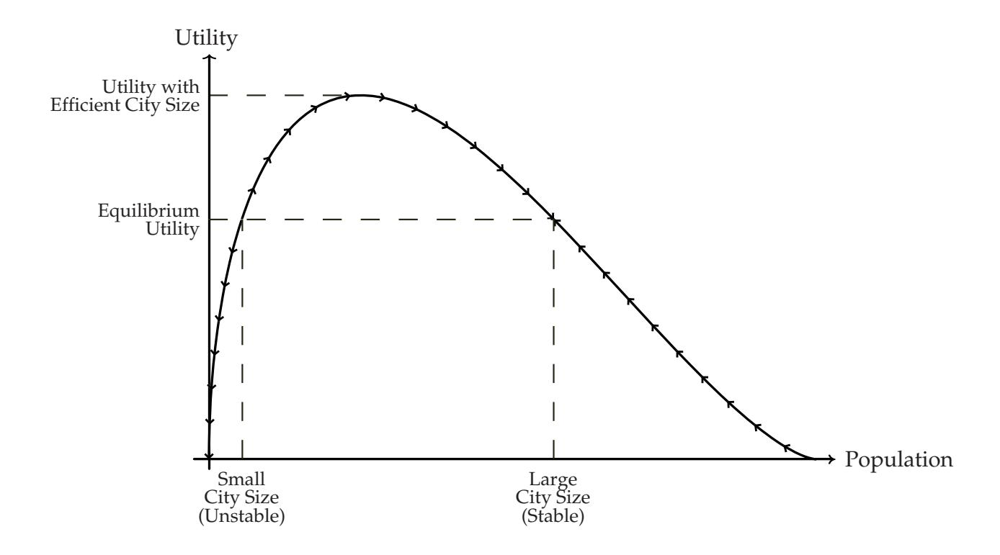
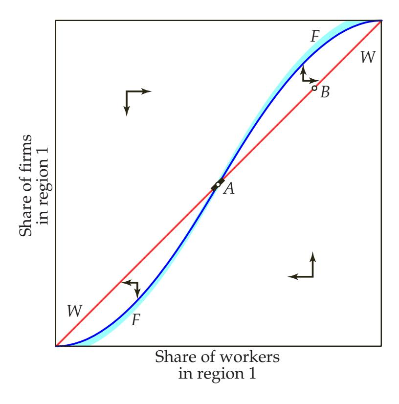

#### NBER WORKING PAPER SERIES

# MICRO-FOUNDATIONS OF URBAN AGGLOMERATION ECONOMIES

Gilles Duranton Diego Puga

Working Paper 9931 http://www.nber.org/papers/w9931

NATIONAL BUREAU OF ECONOMIC RESEARCH 1050 Massachusetts Avenue Cambridge, MA 02138 August 2003

This is a draft of a chapter written for eventual publication in the *Handbook of Regional and Urban Economics*, Volume 4, edited by J. Vernon Henderson and JacquesFrançois Thisse, to be published by North-Holland. We are grateful to the editors, to Johannes Bröker, Masa Fujita, Mike Peters, Frédéric Robert-Nicoud, and to the participants at the the 2002 narsa meetings for comments and suggestions. Funding from the Social Sciences and Humanities Research Council of Canada is gratefully acknowledged. The views expressed herein are those of the authors and not necessarily those of the National Bureau of Economic Research.

©2003 by Gilles Duranton and Diego Puga. All rights reserved. Short sections of text, not to exceed two paragraphs, may be quoted without explicit permission provided that full credit, including © notice, is given to the source.

Micro-foundations fo Urban Agglomeration Economies Gilles Duranton and Diego Puga NBER Working Paper No. 9931 August 2003 JEL No. R12, R13, R32

#### **ABSTRACT**

This handbook chapter studies the theoretical micro-foundations of urban agglomeration economies. We distinguish three types of micro-foundations, based on sharing, matching, and learning mechanisms. For each of these three categories, we develop one or more core models in detail and discuss the literature in relation to those models. This allows us to give a precise characterisation of some of the main theoretical underpinnings of urban agglomeration economies, to discuss modelling issues that arise when working with these tools, and to compare different sources of agglomeration economies in terms of the aggregate urban outcomes they produce as well as in terms of their normative implications.

Gilles Duranton Department of Geography and Environment London School of Economics Houghton Street London WC2A 2AE United Kingdom g.duranton@lse.ac.uk

Diego Puga Department of Economics University of Toronto 150 Saint George Street Toronto, Ontario M5S 3G7 Canada and NBER d.puga@utoronto.ca

# **1. Introduction**

Only 1.9% of the land area of the United States was built-up or paved by 1992. Yet, despite the wide availability of open space, almost all recent development is less than one kilometre away from earlier development. Not only does the proximity of earlier development matter, but so does its density. Places where about one-half of the land in the immediate vicinity is already built-up seem to be most attractive for new development [\(Burchfield, Overman, Puga, and Turner,](#page-52-0) [2003](#page-52-0)).

One cannot make sense of this sort of numbers, of the extent to which people cluster together in cities and towns, without considering some form of agglomeration economies or localised aggregate increasing returns. While space is not homogenous, it is futile to try to justify the marked unevenness of development solely on the basis of space being naturally heterogeneous: the land on which Chicago has been built, for instance, is not all that different from other places on the shore of Lake Michigan that have been more sparsely developed (see [Cronon,](#page-52-1) [1991](#page-52-1)). And, once we abstract from the heterogeneity of the underlying space, without indivisibilities or increasing returns, any competitive equilibrium in the presence of transport costs will feature only fully autarchic locations (this result, due to [Starrett,](#page-59-0) [1978](#page-59-0), is known as the spatial impossibility theorem).[1](#page-2-0) People in each of these locations, like Robinson Crusoe, will produce all goods at a small scale for self-consumption. Re-stated, without some form of increasing returns we cannot reconcile cities with trade.

While increasing returns are essential to understand why there are cities, it is hard to think of any single activity or facility subject to large-enough indivisibilities to justify the existence of cities. Thus, one of the main challenges for urban economists is to uncover mechanisms by which small-scale indivisibilities (or any other small-scale nonconvexities) aggregate up to localised aggregate increasing returns capable of sustaining cities. We can then regard cities as the outcome of a trade-off between agglomeration economies or localised aggregate increasing returns and the costs of urban congestion.

This is the object of this chapter: to study mechanisms that provide the microeconomic foundations of urban agglomeration economies. We focus on the theoretical underpinnings of urban agglomeration economies, while the chapter by [Rosenthal and Strange](#page-58-0) ([2004](#page-58-0)) in this volume discusses the corresponding empirical evidence.

By studying the micro-foundations of urban agglomeration economies we are looking inside the black box that justifies the very existence of cities. We regard this as one of the fundamental quests in urban economics for three main reasons. First, it is only by studying what gives rise to urban agglomeration economies — rather than merely stating that they exist — that we gain any real insight into why there are cities. Second, alternative

1See [Ottaviano and Thisse](#page-57-0) ([2004](#page-57-0)) in this volume for a detailed discussion of [Starrett'](#page-59-0)s ([1978](#page-59-0)) theorem.

micro-foundations cannot be regarded as interchangeable contents for the black box. The micro-foundations of urban agglomeration economies interact with other building blocks of urban models in ways that we cannot recognise unless they are explicitly stated. For instance, the composition of cities typically emerges as a consequence of the scope of different sources of agglomeration economies and their interaction with other aspects of individual behaviour. Third, different micro-foundations have very different welfare and policy implications. If we begin building an urban model by postulating an aggregate production function function as given. If instead we derive this aggregate production function from first principles, we may see that its efficiency can be improved upon. The means for achieving such an improvement will depend on the specifics of individual behaviour and technology. Thus, while different assumptions regarding individual behaviour and technology may support similar aggregate outcomes, the normative implications of alternative micro-foundations can differ substantially.

Urban agglomeration economies are commonly classified into those arising from labour market interactions, from linkages between intermediate- and final-goods suppliers, and from knowledge spill-overs, loosely following the three main examples provided by Marshall (1890) in his discussion of the sources of agglomeration economies.2 While this may be a sensible starting point for an empirical appraisal, we do not regard this as a particularly useful basis for a taxonomy of theoretical mechanisms. Consider, for instance, a model in which agglomeration facilitates the matching between firms and inputs. These inputs may be labelled workers, intermediates, or ideas. Depending on the label chosen, a matching model of urban agglomeration economies could be presented as a formalisation of either one of Marshall's three basic *sources* of agglomeration economies even though it captures a single *mechanism*. Since the focus of this chapter is on theory, we want to distinguish theories by the mechanism driving them rather than by the labels tagged to model components in particular papers. With this objective in mind, we distinguish three types of micro-foundations, based on *sharing*, *matching*, and *learning* mechanisms.3

Our discussion of micro-foundations of urban agglomeration economies based on sharing mechanisms deals with sharing indivisible facilities, sharing the gains from the

&lt;sup>2Marshall is arguably the best known and most influent of the early analysts of agglomeration. However Smith (1776) can be credited with the first analysis of the benefits from agglomeration, albeit with a more narrow argument relying on the division of labour. Thünen (1826) pursued and extended his work. He also proposed original arguments building on the interaction between fixed costs and transport costs not far from some of those developed below as highlighted by Fujita (2000).

&lt;sup>3Marshall (1890, IV.X.3) successively discusses knowledge spill-overs, linkages between input suppliers and final producers, and labour market interactions. However, his discussion of each of these sources of agglomeration economies highlights a different mechanism. Spill-overs are discussed in relation to the acquisition of skills by workers and their learning about new technologies. The discussion of linkages explicitly mentions the benefits of sharing intermediate suppliers producing under increasing returns. Finally, the fist part of his labour market argument points at a matching mechanism.

wider variety of input suppliers that can be sustained by a larger final-goods industry, sharing the gains from the narrower specialisation that can be sustained with larger production, and sharing risks. In discussing micro-foundations based on matching, we study mechanisms by which agglomeration improves either the expected quality of matches or the probability of matching, and alleviates hold-up problems. Finally, when we look at micro-foundations based on learning we discuss mechanisms based on the generation, the diffusion, and the accumulation of knowledge.[4](#page-4-0)

For each of the three main categories of this taxonomy, sharing, matching, and learning, we develop one or more core models in detail and discuss the literature in relation to those models. That allows us to give a precise characterisation of some of the main theoretical underpinnings of urban agglomeration economies, to illustrate some important modelling issues that arise when working with these tools, and to compare different sources of agglomeration economies in terms of the aggregate urban outcomes they produce as well as in terms of their normative implications.

# **2. Sharing**

# *2.1 Sharing indivisible goods and facilities*

To justify the existence of cities, perhaps the simplest argument is to invoke the existence of indivisibilities in the provision of certain goods or facilities. Consider a simple example: an ice hockey rink. This is an expensive facility with substantial fixed costs: it needs to be of regulated dimensions, have a sophisticated refrigeration system to produce and maintain the ice, a Zamboni to resurface it, etc. Few individuals, if any, would hold a rink for themselves. And while having a community of 1,000 people share a rink is feasible, building a rink for each of those people at 1/1,000th of the usual scale is not. An ice hockey rink is therefore an indivisible facility that can be shared by many users. It is also an excludable good, in the sense that use of the rink can be limited to members of a club or a community. At the same time, as the size of the community using the rink grows, the facility will be subject to increasing crowding. Crowding will take two forms. First, there will be capacity constraints when too many people simultaneously try to use the facility. Second, and more interesting in an urban context, crowding will also occur because the facility needs to be located somewhere and, as the size of the community of users grows,

4 In this chapter, we discuss only models in which both the demand and supply of factors (mainly labour) are endogenous. In particular, we do not discuss the strategic location literature which takes the location of consumers as given. This literature is discussed in depth by [Gabszewicz and Thisse](#page-54-0) ([1992](#page-54-0)).

some of those users will be located too far away from the facility.5

The problems associated with the provision of this type of facilities were first high-lighted by Buchanan (1965). They are the subject of a voluminous literature referred to as club theory (or theory of local public goods when the spatial dimension is explicitly taken into account). The main focus of this very large literature is on equilibrium concepts (competitive, free mobility, Nash, core) and policy instruments. These issues are well beyond the scope of this chapter and are thoroughly reviewed in Scotchmer (2002). Here we just describe briefly how one large indivisibility could provide a very simple formal motive for the existence of cities.

Consider then a shared indivisible facility. Once the large fixed cost associated with this facility has been incurred, it provides an essential good to consumers at a constant marginal cost. However, to enjoy this good consumers must commute between their residence and the facility. We can immediately see that there is a trade-off between the gains from sharing the fixed cost of the facility among a larger number of consumers and the costs of increasingly crowding the land around the facility (e.g., because of road congestion, small lot sizes, etc.). We may think of a city as the equilibrium outcome of such trade-off. In this context, cities would be no more than spatial clubs organised to share a common local public good or facility.6

This 'large indivisibility' argument motivates urban increasing returns by directly assuming increasing returns at the aggregate level. Large indivisibilities in the provision of some public good are just one possible motivation for this. A common alternative is to assume large indivisibilities in some production activity. This corresponds to the idea of a factory-town, where large fixed costs create internal increasing returns in a production activity that employs the workforce of an entire city whose size is bounded by crowding. There is in fact a long tradition of modelling cities as the outcome of large indivisibilities in production (Koopmans, 1957, Mills, 1967, Mirrlees, 1972). And since they constitute such a simple modelling device, factory-towns are still used as the simplest possible prototype cities to study a variety of issues, including fiscal decentralisation (Henderson and Abdel-Rahman, 1991), urban production patterns (Abdel-Rahman and Fujita, 1993), and economic growth in a system of cities (Duranton, 2000). However, it is fair to say that factory-towns are empirically the exception rather than the rule in most countries.

&lt;sup>5Note that this example is representative of a wide class of shared facilities that are excludable and subject to indivisibilities and crowding. These range from parks, museums, opera houses, and schools, to airports, train stations, and even power plants.

&lt;sup>6We do not worry here about the financing of the shared facility. Let us simply note that under competitive facility provision financed by local capitalisation in the land market, the equilibrium is efficient. This result is known as the Henry George Theorem (Flatters, Henderson, and Mieszkowski, 1974, Stiglitz, 1977, Arnott and Stiglitz, 1979) and is discussed at length in Fujita (1989) and in Fujita and Thisse (2002). An equivalent result applies to the case of a factory-town discussed below (Serck-Hanssen, 1969, Starrett, 1974, Vickrey, 1977).

Finally, it has been suggested that this type of large indivisibilities could apply to the existence of market places (Wang, 1990, Berliant and Wang, 1993, Wang, 1993, Berliant and Konishi, 2000, Konishi, 2000).7 Indeed, economic historians (e.g., Bairoch, 1988) have long recognised the crucial role played by cities in market exchange. However, the hypothesis of large indivisibilities in marketplaces is once again at best a small part of the puzzle of why cities exist.

To summarise, given Starrett's (1978) result that without some form of increasing returns we cannot explain agglomeration within a homogenous area, the easiest route to take in justifying the existence of cities is to assume increasing returns at the city level by means of a large indivisibility. While large indivisibilities are useful modelling devices when the main object of interest is not the foundations of urban agglomeration economies, they side-step the issue of what gives rise to increasing returns at the level of cities. Cities facilitate sharing many indivisible public goods, production facilities, and marketplaces. However, it would be unrealistic to justify cities on the basis of a single activity subject to extremely large indivisibilities. The challenge in urban modelling is to propose mechanisms whereby different activities subject to small non-convexities gather in the same location to form a city. Stated differently, *micro-founded models of cities need to reconcile plausible city-level increasing returns with non-degenerate market structures*.

# 2.2 Sharing the gains from variety

In this section we first derive an aggregate production function that exhibits aggregate increasing returns due to input sharing despite constant returns to scale in perfectly-competitive final production. This is based on Ethier's (1982) production-side version of Dixit and Stiglitz (1977). Aggregate increasing returns arise here from *the productive advantages of sharing a wider variety* of differentiated intermediate inputs produced by a monopolistically-competitive industry à la Chamberlin (1933). We then embed this model in an urban framework following Abdel-Rahman and Fujita (1990). This allows us to de-

&lt;sup>7These papers typically consider a small finite number of connected regions with differing endowments. Because of Ricardian comparative advantage, some marketplaces emerge and they are labelled cities. Wang (1990) establishes the existence and optimality of a competitive equilibrium with one endogenous marketplace in a pure exchange economy with exogenous consumer location. Berliant and Wang (1993) allow for endogenous location of consumers in a three region economy. Wang (1993) also allows for endogenous location in a two region economy with immobile goods. Berliant and Konishi (2000) revisit this problem in a production economy. Allowing for multiple marketplaces and differences in transport costs and marketplace set-up costs, they establish some existence and efficiency results. Finally, Konishi (2000) shows how asymmetries in transport costs can lead to the formation of hub-cities where workers employed in the transport sector agglomerate. The large indivisibilities assumed in these papers presumably reflect not so much fixed costs of market infrastructure but other considerations, such as the advantages of centralised quality assurance (see Cronon, 1991, and the chapter by Kim and Margo, 2004, in this volume for a discussion of how this sort of consideration helped Chicago become the main metropolis of the American Midwest).

rive equilibrium city sizes resulting from a trade-off between aggregate increasing returns and congestion costs as well as a basic result on urban specialisation due to Henderson (1974).

# 2.2.1 From firm-level to aggregate increasing returns

There are m sectors, super-indexed by  $j=1,\ldots,m$ . In each sector, perfectly competitive firms produce goods for final consumption under constant returns to scale. Final producers use intermediate inputs, which are specific to each sector and enter into plants' technology with a constant elasticity of substitution  $(1+e^j)/e^j$ , where  $e^j>0$ . Thus, aggregate final production in sector j is given by

$$Y^{j} = \left\{ \int_{0}^{n^{j}} \left[ x^{j}(h) \right]^{\frac{1}{1+\epsilon^{j}}} \mathrm{d}h \right\}^{1+\epsilon^{j}}, \tag{1}$$

where  $x^{j}(h)$  denotes the aggregate amount of intermediate h used and  $n^{j}$  is the 'number' (mass) of intermediate inputs produced in equilibrium, to be endogenously determined.

As in Ethier (1982), intermediate inputs are produced by monopolistically competitive firms à la Dixit and Stiglitz (1977). Each intermediate producer's technology is described by the production

$$x^{j}(h) = \beta^{j}l^{j}(h) - \alpha^{j} , \qquad (2)$$

where  $l^j(h)$  denotes the firm's labour input,  $\beta^j$  is the marginal productivity of labour, and  $\alpha^j$  is a fixed cost in sector j. Thus, there are increasing returns to scale in the production of each variety of intermediates.8 This and the fact that there is an unlimited range of intermediate varieties that could be produced and no economies of scope imply that each intermediate firm produces just one variety and that no variety is produced by more than one firm.

Let us denote by  $q^j(h)$  the price of sector j intermediate variety h. The minimisation of final production costs  $\int_0^{n^j} q^j(h) x^j(h) dh$  subject to the technological constraint of equation (1) yields the following conditional intermediate input demand:

$$x^{j}(h) = \frac{\left[q^{j}(h)\right]^{-\frac{1+\epsilon^{j}}{\epsilon^{j}}}Y^{j}}{\left\{\int_{0}^{n^{j}}\left[q^{j}(h')\right]^{-\frac{1}{\epsilon^{j}}}dh'\right\}^{1+\epsilon^{j}}}.$$
(3)

It is immediate from (3) that each intermediate firm faces an elasticity of demand with respect to its own price of  $-(1 + \epsilon^j)/\epsilon^j$ . Hence, the profit-maximising price for each

&lt;sup>8Obviously, technology could also be described in terms of the labour required to produce any level of output,  $l^{j}(h) = (x^{j}(h) - \alpha^{j})/\beta^{j}$ , as it is often done following Dixit and Stiglitz (1977).

intermediate is a fixed relative markup over marginal cost:

$$q^j = \frac{1 + \epsilon^j}{\beta^j} w^j \,, \tag{4}$$

where *w j* denotes the wage in sector *j*. Note that we have dropped index *h* since all variables take identical values for all intermediate suppliers in the same sector.

There is free entry and exit of intermediate suppliers. This drives their maximised profits to zero: *q jx j* − *w j l j* = 0. Using equations ([2](#page-7-3)) and ([4](#page-8-0)) to expand this expression and solving for *x j* shows that the only level of output by an intermediate producer consistent with zero profits is

$$x^j = \frac{\alpha^j}{\epsilon^j} \,. \tag{5}$$

This, together with ([2](#page-7-3)), implies that each intermediate producer hires *l j* = *α j* (1 + *e j* )/(*β j e j* ) workers. Hence, the equilibrium number of intermediate producers in sector *j* is

$$n^{j} = \frac{L^{j}}{l^{j}} = \frac{\beta^{j} \epsilon^{j}}{\alpha^{j} (1 + \epsilon^{j})} L^{j} , \qquad (6)$$

where *L j* denotes total labour supply in intermediate sector *j*.

By choice of units of intermediate output, we can set *β j* = (1 + *e j* )(*α j*/*e j* ) *e j*/(1+*e j* ) . Substituting ([6](#page-8-1)) and ([5](#page-8-2)) into ([1](#page-7-1)) yields aggregate production in sector *j* as

$$Y^{j} = \left[ n^{j} \left( x^{j} \right)^{\frac{1}{1+\epsilon^{j}}} \right]^{1+\epsilon^{j}} = \left( L^{j} \right)^{1+\epsilon^{j}}. \tag{7}$$

This obviously exhibits aggregate increasing returns to scale at the sector level. The reason is that an increase in the labour input of sector *j* must be associated with more intermediate producers, as can be seen from ([6](#page-8-1)); and, by ([1](#page-7-1)), final producers become more productive when they have access to a wider range of varieties. Re-stated, *an increase in final production by virtue of sharing a wider variety of intermediate suppliers requires a less-than-proportional increase in primary factors*. [9](#page-8-3)

9[Papageorgiou and Thisse](#page-57-3) ([1985](#page-57-3)) propose an alternative approach in which agglomeration also relies on sharing the gains from variety. Their approach, which builds on a shopping framework, highlights well the importance of interactions between firms and households. While the shopping behaviour of individuals is exogenously imposed rather than derived from a well-specified preference structure, it has later been shown to be consistent with random utility maximisation [\(Anderson, de Palma, and Thisse,](#page-50-4) [1992](#page-50-4)).

## *2.2.2 Urban structure*

Next, following [Abdel-Rahman and Fujita](#page-50-3) ([1990](#page-50-3)), let us place in an urban context the production structure we have just described. Consider an economy with a continuum of potential locations for cities, sub-indexed by *i*. [10](#page-9-0)

Let us model the internal spatial structure of each city in a very simple fashion. Production in each city takes place at a single point, defined as the Central Business District (cbd).[11](#page-9-1) Surrounding each city's cbd, there is a line with residences of unit length. Residents commute from their residence to the cbd and back at a cost. In practice, commuting costs include both the direct monetary cost of travelling and the opportunity cost of the time spent on the journey [\(Small,](#page-58-4) [1992](#page-58-4)). However, let us simplify by assuming that the only cost of commuting is the opportunity cost of time.[12](#page-9-2) Specifically, each worker loses in commuting a fraction of her unit of working time equal to 2*τ* times the distance travelled in going to the cbd and back home (*τ* > 0).

Each worker chooses her place of residence so as to maximise utility given her income and the land rent function in the city. Because of fixed lot size, this is equivalent to choosing residence so as to maximise net income. Thus, a worker in sector *j* in city *i* maximises *w j i* (1 − 4*τs*) − *Ri*(*s*) with respect to *s*, where *s* is the distance to the cbd and *Ri*(*s*) is the differential land rent in city *i* for a residence located at distance *s* from the cbd.

The possibility of arbitrage across residential locations both within and across sectors ensures that at the residential equilibrium the sum of commuting cost and land rent expenditures is the same for all residents with the same wage; that workers sort themselves according to their wage, with higher-paid workers (who have a higher opportunity cost of commuting time) living closer to the cbd; that the city is symmetric and the city edges are at a distance *Ni*/2 of the cbd (where *Ni* is total population in city *i*); and that the land rent

10Here we follow [Abdel-Rahman and Fujita](#page-50-3) ([1990](#page-50-3)) in embedding the production structure described above in a system of cities. In earlier papers, [Abdel-Rahman](#page-50-5) ([1988](#page-50-5)), [Fujita](#page-53-6) ([1988](#page-53-6)), and [Rivera-Batiz](#page-58-5) ([1988](#page-58-5)) embed similar production structures in an urban framework with a single city. The details of these pioneering papers differ slightly from those of our presentation. Instead of having the monopolistically competitive sector supplying differentiated intermediates, [Abdel-Rahman](#page-50-5) ([1988](#page-50-5)) has this sector producing differentiated final goods. They are aggregated with a constant elasticity of substitution into a sub-utility function, which enters as an argument into a Cobb-Douglas utility function together with land and a traded good produced under constant return. Also, our specification of the urban structure is a bit simpler than his, as we impose a fixed size for residences. [Rivera-Batiz](#page-58-5) ([1988](#page-58-5)) considers two sources of agglomeration economies, by assuming gains from variety both at the level of intermediates (like here) and of final goods. Finally, [Fujita](#page-53-6) ([1988](#page-53-6)) uses a different specification for the gains from variety, which bears resemblance with the entropy functions used in information theory. Another difference is that in his model both firms and households compete for urban land, whereas we only consider a residential land market. Also, he assumes that goods are imperfectly mobile within the city, which allows for non-monocentric urban structures.

11We take the existence of a cbd as given. For contributions that derive this endogenously, see [Borukhov](#page-51-2) [and Hochman](#page-51-2) ([1977](#page-51-2)), [Fujita and Ogawa](#page-54-2) ([1982](#page-54-2)), and the additional references provided in subsection [4](#page-43-0).2.2.

12This allows us to solve for equilibrium city sizes without having to track output prices in a multiplesector setting. In section [3](#page-24-0).1 we explore the opposite simplification of having only a monetary cost of commuting.

function (i.e., the upper envelope of all bid-rent functions, Alonso, 1964) is continuous, convex, and piece-wise linear.13 Without loss of generality, the rent at the city edges is normalised to zero. Integrating land rent over the city yields total land rent:

$$R_i = \int_{-N_i/2}^{N_i/2} R_i(s) ds . {8}$$

The net amount of labour available to sector j at the CBD of city i,  $L_i^j$ , is equal to the number of workers employed in that sector minus their commuting time. Summing across sectors immediately implies the following expression relating labour supply net of commuting costs,  $\sum_{j=1}^m L_i^j$ , to population,  $N_i$ :

$$\sum_{i=1}^{m} L_i^j = N_i (1 - \tau N_i) . (9)$$

Finally, workers can move at no cost across sectors as well as across cities. Income from land rents is equally distributed across all local residents.

#### 2.2.3 Urban specialisation

One important difference between our presentation of this framework and the original contribution of Abdel-Rahman and Fujita (1990) is that we consider more than one sector. This allows us to derive Henderson's (1974) result on urban specialisation, which can be seen as a statement on the scope of urban agglomeration economies. This type of agglomeration economies based on the proximity to firms in the same sector is often labelled 'localisation economies'. For simplicity, assume that final goods can be freely traded across cities. Intermediate goods, on the other hand, can only be used by local firms.

We now prove that in this simple set-up each city must be specialised in a single sector in equilibrium. Suppose, on the contrary, that there is more than one active sector in some

&lt;sup>13Models with a richer internal urban structure often consider endogenous differences across residences in terms of their size and land intensity (see Brueckner, 1987, for a review). Then, residences closer to the CBD are not only more expensive but also smaller and more land intensive. Matters are further complicated when one considers durable housing and the possibility of redevelopment (see Brueckner, 2000, for a review). There is also a large literature analysing the sorting of residents across neighbourhoods. It considers how income affects the valuation of land, that of leisure foregone in commuting, and that of access to amenities, all of which contribute to determining residential location (see Beckmann, 1969; Brueckner, 1987; and Brueckner, Thisse, and Zenou, 1999).

&lt;sup>14We discuss below the consequences of relaxing this assumption. Basically, introducing trade costs in final goods provides a static motivation for urban diversification.

&lt;sup>15If intermediates are tradeable across cities final producers in each sector still benefit from having greater local employment and more local firms engaged in intermediate production, as long as the intermediates produced locally are available at a lower transport cost than those purchased from remote locations and represent a non-negligible share of the total set of intermediates.

city. Zero profits in final production imply that *w j i L j i* = *P jY j i* , where *P j* is the price of the final good in sector *j*. Substituting into this equation our expression for aggregate output ([7](#page-8-4)) we can solve for the wage per unit of net labour paid by firms in sector *j*:

$$w_i^j = P^j \left( L_i^j \right)^{\epsilon^j} . \tag{10}$$

The possibility of arbitrage by workers across sectors and residences ensures the equalisation of this wage across all active sectors in all cities. Starting from a configuration where this equality holds, consider a small perturbation in the distribution of workers across sectors in some city. It follows immediately from ([10](#page-11-0)) that sectors that have gained employment will now pay higher wages as a result of having more intermediate suppliers and thus a higher level of output per worker. Net income will be further enhanced by the advantage this higher wage provides in the residential housing market. That will allow firms in this enlarged sector to attract even more workers. Sectors that have lost employment will instead provide lower wages and income and, as a result, lose even more workers. Thus, in order to be stable with respect to small perturbations in the distribution of workers, any equilibrium must be characterised by full specialisation of each and every city in a single sector.

# *2.2.4 Equilibrium city sizes*

We now turn to calculating equilibrium city sizes. Consider how the utility of individual workers in a city varies with the city's population. With free trade in final goods and homothetic preferences, utility is an increasing function of consumption expenditure. In equilibrium, all workers receive the same consumption expenditure because the lengthier commuting for those living further away from the cbd is exactly offset by lower land rents. Substituting the expression for net labour of equation ([9](#page-10-3)) into the aggregate production function of equation ([7](#page-8-4)), dividing by *Ni* , and using the urban specialisation result yields consumption expenditure for each worker as

$$c_i^j = P^j \left( N_i^j \right)^{\epsilon^j} \left( 1 - \tau N_i^j \right)^{1 + \epsilon^j}. \tag{11}$$

Note that land rents do not appear in this expression because each worker receives an income from her share of local land rents equal to the rent of the average local worker. While individual land rents differ from the average, lower rents for those living further away from the cbd are exactly offset by lengthier commuting.

As shown in figure [1](#page-12-0), utility is a single-peaked function of city size which reaches its maximum for population

$$N^{j^*} = \frac{\epsilon^j}{(1+2\epsilon^j)\tau} \ . \tag{12}$$

Figure 1. Utility as a function of city size

The efficient size of a city is the result of a trade-off between urban agglomeration economies and urban crowding. Efficient city size  $N^{j^*}$  decreases with commuting costs as measured by  $\tau$  and increases with the extent of aggregate increasing returns as measured by  $\epsilon^{j,16}$  An immediate corollary of this is that the efficient size is larger for cities specialised in sectors that exhibit greater aggregate increasing returns (as argued by Henderson, 1974).

In equilibrium, all cities of the same specialisation are of equal size and this size is not smaller than the efficient size. To see this, notice first that cities of a given specialisation are of at most two different sizes in equilibrium (one above and one below the efficient size). This follows from (11) and utility equalisation across cities. However, cities below the efficient size will not survive small perturbations in the distribution of workers — as illustrated by the arrows in figure 1, those that gain population will get closer to the efficient size and attract even more workers while those that lose population will get further away from the efficient size and lose even more workers. The same does not apply to cities above the efficient size — in this case, those that gain population will get further away from the efficient size while those that lose population will get closer. The combination of free mobility with a stability requirement therefore implies the result that cities of the same specialisation are of equal size and too large.

The result that cities are too large is the consequence of a coordination failure with respect to

&lt;sup>16As  $\epsilon^j$  increases, the elasticity of substitution across the varieties of intermediate inputs  $((1+\epsilon^j)/\epsilon^j)$  falls, so that there is a greater benefit from having access to a wider range of varieties.

*city creation*. Everyone would prefer, say, three cities of the efficient size to two cities 50% above the efficient size. But an individual worker is too small to create a city on her own and so far there is no mechanism for her to coordinate with other workers. Various mechanisms for city creation would achieve efficient city sizes. Two such mechanisms are competitive profit-maximising developers and active local governments (see [Henderson,](#page-55-2) [1985](#page-55-2); and [Becker and Henderson,](#page-51-4) [2000](#page-51-4)). Once this coordination failure is resolved, the equilibrium is fully efficient.

Efficiency in this type of models depends on three sorts of assumptions: those about city formation, those about urban structure, and those about the micro-foundations of urban agglomeration economies. As just mentioned, the main issue with city formation is the ability to resolve a coordination failure. Regarding internal urban structure, the main issue in the literature is who collects land rents. If landlords are non-resident ('absentee') part of the benefits of local agglomeration are captured by agents who are unaffected by the costs of local crowding. The assumption of common land ownership used in this section resolves this source of inefficiency [\(Pines and Sadka,](#page-57-4) [1986](#page-57-4)).[17](#page-13-0) An additional issue is whether congestion distorts individual choices [\(Oron, Pines, and Sheshinski,](#page-57-5) [1973](#page-57-5), [Solow,](#page-59-5) [1973](#page-59-5)). Finally, what has received almost no attention in the literature is the fact that the source of urban agglomeration economies also matters for the efficiency of equilibrium (a notable exception is the introduction to chapter 8 of [Fujita,](#page-53-3) [1989](#page-53-3)). We have chosen to start with a model in which the micro-foundations of agglomeration economies create no inefficiencies — more accurately, the inefficiencies present exactly cancel out.[18](#page-13-1) In section [3](#page-24-0).1 we will show that different micro-foundations have very different welfare implications.

#### *2.2.5 Cross-sector interactions and trade costs*

The urban specialisation result derived above relies crucially on two assumptions: that inputs are only shared within and not across sectors and that trade in final goods is costless while trade in intermediate inputs is infinitely costly. In order to make this type of model consistent with the empirical coexistence of diversified and specialised cities and to incorporate space in a more meaningful way, several contributions have extended it to

17Under common land ownership the share of land rents received by each household is equal to the marginal externality arising from urban agglomeration economies. Thus, the redistributed land rents act as a Pigouvian subsidy.

18As shown by [Spence](#page-59-6) ([1976](#page-59-6)) and [Dixit and Stiglitz](#page-53-5) ([1977](#page-53-5)), in their now standard model of monopolistic competition with a constant elasticity of substitution across varieties, the private benefit to firms from entering and stealing some customers from incumbents exactly equals the social benefit from increased variety. Hence, the equilibrium number of firms is efficient. While intermediate firms price above marginal cost, relative input prices within each sector are unaffected by the common mark-up so that input choices are undistorted.

allow for cross-sector interactions and for trade costs. Here we just mention some of these extensions. For a more detailed discussion, see Abdel-Rahman and Anas (2004) in this volume as well as Duranton and Puga (2000).

A first set of extensions to the basic input sharing framework allows for cross-sector interactions, either by incorporating non-tradeable goods produced in all cities (Abdel-Rahman, 1990), or by assuming economies of scope that result in cost savings when several sectors operate in the same city (Abdel-Rahman, 1994). Both extensions provide a static motive for urban diversity. Another static motive for urban diversity arises in the presence of transport costs. These are incorporated in a version of the input-sharing framework with discrete space by Abdel-Rahman (1996). This extension highlights the trade-off between the gains from urban specialisation due to localisation economies and the transport costs incurred when other goods have to be shipped to a specialised city. This trade-off creates a tendency for cities to become more specialised by sector as transport costs decline.19

The next steps towards a better modelling of physical distance in urban systems have been taken in a series of papers that extend the approach developed by Krugman (1991a) for regional systems to continuous space (Krugman, 1993a,b, Fujita and Krugman, 1995, Fujita and Mori, 1996, 1997, Fujita, Krugman, and Mori, 1999, Fujita and Krugman, 2000, Fujita and Hamaguchi, 2001).20 These papers introduce continuous physical space and an agricultural sector that uses land and labour to supply food to cities whose number, population, composition, and location are endogenous. Two additional differences with respect to the standard input-sharing framework presented above are the lack of urban congestion costs and the different mechanism driving city formation (here cities are the aggregate outcome of uncoordinated decisions by firms and workers whereas in the framework above competitive profit-maximising land developers act as a coordinating device). When there is a single manufacturing sector, this framework quite naturally generates a system

&lt;sup>19The comparative statics of Abdel-Rahman (1996) provide a nice justification for the increasing sectoral specialisation of cities during the nineteenth century. However, despite a sustained decline in shipping costs over the last 50 years, cities have become less rather than more specialised by sector. Duranton and Puga (2001*a*) give evidence of a strong transformation of the urban structure of the United States from a mainly sectoral to a mainly functional specialisation. They provide an explanation for this transformation by extending the canonical input sharing model to incorporate a spatial friction motivated by the costs of remote management together with some cross-sector interactions arising from the sharing of business service suppliers by headquarters.

&lt;sup>20Fujita and Krugman (2000) explore analytically a number of equilibrium configurations in this type of framework, while Fujita *et al.* (1999) deal with equilibrium selection issues. Krugman (1993*a*) proposes a much simpler framework where the number and location of cities is set exogenously. Krugman (1993*b*) analyses the location problem for a unique city in a bounded agricultural interval. Fujita and Krugman (1995) is a simpler version of Fujita and Krugman (2000) where only one equilibrium configuration is explored. Fujita and Mori (1996) extend this type of framework to a more complex geography with land and sea to show why large cities are often port cities. Fujita and Mori (1997) is a first dynamic treatment of equilibrium selection issues, which is then refined in Fujita *et al.* (1999). Finally, Fujita and Hamaguchi (2001) is an extension of Fujita and Krugman (2000) that explicitly considers intermediate goods.

of cities, where cities may have different sizes and smaller cities are miniature replicas of the larger cities. When there are multiple manufacturing sectors and goods have different shipping costs, this type of framework can generate hierarchical systems of cities as in traditional central-place theory. Starting from an economy with a unique city, population growth expands the agricultural hinterland and leads sectors with higher shipping costs to spread out. The main city keeps all sectors, but new peripheral cities form, initially producing goods with high shipping costs and importing the remaining goods from the main city.

To conclude on this section, note that Chamberlinian input sharing occupies a dominant position in the literature on urban agglomeration economies. This is partly because of the simplicity and intuitive appeal of this framework, but cumulative causation has probably played a role as well — this framework is well known by most authors in the field and using it facilitates comparisons with previous results. However, urban agglomeration economies cannot be reduced to this simple input sharing framework.

## *2.3 Sharing the gains from individual specialisation*

The micro-economic foundations for urban agglomeration economies presented in the previous section capture a plausible motive for agglomeration. However, they have been subject to two main criticisms. First, they seem somewhat mechanical: a larger workforce leads to the production of more varieties of intermediates, and this increases final output more than proportionately because of the constant-elasticity-of-substitution aggregation by final producers. Second, any expansion in intermediate production takes the form of an increase in the number of intermediate suppliers and not in the scale of operation of each supplier.[21](#page-15-0) That is, an increase in the workforce only shifts the *extensive* margin of production.

Adam [Smith'](#page-58-1)s ([1776](#page-58-1)) original pin factory example points at another direction: the *intensive* margin instead of the extensive margin of production. In the pin factory example, *having more workers increases output more than proportionately not because extra workers can carry new tasks but because it allows existing workers to specialise on a narrower set of tasks*. In other words, the Smithian hypothesis is that there are productivity gains from an increase in specialisation when workers spend more time on each task.

To justify this hypothesis, [Smith](#page-58-1) gives three main reasons. First, by performing the same task more often workers improve their dexterity at this particular task. Today we would call this 'learning by doing'. Second, not having workers switch tasks saves some fixed costs, such as those associated with changing tools, changing location within the factory, etc. Third, a greater division of labour fosters labour-saving innovations because

21See [Holmes](#page-55-3) ([1999](#page-55-3)) for a version of [Dixit and Stiglitz](#page-53-5) ([1977](#page-53-5)) that considers both.

simpler tasks can be mechanised more easily. Rosen (1983) also highlights that when acquiring skills entails fixed costs it is advantageous for each individual to specialise her investment in skills to a narrow band of skills and employ them as intensively as possible.22

In an urban context these ideas have been taken up by a small number of authors (Baumgardner, 1988, Becker and Murphy, 1992, Duranton, 1998, Becker and Henderson, 2000, Henderson and Becker, 2000).23 The exposition below follows Duranton (1998). The rest of the literature is discussed further below.

## 2.3.1 From individual gains from specialisation to aggregate increasing returns

Consider a perfectly competitive industry in which firms produce a final good by combining a variety of tasks that enter into their technology with a constant elasticity of substitution  $(\epsilon+1)/\epsilon$ , just as intermediates entered into equation (1) of section 2.2.24 The main difference with the previous framework is that only a given set of tasks may be produced. Specifically, with tasks indexed by h, we assume that  $h \in [0,\bar{n}]$ , where  $\bar{n}$  is fixed. This assumption plays two roles. It formalises the idea that final goods are produced by performing a fixed collection of tasks. It also leaves aside the gains from variety explored earlier as a source of agglomeration economies. Thus, aggregate final production is given by

$$Y = \left\{ \int_0^{\bar{n}} [x(h)]^{\frac{1}{1+\epsilon}} \mathrm{d}h \right\}^{1+\epsilon} . \tag{13}$$

Each atomistic worker is endowed with one unit of labour. Any worker allocating an amount of time l(h) to perform task h produces

$$x(h) = \beta \left[ l(h) \right]^{1+\theta} , \qquad (14)$$

units of this task, where  $\beta$  is a productivity parameter and  $\theta$  measures the intensity of the individual gains from specialisation. Note that l(h) can be interpreted as a measure of specialisation, since the more time that is allocated to task h the less time that is left for other tasks. This equation corresponds to (2) in the previous framework. As in equation (2), there are increasing returns to scale in the production of each task. However, the

&lt;sup>22Stigler (1951) argues that the Smithian argument also applies to the division of labour between firms. However, to-date there is no complete formalisation of his argument.

&lt;sup>23We deal here only with the papers that explicitly model the gains from an increase in specialisation following the intuitions given by Smith (1776). Some papers, despite heavy references to Smith (1776), model increasing returns in a different fashion. For instance, Kim (1989) actually develops a matching argument. It is thus discussed in Section 3.

&lt;sup>24Note the change in terminology. To follow the literature, we now speak of tasks rather than intermediate goods. But formally, these concepts are equivalent. Note also that we have dropped super-index j = 1, ..., m for sectors. All that would be achieved by considering more than one sector would be the chance to re-derive the urban specialisation result of section 2.2.

source of the gains is different. Here the gains are internal to an individual worker rather than to an intermediate firm (to be consistent with the learning-by-doing justification given above) and they arise because a worker's marginal productivity in a given task increases with specialisation in that task.

Workers' decisions are modelled as a two-stage game.25 In the first stage, workers choose which tasks to perform. In the second stage, workers set prices for the tasks they have decided to perform. We consider only the unique symmetric sub-game perfect equilibrium of this game. Whenever two or more workers choose to perform the same task in the first stage, they become Bertrand competitors in the second stage and receive no revenue from this task. If instead only one workers chooses to perform some task in the first stage, she will be able to obtain the following revenue from this task in the second stage:26

$$q(h)x(h) = Y^{\frac{\epsilon}{1+\epsilon}}[x(h)]^{\frac{1}{1+\epsilon}} = Y^{\frac{\epsilon}{1+\epsilon}}\beta^{\frac{1}{1+\epsilon}}[l(h)]^{\frac{1+\theta}{1+\epsilon}}.$$
 (15)

This revenue is always positive. Thus, a sub-game perfect equilibrium must have the property that no task is performed by more than one worker. Furthermore, if  $\theta < \epsilon$  (which we assume is the case), then marginal revenue is decreasing in l(h). Thus, a sub-game perfect equilibrium must also have the property that every task is performed by some worker. Combining these two properties implies that there is a unique symmetric sub-game perfect equilibrium in which each and every task is performed by just one worker. Given that there are L workers and  $\bar{n}$  tasks, this implies that each worker devotes  $L/\bar{n}$  of her unit labour endowment to each of the  $\bar{n}/L$  tasks she performs. Substituting  $l(h) = L/\bar{n}$  into equation (14), and this in turn into equation (13), yields aggregate production as

$$Y = \beta \,\bar{n}^{\epsilon - \theta}(L)^{1 + \theta} \,. \tag{16}$$

Like (7), this equation exhibits aggregate increasing returns to scale. However, note that the extent of increasing returns is driven by the gains from labour specialisation as measured by  $\theta$  and not by  $\epsilon$ , the elasticity of substitution across tasks as in equation (7) (since  $\bar{n}$  is fixed).27 In this model, an increase in the size of the workforce leads to a deepening of the division of labour between workers, which makes each worker more productive. Put

&lt;sup>25This differs from Duranton (1998), who uses a solution concept based on a conjectural variation argument in a one stage game.

&lt;sup>26To derive this expression, we first derive the conditional demand for task h, which is completely analogous to the conditional demand for intermediate input h of equation (3). We can then use this to determine the unit cost of final output:  $\int_0^{\bar{n}} q(h)x(h)\mathrm{d}h = \left\{\int_0^{\bar{n}} [q(h)]^{-1/\epsilon} \mathrm{d}h\right\}^{-\epsilon}$ . This unit costs equals 1 since the final good is the numéraire. Using this result to simplify the expression for conditional demand, solving this for q(h), and multiplying the result by x(h) yields the first part of equation (15). The second part results from replacing x(h) by its value in equation (13).

&lt;sup>27Note that the only result in this section that relies on the constant elasticity of substitution aggregation is that all tasks are produced in equilibrium.

differently, *there are gains from the division of labour that are limited by the extent of the (labour) market*.

This aggregate production function can be embedded in the same urban framework as above. If we normalise *n*¯ = 1, efficient city size is now equal to *N*∗ = *θ* (2*θ*+1)*τ* . Again, the efficient size of a city is the result of a trade-off between urban agglomeration economies (this time driven by the specialisation of labour) and urban crowding.

# *2.3.2 Alternative specifications*

[Baumgardner](#page-51-5) ([1988](#page-51-5)), [Becker and Murphy](#page-51-6) ([1992](#page-51-6)), and [Becker and Henderson](#page-51-4) ([2000](#page-51-4)) propose alternative specifications to model the effects of the division of labour. [Baumgardner](#page-51-5) ([1988](#page-51-5)) uses a partial equilibrium framework with exogenous locations. In his model, tasks are interpreted as differentiated final goods for which demand may vary, like the different specialities performed by medical doctors. Interestingly he considers three different equilibrium concepts: a monopoly worker, a co-operative coalition of workers, and Cournot competition between workers (instead of price competition as assumed above). Results are robust to these changes in the equilibrium concept, and very similar to those obtained above: there are gains to the division of labour and these are limited by the extent of the market. It is worth noting that with Cournot competition, workers may compete directly and produce similar tasks whereas efficiency requires a complete segmentation of workers.

[Becker and Murphy](#page-51-6) ([1992](#page-51-6)) consider a framework where tasks are produced according to a specification equivalent to ([14](#page-16-3)). These tasks are then perfect complements to produce the final good. The aggregation of tasks in their model is not done through a market mechanism but rather in a co-operative fashion within production teams. In this setting, [Becker and Murphy](#page-51-6) ([1992](#page-51-6)) obtain a reduced form for the aggregate production function similar to that of equation ([16](#page-17-4)). Their main objective however is to argue against the existence of increasing returns at the city level. To sustain this conclusion, they add some un-specified co-ordination costs to the production for final goods. These co-ordination costs put an upper bound to the division of labour. When the market is sufficiently large, the division of labour is then limited by co-ordination costs rather than by the extent of the market.

[Becker and Henderson](#page-51-4) ([2000](#page-51-4)) build on [Becker and Murphy](#page-51-6) ([1992](#page-51-6)) in a full-fledged urban model. They consider the role of entrepreneurs whose monitoring increases the marginal product of workers. Having entrepreneurs in charge of a smaller range of tasks allows them to monitor their workers better. As in [Becker and Murphy](#page-51-6) ([1992](#page-51-6)), the details of the market structure remain unspecified. In equilibrium, this alternative mechanism again yields increasing returns at the city level.

## *2.4 Sharing risk*

An alternative sharing mechanism that has long been recognised as a source of agglomeration economies is labour pooling. The basic idea, to use Alfred [Marshall'](#page-56-0)s phrase, is that 'a localised industry gains a great advantage from the fact that it offers a constant market for skill' [\(Marshall,](#page-56-0) [1890](#page-56-0), p. 271). What follows is based on the formalisation of this argument by [Krugman](#page-56-8) ([1991](#page-56-8)*b*).

Consider an industry composed of a discrete number of firms *n* producing under decreasing returns to scale using workers drawn from a continuum a homogeneous good used as the numéraire.[28](#page-19-0) Each firm's technology is described by the production function

$$y(h) = \left[\beta + \varepsilon(h)\right]l(h) - \frac{1}{2}\gamma[l(h)]^2, \qquad (17)$$

where *γ* measures the intensity of decreasing returns and *ε*(*h*) is a firm-specific productivity shock. Firm-specific shocks are identical and independently distributed over [−*ε*,*ε*] with mean 0 and variance *σ* 2 .

Firms decide how many workers to hire after experiencing their firm-specific productivity shock and taking market wages as given. Profit maximising wage-taking firms pay workers their marginal value product which, by ([17](#page-19-1)), implies

$$w = \beta + \varepsilon(h) - \gamma l(h) . \tag{18}$$

Summing equation ([18](#page-19-2)) over the *n* firms, dividing the result by *n*, and using the labour market clearing condition ∑ *n h*=1 *l*(*h*) = *L*, yields

$$w = \beta - \gamma \frac{L}{n} + \frac{1}{n} \sum_{h=1}^{n} \varepsilon(h) . \tag{19}$$

Hence the expected wage is

$$E(w) = \beta - \gamma \frac{L}{n} . {(20)}$$

This expected wage increases with the number of firms. This is because, with decreasing returns, a reduction of employment in each firm implies a higher marginal product of labour and thus higher wages. The expected wage also decreases with the size of the local labour force (*L*) and with the intensity of decreasing returns (*γ*).

In equilibrium, employment in all firms must be non-negative. This non-negativity constraint will not be binding for any realisation of the firm-specific productivity shocks if equation ([18](#page-19-2)) implies a positive employment for a firm whose idiosyncratic productivity shock is −*ε* when all other firms experience a positive productivity shock equal to *ε*. In

28The argument generalises readily to differentiated firms. The assumption of a homogeneous good ensures that, unlike previously, product variety plays no role here.

this case, using ([18](#page-19-2)), *l*(*h*) > 0 requires *w* < *β* − *ε*. Substituting into this expression the wage given by ([19](#page-19-3)) yields the condition:

$$\frac{\gamma}{\varepsilon} \geqslant \frac{2(n-1)}{L} \ . \tag{21}$$

We assume that this parameter restriction, which requires the support of the distribution of productivity shocks not to be too large relative to the intensity of decreasing returns, is satisfied (otherwise the computations that follow become intractable).

The profit of final producer *h* is given by *π*(*h*) = *y*(*h*) − *wl*(*h*). Using equations ([17](#page-19-1)) and ([18](#page-19-2)), this simplifies into:

$$\pi(h) = \frac{[\beta + \varepsilon(h) - w]^2}{2\gamma} . \tag{22}$$

Note that this profit function is convex in the firm-specific productivity shock since the firm responds to the shock by adjusting its level of production. Similarly the profit function is convex in the wage.

Taking expectations of ([22](#page-20-0)) yields a firm's expected profit. Since the expected value of the square of a random variable is equal to the square of its mean plus its variance, expected profits in location *i* are equal to:

$$E(\pi) = \frac{[\beta - E(w)]^2 + var[\varepsilon(h) - w]}{2\gamma}.$$
 (23)

Note that var[*ε*(*h*) − *w*] ≡ var[*ε*(*h*)] + var(*w*) − 2cov[*ε*(*h*),*w*]. Thus, firms' expected profits increase with the variance of firm-specific productivity shocks and with the variance of wages, consistently with the convexity argument given above. However, they decrease with the covariance of firm-specific productivity shocks and wages: *if wages are higher when the firm wants to expand production in response to a positive shock and lower when the firm wants to contract production in response to a negative shock, profits become less convex in the shock and fall in expectation.* Using ([19](#page-19-3)), it is easy to verify that var(*w*) = cov[*ε*(*h*),*w*] = *σ* 2/*n*. Substituting this and var[*ε*(*h*)] = *σ* 2 into the previous expression yields var[*ε*(*h*) − *w*] = (*n* − 1)*σ* 2/*n*. Using this and equation ([20](#page-19-4)) in ([23](#page-20-1)) gives, after simplification:

$$E(\pi) = \frac{\gamma}{2} \left(\frac{L}{n}\right)^2 + \frac{n-1}{n} \frac{\sigma^2}{2\gamma} . \tag{24}$$

This final expression for the expected profit of an individual firm contains the main result of this section.[29](#page-20-2) The first term on the right-hand side of ([24](#page-20-3)) is the value that

29Equation ([24](#page-20-3)) corrects a mistake in the corresponding equation (c 10) in [Krugman](#page-56-8) ([1991](#page-56-8)*b*). The mistake is apparent by inspection: the expression for the expected profit of an individual firm in [Krugman](#page-56-8) ([1991](#page-56-8)*b*) implies that, in the absence of idiosyncratic shocks (*σ* 2 = 0), each firm makes a larger profit the *smaller* the extent of decreasing returns (as measured by *γ*).

Figure 2. Phase diagram for the labour market pooling equilibrium

individual firm profits would take in the absence of shocks (i.e., with  $\sigma^2 = 0$ ). Because of decreasing returns, there is a positive wedge between the marginal product of labour paid to the workers and their average product received by the firm. Thus, this first term in (24) increases with the intensity of decreasing returns ( $\gamma$ ) and with employment per firm (L/n).

The second term on the right-hand side of (24) captures a positive *labour pooling* effect. Each firm benefits from sharing its labour market with more firms in the face of idiosyncratic shocks. In addition to increasing with the number of firms, the benefits of labour pooling increase with the variance of the idiosyncratic shocks.30 These benefits also decrease with the intensity of decreasing returns because labour demand by firms becomes less elastic with respect to the idiosyncratic shocks.

Suppose now that we consider two local labour markets, sub-indexed 1 and 2, with risk-neutral firms and workers choosing their location before the idiosyncratic productivity shocks are realised. Krugman (1991b) defines an interior equilibrium in this framework as an allocation of firms and workers across locations such that expected profits and ex-

&lt;sup>30This is, of course, subject to equation (21) being satisfied. If (21) is not satisfied, firms expect to be inactive when their idiosyncratic shock falls below a certain threshold. This will reduce the variance of the shocks for active firms and thus decrease the second term in the profit expression (24). Note that this non-negativity constraint for employment is absent from Krugman (1991b).

pected wages are equalised across locations:  $E(\pi_1) - E(\pi_2) = 0$  and  $E(w_1) - E(w_2) = 0.^{31}$  The two indifference loci are represented in figure 2, and labelled WW for workers and FF for firms. It is clear that the symmetric situation where  $n_1 = n_2 = n/2$  and  $L_1 = L_2 = L/2$  satisfies these two conditions. This symmetric equilibrium is represented by point A in figure 2. Using equation (20), the locus of worker indifference WW where  $E(w_1) - E(w_2) = 0$  corresponds to the straight line  $n_1 = nL_1/L$ . Regarding the locus of firm indifference FF, using (24) one can show that the symmetric equilibrium is its only interior intersection with the WW locus. Furthermore, to the left of the symmetric equilibrium point A, FF is convex and lies below WW. To the right of A, FF is concave and lies above WW. The intuition can be seen graphically by considering point B on the WW locus. At this point, the ratio of firms to workers is the same in both location but location 1 has more of both. By equation (24), profits are thus higher in location 1. As depicted by the arrows in the phase diagram 2, the symmetric equilibrium is saddle-path unstable with respect to small simultaneous perturbations in the number of firms and workers. Thus, firms and workers necessarily agglomerate in a single local labour market.

Ellison and Fudenberg (2003) point out that the equilibrium concept in Krugman (1991b) is not consistent with the assumption of a discrete number of firms needed to create the labour pooling effect. With a discrete number of firms, the equilibrium condition ensuring that firms have no incentive to deviate is not the equalisation of expected firm profits across locations but the condition that a firm does not increase its expected profits by changing location. This condition is represented in figure 2 by the shaded area around the FF loci. Note that a firm deviating from the symmetric equilibrium raises the expected wage that all firms, including itself, have to pay so it cannot achieve higher expected profits by deviating. This means that the symmetric equilibrium is always a strict equilibrium. Furthermore, Ellison and Fudenberg (2003) show that the model in Krugman (1991b) is an example of a class of models characterised by a plateau of equilibria: any allocation with a fraction of firms and workers in one region in the range  $\frac{n_1}{n} = \frac{L_1}{L} \in \left\{ \frac{\sigma^2}{2\gamma^2(L/n)^2 + \sigma^2}, 1 - \frac{\sigma^2}{2\gamma^2(L/n)^2 + \sigma^2} \right\}$  is an equilibrium.32 This plateau is represented in figure 2 by the thick diagonal segment centred on the symmetric equilibrium. The size of this plateau is greater the greater the extent of firm-level decreasing returns ( $\gamma$ ), the smaller the variance of productivity shocks ( $\sigma^2$ ), and the larger the worker-to-firm ratio in the economy (L/n). This is because all of these make the benefit of the larger market

&lt;sup>31Note that this is equivalent to assuming that individual firms and workers have zero mass, so that individual deviations do not affect expected profits nor expected wages. This is consistent with the assumption of a continuum of workers but inconsistent with the (necessary) assumption of a discrete number of firms. We return to this issue below.

 $^{32}$ This result is a direct application of theorem 1 in Ellison and Fudenberg (2003). See that paper for a statement and proof of the theorem as well as a discussion of its application to the labour pooling model of Krugman (1991*b*).

due to labour pooling less important relative to the bidding-up of wages that the firm generates by moving to that larger market. At the same time, agglomeration of all firms and workers in one location is also an equilibrium.[33](#page-23-0)

This model calls for a few additional comments. First, risk-aversion plays no role in the agglomeration process. Agglomeration only stems from there being efficiency gains from sharing resources among firms that do not know ex-ante how much of these resources they will need. Because the variance of the wage decreases with the number of firms, introducing risk-aversion would only reinforce the benefits from labour pooling on the workers' side.[34](#page-23-1) Second, having sticky wages and allowing for unemployment instead of the current competitive wage-setting would also reinforce the tendency for firms and workers to agglomerate. In this case, workers have a greater incentive to agglomerate to minimise the risk of being unemployed and thus receiving zero income, whereas firms have a greater incentive to agglomerate to avoid being constrained by a small workforce when they face a positive shock. Third, strategic (rather than competitive) behaviour by firms in the labour market would slightly complicate the results. In particular, allowing for some monopsony power would weaken the tendency of firms to agglomerate. This is because agglomeration would increase competition in the labour market and thus reduce monopsony rents. At the same time, strategic interactions in the labour market would reinforce the benefits of agglomeration for workers.[35](#page-23-2) Finally, note that the result crucially relies on some small indivisibilities (firms are in finite number and cannot be active in more than one location). Without such indivisibilities, all firms could locate in all labour markets independently of their size and the location of labour would no longer matter.

This type of model has been recently extended by [Stahl and Walz](#page-59-8) ([2001](#page-59-8)) and [Gerlach,](#page-54-9) [Rønde, and Stahl](#page-54-9) ([2001](#page-54-9)). [Stahl and Walz](#page-59-8) ([2001](#page-59-8)) introduce sector-specific shocks together with firm-specific shocks. They also assume that workers can move across sectors at a cost. The benefits of pooling are larger between sectors than within sectors because of the weaker correlation between shocks across different sectors. At the same time, the costs of pooling workers are also larger between sectors than within sectors because of the switching costs. In equilibrium, there is thus a trade-off between the agglomeration of firms in the same sector and the agglomeration of firms in different sectors. [Gerlach](#page-54-9) *[et al.](#page-54-9)* ([2001](#page-54-9)) relax the assumption of shocks being exogenous. Instead, they assume two

33Note that embedding this simple model in the same urban structure used in previous sections creates the usual trade-off between urban agglomeration economies and urban congestion costs.

34In [Economides and Siow](#page-53-11) ([1988](#page-53-11)), consumers face uncertain endowments of different goods and need to go to a market to trade. The variance of prices is lower in markets with more traders. When utility is concave in all its arguments, consumers gain from market agglomeration. At the same time, operating in a larger market is more expensive, so that there is a trade-off between liquidity and the costs of trade.

35In case the preferred location patterns for firms differ from those of workers, the exact timing of the location decisions becomes decisive to determine the final outcome.

firms making risky investments to increase their productivity. In line with the results above, the incentive for firms to agglomerate increases with the size of the expected asymmetry in outcome between firms. The incentive to agglomerate is strongest when the probability to have a successful investment is 50% (which maximises the probability of the two firms being ex-post in different states) and when innovations are drastic. In their framework, these benefits of agglomeration for firms are limited by the costs of labour market competition.

# 3. Matching

#### 3.1 Improving the quality of matches

In this section we present a labour-market version of Salop's (1979) matching model and embed it in an urban framework. In this context there are two sources of agglomeration economies. The first is a matching externality first highlighted by Helsley and Strange (1990), whereby an increase in the number of agents trying to match improves the expected quality of each match.36 Extending their framework to allow for labour market competition introduces a second source of agglomeration economies, whereby stronger competition helps to save in fixed costs by making the number of firms increase less than proportionately with the labour force.

#### 3.1.1 From firm-level to aggregate increasing returns

Consider an industry with an endogenously determined number of firms.37 Each firm has the same technology as the intermediate producers of section 2.2, described by the production function  $y(h) = \beta l(h) - \alpha$ . However, in contrast to section 2.2, these firms are now final producers of a homogenous good (which we take as the numéraire) and have horizontally differentiated skill requirements.38 There is a continuum of workers with heterogenous skills each supplying one unit of labour. When a firm hires a worker that is less than a perfect match for its skill requirement, there is a cost of mismatch borne by the worker (one may think of this as a training cost). Each firm posts a wage so as to maximise its profits and each worker gets a job with the firm that offers him the highest wage net of mismatch costs.

&lt;sup>36Kim (1990) considers a similar matching structure in the context of a closed local labour market, and in Kim (1991) he embeds this in an explicitly urban framework. The model in Kim (1990, 1991) and that in Helsley and Strange (1990) differ mainly in terms of the wage setting mechanism.

 $^{37}$ This can easily be extended to m sectors. However, given that in section 2.2 we already showed that having m sectors and increasing returns at the sector and city level results in equilibrium urban specialisation, there is little added value to considering more than one sector in this section as well.

&lt;sup>38Electricity generation is an example of an industry producing a homogenous output using very different techniques and workers.

For simplicity, the skill space is taken to be the unit circle. Firms' skill requirements are evenly spaced around the unit circle.[39](#page-25-0) Workers' skills are uniformly distributed on the unit circle with density equal to the labour force *L*. If a worker's skill differs from the skill requirement of her employer by a distance *z* then the cost of mismatch, expressed in units of the numéraire, is *µz*.

Suppose that *n* firms have entered the market. Because firms are symmetrically located in skill space it makes sense to look for a symmetric equilibrium in which they all offer the same wage *w*. Let us concentrate on the case in which there is full employment so that firms are competing for workers. In this case each firm will effectively have only two competitors, whose skill requirements are at a distance 1/*n* to its left and to its right. A worker located at a distance *z* from firm *h* is indifferent between working for firm *h* posting wage *w*(*h*) and working for *h*'s closest competitor posting wage *w*, where *z* is defined by

$$w(h) - \mu z = w - \mu \left(\frac{1}{n} - z\right) . \tag{25}$$

Firm *h* will thus hire any workers whose skill is within a distance *z* of its skill requirement and have employment

$$l(h) = 2Lz = \frac{L}{n} + [w(h) - w] \frac{L}{\mu}.$$
 (26)

This equation shows that by offering a higher wage than its competitors a firm can increase its workforce above its proportionate labour market share (*L*/*n*). For any given wage increase, the firm lures fewer workers away from its competitors the higher are mismatch costs (*µ*), which make the firm a worse substitute for workers' current employer, and the lower is the density of workers in skill space (*L*).

Substituting ([26](#page-25-1)) into the expression for firm *h*'s profits, *π*(*h*) = [*β* − *w*(*h*)]*l*(*h*) − *α*, differentiating the resulting concave function with respect to *w*(*h*), and then substituting *w*(*h*) = *w* yields the equilibrium wage.[40](#page-25-2) This is equal to

$$w = \beta - \frac{\mu}{n} \,. \tag{27}$$

Wages differ from workers' marginal product (*β*) because firms have monopsony power. At the same time, firms compete for workers and are forced to pay higher wages the greater the number of competitors that they face (*n*). The intensity of labour market

39Maximal differentiation is usually imposed exogenously in this class of models. Evenly-spaced firm locations have only been derived as an equilibrium outcome in this class of models in very special cases because firm profits are in general not a continuous function of locations and wages. See [Economides](#page-53-12) ([1989](#page-53-12)) for a derivation of evenly-spaced firm locations as a subgame perfect equilibrium in the product differentiation counterpart to this model with quadratic transportation costs.

40Note that a firm would be unable to make a profit by deviating from this symmetric equilibrium with a wage high enough to steal all workers from its closest competitors. Thus, profits are continuous in wages over the relevant range.

competition decreases with mismatch costs (*µ*). Substituting ([26](#page-25-1)) and ([27](#page-25-3)) into individual firm profits yields

$$\pi = \frac{\mu}{n} \times \frac{L}{n} - \alpha \ . \tag{28}$$

By paying its *L*/*n* workers *µ*/*n* below their marginal product, each firm offsets its fixed cost *α*. Entry reduces individual firm profits for two reasons. First, workers get split between more firms — a market-crowding effect. Second, entry intensifies competition amongst firms for workers, forcing them to lower their wage margin — a competition effect.

Free entry drives profits down to zero, so the equilibrium number of firms is

$$n = \sqrt{\frac{\mu L}{\alpha}} \,. \tag{29}$$

Using this expression, and given that at the symmetric equilibrium each firm employs *l* = *L*/*n* workers, we can write aggregate production as

$$Y = n \left(\beta l - \alpha\right) = \left(\beta - \sqrt{\frac{\alpha \mu}{L}}\right) L. \tag{30}$$

This obviously exhibits aggregate increasing returns to scale. What may be surprising is that *here the source of aggregate increasing returns is competition between firms*. The mechanism is simple and fairly general. As the workforce (*L*) grows, the number of firms increases less than proportionately due to greater labour market competition — see ([29](#page-26-0)). Consequently, each firm ends up hiring more workers. In the presence of fixed production costs, this increases output per worker.

### *3.1.2 From output to income per worker*

*The concept of urban agglomeration economies is wider than that of increasing returns to scale in the urban aggregate production function.* The model in this section is a good illustration of this. Individual utility increases with the size of the (local) labour force not only because increased competition gives rise to aggregate increasing returns, but also because there is a matching externality that further enhances income per worker.

To go from output to income per worker we need to incorporate mismatch costs. Output per worker is obtained by dividing total output as given in ([30](#page-26-1)) by the workforce. The average worker has a skill that differs from its employer's requirement by 1/4*n*, so the average mismatch costs is *µ*/4*n*. Subtracting the average mismatch costs from output per worker yields average income per worker as

$$E(\omega) = \beta - \frac{5}{4} \sqrt{\frac{\alpha \mu}{L}} . \tag{31}$$

Average income per worker increases with the size of the workforce not only because of the combination of labour market competition with fixed production costs, but also because *there is a matching externality: as the workforce grows and the number of firms increases the average worker is able to find an employer that is a better match for its skill*.

The presence of this matching externality implies that firm entry is socially beneficial so long as the marginal reduction in mismatch costs offsets the extra fixed cost (i.e., so long as *µL*/(4*n* 2 ) > *α*). The fact that firms do not factor this into their entry decision creates an inefficiency favouring too little entry. However, there is a second inefficiency associated with firm entry working in the opposite direction. This arises because firms enter so long as they can lure enough workers away from their competitors so as to recover the fixed cost (i.e., by ([28](#page-26-2)), so long as *µL*/*n* 2 > *α*). Since 'business stealing' per se is socially wasteful, this tends to produce excessive entry. In this particular specification, the business stealing inefficiency dominates so that in equilibrium there are too many firms (twice as many as is socially desirable). However, excessive firm entry is not a general outcome in this type of model. Instead it depends delicately on the details of the specification.[41](#page-27-0)

## *3.1.3 Urban structure*

Next, to embed the production structure we have just described in an urban context we keep our earlier specification of section [2](#page-6-1).2 except for the commuting technology. The only cost of commuting is now a monetary cost 2*τ* per unit of distance (*τ* > 0), so that commuting costs for a worker living at a distance *s* from the cbd are 4*τs*. [42](#page-27-1) Now that commuting costs are not incurred in working time, urban population is equal to the local labour force (*Ni* = *Li* ).

Since lot size is fixed and commuting costs per unit of distance are independent of income, every worker is willing to pay the same rent *Ri*(*s*) for a residence located at a distance *s* from the cbd. The possibility of arbitrage across residences implies that in equilibrium half of each city's population lives at either side of the cbd and that the sum of every dweller's rent and the corresponding commuting costs is equal to the commuting costs of someone living at the city edge: 4*τs* + *Ri*(*s*) = 4*τ Ni* 2 . Thus, the rent function for any worker in city *i* is *Ri*(*s*) = 2*τ*(*Ni* − 2|*s*|), which in this simple specification increases linearly as one approaches the cbd. Integrating this over the city's extension yields total

41These two inefficiencies associated with firm entry correspond to the benefits of increased variety versus business stealing in the model of section [2](#page-6-1).2. However, here the two corresponding inefficiencies do not cancel out. At the same time, there is still no pricing inefficiency. Although here wages differ from workers' marginal product, this does not create a distortion because labour supply is inelastic.

42Maintaining commuting costs incurred in labour time as in section [2](#page-6-1).2 now that labour is heterogeneous would require dealing with more complex interactions between the housing and the labour markets [\(Brueckner, Thisse, and Zenou,](#page-52-7) [2002](#page-52-7)).

rents in each city as

$$R_i = \int_{-N_i/2}^{N_i/2} R_i(s) ds = \tau N_i^2 .$$
 (32)

### *3.1.4 Equilibrium city sizes*

Finally, we turn to the derivation of equilibrium city sizes. Let us assume that workers allocate themselves across cities before firms enter.[43](#page-28-0) Further, let us require the equilibrium allocation of workers across cities to be such that no individual could achieve a higher expected utility by locating elsewhere, and also require it to be stable with respect to small perturbations. With free trade of the only final good and risk neutral agents, expected utility is an increasing function of expected consumption expenditure. Expected consumption expenditure is equal to the average gross income per worker, as given by ([31](#page-26-3)), minus the sum of commuting cost and land rent expenditures (equal to 4*τNi*/2 for every worker) plus the income from the individual share of local land rents (*Ri*/*Ni* , where *Ri* is given by ([32](#page-28-1))), which simplifies into

$$c_i = \beta - \frac{5}{4} \sqrt{\frac{\alpha \mu}{N_i}} - \tau N_i . \tag{33}$$

From this we can see that individual consumption expenditure, and thus utility, is a concave function of city size which reaches a maximum for

$$N^* = \sqrt[3]{\left(\frac{5}{8\tau}\right)^2 \alpha \mu} \,. \tag{34}$$

This city size is constrained efficient, in the sense that it provides the highest level of expected utility conditional on the number of firms being determined by free entry (which we have shown above results in too many firms). *The constrained-efficient city size N*∗ *is the result of a trade-off between urban agglomeration economies and urban crowding*. *N*∗ decreases with commuting costs as measured by *τ* and increases with the extent of aggregate increasing returns as measured by *αµ*. [44](#page-28-2) Once again, in equilibrium all cities are of the same size and this is not smaller than *N*∗ .

However, unlike in the sharing model of section [2](#page-6-1).2, a coordinating mechanism such as competitive land developers is not enough to achieve efficiency, but only constrained

43This sequence of events ensures that workers can anticipate their expected mismatch but not the precise value of this when they choose their city of residence. Alternatively, we could assume that before choosing a city, workers know only the number of firms but not their exact location within each city.

44As the fixed cost (*α*) and the mismatch cost (*µ*) increase, the fixed cost savings from greater competition and the matching externality both become more pronounced.

efficiency. To achieve unconstrained efficiency one would need an instrument to restrain firm entry.45

### 3.1.5 Alternative specifications

Although less popular than the basic sharing model explored in section 2.2, Helsley and Strange's (1990) urban version of Salop's (1979) matching model has been extended in a variety of directions and adapted to different situations. When commuting costs are paid in labour time, Brueckner *et al.* (2002) show that complex interactions between the housing and the labour markets occur. In an interesting contribution, Kim (1989) allows workers to invest either in general human capital (which reduces the cost of mismatch) or in specific human capital (which increases their skill-specific productivity). He shows that as the size of the local market increases, the investment in specific human capital increases relative to that in general human capital. This can be interpreted as increased specialisation with city size. Tharakan and Tropeano (2001) and Amiti and Pissarides (2002) also use Salop's (1979) matching model but embed it in the regional framework proposed by Krugman (1991a) rather than in a standard urban framework.

Helsley and Strange (1991) consider a two-period model where immobile capital must be matched with entrepreneurs. When a project fails in the first period, the bank repossesses the asset. A larger city then makes it easier to re-allocate this asset to an alternative entrepreneur in the second period. This argument is further developed in Zhang (2002) who uses an infinite time horizon framework. As in Helsley and Strange (1991), more available machines and more idle entrepreneurs in a city give rise to a thick market externality leading to better matches between entrepreneurs and machines. Over time, incumbent entrepreneurs go randomly out of business and are replaced by new entrepreneurs. Reallocating idle machines between new entrants is costly and this cost increases with time. Consequently, reallocation takes place only at certain times (in waves) rather than at each period. This bunching mechanism is the dynamic counterpart of spatial agglomeration. Furthermore, the two frictions interact together as larger markets find it worthwhile to have more frequent waves of reallocations. The main predictions is that waves of reallocations should be more frequent and yield better results in larger cities. In Helsley and Strange (2002), urban matching is explicitly adapted to an innovation context. They show how a dense network of suppliers in a city can facilitate innovation by lowering the cost of developing new products.

 $\sqrt[45]{\text{Since}}$  the efficient number of firms is  $\sqrt{\mu L/\alpha}/2$ , the unconstrained efficient city size is  $\sqrt[3]{(1/2\tau)^2}\alpha\mu < N^*$ . The result that the unconstrained-efficient city size is less than the constrained-efficient size and thus than the equilibrium city size is not a general result. For an example of another matching model of urban agglomeration economies where instead cities may be too small in equilibrium, see Berliant, Reed, and Wang (2000), discussed in the following section.

Ellison, Fudenberg, and Möbius (2002) explore a related agglomeration mechanism in the context of competing auctions. They consider the simultaneous choice by buyers and sellers between two competing markets. Following this location choice, buyers learn their private valuations of the homogenous good and a uniform-price auction is held at each location. They show that larger markets are more efficient for a given buyer-to-seller ratio. However, markets of different sizes may coexist in equilibrium if, as in Ellison and Fudenberg (2003), relocation to the larger market reduces its attractiveness sufficiently.

In a recent contribution, Venables (2002) also argue that cities improve the quality of matches. Their core argument, however, is very different from that in Helsley and Strange (1990). In their model, workers (whose skills can be high or low) are randomly matched with a local partner to produce. Their income equals one-half of the pair's output. Both low-skilled and high-skilled workers are more productive when matched with a high-skilled partner than when matched with a low-skilled partner. However, the productive gains from having a high-skilled partner are greater for high-skilled workers.

While efficiency in this context requires assortative matching, low-skilled workers have no incentive to reveal their skill level. To induce them to do so, high-skilled workers may find it worthwhile to agglomerate in cities despite the additional costs that this entails. The reason is the following. When all high-skilled workers live in cities and all low-skilled workers live in the hinterland, a low-skilled worker who moved to the city would gain half of the difference in output between a low-and-low skilled pair and a high-and-low skilled pair. At the same time, she would have to incur the additional costs of living in the city. If these additional costs are sufficiently large, low-skilled workers are better-off staying in the hinterland. At the same time, if the complementarity between high-skilled workers is sufficiently strong, they find it advantageous to pay the costs of living in a city where they can be matched with other high-skilled workers rather than live in the hinterland and be matched with low-skilled workers. In other words, *the crowding costs associated with cities can act as a signalling device* as in Spence (1973).46

&lt;sup>46In a very different signalling model, DeCoster and Strange (1993) show that agglomeration can be the result of a pooling rather than a separating equilibrium, unlike Venables (2002). In DeCoster and Strange (1993) good entrepreneurs receive correlated signals about a few good locations, whereas bad entrepreneurs receive uncorrelated signals that are not informative. Banks can use the location decision of an entrepreneur to infer information about her quality and decide whether to finance her. Under some parameter values, there is an equilibrium in which all entrepreneurs agglomerate at a focal point. This outcome is inefficient because the focal point is congested and likely to be a bad location. However, this is an equilibrium because banks expect good entrepreneurs to cluster in the good locations and bad entrepreneurs to be dispersed. Hence by agglomerating, bad entrepreneurs can avoid revealing their bad quality. Good entrepreneurs also locate at the focal point because they do not want to be left alone in a (good) location where banks would then infer that they are of bad quality. In this case, agglomeration is spurious.

## *3.2 Improving the chances of matching*

In the previous section we have discussed models in which an increase in the number of agents trying to match improves the expected quality of each match. Another possible source of urban agglomeration economies based on a matching mechanism arises when *an increase in the number of agents trying to match improves the chances of matching*. Urban models exploring this second possibility incorporate elements from models of equilibrium unemployment in which job search and recruiting are subject to frictions (for recent reviews see [Mortensen and Pissarides,](#page-57-6) [1999](#page-57-6), [Petrongolo and Pissarides,](#page-57-7) [2001](#page-57-7)). The core element of these models is an aggregate matching function that expresses the number of job matches as a function of the number of unemployed job seekers and the number of available job vacancies (or, more generally, matches as a function of the number of buyers and sellers in the market).

It is common in the frictional search literature to present aggregate matching functions as constructs similar to aggregate production functions. Such a comparison is particularly helpful in the current context. Just like urban agglomeration economies can be related to a local aggregate production function that exhibits increasing returns to scale, they can also be related to a local aggregate matching function that exhibits increasing returns to scale. A matching function subject to increasing returns is such that a proportional increase in the number of job seekers and vacancies results in a more than proportional increase in the number of job matches. In this case, an increase in the number of agents in a city reduces search frictions and results in smaller proportions of unemployed workers and unfilled vacancies. More generally, an increase in all inputs ensures that a smaller proportion of these inputs remains idle. This results in a more than proportional increase in output even when production takes place under constant returns to scale.[47](#page-31-0)

Starting from an aggregate production function or an aggregate matching function may be useful when the main objective is to explore some of the aggregate implications of increasing returns in aggregate production or in aggregate matching.[48](#page-31-1) However, when the aim is to understand the microeconomic underpinnings of urban increasing returns, it is essential to understand how aggregate production or aggregate matching follow from individual behaviour. There are various approaches to providing micro-foundations

47In a different vein and following [Stahl](#page-59-12) ([1982](#page-59-12)*a*,*[b](#page-59-13)*) and [Wolinsky](#page-60-3) ([1983](#page-60-3)), this type of argument has been used in the shopping literature to model shopping externalities and the clustering of retail outlets. The modelling options however are quite different from those used here. See [Schulz and Stahl](#page-58-8) ([1996](#page-58-8)) for a more recent contribution and a discussion of this literature.

48Aggregate matching functions have been widely used in urban economics to analyse the spatial mismatch hypothesis. According to this, adverse economic outcomes for minorities are caused by the mismatch between their residential location and the location of jobs. A possible explanation is that workers located far from jobs experience a higher cost of job search and a lower pay-off when finding a job. In equilibrium, they search less intensely and are thus less likely to find a job. See [Gobillon, Selod, and Zenou](#page-54-10) ([2003](#page-54-10)) for a comprehensive survey on these issues.

for an aggregate matching function. However, most of them do not yield an aggregate matching function with increasing returns to scale.[49](#page-32-0)

The first and most common approach relies on uncoordinated random matching by agents (early examples are [Butters,](#page-52-9) [1977](#page-52-9), [Hall,](#page-54-11) [1979](#page-54-11), [Pissarides,](#page-57-8) [1979](#page-57-8), and [Peters,](#page-57-9) [1991](#page-57-9)). A typical motivation for this random-search approach is that workers need to apply for a single job knowing where vacancies are but not knowing which particular vacancies other workers will apply to fill. When workers use identical mixed strategies to choose where to apply, some vacancies receive applications from several workers and all applicants but one to each of those vacancies remain unemployed, while other vacancies receive no application and remain unfilled. Let *V* denote the stock of available vacancies and *U* denote the stock of unemployed workers. Suppose that all vacancies are equally attractive to every worker.[50](#page-32-1) Then the probability that an unemployed worker applies to any given vacancy is 1/*V*, so the probability that a vacancy receives no applications is (1 − 1/*V*) *U*. Thus the aggregate matching function expressing the expected number of matches as a function of the stock of vacancies and unemployed workers is

$$M(U,V) = V[1 - (1 - 1/V)^{U}]. (35)$$

This aggregate matching function exhibits decreasing returns to scale. The intensity of decreasing returns falls as the number of vacancies and unemployed workers increases, approaching constant returns to scale as a limiting case. The source of matching frictions in this case is the lack of coordination amongst workers in deciding where to send their application.

A second approach to providing micro-foundations for an aggregate matching function is that of [Lagos](#page-56-11) ([2000](#page-56-11)), who shows how search frictions can arise endogenously when agents choose their location to better target their search. However, once again the resulting matching function exhibits constant returns to scale.

A third approach, pioneered by [Coles](#page-52-10) ([1994](#page-52-10)) and [Coles and Smith](#page-52-11) ([1998](#page-52-11)), instead yields naturally a matching function with increasing returns to scale. Consider an unemployed worker who can simultaneously apply to all job vacancies that may suit her. In the first instance, the worker applies to the entire stock of available vacancies. Suppose that there is an exogenous probability *ψ* that a certain applicant-vacancy pairing is unacceptable. Then with probability *ψ V* all of these initial applications get rejected, and from then on the worker applies only to new vacancies as they are opened. Similarly, a new vacancy

49This is often seen as a desirable property in the labour literature. However, some contributions (e.g., [Diamond,](#page-52-12) [1982](#page-52-12)) explore the macroeconomic implications of a matching function with increasing returns.

50In a fully-specified model, this depends on the wages offered with each vacancy. Firms anticipate frictions when setting their wages by trading off ex-post profits against attracting at least one applicant (see [Burdett, Shi, and Wright,](#page-52-13) [2001](#page-52-13), and [Coles and Eeckhout,](#page-52-14) [2003](#page-52-14), for discussions of price-setting in these models).

receives applications from the entire stock of workers. With probability *ψ U* none of these initial applications result in a suitable pairing, and from then on the vacancy only receives applications from newly unemployed workers. If new vacancies and unemployed workers arrive in continuous time, the total number of matches is then the sum of matches between the flow of vacancies *v* and the stock of unemployed workers *U* and of matches between the flow of unemployed workers *u* and the stock of vacancies *V*:

$$M(U,V) = v(1 - \psi^{U}) + u(1 - \psi^{V}). \tag{36}$$

This aggregate matching function exhibits increasing returns to scale in the stocks and the flows. The intuition is simple: *in a market with more job opportunities that can be explored simultaneously it is less likely that none of them work out*.

A matching function exhibiting increasing returns captures the idea that in a large city people have more options. However, an immediate implication of this is that they will also become more choosy.[51](#page-33-0) [Berliant](#page-51-7) *et al.* ([2000](#page-51-7)) provide a particularly insightful formalisation of this implication. They begin with an aggregate matching function subject to increasing returns, but reinterpret it as a 'meetings function' where meetings do not always result in a match. Agents are heterogenous and become more productive when matched with someone that is neither too similar nor too different from them (if agents are too similar they have little to learn from each other, whereas if they are too different they have trouble understanding each other).

Urban agglomeration economies in [Berliant](#page-51-7) *et al.* ([2000](#page-51-7)) arise from an appealing combination of the mechanism discussed in this section (an increase in the number of agents trying to match improves the chances of matching) and a mechanism related to the one discussed in the previous section (an increase in the number of agents trying to match improves the expected quality of each match).[52](#page-33-1) Increasing returns in the aggregate meetings function imply that a rise in population raises the meeting rate. Knowing that the probability of finding other unmatched agents is higher in locations with a larger population, agents will be more selective when deciding whether or not to accept a match. Thus, an increase in population, by increasing the probability of finding a match, also allows agents to require a higher quality of matches. At the same time, agents are less selective than is socially efficient. This is because they do not take into account that by accepting pairings more readily they contribute to reducing the number of unmatched agents and make it more difficult for everyone else to find a suitable partner. [Berliant](#page-51-7) *et al.* ([2000](#page-51-7)) show that when this inefficiency is large enough cities may be too small relative

51In terms of equation ([36](#page-33-2)), this implies that the probability *ψ* that a given pairing does not result in a successful match ought to be endogenous and decreasing in the matching rate.

52See [Sato](#page-58-9) ([2001](#page-58-9)) for another recent contribution that combines a matching function with a quality story.

to the efficient size.[53](#page-34-0) As usual, in-migrants do not consider the negative crowding effect that they inflict to the other residents. This causes cities to be too large. At the same time, the inefficiency that arises from agents not being selective enough works in the opposite direction by reducing the level of utility for a given city size, which tends to make utility in the city equal outside utility for a smaller city size. Depending on the relative magnitude of these two externalities, in equilibrium cities may be either too large or too small relative to what would be chosen by a city planner who could set both population and selectiveness in matching.

### *3.3 Mitigating hold-up problems*

Bilateral relationships between buyers and suppliers or between employers and employees are often plagued by hold-up problems that find their root in contractual incompleteness and relationship-specific investments. When contracts are incomplete and subject to ex-post renegotiation, and one or both parties of a bilateral relationship need to make an ex-ante relationship-specific investment, the investor may be held up at the renegotiation stage by the other party. Ex-ante, the prospect of being held-up ex-post discourages socially profitable investments (for discussions of the hold-up problem, see [Klein, Crawford,](#page-56-12) [and Alchian,](#page-56-12) [1978](#page-56-12), [Williamson,](#page-60-4) [1985](#page-60-4), [Hart,](#page-55-8) [1995](#page-55-8)).

If the parties can switch to an alternative partner at the renegotiation stage and extract value from their ex-ante investments, hold-up problems are less of an issue. In an urban context, it may be argued that cities, by hosting a large number of potential partners, can help mitigate hold-up problems. Stated differently, *asset specificity is likely to be less of an issue in an environment where the number of potential partners is large*. This type of idea has been recently explored in an urban and regional setting [\(Rotemberg and Saloner,](#page-58-10) [2000](#page-58-10), [Matouschek and Robert-Nicoud,](#page-56-13) [2002](#page-56-13)) as well as in an international trade context [\(McLaren,](#page-56-14) [2000](#page-56-14), [Grossman and Helpman,](#page-54-12) [2002](#page-54-12)*a*). See in particular [McLaren](#page-56-14) ([2000](#page-56-14)) for a lucid discussion of the issue. The formulation below is based on [Matouschek and Robert-](#page-56-13)[Nicoud](#page-56-13) ([2002](#page-56-13)).

53In deriving this result, [Berliant](#page-51-7) *et al.* ([2000](#page-51-7)) determine equilibrium city sizes using an 'open-city' approach rather than the 'systems-of-cities' approach discussed in section [2](#page-6-1).2. This open-city approach amounts to taking the prevailing utility level in the economy as given and looking at a single city in isolation. Instead of having migration take place across cities until utility is equalised, migration into or out of the single city being considered takes place until the local utility level equals the exogenous utility level in the rest of the economy. (See [Abdel-Rahman and Anas,](#page-50-7) [2004](#page-50-7), in this volume for further discussion). As in the systems-of-cities approach, in the open-city approach there is a tendency for cities to be too large relative to what is socially efficient. This can be seen by looking back at figure [1](#page-12-0). If the level marked 'equilibrium utility' is what can be achieved elsewhere and is below the level of utility that would be achieved with an efficient size of this city, migration into the city will continue after the utility of the representative agent tips over its maximum level and will only stop when the level of utility in the city falls to that attainable elsewhere.

Consider an industry with two (discrete) firms and a continuum of workers of mass 2. Firms produce under decreasing returns to scale a homogeneous good according to a non-stochastic version of the production function of equation ([17](#page-19-1)):

$$y(h) = \beta l(h) - \frac{1}{2} \gamma [l(h)]^2 , \qquad (37)$$

where *l*(*h*) is the effective labour supplied to firm *h* and *γ* measures the intensity of decreasing returns.

To supply labour, workers need to make a human capital investment. As usual in this literature, this investment is assumed to be observable but not verifiable by outsiders. That is, firms can see how much workers have invested but workers' investments cannot be contracted upon because no court could certify them in case of disagreement.

By investing to attain a level of human capital *k* at a cost *k*/2 per unit, a worker is able to supply *l* = *φk* units of effective labour.[54](#page-35-0) The consumption expenditure of a worker investing *k* and thus providing *φk* units of effective labour is given by:

$$c(k) = wl - \frac{k^2}{2} = w\phi k - \frac{k^2}{2}$$
, (38)

where *w* is the wage per unit of effective labour and *k* 2/2 is the cost of the investment.

The timing is as follows. First, each firm chooses its location. Then, each worker decides on her level of investment and also chooses a location. Finally, each firm makes a take-itor-leave-it wage offer to each worker it wishes to employ at the same location.[55](#page-35-1)

This model can be solved by a straightforward backward induction argument. When firms choose separate locations at the first stage, they can exploit their monopsony power at the third stage and offer workers their reservation wage (normalised to zero). Anticipating this, at the second stage workers are indifferent between locations and make no investment in human capital so that *k* = 0. As result, firms make no profit. This is the standard hold-up problem: firms cannot commit to reward workers when they invest. Workers are left at their outside option, which is independent of their skills. Consequently they do not invest and no surplus is created.

When instead firms choose the same location at the first stage, they compete in wages at the third stage. In this case, workers are paid at their marginal product in equilibrium.

54We consider here the particular case of an employee making a human capital investment. Using the same model, we could think instead of a supplier making an investment to raise quality. In addition, as in [McLaren](#page-56-14) ([2000](#page-56-14)) and [Grossman and Helpman](#page-54-13) ([2002](#page-54-13)*b*), it may be possible to argue that this investment could be made in-house by the buyer, albeit less efficiently than when out-sourced to a supplier. This type of additional assumption would allow us to derive results regarding the internal organisation of firms depending on their environment.

55Considering instead that any surplus is shared between worker and firm would make the results less stark but would not alter their nature.

Using ([37](#page-35-2)), the wage is given by:

$$w(h) = \beta - \gamma l(h) . (39)$$

Inserting this equation into ([38](#page-35-3)) and maximising consumption expenditure with respect to the investment made by each worker at the second stage, we find this to be:

$$k = \phi w = \phi[\beta - \gamma l(h)]. \tag{40}$$

All workers choose the location where firms are located and in equilibrium the labour market clears, so that *l*(*h*) = *φk* in each firm. Inserting this into ([40](#page-36-0)) yields:

$$k = \frac{\phi \beta}{1 + \gamma \phi^2} \,. \tag{41}$$

Wage competition forces firms to pay workers at their marginal product. Ex-ante, the prospect of higher rewards encourages workers to invest in human capital. More generally, competition between firms in the same location gives workers an outside option, which depends (unlike in the case where firms locate separately) positively on their skills and thus favours investment. In other words, *the decision by firms to agglomerate acts as device to credibly commit to pay their workers*. After replacement in ([38](#page-35-3)) and the profit of firms, it can be verified that all parties make a positive surplus in equilibrium.

As made clear by this model, when non-contractible investments are undertaken by the long side of the market (workers in this specification), agglomeration mitigates the hold-up problem. However, [Matouschek and Robert-Nicoud](#page-56-13) ([2002](#page-56-13)) also show that *agglomeration can worsen the hold-up problem when non-contractible investments have to be made by the short side of the market* (firms in this specification). This is because agglomeration, by reducing the rents of firms, also reduces their marginal incentive to increase these rents.

The main weakness of the above model is that because of the extreme nature of wage competition, no more than two firms are needed to eliminate the hold-up problem. However, it is easy to imagine weaker forms of wage competition (as in the model of wage competition presented in section [3](#page-31-2).2) where the hold-up problem would diminish gradually with the number of firms.[56](#page-36-1) It may also be interesting to enrich this model and consider that workers could choose the degree of specificity of their human capital investment, as in [Kim](#page-56-7) ([1989](#page-56-7)) or more recently [Grossman and Helpman](#page-54-13) ([2002](#page-54-13)*b*).

# **4. Learning**

Learning in a broad sense (encompassing schooling, training, and research) is a very important activity both in terms of the resources devoted to it and in terms of its contribution

56In this respect, the model developed by [Helsley and Strange](#page-55-6) ([1991](#page-55-6)) could provide a simple framework in which these issues could be embedded.

to economic development. According to [Jovanovic](#page-55-9) ([1997](#page-55-9)), modern economies devote more than 20% of their resources to learning. A fundamental feature of learning is that in many (if not most) cases, it is not a solitary activity taking place in a void. Instead it involves interactions with others and many of these interactions have a 'face-to-face' nature. *Cities, by bringing together a large number of people, may thus facilitate learning*. Put differently, the learning opportunities offered by the cities could provide a strong justification for their own existence.

Learning mechanisms have received a substantial share of attention in descriptive accounts of agglomeration in cities. [Marshall](#page-56-0) ([1890](#page-56-0)) already emphasised how cities favour the diffusion of innovations and ideas.[57](#page-37-0) Following [Jacobs](#page-55-10) ([1969](#page-55-10)), numerous authors have stressed how the environment offered by cities improves the prospects for generating new ideas. Moreover, the advantages of cities for learning regard not only cutting-edge technologies, but also the acquisition of skills and 'everyday' incremental knowledge creation, diffusion, and accumulation (knowing how, knowing who, etc.), as suggested by [Lucas](#page-56-15) ([1988](#page-56-15)). There is also substantial body of empirical evidence regarding the advantages of cities for learning (see the chapters by [Audretsch and Feldman,](#page-50-12) [2004](#page-50-12), by [Moretti,](#page-57-10) [2004](#page-57-10), and by [Rosenthal and Strange,](#page-58-0) [2004](#page-58-0), in this volume). Despite all of this, agglomeration mechanisms directly dealing with learning have received much less attention in the theoretical literature than the sharing and matching mechanisms discussed in previous sections. Nevertheless, there have been a few key contributions. In this section, we explore some of these while taking the opportunity to highlight the need for further work in this area. For the purposes of presentation, we classify learning mechanisms into those dealing with knowledge generation, knowledge diffusion, and knowledge accumulation.

#### *4.1 Knowledge generation*

Following [Jacobs](#page-55-10) ([1969](#page-55-10)), a key issue regarding the generation of knowledge in cities is the role that diversified urban environments play in facilitating search and experimentation in innovation. [Duranton and Puga](#page-53-14) ([2001](#page-53-14)*b*) develop microeconomic foundations for such a role, building a model that justifies the coexistence of diversified and specialised cities and the agglomeration of firms at different stages of their life-cycle in cities of each type.[58](#page-37-1)

The model builds on the standard input-sharing model described in section [2](#page-6-1).2. As in that model, the cost of using a given production process diminishes as more local firms use

57As highlighted by [Marshall](#page-56-0) ([1890](#page-56-0), iv.x.3): 'Good work is rightly appreciated, inventions and improvements in machinery, in process and the general organisation of the business have their merits promptly discussed: if one man starts a new idea, it is taken up by others and combined with suggestions of their own; and thus becomes the source of further new ideas.'

58As in the product-cycle literature and in armed-bandit models of learning, in [Duranton and Puga](#page-53-14) ([2001](#page-53-14)*b*) firms learn from their environment. A crucial difference, however, is that in [Duranton and Puga](#page-53-14) ([2001](#page-53-14)*b*) the environment is endogenous and itself shaped by firms'learning strategies.

the same type of process because they can share intermediate suppliers. At the same time, urban crowding places a limit on city size and consequently on how many processes can be widely used in a city. We have already discussed these ingredients formally and shown that *the combination of localisation economies with congestion costs creates static advantages to urban specialisation*.

The main novelty of [Duranton and Puga](#page-53-14) ([2001](#page-53-14)*b*) is the simple model of process innovation that they build on top of the standard input-sharing model. They start from the assumption that a young firm needs a period of experimentation to realise its full potential — the entrepreneur may have a project, but may not know all the details of the product to be made, what components to use, or what kind of workers to hire. There are *m* possible ways to implement this project, but one is better than all others. This ideal production process, which differs across firms, is initially unknown. A firm can try to discover it by making a prototype with any one of the types of processes already used locally. If this process is not the right one, the firm can try different alternatives. Once a firm identifies its ideal process, which happens after using this process for a prototype or after exhausting all other possibilities, it can begin mass-production of its product. *The combination of this learning process that draws from local types of production processes with costly firm relocation creates dynamic advantages to urban diversity*.

As in section [2](#page-6-1).2, new cities can be created by competitive developers and migration makes workers in all cities equally well-off. Finally, firm turnover is introduced by having some firms randomly close down each period. Optimal investment then ensures they are replaced by new firms producing new products. [Duranton and Puga](#page-53-14) ([2001](#page-53-14)*b*) derive a set of necessary and sufficient conditions for a configuration in which diversified and specialised cities coexist to be a steady-state. They then show that the same conditions guarantee that this steady-state is stable and unique.

When diversified and specialised cities coexist, it is because each firm finds it in its best interest to locate in a diversified city while searching for its ideal process, and later to relocate to a specialised city where all firms are using the same type of process. Location in a diversified city during a firm's learning stage can be seen as an investment. It is costly because all firms impose congestion costs on each other, but only those using the same type of process create cost-reducing static agglomeration economies. This results in comparatively higher production costs in diversified cities. However, bearing these higher costs can be worthwhile for firms in search of their ideal process because they expect to have to try a variety of processes before finding their ideal one, and a diversified city allows them to do so without costly relocation after each trial. In this sense, diversified cities act as a 'nursery' for firms. Once a firm finds its ideal production process, it no longer benefits from being in a diverse environment. At this stage, if relocation is not too costly, the firm avoids the congestion imposed by the presence of firms using different types of processes by relocating to a city where all firms share its specialisation.

# 4.2 Knowledge diffusion

#### 4.2.1 The transmission of skills and ideas

In this section, we first present a model of skill transmission inspired by Jovanovic and Rob (1989), Jovanovic and Nyarko (1995), and Glaeser (1999). The basic idea is that proximity to individuals with greater skills or knowledge facilitates the acquisition of skills and the exchange and diffusion of knowledge. The rest of the literature is discussed below.

Consider overlapping generations of risk-neutral individuals who live for two periods. We refer to them as young in the first period and as old in the second period of their life. Time is discrete and the time horizon infinite. For simplicity there is no time discounting, no population growth, and no altruism between generations. Hence, each consumer's objective function is to maximise her expected lifetime consumption of the sole homogeneous good, which is used as numéraire.

Workers can be skilled or unskilled, and this affects their productivity: the output of an unskilled worker is  $\underline{\beta}$  whereas that of a skilled worker is  $\overline{\beta}$ , where  $\overline{\beta} > \underline{\beta}$ . This productivity difference translates into wages because workers get paid their marginal product. Every worker is unskilled at birth, but can try to become skilled when young and, if successful, can use those skills when old.

Geography plays a crucial role in the acquisition of skills. At each period, each individual chooses whether to live in isolation in the hinterland or to live with other workers in one of many cities. As in Jovanovic and Rob (1989), let us assume that workers can only become skilled after some successful face-to-face interactions with skilled workers. Hence living in a city when young is necessary (but not sufficient) to acquire skills. Assume also that cities with a large skilled population offer better learning opportunities. Formally, the probability of becoming skilled in city i is given by the (exogenous) probability distribution function  $f(N_i^S)$ , where  $N_i^S$  is the number of skilled workers in the city, with f'>0 and f''<0. Ignoring time indices for simplicity, denote  $V_i$  the (endogenous) value of becoming skilled in city i, which is explicitly derived below. As Jovanovic and Nyarko (1995) and Glaeser (1999), we assume that skilled workers are able to charge unskilled workers for the transmission of skills. For simplicity, assume that the surplus created when a young worker acquires skills,  $V_i$ , is split equally between the young and the old worker. Consequently, any young worker acquiring skills transfers  $V_i/2$  to the old worker who taught him.

Note that cities provide no benefit other than better opportunities for learning. Young workers may be lured into cities to acquire skills, whereas old skilled workers may remain

in cities because of the rents they can receive from transmitting their skills.59 On the other hand, living in cities is more costly than living in the hinterland. The internal urban structure is as in section 3.1 with commuting costs paid in final output. The cost of living in city i is thus  $\tau N_i$  where total population is the sum of its skilled and unskilled workers:  $N_i = N_i^S + N_i^U$ . Living in the hinterland, on the other hand, involves no commuting or housing costs. Hence living in a city when young can be viewed as a risky investment in human capital: it always involves higher living costs but only in some cases does it improve one's skills and income when old.

We use a pair of sub-indices to denote the locations chosen by a worker in each of the two periods of her life, with subindex H used for the hinterland and subindex i used for city i. The consumption expenditure of a worker living in the hinterland throughout her life is  $c_{H,H} = 2\underline{\beta}$ , since she has no chance of becoming skilled there. The consumption expenditure of this worker is higher than that of a worker living first in the hinterland and then moving to city i, since such a worker will not become skilled when young and thus will not be able to use her skills while living in a city when old:  $c_{H,H} > c_{H,i} = 2\underline{\beta} - \tau N_i$ . A worker who spends her youth in city i, is unsuccessful in acquiring skills, and moves to the hinterland when old, enjoys a consumption expenditure of  $c_{i,H}^{U} = 2\underline{\beta} - \tau N_i$ . If this worker instead lives in city j when old, she gets a lower consumption expenditure  $c_{i,j}^{U} = 2\underline{\beta} - \tau N_i - \tau N_j < c_{i,H}^{U}$ . Thus, old workers who are unskilled, either because they spent their youth in the hinterland or because they were unsuccessful in acquiring skills despite living in a city when young, are better-off in the hinterland. Consequently, in equilibrium, all unskilled workers in every city are young.

A worker who spends her youth in city i, is successful at acquiring skills, and moves to the hinterland when old, has a consumption expenditure of

$$c_{i,H}^{S} = \underline{\beta} - \frac{V_i}{2} - \tau N_i + \overline{\beta} . \tag{42}$$

Finally, a worker who spends her youth in city i, acquires skills, and lives in city j when old has an expected consumption expenditure equal to

$$E(c_{i,j}^{S}) = \underline{\beta} - \frac{V_i}{2} - \tau N_i + \overline{\beta} + \frac{N_j^{U} f(N_j^{S})}{N_j^{S}} \frac{V_j}{2} - \tau N_j , \qquad (43)$$

where  $N_j^U f(N_j^S)/N_j^S$  is the expected number of young unskilled worker that this worker expects to pass her skills to. Comparison of equations (42) and (43) shows the trade-off for

&lt;sup>59Alternatively, in the spirit of Jovanovic and Rob (1989), one could assume that meetings between skilled and unskilled workers may lead to imitation by the latter whereas meetings between skilled workers may lead to skill development (or knowledge creation) caused for instance by the re-combination of ideas. This alternative mechanism would also provide skilled workers with incentives to stay in cities, provided that the expected benefits of further skill development are not dominated by the costs of imitation.

a skilled worker: by moving to the hinterland she saves in living costs but has to relinquish the rents associated with training unskilled workers.

We now derive a set of conditions for the existence and stability of a steady-state in which all cities are identical in terms of their size and of their proportion of skilled workers, all young workers live in cities, all old skilled workers remain in cities, and all old unskilled workers move to the hinterland.60 With all cities being identical, we can drop subindices for specific cities from the strictly urban variables  $V_i$ ,  $N_i^S$ , and  $N_i^U$ , and use a common subindex C for all cities in the variables denoting the consumption expenditure of workers. In steady-state, the skilled population remains constant so that each skilled worker expects to teach one unskilled. This implies  $N^S = N^U f(N^S)$ . The value of being skilled, V, can then be calculated as:

$$V = E(c_{C,C}^S) - c_{C,H}^U = \overline{\beta} - \underline{\beta} - \tau N.$$
 (44)

In order to have a steady-state as described above, young workers must prefer living in a city over living in the hinterland. This requires  $f(N^S)E(c_{C,C}^S) + [1-f(N^S)]c_{C,H}^U > c_{H,H}$ . After replacement and simplification, this yields:

$$f(N^S)(\overline{\beta} - \beta - \tau N) \ge \tau N$$
 (45)

It must also be the case that old skilled workers prefer to remain in cities over moving to the hinterland. This requires  $E(c_{C,C}^S) \ge c_{C,H}^S$ . After replacement of equations (42) and (43) this implies  $V/2 \ge \tau N$ . Replacing V from equation (44) yields

$$\overline{\beta} - \beta \ge 3\tau N \ . \tag{46}$$

Condition (45) implies that the probability of learning,  $f(N^S)$ , multiplied by the benefits from learning,  $\overline{\beta} - \underline{\beta} - \tau N$ , must offset the extra cost of living in cities while trying to acquire skills,  $\tau N$ . Condition (46) stipulates that the benefits from teaching unskilled workers must be sufficiently large to compensate the higher cost of urban living for the skilled. It is easy to see that when the productivity difference between the skilled and the unskilled workers,  $\overline{\beta} - \underline{\beta}$ , is sufficiently large, there exists an urban population N which satisfies these two conditions.

We must also check the stability of this steady-state with respect to small perturbations in the distribution of (skilled and unskilled) workers across cities. The entry of

&lt;sup>60This differs significantly from Glaeser (1999), who focuses on the case of a single city with 'surplus' skilled labour. In his setting, all the benefits from learning for each generation are exhausted in urban crowding. A second difference that results from the first one is that in Glaeser (1999) the value of being skilled is exogenous, whereas here it depends on city size (see equation 44). In a related paper, Peri (2002) explores learning in a two-location framework. However, his paper has a more macroeconomic focus than Glaeser's and assumes that learning is a technological externality for which he provides no micro-foundations.

more unskilled workers in a city always reduces their expected consumption income, *β* − *τN* + *f*(*NS* )*V*/2. This is because further entry by unskilled workers increases the costs of urban live *τN* and also reduces the value of becoming skilled *V*. Regarding the entry of more skilled workers in a city, this reduces their expected consumption income, *β* − *τN* + *NU f*(*NS* ) *NS V* 2 , provided that the following condition is satisfied:

$$\left(\frac{f'(N^S)}{f(N^S)} - \frac{1}{N^S}\right)(\overline{\beta} - \underline{\beta} - \tau N) - 3\tau < 0. \tag{47}$$

The first term on the left-hand side captures the effects of changes in the number of unskilled workers that each skilled worker expects to train (made up of a positive effect due to the higher proportion of successful apprentices and a negative effect due to having successful apprentices split between a larger number of skilled workers). The second term on the right-hand side is the negative effect of the higher congestion costs (including both the direct cost and the indirect cost operating through the reduction in the value of being skilled). This condition is satisfied provided that the learning function *f*(.) is sufficiently concave, so that *f* 0 (.) falls rapidly with the number of skilled workers. To ensure the stability of city sizes, we also need to check the effects of pairwise deviations in the numbers of skilled and unskilled workers. For the relevant Jacobian to be negative definite, so that the steady-state is stable, we require

$$\tau N f(N^S)[2 + f(N^S)] - N^S[2(N^U - N^S)\tau + (\overline{\beta} - \beta - \tau N)f(N^S)]f'(N^S) > 0$$
 (48)

as well as the condition of equation ([47](#page-42-0)). Once again, these will be satisfied provided that *f*(.) is sufficiently concave.

To summarise these conditions, provided that the productivity advantage of being skilled is sufficiently large and that the probability of learning is a sufficiently concave function of the skilled population in the city, there exists a steady-state where all cities are identical in terms of their size and of their proportion of skilled workers, all young workers choose to live in cities to try to acquire skills, and all skilled workers remain in cities to transmit their skills. This result relies entirely on the assumption that one can only learn in cities and that the probability of learning is an increasing function of the number of local skilled workers (*f* 0 (*NS* ) > 0). That cities offer better learning opportunities was directly assumed rather than derived from a well-specified micro-structure. [Glaeser](#page-54-14) ([1999](#page-54-14)) goes a bit further by suggesting some micro-foundations inspired by [Jovanovic and Rob](#page-55-11) ([1989](#page-55-11)) and [Jovanovic and Nyarko](#page-55-12) ([1995](#page-55-12)). Since those frameworks do not exhibit any scale effect, [Glaeser](#page-54-14) ([1999](#page-54-14)) assumes that the number of meetings between skilled and unskilled workers every period increases with city size. As he makes clear, his objective is to explore the consequences of this assumption rather than to justify it. In practice, urban congestion may in fact reduce the number and quality of interactions. How to provide good micro-foundations for  $f(N^S)$  with  $f'(N^S) > 0$  remains an open question.61

### 4.2.2 *The diffusion of information and knowledge*

Turning to the slightly different issue of the diffusion of information (as opposed to skills) and its relation to cities, two relevant strands of literature must be discussed.

There is a significant literature on social learning with strong micro-foundations (see Vives, 1996, Bikhchandani, Hirshleifer, and Welch, 1998, Sobel, 2000, for recent surveys). This literature is often motivated by examples that are specifically spatial in nature, like the agglomeration of diners in certain restaurants, the propagation of rumours in cities, the adoption of fertilisers by some farmers and not others, and word-of-mouth learning in neighbourhoods. These models have two crucial properties. First, following Banerjee (1992) and Bikhchandani, Hirshleifer, and Welch (1992) is the possibility of inefficient herding. Assume that firms need to make some investment, say in capacity. Demand is uncertain (e.g., it can be high or low) and each firm privately receives a noisy signal about this. Firms sequentially make their investment with knowledge of previous decisions. The first firm decides on the basis of its own signal only. Then, the second firm uses not only its own signal but also the information it infers from what the first firm did, etc. If the first two firms receive the wrong signal, they both make the wrong decision. Then, even if the third firm receives the good signal, it rationally chooses to discard it and makes the wrong investment. This is because this firm realises that the other two firms have received a different signal. This carries more weight than its own signal. Obviously any firm thereafter will also make the wrong decision.

The second important property of social learning models is the possibility of *strategic delays*. When making the timing of decisions endogenous, Chamley and Gale (1994) show that no-one wants to 'take the plunge' and invest first. The reason being that when firms expect the others to decide quickly, they find it profitable to wait so that they can learn from their decisions. Observable decisions lead to an informational externality, whereby waiting has a positive option value.

When the timing is exogenous, there are no scale effects. In most cases the decision is crystallised after a few periods, regardless of the number of players. Models with endogenous timing are more promising in this respect. However, their precise implications with respect to the number of players still need to be worked out precisely.

There is also a literature modelling urban land use under spatial informational externalities. This second literature stands in sharp contrast with the social learning literature in

&lt;sup>61In this respect, the meeting function in Glaeser (1999) could be given microeconomic foundations along the lines used to derive matching functions with increasing returns described in section 3.2, possibly also incorporating the distinction between meetings and matches explored in Berliant *et al.* (2000).

that the spatial modelling is very detailed but the externality takes a fairly ad-hoc form. Following Fujita and Ogawa (1982) and Imai (1982), the primary purpose is to derive endogenously the existence of a Central Business District (CBD). This literature typically assumes that productivity in location s is a function of the density of economic activity at various locations weighted by a decay function. More precisely output is assumed to be the product of a standard production function multiplied by an externality term equal to the sum of output in other locations weighted by a decay function. Denote by  $Y_s$  the output of a homogeneous manufacturing good at location s. It is equal to:

$$Y_s = \left[ \int g(s,s')b[Y(s')]ds' \right] \beta(l_s,r_s) , \qquad (49)$$

where  $\beta(l_s,r_s)$  is a constant returns to scale production function with labour (l) and land (r) as inputs.  $\int g(s,s')b[Y(s')]\mathrm{d}s'$  is the externality, where g(s,s') is the spatial decay function which decreases in the distance between locations s and s' and b[Y(s')] is the density of firms at s'. This function exhibits obvious increasing returns to scale at the city level. These stem from an increase in the number of firms either through a higher density or a physical expansion of the city.62

In Fujita and Ogawa (1982), this type of specification yields a rich set of possible outcomes. Depending on the importance of the spatial decay function g(s,s') relative to commuting costs, many urban configurations are possible, from a purely monocentric city to complete dispersion. Cities experience a transition from a monocentric to a multicentric structure and then to complete dispersion as the spatial decay weakens. This type of model has been extended by Helsley (1990), Ota and Fujita (1993), Lucas (2001), Berliant, Peng, and Wang (2002), and Lucas and Rossi-Hansberg (2002).

None of these papers offers much detail regarding the information externality nor the spatial decay function as modelled in equation (49). In his discussion of the issue, Helsley (1990) argues that the knowledge produced in a location is a by-product of output as in Arrow (1962). Hence (49) can be viewed as a reduced form for a knowledge diffusion process, whereby knowledge diffuses through contacts between firms whose costs rises with distance.63 Alternatively, Helsley (1990) suggests that knowledge could be in part

&lt;sup>62In Beckmann (1976) and Papageorgiou and Smith (1983), a similar spatial decay function is used to analyse the utility benefits derived from locating closer to other individuals. Such utility gains are argued to accrue from direct non-economic interactions between urban dwellers.

&lt;sup>63In this respect, Tauchen and Witte (1984) extend O'Hara (1977)'s firm location model where each firm consumes one unit of space in the CBD by allowing for 'contacts' between them. Contacts between any two firms have a cost, which depends on their distance. The volume of bilateral contacts V also brings an unspecified gain f(V). Firms can choose optimally their volume of contact with each of the other firms. More specifically, Kim (1988) shows that if the gains from contacts are of the form  $f(V) = V - V \log V$  and transport costs are linear, the reduced form for the firm production function is equivalent to (49) with  $g(s,S') = e^{-|s-s'|}$ .

location-specific.[64](#page-45-0) However, these arguments can only be viewed as a first step towards a fully-fledged micro-founded model of the diffusion of knowledge in cities with good micro-foundations for both the informational externality and its spatial decay.

Despite their lack of detailed micro-foundations, by focusing on agglomeration at the sub-city level, these models highlight a series of fundamental issues that have so far received insufficient attention. Improving our understanding of such issues will require much more than mechanically translating existing micro-foundations into a smaller spatial scale. Firstly, because one must deal with distinct questions, such as the allocation of land within a city across residential, commercial, and non-urban uses. Secondly, because the forces driving agglomeration at small spatial scales may be quite different from those driving agglomeration at the city level.

#### *4.3 Knowledge accumulation*

Like all growth models, models of knowledge accumulation build on two crucial sets of equations describing (i) the production of the different goods and (ii) the accumulation of factors. The theoretical literature on growth in cities has added specific urban features to both the production and the accumulation equations. In what follows, contributions related to each of these two modelling elements are examined in turn.

# *4.3.1 Dynamic effects of static externalities*

Following [Romer](#page-58-12) ([1986](#page-58-12)) and [Palivos and Wang](#page-57-15) ([1996](#page-57-15)), the easiest option is to assume that final producers face individually constant returns to scale but aggregate increasing returns to scale, and that final output can be directly accumulated (when it is not consumed). More specifically assume a homogeneous final good produced using human capital and labour. Aggregate output in city *i* is given by

$$Y_i = \beta(K_i) K_i^{1-\gamma} L_i^{\gamma} , \qquad (50)$$

where *Ki* is aggregate human capital in city *i*, *Li* is net labour, and *β*(*Ki*) is a productivity parameter subject to an externality from aggregate human capital. With commuting costs paid in units of time (as in section [2](#page-6-1).2), net labour as a function of city population, *Ni* , is equal to *Li* = *Ni*(1 − *τNi*) where *τ* represents commuting costs. Since in equilibrium firms make no profit and factor owners all live in the city, aggregate output in city *i* can be divided directly between aggregate consumption, *Ci* , and savings. Savings can then be

64In a different vein [Combes and Duranton](#page-52-16) ([2001](#page-52-16)) and [Fosfuri and Rønde](#page-53-15) ([2002](#page-53-15)) consider that knowledge is embedded in workers and diffuses only when workers move between firms. In this type of setting, the strong localised aspect of knowledge spill-overs is easily justified by the propensity of workers to change jobs within the same local labour market.

transformed into human capital at no cost so that:

$$\dot{K}_i = Y_i - C_i \,, \tag{51}$$

where *K*˙ *i* denotes the variation in the stock of human capital in city *i*.

To get sustained growth, assume that the externality influencing the productivity parameter is such that *β*(*Ki*) = *K γ i* . [65](#page-46-0) Hence, even though each worker faces decreasing returns to the accumulation of human capital, the city as a whole does not thanks to this externality in *Ki* . After replacement, aggregate output in city *i* is given by

$$Y_i = N_i^{1+\gamma} (1 - \tau N_i)^{\gamma} k_i , \qquad (52)$$

where *ki* ≡ *Ki*/*Ni* is the average human capital per worker in the city. Workers save a constant fraction *δ* of their income at each period.[66](#page-46-1) With all cities being symmetric in equilibrium, output and human capital per worker in the city keep growing at a constant rate equal to:

$$\frac{\dot{Y}_i}{Y_i} = \frac{\dot{k}_i}{k_i} = \delta[N_i(1 - \tau N_i)]^{\gamma} . \tag{53}$$

Note that in this framework, growth is driven only by the externality in the city production function: *β*(*Ki*) = *K γ i* . *This externality plays two roles at the same time: engine of growth and agglomeration force*, which justifies the existence of cities. Note also that the accumulation side of the model, described by equation ([51](#page-46-2)), is completely passive. Hence we are in the case of a *static externality with dynamic effects*. There is no 'learning externality' in this model. Instead, there is a production externality at the city level that could receive any of the micro-foundations discussed in Sections [2](#page-4-1) and [3](#page-24-1).

[Ioannides](#page-55-16) ([1994](#page-55-16)) uses a structure similar to the one presented above but assumes that final goods are differentiated as in [Dixit and Stiglitz](#page-53-5) ([1977](#page-53-5)) and that each city produces a different set of goods as in [Henderson and Abdel-Rahman](#page-55-0) ([1991](#page-55-0)). This allows him to derive an urban version of [Romer'](#page-58-13)s ([1987](#page-58-13)) growth model. [Black and Henderson](#page-51-13) ([1999](#page-51-13)) use a slightly different specification for both the urban production externality and commuting costs in an economy with a growing population. In their case, the externality is weaker than the one above so that if the population of cities remained constant it would not be possible to have sustained growth. However, commuting costs are paid in final goods so that they become relatively less costly as human capital accumulates and productivity

65See [Jones](#page-55-17) ([2001](#page-55-17)) for a thorough presentation of modern growth theory and a discussion of this assumption.

66In a more sophisticated model, *δ* is optimally chosen by workers and depends on their discount rate (see the chapter by [Baldwin and Martin,](#page-50-14) [2004](#page-50-14), in this volume for further details).

increases. This leads population in each city to increase, which in turn fuels further growth.[67](#page-47-0)

#### *4.3.2 Dynamic externalities*

Following [Lucas](#page-56-15) ([1988](#page-56-15)) and [Eaton and Eckstein](#page-53-16) ([1997](#page-53-16)), it is also possible to model urban growth using dynamic externalities. In this case, we can assume that cities offer no particular advantage with respect to the production of final goods. Each worker in city *i* faces constant returns and uses her human capital to produce a consumption good:

$$y_i = k_i l (54)$$

where *ki* is the human capital of this worker and *l*(< 1) is the fraction the worker's time spent producing. This worker also spends a fraction *δ* of her time accumulating human capital according to:

$$\dot{k}_i = \delta f(K_i, k_i) , \qquad (55)$$

where ˙*ki* denotes the variation in the stock of human capital of this worker and *f*(*Ki* ,*ki*), the 'learning function', is homogeneous of degree one in the workers human capital and the aggregate stock of human capital in the city. For simplicity, we can again set *δ* exogenously and assume that initially all workers have the same level of human capital. Further assume that commuting costs are paid in units of time as in the previous subsection, so that *l* = 1 − *δ* − *τNi* . Output per worker is then equal to *yi* = *ki*(1 − *δ* − *τNi*). Then, by ([51](#page-46-2)), the growth in the stock of human capital and output is given by:

$$\frac{\dot{y}_i}{y_i} = \frac{\dot{k}_i}{k_i} = \delta f(N_i, 1) . \tag{56}$$

Unlike in the previous subsection, growth is now driven by an externality in the accumulation of human capital in the city: *f*(*Ki* ,*ki*). Here we can speak of a *dynamic externality*. Again, *this externality plays a dual role as engine of growth and agglomeration force*. [68](#page-47-1) However, as in section [4](#page-39-0).2, this function is ad-hoc and proper micro-foundations are still missing.

Instead of using embodied knowledge (i.e., human capital) as accumulation factor, it is also possible to use disembodied knowledge (i.e., blueprints) following [Romer](#page-58-14) ([1990](#page-58-14)).

67See also [Bertinelli and Black](#page-51-14) ([2002](#page-51-14)). They assume an externality of aggregate human capital in the production function but there is a time-lag before this externality materialises into higher productivity. In a different context, [Rauch](#page-58-15) ([1993](#page-58-15))'s specification is also such that output per worker in a given period is a positive function of the number of firms at the previous period. This type of specification generates interesting dynamics but strong micro-foundations are again missing.

68Note that in this particular model, cities are possibly too small in equilibrium because the positive human capital externality is not internalised by workers. This is by no means a general result. Models of Schumpeterian growth following [Aghion and Howitt](#page-50-15) ([1992](#page-50-15)) typically imply that the equilibrium growth rate may be too large.

In this case, providing micro-foundations seems easier because the accumulation equation becomes a production function for innovations so that the mechanisms described in sections [2](#page-4-1), [3](#page-24-1), and [4](#page-37-2).1 can be used. For instance, [Helsley and Strange](#page-55-7) ([2002](#page-55-7)) use a matching argument between entrepreneurs and specialised inputs to justify why cities favour innovation.

However sustained growth also requires that new innovations are proportional to the quantity of past innovations. A simple way to do this is to argue that new innovations have a public good property and add to the existing stock of knowledge. That is, there are knowledge spill-overs. For cities to play an important role in the innovation process, these spill-overs must be local in scope.[69](#page-48-0) Again, proper micro-foundations for local knowledge spill-overs are still missing as highlighted earlier.

# **5. Concluding comments**

The literature on the microeconomic foundations of urban agglomeration economies has made enormous progress since the publication of the first two volumes of this *Handbook* series in 1984 and 1987. Partly, this follows progress made in related fields of research, such as industrial organisation, labour economics, or growth theory. However, one of the conclusions we can draw from this chapter is that the important insights were gained not by mechanically adapting models developed in other fields but instead by carefully combining them with ideas that already existed in urban economics.

Our knowledge of the microeconomic foundations of urban agglomeration economies is now sufficiently developed for a few general conclusions to emerge. First, different microeconomic mechanisms may be used to justify the existence of cities. These mechanisms generate final outcomes that are observationally equivalent in most (but not all) respects. This 'Marshallian' equivalence is partly good news in the sense that the concept of urban agglomeration economies is robust to many different specifications and microeconomic mechanisms. But this equivalence is also partly bad news because empirically identifying and separating these mechanisms becomes very difficult.[70](#page-48-1) Such identification is, however, crucial from a policy perspective. As discussed throughout this chapter, the market failures associated with alternative mechanisms differ and so do the corrective policies that they call for. We hope that future theoretical work on the microeconomic foundations of urban increasing returns will pay more attention to these

69See [Grossman and Helpman](#page-54-15) ([1995](#page-54-15)) for a thorough discussion of the effects of the scope of spill-overs on local growth in a trade context.

70All the more so because the benefits from agglomeration may not percolate through wages or output per worker but instead accrue directly to workers as shown above in Section [3](#page-24-0).1.

issues and will attempt to derive 'unique' (or at least more specific) predictions that can serve for empirical identification.

Second, heterogeneity (of workers and firms) is at the root of most if not all the mechanisms explored in this chapter. It is very difficult to conceive how interactions within an 'army of clones' could generate sufficient benefits to justify the existence of modern cities. Empirically, it is important to know at which level heterogeneity really matters. Do the gains arise from some heterogeneity between suppliers in the same narrowly defined industry or is it between firms that belong to very different sectors? This re-statement of the old 'localisation vs. urbanisation' debate will be tough to resolve empirically. Furthermore, although heterogeneity appears to play a fundamental role, its current treatment in existing models is rather thin. Firms in most models differ only in terms of the horizontal characteristics of the goods that they produce. Empirical work will face considerable difficulties to deal with this form of heterogeneity as horizontal differentiation is notoriously difficult to measure. At the same time, the coexistence of firms of very different size, levels of productivity, and dynamic evolutions is an unavoidable fact. We hope that future theoretical developments will not lag behind empirical work but instead inform it and make progress in the same direction.

Third, incomplete information also often plays a crucial role. Cities make it easier to find inputs (be it workers, intermediate goods, etc.) and customers, to experiment, and to discover new possibilities. This idea is particularly transparent in learning models, but it is also at the heart of matching models as well as of some sharing models. This suggests that the benefits from cities are likely to be more important when the economic environment is uncertain and fast-changing.

Fourth, this chapter also highlights that sharing and matching mechanisms are well developed. However, the micro-foundations of learning mechanisms, and especially of knowledge spill-overs, are far less satisfactory. Given the importance that such spill-overs appear to play in our perception not only of cities but also of growth and innovation, better and more micro-founded models of learning and spill-overs ought to be an important priority for research in this area.

Finally, we also know much more about the sources of agglomeration economies at the level of cities (or for that matter at the level of regions — see [Ottaviano and Thisse,](#page-57-0) [2004](#page-57-0), in this volume) than at smaller spatial scales. Yet much of the public interest in urban issues relates to local aspects of land use that affect the immediate environment in which people live and work. Studying the micro-foundations of the micro-spatial aspects of agglomeration ought to be another research priority.

# **References**

- Abdel-Rahman, Hesham and Alex Anas. 2004. Theories of urban systems. In Vernon Henderson and Jacques-François Thisse (eds.) *Handbook of Regional and Urban Economics*, volume 4. Amsterdam: North-Holland.
- Abdel-Rahman, Hesham M. 1988. Product differentiation, monopolistic competition and city size. *Regional Science and Urban Economics* 18(1):69–86.
- Abdel-Rahman, Hesham M. 1990. Sharable inputs, product variety, and city sizes. *Journal of Regional Science* 30(3):359–374.
- Abdel-Rahman, Hesham M. 1994. Economies of scope in intermediate goods and a system of cities. *Regional Science and Urban Economics* 24(4):497–524.
- Abdel-Rahman, Hesham M. 1996. When do cities specialize in production? *Regional Science and Urban Economics* 26(1):1–22.
- Abdel-Rahman, Hesham M. and Masahisa Fujita. 1990. Product variety, Marshallian externalities, and city sizes. *Journal of Regional Science* 30(2):165–183.
- Abdel-Rahman, Hesham M. and Masahisa Fujita. 1993. Specialization and diversification in a system of cities. *Journal of Urban Economics* 33(2):159–184.
- Aghion, Philippe and Peter Howitt. 1992. A model of growth through creative destruction. *Econometrica* 60(2):323–351.
- Alonso, William. 1964. *Location and Land Use; Toward a General Theory of Land Rent*. Cambridge, ma: Harvard University Press.
- Amiti, Mary and Christopher A. Pissarides. 2002. Trade and industrial location with heterogeneous labour. Processed, London School of Economics.
- Anderson, Simon P., André de Palma, and Jacques-François Thisse. 1992. *Discrete Choice Theory of Product Differentiation*. Cambridge, ma: mit Press.
- Arnott, Richard J. and Joseph E. Stiglitz. 1979. Aggregate land rents, expenditure on public goods, and optimal city size. *Quarterly Journal of Economics* 93(4):471–500.
- Arrow, Kenneth J. 1962. The economic implications of learning by doing. *Review of Economic Studies* 29(3):155–173.
- Audretsch, David and Maryann Feldman. 2004. The geography of innovation and spillovers. In Vernon Henderson and Jacques-François Thisse (eds.) *Handbook of Regional and Urban Economics*, volume 4. Amsterdam: North-Holland.
- Bairoch, Paul. 1988. *Cities and Economic Development: From the Dawn of History to the Present*. Chicago: University of Chicago Press.
- Baldwin, Richard E. and Philippe Martin. 2004. Agglomeration and regional growth. In Vernon Henderson and Jacques-François Thisse (eds.) *Handbook of Regional and Urban Economics*, volume 4. Amsterdam: North-Holland.

- Banerjee, Abhijit V. 1992. A simple model of herd behavior. *Quarterly Journal of Economics* 107(3):797–817.
- Baumgardner, James R. 1988. The division of labor, local markets, and worker organization. *Journal of Political Economy* 96(3):509–527.
- Becker, Gary S. and Kevin M. Murphy. 1992. The division of labor, coordination costs, and knowledge. *Quarterly Journal of Economics* 107(4):1137–1160.
- Becker, Randy and J. Vernon Henderson. 2000. Intra-industry specialization and urban development. In Jean-Marie Huriot and Jacques-François Thisse (eds.) *Economics of Cities: Theoretical Perspectives*. Cambridge: Cambridge University Press, 138–166.
- Beckmann, Martin J. 1969. Distribution of urban rent and residential density. *Journal of Economic Theory* 1(1):60–67.
- Beckmann, Martin J. 1976. Spatial equilibrium in the dispersed city. In Yorgos Y. Papageorgiou (ed.) *Mathematical Land Use Theory*. Lexington, ma: Lexington Books, 117–125.
- Berliant, Marcus and Hideo Konishi. 2000. The endogenous formation of a city: Population agglomeration and marketplaces in a location-specific production economy. *Regional Science and Urban Economics* 30(3):289–324.
- Berliant, Marcus, Shin-Kun Peng, and Ping Wang. 2002. Production externalities and urban configuration. *Journal of Economic Theory* 104(2):275–303.
- Berliant, Marcus, Robert R. Reed, III, and Ping Wang. 2000. Knowledge exchange, matching, and agglomeration. Discussion Paper 135, Federal Reserve Bank of Minneapolis.
- Berliant, Marcus and Ping Wang. 1993. Endogenous formation of a city without agglomerative externalities or market imperfections: Marketplaces in a regional economy. *Regional Science and Urban Economics* 23(1):121–144.
- Bertinelli, Luisito and Duncan Black. 2002. Urbanization and growth. Processed, Center for Operations Research and Econometrics, Université Catholique de Louvain.
- Bikhchandani, Sushil, David Hirshleifer, and Ivo Welch. 1992. A theory of fads, fashion, custom, and cultural-change as informational cascades. *Journal of Political Economy* 100(5):992–1026.
- Bikhchandani, Sushil, David Hirshleifer, and Ivo Welch. 1998. Learning from the behavior of others: Conformity, fads, and informational cascades. *Journal of Economic Perspectives* 12(3):151–170.
- Black, Duncan and J. Vernon Henderson. 1999. A theory of urban growth. *Journal of Political Economy* 107(2):252–284.
- Borukhov, Eli and Oded Hochman. 1977. Optimum and market equilibrium in a model of a city without a predetermined center. *Environment and Planning A* 9(8):849–856.

- Brueckner, Jan K. 1987. The structure of urban equilibria: A unified treatment of the Muth-Mills model. In Edwin S. Mills (ed.) *Handbook of Regional and Urban Economics*, volume 2. Amsterdam: North-Holland, 821–845.
- Brueckner, Jan K. 2000. Urban growth models with durable housing: An overview. In Jean-Marie Huriot and Jacques-François Thisse (eds.) *Economics of Cities: Theoretical Perspectives*. Cambridge: Cambridge University Press, 263–289.
- Brueckner, Jan K., Jacques-François Thisse, and Yves Zenou. 1999. Why is central Paris rich and downtown Detroit poor? An amenity-based theory. *European Economic Review* 43(1):91–107.
- Brueckner, Jan K., Jacques-François Thisse, and Yves Zenou. 2002. Local labor markets, job matching, and urban location. *International Economic Review* 43(1):155–171.
- Buchanan, James M. 1965. An economic theory of clubs. *Economica* 32(125):1–14.
- Burchfield, Marcy, Henry G. Overman, Diego Puga, and Matthew A. Turner. 2003. Sprawl: A portrait from space. Processed, University of Toronto.
- Burdett, Kenneth, Shouyong Shi, and Randall Wright. 2001. Pricing and matching with frictions. *Journal of Political Economy* 109(5):1060–1085.
- Butters, Gerard R. 1977. Equilibrium distributions of sales and advertising prices. *Review of Economic Studies* 44(3):465–491.
- Chamberlin, Edward H. 1933. *The Theory of Monopolistic Competition*. Cambridge, ma: Harvard University Press.
- Chamley, Christophe and Douglas Gale. 1994. Information revelation and strategic delay in a model of investment. *Econometrica* 62(5):1065–1085.
- Coles, Melvyn G. 1994. Understanding the matching function: The role of newspapers and job agencies. Discussion Paper 939, Centre for Economic Policy Research.
- Coles, Melvyn G. and Jan Eeckhout. 2003. Indeterminacy and directed search. *Journal of Economic Theory* (forthcoming).
- Coles, Melvyn G. and Eric Smith. 1998. Marketplaces and matching. *International Economic Review* 39(1):239–255.
- Combes, Pierre-Philippe and Gilles Duranton. 2001. Labour pooling, labour poaching, and spatial clustering. Discussion Paper 2975, Centre for Economic Policy Research.
- Cronon, William. 1991. *Nature's Metropolis: Chicago and the Great West*. New York: Norton.
- DeCoster, Gregory P. and William C. Strange. 1993. Spurious agglomeration. *Journal of Urban Economics* 33(3):273–304.
- Diamond, Peter A. 1982. Aggregate demand management in search equilibrium. *Journal of Political Economy* 90(5):881–894.

- Dixit, Avinash K. and Joseph E. Stiglitz. 1977. Monopolistic competition and optimum product diversity. *American Economic Review* 67(3):297–308.
- Duranton, Gilles. 1998. Labor specialization, transport costs, and city size. *Journal of Regional Science* 38(4):553–573.
- Duranton, Gilles. 2000. Urbanization, urban structure, and growth. In Jean-Marie Huriot and Jacques-François Thisse (eds.) *Economics of Cities: Theoretical Perspectives*. Cambridge: Cambridge University Press, 290–317.
- Duranton, Gilles and Diego Puga. 2000. Diversity and specialisation in cities: Why, where and when does it matter? *Urban Studies* 37(3):533–555.
- Duranton, Gilles and Diego Puga. 2001*a*. From sectoral to functional urban specialisation. Discussion Paper 2971, Centre for Economic Polic Research.
- Duranton, Gilles and Diego Puga. 2001*b*. Nursery cities: Urban diversity, process innovation, and the life cycle of products. *American Economic Review* 91(5):1454–1477.
- Eaton, Jonathan and Zvi Eckstein. 1997. Cities and growth: Theory and evidence from France and Japan. *Regional Science and Urban Economics* 27(4–5):443–474.
- Economides, Nicholas. 1989. Symmetric equilibrium existence and optimality in differentiated products markets. *Journal of Economic Theory* 47(1):178–194.
- Economides, Nicholas and Aloysius Siow. 1988. The division of markets is limited by the extent of liquidity (spatial competition with externalities). *American Economic Review* 78(1):108–121.
- Ellison, Glenn and Drew Fudenberg. 2003. Knife-edge or plateau: When do market models tip? Working Paper 9528, National Bureau of Economic Research.
- Ellison, Glenn, Drew Fudenberg, and Markus Möbius. 2002. Competing auctions. Processed, Massachusetts Institute of Technology and Harvard University.
- Ethier, Wilfred J. 1982. National and international returns to scale in the modern theory of international trade. *American Economic Review* 72(3):389–405.
- Flatters, Frank, J. Vernon Henderson, and Peter Mieszkowski. 1974. Public goods, efficiency, and regional fiscal equalization. *Journal of Public Economics* 3(2):99–112.
- Fosfuri, Andrea and Thomas Rønde. 2002. High-tech clusters, technological spillovers and trade secret laws. Processed, University of Mannheim.
- Fujita, Masahisa. 1988. A monopolistic competition model of spatial agglomeration: A differentiated product approach. *Regional Science and Urban Economics* 18(1):87–124.
- Fujita, Masahisa. 1989. *Urban Economic Theory: Land Use and City Size*. Cambridge: Cambridge University Press.
- Fujita, Masahisa. 2000. Thünen and the new economic geography. Discussion Paper 521, Kyoto Institute of Economic Research.

- Fujita, Masahisa and Nobuaki Hamaguchi. 2001. Intermediate goods and the spatial structure of an economy. *Regional Science and Urban Economics* 31(1):79–109.
- Fujita, Masahisa and Paul R. Krugman. 1995. When is the economy monocentric? Von Thünen and Chamberlin unified. *Regional Science and Urban Economics* 25(4):508–528.
- Fujita, Masahisa and Paul R. Krugman. 2000. A monopolistic competition model of urban systems and trade. In Jean-Marie Huriot and Jacques-François Thisse (eds.) *Economics of Cities: Theoretical Perspectives*. Cambridge: Cambridge University Press, 167–216.
- Fujita, Masahisa, Paul R. Krugman, and Tomoya Mori. 1999. On the evolution of hierarchical urban systems. *European Economic Review* 43(2):209–251.
- Fujita, Masahisa and Tomoya Mori. 1996. The role of ports in the making of major cities: Self-agglomeration and hub-effect. *Journal of Development Economics* 49(1):93–120.
- Fujita, Masahisa and Tomoya Mori. 1997. Structural stability and evolution of urban systems. *Regional Science and Urban Economics* 27(4–5):399–442.
- Fujita, Masahisa and Hideaki Ogawa. 1982. Multiple equilibria and structural transition of non-monocentric urban configurations. *Regional Science and Urban Economics* 12(2):161–196.
- Fujita, Masahisa and Jacques-François Thisse. 2002. *Economics of Agglomeration: Cities, Industrial Location, and Regional Growth.* Cambridge: Cambridge University Press.
- Gabszewicz, Jean J. and Jacques-François Thisse. 1992. Location. In Robert J. Aumann and Sergiu Hart (eds.) *Handbook of Game Theory with Economic Applications*, volume 1. Amsterdam: North-Holland, 281–304.
- Gerlach, Keiko A., Thomas Rønde, and Konrad Stahl. 2001. Firms come and go, labor stays: Agglomeration in high-tech industries. Processed, University of Mannheim.
- Glaeser, Edward L. 1999. Learning in cities. *Journal of Urban Economics* 46(2):254–277.
- Gobillon, Laurent, Harris Selod, and Yves Zenou. 2003. Spatial mismatch: From the hypothesis to the theories. Discussion Paper 3740, Centre for Economic Policy Research.
- Grossman, Gene M. and Elhanan Helpman. 1995. Technology and trade. In Gene M. Grossman and Kenneth Rogoff (eds.) *Handbook of International Economics*, volume 3. Amsterdam: North-Holland, 1279–1337.
- Grossman, Gene M. and Elhanan Helpman. 2002a. Outsourcing in a global economy. Working Paper 8728, National Bureau of Economic Research.
- Grossman, Gene M. and Elhanan Helpman. 2002b. Integration versus outsourcing in industry equilibrium. *Quarterly Journal of Economics* 117(1):85–120.
- Hall, Robert E. 1979. Theory of the natural unemployment rate and the duration of employment. *Journal of Monetary Economics* 5(2):153–169.

- Hart, Oliver. 1995. Firms, Contracts, and Financial Structure. Oxford: Oxford University Press.
- Helsley, Robert W. 1990. Knowledge production in the CBD. *Journal of Urban Economics* 28(3):391–403.
- Helsley, Robert W. and William C. Strange. 1990. Matching and agglomeration economies in a system of cities. *Regional Science and Urban Economics* 20(2):189–212.
- Helsley, Robert W. and William C. Strange. 1991. Agglomeration economies and urban capital markets. *Journal of Urban Economics* 29(1):96–112.
- Helsley, Robert W. and William C. Strange. 2002. Innovation and input sharing. *Journal of Urban Economics* 51(1):25–45.
- Henderson, J. Vernon. 1974. The sizes and types of cities. *American Economic Review* 64(4):640–656.
- Henderson, J. Vernon. 1985. The Tiebout model: Bring back the entrepreneurs. *Journal of Political Economy* 93(2):248–264.
- Henderson, J. Vernon and Hesham M. Abdel-Rahman. 1991. Urban diversity and fiscal decentralization. *Regional Science and Urban Economics* 21(3):491–509.
- Henderson, J. Vernon and Randy Becker. 2000. Political economy of city sizes and formation. *Journal of Urban Economics* 48(3):453–484.
- Holmes, Thomas J. 1999. Scale of local production and city size. *American Economic Review Papers and Proceedings* 89(2):317–320.
- Imai, Haruo. 1982. CBD hypothesis and economies of agglomeration. *Journal of Economic Theory* 28(2):275–299.
- Ioannides, Yannis M. 1994. Product differentiation and economic growth in a system of cities. *Regional Science and Urban Economics* 24(4):461–484.
- Jacobs, Jane. 1969. The Economy of Cities. New York: Random House.
- Jones, Charles I. 2001. *Introduction to Economic Growth*. Second edition. New York: W. W. Norton.
- Jovanovic, Boyan. 1997. Learning and growth. In David M. Keps and Kenneth F. Wallis (eds.) *Advances in Economics and Econometrics: Theory and applications*, volume 2. Cambridge: Cambridge University Press, 318–339.
- Jovanovic, Boyan and Yaw Nyarko. 1995. The transfer of human capital. *Journal of Economic Dynamics and Control* 19(5–7):1033–1064.
- Jovanovic, Boyan and Rafael Rob. 1989. The growth and diffusion of knowledge. *Review of Economic Studies* 56(4):569–582.
- Kim, Heung-Soo. 1988. *Optimal and Equilibrium Land Use Patterns of a City – A Nonmono-centric Approach*. Ph.D. thesis, Brown University.

- Kim, Sukkoo and Robert Margo. 2004. Historical perspectives on cities and trade in the United States. In Vernon Henderson and Jacques-François Thisse (eds.) *Handbook of Regional and Urban Economics*, volume 4. Amsterdam: North-Holland.
- Kim, Sunwoong. 1989. Labor specialization and the extent of the market. *Journal of Political Economy* 97(3):692–705.
- Kim, Sunwoong. 1990. Labor heterogeneity, wage bargaining, and agglomeration economies. *Journal of Urban Economics* 28(2):160–177.
- Kim, Sunwoong. 1991. Heterogeneity of labor markets and city size in an open spatial economy. *Regional Science and Urban Economics* 21(1):109–126.
- Klein, Benjamin, Robert G. Crawford, and Armen A. Alchian. 1978. Vertical integration, appropriable rents, and the competitive contracting process. *Journal of Law and Economics* 21(2):297–326.
- Konishi, Hideo. 2000. Formation of hub cities: Transportation cost advantage and population agglomeration. *Journal of Urban Economics* 48(1):1–28.
- Koopmans, Tjalling C. 1957. *Three Essays on the State of Economic Science*. New York: McGraw-Hill.
- Krugman, Paul R. 1991*a*. Increasing returns and economic geography. *Journal of Political Economy* 99(3):484–499.
- Krugman, Paul R. 1991*b*. *Geography and Trade*. Cambridge, ma: mit Press.
- Krugman, Paul R. 1993*a*. On the number and location of cities. *European Economic Review* 37(2–3):293–298.
- Krugman, Paul R. 1993*b*. First nature, second nature, and metropolitan location. *Journal of Regional Science* 33(2):129–144.
- Lagos, Ricardo. 2000. An alternative approach to search frictions. *Journal of Political Economy* 108(5):851–873.
- Lucas, Robert E., Jr. 1988. On the mechanics of economic development. *Journal of Monetary Economics* 22(1):3–42.
- Lucas, Robert E., Jr. 2001. Externalities and cities. *Review of Economic Dynamics* 4(2):245– 274.
- Lucas, Robert E., Jr. and Esteban Rossi-Hansberg. 2002. On the internal structure of cities. *Econometrica* 70(4):1445–1476.
- Marshall, Alfred. 1890. *Principles of Economics*. London: Macmillan.
- Matouschek, Niko and Frédéric Robert-Nicoud. 2002. The role of human capital investments in the location decision of firms. Processed, University of Geneva.
- McLaren, John. 2000. 'Globalization' and vertical structure. *American Economic Review* 90(5):1239–1254.

- Mills, Edwin S. 1967. An aggregative model of resource allocation in a metropolitan area. *American Economic Review Papers and Proceedings* 57(2):197–210.
- Mirrlees, James A. 1972. The optimum town. *Swedish Journal of Economics* 74(1):114–135.
- Moretti, Enrico. 2004. Human capital and cities. In Vernon Henderson and Jacques-François Thisse (eds.) *Handbook of Regional and Urban Economics*, volume 4. Amsterdam: North-Holland.
- Mortensen, Dale T. and Christopher A. Pissarides. 1999. New developments in models of search in the labor market. In Orley Ashenfelter and David Card (eds.) *Handbook of Labor Economics*, volume 3. Amsterdam: Elsevier, 2567–2627.
- O'Hara, Donald J. 1977. Location of firms within a square central business district. *Journal of Political Economy* 85(6):1189–1207.
- Oron, Yitzhak, David Pines, and Eytan Sheshinski. 1973. Optimum vs. equilibrium land use pattern and congestion toll. *Bell Journal of Economics and Management Science* 4(2):619–636.
- Ota, Mitsuru and Masahisa Fujita. 1993. Communication technologies and spatial organization of multi-unit firms in metropolitan areas. *Regional Science and Urban Economics* 23(6):695–729.
- Ottaviano, Gianmarco I. P. and Jacques-François Thisse. 2004. Agglomeration and economic geography. In Vernon Henderson and Jacques-François Thisse (eds.) *Handbook of Regional and Urban Economics*, volume 4. Amsterdam: North-Holland.
- Palivos, Theodore and Ping Wang. 1996. Spatial agglomeration and endogenous growth. *Regional Science and Urban Economics* 26(6):645–669.
- Papageorgiou, Yorgos Y. and Terrence R. Smith. 1983. Agglomeration as local instability of spatially uniform steady-states. *Econometrica* 51(4):1109–1119.
- Papageorgiou, Yorgos Y. and Jacques-François Thisse. 1985. Agglomeration as spatial interdependence between firms and households. *Journal of Economic Theory* 37(1):19–31.
- Peri, Giovanni. 2002. Young workers, learning, and agglomerations. *Journal of Urban Economics* 52(3):582–607.
- Peters, Michael. 1991. Ex-ante price offers in matching games nonsteady states. *Econometrica* 59(5):1425–1454.
- Petrongolo, Barbara and Christopher A. Pissarides. 2001. Looking into the black box: A survey of the matching function. *Journal of Economic Literature* 39(2):390–431.
- Pines, David and Efraim Sadka. 1986. Comparative statics analysis of a fully closed city. *Journal of Urban Economics* 20(1):1–20.
- Pissarides, Christopher A. 1979. Job matchings with state employment agencies and random search. *Economic Journal* 89(356):818–833.

- Rauch, James E. 1993. Does history matter only when it matters little? The case of city-industry location. *Quarterly Journal of Economics* 108(3):843–867.
- Rivera-Batiz, Francisco. 1988. Increasing returns, monopolistic competition, and agglomeration economies in consumption and production. *Regional Science and Urban Economics* 18(1):125–153.
- Romer, Paul M. 1986. Increasing returns and long-run growth. *Journal of Political Economy* 94(5):1002–1037.
- Romer, Paul M. 1987. Growth based on increasing returns due to specialization. *American Economic Review Papers and Proceedings* 77(2):52–62.
- Romer, Paul M. 1990. Endogenous technological-change. *Journal of Political Economy* 98(5):S71–S102.
- Rosen, Sherwin. 1983. Specialization and human-capital. *Journal of Labor Economics* 1(1):43–49.
- Rosenthal, Stuart S. and William Strange. 2004. Evidence on the nature and sources of agglomeration economies. In Vernon Henderson and Jacques-François Thisse (eds.) *Handbook of Regional and Urban Economics*, volume 4. Amsterdam: North-Holland.
- Rotemberg, Julio J. and Garth Saloner. 2000. Competition and human capital accumulation: a theory of interregional specialization and trade. *Regional Science and Urban Economics* 30(4):373–404.
- Salop, Steven C. 1979. Monopolistic competition with outside goods. *Bell Journal of Economics* 10(1):141–156.
- Sato, Yasuhiro. 2001. Labor heterogeneity in an urban labor market. *Journal of Urban Economics* 50(2):313–337.
- Schulz, Norbert and Konrad Stahl. 1996. Do consumers search for the highest price? Oligopoly equilibrium and monopoly optimum in differentiated-products markets. *Rand Journal of Economics* 27(3):542–562.
- Scotchmer, Suzanne. 2002. Local public goods and clubs. In Alan J. Auerbach and Martin Feldstein (eds.) *Handbook of Public Economics*, volume 4. Amsterdam: North-Holland, 1997–2042.
- Serck-Hanssen, Jan. 1969. The optimal number of factories in a spatial market. In Hendricus C. Bos (ed.) *Towards Balanced International Growth*. Amsterdam: North-Holland, 269–282.
- Small, Kenneth A. 1992. *Urban Transportation Economics*. Chur: Harwood Academic Publishers.
- Smith, Adam. 1776. *An Inquiry into the Nature and Causes of the Wealth of Nations*. London: Printed for W. Strahan, and T. Cadell.
- Sobel, Joel. 2000. Economists' models of learning. *Journal Economic Theory* 94(2):241–261.

- Solow, Robert M. 1973. Congestion cost and the use of land for streets. *Bell Journal of Economics and Management Science* 4(2):602–618.
- Spence, Michael. 1973. Job market signaling. *Quarterly Journal of Economics* 87(3):355–374.
- Spence, Michael. 1976. Product selection, fixed costs, and monopolistic competition. *Review of Economic Studies* 43(2):217–235.
- Stahl, Konrad. 1982a. Differentiated products, consumer search, and locational oligopoly. *Journal of Industrial Economics* 31(1/2):97–113.
- Stahl, Konrad. 1982b. Location and spatial pricing theory with nonconvex transportation cost schedules. *Bell Journal of Economics* 13(2):575–582.
- Stahl, Konrad and Uwe Walz. 2001. Will there be a concentration of alikes? The impact of labor market structure on industry mix in the presence of product market shocks. Working Paper 140, Hamburg Institute of International Economics.
- Starrett, David A. 1974. Principles of optimal location in a large homogeneous area. *Journal of Economic Theory* 9(4):418–448.
- Starrett, David A. 1978. Market allocations of location choice in a model with free mobility. *Journal of Economic Theory* 17(1):21–37.
- Stigler, George J. 1951. The division of labor is limited by the extent of the market. *Journal of Political Economy* 59(3):185–193.
- Stiglitz, Joseph E. 1977. The theory of local public goods. In Martin S. Feldstein and Robert P. Inman (eds.) *The Economics of Public Services*. London: MacMillan Press, 274–333.
- Tauchen, Helen and Ann D. Witte. 1984. Socially optimal and equilibrium distributions of office activity: Models with exogenous and endogenous contacts. *Journal of Urban Economics* 15(1):66–86.
- Tharakan, Joe and Jean-Philippe Tropeano. 2001. On the impact of labour market matching on regional disparities. Processed, Université Paris 1.
- Thünen, Johann H., von. 1826. *Der Isolierte Staat in Beziehung auf Landwirtschaft und Nationalökonomie*. Hamburg: Perthes. English Translation: *The Isolated State*, Oxford: Pergammon Press, 1966.
- Venables, Anthony J. 2002. Labour sorting by cities: Partnerships, self-selection, and agglomeration. Processed, London School of Economics.
- Vickrey, William S. 1977. The city as a firm. In Martin S. Feldstein and Robert P. Inman (eds.) *The Economics of Public Services*. London: MacMillan Press, 334–343.
- Vives, Xavier. 1996. Social learning and rational expectations. *European Economic Review* 40(3-5):589–601.

- Wang, Ping. 1990. Competitive equilibrium formation of marketplaces with heterogeneous consumers. *Regional Science and Urban Economics* 20(2):295–304.
- Wang, Ping. 1993. Agglomeration in a linear city with heterogeneous households. *Regional Science and Urban Economics* 23(2):291–306.
- Williamson, Oliver E. 1985. *The Economic Institutions of Capitalism: Firms, Markets, Relational Contracting*. New York: Free Press.
- Wolinsky, Asher. 1983. Retail trade concentration due to consumers' imperfect information. *Bell Journal of Economics* 14(1):275–282.
- Zhang, Qinghua. 2002. Micro-foundations of local business cycles. Processed, University of Texas at Austin.