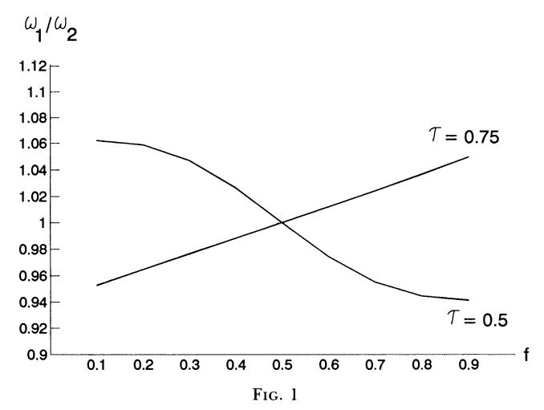
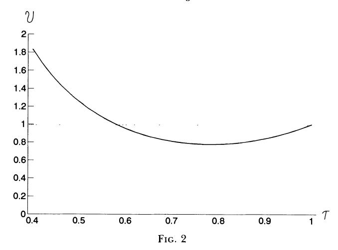
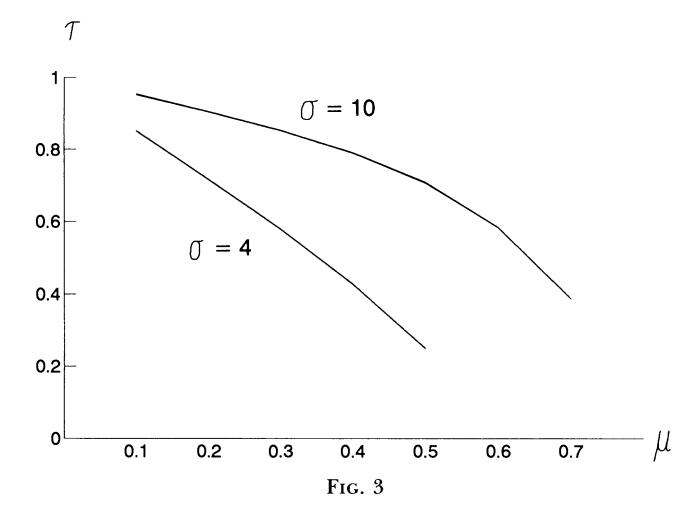

Increasing Returns and Economic Geography

Author(s): Paul Krugman

Source: Journal of Political Economy , Jun., 1991, Vol. 99, No. 3 (Jun., 1991), pp. 483-

499

Published by: The University of Chicago Press

Stable URL:<https://www.jstor.org/stable/2937739>

JSTOR is a not-for-profit service that helps scholars, researchers, and students discover, use, and build upon a wide range of content in a trusted digital archive. We use information technology and tools to increase productivity and facilitate new forms of scholarship. For more information about JSTOR, please contact support@jstor.org.

Your use of the JSTOR archive indicates your acceptance of the Terms & Conditions of Use, available at https://about.jstor.org/terms

The University of Chicago Press is collaborating with JSTOR to digitize, preserve and extend access to Journal of Political Economy

# Increasing Returns and Economic Geography

## Paul Krugman

Massachusetts Institute of Technology

 This paper develops a simple model that shows how a country can endogenously become differentiated into an industrialized "core" and an agricultural "periphery." In order to realize scale economies while minimizing transport costs, manufacturing firms tend to locate in the region with larger demand, but the location of demand itself depends on the distribution of manufacturing. Emergence of a core-periphery pattern depends on transportation costs, economies of scale, and the share of manufacturing in national income.

 The study of economic geography-of the location of factors of pro duction in space-occupies a relatively small part of standard eco nomic analysis. International trade theory, in particular, convention ally treats nations as dimensionless points (and frequently assumes zero transportation costs between countries as well). Admittedly, models descended from von Thunen (1826) play an important role in urban studies, while Hotelling-type models of locational competi tion get a reasonable degree of attention in industrial organization. On the whole, however, it seems fair to say that the study of economic geography plays at best a marginal role in economic theory.

 On the face of it, this neglect is surprising. The facts of economic geography are surely among the most striking features of real-world economies, at least to laymen. For example, one of the most remark able things about the United States is that in a generally sparsely populated country, much of whose land is fertile, the bulk of the population resides in a few clusters of metropolitan areas; a quarter of the inhabitants are crowded into a not especially inviting section of the East Coast. It has often been noted that nighttime satellite  photos of Europe reveal little of political boundaries but clearly sug gest a center-periphery pattern whose hub is somewhere in or near Belgium. A layman might have expected that these facts would play a key role in economic modeling. Yet the study of economic geogra phy, at least within the economics profession, has lain largely dormant for the past generation (with a few notable exceptions, particularly Arthur [1989, 1990] and David [in press]).

 The purpose of this paper is to suggest that application of models and techniques derived from theoretical industrial organization now allows a reconsideration of economic geography, that it is now time to attempt to incorporate the insights of the long but informal tradi tion in this area into formal models. In order to make the point, the paper develops a simple illustrative model designed to shed light on one of the key questions of location: Why and when does manufactur ing become concentrated in a few regions, leaving others relatively undeveloped?

 What we shall see is that it is possible to develop a very simple model of geographical concentration of manufacturing based on the interaction of economies of scale with transportation costs. This is perhaps not too surprising, given the kinds of results that have been emerging in recent literature (with Murphy, Shleifer, and Vishny [1989a, 1989b] perhaps the closest parallel). More interesting is the fact that this concentration of manufacturing in one location need not always happen and that whether it does depends in an interesting way on a few key parameters.

 The paper is divided into four sections. Section I sets the stage with an informal discussion of the problem. Section II then sets out the analytical model. In Section III, I analyze the determination of short run equilibrium and dynamics. Section IV analyzes the conditions under which concentration of manufacturing production does and does not occur.

### I. Bases for Regional Divergence

 There has been fairly extensive discussion over time of the nature of the externalities that lead to localization of particular industries. Indeed, Alfred Marshall's original exposition of the concept of exter nal economies was illustrated with the example of industry localiza tion. Most of the literature in this area follows Marshall in identifying three reasons for localization. First, the concentration of several firms in a single location offers a pooled market for workers with industry specific skills, ensuring both a lower probability of unemployment and a lower probability of labor shortage. Second, localized industries can support the production of nontradable specialized inputs. Third,

 informational spillovers can give clustered firms a better production function than isolated producers. (Hoover [1948] gives a particularly clear discussion of agglomeration economies.)

 These accounts of industry localization surely have considerable validity. In this paper, however, I shall offer a somewhat different approach aimed at answering a somewhat different question. Instead of asking why a particular industry is concentrated in a particular area-for example, carpets in Dalton, Georgia-I shall ask why man ufacturing in general might end up concentrated in one or a few regions of a country, with the remaining regions playing the "periph eral" role of agricultural suppliers to the manufacturing "core." The proposed explanation correspondingly focuses on generalized exter nal economies rather than those specific to a particular industry.

 I shall also adopt the working assumption that the externalities that sometimes lead to emergence of a core-periphery pattern are pecuniary externalities associated with either demand or supply link ages rather than purely technological spillovers. In competitive gen eral equilibrium, of course, pecuniary externalities have no welfare significance and could not lead to the kind of interesting dynamics we shall derive later. Over the past decade, however, it has become a familiar point that in the presence of imperfect competition and increasing returns, pecuniary externalities matter; for example, if one firm's actions affect the demand for the product of another firm whose price exceeds marginal cost, this is as much a "real" externality as if one firm's research and development spills over into the general knowledge pool. At the same time, by focusing on pecuniary external ities, we are able to make the analysis much more concrete than if we allowed external economies to arise in some invisible form. (This is particularly true when location is at issue: how far does a technologi cal spillover spill?)

 To understand the nature of the postulated pecuniary externalities, imagine a country in which there are two kinds of production, agri culture and manufacturing. Agricultural production is characterized both by constant returns to scale and by intensive use of immobile land. The geographical distribution of this production will therefore be determined largely by the exogenous distribution of suitable land. Manufactures, on the other hand, we may suppose to be character ized by increasing returns to scale and modest use of land.

 Where will manufactures production take place? Because of econo mies of scale, production of each manufactured good will take place at only a limited number of sites. Other things equal, the preferred sites will be those with relatively large nearby demand, since produc ing near one's main market minimizes transportation costs. Other locations will then be served from these centrally located sites.

 But where will demand be large? Some of the demand for manu factured goods will come from the agricultural sector; if that were the whole story, the distribution of manufacturing production would essentially form a lattice whose form was dictated by the distribution of agricultural land, as in the classic schemes of Christaller (1933) and Losch (1940). But it is not the whole story: some of the demand for manufactures will come not from the agricultural sector but from the manufacturing sector itself.

 This creates an obvious possibility for what Myrdal (1957) called "circular causation" and Arthur (1990) has called "positive feedback": manufactures production will tend to concentrate where there is a large market, but the market will be large where manufactures pro duction is concentrated.

 The circularity created by this Hirschman (1958)-type "backward linkage" may be reinforced by a "forward linkage": other things equal, it will be more desirable to live and produce near a concentra tion of manufacturing production because it will then be less expen sive to buy the goods this central place provides.

 This is not an original story; indeed, a story along roughly these lines has long been familiar to economic geographers, who emphasize the role of circular processes in the emergence of the U.S. manufac turing belt in the second half of the nineteenth century (see in partic ular Pred [1966] and Meyer [1983]). The main goal of this paper is to show that this story can be embodied in a simple yet rigorous model. However, before we move on to this model, it may be worth pursuing the intuitive story a little further to ask two questions: How far will the tendency toward geographical concentration proceed, and where will manufacturing production actually end up?

 The answer to the first question is that it depends on the underlying parameters of the economy. The circularity that can generate manu facturing concentration will not matter too much if manufacturing employs only a small fraction of the population and hence generates only a small fraction of demand, or if a combination of weak econo mies of scale and high transportation costs induces suppliers of goods and services to the agricultural sector to locate very close to their markets. These criteria would have been satisfied in a prerailroad, preindustrial society, such as that of early nineteenth-century America. In such a society the bulk of the population would have been engaged in agriculture, the small manufacturing and commer cial sector would not have been marked by very substantial economies of scale, and the costs of transportation would have ensured that most of the needs that could not be satisfied by rural production would be satisfied by small towns serving local market areas.

 But now let the society spend a higher fraction of income on nonag ricultural goods and services; let the factory system and eventually mass production emerge, and with them economies of large-scale production; and let canals, railroads, and finally automobiles lower transportation costs. Then the tie of production to the distribution of land will be broken. A region with a relatively large nonrural popu lation will be an attractive place to produce both because of the large local market and because of the availability of the goods and services produced there. This will attract still more population, at the expense of regions with smaller initial production, and the process will feed on itself until the whole of the nonrural population is concentrated in a few regions.

 This not entirely imaginary history suggests that small changes in the parameters of the economy may have large effects on its qualita tive behavior. That is, when some index that takes into account trans portation costs, economies of scale, and the share of nonagricultural goods in expenditure crosses a critical threshold, population will start to concentrate and regions to diverge; once started, this process will feed on itself.

 The story also suggests that the details of the geography that emerges-which regions end up with the population-depend sensi tively on initial conditions. If one region has slightly more population than another when, say, transportation costs fall below some critical level, that region ends up gaining population at the other's expense; had the distribution of population at that critical moment been only slightly different, the roles of the regions might have been reversed.

 This is about as far as an informal story can take us. The next step is to develop as simple a formal model as possible to see whether the story just told can be given a more rigorous formulation.

## II. A Two-Region Model

 We consider a model of two regions. In this model there are assumed to be two kinds of production: agriculture, which is a constant-returns sector tied to the land, and manufactures, an increasing-returns sec tor that can be located in either region.

 The model, like many of the models in both the new trade and the new growth literature, is a variant on the monopolistic competition framework initially proposed by Dixit and Stiglitz (1977). This frame work, while admittedly special, is remarkably powerful in its ability to yield simple intuition-building treatments of seemingly intractable issues.

All individuals in this economy, then, are assumed to share a utility function of the form

$$U = C_M^{\mu} C_A^{1-\mu},\tag{1}$$

where  $C_A$  is consumption of the agricultural good and  $C_M$  is consumption of a manufactures aggregate. Given equation (1), of course, manufactures will always receive a share  $\mu$  of expenditure; this share is one of the key parameters that will determine whether regions converge or diverge.

The manufactures aggregate  $C_M$  is defined by

$$C_M = \left[\sum_{i=1}^N c_i^{(\sigma-1)/\sigma}\right]^{\sigma/(\sigma-1)},\tag{2}$$

where N is the large number of potential products and  $\sigma > 1$  is the elasticity of substitution among the products. The elasticity  $\sigma$  is the second parameter determining the character of equilibrium in the model.

There are two regions in the economy and two factors of production in each region. Following the simplification suggested in Krugman (1981), each factor is assumed specific to one sector. Peasants produce agricultural goods; without loss of generality we suppose that the unit labor requirement is one. The peasant population is assumed completely immobile between regions, with a given peasant supply  $(1 - \mu)/2$  in each region. Workers may move between the regions; we let  $L_1$  and  $L_2$  be the worker supply in regions 1 and 2, respectively, and require only that the total add up to the overall number of workers  $\mu$ :1

$$L_1 + L_2 = \mu. \tag{3}$$

The production of an individual manufactured good i involves a fixed cost and a constant marginal cost, giving rise to economies of scale:

$$L_{Mi} = \alpha + \beta x_{i}, \tag{4}$$

where  $L_{Mi}$  is the labor used in producing i and  $x_i$  is the good's output. We turn next to the structure of transportation costs between the two regions. Two strong assumptions will be made for tractability. First, transportation of agricultural output will be assumed to be costless.2

&lt;sup>1 This choice of units ensures that the wage rate of workers equals that of peasants

in long-run equilibrium.

2 The reason for this assumption is that since agricultural products are assumed to be homogeneous, each region is either exporting or importing them, never both. But

The effect of this assumption is to ensure that the price of agricultural output and, hence, the earnings of each peasant are the same in both regions. We shall use this common agricultural price/wage rate as numeraire. Second, transportation costs for manufactured goods will be assumed to take Samuelson's "iceberg" form, in which transport costs are incurred in the good transported. Specifically, of each unit of manufactures shipped from one region to the other, only a fraction  $\tau < 1$  arrives. This fraction  $\tau$ , which is an inverse index of transportation costs, is the final parameter determining whether regions converge or diverge.

We can now turn to the behavior of firms. Suppose that there are a large number of manufacturing firms, each producing a single product. Then given the definition of the manufacturing aggregate (2) and the assumption of iceberg transport costs, the elasticity of demand facing any individual firm is  $\sigma$  (see Krugman 1980). The profit-maximizing pricing behavior of a representative firm in region 1 is therefore to set a price equal to

$$p_1 = \left(\frac{\sigma}{\sigma - 1}\right) \beta w_1,\tag{5}$$

where  $w_1$  is the wage rate of workers in region 1; a similar equation applies in region 2. Comparing the prices of representative products, we have

$$\frac{p_1}{p_2} = \frac{w_1}{w_2}. (6)$$

If there is free entry of firms into manufacturing, profits must be driven to zero. Thus it must be true that

$$(p_1 - \beta w_1)x_1 = \alpha w_1, \tag{7}$$

which implies

$$x_1 = x_2 = \frac{\alpha(\sigma - 1)}{\beta}. (8)$$

That is, output per firm is the same in each region, irrespective of wage rates, relative demand, and so forth. This has the useful implication that the number of manufactured goods produced in each region

if agricultural goods are costly to transport, this would introduce a "cliff" at the point at which the two regions have equal numbers of workers and thus at which neither had to import food. This is evidently an artifact of the two-region case: if peasants were spread uniformly across a featureless plain, there would be no discontinuity.

is proportional to the number of workers, so that

$$\frac{n_1}{n_2} = \frac{L_1}{L_2}. (9)$$

It should be noted that in zero-profit equilibrium,  $\sigma/(\sigma-1)$  is the ratio of the marginal product of labor to its average product, that is, the degree of economies of scale. Thus although  $\sigma$  is a parameter of tastes rather than technology, it can be interpreted as an inverse index of equilibrium economies of scale.

I have now laid out the basic structure of the model. The next step is to turn to the determination of equilibrium.

#### III. Short-Run and Long-Run Equilibrium

This model lacks any explicit dynamics. However, it is useful to have a concept of short-run equilibrium before we turn to full equilibrium. Short-run equilibrium will be defined in a Marshallian way, as an equilibrium in which the allocation of workers between regions may be taken as given. We then suppose that workers move toward the region that offers them higher real wages, leading to either convergence between regions as they move toward equality of worker/peasant ratios or divergence as the workers all congregate in one region.

To analyze short-run equilibrium, we begin by looking at the demand within each region for products of the two regions. Let  $c_{11}$  be the consumption in region 1 of a representative region 1 product, and  $c_{12}$  be the consumption in region 1 of a representative region 2 product. The price of a local product is simply its free on board price  $p_1$ ; the price of a product from the other region, however, is its transport cost–inclusive price  $p_2/\tau$ . Thus the relative demand for representative products is

$$\frac{c_{11}}{c_{12}} = \left(\frac{p_1 \tau}{p_2}\right)^{-\sigma} = \left(\frac{w_1 \tau}{w_2}\right)^{-\sigma}.$$
 (10)

Define  $z_{11}$  as the ratio of region 1 expenditure on local manufactures to that on manufactures from the other region. Two points should be noted about z. First, a 1 percent rise in the relative price of region 1 goods, while reducing the relative quantity sold by  $\sigma$  percent, will reduce the value by only  $\sigma-1$  percent because of the valuation effect. Second, the more goods produced in region 1, the higher their share of expenditure for any given relative price. Thus

$$z_{11} = \left(\frac{n_1}{n_2}\right) \left(\frac{p_1 \tau}{p_2}\right) \left(\frac{c_{11}}{c_{12}}\right) = \left(\frac{L_1}{L_2}\right) \left(\frac{w_1 \tau}{w_2}\right)^{-(\sigma-1)}.$$
 (11)

 Similarly, the ratio of region 2 spending on region 1 products to spending on local products is

$$z_{12} = \left(\frac{L_1}{L_2}\right) \left(\frac{w_1}{w_2 \tau}\right)^{-(\sigma - 1)}.$$
 (12)

 The total income of region 1 workers is equal to the total spending on these products in both regions. (Transportation costs are included because they are assumed to be incurred in the goods themselves.) Let Y, and Y2 be the regional incomes (including the wages of peas ants). Then the income of region 1 workers is

$$w_1 L_1 = \mu \left[ \left( \frac{z_{11}}{1 + z_{11}} \right) Y_1 + \left( \frac{z_{12}}{1 + z_{12}} \right) Y_2 \right], \tag{13}$$

and the income of region 2 workers is

$$w_2 L_2 = \mu \left[ \left( \frac{1}{1 + z_{11}} \right) Y_1 + \left( \frac{1}{1 + z_{12}} \right) Y_2 \right]. \tag{14}$$

 The incomes of the two regions, however, depend on the distribution of workers and their wages. Recalling that the wage rate of peasants is the numeraire, we have

$$Y_1 = \frac{1 - \mu}{2} + w_1 L_1 \tag{15}$$

and

$$Y_2 = \frac{1 - \mu}{2} + w_2 L_2. \tag{16}$$

 The set of equations (11)-(16) may be regarded as a system that determines w1 and w2 (as well as four other variables) given the distri bution of labor between regions 1 and 2. By inspection, one can see that if LI = L2, wI = w2. If labor is then shifted to region 1, however, the relative wage rate wI/w2 can move either way. The reason is that there are two opposing effects. On one side, there is the "home mar ket effect": other things equal, the wage rate will tend to be higher in the larger market (see Krugman 1980). On the other side, there is the extent of competition: workers in the region with the smaller manufacturing labor force will face less competition for the local peasant market than those in the more populous region. In other words, there is a trade-off between proximity to the larger market and lack of competition for the local market.

 As we move from short-run to long-run equilibrium, however, a third consideration enters the picture. Workers are interested not in

 nominal wages but in real wages, and workers in the region with the larger population will face a lower price for manufactured goods. Let f = LI/pL, the share of the manufacturing labor force in region 1. Then the true price index of manufactured goods for consumers residing in region 1 is

$$P_{1} = \left[ f w_{1}^{-(\sigma-1)} + (1-f) \left( \frac{w_{2}}{\tau} \right)^{-(\sigma-1)} \right]^{-1/(\sigma-1)}; \tag{17}$$

that for consumers residing in region 2 is

$$P_2 = \left[ f \left( \frac{w_1}{\tau} \right)^{-(\sigma - 1)} + (1 - f) w_2^{-(\sigma - 1)} \right]^{-1/(\sigma - 1)}.$$
 (18)

The real wages of workers in each region are

$$\omega_1 = w_1 P_1^{-\mu} \tag{19}$$

and

$$\omega_2 = w_2 P_2^{-\mu}. \tag{20}$$

 From (17) and (18), it is apparent that if wage rates in the two regions are equal, a shift of workers from region 2 to region 1 will lower the price index in region 1 and raise it in region 2 and, thus, raise real wages in region 1 relative to those in region 2. This there fore adds an additional reason for divergence.

 We may now ask the crucial question: How does W1/W2 vary with f? We know by symmetry that when f = 1/2, that is, when the two regions have equal numbers of workers, they offer equal real wage rates. But is this a stable equilibrium? It will be if W1/W2 decreases withyf for in that case whenever one region has a larger work force than the other, workers will tend to migrate out of that region. In this case we shall get regional convergence. On the other hand, if W1/W2 increases with f, workers will tend to migrate into the re gion that already has more workers, and we shall get regional diver gence.3 As we have seen, there are two forces working toward

 3This description of dynamics actually oversimplifies in two ways. First, it implicitly assumes that W1I/2 is a monotonic function off, or at least that it crosses one only once. In principle, this need not be the case, and there could be several stable equilibria in which both regions have nonzero manufacturing production. I have not been able to rule this out analytically, although it turns out not to be true for the numerical example considered below. The analytical discussion in the next section simply bypasses the question. Second, a dynamic story should take expectations into account. It is possible that workers may migrate into the region that initially has fewer workers because they expect other workers to do the same. This kind of self-fulfilling prophecy can occur, however, only if adjustment is rapid and discount rates are not too high. See Krugman (1991) for an analysis.

divergence—the home market effect and the price index effect—and one working toward convergence, the degree of competition for the local peasant market. The question is which forces dominate.

In principle, it is possible simply to solve our model for real wages as a function of f. This is, however, difficult to do analytically. In the next section an alternative approach is used to characterize the model's behavior. For now, however, let us simply note that there are only three parameters in this model that cannot be eliminated by choice of units: the share of expenditure on manufactured goods,  $\mu$ ; the elasticity of substitution among products,  $\sigma$ ; and the fraction of a good shipped that arrives,  $\tau$ . The model can be quite easily solved numerically for a variety of parameters. Thus it is straightforward to show that depending on the parameter values we may have either regional convergence or regional divergence.

Figure 1 makes the point. It shows computed values of  $\omega_1/\omega_2$  as a function of f in two different cases. In both cases we assume  $\sigma=4$  and  $\mu=.3$ . In one case, however,  $\tau=.5$  (high transportation costs); in the other,  $\tau=.75$  (low transportation costs). In the high-transport-cost case, the relative real wage declines as f rises. Thus in this case we would expect to see regional convergence, with the geographical distribution of the manufacturing following that of agriculture. In the low-transport-cost case, however, the slope is reversed; thus we would expect to see regional divergence.

It is possible to proceed entirely numerically from this point. If we take a somewhat different approach, however, it is possible to characterize the properties of the model analytically.

## IV. Necessary Conditions for Manufacturing Concentration

 Instead of asking whether an equilibrium in which workers are dis tributed equally between the regions is stable, this section asks whether a situation in which all workers are concentrated in one region is an equilibrium. This is not exactly the same question: as noted above, it is possible both that regional divergence might not lead to complete concentration and that there may exist stable interior equilibria even if concentration is also an equilibrium. The questions are, however, closely related, and this one is easier to answer.

 Consider a situation in which all workers are concentrated in region 1 (the choice of region of course is arbitrary). Region 1 will then constitute a larger market than region 2. Since a share of total income p is spent on manufactures and all this income goes to region 1, we have

$$\frac{Y_2}{Y_1} = \frac{1 - \mu}{1 + \mu}.\tag{21}$$

 Let n be the total number of manufacturing firms; then each firm will have a value of sales equal to

$$V_1 = \left(\frac{\mu}{n}\right)(Y_1 + Y_2),\tag{22}$$

which is just enough to allow each firm to make zero profits.

 Now we ask: Is it possible for an individual firm to commence production profitably in region 2? (I shall refer to such a hypothetical firm as a "defecting" firm.) If not, then concentration of production in region 1 is an equilibrium; if so, it is not.

 In order to produce in region 2, a firm must be able to attract workers. To do so, it must compensate them for the fact that all manufactures (except its own infinitesimal contribution) must be im ported; thus we must have

$$\frac{w_2}{w_1} = \left(\frac{1}{\tau}\right)^{\mu}.\tag{23}$$

 Given this higher wage, the firm will charge a profit-maximizing price that is higher than that of other firms in the same proportion. We can use this fact to derive the value of the firm's sales. In region 1, the defecting firm's value of sales will be the value of sales of a representative firm times (W2/WlT)<(U 1). In region 2, its value of sales will be that of a representative firm times (w2T1wl<)U( 1-), so the total value of the defecting firm's sales will be

$$V_2 = \left(\frac{\mu}{n}\right) \left[ \left(\frac{w_2}{w_1 \tau}\right)^{-(\sigma-1)} Y_1 + \left(\frac{w_2 \tau}{w_1}\right)^{-(\sigma-1)} Y_2 \right]. \tag{24}$$

 Notice that transportation costs work to the firm's disadvantage in its sales to region 1 consumers but work to its advantage in sales to region 2 consumers (because other firms must pay them but it does not).

 From (22), (23), and (24) we can (after some manipulation) derive the ratio of the value of sales by this defecting firm to the sales of firms in region 1:

$$\frac{V_2}{V_1} = \frac{1}{2} \tau^{\mu(\sigma-1)} [(1+\mu)\tau^{\sigma-1} + (1-\mu)\tau^{-(\sigma-1)}]. \tag{25}$$

 One might think that it is profitable for a firm to defect as long as V2/VI > 1, since firms will collect a constant fraction of any sales as a markup over marginal costs. This is not quite right, however, because fixed costs are also higher in region 2 because of the higher wage rate. So we must have V2/V1 > W21WI = Tv. We must therefore define a new variable,

$$\nu = \frac{1}{2} \tau^{\mu \sigma} [(1 + \mu) \tau^{\sigma - 1} + (1 - \mu) \tau^{-(\sigma - 1)}]. \tag{26}$$

 When v < 1, it is unprofitable for a firm to begin production in region 2 if all other manufacturing production is concentrated in region 1. Thus in this case concentration of manufactures production in one region is an equilibrium; if v > 1, it is not.

 Equation (26) at first appears to be a fairly unpromising subject for analytical results. However, it yields to careful analysis.

 First note what we want to do with (26). It defines a boundary: a set of critical parameter values that mark the division between concentra tion and nonconcentration. So we need to evaluate it only in the vicinity of v = 1, asking how each of the three parameters must change in order to offset a change in either of the others.

 Let us begin, then, with the most straightforward of the parame ters, [L. We find that

$$\frac{\partial \nu}{\partial \mu} = \nu \sigma(\ln \tau) + \frac{1}{2} \tau^{\sigma \mu} [\tau^{\sigma - 1} - \tau^{-(\sigma - 1)}] < 0. \tag{27}$$

 That is, the larger the share of income spent on manufactured goods, the lower the relative sales of the defecting firm. This takes place for two reasons. First, workers demand a larger wage premium in order to move to the second region; this "forward linkage" effect is reflected

 in the first term. Second, the larger the share of expenditure on manufactures, the larger the relative size of the region 1 market and hence the stronger the home market effect. This "backward linkage" is reflected in the second term in (27).

 Next we turn to transportation costs. From inspection of (26), we first note that when T = 1, v = 1; that is, when transport costs are zero, location is irrelevant (no surprise!). Second, we note that when T is small, v approaches (1 - ,u)TlT(l). Unless a is very small or >t very large, this must exceed one for sufficiently small T (the economics of the alternative case will be apparent shortly). Finally, we evaluate dv/lT:

$$\frac{\partial \nu}{\partial \tau} = \frac{\mu \sigma \nu}{\tau} + \frac{\tau^{\mu \sigma} (\sigma - 1) [(1 + \mu) \tau^{\sigma - 1} - (1 - \mu) \tau^{-(\sigma - 1)}]}{2\tau}.$$
 (28)

 For T close to one, the second term in (28) approaches L(a - 1) > 0; since the first term is always positive, av/aT > 0 for v near one.

 Taken together, these observations indicate a shape for v as a func tion of T that looks like figure 2 (which represents an actual calculation for p. = .3, a = 4): at low levels of T (i.e., high transportation costs), v exceeds one and it is profitable to defect. At some critical value of T, v falls below one and concentrated manufacturing is an equilib rium, and the relative value of sales then approaches one from below.

 The important point from this picture is that at the critical value of T that corresponds to the boundary between concentration and nonconcentration, aV/3T is negative. That is, higher transportation costs militate against regional divergence.

 We can also now interpret the case in which a(1 - p.) < 1, so that v < 1 even at arbitrarily low T. This is a case in which economies of

scale are so large (small  $\sigma$ ) or the share of manufacturing in expenditure is so high (high  $\mu$ ) that it is unprofitable to start a firm in region 2 no matter how high transport costs are.

Finally, we calculate  $\partial \nu / \partial \sigma$ :

$$\begin{split} \frac{\partial \nu}{\partial \sigma} &= \ln(\tau) \{ \mu \nu \, + \, \frac{1}{2} \tau^{\mu \sigma} [ (1 \, + \, \mu) \tau^{\sigma - 1} \, - \, (1 \, - \, \mu) \tau^{-(\sigma - 1)} ] \} \\ &= \ln(\tau) \bigg( \frac{\tau}{\sigma} \bigg) \bigg( \frac{\partial \nu}{\partial \tau} \bigg). \end{split} \tag{29}$$

Since we have just seen that  $\partial \nu/\partial \tau$  is negative at the relevant point, this implies that  $\partial \nu/\partial \sigma$  is positive. That is, a higher elasticity of substitution (which also implies smaller economies of scale in equilibrium) works against regional divergence.

The implications of these results can be seen diagrammatically. Holding  $\sigma$  constant, we can draw a boundary in  $\mu$ ,  $\tau$  space. This boundary marks parameter values at which firms are just indifferent between staying in a region 1 concentration and defecting. An economy that lies inside this boundary will not develop concentrations of industry in one or the other region; an economy that lies outside the boundary will. The slope of the boundary is

$$\frac{\partial \tau}{\partial \mu} = -\frac{\partial \nu/\partial \mu}{\partial \nu/\partial \tau} < 0.$$

If we instead hold  $\mu$  constant and consider changing  $\sigma$ , we find

$$\frac{\partial \tau}{\partial \sigma} = -\frac{\partial \nu/\partial \sigma}{\partial \nu/\partial \tau} > 0.$$

Thus an increase in  $\sigma$  will shift the boundary in  $\mu$ ,  $\tau$  space outward. Figure 3 shows calculated boundaries in  $\mu$ ,  $\tau$  space for two values of  $\sigma$ , 4 and 10. The figure tells a simple story that is precisely the intuitive story given in Section I. In an economy characterized by high transportation costs, a small share of footloose manufacturing, or weak economies of scale, the distribution of manufacturing production will be determined by the distribution of the "primary stratum" of peasants. With lower transportation costs, a higher manufacturing share, or stronger economies of scale, circular causation sets in, and manufacturing will concentrate in whichever region gets a head start.

What is particularly nice about this result is that it requires no appeal to elusive concepts such as pure technological externalities: the external economies are pecuniary, arising from the desirability of selling to and buying from a region in which other producers are

 concentrated. It also involves no arbitrary assumptions about the geo graphical extent of external economies: distance enters naturally via transportation costs, and in no other way. The behavior of the model depends on "observable" features of the tastes of individuals and the technology of firms; the interesting dynamics arise from interaction effects.

 Obviously this is a vastly oversimplified model even of the core periphery issue, and it says nothing about the localization of particu lar industries. The model does illustrate, however, how tools drawn from industrial organization theory can help to formalize and sharpen the insights of a much-neglected field. Thus I hope that this paper will be a stimulus to a revival of research into regional econom ics and economic geography.

#### References

 Arthur, W. Brian. "Competing Technologies, Increasing Returns, and Lock in by Historical Events." Econ. J. 99 (March 1989): 116-31.

 . "Positive Feedbacks in the Economy." Scientific American 262 (Febru ary 1990): 92-99.

 Christaller, Walter. Central Places in Southern Germany. Jena: Fischer, 1933. English translation by Carlisle W. Baskin. London: Prentice-Hall, 1966.

 David, Paul. "The Marshallian Dynamics of Industrialization: Chicago, 1850-1890." J. Urban Econ. (in press).

 Dixit, Avinash K., and Stiglitz, Joseph E. "Monopolistic Competition and Optimum Product Diversity." A.E.R. 67 (June 1977): 297-308.

 Hirschman, Albert 0. The Strategy of Economic Development. New Haven, Conn.: Yale Univ. Press, 1958.

 Hoover, Edgar M. The Location of Economic Activity. New York: McGraw-Hill, 1948.

 Krugman, Paul. "Scale Economies, Product Differentiation, and the Pattern of Trade." A.E.R. 70 (December 1980): 950-59.

- . "Intraindustry Specialization and the Gains from Trade." J.P.E 89 (October 1981): 959-73.
- . "History versus Expectations." QJ.E. 106 (May 1991).
- Losch, August. The Economics of Location. Jena: Fischer, 1940. English transla tion. New Haven, Conn.: Yale Univ. Press, 1954.
- Murphy, Kevin M.; Shleifer, Andrei; and Vishny, Robert W. "Income Distri bution, Market Size, and Industrialization." QJ.E. 104 (August 1989): 537-64. (a)
- . "Industrialization and the Big Push." J.P.E 97 (October 1989): 1003-26. (b)
- Meyer, David R. "Emergence of the American Manufacturing Belt: An Inter pretation." J. Hist. Geography 9, no. 2 (1983): 145-74.
- Myrdal, Gunnar. Economic Theory and Under-developed Regions. London: Duck worth, 1957.
- Pred, Allan R. The Spatial Dynamics of U.S. Urban-Industrial Growth, 1800- 1914: Interpretive and Theoretical Essays. Cambridge, Mass.: MIT Press, 1966.
- von Thunen, Johann Heinrich. The Isolated State. Hamburg: Perthes, 1826. English translation. Oxford: Pergamon, 1966.