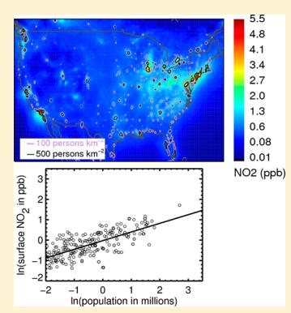
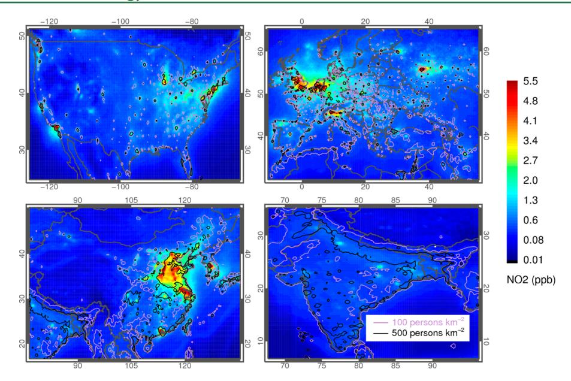
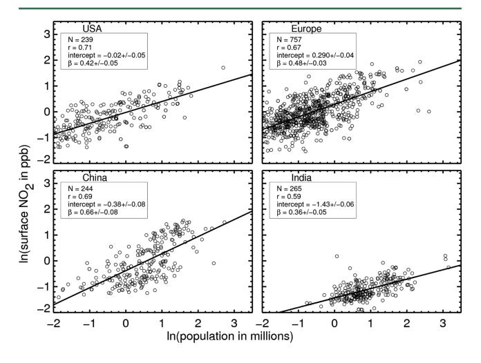

# Scaling Relationship for NO2 Pollution and Urban Population Size: A **Satellite Perspective**

L. N. Lamsal,\*\*, $^{\dagger,\ddagger}$  R. V. Martin, $^{\$,\parallel}$  D. D. Parrish, $^{\perp}$  and N. A. Krotkov $^{\ddagger}$ 

ABSTRACT: Concern is growing about the effects of urbanization on air pollution and health. Nitrogen dioxide (NO2) released primarily from combustion processes, such as traffic, is a short-lived atmospheric pollutant that serves as an air-quality indicator and is itself a health concern. We derive a global distribution of ground-level NO2 concentrations from tropospheric NO2 columns retrieved from the Ozone Monitoring Instrument (OMI). Local scaling factors from a three-dimensional chemistry-transport model (GEOS-Chem) are used to relate the OMI NO2 columns to ground-level concentrations. The OMI-derived surface  $NO_2$  data are significantly correlated (r = 0.69) with in situ surface measurements. We examine how the OMI-derived ground-level NO2 concentrations, OMI NO2 columns, and bottom-up NO, emission inventories relate to urban population. Emission hot spots, such as power plants, are excluded to focus on urban relationships. The correlation of surface NO2 with population is significant for the three countries and one continent examined here: United States (r = 0.71), Europe (r = 0.67), China (r = 0.69), and India (r = 0.59). Urban

NO2 pollution, like other urban properties, is a power law scaling function of the population size: NO2 concentration increases proportional to population raised to an exponent. The value of the exponent varies by region from 0.36 for India to 0.66 for China, reflecting regional differences in industrial development and per capita emissions. It has been generally established that energy efficiency increases and, therefore, per capita NOx emissions decrease with urban population; here, we show how outdoor ambient NO2 concentrations depend upon urban population in different global regions.

#### 1. INTRODUCTION

More than half of the world's population now lives in cities, with the number of urban dwellers and percentage of total population living in urban areas predicted to rise rapidly in the coming decades. Cities consume large quantities of energy and materials that can generate severe ambient air pollution, which is responsible for millions of annual excess deaths worldwide;2,3 therefore, concern is growing about the effects of global urbanization on health because of air-quality degradation. 4-6 Differences exist in per capita emissions of air pollutants between rural and urban areas as well as between developing and developed countries because of differences in energy consumption rates and energy production infrastructure. However, only very limited quantitative information exists regarding how ambient pollutant concentrations relate to urban population within a given country and how that relationship varies between countries. Our goal in this paper is to use a global data set of ambient air pollutant concentrations to investigate this relationship. To our knowledge, this is the first systematic, observation-based, quantitative investigation of the dependence of ambient air pollutant concentration on urban population on a global scale.

Nitrogen dioxide (NO2) is an air-quality indicator of combustion emissions that is associated with respiratory mortality and morbidity. 7-10 Furthermore, nitrogen oxides  $(NO_x = NO_2 + NO)$  contribute to the formation of fine particulate matter  $(PM_{2.5})$  and ozone  $(O_3)$ , both of which are harmful to human health and the environment. 11-13 The World Health Organization (WHO) provides air-quality guidelines for major air pollutants, including NO2, for protecting public health from adverse effects of environmental pollutants. 14 Our focus in this paper is the global data set of NO2 concentrations that is available from satellite measurements. 15

Short-lived air pollutants of anthropogenic origin, such as NO2, are primarily confined close to combustion source regions and, therefore, can be used to investigate how air pollution

Received: February 17, 2013 Revised: June 3, 2013 Accepted: June 13, 2013 Published: June 13, 2013

†Goddard Earth Sciences Technology and Research, Universities Space Research Association, Columbia, Maryland 21044-3432, United States

\*NASA Goddard Space Flight Center, Greenbelt, Maryland 20771, United States

§Department of Physics and Atmospheric Science, Dalhousie University, Halifax, Nova Scotia B3H 4R2, Canada

Harvard-Smithsonian Center for Astrophysics, Cambridge, Massachusetts 02138, United States

&lt;sup>1Chemical Sciences Division, Earth System Research Laboratory, National Oceanic and Atmospheric Administration, Boulder, Colorado 80305, United States

exposure and pollutant emissions relate to urban population. A reliable quantitative analysis of the global relationships between NO2 and population requires a globally consistent data set. Satellite remote sensing of NO2 has advanced dramatically over the past 2 decades, with finer spatial resolution. 16 Furthermore, NO2 retrieval algorithms have matured considerably and now offer high consistency between different algorithms. 17,18 Satellite remote sensing is emerging as a powerful new information source to connect population exposure to air pollution. 19,20 Here, we assess population exposure to NO2 air pollution from the globally consistent data set derived from satellite observations.

Diverse urban characteristics, such as infrastructure, energy consumption, employment, and innovation, are related to population size. Urban air pollution produced as a result of resource consumption (e.g., fuel combustion) may follow a scaling relationship with population, as do many diverse urban properties. This study takes advantage of the satellite NO2 observations that offer a global data set of consistent quality for quantitative investigation of the relationship between urban pollution and population. We further assess the relationship using additional independent information contained in bottom-up NOx emission inventories.

### 2. METHODS

2.1. Satellite Observations. The Ozone Monitoring Instrument (OMI) offers early afternoon (local time of 1300-1430) NO2 column abundance at spatial resolution of up to  $13 \times 24 \text{ km}^2$  at nadir with daily global coverage.22 We use the OMI standard tropospheric NO2 column data for 2005 (standard product version 2.1, collection 3) available from the NASA GES DISC (http://disc.sci.gsfc.nasa.gov/Aura/dataholdings/OMI/omno2 v003.shtml). Tropospheric NO2 columns are derived with a three-step approach: (1) retrieval of NO2 abundance along the average viewing path (slant column) with a differential optical absorption spectroscopy (DOAS) algorithm23 in the 405-465 nm wavelength range, (2) separation of stratospheric and tropospheric NO2 components, 17 and (3) computation of an air mass factor by integrating the NO2 relative vertical distribution (shape factors) weighted by altitude and cloud-dependent scattering weight factors to convert the slant columns into NO2 vertical columns.24 Individual clear-sky (cloud radiance fraction < 0.5) observations were allocated by area weights into  $0.25^{\circ} \times$ 0.25° grids. The estimated errors in the tropospheric NO2 columns under clear-sky conditions and typical urban concentrations (1  $\times$  1015 molecules cm-2) are ~30%. 17,25 Pixels at swath edges with ground pixel size of >20 × 63 km were excluded to reduce spatial smearing of the measured tropospheric NO2.

**2.2. GEOS-Chem Model.** We use the GEOS-Chem three-dimensional model of tropospheric chemistry, 26 version 8-03-01 (www.geos-chem.org), to simulate the relationship between OMI retrievals of the tropospheric NO2 columns and ground-level concentrations. We employ GEOS-Chem nested simulations 27–29 at  $0.5^{\circ} \times 0.667^{\circ}$  over North America ( $10^{\circ} \text{ N}-70^{\circ} \text{ N}$ ,  $40^{\circ} \text{ W}-140^{\circ} \text{ W}$ ), Europe ( $30^{\circ} \text{ N}-70^{\circ} \text{ N}$ ,  $30^{\circ} \text{ W}-50^{\circ} \text{ E}$ ), and east/southeast Asia ( $11^{\circ} \text{ N}-55^{\circ} \text{ N}$ ,  $70^{\circ} \text{ E}-150^{\circ} \text{ E}$ ) and a global simulation at  $2.0^{\circ} \times 2.5^{\circ}$  elsewhere. Boundary conditions of the nested region are provided by the global simulation at  $2.0^{\circ} \times 2.5^{\circ}$ . The GEOS-Chem simulation is driven by assimilated meteorological data available from the Goddard Earth Observing System (GEOS-5) at the NASA Global

Modeling and Assimilation Office. The model includes a detailed simulation of tropospheric ozone– $NO_x$ –hydrocarbon chemistry as well as aerosols and their precursors. 26,30

The global anthropogenic emissions in this GEOS-Chem simulation are from EDGAR 3.2FT2000 $^{31}$  at  $1^{\circ} \times 1^{\circ}$  resolution for 2000, which are scaled to 2005 following the study by van Donkelaar et al.  $^{32}$  The global inventory is overwritten by regional inventories: The U.S. EPA National Emissions Inventory (NEI) for 2005 over the United States, the CAC inventory (http://www.ec.gc.ca/inrp-npri) for 2005 over Canada, the BRAVO inventory  $^{33}$  for 1999 over Mexico, the EMEP inventory for 2005 over Europe, and the inventory from Zhang et al.  $^{34}$  for 2006 over east Asia. NO $_x$  emissions from soils, lightning, biomass burning, and aircraft are as described in study by Lamsal et al.  $^{35,36}$  Anthropogenic emissions represent  $^{>75\%}$  of total NO $_x$  emissions for North America, Europe, and east Asia.  $^{35}$ 

The GEOS-Chem simulation of  $NO_x$  has been evaluated extensively with *in situ* and satellite observations and generally agrees to within 30% of measured  $NO_x$ . 37–40 We conduct a simulation for the year 2005 and sample the model output between 13:00 and 15:00 local time for analysis of the OMI data

**2.3. Estimation of Ground-Level NO2 from OMI.** We estimate ground-level NO2 concentrations from OMI to examine the relationship of NO2 with population. We follow the approach by Lamsal et al.15 that combines a simulated local NO2 vertical profile with satellite observations of the tropospheric NO2 column but with an improved representation of the spatial variation of NO2 concentrations in the boundary layer. We use the GEOS-Chem NO2 vertical profile coincident with the OMI observations.

The ground-level  $NO_2$  mixing ratio S is estimated from OMI tropospheric  $NO_2$  column  $\Omega$  following the study by Lamsal et al.35

$$S = \left(\nu + (\nu + 1)\frac{\Omega_{G}^{F}}{\Omega_{G}^{B}}\right) \frac{S_{G}}{\Omega_{G}} \overline{\Omega}$$
(1)

Here, the subscript "G" represents GEOS-Chem. The symbol  $\nu$  is the ratio of the local OMI NO2 column  $\Omega$  to mean OMI NO2 column over a GEOS-Chem grid  $\overline{\Omega}$ . The spatial variation of boundary layer NO2 columns  $\Omega^{\rm B}$  is calculated from  $\nu$  assuming negligible horizontal variation in free-tropospheric NO2 columns  $\Omega^{\rm F}$  because of the longer NO2 lifetime in the free troposphere. The calculated ground-level NO2 represents the mixing ratio at the lowest vertical layer ( $\sim$ 100 m) of the model. Results from eq 1 differ from the earlier approach by Lamsal et al. 15,35 by up to 10% because of the explicit dependence of the ratio of the free tropospheric to boundary layer concentrations.

 $NO_2$  concentrations derived from previous retrievals of OMI  $NO_2$  (version 1.0) exhibited significant daily (r=0.3-0.8; mean r=0.53) and seasonal—spatial (r=0.73) correlations with *in situ* surface measurements at 307 sites over North America after correction for artifacts in the surface measurements. We find that both the daily (r=0.3-0.96; mean r=0.69) and seasonal—spatial (r=0.78) correlations increase for surface concentrations derived from the improved OMI  $NO_2$  product (version 2.1) used here.

**2.4. Population Data.** Population densities at a resolution of  $0.25^{\circ} \times 0.25^{\circ}$  for 2005 were obtained from the Center for International Earth Science Information Network (CIESIN), Columbia University.41 Coordinates of each city were used to

Figure 1. Annual average afternoon surface  $NO_2$  mixing ratios for the year 2005 binned at  $0.25^{\circ} \times 0.25^{\circ}$  from OMI over North America, Europe, China, and India. Contours represent population density data gridded at  $0.25^{\circ} \times 0.25^{\circ}$  resolution with 100 persons km-2 (pink) and 500 persons km-2 (black).

identify a  $0.25^{\circ} \times 0.25^{\circ}$  grid for calculation of population density and  $\mathrm{NO}_2$  concentration. The center of population of the city was identified by comparing the population density of the selected grid to that of the eight surrounding grid boxes. The population of the urban area was calculated from population density and the area of the nine grid boxes, with the grid of highest population density designated as the urban center. This approach provides an urban domain consisting of an urban core and surrounding areas from where its population likely commutes but disregards the political or geographic boundaries.

We selected 239 U.S., 757 European, 244 Chinese, and 265 Indian cities with population greater than 50 000. The selection excludes urban domains that contain large power plants [identified as  $CO_2$  annual emissions >18 Tg for the year 2007 using the data available from CARMA (www.carma.org)]. Because emission inventories are more accurate in more developed countries, this exclusion may be more accurate for the United States and Europe than for India and China. The population over the  $0.75^{\circ} \times 0.75^{\circ}$  wide urban domain ranges from 0.08 to 14.8 million for Europe and the United States, from 0.1 to 15.3 million for China, and from 0.5 to 23.5 million for India.

## 3. RESULTS AND DISCUSSION

Figure 1 shows the OMI-derived annual mean surface  $NO_2$  concentrations in the afternoon (OMI-overpass time) for 2005 over regions of major anthropogenic sources: North America, Europe, China, and India. These regions contain two-thirds of total global anthropogenic  $NO_x$  emissions. The annual mean  $NO_2$  concentrations vary spatially by more than 2 orders of magnitude with <0.1 ppbv in rural areas and >10 ppbv in urban areas. The early afternoon annual average surface  $NO_2$  concentrations shown here are lower (by about a factor of 2) than either nighttime or wintertime values. The spatial variation in  $NO_2$  reflects the spatial distribution of combustion sources, such as traffic. Numerous individual cities can be clearly identified in mean  $NO_2$  concentrations. Contours of

population density overlaid onto surface NO2 concentrations in Figure 1 demonstrate that most large-scale NO2 enhancements are over regions of high population density.

Urban  $\mathrm{NO}_2$  levels for the selected urban domains exhibit considerable regional differences with lowest concentrations of 0.2–1.2 ppbv in Indian cities and highest concentrations of 0.3–8.0 ppbv in Chinese cities. Concentrations for Indian cities reflect low  $\mathrm{NO}_x$  emissions because of low per capita fuel consumption rates. Annual mean  $\mathrm{NO}_2$  mixing ratios vary from 0.2 to 6.9 ppbv for the U.S. and European cities, with an overall mean of 1.2 ppbv.

Figure 2 shows the log–log relationship between  $NO_2$  mixing ratios and the total population of urban areas for the four regions, after excluding cities with large power plants. The approximate linear relationship for each region is notable, suggesting that the dependence of urban  $NO_2$  pollution upon

Figure 2. Log—log plot of OMI-derived surface NO2 as a function of the urban area population for the United States, Europe, China, and India. The line represents the linear least-squares fit to the points.

Table 1. Correlation Coefficient (r) and Slope  $(\beta)$  for the Power Law Regression of Surface NO2 Concentration, Tropospheric NO2 Column, and Bottom-up NOx Emissions with Populationa

|                             | surface NO 2 |                            | tropospheric NO 2 column |                 | NO x emissions |                 |             |
|-----------------------------|-------------------------|----------------------------|-------------------------------------|-----------------|---------------------------|-----------------|-------------|
| region                      | r                       | β                          | r                                   | β               | r                         | β               | sample size |
| U.S.A.                      | 0.71                    | $0.42 \pm 0.05$            | 0.76                                | $0.34 \pm 0.04$ | 0.59                      | $0.40 \pm 0.06$ | 239         |
| Europe                      | 0.67                    | $0.46 \pm 0.03$            | 0.73                                | $0.41 \pm 0.03$ | 0.69                      | $0.58 \pm 0.04$ | 757         |
| China                       | 0.69                    | $0.66 \pm 0.08$            | 0.72                                | $0.61 \pm 0.07$ | 0.74                      | $0.63 \pm 0.07$ | 244         |
| India                       | 0.59                    | $0.36 \pm 0.05$            | 0.51                                | $0.24 \pm 0.05$ | 0.51                      | $0.36 \pm 0.0$  | 265         |
| mean                        |                         | $0.48 \pm 0.13$            |                                     | $0.40 \pm 0.10$ |                           | $0.49 \pm 0.12$ |             |
| a The 95% confid | dence intervals         | for $\beta$ are indicated. |                                     |                 |                           |                 |             |

population follows a power law scaling with population, as found for many other urban indicators.21

$$Y = CP^{\beta} \tag{2}$$

Here, Y represents the average  $NO_2$  mixing ratio for an urban area with population P. The exponent,  $\beta$ , contains information on the relationship between the ambient  $NO_2$  concentration and population in urban areas. The exponents for the four regions are equal to the slopes of the linear least-squares lines shown in Figure 2. The intercept of each linear fit in Figure 2 is equal to P0 for the region, where P0 is the average P1 mixing ratio for an urban area with a population of 1 million.

The insets of Figure 2 contain correlation coefficients and the  $\beta$  values from the relationships between NO2 and population for the four selected regions. NO2 mixing ratios are significantly correlated (r = 0.59-0.71) with urban populations in each of the four regions. The  $\beta$  values are in the range of 0.36–0.66, with an overall mean of 0.48. A value of  $\beta$  < 1 indicates decreasing per capita NO2 concentration contribution with an increasing population size. China stands out with a larger  $\beta$ value; one reason may be larger disparities in per capita NO, emissions across urban areas of increasing population in China compared to the United States and Europe, 44 but other factors may contribute as well. The lower  $\beta$  value for India could reflect a larger decrease in per capita NOx emissions with urban size compared to the other three regions. The observed scatter about the linear relationships in Figure 2 is attributed to differences in population density, industrial activities, urban contiguity, meteorology, and inconsistencies in NO2 retrievals over different urban areas; these same factors may also contribute to the differences in the relationship between the four areas. We find that  $\beta$  is insensitive to either latitude or season, as inferred by repeating the regression for selected portions of the data.

We also examined the relationship between NO2 and population for the 84 U.S. cities from Figure 2 that offer *in situ* NO2 measurements. The analysis was restricted to fewer cities because of the sparse *in situ* NO2 monitoring network that is intended primarily for regulatory surveillance. The relationship with *in situ* measurements exhibited a weaker correlation (r = 0.52) and lower slope ( $\beta = 0.22$ ) than OMI-derived surface NO2 concentrations (r = 0.66 and  $\beta = 0.41$ ) for those cities. The lower correlation and slope may arise from (a) strong spatial gradient in NO2 concentrations, (b) preferential placement of monitors in polluted locations, and (c) interferences in *in situ* NO2 measurements.

The relationship in eq 2 allows for estimation of the average  $NO_2$  mixing ratio for an urban area with a specific population. For example, Table 2 presents the average afternoon  $NO_2$  mixing ratio for an urban area with 1 million inhabitants, which is given directly by the y intercept in Figure 2. The  $NO_2$  mixing

ratio for 1 million inhabitants is a minimum at 0.23 ppbv for India and a maximum at 1.33 ppbv for Europe. The spatial heterogeneity in emission patterns, local meteorology, and topography lead to substantial intraurban variation in NO2. 19,50,51 Repeating the regression by season reveals a seasonal variation in the intercept with larger values in winter than summer that reflects a longer NOx lifetime in winter. These average mixing ratios over roughly 600 km2 from the satellite are lower than NO2 conventional point measurements at ground sampling sites, which tend to be located near emission sources to address regulatory objectives and which suffer from positive bias because of interference from other reactive oxidized nitrogen species. 15,45-49 Area-average concentrations may better represent population exposure. These results imply a 6-fold continental-scale difference in outdoor ambient NO2 pollution concentrations in cities of a million inhabitants because of differences in per capita energy consumption, methods, and fuels used for energy generation, extent of emission controls, regional geography, and likely other factors. Relative rankings for other city population sizes depend upon both the intercept and  $\beta$ , as given in eq 2.

We also examined the  $NO_2$ -population relationship using other parameters to quantify  $NO_2$  pollution: OMI tropospheric  $NO_2$  columns and  $NO_x$  emissions from inventories. Tropospheric  $NO_2$  columns are closely related to  $NO_x$  emissions.52 Results are summarized in Tables 1 and 2. Area average urban

Table 2. Average Afternoon Surface NO2 Concentration, Tropospheric NO2 Column, and NOx Emissions for an Urban Area with 1 Million Peoplea

| region                                                   | surface NO 2 (ppbv) | tropospheric $NO_2$ (molecules cm -2 ) | $NO_x$ emissions (Gg of N year -1 ) |  |  |  |  |
|----------------------------------------------------------|--------------------------------|---------------------------------------------------|------------------------------------------------|--|--|--|--|
| U.S.A.                                                   | $0.98 \pm 0.06$                | $3.24 \pm 0.13 \times 10^{15}$                    | $64.5 \pm 4.8$                                 |  |  |  |  |
| Europe                                                   | $1.33 \pm 0.06$                | $3.15 \pm 0.10 \times 10^{15}$                    | $40.7 \pm 2.0$                                 |  |  |  |  |
| China                                                    | $0.68 \pm 0.06$                | $2.40 \pm 0.16 \times 10^{15}$                    | $33.9 \pm 2.3$                                 |  |  |  |  |
| India                                                    | $0.23 \pm 0.02$                | $1.30 \pm 0.07 \times 10^{15}$                    | $31.0 \pm 2.4$                                 |  |  |  |  |
| a The 95% confidence intervals are indicated. |                                |                                                   |                                                |  |  |  |  |

tropospheric NO2 columns and NOx emissions exhibit similar correlation (r = 0.63-0.68) and  $\beta$  (=0.40–0.49) values with urban population. The tropospheric NO2 column and NOx emission rate corresponding to 1 million inhabitants are minimum at 1.3 × 1015 molecules cm-2 and 31.0 Gg of N year-1 for India and maximum at 3.2 × 1015 molecules cm-2 and 64.5 Gg of N year-1 for the United States. Similar results for surface concentrations, columns, and emissions from inventories provide confidence in the relationships.

The regional differences found here reflect differences in per capita emissions as well as in other factors, including urban population density. The differences are generally consistent with the degree of economic development in the regions, but there is one troubling inconsistency. In Table 2, the quantities derived from the satellite data ( $NO_2$  surface concentrations and  $NO_2$  column amounts) are larger by a factor of 2–3 for the average Chinese city compared to the average Indian city, while the emissions derived from the emission inventory are nearly identical. This inconsistency may reflect inaccuracies in the emission inventory and should be investigated further.

For an urban area, the total population integrated exposure to an ambient air pollutant can be estimated from the appropriate scaling relationship. Because  $\beta$  is greater than 0, eq 2 indicates that the ambient concentrations of NO2 integrated over the entire urban population increase with population. This dependence together with a dose/response relationship could allow for an estimation of the integrated health effects in an urban population.

The  $NO_2$  scaling laws investigated here have profound implications for air-quality management. For example, in a Chinese city of 10 million people, the average outdoor ambient  $NO_2$  concentrations are  $10^{0.66} = 4.6$  times higher than in an average city of 1 million. This greater concentration occurs even though cities with higher populations have higher energy efficiency and, therefore, lower per capita  $NO_2$  emissions. For example, in China, the total  $NO_x$  emissions from an urban area are a factor of  $10^{0.63} = 4.3$  times lower from one larger average city of 10 million people compared to 10 smaller average cities with 1 million people each. The other regions that we examined exhibited smaller increases in  $NO_2$  pollution with population, reflecting a combination of emission controls and per capita fuel use.

Additional work could improve the estimates available from the scaling law approach presented here. This development could include information on actual urban extent and contiguity53 and separation of cities by industrial development rate. Further improvements to the retrieval of tropospheric NO2 and to the estimation of surface concentrations from satellite measurements could improve the quality of the data product. The estimation of surface concentrations from NO2 columns may benefit from NO2 simulations at higher spatial resolution. Increased spatial resolution from future satellite instruments from both low earth and geostationary orbits would better resolve urban gradients. Planned future work will include application of this approach to smaller spatial scales, for example, examining the scaling relationships for different provinces in China.

#### AUTHOR INFORMATION

## **Corresponding Author**

\*E-mail: lok.lamsal@nasa.gov.

#### Notes

The authors declare no competing financial interest.

#### ACKNOWLEDGMENTS

We thank Aaron van Donkelaar for performing the GEOS-Chem nested simulation. The work was supported by NASA's Earth Science Directorate Atmospheric Composition Program and the Natural Sciences and Engineering Research Council of Canada.

## **■** REFERENCES

(1) Population Division, Department of Economic and Social Affairs, United Nations. World Urbanization Prospects: The 2011 Revision;

- Population Division, Department of Economic and Social Affairs, United Nations: New York, 2012.
- (2) Lim, S. S.; et al. A comparative risk assessment of burden of disease and injury attributable to 67 risk factors and risk factor clusters in 21 regions, 1990–2010: A systematic analysis for the Global Burden of Disease Study 2010. *Lancet* **2012**, 380 (9859), 2224–2260.
- (3) Mathers, C. D.; Stevens, G.; Mascarenhas, M. Global Health Risks: Mortality and Burden of Disease Attributable to Selected Major Risks; World Health Organization: Geneva, Switzerland, 2009.
- (4) Parrish, D. D.; Zhu, T. Clean air for megacities. *Science* **2009**, 326, 674–674.
- (5) Organisation for Economic Co-operation and Development (OECD). Environmental Outlook to 2050: The Consequences of Inaction, Key Findings on Health and Environment; OECD: Paris, France, 2012; ISBN: 978-92-64-122161.
- (6) The *PLOS Medicine* Editors.. The air that we breathe: Addressing the risks of global urbanization on health. *PLoS Med.* **2012**, 9 (8), No. e1001301.
- (7) Burnett, R. T.; Steib, D.; Brook, J. R.; Cakmak, S.; Dales, R.; Raizenne, M.; Vincent, R.; Dann, T. The short-term effects of nitrogen dioxide on mortality in Canadian cities. *Arch. Environ. Health* **2004**, *59*, 228–237.
- (8) Samoli, E.; Aga, E.; Touloumi, G.; Nisiotis, K.; Forsberg, B.; Lefranc, A.; Pekkanen, J.; Wojtyniak, B.; Schindler, C.; Niciu, E.; Brunstein, R.; Dodic, F. M.; Schwartz, J. Short term effects of nitrogen dioxide and mortality: An analysis within the APHEA project. *Eur. Respir. J.* **2006**, *27*, 1129–1137.
- (9) United States Environmental Protection Agency (U.S. EPA). Integrated Science Assessment for Oxides of Nitrogen: Health Criteria (First External Review Draft), Technical Report; U.S. EPA: Research Triangle Park, NC, 2008; EPA/600/R-07/093.
- (10) Brunekreef, B. Health effects of air pollution observed in cohort studies in Europe. *J. Exposure Sci. Environ. Epidemiol.* **2007**, *17*, S61–S65
- (11) Brunekreef, B.; Holgate, S. T. Air pollution and health. *Lancet* **2002**, *360* (9341), 1233–1242.
- (12) Pope, C. A., III; Ezzati, M.; Dockery, D. W. Fine particulate air pollution and life expectancy in the United States. *N. Engl. J. Med.* **2009**, *360*, *376*–*386*.
- (13) Anenberg, S. C.; Horowitz, L. W.; Tong, D. Q.; West, J. J. An estimate of the global burden of anthropogenic ozone and fine particulate matter on premature human mortality using atmospheric modeling. *Environ. Health Perspect.* **2010**, *118* (9), 1189–1195.
- (14) Krzyzanowski, M.; Cohen, A. Update of WHO air quality guidelines. *Air Qual. Atmos. Health* **2008**, *1*, 7–13.
- (15) Lamsal, L. N.; Martin, R. V.; van Donkelaar, A.; Steinbacher, M.; Celarier, E. A.; Bucsela, E.; Dunlea, E. J.; Pinto, J. P. Ground-level nitrogen dioxide concentrations inferred from the satellite-borne Ozone Monitoring Instrument. *J. Geophys. Res.* **2008**, *113*, D16308.
- (16) Martin, R. V. Satellite remote sensing of surface air quality. *Atmos. Environ.* **2008**, 42, 7823–7843.
- (17) Bucsela, E. J.; Krotkov, N. A.; Celarier, E. A.; Lamsal, L. N.; Swartz, W. H.; Bhartia, P. K.; Boersma, K. F.; Veefkind, J. P.; Gleason, J. F.; Pickering, K. E. A new algorithm for retrieving vertical column NO2 from nadir viewing satellite instruments: Applications to OMI. *Atmos. Meas. Tech.* **2013**, *6*, 1361–1407.
- (18) Boersma, K. F.; Eskes, H. J.; Dirksen, R. J.; van der, A, R.J.; Veefkind, J. P.; Stammes, P.; Huijnen, V.; Kleipool, Q. L.; Sneep, M.; Claas, J.; Leitao, J.; Richter, A.; Zhou, Y.; Brunner, D. An improved tropospheric NO2 column retrieval algorithm for the Ozone Monitoring Instrument. *Atmos. Meas. Tech.* **2011**, *4*, 1905–1928.
- (19) Novotny, E. V.; Bechle, M. J.; Millet, D. B.; Marshall, J. D. National satellite-based land-use regression: NO2 in the United States. *Environ. Sci. Technol.* **2011**, *45*, 4407–4414.
- (20) van Donkelaar, A.; Martin, R. V.; Brauer, M.; Kahn, R.; Levy, R.; Verduzco, C.; Villeneuve, P. J. Global estimates of ambient fine particulate matter concentrations from satellite-based aerosol optical depth: Development and application. *Environ. Health Perspect.* **2010**, 118, 847–855.

- (21) Bettencourt, L. M. A.; Lobo, J.; Helbing, D.; Kuehnert, C.; West, G. B. Growth, innovation, scaling, and the pace of life in cities. Proc. Natl. Acad. Sci. U.S.A. 2007, 104 (17), 7301−7306.
- (22) Levelt, P. F.; van den Oord, G. H. J.; Dobber, M. R.; Malkki, A.; ̈ Visser, H.; de Vries, J.; Stammes, P.; Lundell, J. O. V.; Saari, H. The Ozone Monitoring Instrument. IEEE Trans. Geosci. Remote Sens. 2006, 44, 1093−1101.
- (23) Platt, U. Differential optical absorption spectroscopy (DOAS). In Air Monitoring by Spectroscopic Techniques; John Wiley and Sons: Hoboken, NJ, 1994; pp 27−84.
- (24) Palmer, P. I.; Jacob, D. J.; Chance, K.; Martin, R. V.; Spurr, R. J. D.; Kurosu, T. P.; Bey, I.; Yantosca, R.; Fiore, A.; Li, Q. B. Air mass factor formulation for spectroscopic measurements from satellites: Application to formaldehyde retrievals from the Global Ozone Monitoring Experiment. J. Geophys. Res. 2001, 106 (D13), 14539− 14550.
- (25) Boersma, K. F.; Eskes, H. J.; Brinksma, E. J. Error analysis for tropospheric NO2 retrieval from space. J. Geophys. Res. 2004, 109, D04311.
- (26) Bey, I.; Jacob, D. J.; Yantosca, R. M.; Logan, J. A.; Field, B. D.; Fiore, A. M.; Li, Q. B.; Liu, H. Y.; Mickley, L. J.; Schultz, M. G. Global modeling of tropospheric chemistry with assimilated meteorology: Model description and evaluation. J. Geophys. Res. 2001, 106 (D19), 23073−23095.
- (27) Zhang, L.; Jacob, D. J.; Smith-Downey, N. V.; Wood, D. A.; Blewitt, D.; Carouge, C. C.; van Donkelaar, A.; Jones, D. B. A.; Murray, L. T.; Wang, Y. Improved estimate of the policy-relevant background ozone in the United States using the GEOS-Chem global model with 1/2° × 2/3° horizontal resolution over North America. Atmos. Environ. 2011, 45, 6769−6776.
- (28) Wang, S. W.; Zhang, Q.; Streets, D. G.; He, K. B.; Martin, R. V.; Lamsal, L. N.; Chen, D.; Lei, Y.; Lu, Z. Growth in NOx emissions from power plants in China: Bottom-up estimates and satellite observations. Atmos. Chem. Phys. 2012, 12, 4429−4447.
- (29) van Donkelaar, A.; Martin, R. V.; Pasch, A. N.; Szykman, J. J.; Zhang, L.; Wang, Y. X.; Chen, D. Improving the accuracy of daily satellite-derived ground-level fine aerosol concentration estimates for North America. Environ. Sci. Technol. 2012, 46, 11971−11978.
- (30) Park, R. J.; Jacob, D. J.; Field, B. D.; Yantosca, R. M.; Chin, M. Natural and transboundary pollution influences on sulfate-nitrateammonium aerosols in the United States: Implications for policy. J. Geophys. Res. 2004, 109, D15204.
- (31) Olivier, J. G. J.; Berdowski, J. J. M. Global emissions sources and sinks. In The Climate System; A.A. Balkema Publishers/Swets and Zeitlinger Publishers: Lisse, The Netherlands, 2001; pp 33−78.
- (32) van Donkelaar, A.; Martin, R. V.; Leaitch, W. R.; Macdonald, A. M.; Walker, T. W.; Streets, D. G.; Zhang, Q.; Dunlea, E. J.; Jimenez, J. L.; Dibb, J. E.; Huey, L. G.; Weber, R.; Andreae, M. O. Analysis of aircraft and satellite measurements from the Intercontinental Chemical Transport Experiment (INTEX-B) to quantify long-range transport of east Asian sulfur to Canada. Atmos. Chem. Phys. 2008, 8, 2999−3014.
- (33) Kuhns, H.; Knipping, E. M.; Vokovich, J. M. Development of a United States−Mexico emissions inventory for the Big Bend Regional Aerosol and Visibility Observational (BRAVO) study. J. Air Waste Manage. Assoc. 2005, 55, 677−692.
- (34) Zhang, Q.; Streets, D. G.; He, K. B.; Wang, Y.; Richter, A.; Burrows, J. P.; Uno, I.; Jang, C. J.; Chen, D.; Yao, Z. L.; Lei, Y. NOx emission trends for China, 1995−2004: The view from the ground and the view from space. J. Geophys. Res. 2007, 112, D22306.
- (35) Lamsal, L. N.; Martin, R. V.; van Donkelaar, A.; Celarier, E. A.; Bucsela, E. J.; Boersma, K. F.; Dirksen, R.; Luo, C.; Wang, Y. Indirect validation of tropospheric nitrogen dioxide retrieved from the OMI satellite instrument: Insight into the seasonal variation of nitrogen oxides at northern midlatitudes. J. Geophys. Res. 2010, 115, D05302.
- (36) Lamsal, L. N.; Martin, R. V.; Padmanabhan, A.; van Donkelaar, A.; Zhang, Q.; Sioris, C. E.; Chance, K.; Kurosu, T. P.; Newchurch, M. J. Application of satellite observations for timely updates to global anthropogenic NOx emission inventories. Geophys. Res. Lett. 2011, 38, L05810.

- (37) Martin, R. V.; Sioris, C. E.; Chance, K.; Ryerson, T. B.; Bertram, T. H.; Wooldridge, P. J.; Cohen, R. C.; Neuman, J. A.; Swanson, A.; Flocke, F. M. Evaluation of space-based constraints on global nitrogen oxide emissions with regional aircraft measurements over and downwind of eastern North America. J. Geophys. Res. 2006, 111, D15308.
- (38) Martin, R. V.; Sauvage, B.; Folkins, I.; Sioris, C. E.; Boone, C.; Bernath, P.; Ziemke, J. R. Space-based constraints on the production of nitric oxide by lightning. J. Geophys. Res. 2007, 112, D09309.
- (39) Hudman, R. C.; Jacob, D. J.; Turquety, S.; Leinbensperger, E. M.; Murray, L. T.; Wu, S.; Gilliland, A. B.; Avery, M. A.; Bertram, T. H.; Brune, W. H.; Cohen, R. C.; Dibb, J. E.; Flocke, F. M.; Fried, A.; Holloway, J.; Neuman, J. A.; Orville, R.; Perring, A.; Ren, X.; Ryerson, T. B.; Sachse, G. W.; Singh, H. B.; Swanson, A.; Wooldridge, P. J. Surface and lightning sources of nitrogen oxides over the United States: Magnitudes, chemical evolution, and outflow. J. Geophys. Res. 2007, 112, D12S05.
- (40) Boersma, K. F.; Jacob, D. J.; Eskes, H. J.; Pinder, R. W.; Wang, J.; van der, A R. J. Intercomparison of SCIAMACHY and OMI tropospheric NO2 columns: Observing the diurnal evolution of chemistry and emissions from space. J. Geophys. Res. 2008, 113, D16S26.
- (41) Socioeconomic Data Applications Center (SEDAC). Gridded Population of the World, Version 3 and the Global Rural-Urban Mapping Project; SEDAC, Columbia University: New York, 2009; [http://sedac.](http://sedac.ciesin.columbia.edu/data/collection/gpw-v3) [ciesin.columbia.edu/data/collection/gpw-v3](http://sedac.ciesin.columbia.edu/data/collection/gpw-v3).
- (42) Lu, Z.; Streets, D. G. Increase in NOx emissions from Indian thermal power plants during 1996−2010: Unit-based inventories and multisatellite observations. Environ. Sci. Technol. 2012, 46, 7463−7470.
- (43) Chow, J.; Kopp, R. J.; Portney, P. R. Energy resources and global development. Science 2003, 302, 1528−1531.
- (44) Lu, W.-M.; Lo, S.-F. A closer look at the economic− environmental disparities for regional development in China. Eur. J. Oper. Res. 2007, 183 (2), 882−894.
- (45) Winer, A. M.; Peters, J. W.; Smith, J. P.; Pitts, J. N., Jr. Response of commercial chemiluminescent NO−NO2 analyzers to other nitrogen containing compounds. Environ. Sci. Technol. 1974, 8, 1118−1121.
- (46) United States Environmental Protection Agency (U.S. EPA). Technical Assistance Document for the Chemiluminescence Measurement of Nitrogen Dioxide, Technical Report; Environmental Monitoring and Support Laboratory, U.S. EPA: Research Triangle Park, NC, 1975; EPA-600/4-75-003.
- (47) Grosjean, D.; Harrison, J. Response of chemiluminescence NOx analyzers and ultraviolet ozone analyzers to organic air pollutants. Environ. Sci. Technol. 1985, 19, 862−865.
- (48) Dunlea, E. J.; Herndon, S. C.; Nelson, D. D.; Volkamer, R. M.; San Martini, F.; Sheehy, P. M.; Zahniser, M. S.; Shorter, J. H.; Wormhoudt, J. C.; Lamb, B. K.; Allwine, E. J.; Gaffney, J. S.; Marley, N. A.; Grutter, M.; Marquez, C.; Blanco, S.; Cardenas, B.; Retama, A.; Ramos Villegas, C. R.; Kolb, C. E.; Molina, L. T.; Molina, M. J. Evaluation of nitrogen dioxide chemiluminescence monitors in a polluted urban environment. Atmos. Chem. Phys. 2007, 7, 2691−2704.
- (49) Steinbacher, M.; Zellweger, C.; Schwarzenbach, B.; Bugmann, S.; Bugmann, B.; Ordoǹ ̃ ez, C.; Prevò ̂t, A. S. H.; Hueglin, C. Nitrogen oxides measurements at rural sites in Switzerland: Bias of conventional measurement techniques. J. Geophys. Res. 2007, 112, D11307.
- (50) Jerrett, M.; Finkelstein, M. M.; Brook, J. F.; Arain, M. A.; Kanaroglau, P.; Stieb, D. M.; Gilbert, N. L.; Verma, D.; Finkelstein, N.; Chapman, K. R.; Sears, M. R. A cohort study of traffic-related air pollution and mortality in Toronto, Ontario, Canada. Environ. Health Perspect. 2009, 117, 772−777.
- (51) Cyrys, J.; Eeftens, M.; Heinrich, J.; Ampe, C.; Armengaud, A.; Beelen, R.; Bellander, T.; Beregszaszi, T.; Birk, M.; Cesaroni, G.; Cirach, M.; de Hoogh, K.; De Nazelle, A.; de Vocht, F.; Declercq, C.; Dedele ̇ , A.; Dimakopoulou, K.; Eriksen, K.; Galassi, C.; Graulevic ̇ iene ̌ ,̇ R.; Grivas, G.; Gruzieva, O.; Gustafsson, A. H.; Hoffmann, B.; Iakovides, M.; Ineichen, A.; Kramer, U.; Lanki, T.; Lozano, P.; ̈ Madsen, C.; Meliefste, K.; Modig, L.; Mölter, A.; Mosler, G.;

Nieuwenhuijsen, M.; Nonnemacher, M.; Oldenwening, M.; Peters, A.; Pontet, S.; Probst-Hensch, N.; Quass, U.; Raaschou-Nielsen, O.; Ranzi, A.; Sugiri, D.; Stephanou, E. G.; Taimisto, P.; Tsai, M.-Y.; Vaskö vi, E.; Villani, S.; Wang, M.; Brunekreef, B.; Hoek, G. Variation of NO2 and NOx concentrations between and within 36 European study areas: Results from the ESCAPE study. Atmos. Environ. 2012, 62, 374−390.

- (52) Martin, R. V.; Jacob, D. J.; Chance, K.; Kurosu, T. P.; Palmer, P. I.; Evans, M. J. Global inventory of nitrogen oxide emissions constrained by space-based observations of NO2 columns. J. Geophys. Res. 2003, 108 (D17), 4537.
- (53) Bechle, M. J.; Millet, D. B.; Marshall, J. D. Effects of income and urban form on urban NO2: Global evidence from satellites. Environ. Sci. Technol. 2011, 45, 4914−4919.