# **OPEN** Large cities are less green

Erneson A. Oliveira1, José S. Andrade, Jr.1 & Hernán A. Makse1,2

SUBJECT AREAS: STATISTICS COMPLEX NETWORKS

1Departamento de Física, Universidade Federal do Ceará, 60451-970 Fortaleza, Ceará, Brazil, 2Levich Institute and Physics Department, City College of New York, New York, New York 10031, USA.

Received 28 November 2013

Accepted 31 January 2014

Published 28 February 2014

Correspondence and requests for materials should be addressed to H.A.M. (hmakse@lev. ccny.cuny.edu) We study how urban quality evolves as a result of carbon dioxide emissions as urban agglomerations grow. We employ a bottom-up approach combining two unprecedented microscopic data on population and carbon dioxide emissions in the continental US. We first aggregate settlements that are close to each other into cities using the City Clustering Algorithm (CCA) defining cities beyond the administrative boundaries. Then, we use data on  $\mathrm{CO}_2$  emissions at a fine geographic scale to determine the total emissions of each city. We find a superlinear scaling behavior, expressed by a power-law, between  $\mathrm{CO}_2$  emissions and city population with average allometric exponent  $\beta=1.46$  across all cities in the US. This result suggests that the high productivity of large cities is done at the expense of a proportionally larger amount of emissions compared to small cities. Furthermore, our results are substantially different from those obtained by the standard administrative definition of cities, *i.e.* Metropolitan Statistical Area (MSA). Specifically, MSAs display isometric scaling emissions and we argue that this discrepancy is due to the overestimation of MSA areas. The results suggest that allometric studies based on administrative boundaries to define cities may suffer from endogeneity bias.

llometry was originally introduced in the context of evolutionary theory1 to describe the correlation between relative dimensions of parts of body size, for instance brain size in mammals, with changes in overall body size. In a classical result, Kleiber showed that surface area, Y, and the body mass, X, of a large range of mammal's are related by an allometric power-law  $Y = AX^{\beta}$ , where  $\beta = 3/4$  is the allometric exponent and A is a constant2.

In analogy with biological systems, Bettencourt  $et~al.^3$  showed that cities across US obey allometric relations with population size. Indeed, a large class of human activities can be grouped into three categories according to the value of the allometric exponent: (a) Isometric behavior (linear, non-allometric or extensive,  $\beta=1$ ) typically reflects the scaling with population size of individual human needs, like the number of jobs, houses, and water consumption. (b) Allometric sublinear behavior (hipoallometric, non-extensive,  $\beta<1$ ) implies an economy of scale in the quantity of interest because its per~capita measurement decreases with population size. Hipoallometry is found, for example, in the number of gasoline stations, length of electrical cables, and road surfaces (material and infrastructure). (c) Superlinear behavior (hyperallometric, non-extensive,  $\beta>1$ ) emerges whenever the pattern of social activity has significant influence in the urban indicator. Wages, income, growth domestic product, bank deposits, as well as rates of invention measured by patents and employment in creative sectors, display a superlinear increase with population size. These superlinear scaling laws indicate that larger cities are associated with optimal levels of human productivity and quality of life; doubling the city size leads to a larger-than-double increment in productivity and life standards3-5.

The optimal productivity of large cities raises the question of the consequences of urban growth to environmental quality. Indeed, it is intensely debated whether large cities can be considered environmentally "green", implying that their productivity is associated with lower than expected greenhouse gases (GHG) and pollutant emissions6-11. For instance, some of these studies report that the level of commuting has a major contributing to the relation between GHG emissions and city size6-8,11. As a consequence, compact cities would be more green due to the attenuation of the average commuting length. More recently, however, Gaigné *et al.*12 suggested that compact cities might not be as environmentally friendly as it was thought, mainly because increasing-density policies obligate firms and households to change place. This relocation of the urban system then generates a higher level of pollution. In this context, here we study the allometric laws associated with a particular type of GHG emissions from human activity by studying the relation between CO2 emissions of cities as a function of population size. We employ a bottom-up approach combining two unprecedented microscopic data on population and carbon dioxide emissions in the continental US. We first define the boundaries of cities using the City Clustering Algorithm (CCA)13-21 which are then used to calculate the CO2 emissions. We find a superlinear allometric scaling law between emissions and city size. We also explore different sectors and activities of the economy finding superlinear behavior in most of the sectors. Our results pertain only emissions of CO2. It will be

desirable to extend it to the rest of GHGs. These results indicate that large cities may not provide as many environmental advantages as previously thought7,9-11.

#### Results

**Datasets.** We use two geo-referenced datasets on population and  $CO_2$  emissions in the continental US defined in a fine geometrical grid. The population dataset is obtained from the *Global Rural-Urban Mapping Project* (GRUMPv1)22. These data are a combination of gridded census and satellite data for population of urban and rural areas in the United States in year 2000 (Fig. 1a and Sec. 3). The GRUMPv1 data provides a high resolution gridded population data at 30 arc-second, equivalent to a grid of 0.926  $km \times 0.926$  km at the Equator line.

The emissions dataset is obtained from the *Vulcan Project* (VP) compiled at Arizona State University23. The VP provides fossil fuel  $CO_2$  emissions in the continental US at a spatial resolution of 10  $km \times 10 \ km \ (0.1 \ deg \times 0.1 \ deg \ grid)$  from 1999 to 2008. The data are separated according to economic sectors and activities (see Sec. 3 for details): Commercial, Industrial, and Residential sectors (obtained

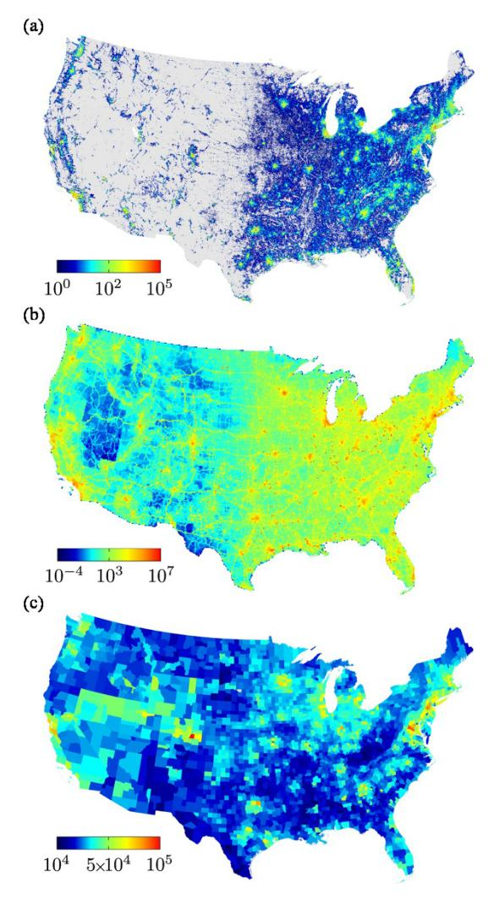

Figure 1 | Population and emissions in US. (a) The population map of the contiguous US from the Global Rural-Urban Mapping Project  $(GRUMPv1)^{22}$  dataset in logarithmic scale. (b) The  $CO_2$  emissions map of the contiguous US from the Vulcan Project (VP) dataset23 measured in log base 10 scale of metric tonnes of carbon per year. (c) Map of the mean household income per capita of 3, 092 US counties in dollars from US Census Bureau dataset24 for the year 2000.

from country-level aggregation of non-geocoded sources and non-electricity producing sources from geocoded location), Electricity Production (geolocated sources associated with the production of electricity such as thermal power stations), Onroad Vehicles (mobile transport using designated roadways such as automobiles, buses, and motorcycles), Nonroad Vehicles (mobile surface sources that do not travel on roadways such as boats, trains, snowmobiles), Aircraft (Airports, geolocated sources associated with taxi, takeoff, and landing cycles associated with air travel, and Aircraft, gridded sources associated with the airborne component of air travel), and Cement Industry.

We analyze the annual average of emissions in 2002 for the total of all sectors combined (see Fig. 1b) and each sector separately (Fig. 2). The choice of 2002 data (rather than 2000 as in population) reflects the constraint that it is the only year for which the quantification of  $\rm CO_2$  emissions has been achieved at the scale of individual factories, powerplants, roadways and neighborhoods and on an hourly basis23.

To define the boundary of cities, we use the notion of spatial continuity by aggregating settlements that are close to each other into cities  $^{15-18,20,21}$ . Such a procedure, called the City Clustering Algorithm (CCA), considers cities as constituted of contiguous commercial and residential areas for which we know also the emissions of CO2 from the Vulcan Project dataset. By using two microscopically defined datasets, we are able to match precisely the population of each agglomeration to its rate of CO2 emissions by constructing the urban agglomerations from the bottom up without resorting to predefined administrative boundaries.

We also use the US income dataset available in ASCII format by US Census Bureau24 for the year 2000. This dataset provides the mean household income per capita for the 3, 092 US counties. For each county, we combined the income data and the administrative boundaries25 in order to relate them with the geolocated datasets (Fig. 1c and Sec. 3).

We first apply the CCA to construct cities aggregating population sites  $D_i$  at site i. The procedure depends on a population threshold  $D^*$  and a distance threshold  $\ell$ . If  $D_i > D^*$ , the site i is populated. The length  $\ell$  represents a cutoff distance between the sites to consider them as spatially contiguous, i.e. we aggregate all nearest-neighbor sites which are at distances smaller than  $\ell$ . Thus a CCA cluster or city is defined by populated sites within a distance smaller than  $\ell$  as seen schematically in Fig. 3. Starting from an arbitrary seed, we add all populated neighbors at distances to the cluster smaller than  $\ell$  until no more sites can be added to the cluster. The scaling laws produced by the CCA depend weakly on  $D^*$  and  $\ell$ . and we are interested in a region of the parameters where the scaling laws are independent of these parameters.

This aggregation criterion based on the geographical continuity of development was shown to provide strong evidence of Zipf's law in the US and UK15–18,20,21 in agreement with established results in urban sciences26–29. For cut-off lengths above  $\ell=5$  km, it was shown that CCA clusters verify the Zipf's law and the Zipf's exponent is independent of  $\ell$ . Next, we first present results for aggregated clusters at  $\ell=5$  km, and then show the robustness of the scaling laws over a larger range of parameter space.

In order to assign the total  $CO_2$  emissions to a given CCA cluster, we superimpose the obtained cluster to the  $CO_2$  emissions dataset. If a populated site composing a CCA cluster falls inside a  $CO_2$  site, we assign to the populated site the corresponding  $CO_2$  emissions proportional to its area  $0.926^2 \ km^2$ , considering that the emissions density is constant across the  $CO_2$  site of  $10^2 \ km^2$ . For a given CCA cluster, we then calculate the population (POP) and  $CO_2$  emissions by adding the values of the constitutive sites of the cluster.

Scaling of emissions with city size. Figure 4 shows the correlation between the total annual  $CO_2$  emissions and POP for each CCA cluster for  $\ell = 5$  km and  $D^* = 1000$  (N = 2281). We perform a

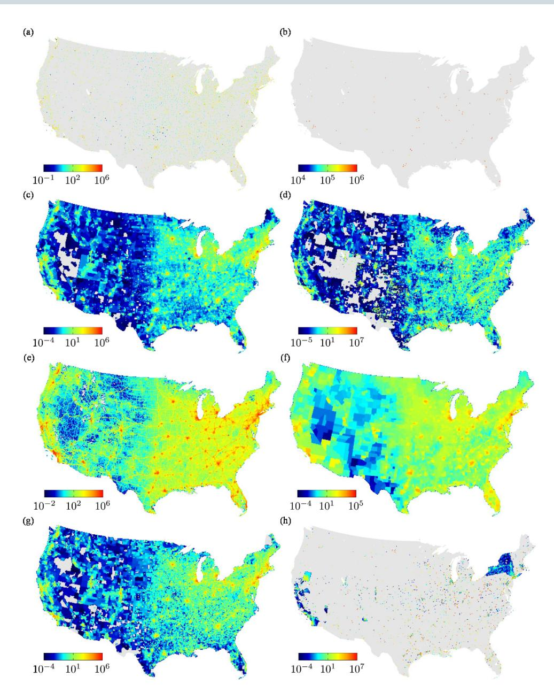

Figure 2 | The CO2 emissions maps in metric tonnes of carbon per year from Vulcan Project (VP) dataset23 for each sector: (a) Aircraft, (b) Cement, (c) Commercial, (d) Industrial, (e) On-road, (f) Non-road, (g) Residential and (h) Electricity.

non-parametric regression with bootstrapped 95% confidence bands30,31 (see Sec. 3). We find that the emissions grow with the size of the cities, on average, faster than the expected linear behavior. The result can be approximated over many orders of magnitudes by a power-law yielding the following allometric scaling law:

$$\log(\text{CO}_2) = A + \beta \log(\text{POP}), \tag{1}$$

where A = 2.05  $\pm$  0.12 and  $\beta$  = 1.38  $\pm$  0.03 ( $R^2$  = 0.76) is the allometric scaling exponent obtained from Ordinary Least Squares (OLS) analysis32 for this particular set of parameters  $\ell$  = 5 km and  $D^*$  = 1000 (see Sec. 3 for details on OLS and on the estimation of the exponent error, all emissions are measured in log base 10 of metric tonnes of carbon per year).

In addition, we investigate the robustness of the allometric exponent as a function of the thresholds  $D^*$  and  $\ell$ . Figure 5a shows  $\beta$  as a function of the cut-off length  $\ell$  for different values of population threshold  $D^*$  (1000, 2000, 3000, and 4000). We observe that  $\beta$ 

increases with  $\ell$  until a saturation value which is relatively independent of  $D^*$ . Performing an average of the exponent in the plateau region with  $\ell > 10$  km over  $D^*$ , we obtain  $\bar{\beta} = 1.46 \pm 0.02$ . Thus, we find superlinear allometry indicating an inefficient emissions law for cities: doubling the city population results in an average increment of 146% in  $\mathrm{CO}_2$  emissions, rather than the expected isometric 100%. This positive non-extensivity suggests that the high productivity found in larger cities3,4 is done at the expense of a disproportionally larger amount of emissions compared to small cities.

Figure 5b investigates the emissions of cities as deconstructed by different sectors and activities of the economy. We perform non-parametric regression with bootstrapped 95% confidence bands of  $\beta$  (see Fig. 6 for  $D^*=1000$  and  $\ell=5$  km by each sector) versus  $\ell$  and we find that the exponents for different sectors saturate to an approximate constant value for  $\ell>10$  km. We assign an average exponent,  $\bar{\beta}$  over the plateau per sector as seen in Table I. The sectors with higher exponents (less efficient) are Residential, Industrial, Commercial and Electric Production with  $\bar{\beta}{\approx}1.47-1.62$ , above

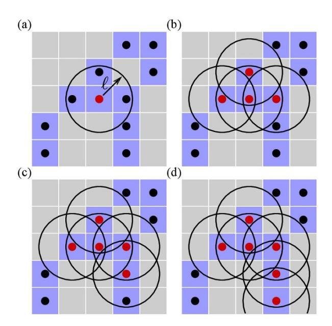

Figure 3 | CCA stages: We consider that if  $D_i > D^*$ , then the site i is populated (light blue squares). Each site is defined by its geometric center (black circles) and the length  $\ell$  represents a cutoff on the distance to define the nearest neighbor sites. We aggregate all nearest-neighbor sites, i.e. a CCA is defined by populated sites within a distance smaller than  $\ell$  (red circles).

the average for the total emissions. Onroad vehicles contribute with a superlinear exponent  $\bar{\beta}=1.42\pm0.03$ , yet, below the total average. The exponent for Nonroad vehicles is also below the average at  $\bar{\beta}=1.23\pm0.05$ , while Aircraft sector displays approximate isometric scaling with  $\bar{\beta}=1.05\pm0.01$ . Cement Production displays sublinear scaling  $\bar{\beta}=0.21\pm0.03$ , although the reported data is less significant than the rest with only 20 datapoints of cities available.

We further investigate the dependence of the allometric exponent  $\beta$  on the income per capita of cities by aggregating the CCA clusters by their income (INC) and plotting the obtained  $\beta$ (INC) in Fig. 7 (see also Fig. 8). We find an inverted U-shape relationship, which is analogous to the so-called environmental Kuznets curve (EKC)7,33,34. We observe that  $\beta$  initially increases for cities with low income per

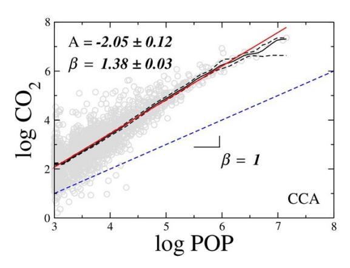

Figure 4 | Scaling of CO2 emissions versus population. We found a superlinear relation between CO2 (metric tonnes/year) and POP with the allometric scaling exponent  $\beta=1.38\pm0.03$  ( $R^2=0.76$ ) for the case  $\ell=5$  km,  $D^*=1000$ . The solid (black) line is the Nadaraya-Watson estimator, the dashed (black) lines are the lower and upper confidence interval, and the solid (red) line is the linear regression.

capita until an income turning point located at \$37,235 per capita (in 2000 US dollar). After the turning point,  $\beta$  decreases indicating an environmental improvement for large-income cities. However, the allometric exponent remains always larger than one regardless of the income level (except for the lowest income) indicating that almost all large cities are less efficient than small ones, no matter their income.

Comparison with MSA. A further important issue in the scaling of cities is the dependence on the way they are defined 15-18,20,21,35. Thus, it is of interest to compare our results with definitions based on administrative boundaries such as the commonly used Metropolitan Statistical Areas (MSA) provided by the US Census Bureau MSAs are constructed from administrative boundaries aggregating neighboring counties which are related socioeconomically via, for instance, large commuting patterns. A drawback is that MSAs are available only for a subset (274 cites) of the most populated cities in the US, and therefore can represent only the upper tail of the distribution 17,21,35 (see Sec. 3 for details).

Furthermore, we find that the MSA construction violates the expected extensivity3,17 between the land area occupied by the MSA

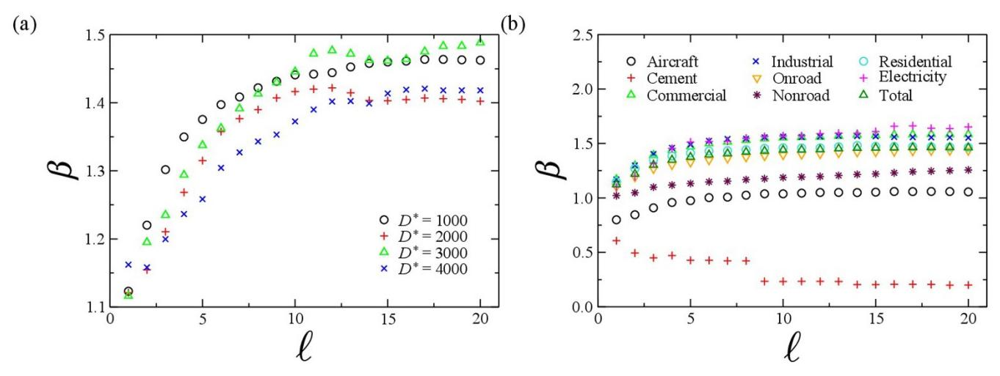

Figure 5 | Behavior of allometric exponent  $\beta$ . (a) We plot  $\beta$  for the total emissions for different  $D^*$  as a function of  $\ell$ . The exponent  $\beta$  increases with  $\ell$  until a saturation value. (b) Allometric exponent versus  $\ell$  for the different sectors of the economy as indicated. The scaling exponent ranges from sublinear behavior ( $\beta$  < 1, optimal) on the cement and aircraft sectors, to superlinear behavior ( $\beta$  > 1, suboptimal) on nonroad and onroad vehicles, and residential emissions, up to the less efficient sectors in commercial, industrial and electricity production activities.

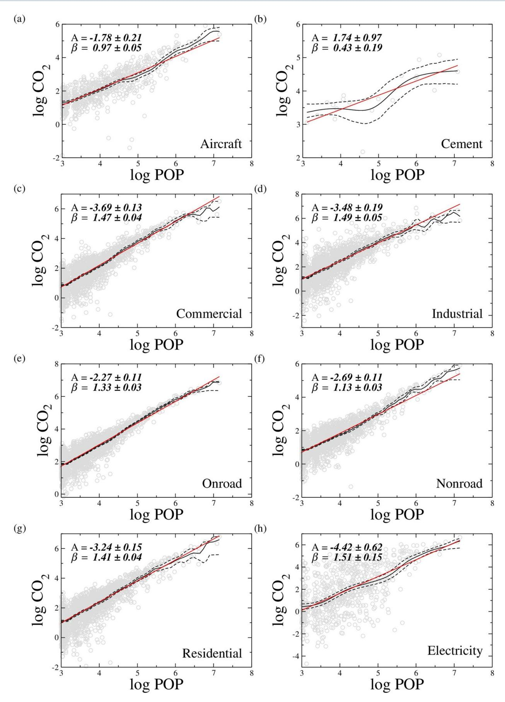

Figure 6 | The plot shows the CO2 behavior measured in metric tonnes of carbon per year versus POP of the CCA clusters for different sectors. We found a superlinear relation between CO2 and POP for all the cases, except to Aircraft and Cement sectors. The solid (black) line is the Nadaraya-Watson estimator, the dashed (black) lines are the lower and upper confidence interval, and the solid (red) line is the linear regression.

| Sector      | N    | ${\sf A}^\dagger$ | $\boldsymbol{\beta}^{\dagger}$ | <b>R</b> 2 † | $\bar{\beta}$   |
|-------------|------|-------------------|--------------------------------|-------------------------|-----------------|
| Cement      | 20   | 1.74 ± 0.97       | 0.43 ± 0.19                    | 0.55                    | 0.21 ± 0.03     |
| Aircraft    | 708  | $-1.78 \pm 0.21$  | $0.97 \pm 0.05$                | 0.67                    | $1.05 \pm 0.01$ |
| Nonroad     | 2281 | $-2.69 \pm 0.11$  | $1.13 \pm 0.03$                | 0.71                    | $1.23 \pm 0.05$ |
| Onroad      | 2281 | $-2.27 \pm 0.11$  | $1.33 \pm 0.03$                | 0.78                    | $1.42 \pm 0.03$ |
| Residential | 2280 | $-3.24 \pm 0.15$  | $1.41 \pm 0.04$                | 0.67                    | $1.47 \pm 0.02$ |
| Industrial  | 2276 | $-3.48 \pm 0.19$  | $1.49 \pm 0.05$                | 0.60                    | $1.56 \pm 0.01$ |
| Commercial  | 2281 | $-3.69 \pm 0.13$  | $1.47 \pm 0.04$                | 0.74                    | $1.58 \pm 0.02$ |
| Electricity | 678  | $-4.42 \pm 0.62$  | $1.51 \pm 0.15$                | 0.38                    | $1.62 \pm 0.08$ |
| Total       | 2281 | $-2.05 \pm 0.12$  | $1.38 \pm 0.03$                | 0.76                    | $1.46 \pm 0.02$ |

and their population since MSA overestimates the area of the small agglomerations17. This is indicated in Fig. 9, where we find the regression:

$$log(AREA_{MSA}) = a_{MSA} + b_{MSA} log(POP_{MSA}), \qquad (2)$$

with  $a_{MSA}=0.81\pm0.36$  and  $b_{MSA}=0.51\pm0.06$  ( $R^2=0.48$ ). This approximate square-root law implies that the density is not constant across the MSAs:

$$\rho_{\text{MSA}} \sim \text{POP}^{1/2}.$$
 (3)

On the contrary, CCA clusters capture precisely the occupied area of the agglomeration leading to the expected extensive relation between land area and population as seen also in Fig. 9:

$$\log(AREA_{CCA}) = a_{CCA} + b_{CCA}\log(POP_{CCA}), \tag{4}$$

with  $a_{CCA} = -2.86 \pm 0.06$  and  $b_{CCA} = 0.94 \pm 0.01$ , with small dispersion  $R^2 = 0.99$ , implying that the density of population of CCA clusters is well-defined (extensive), *i.e.* it is constant across population sizes,

$$\rho_{\rm CCA} \sim {\rm const.}$$
 (5)

In summary, while the CCA displays almost isometric relation between population and area, the MSA shows a sublinear scaling

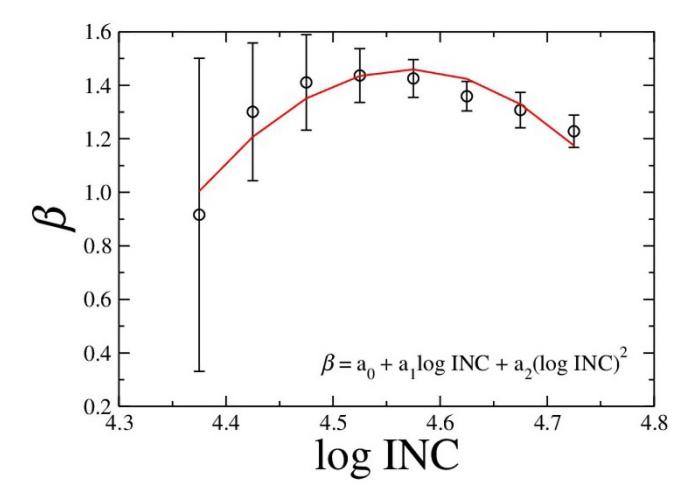

Figure 7 | Dependence of allometric exponent  $\beta$  on the income per capita of the CCA clusters. We found an inverted-U-shaped curve similar to an environmental Kuznets curve (EKC). In other words, we find a decrease of the allometric exponent  $\beta$  for the lower and higher income levels, with the following regression coefficients  $a_0 = -247.35$ ,  $a_1 = 108.88$  and  $a_2 = -11.91$ . The income turning point is located at  $10^{-a_1/(2a_2)} = US \$ 37,235$ .

between these two measures. As a consequence, the emission of CCA is independent of the population density, as expected. On the other hand, from Eq. 2 and Eq. 6, the MSA leads to a superlinear scaling between them,  $\text{CO}_2 \sim \rho_{\text{MSA}}^{1.88}$ .

The non-extensive character of the MSA areas is due to the fact that many MSAs are constituted by aggregating small disconnected clusters resulting in large unpopulated areas inside the MSA. This is exemplified in some typical MSAs plotted in Fig. 10, such as Las Vegas, Albuquerque, Flagstaff and others. The plots show that a large MSA area is associated to a series of disconnected small counties, like it is seen, for instance, in the region near Las Vegas. This clustering of disconnected small cities inside a MSA results into an overestimation of the emissions associated with the Las Vegas MSA, for instance. The same pattern is verified for many small cities, specially in the mid-west of US, as seen in the other panels. For some large cities, like NY, the agglomeration captures similar shapes as in the occupied areas obtained with CCA, although it is also clearly seen that the area of the NY MSA contains many unoccupied regions. Therefore, the occupied area of a typical MSA is overestimated in comparison to the area that is actually populated as captured by the CCA, the bias is larger for small cities than larger ones. This endogeneity bias leads to an overestimation of the CO2 emissions of the small cities as compared to large cities. Consequently, we find a smaller allometric exponent for MSA than CCA with an almost extensive relation:

$$\log(\text{CO}_2) = A_{\text{MSA}} + \beta_{\text{MSA}} \log(\text{POP}), \tag{6}$$

with  $A_{MSA} = 1.08 \pm 0.38$  and  $\beta_{MSA} = 0.92 \pm 0.07$  ( $R^2 = 0.71$ , see Fig. 11). This result is consistent with previous studies of scaling emissions of MSA by Fragkias *et al.*36, who used MSAs and found a linear scaling between emissions and size of the cities, and also Rybski *et al.*38, who used administrative boundaries to define 256 cities in 33 countries. Table II and III summarize the results of CCA and MSA cities.

Thus, the measurement bias in the MSAs leads to smaller  $\beta$  found for MSA as compared with CCA, since low-density MSAs have relatively large areas. Hence, the CCA results, which are not subject to that endogeneity bias, should be considered the main source of information on emissions. They show a positive link between emissions and population size as well as the expected extensive behavior of the occupied land. This analysis calls the attention to use the proper definition of cities when the scaling behavior of small cities needs to be accurately represented. Indeed, this issue arises in the controversy regarding the distribution of city size for small cities since the distribution of administrative cities (such as US Places) are found broadly lognormal (that is, a power law in the tail that deviates into a log-Gaussian for small cities)21,39–42, while the distribution of geography-based agglomerations like CCA is found to be Zipf distributed along all cities (power-law for all cities)13–18,20.

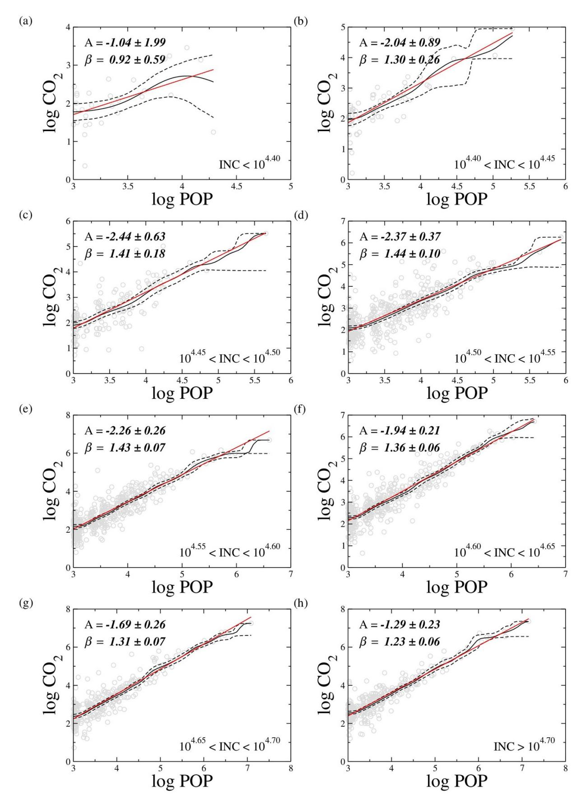

Figure 8 | Total CO2 emissions in metric tonnes of carbon per year versus POP of CCA clusters for different income's range as indicated. We found a superlinear relation between CO2 and POP for all the cases except for the lowest income below \$ 25, 119. The solid (black) line is the Nadaraya-Watson estimator, the dashed (black) lines are the lower and upper confidence interval, and the solid (red) line is the linear regression. The resulting exponent b(INC) is plotted in Fig. 7.

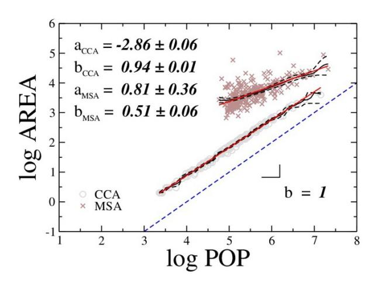

Figure 9 | Scaling of the occupied land area versus population for MSAs and CCA clusters. Two problems are evident from this comparison. First, the range of population obtained by MSA is two decades smaller than that of CCA since CCA captures all city sizes while MSA is defined only for the top 274 cities. Second, the MSA violates the extensivity between land area and population while CCA does not. This is due to the fact that MSA agglomerates together many small cities into a single administrative boundary with a large area which can be largely unpopulated, as can be see in the examples of Fig. 10. This results in an overestimation of the size of the areas of small cities compared with large cities, resulting in the violation of extensivity shown in the figure. This endogenous bias is absent in the CCA definition. This bias in the small cities ultimately affects the allometric exponent yielding a bMSA smaller than the one obtained using the CCAs.

#### Discussion

In general, we expect that when the scaling obtained by CCA is extensive, then any agglomeration of CCA such as MSA, should give rise to extensive scaling too. However, when there are intrinsic longrange spatial correlations in the data (like in non-extensive systems with b ? 1), agglomerating populated clusters (as done with MSA) may give different allometric exponents depending on the particular administrative boundary used to define cities. It is of interest to note that, beyond MSA36, there are other administrative boundaries used in the literature to define cities, like for instance US-Places studied in39–41. This measurement bias is a generic property of any nonextensive system, such as a physical system at a critical point. Thus, scaling laws obtained using administrative boundaries to define cities which cluster data in a somehow arbitrary manner may need to be taken with caution.

In summary, we find that CCA urban clusters in the US have suboptimal CO2 emissions as measured by a superlinear allometric exponent b . 1. The exponent b decreases for cities with low and high income per capita in agreement with an EKC hypothesis7 . From the point of view of allometry, larger cities may not represent an improvement of CO2 emissions as compared with smaller cities.

#### Methods

Population dataset. The United States population dataset for the year 2000 is a part of the Global Rural-Urban Mapping Project (GRUMPv1). The GRUMPv1 is available in shapefile format on the Latitude-Longitude projection (Fig. 12a) and it was developed by the International Earth Science Information Network (CIESIN) in collaboration with the International Food Policy Research Institute (IFPRI), the World Bank, and the Centro Internacional de Agricultura Tropical (CIAT)22 (Fig. 1a). The GRUMPv1 combines data from administrative units and urban areas by applying a massconserving algorithm named Global Rural Urban Mapping Programme (GRUMPe) that reallocates people into urban areas, within each administrative unit, while reflecting the United Nations (UN) national rural-urban percentage estimates as closely as possible22. The administrative units (more than 70, 000 units with population . 1, 000 inhabitants) are based on population census data and their

administrative boundaries. The urban areas (more than 27, 500 areas with population . 5, 000 inhabitants) are based on night-time lights data from the National Oceanic and Atmospheric Administration (NOAA) and buffered settlement centroids (in the cases where night lights are not sufficiently bright). In order to provide a higher resolution gridded population data (30 arc-second, equivalent to a grid of 0.926 km 3 0.926 km at the Equator line), the GRUMPv1 assumes that the population density of the administrative units are constant and the population of each site is proportional to the administrative unit areas located inside of that site. We exported the original data to the ASCII format on Lambert Conformal Conic projection (Fig. 12b), available to download at<http://jamlab.org>. Both projections parameters are defined as follow:

> Projection name: Latitude–Longitude (LL) Horizontal datum name: WGS84 Ellipsoid name: WGS84 Semi-major axis: 6378137 Denominator of flattening ratio: 298.257224

Projection name: Lambert Conformal Conic (LCC) Standard parallels: 33, 45 Central meridian: –97 Latitude of projection origin: 40 False easting: 0 False northing: 0 Geographic coordinate system: NAD83

Emissions dataset. The second dataset used in this study is the annual mean of the United States fossil fuel carbon dioxide emissions with the grid of 10 km 3 10 km for the year 2002. Full documentation is available at [http://vulcan.project.asu.edu/pdf/](http://vulcan.project.asu.edu/pdf/Vulcan.documentation.v2.0.online.pdf) [Vulcan.documentation.v2.0.online.pdf](http://vulcan.project.asu.edu/pdf/Vulcan.documentation.v2.0.online.pdf). This dataset was compiled by the Vulcan Project (VP) and it is already available in binary format on the Lambert Conformal Conic projection defined above. The VP was developed by the School of Life Science at Arizona State University in collaboration with investigators at Colorado State University and Lawrence Berkeley National Laboratory23. The VP dataset is created from five primary datasets, constituting eight data types: The National Emissions Inventory (NEI) containing the Non-road data (county-level aggregation of mobile surface sources that do not travel on roadways such as boats, trains, ATVs, snowmobiles, etc), the Non-point data (county-level aggregation of non-geocoded sources), the Point data (non electricity-producing sources identified as a specific geocoded location) and the Airport data (geolocated sources associated with taxi, takeoff, and landing cycles associated with air travel); The Emissions Tracking System/Continuous Emissions Monitoring (ETS/CEM) containing the Electricity production data (geolocated sources associated with the production of electricity); The National Mobile Inventory Model (NMIM) containing the On-road data (county-level aggregation of mobile road-based sources such as automobiles, buses, and motorcycles); The Aero2k containing the Aircraft data (gridded sources associated with the airborne component of air travel), and finally, the Portland Cement containing the cement production data (geolocated sources associated with cement production).

These data types supply the CO2 emissions sectors: Aircraft, Cement, Commercial, Industrial, Non-road, On-road, Residential, and Electricity. In order to represent all the sectors in a 10 km 3 10 km grid, the VP assumes that the CO2 emissions of each site is given by the contributions of the geocoded and non-geocoded (via areaweighted proportions) sources located inside of that site. We exported the original data to the ASCII format, available to download at [http://lev.ccny.cuny.edu/](http://lev.ccny.cuny.edu) ,hmakse/soft\_data (Fig. 1b and Fig. 2).

Income per capita dataset. We also use the US income dataset available in ASCII format by US Census Bureau24 for the year 2000. This dataset provides the mean household income per capita for the 3, 092 US counties. For each county, we combined the income data and the administrative boundaries (Fig. 1c) in order to relate them with the geolocated datasets. The US county boundaries are also available to download in ASCII format by the US Census Bureau25. However, we already joined these datasets and provided them to download at [http://lev.ccny.cuny.edu/](http://lev.ccny.cuny.edu),hmakse/ soft\_data.

Superimposing the datasets. We superimposed the population and CO2 datasets on the Lambert Conformal Conic projection in order to estimate the CO2 emissions on a higher grid level (0.926 km 3 0.926 km). We checked if each population site is inside of a CO2 site. If so, we assigned the CO2 value as proportional to its area (0.9262 km2 ), considering that the CO2 density is constant in each CO2 site. For the population and income datasets, we checked if each population site (actually, the center of mass) is inside of some US county boundary. If so, we assigned the income value for that site equal to the income value for the county. We performed this test taking into account that a horizontal line (in the polygon direction), starting in a point that is inside of a polygon, hits on it an odd number of times, while a point that is outside of the polygon, hits on it an even number of times.

MSA. The definitions of Metropolitan Statistical Area (MSA), Primary Metropolitan Statistical Area (PMSA) and Consolidated Metropolitan Statistical Area (CMSA) are

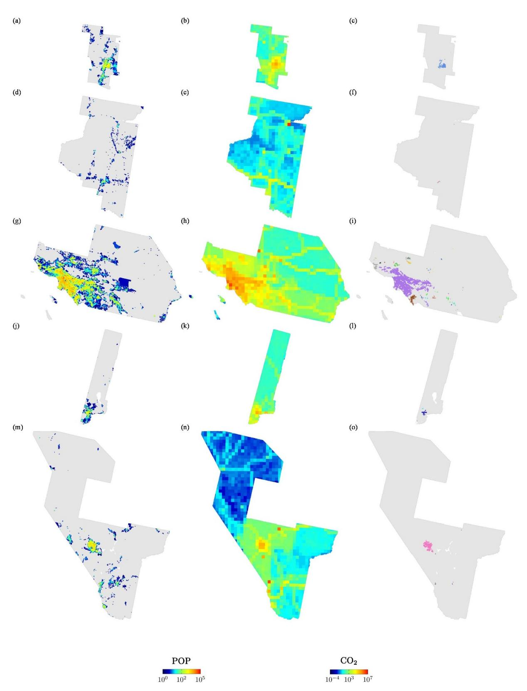

Figure 10 | Examples of MSA and CMSA combining the datasets from Global Rural-Urban Mapping Project (GRUMPv1), Vulcan Project (VP) and US Census Bureau22,23,37: (a)–(c) MSA of Albuquerque (Albuquerque, NM); (d)–(f) MSA of Flagstaff (Flagstaff, AZ–UT); (g)–(i) CMSA of Los Angeles (Los Angeles–Riverside–Orange County, CA); (j)–(l) MSA of Reno (Reno, NV); and (m)–(o) MSA of Las Vegas (Las Vegas, NV–AZ). In the first column, we plot the population as given by the GRUMPv1 dataset inside the administrative boundary of the MSA as provided by the US Census Bureau. The grey regions show the large unpopulated areas considered inside the MSA. The large MSA areas thus put together different populated clusters into one large administrative boundary. In the second column we plot the CO2 emissions dataset inside the boundary of each MSA. The population and the CO2 emissions are plotted in logarithmic scale according to the color bar at the bottom of the plot. In the third column, we plot the CCA clusters inside the corresponding MSA. Different from the MSA, the CCA captures the contiguous occupied area of a city.

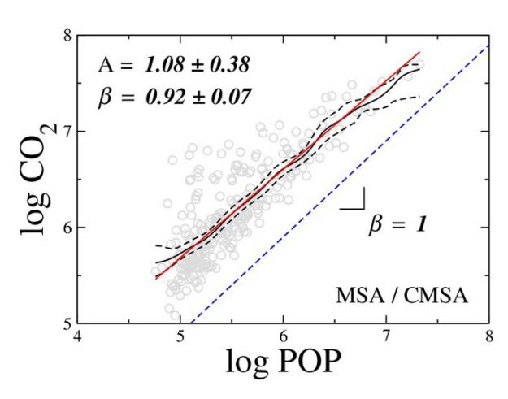

Figure 11 | CO2 emissions in metric tonnes/year versus POP using the MSA/CMSA definition of cities for the total CO2 emissions. We found almost extensive relation between CO2 and POP with the allometric scaling exponent  $\beta_{\rm MSA} = 0.92 \pm 0.07$  ( $R^2 = 0.71$ ) The solid (black) line is the Nadaraya-Watson estimator, the dashed (black) lines are the lower and upper confidence interval, and the solid (red) line is the linear regression.

provided by the US Census Bureau37. The MSAs are geographic entities defined by some counties socioeconomically related with population larger than 50, 000. The PMSAs are analogous to MSAs, however they are defined by just one or two counties also socioeconomically related with population larger than 1, 000, 000. Finally, the CMSA are large metropolitan region defined by some PMSAs close to each other. In order to set a relation between the definition of MSA/CMSA cities and CCA cities, we show the 15 most populated MSA/CMSA cities and the largest CCA cities associated to them in Table I and II. The largest CCA city associated to a given MSA/CMSA is defined by the most populated CCA city whose center of mass is inside of that MSA/CMSA boundary. All datasets are available to download from 37, including the population and administrative boundaries of MSA/CMSA. Additionally, we make them available at http://lev.ccny.cuny.edu/~hmakse/soft\_data.

**Nadaraya-Watson method.** In order to calculate the allometric scaling exponents, we performed well-known statistic methods31. For one data distribution  $\{X_i, Y_i\}$ , we apply the Nadaraya-Watson method43,44 to construct the kernel smoother function,

$$\hat{m}_h(x) = \frac{\sum_{i=1}^{N} K_h(x - X_i) Y_i}{\sum_{i=1}^{N} K_h(x - X_i)},$$
(7)

where *N* is the number of points and  $K_h(x - X_i)$  is a Gaussian kernel of the form,

$$K_h(x-X_i) = \exp\left[\frac{(x-X_i)^2}{2h^2}\right],$$
 (8)

where the h is the bandwidth estimated by least squares cross-validation method  $^{45,46}$ .

Table II | Population ranking of the top 15 CCA cities for  $D^*=1000$  inhabitants and  $\ell=5$  km. The total number of cities for these parameters is N=2281. The areas are given in  $km^2$ , the incomes per capita are given in US\$ and the CO $_2$  emissions are given in metric tonnes/year

| CCA city      | Population         | Area           | Income | CO 2 |
|---------------|--------------------|----------------|--------|-----------------|
| New York      | 14,203,323         | 3,963          | 54,219 | 22,656,248      |
| Los Angeles   | 12,248,239         | 4,730          | 44,935 | 17,890,252      |
| Chicago       | 5,989,209          | 2,716          | 50,454 | 13,180,388      |
| San Francisco | 4,135,709          | 1,604          | 66,141 | 3,628,217       |
| Miami         | 4,041,311          | 2,029          | 38,430 | 4,851,895       |
| Washington    | 3,981,576          | 2,077          | 61,052 | 6,689,123       |
| Philadelphia  | 3,1 <i>47,77</i> 9 | 1,408          | 48,568 | 6,350,115       |
| Dallas        | 2,987,071          | 1 <i>,</i> 797 | 49,563 | 4,225,519       |
| Houston       | 2,670,156          | 1,520          | 43,497 | 5,104,114       |
| Detroit       | 2,534,128          | 1,578          | 47,915 | 6,038,681       |
| Phoenix       | 2,221,393          | 1,295          | 46,914 | 2,616,811       |
| Boston        | 1,838,516          | 760            | 55,055 | 3,161,289       |
| San Diego     | 1,620,953          | 744            | 48,104 | 1,881,183       |
| Denver        | 1,539,876          | 958            | 53,282 | 3,294,302       |
| Seattle       | 1,176,431          | <i>7</i> 52    | 54,636 | 1,872,446       |

We compute the 95% ( $\alpha=0.05$ ) confidence interval (CI) by the so-called  $\alpha/2$  quantile function over 500 random bootstrapping samples with replacement.

For our case, the distribution is the set of values  $\{X_i, Y_i\} = \{\log(\text{POP}_i), \log(\text{CO}_{2i})\}$ , where i is from 1 to the number of CCA cities N. Furthermore, we calculate the exponents by the ordinary least square (OLS) method47. Let us to consider the terms,

$$S_x = \sum_{i=1}^N X_i,\tag{9}$$

$$S_y = \sum_{i=1}^{N} Y_i, \tag{10}$$

$$S_{xx} = \sum_{i=1}^{N} X_i^2, \tag{11}$$

$$S_{xy} = \sum_{i=1}^{N} X_i Y_i,$$
 (12)

$$t_i = \left(X_i - \frac{S_x}{N}\right)$$
, and (13)

Table III | Population ranking of the top 15 MSA/CMSA cities and the associated CCA (†) for  $D^* = 1000$  inhabitants and  $\ell = 5$  km. The areas are given in  $km^2$  and the CO2 emissions are given in metric tonnes/year

| MSA/CMSA city | Population | Area            | $CO_2$     | Population † | Area † | $\mathrm{CO}_2^\dagger$ |
|---------------|------------|-----------------|------------|-------------------------|-------------------|-------------------------|
| New York      | 21,199,865 | 28,752          | 49,533,908 | 14,203,323              | 3,963             | 22,656,248              |
| Los Angeles   | 16,373,645 | 88,092          | 36,896,108 | 12,248,239              | 4,730             | 17,890,252              |
| Chicago       | 9,157,540  | 18,012          | 32,759,994 | 5,989,209               | 2,716             | 13,180,388              |
| Washington    | 7,608,070  | 25,304          | 26,035,616 | 3,981,576               | 2,077             | 6,689,123               |
| San Francisco | 7,039,362  | 19,462          | 15,969,389 | 4,135,709               | 207               | 379,911                 |
| Philadelphia  | 6,188,463  | 1 <i>5,</i> 788 | 18,462,316 | 3,147,779               | 1,408             | 6,350,115               |
| Boston        | 5,819,100  | 15,086          | 18,684,998 | 1,838,516               | 760               | 3,161,289               |
| Detroit       | 5,456,428  | 17,269          | 16,959,726 | 2,534,128               | 1,578             | 6,038,681               |
| Dallas        | 5,221,801  | 24,575          | 15,802,243 | 2,987,071               | 1 <i>,</i> 797    | 4,225,519               |
| Houston       | 4,669,571  | 21,105          | 30,483,362 | 2,670,156               | 1,520             | 5,104,114               |
| Atlanta       | 4,112,198  | 16,064          | 22,936,928 | 1,021,846               | 697               | 2,204,638               |
| Miami         | 3,876,380  | 8,748           | 6,824,965  | 4,041,311               | 2,029             | 4,851,895               |
| Seattle       | 3,554,760  | 19,834          | 10,489,945 | 1,176,431               | 752               | 1,872,446               |
| Phoenix       | 3,251,876  | 37,800          | 7,594,759  | 2,221,393               | 1,295             | 2,616,811               |
| Minneapolis   | 2,968,806  | 16,485          | 23,292,798 | 1,053,751               | 674               | 5,438,483               |

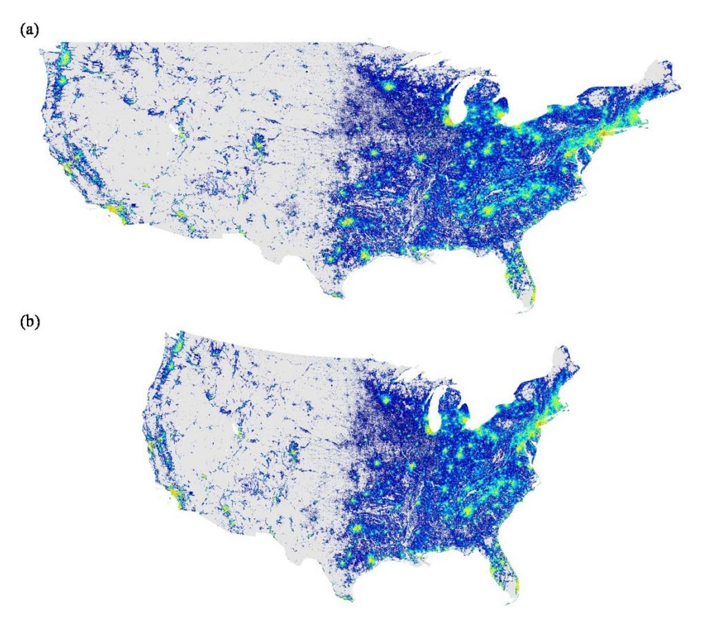

Figure 12 | The map projections from Global Rural-Urban Mapping Project (GRUMPv1)22. (a) Latitude-Longitude projection and (b) Lambert Conformal Conic projection of the population map of continental US.

$$S_{tt} = \sum_{i=1}^{N} t_i^2. (14)$$

The regression exponents (A and  $\beta$  in the equation  $Y = A + \beta X$ ) are given by,

$$\beta = \frac{1}{S_{tt}} \sum_{i=1}^{N} t_i Y_i \text{ and } A = \frac{S_y - \beta S_x}{N}.$$
 (15)

If the errors are normally and independently distributed, the standard error of each exponent is given by32,

s.e.(A) = 
$$t_{\alpha/2,N-2} \frac{\sigma_A}{N-2}$$
 and s.e.( $\beta$ ) =  $t_{\alpha/2,N-2} \frac{\sigma_{\beta}}{N-2}$ , (16)

where  $t_{\alpha/2,N-2}$  is the Student-t distribution with  $\alpha/2=0.025$  of CI and N-2 degrees of freedom, and the variances  $\sigma_A$  and  $\sigma_B$  are given by,

$$\sigma_A = \sqrt{\frac{1}{N} \left( 1 + \frac{S_L^2}{N S_H} \right)}$$
 and  $\sigma_\beta = \sqrt{\frac{1}{S_H}}$ . (17)

Finally, we show the value of the regression exponents as,

$$A \pm s.e.(A)$$
 and  $\beta \pm s.e.(\beta)$ . (18)

R-squared. The  $R^2$  is the coefficient of determination or R-squared and is calculated as following:

$$R^{2} = 1 - \frac{\sum_{i=1}^{N} \left[ Y_{i} - (A + \beta X_{i}) \right]^{2}}{\sum_{i=1}^{N} \left[ Y_{i} - (N^{-1} \sum_{i=1}^{N} Y_{i}) \right]^{2}}$$
(19)

The  $R^2$  by emission sector and the average  $\bar{\beta}$  are in Table I.

- Huxley, J. S. & Tessier, G. Terminology of relative growth. Nature 137, 780–781 (1936).
- Kleiber, M. The fire of life: An introduction to animal energetic (John Wiley, New York, 1961).
- Bettencourt, L. M. A., Lobo, J., Helbing, D., Kühnert, C. & West, G. B. Growth, innovation, scaling, and the pace of life in cities. *Proc. Natl. Acad. Sci. USA* 104, 7301–7306 (2007).
- Bettencourt, L. M. A. & West, G. B. A unified theory of urban living. Nature 467, 912–913 (2010).
- Bettencourt, L. M. A., Lobo, J., Strumsky, D. & West, G. B. Urban scaling and its deviations: Revealing the structure of wealth, innovation and crime across cities. *PLoS One* 5, e13541 (2010).
- Bento, A. M., Franco, S. F. & Kaffine, D. The efficiency and distributional impacts of alternative anti-sprawl policies. *J. Urban Econ.* 59, 121–141 (2006).
- 7. Kahn, M. E. *Green cities: Urban growth and the environment* (Brookings Institution Press, Michigan, 2006).
- 8. Brownstone, D. & Golob, T. F. The impact of residential density on vehicle usage and energy consumption. *J. Urban Econ.* **65**, 91–98 (2009).
- Dodman, D. Blaming cities for climate change? An analysis of urban greenhouse gas emissions inventories. *Environ. Urban.* 21, 185–201 (2009).
- Puga, D. The magnitude and causes of agglomeration economies. J. Regional Sci. 50, 203–219 (2010).
- Glaeser, E. L. & Kahn, M. E. The greenness of cities: Carbon dioxide emissions and urban development. J. Urban Econ. 67, 404–418 (2010).
- Gaigné, D., Riou, S. & Thisse, J. F. Are compact cities environmentally friendly? J. Urban Econ. 72, 123–136 (2012).
- 13. Makse, H. A., Havlin, S. & Stanley, H. E. Modeling urban growth patterns. Nature 377, 608–612 (1995).
- Makse, H. A., Andrade, J. S., Batty, M., Havlin, S. & Stanley, H. E. Modeling urban growth patterns with correlated percolation. *Phys. Rev. E* 58, 7054 (1998).
- Rozenfeld, H. D. et al. Laws of population growth. Proc. Natl. Acad. Sci. USA 105, 18702–18707 (2008).
- Giesen, K., Zimmermann, A. & Suedekum, J. The size distribution across all cities Double Pareto lognormal strikes. J. Urban Econ. 68, 129–137 (2010).
- Rozenfeld, H. D., Rybski, D., Gabaix, X. & Makse, H. A. The area and population of cities: new insights from a different perspective on cities. *Am. Econ. Rev.* 101, 2205–2225 (2011).

- 18. Duranton, G. & Puga, D. The growth of cities (Work in progress, University of Toronto, 2012).
- 19. Gallos, L. K., Barttfeld, P., Havlin, S., Sigman, M. & Makse, H. A. Collective behavior in the spatial spreading of obesity. Sci. Rep. 2, 454 (2012).
- 20. Duranton, G. Delineating metropolitan areas: Measuring spatial labour market networks through commuting patterns (Processed, Wharton School, University of Pennsylvania, 2013).
- 21. Ioannides, Y. M. & Skouras, S. Gibrat's law for (all) cities: A rejoinder (2009). Accessed 30-01-2014. [http://ase.tufts.edu/econ/research/documents/2009/](http://ase.tufts.edu/econ/research/documents/2009/ioannidesGibratsLaw.pdf) [ioannidesGibratsLaw.pdf](http://ase.tufts.edu/econ/research/documents/2009/ioannidesGibratsLaw.pdf); Ioannides, Y. & Skouras, S. US city size distribution: Robustly Pareto, but only in the tail J. Urban Econ. 73, 18–29 (2013).
- 22. Center for International Earth Science Information Network (CIESIN)/Columbia University, International Food Policy Research Institute (IFPRI), TheWorld Bank & Centro Internacional de Agricultura Tropical (CIAT). Global Rural-Urban Mapping Project Version 1 (2011). Accessed 18-07-2013. [http://sedac.ciesin.](http://sedac.ciesin.columbia.edu) [columbia.edu.](http://sedac.ciesin.columbia.edu)
- 23. Vulcan Project. School of Life Science, Arizona State University (2013). Accessed 18-07-2013. [http://vulcan.project.asu.edu.](http://vulcan.project.asu.edu)
- 24. U.S. Census Bureau. Small Area Income and Poverty Estimates (2013). Accessed 18-07-2013. [http://www.census.gov.](http://www.census.gov)
- 25. U.S. Census Bureau. Cartographic Boundary Files (2013). Accessed 18-07-2013. <http://www.census.gov>.
- 26. Gabaix, X. Zipf's law for cities: An explanation. Q. J. Econ. 114, 738–767 (1999).
- 27. Ioannides, Y. M. & Overman, H. G. Zipf's law for cities: An empirical examination. Reg. Sci. Urban. Econ. 33, 127–137 (2003).
- 28. Giesen, K. & Suedekum, J. Zipf's Law for Cities in the Regions and the Country. Econ. Geogr. 11, 667–686 (2011).
- 29. Giesen, K. & Suedekum, J. The French Overall City Size Distribution (2012). 30- 01-2014. [http://region-developpement.univ-tln.fr/fr/pdf/R36/6\\_GiesenSudekum.](http://region-developpement.univ-tln.fr/fr/pdf/R36/6_GiesenSudekum.pdf) [pdf](http://region-developpement.univ-tln.fr/fr/pdf/R36/6_GiesenSudekum.pdf).
- 30. Silverman, B. W. Density estimation for statistics and data analysis (Chapman and Hall, New York, 1986).
- 31. Hardle, W. Applied nonparametric regression (Cambridge University Press, Cambridge, 1990).
- 32. Montgomery, D. C., Peck, E. A. & Vining, G. G. Introduction to linear regression analysis (Wiley, Sons, New York, 2006).
- 33. Kuznets, S. Economic growth and income inequality. Am. Econ. Rev. 45, 1–28 (1955).
- 34. Grossman, G. M. & Krueger, A. B. Economic growth and the environment. Q. J. Econ. 110, 353–378 (1995).
- 35. Krugman, P. R. The self organizing economy (Blackwell Publishers, Cambridge, 1996).
- 36. Fragkias, M., Lobo, J., Strumsky, D. & Seto, K. C. Does size matter? Scaling of CO2 emissions and U.S. urban areas. PLoS One 8, e64727 (2013).

- 37. U.S. Census Bureau. Pre-2010 Cartographic Boundary File Naming Conventions and Download Access (2013). Accessed 18-07-2013. [http://www.census.gov.](http://www.census.gov)
- 38. Rybski, D., Sterzel, T., Reusser, D. E., Fichtner, C. & Kropp, J. P. Cities as nuclei of sustainability? (2013). Accessed 19-11-2013. [http://arxiv.org/abs/1304.4406.](http://arxiv.org/abs/1304.4406)
- 39. Eeckhout, J. Gibrat's law for (All) cities. Am. Econ. Rev. 94, 1429–1451 (2004).
- 40. Levy, M. Gibrat's law for (all) cities: Comment. Am. Econ. Rev. 99, 1672–1675 (2009).
- 41. Eeckhout, J. Gibrat's law for (all) cities: Reply. Am. Econ. Rev. 99, 1676–1683 (2009).
- 42. Glaeser, E. L. Agglomeration Economics (University of Chicago Press, Chicago, 2010).
- 43. Nadaraya, E. On estimating regression. Theor. Probab. Appl. 9, 141–142 (1964).
- 44. Watson, G. S. Smooth regression analysis. Sankhya Ser. A 26, 359–372 (1964).
- 45. Racine, J. & Li, Q. Nonparametric estimation of regression functions with both categorical and continuous data. J. Econometrics 119, 99–130 (2004).
- 46. Li, Q. & Racine, J. Cross-validated local linear nonparametric regression. Stat. Sinica 14, 485–512 (2004).
- 47. Press, W. H., Teukolsky, S. A., Vetterling, W. T. & Flannery, B. P. Numerical recipes: The art of scientific computing (Cambridge University Press, New York, 2007).

### Acknowledgments

We gratefully acknowledge funding by NSF, CNPq, CAPES and FUNCAP. We also thank the US Census Bureau, Global Rural-Urban Mapping Project and Vulcan Project teams for the datasets provided. Furthermore, we would like to thank X. Gabaix and S. Alarcon for helpful discussions.

## Author contributions

E.A.O., J.S.A. and H.A.M. designed research, performed research, and wrote the manuscripts.

### Additional information

Competing financial interests: The authors declare no competing financial interests.

How to cite this article: Oliveira, E.A., Andrade, J.S. & Makse, H.A. Large cities are less green. Sci. Rep. 4, 4235; DOI:10.1038/srep04235 (2014).

This work is licensed under a Creative Commons Attribution-

NonCommercial-NoDerivs 3.0 Unported license. To view a copy of this license, visit<http://creativecommons.org/licenses/by-nc-nd/3.0>

DOI: 10.1038/srep08652

SUBJECT AREAS:

CORRIGENDUM: Large cities are less green

STATISTICS

Erneson A. Oliveira, Jose´ S. Andrade Jr. & Herna´n A. Makse

COMPLEX NETWORKS

SCIENTIFIC REPORTS:

4 : 4235 DOI: 10.1038/srep04235

This Article contains an error in the third line of the introduction: ''surface area'' should read ''metabolic rate''.

Published online 28 February 2014

> Updated: 4 March 2015

(2014)