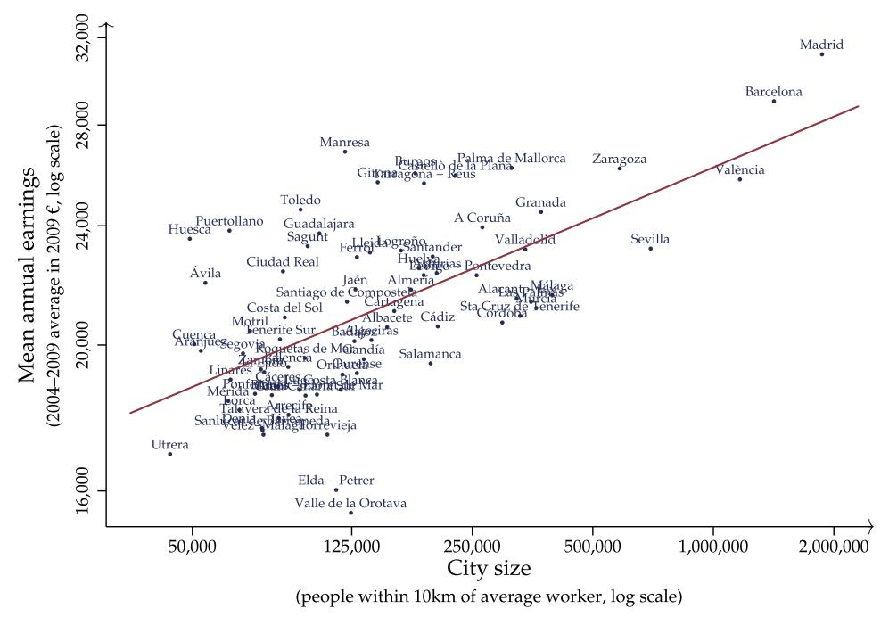
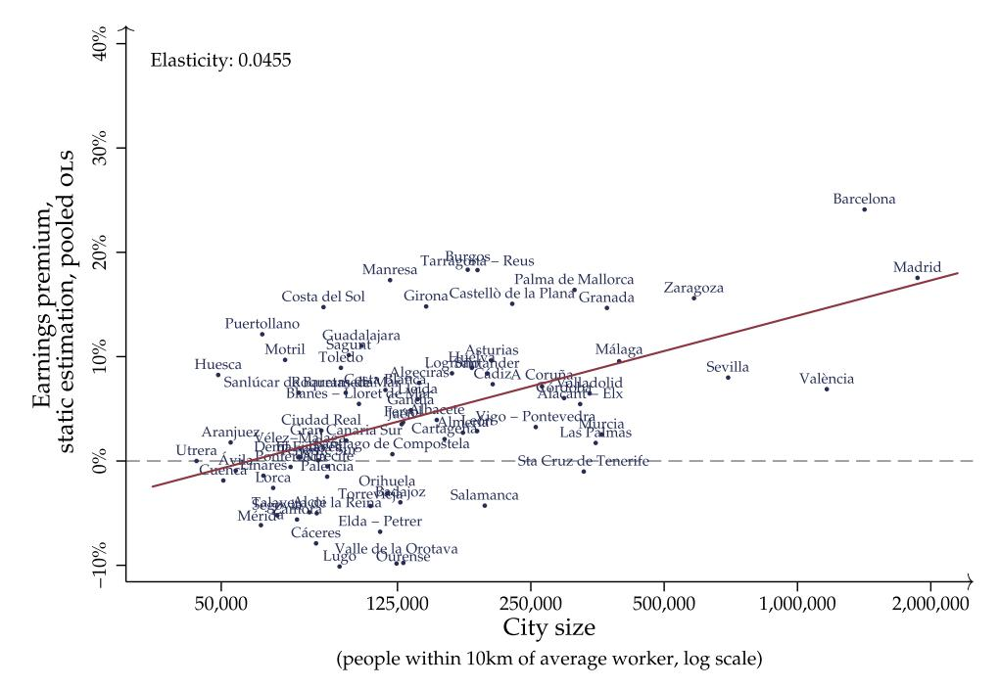
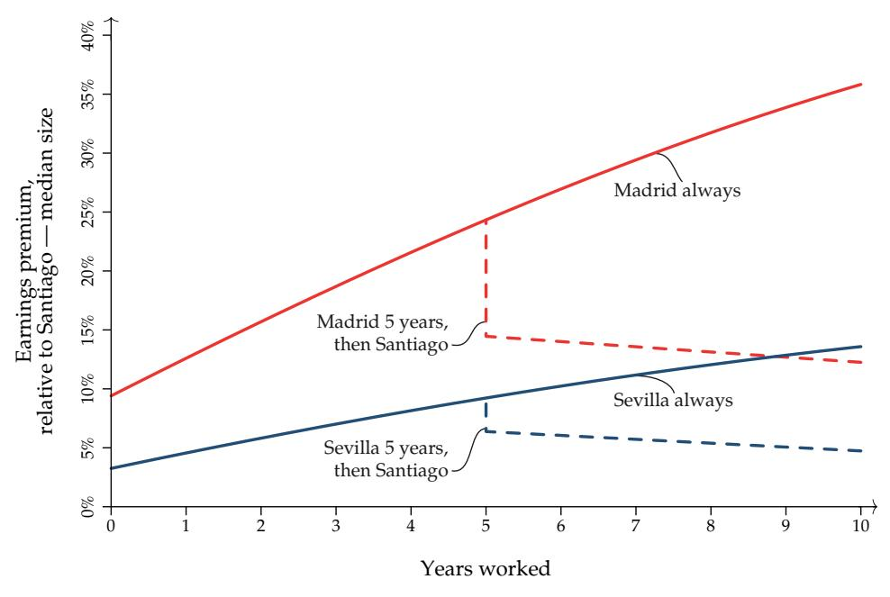
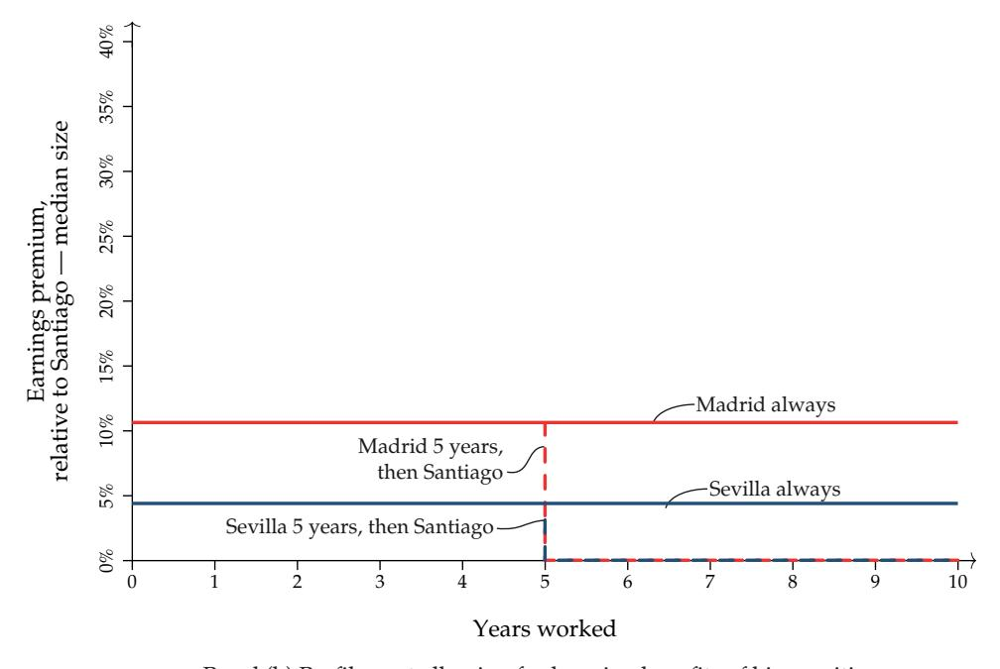
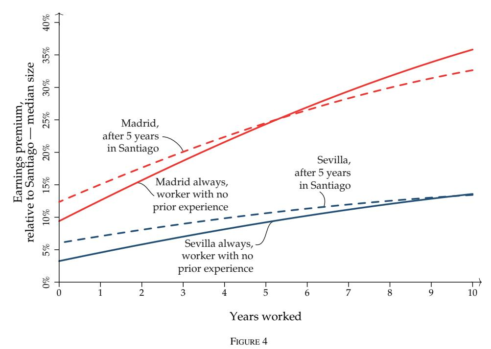
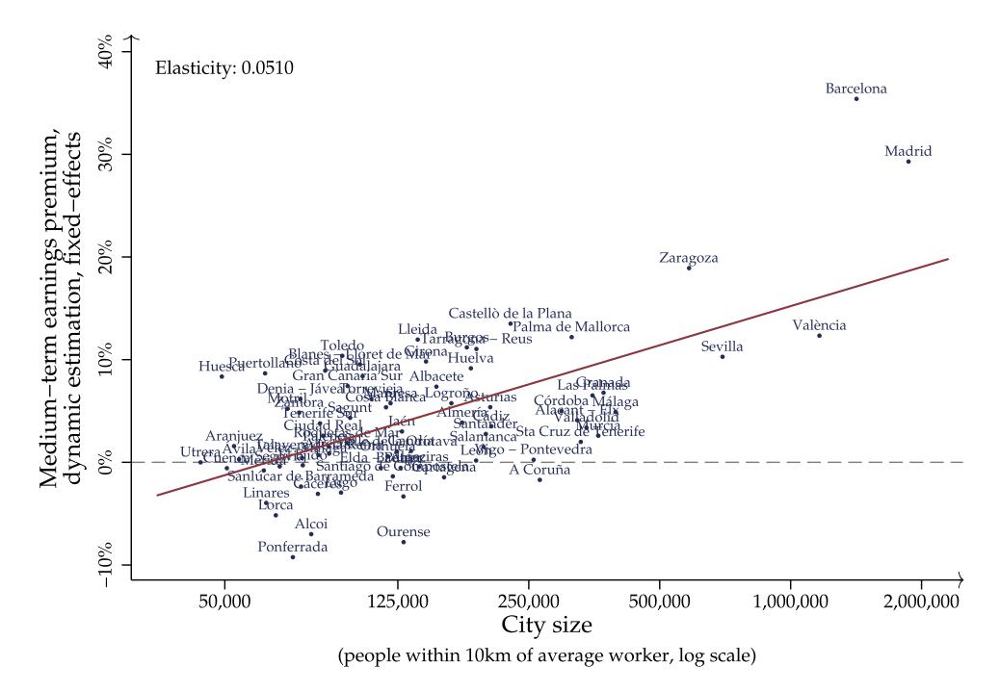
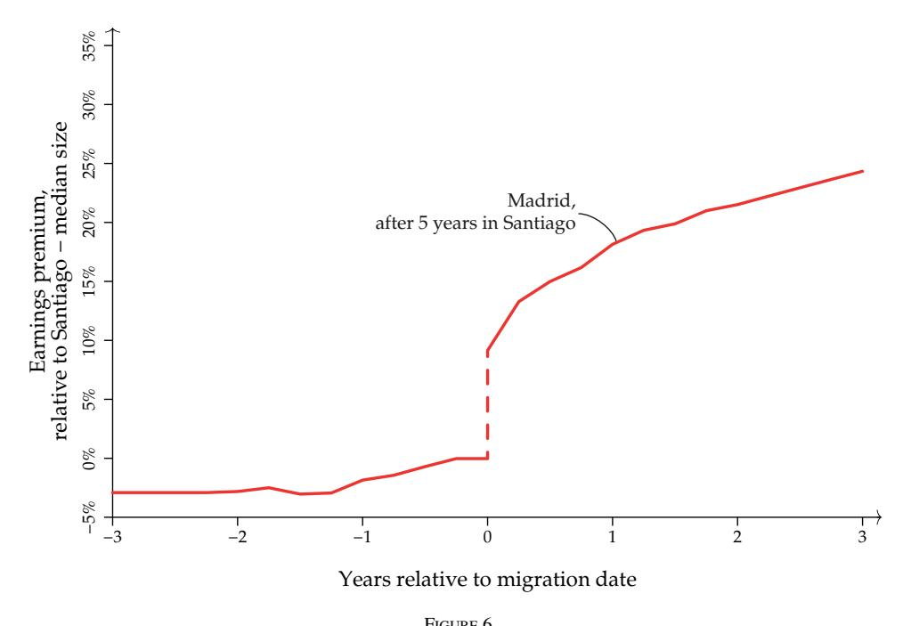
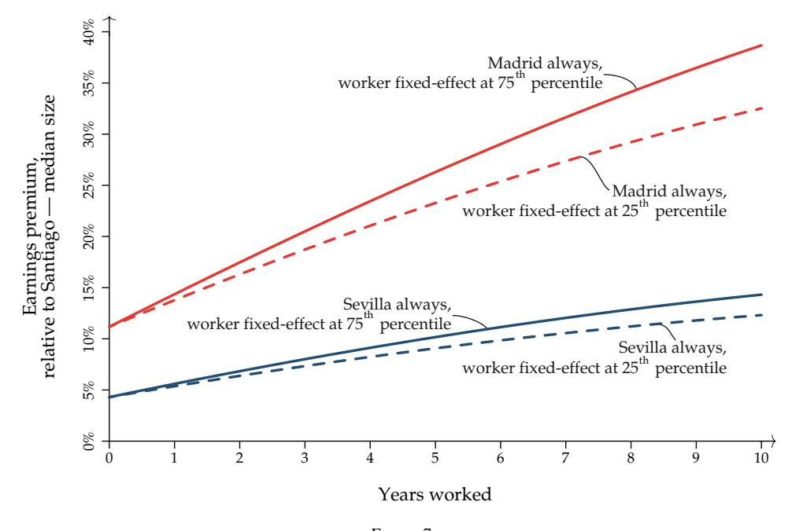
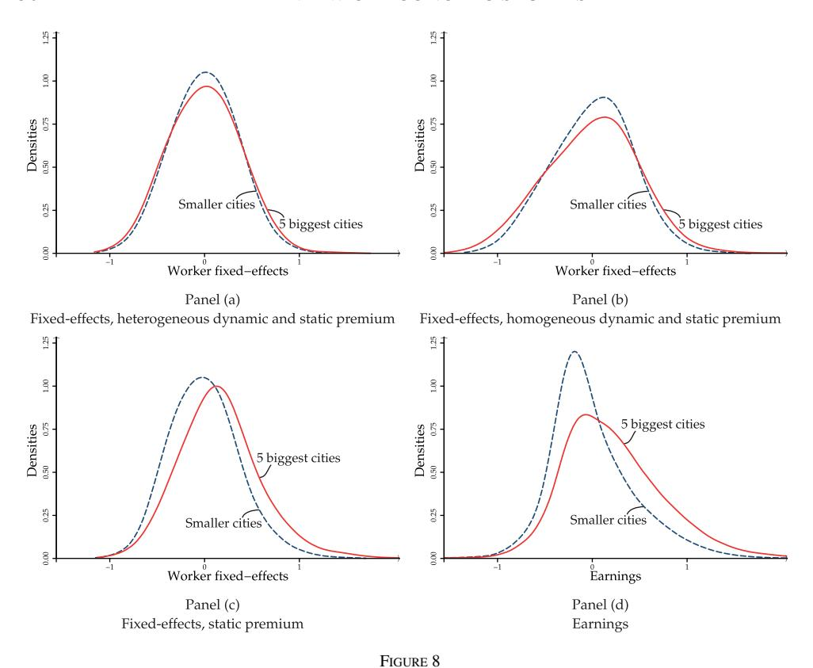

© The Author 2016. Published by Oxford University Press on behalf of The Review of Economic Studies Limited. This is an Open Access article distributed under the terms of the Creative Commons Attribution Non-Commercial License (http://creativecommons.org/licenses/by-nc/4.0/), which permits non-commercial re-use, distribution, and reproduction in any medium, provided the original work is properly cited. For commercial re-use, please contactjournals.permissions@oup.com Advance access publication 20 July 2016

# Learning by Working in Big Cities

# JORGE DE LA ROCA

*University of Southern California*

and

# DIEGO PUGA *CEMFI*

*First version received January* 2014*; final version accepted February* 2016 (*Eds.*)

Individual earnings are higher in bigger cities. We consider three reasons: spatial sorting of initially more productive workers, static advantages from workers' current location, and learning by working in bigger cities. Using rich administrative data for Spain, we find that workers in bigger cities do not have higher initial unobserved ability as reflected in fixed effects. Instead, they obtain an immediate static premium and accumulate more valuable experience. The additional value of experience in bigger cities persists after leaving and is stronger for those with higher initial ability. This explains both the higher mean and greater dispersion of earnings in bigger cities.

*Key words*: Agglomeration economies, City sizes, Learning, Earnings premium

*JEL Codes*: R10, R23, J31

## 1. INTRODUCTION

Quantifying the productive advantages of bigger cities and understanding their nature are among the most fundamental questions in urban economics. The productive advantages of bigger cities manifest in the higher productivity of establishments located in them (*e.g.* [Henderson](#page-35-0), [2003](#page-35-0); [Combes](#page-35-0) *et al.*, [2012a](#page-35-0)). They also show up in workers' earnings. Workers in bigger cities earn more than workers in smaller cities and rural areas. Figure [1](#page-1-0) plots mean annual earnings for male employees against city size for Spanish urban areas. Workers in Madrid earn 31,000 euros annually on average, which is 21% more than workers in Valencia (the country's third biggest city), 46% more than workers in Santiago de Compostela (the median-sized city), and 55% more than workers in rural areas. The relationship between earnings and city size is just as strong in other developed countries.1 Moreover, differences remain large even when we compare workers with the same education and years of experience and in the same industry.

1. In the U.S., workers in metropolitan areas with population above 1 million earn on average 30% more than workers in rural areas [\(Glaeser](#page-35-0), [2011\)](#page-35-0). In France, workers in Paris earn on average 15% more than workers in other large cities, such as Lyon or Marseille, 35% more than in medium-sized cities, and 60% more than in rural areas [\(Combes](#page-35-0) *et al.*, [2008\)](#page-35-0).

Figure 1 Mean earnings and city size

Higher costs of living may explain why workers do not flock to bigger cities, but that does not change the fact that firms must obtain some productive advantage to offset paying higher wages in bigger cities. Otherwise, firms in tradable sectors would relocate to smaller localities with lower wages. Of course, not all firms are in tradable sectors, but as [Moretti](#page-36-0) [\(2011](#page-36-0)) notes, "as long as there are some firms producing traded goods in every city and workers can move between the tradable and non-tradable sector, average productivity has to be higher in cities where nominal wages are higher" (p. 1249). In fact, [Combes](#page-35-0) *et al.* [\(2010](#page-35-0)) find that establishment-level productivity and wages exhibit a similar elasticity with respect to city size.2

Looking at workers' earnings instead of at firms' productivity is worthwhile because it can be informative about the nature of the productive advantages that bigger cities provide. There are three broad reasons why firms may be willing to pay more to workers in bigger cities. First, there may be some static advantages associated with bigger cities that are enjoyed while working there and lost upon moving away. These static agglomeration economies have received the most attention (see [Duranton and Puga](#page-35-0), [2004,](#page-35-0) for a review of possible mechanisms and [Rosenthal and Strange](#page-36-0), [2004; Puga, 2010](#page-36-0), and [Holmes](#page-35-0), [2010](#page-35-0), for summaries of the evidence). Secondly, workers who are inherently more productive may choose to locate in bigger cities. Evidence on such sorting is mixed, but some recent accounts (*e.g.* [Combes](#page-35-0) *et al.*, [2008](#page-35-0)) suggest it may be as important in magnitude as static agglomeration economies. Thirdly, a key advantage

2. It is worth stressing that it is nominal wages that one ought to study to capture the productive advantages of cities, since they reflect how much more firms are willing to pay in bigger cities to comparable, or even the same, workers. Having higher nominal wages offsetting higher productivity in bigger cities (keeping firms indifferent across locations) is compatible with having no substantial differences in real earnings as higher housing prices tend to offset higher nominal earnings (keeping workers indifferent across locations). See [Glaeser](#page-35-0) [\(2008\)](#page-35-0) for further elaboration on this point and a thorough treatment of the spatial equilibrium approach to studying cities.

of cities is that they facilitate experimentation and learning [\(Glaeser](#page-35-0), [1999](#page-35-0); [Duranton and Puga,](#page-35-0) [2001\)](#page-35-0). In particular, bigger cities may provide workers with opportunities to accumulate more valuable experience. Since these dynamic advantages are transformed in higher human capital, they may remain beneficial even when a worker relocates.

In this article, we simultaneously examine these three potential sources of the city size earnings premium: static advantages, sorting based on initial ability, and dynamic advantages. For this purpose, we use a rich administrative data set for Spain that follows workers over time and across locations throughout their careers, thus allowing us to compare the earnings of workers in cities of different sizes, while controlling for measures of ability and the experience previously acquired in various other cities.

To facilitate a comparison with previous studies, we begin our empirical analysis in section [3](#page-7-0) with a simple pooled ordinary least squares (OLS) estimation of the static advantages of bigger cities. For this, we estimate a regression of log earnings on worker and job characteristics and city fixed effects. In a second stage, we regress the estimated city fixed effects on a measure of log city size. This yields a pooled-OLS elasticity of the earnings premium with respect to city size of 0.0455. The first stage of this estimation ignores both the possible sorting of workers with higher unobserved ability into bigger cities as well as any additional value of experience accumulated in bigger cities. Thus, this basic estimation strategy produces a biased estimate of the static advantages of bigger cities and no assessment of the possible importance of dynamic advantages or sorting.

[Glaeser and Maré](#page-35-0) [\(2001](#page-35-0)) and, more recently, [Combes](#page-35-0) *et al.* [\(2008\)](#page-35-0) introduce worker fixed effects to address the issue of workers sorting on unobserved ability into bigger cities. When we follow this strategy, the estimated elasticity of the earnings premium with respect to city size drops substantially to 0.0241, in line with their findings. This decline is usually interpreted as evidence of more productive workers sorting into bigger cities (*e.g.* [Combes](#page-35-0) *et al.*, [2008](#page-35-0)). We show instead that this drop can be explained by workers' sorting on ability, by the importance of dynamic benefits in bigger cities, or by a combination of both.

We then introduce dynamic benefits of bigger cities into the analysis in Section [4.](#page-13-0) Our augmented specification for log earnings now provides a joint estimation of the static and dynamic advantages of bigger cities, while allowing for unobserved worker heterogeneity. By tracking the complete workplace location histories of a large panel of workers, we let the value of experience vary depending on both where it was acquired and where it is being used. Experience accumulated in bigger cities is substantially more valuable than experience accumulated in smaller cities. Furthermore, the additional value of experience acquired in bigger cities is maintained when workers relocate to smaller cities. This suggests there are important learning benefits to working in bigger cities that get embedded in workers' human capital.

Our results indicate that where workers acquire experience matters more than where they use it. Nevertheless, for workers who relocate from small to big cities, previous experience is more highly valued in their new job location. This finding has implications for earnings profiles at different stages of workers' life cycle: more experienced workers obtain a higher immediate gain upon relocating to one of the biggest cities but then see their earnings increase more slowly than less experienced workers.

In Section [5,](#page-26-0) a final generalization of our log earnings specification explores heterogeneity across workers in the dynamic advantages of bigger cities.3 Our estimates show that the additional

3. The relevance of heterogeneity in the growth profiles of earnings has been stressed in the macroeconomics and labour economics literature (see, *e.g.*, [Baker, 1997; Baker and Solon, 2003](#page-35-0) and [Guvenen, 2009\)](#page-35-0). We highlight here the spatial dimension of this heterogeneity in earnings profiles and its interaction with individual ability.

value of experience acquired in bigger cities is even greater for workers with higher ability, as proxied by their worker fixed effects.

Once we address the sources of bias in the first stage of the log earnings estimation, we proceed to estimate again the elasticity of earnings with respect to city size. We now distinguish between a short-term elasticity that captures the static advantages of bigger cities—*i.e.* the boost in earnings workers obtain upon moving into a big city—and a medium-term elasticity that further encompasses the learning benefits that workers get after working in a big city for several years. The estimated medium-term elasticity of 0.0510 is more than twice as large as the short-term elasticity of 0.0223 implying that, in the medium term, about half of the gains from working in bigger cities are static and about half are dynamic.

We show that the higher value of experience acquired in bigger cities can almost fully account for the difference between pooled OLS and fixed-effects estimates of the static earnings premium of bigger cities. This suggests that, while the dynamic advantages of bigger cities are important, sorting may play a minor role. To verify this implication, in Section [6,](#page-27-0) we compare the distribution of workers' ability across cities of different sizes. This exercise relates to recent studies that also compare workers' skills across big and small cities, either by looking at levels of education (*e.g.* [Berry and Glaeser](#page-35-0), [2005](#page-35-0)), at broader measures of skills (*e.g.* [Bacolod](#page-34-0) *et al.*, [2009](#page-34-0)), at measures of skills derived from a spatial equilibrium model (*e.g.* [Eeckhout](#page-35-0) *et al.*, [2014\)](#page-35-0), or at estimated worker fixed effects (*e.g.* [Combes](#page-35-0) *et al.*, [2012b](#page-35-0)). We focus on worker fixed effects because we are interested in capturing time-invariant ability net of the extra value of big city experience.

We find sorting based on unobservables to be much less important than previously thought. Although there is clear sorting on observables by broad occupational skill groups (we use five categories), within these broad groups, there is little further sorting on unobserved ability. Workers in big and small cities are not particularly different to start with; it is largely working in cities of different sizes that makes their earnings diverge. Workers attain a static earnings premium upon arrival in a bigger city and accumulate more valuable experience as they spend more time working there. This finding is consistent with the counterfactual simulations of the structural model in [Baum-Snow and Pavan](#page-35-0) [\(2012\)](#page-35-0), which suggest that returns to experience and wagelevel effects are the most important mechanisms contributing to the overall city size earnings premium.4 Because these gains are stronger for workers with higher unobserved ability, this combination of effects explains not only the higher mean but also the greater dispersion of earnings in bigger cities that [Combes](#page-35-0) *et al.* [\(2012b\)](#page-35-0); [Baum-Snow and Pavan](#page-35-0) [\(2013\)](#page-35-0) and [Eeckhout](#page-35-0) *et al.* [\(2014\)](#page-35-0) emphasize.

# 2. DATA

#### *Employment histories and earnings*

Our main data set is Spain's Continuous Sample of Employment Histories (*Muestra Continua de Vidas Laborales* or MCVL). This is an administrative data set with longitudinal information obtained by matching social security, income tax, and census records for a 4% non-stratified random sample of the population who in a given year have any relationship with Spain's Social Security (individuals who are working, receiving unemployment benefits, or receiving a pension).

4. [Baum-Snow and Pavan](#page-35-0) [\(2012](#page-35-0)) address unobserved ability by using a three-type mixture model where the probability of a worker being of certain type is non-parametrically identified and depends, among other factors, on the city where he enters the labour market. In our much larger sample (157,000 men observed monthly compared with 1,700 men observed annually), we can estimate a worker fixed effect and let the value of experience in cities of different sizes vary systematically with this fixed effect.

The unit of observation in the social security data contained in the MCVL is any change in the individual's labour market status or any variation in job characteristics (including changes in occupation or contractual conditions within the same firm). The data record all changes since the date of first employment, or since 1980 for earlier entrants. Using this information, we construct a panel with monthly observations tracking the working life of individuals in the sample. On each date, we know the individual's labour market status and, if working, the occupation and type of contract, working hours expressed as a percentage of a full-time equivalent job, the establishment's sector of activity at the NACE three-digit level, and the establishment's location. Furthermore, by exploiting the panel dimension, we can construct precise measures of tenure and experience, calculated as the actual number of days the individual has been employed, respectively, in the same establishment and overall. We can also track cumulative experience in different locations or sets of locations.

The MCVL also includes earnings data obtained from income tax records. Gross labour earnings are recorded separately for each job and are not subjected to any censoring. Each source of labour income is matched between income tax records and social security records based on both employee and employer (anonymized) identifiers. This allows us to compute monthly labour earnings, expressed as euros per day of full-time equivalent work.5

Each MCVL edition includes social security records for the complete labour market history of individuals included in that edition, but only includes income tax records for the year of that particular MCVL edition. Thus, we combine multiple editions of the MCVL, beginning with the first produced, for 2004, to construct a panel that has the complete labour market history since 1980 and uncensored earnings since 2004 for a random sample of approximately 4% of all individuals who have worked, received benefits or a pension in Spain at any point since 2004. This is possible because the criterion for inclusion in the MCVL (based on the individual's permanent Tax Identification Number) as well as the algorithm used to construct the individual's anonymized identifier are maintained across MCVL editions. Combining multiple waves has the additional advantage of maintaining the representativeness of the sample throughout the study period, by enlarging the sample to include individuals who have an affiliation with the Social Security in one year but not in another.6

A crucial feature of the MCVL for our purposes is that workers can be tracked across space based on their workplace location. Social Security legislation requires employers to keep separate contribution account codes for each province in which they conduct business. Furthermore, within a province, a municipality identification code is provided if the workplace establishment is located in a municipality with population greater than 40,000 inhabitants.

The MCVL also provides individual characteristics contained in social security records, such as age and gender, and also matched characteristics contained in Spain's Continuous Census of Population (Padrón Continuo), such as country of birth, nationality, and educational attainment.7

- 5. In addition to uncensored earnings from income tax records, the MCVL contains earnings data from social security records going back to 1980. These alternative earnings data are either top or bottom coded for about 13% of observations. We, therefore, use the income tax data to compute monthly earnings, since these are completely uncensored.
- 6. More recent editions add individuals who enter the labour force for the first time while they lose those who cease affiliation with the Social Security. Since individuals who stop working remain in the sample while they receive unemployment benefits or a retirement pension, most exits occur when individuals are deceased or leave the country permanently.
- 7. A complete national update of the educational attainment of individuals recorded in the Continuous Census of Population was performed in 1996, with a subsequent update by most municipalities in 2001. Further updates used to rely on the information provided by individuals, most often when they completed their registration questionnaire at a new municipality upon moving (a prerequisite for access to local health and education services). However, since 2009 the Ministry of Education directly reports individuals' highest educational attainment to the National Statistical

#### 2.1. *Sample restrictions*

Our starting sample is a monthly data set for men aged 18 and over with Spanish citizenship born in Spain since 1962 and employed at any point between January 2004 and December 2009. We focus on men due to the huge changes experienced by Spain's female labour force during the period over which we track labour market experience. Most notably, the participation rate for prime-age women (25–54) increased from 30% in 1980 to 77% in 2009. Nevertheless, some results for women are provided in Section [4.](#page-13-0) We leave out those born before 1962 because we cannot track their full labour histories. We also leave out foreign-born workers because we do not have their labour histories before immigrating to Spain and because they are likely to be quite different from natives. We track workers over time throughout their working lives to compute their job tenure and their work experience in different urban areas, but study their earnings only when employed in 2004–2009. In particular, we regress individual monthly earnings in 2004– 2009 on a set of characteristics that capture the complete prior labour history of each individual.8 We exclude spells workers spend as self-employed because labour earnings are not available during such periods, but still include job spells as employees for the same individuals. This initial sample has 246,941 workers and 11,885,511 monthly observations.

Job spells in the Basque Country and Navarre are excluded because we do not have earnings data from income tax records for them as these autonomous regions collect income taxes independently from Spain's national government. We also exclude job spells in three small urban areas and in rural areas because workplace location is not available for municipalities with population below 40,000—and because our focus is comparing urban areas of different sizes. Nevertheless, the days worked in urban areas within the Basque Country or Navarre, in the three small excluded urban areas, or in rural areas anywhere in the country are still counted when computing cumulative experience (both overall experience and experience by location). These restrictions reduce the sample to 185,628 workers and 7,504,602 monthly observations.

Job spells in agriculture, fishing, mining, and other extractive industries are excluded because these activities are typically rural and are covered by special social security regimes where workers tend to self-report earnings and the number of working days recorded is not reliable. Job spells in the public sector, international organizations, and in education and health services are also left out because earnings in these sectors are heavily regulated by the national and regional governments. Apprenticeship contracts and certain rare contract types are also excluded. Finally, we drop workers who have not worked at least 30 days in any year. This yields our final sample of 157,113 workers and 6,263,446 monthly observations.

Institute and this information is used to update the corresponding records in the Continuous Census of Population. It is worth noting that the Ministry of Education data indicate very low mobility to pursue higher education in Spain [\(Ministerio de Educación, Cultura y Deporte](#page-36-0), [2013](#page-36-0)). This is in contrast with the high rates of job-related mobility that, as reported below, are comparable to those of the U.S.

8. We do not study years prior to 2004 due to the lack of earnings from income tax data. We also do not study years after 2009 due to the extreme impact of the Great Recession on Spain after that year. In particular, our fixed-effects estimations rely on migrants to identify some key coefficients. Migrations across urban areas had remained very stable, with around 7% of workers relocating every year since 1998 through both bad and good times, but plummeted below 3% in the Great Recession. Nevertheless, to check that our estimates are not specific to the period 2004–2009, we also provide comparable results for 1998–2003. Since no income tax data are available prior to 2004, estimations for 1998– 2003 rely on earnings data from social security records corrected for top and bottom coding following a procedure based on Card *[et al.](#page-35-0)* [\(2013\)](#page-35-0).

#### 2.2. Urban areas

We use official urban area definitions, constructed by Spain's Ministry of Housing in 2008 and maintained unchanged since then. The 85 urban areas account for 68% of Spain's population and 10% of its surface. Four urban areas have populations above 1 million, Madrid being the largest with 5,966,067 inhabitants in 2009. At the other end, Teruel is the smallest with 35,396 inhabitants in 2009. Urban areas contain 747 municipalities out of the over 8,000 that exhaustively cover Spain. There is large variation in the number of municipalities per urban area. The urban area of Barcelona is made up of 165 municipalities, while 21 urban areas contain a single municipality.

Three urban areas (Sant Feliú de Guixols, Soria, and Teruel) have no municipality with a population of at least 40,000, and are not included in the analysis since they cannot be identified in the MCVL. We must also exclude the four urban areas in the Basque Country and Navarre (Bilbao, San Sebastián, Vitoria and Pamplona) because we lack earnings from tax returns data since the Basque Country and Navarre collect income taxes independently. Last, we exclude Ceuta and Melilla given their special enclave status in continental Africa. This leaves 76 urban areas for which we carry out our analysis.

To measure the size of each urban area, we calculate the number of people within  $10 \, \text{km}$  of the average person in the urban area. We do so on the basis of the 1-km-resolution population grid for Spain in 2006 created by Goerlich and Cantarino (2013). They begin with population data from Spain's Continuous Census of Population (Padrón Continuo) at the level of the approximately  $35,000 \, \text{census}$  tracts (áreas censales) that cover Spain. Within each tract, they allocate population to  $1 \times 1 \, \text{km}$  cells based on the location of buildings as recorded in high-resolution remote sensing data. We take each  $1 \times 1 \, \text{km}$  cell in the urban area, trace a circle of radius  $10 \, \text{km}$  around the cell (encompassing both areas inside and outside the urban area), count population in that circle, and average this count over all cells in the urban area weighting by the population in each cell. This yields the number of people within  $10 \, \text{km}$  of the average person in the urban area.

Our measure of city size is very highly correlated with a simple population count (the correlation being 0.94), but deals more naturally with unusual urban areas, in particular those that are polycentric. Most urban areas in Spain comprise a single densely populated urban centre and contiguous areas that are closely bound to the centre by commuting and employment patterns. However, a handful of urban areas are made up of multiple urban centres. A simple population count for these polycentric urban areas tends to exaggerate their scale, because to maintain contiguity they incorporate large intermediate areas that are often only weakly connected to the various centres. For instance, the urban area of Asturias incorporates the cities of Gijón, Oviedo, Avilés, Mieres, and Langreo as well as large areas in between. A simple population count would rank the urban area of Asturias sixth in terms of its 2009 population (835,231), just ahead of Zaragoza (741,132). Our measure of scale ranks Asturias nineteenth in terms of people within 10 km of the average person (203,817) and Zaragoza fifth (583,774), which is arguably a more accurate characterization of their relative scale. Our measure of city size also has some advantages over density, another common measure of urban scale, because it is less subject to the noise introduced by urban boundaries which are drawn with very different degree of tightness around built-up areas. This noise arises because some of the underlying areas on the basis of which urban definitions are drawn (municipalities in our case) include large green areas well beyond the edge of the city, which gives them an unusually large surface area and artificially lowers their density.

It is worth emphasizing that we assign workers to urban areas at each point in time based on the municipality of their workplace. Thus, when we talk about migrations we refer to workers taking a job in a different urban area. Each year about 7% of workers change jobs across urban areas throughout our study period.9

#### 3. STATIC BENEFITS OF BIGGER CITIES

Let us assume that the log wage of worker i in city c at time t,  $w_{ict}$ , is given by

$$w_{ict} = \sigma_c + \mu_i + \sum_{j=1}^{C} \delta_{jc} e_{ijt} + \mathbf{x}'_{it} \beta + \varepsilon_{ict}, \qquad (1)$$

where  $\sigma_c$  is a city fixed effect,  $\mu_i$  is a worker fixed effect,  $e_{ijt}$  is the experience acquired by worker i in city j up until time t,  $\mathbf{x}_{it}$  is a vector of time-varying individual and job characteristics, the scalars  $\delta_{ic}$  and the vector  $\boldsymbol{\beta}$  are parameters, and  $\varepsilon_{ict}$  is an error term.10

Equation (1) allows for a static earnings premium associated with currently working in a bigger city, if the city fixed effect  $\sigma_c$  is positively correlated with city size. It also allows for the sorting of more productive workers into bigger cities, if the worker fixed effect  $\mu_i$  is positively correlated with city size. Finally, it lets the experience accumulated in city j to have a different value which may be positively correlated with city size. This value of experience  $\delta_{jc}$  is indexed by both j (the city where experience was acquired) and c (the city where the worker currently works). In our estimations, we also allow experience to have a non-linear effect on log earnings but to simplify the exposition we only include linear terms in equation (1).

We shall eventually estimate an equation like (1). However, to facilitate comparisons with earlier studies and to highlight the importance of considering the dynamic advantages of bigger cities, we begin by estimating simpler and more restrictive equations that allow only for static benefits.

#### 3.1. Static pooled estimation

Imagine that, instead of estimating equation (1), we ignore both unobserved worker heterogeneity and any dynamic benefits of working in bigger cities, and estimate the following relationship:

$$w_{ict} = \sigma_c + \mathbf{x}'_{it}\beta + \eta_{ict}. \tag{2}$$

Compared with equation (1), in equation (2) the worker fixed effect  $\mu_i$  and the terms capturing the differential value of experience for each city  $\sum_{j=1}^{C} \delta_{jc} e_{ijt}$  are missing. We can estimate equation (2) by ordinary least squares using the pooled panel of workers.

- 9. This annual mobility rate is roughly comparable to the one in the U.S. Using individual-level data from the National Longitudinal Survey of Youth 1979, and restricting the sample to male native-born workers between 25 and 45 years old, we calculate that each year around 9% of workers move across metropolitan areas (defined as Core Based Statistical Areas by the Office of Management and Budget) throughout 1983–2010.
- 10. The city fixed effect  $\sigma_c$  could also be time-varying and written  $\sigma_{ct}$  instead. We keep it time-invariant here for simplicity. In our estimations, we have tried both having time-varying and time-invariant city fixed effects. We find that the elasticity of time-varying city fixed effects with respect to time-varying city size is the same as the elasticity of time-invariant city fixed effects with respect to time-invariant city size. Thus, we stick with time-invariant city fixed effects to not increase excessively the number of parameters in the richer specifications that we introduce later in the article.
- 11. Note that we are not explicitly deriving equation (1) from a general equilibrium model. Instead, we start directly from a reduced-form expression for earnings that potentially captures the contribution of static advantages, learning and sorting to the premium associated with bigger cities. In follow up work partly motivated by the findings of this article (De la Roca *et al.*, 2014), we propose an overlapping generations general equilibrium model of urban sorting by workers with heterogeneous ability and self-confidence that see their experience differ in value depending on where it is acquired and used.

TABLE 1 *Estimation of the static city size earnings premium*

|                                         | (1)                    | (2)                                          | (3)                    | (4)                                          |  |
|-----------------------------------------|------------------------|----------------------------------------------|------------------------|----------------------------------------------|--|
| Dependent variable                      | Log earnings        | City indicator coefficients column (1) | Log earnings        | City indicator coefficients column (3) |  |
| Log city size                           |                        | 0.0455 (0.0080)∗∗∗                        |                        | 0.0241 (0.0058)∗∗∗                        |  |
| City indicators Worker fixed effects | Yes No              |                                              | Yes Yes             |                                              |  |
| Experience                              | 0.0319 (0.0005)∗∗∗  |                                              | 0.1072 (0.0018)∗∗∗  |                                              |  |
| Experience2                             | −0.0006 (0.0000)∗∗∗ |                                              | −0.0014 (0.0000)∗∗∗ |                                              |  |
| Firm tenure                             | 0.0147 (0.0006)∗∗∗  |                                              | 0.0042 (0.0004)∗∗∗  |                                              |  |
| Firm tenure2                            | −0.0005 (0.0000)∗∗∗ |                                              | −0.0003 (0.0000)∗∗∗ |                                              |  |
| Very-high-skilled occupation            | 0.7752 (0.0062)∗∗∗  |                                              | 0.2350 (0.0057)∗∗∗  |                                              |  |
| High-skilled occupation                 | 0.4976 (0.0046)∗∗∗  |                                              | 0.1758 (0.0040)∗∗∗  |                                              |  |
| Medium-high-skilled occupation          | 0.2261 (0.0031)∗∗∗  |                                              | 0.0873 (0.0029)∗∗∗  |                                              |  |
| Medium-low-skilled occupation           | 0.0542 (0.0021)∗∗∗  |                                              | 0.0152 (0.0019)∗∗∗  |                                              |  |
| University education                    | 0.2014 (0.0037)∗∗∗  |                                              |                        |                                              |  |
| Secondary education                     | 0.1084 (0.0022)∗∗∗  |                                              |                        |                                              |  |
| Observations R2                      | 6,263,446 0.4927    | 76 0.2406                                 | 6,263,446 0.1144    | 76 0.1422                                 |  |

*Notes*: All specifications include a constant term. Columns (1) and (3) include month–year indicators, two-digit sector indicators, and contract-type indicators. Coefficients are reported with robust standard errors in parenthesis, which are clustered by worker in columns (1) and (3). ∗∗∗, ∗∗, and ∗ indicate significance at the 1, 5, and 10% levels. The *R*2 reported in column (3) is within workers. Worker values of experience and tenure are calculated on the basis of actual days worked and expressed in years.

Column (1) in Table 1 shows the results of such estimation. As we would expect, log earnings are concave in overall experience and tenure in the firm and increase monotonically with occupational skills.12 Having tertiary education and working under a full-time and permanent contract are also associated with higher earnings.

Figure [2](#page-9-0) plots the city fixed effects estimated in column (1) against log city size. We find notable geographic differences in earnings even for observationally equivalent workers. For instance, a worker in Madrid earns 18% more than a worker with the same observable characteristics in Utrera—the smallest city in our sample. The largest earning differential of 34% is found between workers in Barcelona and Lugo. Column (2) in Table 1 regresses the city fixed effects estimated in column (1) on our measure of log city size. This yields an elasticity of the earnings premium with respect to city size of 0.0455. This pooled OLS estimate of the elasticity of the earnings premium with respect to city size reflects that doubling city size is associated with an approximate

12. Employers assign workers into one of ten social security occupation categories, which we have regrouped into five skill groups. These categories are meant to capture the skills required by the job and not necessarily those acquired by the worker.

Figure 2 Static OLS estimation of the city size premium

increase of 5% in earnings over an above any differences attributable to differences in education, overall experience, occupation, sector, or tenure in the firm. City size is a powerful predictor of differences in earnings as it can explain about a quarter of the variation that is left after controlling for observable worker characteristics (*R*2 of 0.2406 in column (2).13

13. We have also estimated the elasticity in a single stage by including log city size directly in the Mincerian specification of log earnings (see [Combes](#page-35-0) *et al.*, [2008](#page-35-0) for a discussion on the advantages of using a two-step procedure). In this case, the estimated elasticity rises slightly to 0.0512. In addition, we have carried out alternative estimations for the pooled OLS two-stage estimation. First, we try including interactions of city and year indicators in the first stage to address the possibility of such city effects being time-variant. Then, in the second stage we regress all estimated city-year indicators on time-varying log city size and year indicators. The estimated elasticity remains almost unaltered at 0.0458. Secondly, urban economists have studied agglomeration benefits arising from local specialization in specific sectors in addition to those related to the overall scale of economic activity in a city. Following [Combes](#page-35-0) *et al.* [\(2010](#page-35-0)), we can account for these potential benefits of specialization by including the share of total employment in the city accounted for by the sector in which the worker is employed as an additional explanatory variable in the first-stage regression. When we do this, the elasticity of the earnings premium with respect to city size is almost unchanged, rising only marginally to 0.0496. This result indicates that some small but highly specialized cities do pay relatively high wages in the sectors in which they specialize, but that this leads only to a small reduction in the earnings gap between big and small cities. Thirdly, we may be worried about the city fixed effects being estimated on the basis of more observations for bigger cities. This may introduce some heteroscedasticity through sampling errors, which can be dealt with by computing the feasible generalized least squares (FGLS) estimator proposed in appendix C of [Combes](#page-35-0) *et al.* [\(2008](#page-35-0)). When we do this, the elasticity of the earnings premium with respect to city size is almost unchanged, falling slightly from 0.0455 to 0.0453. Finally, we can estimate two-way clustered standard errors by both worker and city instead of clustering just by worker (note that these clusters are not nested because many workers move across cities). This increases computational requirements by at least one order of magnitude, but does not change the level of statistical significance (at the 1, 5, or 10% level) of any coefficient in the table.

The pooled OLS estimate of the elasticity of interest, 0.046 in column (2), is in line with previous estimates that use worker-level data with similar sample restrictions. Combes et al. (2010) find an elasticity of 0.051 for France while Glaeser and Resseger (2010) obtain an elasticity of 0.041 for the U.S.14

The pooled OLS estimate of the elasticity of the earnings premium with respect to city size is biased because the city fixed effects estimated from equation (2) are biased. Assuming for simplicity that  $\text{Cov}(\mathbf{x}_{it}, \mu_i + \sum_{i=1}^{C} \delta_{jc} e_{ijt}) = \mathbf{0}$ , the resulting pooled OLS estimate of  $\sigma_c$  would be unbiased if and only if

$$Cov(\iota_{ict}, \eta_{ict}) = 0, \tag{3}$$

where  $\iota_{ict}$  is a city indicator variable that takes value 1 if worker i is in city c at time t and value 0 otherwise. However, if the richer wage determination of equation (1) holds, the error term of equation (2) includes the omitted variables:

$$\eta_{ict} = \mu_i + \sum_{i=1}^{C} \delta_{jc} e_{ijt} + \varepsilon_{ict}. \tag{4}$$

Hence,

$$\eta_{ict} = \mu_i + \sum_{j=1}^{C} \delta_{jc} e_{ijt} + \varepsilon_{ict}.$$

$$\operatorname{Cov}(\iota_{ict}, \eta_{ict}) = \operatorname{Cov}(\iota_{ict}, \mu_i) + \operatorname{Cov}(\iota_{ict}, \sum_{j=1}^{C} \delta_{jc} e_{ijt}) \neq 0.$$

$$(5)$$

Equation (5) shows that a static cross-section or pooled OLS estimation of  $\sigma_c$  suffers from two key potential sources of bias. First, it ignores sorting, and thus the earnings premium for city  $c, \sigma_c$ is biased upwards if individuals with high unobserved ability,  $\mu_i$ , are more likely to work there, so that  $Cov(\iota_{ict}, \mu_i) > 0$  (and biased downwards in the opposite case). Secondly, it ignores dynamic effects, and thus the earnings premium for city c,  $\sigma_c$ , is biased upwards if individuals with more valuable experience,  $\sum_{i=1}^{C} \delta_{jc} e_{ijt}$ , are more likely to work there, so that  $\text{Cov}(\iota_{ict}, \sum_{i=1}^{C} \delta_{jc} e_{ijt}) > 0$ (and biased downwards in the opposite case).15

To see how these biases work more clearly, it is useful to consider a simple example. Suppose there are just two cities, one big and one small. Everyone working in the big city enjoys an instantaneous (static) log wage premium of  $\sigma$ . Workers in the big city have higher unobserved ability, which increases their log wage by  $\mu$ . Otherwise, all workers are initially identical. Over time, experience accumulated in the big city increases log wage by  $\delta$  per period relative to having worked in the small city instead. For now, assume there is no migration. If there are n time periods, then the pooled OLS estimate of the static big city premium  $\sigma$  has probability limit  $\operatorname{plim} \hat{\sigma}_{\text{pooled}} = \sigma + \mu + \frac{1+n}{2} \delta$ . Thus, a pooled OLS regression overestimates the actual premium by the value of higher unobserved worker ability in the big city  $(\mu)$  and the higher average value of accumulated experience in the big city  $(\frac{1+n}{2}\delta)$ .

14. Combes et al. (2010) aggregate individual data into a city sector level data to estimate an elasticity analogous to our pooled OLS result. Mion and Naticchioni (2009) find a lower estimate of this elasticity for Italy (0.022).

15. Strictly speaking, the actual bias in the pooled OLS estimate of  $\sigma_c$ ,  $\hat{\sigma}_{c \, pooled}$ , is more complicated because it is not necessarily the case that  $\text{Cov}(\mathbf{x}_{it}, \mu_i + \sum_{j=1}^{C} \delta_{jc} e_{ijt}) = \mathbf{0}$ , as we have assumed. For instance, even if we do not allow the value of experience to vary by city, we may have overall experience,  $e_{it} \equiv \sum_{j=1}^{C} e_{ijt}$ , as one of the explanatory variables included in  $\mathbf{x}_{it}$  in equation (2). In this case,  $\delta_{ic}$  measures the differential value of the experience acquired in city j when working in city c relative to the general value of experience, which we may denote  $\gamma$ . Then plim $\hat{\sigma}_{c \text{pooled}} =$  $\sigma_c + \text{Cov}(\iota_{ict}, \mu_i) / \text{Var}(\iota_{ict}) + \sum_{i=1}^{C} \delta_{jc} \text{Cov}(\iota_{ict}, e_{ijt}) / \text{Var}(\iota_{ict}) + (\gamma - \hat{\gamma}_{pooled}) \text{Cov}(\iota_{ict}, e_{it}) / \text{Var}(\iota_{ict})$ . Relative to the simpler example discussed in the main text, the bias incorporates an additional term  $(\gamma - \hat{\gamma}_{pooled})$ Cov $(\iota_{ict}, e_{it})$ /Var $(\iota_{ict})$ . In practice, this additional term is negligible if  $Cov(\iota_{ict}, e_{it})$  is close to zero, that is, if the total number of days of work experience (leaving aside where it was acquired) is not systematically related to workers' location. In our sample, this is indeed the case: the correlation between mean experience and log city size is not significantly different from 0.

#### 3.2. Static fixed-effects estimation

Following Glaeser and Maré (2001) and Combes *et al.* (2008), an approach to address the issue of workers sorting across cities on unobservables is to introduce worker fixed effects. Suppose we deal with unobserved worker heterogeneity in this way, but still ignore a dynamic city size premium and estimate the following relationship:

$$w_{ict} = \sigma_c + \mu_i + \mathbf{x}'_{it}\beta + \zeta_{ict}. \tag{6}$$

Compared with equation (1), the city-specific experience terms  $\sum_{j=1}^{C} \delta_{jc} e_{ijt}$  are still missing from equation (6), just as they were missing from equation (2). Compared with the pooled OLS regression of equation (2), equation (6) incorporates a worker fixed effect,  $\mu_i$ . To estimate  $\sigma_c$  we now need a panel of workers. The worker fixed effect  $\mu_i$  can be eliminated by subtracting from equation (6) the time average for each worker:

$$(w_{ict} - \bar{w}_i) = \sum_{j=1}^{C} \sigma_c(\iota_{ict} - \bar{\iota}_{ic}) + (\mathbf{x}'_{it} - \bar{\mathbf{x}}'_i)\beta + (\zeta_{ict} - \bar{\zeta}_i).$$
 (7)

Note that  $\sigma_c$  is now estimated only on the basis of migrants—for workers who are always observed in the same city  $\iota_{ict} = \bar{\iota}_{ic} = 1$  every period—while all other coefficients are estimated by exploiting time variation and job changes within workers' lives. 16

In column (3) of Table 1, we present results for this specification, which adds worker fixed effects to the pooled OLS specification of column (1). Then, in column (4) we regress the city fixed effects from column (3) on our measure of log city size. The estimated elasticity of the earnings premium with respect to city size of column (4) drops substantially relative to column (2), from 0.0455 to 0.0241.17 This drop is in line with previous studies. When worker fixed effects are introduced, Combes *et al.* (2010) see a decline in the elasticity of 35%, while Mion and Naticchioni (2009) report a larger drop of 66% for Italy. Our estimated drop of 47% lies in between both.

Assuming again for simplicity that  $Cov(\mathbf{x}_{it}, \sum_{j=1}^{C} \delta_{jc} e_{ijt}) = \mathbf{0}$ , the resulting fixed-effects estimate of  $\sigma_c$  is unbiased if

$$\operatorname{Cov}\left((\iota_{ict} - \bar{\iota}_{ic}), (\zeta_{ict} - \bar{\zeta}_{i})\right) = 0.$$
(8)

However, if the richer wage determination of equation (1) holds,

$$(\zeta_{ict} - \bar{\zeta}_i) = \sum_{j=1}^{C} \delta_{jc} (e_{ijt} - \bar{e}_{ij}) + (\varepsilon_{ict} - \bar{\varepsilon}_i),$$
(9)

- 16. This can be a source of concern for the estimation of city fixed effects if migrants are not representative of the broader worker population or if the decision to migrate to a particular city depends on shocks specific to a worker-city pair. As long as workers choose their location based on their characteristics (both observable and time-invariant unobservable), on job traits such as the sector and occupation, and on characteristics of the city, the estimation of  $\sigma_c$  will remain unbiased. However, any unobserved time-varying factor that is correlated with the error term in equation (6)—such as a particularly attractive wage offer in another city—will bias the estimation of city fixed effects. Nevertheless, even if people were to migrate only when they got a particularly high wage offer, provided that this affects similarly moves to bigger cities and moves to smaller cities, and that migration flows across cities of different sizes are approximately balanced (as they are in our data), then the actual bias may be small.
- 17. The alternative estimations discussed in footnote 13 above result in similar magnitudes of this elasticity. When allowing for city fixed effects to be time-variant it is 0.0253, when controlling for sectoral specialization it is 0.0241, and when implementing the FGLS estimator of Combes *et al.* (2008) it is 0.0219. The only meaningful change in the elasticity of the earnings premium with respect to city size occurs when we estimate it in a single stage, which gives a lower estimate at 0.0163. As before, estimating two-way clustered standard errors by both worker and city does not change the level of statistical significance (at the 1, 5, or 10% level) of any coefficient in the table.

and thus

$$\operatorname{Cov}\left((\iota_{ict} - \bar{\iota}_{ic}), (\zeta_{ict} - \bar{\zeta}_{i})\right) = \operatorname{Cov}\left((\iota_{ict} - \bar{\iota}_{ic}), \sum_{j=1}^{C} \delta_{jc}(e_{ijt} - \bar{e}_{ij})\right) \neq 0.$$
(10)

Worker fixed effects take care of unobserved worker heterogeneity. However, the estimate of  $\sigma_c$  is still biased because dynamic effects are ignored. The earnings premium for city c is biased upwards if the value of workers' experience tends to be above their individual averages in the periods when they are located in city c. It is biased downwards when the reverse is true.

Again, to see how this bias works more clearly, it is instructive to use the same simple two-city example as for the pooled OLS estimate. Like before, assume everyone working in the big city enjoys an instantaneous (static) log wage premium of  $\sigma$ . Workers in the big city have higher unobserved ability, which increases their log wage by  $\mu$ . Otherwise, all workers are initially identical. Over time, experience accumulated in the big city increases log wage by  $\delta$  per period relative to having worked in the small city instead. Since with worker fixed effects  $\sigma_c$  are estimated only on the basis of migrants, we add migration to the example. Consider two opposite cases.

First, suppose all migration is from the small to the big city and takes place after migrants have worked in the small city for the first m periods of the total of n periods. The fixed-effects estimate of the static big city premium  $\sigma$  is now estimated by comparing the earnings of migrants before and after moving and has probability limit plim  $\hat{\sigma}_{FE} = \sigma + \frac{1+n-m}{2}\delta$ . With all migrants moving from the small to the big city, the fixed-effects regression overestimates the actual static premium  $(\sigma)$  by the average extra value of the experience migrants accumulate by working in the big city after moving there  $(\frac{1+n-m}{2}\delta)$ . The estimation of equation (6) forces the earnings premium to be a pure jump at the time of moving, while in the example the premium actually has both static and dynamic components. Not trying to separately measure the dynamic component not only ignores it, but also makes the static part seem larger than it is.

Consider next the case where all migration is in the opposite direction, from the big to the small city. Suppose migration still takes place after migrants have worked in the big city for the first m periods of the total of n periods. Now, we also need to know whether the extra value of experience accumulated in the big city is fully portable or only partially so. Assume only a fraction  $\theta$  is portable, where  $0 \le \theta \le 1$ . The fixed-effects estimate of the static big city premium  $\sigma$  then has probability limit plim  $\hat{\sigma}_{FE} = \sigma + \left(\frac{1+m}{2} - \theta m\right)\delta$ . With all migrants moving from the big to the small city, the fixed-effects regression differs from the actual static premium ( $\sigma$ ) by the difference between the value of the average big city experience for migrants prior to moving  $\frac{1+m}{2}\delta$  and the (depreciated) value of the big city experience that migrants take with them after leaving the big city  $\theta m\delta$ . If the additional value of experience accumulated in big cities is sufficiently portable,  $\sigma$  is underestimated on the basis of migrants from big to small cities. By forcing both the static and dynamic premium to be captured by a discrete jump, the jump now appears to be smaller than it is. Moreover, the dynamic part is still not separately measured.

This example shows that the estimation with worker fixed effects deals with the possible sorting of workers across cities on time-invariant unobservable characteristics. However, the estimates of city fixed effects are still biased due to the omission of dynamic benefits. This, in turn, biases any estimate of the static earnings premium associated with currently working in bigger cities. Migrants from small to big cities tend to bias the static city size premium upwards (their average wage difference across cities is "too high" because when in big cities they benefit from the more valuable experience they are accumulating there). Migrants from big to small cities

tend to bias the static city size premium downwards (their average wage difference across cities is "too low" because when in small cities they still benefit from the more valuable experience accumulated in big cities).

In practice, the bias is likely to be small if the sample is more or less balanced in terms of migration flows across cities of different sizes, and the learning benefits of bigger cities are highly portable (in the example, if θ is close to 1). The first condition, that migration is balanced, holds in our data and, likely, in many other contexts.19 The second condition, that the learning benefits of bigger cities are highly portable, is one that we can only verify by estimating the fully fledged specification of equation [\(1\)](#page-7-0).

[Combes](#page-35-0) *et al.* [\(2008](#page-35-0)) interpret the drop in the elasticity of the earnings premium with respect to city size (in our case, the drop in the elasticity between columns (2) and (4) in Table [1\)](#page-8-0) as evidence of the importance of sorting by more productive workers into bigger cities. However, we have shown that by ignoring the dynamic component of the premium, we can affect the magnitude of the bias in the estimated static city size premium. The lower static earnings premium found when using worker fixed effects could thus reflect either the importance of sorting by workers across cities in a way that is systematically related to unobserved ability, or the importance of learning by working in bigger cities, or a combination of both. We cannot know unless we simultaneously consider the static and the dynamic components of the earnings premium while allowing for unobserved worker heterogeneity. However, the main reason to study the dynamic component explicitly is that it may be an important part of the benefits that bigger cities provide in the medium term. Thus, we wish to quantify the magnitude of these dynamic benefits.

#### 4. DYNAMIC BENEFITS OF BIGGER CITIES

We now turn to a joint estimation of the static and dynamic components of the earnings premium of bigger cities while allowing for unobserved worker heterogeneity. This involves our full earnings specification of equation [\(1\)](#page-7-0), in which the value of a worker's experience is allowed to vary depending both on where it was acquired and on where the worker is currently employed. In column (1) of Table [2,](#page-14-0) we add to the first-stage specification of column (3) of Table [1](#page-8-0) the experience accumulated in the two biggest cities—Madrid and Barcelona. We also add the experience accumulated in the next three biggest cities—Valencia, Sevilla, and Zaragoza. We still include overall experience in the specification, so that it now captures the value of experience acquired outside of the five biggest cities.20 Just as we included the square of experience in earlier specifications to let the value of additional experience decay for workers with more experience, we also now interact experience in the two biggest cities and experience in the third to fifth biggest cities with overall experience.21 Our results indicate that experience accumulated in bigger cities is more valuable than experience accumulated elsewhere. For instance, the first year of experience in Madrid or Barcelona raises earnings by 3.1% relative to having worked that same year in a city below the top five (*i.e.*, *e*0.0309−0.0008−1). The first year of experience in a city ranked third

19. In our sample of 157,113 workers, between 2004 and 2009 there are 40,809 migrations in which a worker takes a job in a different urban area: 8,868 migrations from the five biggest cities to smaller cities, 8,790 migrations from smaller cities to the five biggest cities, and another 23,151 moves between cities of similar sizes.

20. It is worth noting that city indicators are still estimated on the basis of migrants. However, the value of experience acquired in cities of different sizes is estimated on the basis of both migrants and stayers. This is because, although location does not change for stayers, their experience changes from month to month while working.

21. In an earlier version of this article, we included the square of experience in the two biggest cities and the square of experience in the third to fifth biggest cities instead of interacting experience in each city size class with overall experience. Results were very similar, but the current specification allows us to capture the different effects of working in big cities for less and more experienced workers, as discussed below.

TABLE 2
Estimation of the dynamic and static city size earnings premia

|                                                                       | (1)                        | (2)                                                      | (3)                                                                    |
|-----------------------------------------------------------------------|----------------------------|----------------------------------------------------------|------------------------------------------------------------------------|
| Dependent variable                                                    | Log earnings            | Initial premium (city indicator coefficients column (1)) | Medium-term premium (initial + 7.7 years local experience) |
| Log city size                                                         |                            | 0.0223 (0.0058)***                                    | 0.0510 (0.0109)***                                                  |
| City indicators Worker fixed effects                               | Yes Yes                 |                                                          |                                                                        |
| Experience first to second biggest cities                             | 0.0309 (0.0029)***      |                                                          |                                                                        |
| Experience first to second biggest cities $\times$ experience         | -0.0008 (0.0001)***     |                                                          |                                                                        |
| Experience third to fifth biggest cities                              | 0.0155 (0.0045)***      |                                                          |                                                                        |
| Experience third to fifth biggest cities $\times$ experience          | -0.0006 (0.0002)**      |                                                          |                                                                        |
| Experience                                                            | 0.0912 (0.0019)***      |                                                          |                                                                        |
| Experience 2                                               | $-0.0011$ $(0.0000)^{***}$ |                                                          |                                                                        |
| Experience first to second biggest × now in five biggest              | -0.0014 (0.0028)           |                                                          |                                                                        |
| Experience first to second biggest × experience × now in five biggest | 0.0000 (0.0001)         |                                                          |                                                                        |
| Experience third to fifth biggest × now in five biggest               | -0.0025 (0.0043)           |                                                          |                                                                        |
| Experience third to fifth biggest × experience × now in five biggest  | 0.0003 (0.0002)         |                                                          |                                                                        |
| Experience outside five biggest × now in five biggest                 | 0.0064 (0.0024)***      |                                                          |                                                                        |
| Experience outside five biggest × experience × now in five biggest    | -0.0002 (0.0001)*       |                                                          |                                                                        |
| Firm tenure                                                           | 0.0044 (0.0004)***      |                                                          |                                                                        |
| Firm tenure 2                                              | -0.0003 (0.0000)***     |                                                          |                                                                        |
| Very-high-skilled occupation                                          | 0.2298 (0.0056)***      |                                                          |                                                                        |
| High-skilled occupation                                               | 0.1745 (0.0040)***      |                                                          |                                                                        |
| Medium-high-skilled occupation                                        | 0.0879 (0.0029)***      |                                                          |                                                                        |
| Medium-low-skilled occupation                                         | 0.0166 (0.0019)***      |                                                          |                                                                        |
| Observations $R^2$                                                    | 6,263,446 0.1165        | 76 0.1282                                             | 76 0.3732                                                           |

Notes: All regressions include a constant term. Column (1) includes month—year indicators, two-digit sector indicators, and contract-type indicators. Coefficients are reported with robust standard errors in parenthesis, which are clustered by worker in column (1). \*\*\*, \*\*, and \* indicate significance at the 1, 5, and 10% levels. The  $R^2$  reported in column (1) is within workers. Worker values of experience and tenure are calculated on the basis of actual days worked and expressed in years. City medium-term premium calculated for workers' average experience in one city (7.72 years).

to fifth raises earnings by 1.5% relative to having worked that same year in a city below the top five. We have also tried finer groupings of cities by size (not reported), but found no significant

differences in the value of experience within the reported groupings (*e.g.* between Madrid and Barcelona).

We also allow for the value of experience accumulated in bigger cities to vary depending on where it is used. For this purpose, we include interactions between years of experience accumulated in each of three city size classes (first to second biggest, third to fifth biggest, and outside the top five) and an indicator for currently working in one of the five biggest cities. We also include further interactions with overall experience to allow for non-linear effects. Our results show that the value of experience acquired in the two biggest cities, as reflected in earnings, is not significantly different if a worker moves away to work in a city below the top five. The same finding holds for the value of experience acquired in the third to fifth biggest cities. Both results suggest that the additional value of experience acquired in bigger cities is highly portable. At the same time, the positive and statistically significant coefficient on the interaction between experience acquired outside the five biggest cities and an indicator for currently working in the five biggest cities shows that, for workers relocating from smaller cities to the biggest, previous experience is more highly valued in their new job location.

Overall, where workers acquire experience matters more than where they use it. A first year of experience raises earnings an additional 3.1% if this was *acquired* in the two biggest cities instead of outside the top five, regardless of where the worker is currently employed. In comparison, a first year of experience raises earnings an additional 0.6% if this is subsequently *used* in the five biggest cities instead of outside the top five, and only when that experience was gathered outside the five biggest cities. As noted above, experience acquired in the two biggest cities is equally valuable everywhere, as is experience acquired in the third to fifth biggest. Thus, while moving from a small to a big city brings additional rewards to previous experience, the main effect is that any additional experience gathered in the big city is substantially more valuable and will remain so anywhere.

#### 4.1. *Earnings profiles*

An illustrative way to present our results is to plot the evolution of earnings for workers in cities of different sizes, calculated on the basis of the coefficients estimated in column (1) of Table [2.](#page-14-0) In panel (a) of Figure [3,](#page-16-0) the higher solid line depicts the earnings profile over 10 years of an individual with no prior experience working in Madrid (the largest city) relative to the earnings of a worker with identical characteristics (both observable and time-invariant unobservable) who instead works in Santiago de Compostela (the median-sized city). To be clear, the top solid line does not represent how fast earnings rise in absolute terms while working in Madrid, they represent how much faster they rise when working in Madrid than when working in Santiago.

For the worker in Madrid, the profile of relative earnings has an intercept and a slope component. The intercept captures the percentage difference in earnings between an individual working in Madrid and an individual working in Santiago, when both have no prior work experience and have the same observable characteristics and worker fixed effect. This is calculated as the exponential of the difference in estimated city fixed effects for Madrid and Santiago from the specification in column (1) of Table [2,](#page-14-0) expressed in percentage terms. The slope component captures the rising gap in earnings between these individuals as they each accumulate experience in a different city. This is calculated on the basis of the estimated coefficients for experience in the first to second biggest cities and experience in the first to second biggest cities × experience in column (1) of Table [2.](#page-14-0)

Figure [3](#page-16-0) shows that a worker in Madrid initially earns 9% more than a worker in Santiago, and this gap then widens considerably, so that after 10 years the difference in earnings reaches 36%. The lower solid line depicts the earnings profile over 10 years of an individual working in

Panel (a) Profiles allowing for learning benefits of bigger cities

Panel (b) Profiles not allowing for learning benefits of bigger cities

Figure 3 Earnings profiles relative to median-sized city

Sevilla (the fourth largest city) relative to the earnings of a worker in Santiago. There is also a substantial gap in the profile of relative earnings, although smaller in magnitude than in the case of Madrid: an initial earnings differential of 3% and of 14% after 10 years.

The dashed lines in panel (a) of Figure [3](#page-16-0) illustrate the portability of the learning advantages of bigger cities. The top dashed line plots the difference in earnings between two individuals with no prior work experience and identical characteristics, one who works in Madrid for 5 years and then moves to Santiago and another one who works in Santiago during the entire 10-year period. Up until year 5, the relative earnings profile of the worker who begins in Madrid and then relocates is the same as that of a worker who always works in Madrid as captured by the top solid line discussed above.22 At that point, he relocates to Santiago, and his relative earnings drop as a result of the Santiago fixed effect replacing the Madrid fixed effect, and of the value of the experience he acquired over the 5 years in Madrid changing following his relocation (recall we let the value of experience vary depending not only on where it was acquired but also on where it is being used). Since there is only a minor change in the value of experience acquired in Madrid after moving, the 8.6% drop in earnings following relocation is almost identical to the initial 9.4% earnings gap between Madrid and Santiago. The worker is able to retain the 14.5% higher earnings resulting from the more valuable experience accumulated over 5 years in Madrid after relocating to Santiago.23

From that point onwards, the additional value of the experience acquired in Madrid depreciates slightly but a substantial gap remains relative to the benchmark of having always worked in Santiago.24 Someone moving to Santiago after 5 years in Sevilla exhibits a qualitatively similar relative profile, although with smaller magnitudes.

The evolution of earnings portrayed in panel (a) of Figure [3](#page-16-0) shows that much of the earnings premium that bigger cities offer is not instantaneous, but instead accumulates over time and is highly portable. This perspective contrasts with the usual static view that earlier estimations of this premium have adopted. This static view is summarized in panel (b) of Figure [3.](#page-16-0) Once again,

- 22. The profiles coincide over the first 5 years for the worker who stays in Madrid (solid line) and for the worker who subsequently moves to Santiago (dashed line) by construction. However, at the end of this section we introduce further flexibility in the estimation to let the profiles differ between stayers, migrants to big cities, and migrants from big cities and find no significant differences among them.
- 23. Our specification allows the discrete loss when moving from Madrid to Santiago to differ from the discrete gain when moving from Santiago to Madrid (through the interactions with the indicator variable "now in 5 biggest"). Our estimates show that these discrete changes are very similar in magnitude. One interpretation is that the static component of the Madrid earnings premium is similar for migrants going in either direction and there is very little depreciation in the dynamic component. However, since depreciation in the dynamic component is identified only on the basis of migrants leaving Madrid, it is difficult to distinguish such depreciation from idiosyncratic differences in the static part for those who leave Madrid. Thus, we cannot rule out that workers self-select into moving from Madrid to Santiago when they have a particular good fit with Santiago so that the static loss is particularly small for them. Recall that we allow the value of experience accumulated in Madrid to depreciate both discretely at the time of moving and over time after the move. If the discrete depreciation at the time of moving away from Madrid coincided with the idiosyncratic difference in the static loss for those who move from Madrid to Santiago, the total discrete loss when moving from Madrid to Santiago could still be roughly the same as the discrete gain when moving from Santiago to Madrid. Nevertheless, the fact that when we let the value of big city experience differ between stayers, migrants to big cities, and migrants from big cities we find no significant differences between them provides some evidence against self-selection having an important effect on our results.
- 24. In our specification of column (1) of Table [2,](#page-14-0) the depreciation of experience acquired in the two biggest cities after relocation is captured by the interaction between this variable and overall experience, since overall experience keeps increasing after relocation. We have also tried capturing depreciation through interactions between experience in each city size class and the time elapsed since the worker last had a job in that city size-class, but these additional interaction terms are not statistically significant when added to our specification, suggesting that the interaction between experience in each city size class and overall experience already does a good job in capturing depreciation.

Figure 4 Earnings profiles relative to median-sized city, worker with and without prior experience

we depict the profile of relative earnings for a worker in Madrid or Sevilla relative to a worker in Santiago, but now on the basis of column (3) of Table [1](#page-8-0) instead of column (1) of Table [2.](#page-14-0) In this view, implicit in the standard fixed-effects estimation without city-specific experience, relative earnings for a worker in Madrid exhibit only a constant difference with respect to Santiago: a static premium of 11% gained immediately when starting to work in Madrid and lost immediately upon departure.25

Our findings reveal that the premium of working in bigger cities has a sizeable dynamic component and that workers do not lose this component when moving to smaller cities. This latter result strongly suggests that a learning mechanism is indeed behind the accumulation of the premium.

25. Earlier papers arguing that the urban earnings premium has an important dynamic component include [Glaeser and Maré](#page-35-0) [\(2001](#page-35-0)), [Gould](#page-35-0) [\(2007](#page-35-0)), and [Baum-Snow and Pavan](#page-35-0) [\(2012\)](#page-35-0). [Glaeser and Maré](#page-35-0) [\(2001\)](#page-35-0) compare the earnings premium associated with working in a metropolitan area instead of a rural area in the U.S. across migrants with different arrival dates. They find the premium is larger for migrants who, at the time they are observed in the data, have already spent some time in a metropolitan area than for those who have only recently arrived. Relative to their work, instead of comparing earnings in rural areas with those of all urban areas combined, our estimations compare earnings across cities of different sizes; instead of comparing workers with different arrival dates in cities our estimations track workers' job history in different cities and explicitly allow the value of their experience to vary depending on where it is acquired and used; we also study complementarities between learning in cities and unobservable skills and simultaneously consider static advantages, dynamic advantages, and sorting to explain the earnings premium of bigger cities. [Gould](#page-35-0) [\(2007](#page-35-0)) finds in a structural estimation that white-collar workers in U.S. rural areas earn more if they have previously worked in a metropolitan area. [Baum-Snow and Pavan](#page-35-0) [\(2012\)](#page-35-0) also estimate a structural model and find that returns to work experience in big cities can account for about two-thirds of the wage gap between large and small metropolitan areas in the U.S.

In Figure [4,](#page-18-0) we explore how the earnings premium of working in bigger cities varies depending on the worker's prior experience. The higher solid line is the same as in panel (a) of Figure [3,](#page-16-0) plotting the difference in earnings between two individuals with no prior work experience and identical characteristics, one who works in Madrid during the entire 10-year period and another one who works in Santiago. The higher dashed line compares instead two individuals with 5 years of previous work experience in Santiago and identical characteristics, one who migrates to Madrid and works there during the next 10 years and another one who remains in Santiago. The dashed line comparing experienced workers has a higher intercept and a flatter subsequent profile than the solid line comparing inexperienced workers. This is because the 5 years of prior work experience in Santiago bring 3% higher returns in Madrid than in Santiago. However, a worker with 5 years of prior work experience benefits less from acquiring additional experience in Madrid than an inexperienced worker (over 10 years, the gain in earnings from acquiring experience in Madrid instead of Santiago is 31% for a worker with 5 years of prior work experience in Santiago and 36% for a worker with no prior work experience).

#### 4.2. *Short-term and medium-term city size earnings premia*

After having addressed two key sources of bias in the estimation of city fixed effects in an earnings regression (by including worker fixed effects and by allowing the value of experience to vary depending on where it is acquired and used), we can now estimate the elasticity of the static earnings premium with respect to city size in the second stage of our estimation. In column (2) of Table [2,](#page-14-0) we regress the city indicators estimated in column (1) on log city size and obtain an elasticity of 0.0223. This estimate is not significantly different from the static fixed-effects estimate in column (4) of Table [1.](#page-8-0) As we already stated, the bias in the static fixed-effects estimate would tend to be small if the direction of migration flows is balanced (as in our data) and the learning benefits of bigger cities are portable. The estimates of our dynamic specification show that experience accumulated in bigger cities remains roughly just as valuable when workers relocate. This is good news, because it implies that existing fixed-effects estimates of the static gains from bigger cities are accurate and robust to the existence of important dynamic effects.

Studying the static earnings premium from currently working in bigger cities alone, however, ignores that there are also important dynamic gains. To study a longer horizon, we can estimate a medium-term earnings premium that incorporates both static and dynamic components. To this end, we add to each city fixed effect the estimated value of experience accumulated in that same city evaluated at the average experience in a single location for workers in our sample (7.72 years). The estimated elasticity of this medium-term earnings premium with respect to city size, presented in column (3) of Table [2,](#page-14-0) is 0.0510.

When comparing the 0.0510 elasticity of the medium-term earnings premium with respect to city size in column (3) of Table [2](#page-14-0) with the 0.0223 elasticity of the short-term static premium in column (2) we notice that in the medium term, about half of the gains from working in bigger cities are static and about half are dynamic.

Note also that the 0.0510 elasticity of the medium-term earnings premium with respect to city size in column (3) of Table [2](#page-14-0) is not significantly different from the standard static pooled OLS estimate in column (2) of Table [1.](#page-8-0) This suggests that the drop in the estimated elasticity between a standard static pooled OLS estimation and a standard static fixed-effects estimation is not due to sorting but to dynamic effects. When estimating the medium-term elasticity, we have brought dynamic effects in (by incorporating the additional value of experience acquired in bigger cities evaluated at the mean experience in a single location into the second stage), but left sorting on unobserved time-invariant ability out (by including worker fixed effects in the first stage). The fact that this takes us back from the magnitude of the static fixed-effects estimate to

Figure 5 Dynamic fixed-effects estimation of the medium-term city size premium

the magnitude of the static pooled OLS estimate indicates that learning effects can fully account for the difference.

An alternative way of reaching the same conclusion is to allow the value of experience to vary depending on where it is acquired in the pooled OLS estimation. This amounts to estimating the first-stage specification in column (1) of Table [2](#page-14-0) without worker fixed effects. When we then regress the estimated city indicators on log city size, we obtain a static short-term elasticity of 0.0320. Hence, not including worker fixed effects to deal with sorting but accounting for dynamic effects separately notably reduces the pooled OLS estimate of the static city size premium. Again, this suggests that the drop in the estimated elasticity between a standard static pooled OLS estimation and a standard static fixed effects estimation is mainly to dynamic effects rather than sorting. Finally, if we then add dynamic effects back in to compute the medium-term elasticity based on this extended pooled OLS estimation (by adding to each city fixed effect the estimated value of experience accumulated in that same city evaluated at the average experience) we obtain an elasticity of 0.0489, reinforcing the conclusion that dynamic effects are behind the difference between existing pooled OLS and fixed-effects estimates.

This finding not only underscores the relevance of the dynamic benefits of bigger cities that this article emphasizes, it also suggests that sorting on unobservables may not be very important. We return to this issue later in the article.

While our estimate of the medium-term benefit of working in bigger cities resembles a basic pooled OLS estimate, our methodology allows us to separately quantify the static and the dynamic components and to discuss the portability of the dynamic part. Furthermore, the estimation of the combined medium-term effect is more precise. Figure 5 plots the estimated medium-term premium against log city size. Compared with the plot for the pooled OLS specification in Figure [2,](#page-9-0) log city size explains a larger share of variation in medium-term earnings across cities (*R*2 of 0.3732 versus 0.2406). In fact, we observe that many small- and medium-sized cities now lie closer to the regression line. One reason why some cities are outliers in the pooled OLS estimation is that they have either relatively many or relatively few workers who have accumulated substantial experience in the biggest cities. Workers in cities far above the regression line in Figure [2,](#page-9-0) such as Tarragona-Reus, Girona, Manresa, or Huesca have accumulated at least 7% of their overall experience in the five biggest cities. Workers in cities far below the regression line in Figure [2,](#page-9-0) such as Santa Cruz de Tenerife, Ourense, Valle de la Orotava, Elda-Petrer, or Lugo have accumulated less than 2% of their overall experience in the five biggest cities. At the same time, the two biggest cities, Madrid and Barcelona, are now further above the regression line reflecting the large returns to experience accumulated there which increase earnings over the medium term.

# 4.3. *Addressing the endogeneity of city sizes*

We have addressed the biases arising in the first-stage estimation of column (1) in Table [2](#page-14-0) from not taking into account sorting on unobservables nor the differential value of experience accumulated in bigger cities. However, a potential source of bias remains in the second-stage estimation of columns (2) and (3). The association between the earnings premium and city size is subject to endogeneity concerns. More precisely, an omitted variable bias could arise if some city characteristic simultaneously boosts earnings and attracts workers to the city, thus increasing its size. We may also face a reverse causality problem if higher earnings similarly lead to an increase in city size.

The extant literature has already addressed this endogeneity concern and found it to be of small practical importance [\(Ciccone and Hall, 1996](#page-35-0); [Combes](#page-35-0) *et al.*, [2010](#page-35-0)). Relative city sizes are very stable over time [\(Eaton and Eckstein, 1997](#page-35-0); [Black and Henderson, 2003](#page-35-0)). If certain cities are large for some historical reason that is unrelated with the current earnings premium (other than through size itself), we need not be too concerned about the endogeneity of city sizes. Thus, following [Ciccone and Hall](#page-35-0) [\(1996](#page-35-0)), we instrument current city size using historical city-size data. In particular, our population instrument counts the number of people within 10 km of the average resident in a city back in 1900.26

Following [Combes](#page-35-0) *et al.* [\(2010\)](#page-35-0), we also use land fertility data. The argument for using land fertility as an instrument is that fertility was an important driver of relative city sizes back when the country was mostly agricultural, and these relative size differences have persisted, but land fertility is not directly important for production today (agriculture accounted for 60% of employment in Spain in 1900 compared with 4% in 2009). In particular, we use as an instrument the percentage of land within 25 km of the city centre that has high potential quality. Potential land quality refers to the inherent physical quality of the land resources for agriculture, biomass production, and vegetation growth, prior to any modern intervention such as irrigation.27

- 26. We obtain historical population data from [Goerlich](#page-35-0) *et al.* [\(2006\)](#page-35-0) who construct decennial municipality population series using all available censuses from 1900 to 2001, keeping constant the areas of municipalities in 2001. As we do for current urban area size, we measure urban area size in 1900 with the number of people within 10 km of the average person in the urban area. Since we lack a 1-km-resolution population grid for 1900, we distribute population uniformly within the municipality when performing our historical size calculations.
- 27. The source of the land quality data is the CORINE Project (Coordination of Information on the Environment), initiated by the European Commission in 1985 and later incorporated by the European Environment Agency into its work programme [\(European Environment Agency](#page-35-0), [1990](#page-35-0)). We calculate the percentage of land within 25 km of the city centre with high potential quality using Geographic Information Systems (GIS). The city centre is defined as the centroid of the main municipality of the urban area (the municipality that gives the urban area its name or the most populated municipality when the urban area does not take its name from a municipality).

In addition to these instruments used in previous studies, we incorporate four additional instruments. A city's ability to grow is limited by the availability of land suitable for construction. [Saiz](#page-36-0) [\(2010\)](#page-36-0) studies the geographical determinants of land supply in the U.S. and shows that land supply is greatly affected by how much land around a city is covered by water or has slopes greater than 15%. Thus, we also use as instruments the percentage of land within 25 km of the city centre that is covered by oceans, rivers, or lakes and the percentage that has slopes greater than 15%.28 The next instrument we include is motivated by the work of [Goerlich and Mas](#page-35-0) [\(2009](#page-35-0)). They document how small municipalities with high elevation, of which there are many in Spain, lost population to nearby urban areas over the course of the twentieth century. An urban area's current size, for a given size in 1900, could thus be affected by having high-elevation areas nearby. The instrument we use to incorporate this fact is the log mean elevation within 25 km of the city centre. Our final instrument deals with historical transportation costs. Roman roads were the basis of Spain's road network for nearly 1700 years and this may have favoured population growth of cities with more Roman roads. Recent roads built as the country has grown and suburbanized are no longer determined by the Roman road network, and instead seem to be mostly affected by roads built by the Bourbon monarchs in the eighteenth century [\(Garcia-López](#page-35-0) *et al.*, [2015](#page-35-0)). However, to the extent that relative city sizes are very persistent, Roman roads may help predict relative city sizes today. Thus, we also use as an instrument the number Roman road rays crossing a circle drawn 25 km from city centre.29

Table [3](#page-23-0) gives the first and second stages of our instrumental variable estimation. The firststage results in column (1) show that the instruments are jointly significant and also individually significant.30 They are also strong. The *F*-statistic (or Kleinberger–Papp rk Wald statistic) for weak identification exceeds all thresholds proposed by [Stock and Yogo](#page-36-0) [\(2005\)](#page-36-0) for the maximal relative bias and maximal size. The *LM* test confirms our instruments are relevant as we reject the null that the model is underidentified. We can also rule out potential endogeneity of the instruments: the Hansen-J test cannot reject the null of the instruments being uncorrelated with the error. Lastly, according to the endogeneity test, the data do not reject the use of OLS.

Column (2) of Table [3](#page-23-0) shows that instrumenting has only a small effect on the elasticity of the short-term premium with respect to city size (it is 0.0203, compared with 0.0223 in Table [2\)](#page-14-0). Similarly, column (3) shows that the elasticity of the medium-term premium with respect to city size is also almost unchanged by instrumenting (it is 0.0530, compared with 0.0510 in Table [2\)](#page-14-0). In fact, a Hausman test fails to reject that instrumental variables are not required to estimate these elasticities. This is in line with the consensus among urban economists that the endogeneity of city sizes ends up not being an important source of concern when estimating the benefits of bigger cities [\(Combes](#page-35-0) *et al.*, [2010\)](#page-35-0).

28. Geographic information on the location of water bodies in and around urban areas is computed using GIS and the digital map of Spain's hydrography included with [Goerlich](#page-35-0) *et al.* [\(2006\)](#page-35-0). Slope is calculated on the basis of elevation data from the Shuttle Radar Topographic Mission [\(Jarvis](#page-35-0) *et al.*, [2008](#page-35-0)), which record elevation for points on a grid 3 arc-seconds apart (approximately 90 m).

29. The number of Roman road rays 25 km from each city centre is computed using GIS and the digital map of Roman roads of [McCormick](#page-35-0) *et al.* [\(2008\)](#page-35-0).

30. The percentage of water within 25 km of the city centre has a positive sign in the first stage regression. Intuitively, water bodies have a negative effect on land supply but also a positive effect on land demand through their amenity value. The first stage of the instrumental variable estimation suggests that the latter dominates and the net effect of water bodies around a city is positive. While in some other European countries water may also affect city size through navigable waterways used for transportation, Spain does not have any major navigable waterways used historically for transportation. It is for this reason that we use Roman roads instead of historically navigable waterways as an additional instrument.

TABLE 3 *IV estimation of the dynamic city size earnings premium*

|                                                                                                                                                                                                                                    | (1)                   | (2)                                   | (3)                                   |  |
|------------------------------------------------------------------------------------------------------------------------------------------------------------------------------------------------------------------------------------|-----------------------|---------------------------------------|---------------------------------------|--|
| Dependent variable                                                                                                                                                                                                                 | Log size           | Short-term premium                 | Medium-term premium                |  |
| Instrumented log city size                                                                                                                                                                                                         |                       | 0.0203 (0.0079)∗∗∗                 | 0.0530 (0.0143)∗∗∗                 |  |
| Log city size 1900                                                                                                                                                                                                                 | 0.6489 (0.0810)∗∗∗ |                                       |                                       |  |
| High-quality land within 25 km of city centre (%)                                                                                                                                                                                  | 0.0151 (0.0065)∗∗  |                                       |                                       |  |
| Water within 25 km of city centre (%)                                                                                                                                                                                              | 0.0059 (0.0029)∗∗  |                                       |                                       |  |
| Steep terrain within 25 km of city centre (%)                                                                                                                                                                                      | −0.0134 (0.0057)∗∗ |                                       |                                       |  |
| Log mean elevation within 25 km of city centre                                                                                                                                                                                     | 0.2893 (0.0834)∗∗∗ |                                       |                                       |  |
| Roman road rays 25 km from city centre                                                                                                                                                                                             | 0.0674 (0.0372)∗   |                                       |                                       |  |
| Observations                                                                                                                                                                                                                       | 76                    | 76                                    | 76                                    |  |
| R2                                                                                                                                                                                                                                 | 0.6503                | 0.1271                                | 0.3726                                |  |
| F-test weak ident. (H0: instruments jointly insignificant) P-value LM test (H0: model underidentified) P-value J test (H0: instruments uncorr. with error term) P-value endog. test (H0: exogeneity of instrumented var.) |                       | 25.2482 0.0236 0.3025 0.5757 | 25.2482 0.0236 0.2051 0.5998 |  |

*Notes*: All regressions include a constant term. Column (1) is the first-stage regression of log city size on a set of historical population and geographical instruments. Columns (2) and (3) are second-stage regressions of city premia on instrumented log city size. Coefficients are reported with robust standard errors in parenthesis. ∗∗∗, ∗∗, and ∗ indicate significance at the 1, 5, and 10% levels. The *F*-statistic (or Kleinberger–Papp rk Wald statistic) reported on the weak instruments identification test exceeds all thresholds proposed by [Stock and Yogo](#page-36-0) [\(2005\)](#page-36-0) for the maximal relative bias and maximal size.

#### 4.4. *Addressing other potential sources of bias*

We now report several additional robustness checks we have performed to address other potential sources of bias in our estimates. One remaining source of concern is the possible existence of an "Ashenfelter dip" in earnings prior to migration. [Ashenfelter](#page-34-0) [\(1978](#page-34-0)) observed that the earnings of participants in a government training programme often fell immediately before entering the programme. This pre-programme dip in earnings has been found to arise in multiple contexts and when it occurs it can lead to an overestimate of the effect of the programme [\(Heckman and Smith](#page-35-0), [1999](#page-35-0)). Similarly, our estimates of a city size premium could be upwardly biased if earnings tended to fall immediately prior to workers relocating across cities. To ensure this is not the case, we add to our specification in column (1) of Table [2](#page-14-0) indicator variables for workers who relocate across cities for each of the eight quarters prior to and after the migration event.31 This allows us to establish the time pattern of the effect on migrants' earnings of working in bigger cities non-parametrically. Figure [6](#page-24-0) visualizes these results by showing how the earnings of a worker who works in Santiago for 5 years and then moves to Madrid change in the 3 years prior to leaving Santiago and in the 3 years after arriving in Madrid compared to those of a worker with identical characteristics who remains in Santiago. We can see that there is no indication of an "Ashenfelter dip" in relative earnings prior to migration and that the evolution of the big city

31. We also include indicator variables for movers in the third year before and after the migration event. We exclude from the estimation those workers who relocate more than once in 2004–2009.

Figure 6 Non-parametric pre- and post-migration earnings profile relative to median-sized city

earnings premium for the migrant relative to the stayer follows a similar profile to our benchmark parametric specifications.

Another potential issue when interpreting our results arises from the importance of migrants for our estimation. We have already noted that both migrants and stayers contribute to estimating the values of experience acquired in different cities. However, it is worthwhile checking whether these values differ between movers and stayers. Furthermore, it could be the case that workers tend to move across cities only when they face a job opportunity that offers a particularly promising earnings path at their new destination or when earnings in their current location have followed a particularly disappointing path. If this type of self-selection into migration is important, migrants from small to big cities will typically see a steep earnings increase after they move to the big city, and will tend to bias the estimated big city premium upwards. Migrants from big to small cities will typically see a relatively flat earnings path prior to leaving the big city, and will tend to bias the estimated big city premium downwards. Note that even if such opposing biases arise, they may tend to cancel out since migration flows across cities of different sizes are approximately balanced in our data. Nevertheless, we would like to assess whether differences like these are important. To this end, we augment our specification of column (1) of Table [2](#page-14-0) to let the values of experience acquired in different cities vary between stayers, migrants who move into the five biggest cities and migrants who move out of the five biggest cities. More specifically, we interact the experience acquired in the top two cities and in cities ranked third to fifth (as well as their interactions with overall experience) with indicator variables of migrants in both directions.32 Migrants exhibit higher returns to overall experience, which translate into steeper earnings profiles relative to stayers regardless of their final destination. And yet, what matters for our estimates of the dynamic gains from bigger cities is that the estimated additional value of experience acquired in the two biggest cities or in the third to fifth biggest cities is not statistically different between stayers, migrants to big cities, or migrants from big cities.

Finally, an important sample restriction involves the period being studied. Our estimates are based on regressing individual monthly earnings in 2004–2009 on a set of characteristics that capture the complete prior labour history of each individual. As noted in Section [2,](#page-3-0) this is because prior to 2004 we have all job characteristics for the worker but lack earnings from income tax data. We would like to check that our findings are not specific to the period 2004–2009, since during the first 4 years of this 6-year period Spain was experiencing an intense housing boom. To this effect, we repeat our estimations for the preceding 6-year period, 1998–2003.33 Since uncensored income tax are only available from 2004 onwards, estimations for 1998–2003 rely on earnings data from social security records corrected for top and bottom coding following a procedure based on [Card](#page-35-0) *et al.* [\(2013](#page-35-0)).34 We obtain similar elasticities of earnings with respect to city size for the period 1998–2003 as in our baseline estimates for 2004–2009. The short-term earnings elasticity of 0.0247 is similar to our estimate of 0.0223 for the period 2004–2009 in column (2) of Table [2,](#page-14-0) whereas the medium-term elasticity of 0.0439 is somewhat lower than our estimate of 0.0510 in column (3) of Table [2.](#page-14-0) One potential reason for this drop in the medium-term elasticity is that for older individuals measures of overall experience and city-specific experience are left-censored in 1998–2003, which may reduce the estimated returns to city-specific experience and, hence, the medium-term earnings premium.35 On the whole, however, our estimated elasticities of earnings with respect to city size appear to be robust to the period of analysis.

We have also explored removing two other sample restrictions. Our results have focused on men, given the huge changes experienced by Spain's female labour force during the period over which we track labour market experience. Repeating our estimations for women shows that they have a much lower city size earnings premia than men. In particular, we obtain a medium-term earnings elasticity with respect to city size of 0.0229 for women, compared with the 0.0510 medium-term elasticity for men in column (3) of Table [2.](#page-14-0) It is a well-established fact in the labour literature on gender differences that returns to experience are substantially lower for women, even when using—as we do—measures of actual experience instead of potential experience [\(Blau and Kahn, 2013](#page-35-0)). Our estimates for women confirm this finding and show that the same additional experience increases women's earnings by only about half as much as it increases men's. Moreover, the additional value of accumulating that additional experience in Madrid or Barcelona as opposed to outside the five biggest cities is also only about half as large for women.

- 33. [Ayuso and Restoy](#page-34-0) [\(2007](#page-34-0)) estimate that during 1998–2002 the price-to-rent ratio for Spanish housing was below its long-run equilibrium. It then shot up markedly above its long-run equilibrium before dropping down again from 2008 onwards.
- 34. In particular, since we are interested in worker moves across cities while [Card](#page-35-0) *et al.* [\(2013\)](#page-35-0) study worker moves across firms, we treat cities in our procedure as they treat firms in theirs to correct for top and bottom coding. We run 300 Tobit regressions by groups of age, occupation, and year (five age groups × ten occupations × 6 years) and include as explanatory variables sets of indicator variables for level of education, temporary contract, part-time contract and month. Given that our baseline specification incorporates a worker fixed effect, we further include as in Card *[et al.](#page-35-0)* [\(2013](#page-35-0)) the worker's mean of log daily wages (excluding the current wage) and the fractions of top or bottom censored wage observations over his career (again excluding the current censoring status). Moreover, since their specification also incorporates firm fixed effects, instead of including the annual mean of wages in the firm and firm size as regressors, we include the annual mean of wages in the city and our measure of city size. Using the coefficients of these Tobit regressions (including the estimated variance), we proceed to simulate earnings only for capped observations. Further details of the estimation and simulation procedures and results are available upon request.
- 35. In order to keep constant the ages of individuals in the estimation samples for 1998–2003 and 2004–2009 (*i.e.* individuals aged 18–47), we include in the former period individuals who were born between 1957 and 1961 for whom experience is only available since 1980, typically after several years of having entered the labour force.

We have also excluded job spells in the public sector, international organizations, and in education and health services because of their heavily regulated earnings. As expected, including job spells in these regulated sectors lowers the magnitude of earnings premia (a reduction from 0.0510 to 0.0431 in the elasticity of the medium-term earnings premium with respect to city size). This implies that the gains from working in big cities are larger in the private sector.

# 5. THE INTERACTION BETWEEN ABILITY AND THE LEARNING BENEFITS OF BIGGER CITIES

Following Baker (1997), a large literature emphasizes that there is substantial heterogeneity in earnings profiles across workers, which has crucial implications for income dynamics and choices made over the life cycle (see Meghir and Pistaferri, 2011, for a review). In the previous section, we have shown that an essential part of the advantages associated with bigger cities is that they provide steeper earnings profiles. Given that both higher individual ability and experience acquired in bigger cities can increase earnings faster, we now explore whether there are complementarities between them, *i.e.* whether more able workers enjoy greater learning advantages from bigger cities.

A simple approach is to classify workers into different ability types based on observables, for instance, their educational attainment or occupational skills. We can then interact indicators for these observable ability types with the differential value of experience in cities of different sizes. When we try this, the estimation results (not reported) show that the additional value of experience accumulated in bigger cities is not significantly different across these types, defined by observable indicators of ability. Given that our dependent variable is log earnings, this implies that accumulating an extra year of experience in Madrid, for example, instead of in Santiago, gives rise to the same percentage increase in earnings for workers with a college degree or in the highest occupational category than for workers with less education or lower occupational skills. This leads us to shift our attention to a broader definition of skills, using worker fixed effects to capture unobserved innate ability.

To incorporate our interaction between ability and the learning benefits of bigger cities into our framework, suppose the log wage of worker i in city c at time t,  $w_{ict}$ , is given by

$$w_{ict} = \sigma_c + \mu_i + \sum_{j=1}^{C} (\delta_j + \phi_j \mu_i) e_{ijt} + \mathbf{x}'_{it} \beta + \varepsilon_{ict}.$$

$$(11)$$

In this specification, we allow the value of experience accumulated in a city to differ for individuals with different levels of unobserved ability. More specifically, relative to equation (1), we allow the value of experience accumulated in cities of different sizes to have not only a common component  $\delta_j$ , but also an additional component  $\phi_j$  that interacts with the worker effect  $\mu_i$ . We can estimate equation (11) recursively. Given a set of worker fixed effects (for instance, those coming from estimating equation (1) which corresponds to  $\phi_j = 0$ ), we can estimate equation (11) by ordinary least squares, then obtain a new set of estimates of worker fixed effects as

$$\hat{\mu}_{i} = \frac{w_{ict} - \hat{\sigma_{c}} - \sum_{j=1}^{C} \hat{\delta_{j}} e_{ijt} - \mathbf{x}'_{it} \hat{\beta}}{1 + \sum_{j=1}^{C} \hat{\phi_{j}} e_{ijt}},$$
(12)

then, given these new worker fixed-effects estimate again equation (11), and so on until convergence is achieved.  $^{36}$ 

36. In our empirical estimations, we include non-linear terms that allow the differential value of experience accumulated in cities of different sizes to vary with the amount of previously acquired experience. The equations in

Table [4](#page-28-0) shows the results of our iterative estimation. Relative to column (1) of Table [2](#page-14-0) we have added interactions between experience and ability (estimated worker fixed effects). The interactions are statistically significant and large in magnitude.

To get a better sense of the magnitudes implied by the coefficients of Table [4,](#page-28-0) Figure [7](#page-29-0) uses these to recalculate the earnings profiles of Figure [3](#page-16-0) for workers of different ability. The top solid line depicts the difference in earnings between working in Madrid and working in the median-sized city, Santiago de Compostela, for a high-ability worker (in the 75th percentile of the estimated overall worker fixed-effects distribution). The top dashed line repeats the comparison between Madrid and Santiago for a low-ability worker (in the 25th percentile of the estimated overall worker fixed-effects distribution). After 10 years, the difference in earnings between working in Madrid and working in Santiago for the high-ability worker has built up to 39%. For the lowability worker, the difference is instead 33%. The difference in earnings between Sevilla and Santiago after 10 years is 14% for the high-ability worker and 12% for the low ability worker.37

Overall, these results reveal that there is a large role for heterogeneity in the dynamic benefits of bigger cities. Experience is more valuable when acquired in bigger cities and this differential value of experience is substantially larger for workers with higher ability.

#### 6. SORTING

Our estimations separately consider the static advantages associated with workers' current location, learning by working in bigger cities and spatial sorting. However, we have so far left sorting mostly in the background. Some of the evidence discussed above suggests that sorting across cities on unobservables is not very important. Nevertheless, it is possible that there is sorting on observables. We would also like to provide more direct evidence that sorting on unobservables is unimportant by comparing the distribution of workers' ability across cities of different sizes.

The concentration in bigger cities of workers with higher education or higher skills associated with their occupation has been widely documented for the U.S. (*e.g.* [Berry and Glaeser, 2005](#page-35-0); [Bacolod](#page-34-0) *et al.*, [2009](#page-34-0); [Moretti](#page-36-0), [2012](#page-36-0); [Davis and Dingel, 2013\)](#page-35-0).Asimilar pattern can be observed in Spain. In Table [5,](#page-29-0) we compare the distribution of workers across our five skill categories in cities of different sizes.38 Very-high-skilled jobs (those requiring at least a bachelors or engineering degree) account for 10.9% of the total in Madrid and Barcelona, compared with 6.3% in the third to fifth biggest cities, and with 3.5% in cities below the top five. High-skilled jobs (those typically requiring at least some college education) also account for a higher share of the total the bigger the city size class. At the other end, workers employed in medium-low-skilled and low-skilled jobs are more prevalent the smaller the city size category. These differences are strong evidence of

the text omit the interaction terms with overall experience to simplify the exposition and for consistency with our earlier discussion.

- 37. Since reference groups for solid and dashed lines are workers with different levels of ability, the reader should not interpret the vertical gap between a solid and a dashed line for the same city as the difference in the earnings between worker types in that city. To obtain such premium, one should further add to the earnings gap the extra value of overall (as opposed to city-specific) experience attained by high-ability workers. See the interactions between experience (or experience squared) and the worker fixed effect in column (1) of Table [4.](#page-28-0)
- 38. These skill groups are the same we used as controls in our regressions. They are based on categories assigned by employers to workers in their social security filings and are closely related to the level of formal education required for the job. For instance, social security category 1 (our "very-high-skilled occupation" category) corresponds to jobs requiring an engineering or bachelors degree and top managerial jobs. Note that it is the skill required by the job and not those acquired by the worker that determine the social security category. For instance, someone with a law degree will have social security category 1 (our "very-high-skilled occupation" category) if working as a lawyer, and social security category 7 (included in our "medium-low-skilled" category) if working as an office assistant.

TABLE 4
Estimation of the heterogeneous dynamic and static city size earnings premia

|                                                                       | (1)                    | (2)                                                      | (3)                                                                    |
|-----------------------------------------------------------------------|------------------------|----------------------------------------------------------|------------------------------------------------------------------------|
| Dependent variable                                                    | Log earnings        | Initial premium (city indicator coefficients column (1)) | Medium-term premium (initial + 7.7 years local experience) |
| Log city size                                                         |                        | 0.0243 (0.0061)***                                    | 0.0495 (0.0108)***                                                  |
| City indicators Worker fixed effects                               | Yes Yes             |                                                          |                                                                        |
| Experience first to second biggest cities                             | 0.0293 (0.0022)***  |                                                          |                                                                        |
| Experience first to second biggest cities $\times$ experience         | -0.0007 (0.0001)*** |                                                          |                                                                        |
| Experience third to fifth biggest cities                              | 0.0143 (0.0043)***  |                                                          |                                                                        |
| Experience third to fifth biggest cities × experience                 | -0.0006 (0.0003)**  |                                                          |                                                                        |
| Experience                                                            | 0.0979 (0.0007)***  |                                                          |                                                                        |
| Experience 2                                               | -0.0009 (0.0000)*** |                                                          |                                                                        |
| Experience first to second biggest × worker fixed effect              | 0.0097 (0.0030)***  |                                                          |                                                                        |
| Experience first to second biggest × experience × worker fixed effect | -0.0001 $(0.0001)$     |                                                          |                                                                        |
| Experience third to fifth biggest cities × worker fixed effect        | 0.0042 (0.0045)     |                                                          |                                                                        |
| Experience third to fifth biggest × experience × worker fixed effect  | -0.0001 (0.0002)       |                                                          |                                                                        |
| Experience × worker fixed effect                                      | 0.0632 (0.0034)***  |                                                          |                                                                        |
| Experience 2 × worker fixed effect                         | -0.0021 (0.0001)*** |                                                          |                                                                        |
| Experience first to second biggest × now in five biggest              | -0.0034 (0.0022)       |                                                          |                                                                        |
| Experience first to second biggest × experience × now in five biggest | 0.0001 (0.0001)     |                                                          |                                                                        |
| Experience third to fifth biggest × now in five biggest               | -0.0029 (0.0045)       |                                                          |                                                                        |
| Experience third to fifth biggest × experience × now in five biggest  | 0.0003 (0.0003)     |                                                          |                                                                        |
| Experience outside five biggest × now in five biggest                 | 0.0022 (0.0024)     |                                                          |                                                                        |
| Experience outside five biggest × experience × now in five biggest    | 0.0000 (0.0001)     |                                                          |                                                                        |
| Observations $R^2$                                                    | 6,263,446 0.1228    | 76 0.1352                                             | 76 0.3439                                                           |

Notes: All regressions include a constant term. Column (1) also includes firm tenure and its square, occupation indicators, month—year indicators, two-digit sector indicators, and contract-type indicators. Coefficients in column (1) are reported with bootstrapped standard errors in parenthesis which are clustered by worker (achieving convergence of coefficients and mean squared error of the estimation in each of the 100 bootstrap iterations). Coefficients in columns (2) and (3) are reported with robust standard errors in parenthesis. \*\*\*\*, \*\*\*, and \* indicate significance at the 1, 5, and 10% levels. The  $R^2$  reported in column (1) is within workers. Worker values of experience and tenure are calculated on the basis of actual days worked and expressed in years. City medium-term premium calculated for workers' average experience in one city (7.72 years).

Figure 7 Earnings profiles relative to median-sized city, high- and low-ability worker

TABLE 5 *Comparison of occupational groups across cities of different sizes*

|                                | Occupational groups (%) |                  |                        |                       |                |  |
|--------------------------------|-------------------------|------------------|------------------------|-----------------------|----------------|--|
|                                | Very-high- skilled   | High- skilled | Medium-high skilled | Medium-low skilled | Low skilled |  |
| First to second biggest cities | 10.9                    | 13.8             | 24.2                   | 41.7                  | 9.4            |  |
| Third to fifth biggest cities  | 6.3                     | 10.9             | 21.0                   | 48.2                  | 13.8           |  |
| Other cities                   | 3.5                     | 7.9              | 18.4                   | 54.0                  | 16.1           |  |

*Notes*: Employers assign workers into one of ten social security categories which we regroup into five occupational skill categories. Shares are averages of monthly observations in the sample.

sorting based on observable worker characteristics. Big cities have more engineers, economists, and lawyers than small cities. However, is it also the case that big cities attract the best within each of these observable categories? To answer this question, we now compare across cities of different sizes the distribution of workers' ability as measured by their estimated fixed effects from our earnings regressions.

Panel (a) in Figure [8](#page-30-0) plots the distribution of worker fixed effects in the five biggest cities (solid line) and in cities below the top five (dashed line) based on our full earnings specification with heterogeneous dynamic and static benefits of bigger cities (Table [4,](#page-28-0) column (1)), which also controls for occupational skills. Since many workers move across cities, we must take a snapshot on a specific date in order to assign workers to cities. We assign the fixed effect of each individual (estimated using their entire history) to the city where he was working in May 2007. We can see that both distributions look alike (we do a formal comparison below that confirms how close they are). This suggests that there is little sorting on unobservables: the distribution of workers' innate

Figure 8 Comparisons of worker fixed-effects distributions across cities

ability (as measured by their fixed effects), after controlling for our five broad occupational skill categories, is very similar in big and small cities.

Other recent papers also compare measures of workers' ability that are not directly observed across cities of different sizes, and find relevant differences. In particular, [Combes](#page-35-0) *et al.* [\(2012b\)](#page-35-0) study worker fixed effects from wage regressions for France. The key difference with respect to our comparison in panel (a) of Figure 8 is that their worker fixed effects come from a specification that does not allow the value of experience to differ across cities of different sizes nor for heterogeneous effects. To facilitate the comparison between our results and theirs, we now move towards their specification in two steps.

Panel (b) of Figure 8 repeats the plot of panel (a), but now constrains the dynamic benefits of bigger cities to be homogenous across workers (worker fixed effects in this panel come from Table [2,](#page-14-0) column (1)). While the distributions of worker fixed effects in the five biggest cities and the corresponding distribution in smaller cities have approximately the same mean, the distribution in bigger cities exhibits a higher variance. This is the result of forcing experience acquired in bigger cities to be equally valuable for everyone, so the ability of workers at the top of the distribution appears larger than it is (this estimation mixes the extra value that big city experience has for them with their innate ability), while the ability of workers at the bottom of the distribution appears smaller than it is. Hence, by ignoring the heterogeneity of the dynamic benefits of bigger cities we can get the erroneous impression that there is greater dispersion of innate ability in bigger cities.

Panel (c) leaves out any dynamic benefits of bigger cities and plots worker fixed effects from a purely static specification. We have seen that a static fixed-effects estimation such as that of column (3) in Table [1](#page-8-0) gives roughly correct estimates of city fixed effects. Nevertheless, it yields biased estimates of worker fixed effects that incorporate not only time-invariant unobserved worker characteristics that affect earnings, but also the time-varying effect of experience in bigger cities and its interaction with time-invariant skills. In particular, estimation of μ on the basis of equation [\(6\)](#page-11-0) if wages are determined as in equation [\(11\)](#page-26-0) results in a biased estimate of μ:

$$\operatorname{plim} \hat{\mu}_{i \text{FE}} = \mu_i (1 + \sum_{j=1}^{C} \phi_j \bar{e}_{ij}) + \sum_{j=1}^{C} \delta_j \bar{e}_{ij}.$$
 (13)

If we do not take this bias into account, it could appear from the estimated fixed effects that workers in bigger cities have higher ability on average even if the distribution of μ in small and big cities were identical. Estimation based on equation [\(11\)](#page-26-0) yields instead plimμˆ*i* =μ*i*.

The comparison in panel (c) corresponds to the same comparison of fixed effects carried out by [Combes](#page-35-0) *et al.* [\(2012b](#page-35-0)). They find a higher mean and greater dispersion of worker fixed effects in bigger cities for France, which is also what this panel shows for Spain. The higher mean and variance for bigger cities is amplified in the distribution of log earnings, plotted in panel (d). [Combes](#page-35-0) *et al.* [\(2012b](#page-35-0)) carefully acknowledge that their estimated fixed effects capture "average skills" over a worker's lifetime. In contrast, panel (a) separates innate ability from the cumulative effect of the experience acquired in different cities, showing that differences arise as a result of the greater value of experience acquired in bigger cities, and are further amplified for more able workers. Restated, it is not that workers who are inherently more able (within each broad skill category) choose to locate in bigger cities, it is working in bigger cities that eventually makes them more skilled.

Another recent paper comparing skills across cities of different sizes is [Eeckhout](#page-35-0) *et al.* [\(2014](#page-35-0)). Instead of measuring skills through worker fixed effects, [Eeckhout](#page-35-0) *et al.* [\(2014](#page-35-0)) use real wages as a measure of skills. They argue that if workers are freely mobile across cities, then any spatial differences in utility must correspond to differences in ability. Their comparison resembles that of panel (b), with similar means and greater variance in bigger cities. In their context, this implies that workers at the top of the earnings distribution in bigger cities get paid more than necessary to offset their greater housing costs relative to the workers at the top of the earnings distribution in smaller cities, which would indicate the former are being compensated for being more skilled. Workers at the lower end of the distribution in big cities get paid less than necessary to offset their greater housing costs, which would indicate they are less skilled than their small city counterparts.

[Eeckhout](#page-35-0) *et al.* [\(2014\)](#page-35-0) explain greater skill dispersion in bigger cities through what they call extreme skill complementarity, *i.e.* workers with the highest skills benefit most from having workers with the lowest skills in their same city and vice versa. This explanation is very appealing across different broad observable skill categories. To use one of their examples, a top surgeon or a top lawyer in New York City, given the value of her time, benefits greatly from the ease to hire in that city low-skilled services at her job (catering, administrative assistance) and home (child care, schooling and help in the household).39 At the same time, the argument is harder to make

39. A complementary explanation at the low end of the skill distribution has to do with the differential value by skill of big city amenities. If a server at a McDonald's restaurant in New York City does not make sufficiently more than a server at a McDonald's in Kansas City to offset the difference in housing costs, it may be not because the server in New York City is that much worse at her job, but because big city amenities (public transportation, an established network of earlier immigrants that helps new low-skilled immigrants settle, etc.) make it worthwhile to remain in a big city even if wages are not that much higher.

| Worker fixed-effects estimation             | Shift (Â)     | Dilation $(\hat{D})$ | Mean square quantile diff. | $R^2$  | Obs.   |
|---------------------------------------------|------------------|----------------------|----------------------------|--------|--------|
| Worker fixed effects, heterogeneous dynamic | 0.0009           | 1.0854               | 1.7e-03                    | 0.9738 | 90,628 |
| and static premium (Table 4, column (1)     | (0.0026)         | $(0.0090)^{***}$     |                            |        |        |
| Worker fixed effects, homogenous dynamic    | -0.0039          | 1.1633               | 8.8e-03                    | 0.9974 | 90,628 |
| and static premium (Table 2, column (1)     | (0.0071)         | $(0.0078)^{***}$     |                            |        |        |
| Worker fixed effects, static premium        | 0.1571           | 1.1670               | 5.6e-02                    | 0.9908 | 90,628 |
| (Combes et al., 2012b)                      | $(0.0050)^{***}$ | (0.0066)***          |                            |        |        |
| Log earnings                                | 0.2210           | 1.2153               | 0.11                       | 0.9825 | 90,628 |
|                                             | (0.0031)***      | (0.0073)***          |                            |        |        |

TABLE 6
Comparison of earnings and worker fixed-effects distributions, five biggest versus other cities

Notes: The table applies the methodology of Combes *et al.* (2012a) to approximate the distribution of worker fixed effects in the five biggest cities,  $F_B(\mu_i)$ , by taking the distribution of worker fixed effects in smaller cities,  $F_S(\mu_i)$ , shifting it by an amount A, and dilating it by a factor D.  $\hat{A}$  and  $\hat{D}$  are estimated to minimize the mean quantile difference between the actual big city distribution  $F_B(\mu_i)$  and the shifted and dilated small city distribution  $F_S((\mu_i - A)/D)$ . M(0, 1) is the total mean quantile difference between  $F_B(\mu_i)$  and  $F_S(\mu_i)$ .  $R^2 = 1 - M(\hat{A}, \hat{D})/M(0, 1)$  is the fraction of this difference that can be explained by shifting and dilating  $F_S(\mu_i)$ . Coefficients are reported with bootstrapped standard errors in parenthesis (re-estimating worker fixed effects in each of the 100 bootstrap iterations). \*\*\*\*, \*\*\*, and \* indicate significance at the 1, 5, and 10% levels.

within occupational skill group, which would imply the top surgeon benefiting particularly from working with a mediocre surgeon. Our results point to a different story within broad skill groups: the innate ability of surgeons or lawyers in big cities and in smaller places is not that different to start with, it is working in bigger cities and the experience this provides that makes those working there better over time on average. Since big city experience not only improves skills but also benefits most those with higher innate ability, this also creates a greater dispersion of earnings within occupational group in bigger cities.40

Table 6 performs a formal comparison of the plotted distributions, using the methodology developed by Combes *et al.* (2012a) to approximate two distributions. In particular, we approximate the distribution of worker fixed effects in the five biggest cities,  $F_B(\mu_i)$ , by taking the distribution of worker fixed effects in smaller cities,  $F_S(\mu_i)$ , shifting it by an amount A, and dilating it by a factor D.  $\hat{A}$  and  $\hat{D}$  are estimated to minimize the mean quantile difference between the actual big city distribution  $F_B(\mu_i)$  and the shifted and dilated small city distribution  $F_S((\mu_i - A)/D)$ .

The top row compares the distributions of worker fixed effects from our full specification with heterogeneous dynamic and static benefits of bigger cities (Table 4, column (1). The second row forces these benefits to be homogeneous across workers. The third row constrains the benefits of bigger cities to be purely static. The bottom row compares log earnings. The table confirms what was visually apparent from Figure 8.

Starting from the bottom row, earnings are higher on average in bigger cities. The shift parameter is  $\hat{A} = 0.2210$ , indicating that average earnings are 24.7% (i.e.  $e^{0.2210} - 1$ ) higher in the five biggest cities. Earnings are also more dispersed in bigger cities. The dilation parameter is  $\hat{D} = 1.2153$  indicating that the distribution of earnings in the five biggest cities is amplified by that factor relative to the distribution in smaller cities.

40. Our explanation is consistent with Baum-Snow and Pavan (2013), who point to the importance of differences in the returns to unobservable skills to explain the higher variance of earnings in bigger cities.

41. Combes *et al.* (2012a) also allow for truncation of one distribution to approximate the other. We find no significant truncation when comparing our two distributions, and so in Table 6 we restrict ourselves to shift and dilation.

Moving one row up, the distribution of worker fixed effects from a static specification also exhibits a higher mean and greater dispersion in bigger cities. However, the estimated shift and dilation parameters are smaller than those for earnings, and the distributions are more similar (the mean squared quantile difference is 5.6*e*−02 instead of 0.1149). To facilitate the comparison with [Combes](#page-35-0) *et al.* [\(2012b](#page-35-0)), the only controls included in this specification are the sector of employment, age, and the square of age. The greater similarity of the resulting worker fixed-effect distributions than that of the log earnings distributions indicates that sector and age account for an important fraction of differences in earnings across cities.

The next row up introduces dynamic effects. This brings the distributions even closer (the mean squared quantile difference is reduced by another order of magnitude). The estimated shift parameter is not statistically significantly different from zero, indicating both distributions are centred on the same mean. However, the distribution of worker fixed effects is still more dispersed in the five biggest cities (*D*ˆ =1.1633).

The top row corresponds to our full specification. Once we allow experience in bigger cities to be more valuable and workers with higher innate ability to take greater advantage of this, worker fixed effects exhibit very similar distributions in big and small cities (the mean squared quantile difference is reduced by almost another order of magnitude). The estimated shift parameter is not statistically significantly different from zero, indicating both distributions have the same mean. The dilation parameter shows that there is slightly more dispersion in bigger cities. However, the value is substantially closer to 1 (which would mean no additional dispersion in bigger cities) than before.42

Several recent studies [\(Combes](#page-35-0) *et al.*, [2012b](#page-35-0); [Baum-Snow and Pavan, 2013](#page-35-0); [Eeckhout](#page-35-0) *et al.*, [2014](#page-35-0)) emphasize that earnings are higher on average and also exhibit greater dispersion in bigger cities. Our results in this section indicate this is partly due to the concentration of specific sectors and occupations in them (controlling for them and other observables takes us from panel (d) to panel (c) in Figure [8\)](#page-30-0) and partly due to the greater value of experience in bigger cities and the complementarity between big city experience and individual ability (controlling for them takes us to panel (a), where the distributions become very similar). Thus, within very broad occupational skill groups, there appears to be little sorting by innate ability. Instead, workers in bigger cities attain higher earnings on average precisely thanks to working there, which provides them with static advantages and also allows them to accumulate more valuable experience. Because more able workers benefit the most and less able workers the least from working in bigger cities, a similar distribution of underlying ability translates into greater dispersion of earnings in bigger cities. In sum, workers in big and small cities are not particularly different in unobservable skills to start with, it is working in cities of different sizes that makes their earnings diverge.

42. Relative to the [Combes](#page-35-0) *et al.* [\(2012b\)](#page-35-0) specification two rows below, the top row of Table [6](#page-32-0) makes two changes. First, it introduces dynamic effects from working in bigger cities and allows them to be heterogeneous across workers. Secondly, it introduces additional controls for observable characteristics. It is the first of those changes that makes most of the difference. To confirm this, we have also computed fixed effects removing controls from our full specification (leaving it as in Table [4,](#page-28-0) column (1), but without controlling for firm tenure, occupation, sector, nor contract-type). This results in an estimated shift parameter of *A*ˆ =0.0117, indicating a difference in means for the fixed-effects distribution of just 1.2%. This compares with a difference in means of 0.1% for the fixed-effects distributions of our full specification with controls and a difference in means of 17% for the fixed-effects distributions when we use the [Combes](#page-35-0) *et al.* [\(2012b](#page-35-0)) specification. The estimated dilation parameter is *D*ˆ =1.1039 and the mean squared quantile difference is 3.1*e*−03. This confirms that sorting is not very important whether conditional or unconditional on observables, after we take out the effect of accumulating experience in different cities.

# 7. CONCLUSIONS

We have examined three reasons why firms may be willing to pay more to workers in bigger cities. First, there may be some static advantages associated with bigger cities. Secondly, bigger cities may allow workers to accumulate more valuable experience. Thirdly, workers who are inherently more productive may choose to locate in bigger cities. Using a large and rich panel data set for workers in Spain, we provide a quantitative assessment of the importance of each of these three mechanisms in generating earnings differentials across cities of different sizes.

We find that there are substantial static and dynamic advantages from working in bigger cities. The medium-term elasticity of earnings (after 7 years) with respect to city size is close to 0.05. About one-half of these gains are static and tied to currently working in a bigger city. About another half accrues over time as workers accumulate more valuable experience in bigger cities. Furthermore, workers are able to take these dynamic gains with them when they relocate, which we interpret as evidence that learning in bigger cities is important. Workers with more education and higher skills are disproportionately present in bigger cities, but within broad skill categories it is not the case that more able workers sort into bigger cities.

In the process of deriving our results, we also make some methodological progress. We confirm that estimations of the static city size premium that use worker fixed effects to address sorting, but ignore the learning advantages of bigger cities, provide an accurate estimate of the purely static gains. However, besides not capturing learning, they overestimate the importance of sorting because they mix innate ability with the extra value of big city experience. Once we disentangle innate ability and the value of accumulated experience, cities of different sizes have quite similar distributions of unobserved worker ability.

Overall, we conclude that workers in big and small cities are not particularly different in terms of innate unobserved ability. It is working in cities of different sizes that makes their earnings diverge. The combination of static gains and learning advantages together with the fact that higher-ability workers benefit more from bigger cities explain why the distribution of earnings in bigger cities has higher mean and higher variance.

*Acknowledgments*. Thanks to Nathaniel Baum-Snow, Stéphane Bonhomme, Pierre-Philippe Combes, Lewis Dijktra, Gilles Duranton, Jason Faberman, Miquel-Ángel García-López, Thomas Holmes, Elena Manresa, Alvin Murphy, Vernon Henderson, and three anonymous referees for helpful comments and discussions. Funding from the European Commission's Seventh Research Framework Programme through the European Research Council's Advanced Grant 'Spatial Spikes' (contract number 269868), Spain's Ministerio de Economía y Competividad (grant ECO2013-41755-P), the Banco de España Excellence Programme, the Comunidad de Madrid (grant S2007/HUM/0448 PROCIUDAD-CM) and the IMDEA Ciencias Sociales and Madrimasd Foundations is gratefully acknowledged. This research uses anonymized administrative data from the Muestra Continua de Vidas Laborales con Datos Fiscales (MCVL) with the permission of Spain's Dirección General de Ordenación de la Seguridad Social. The replication files for this article are available at<http://diegopuga.org/data/mcvl/> and also as supplementary material. In addition to the replication files, interested researchers will need to obtain access to the MCVL data by applying to Spain's Dirección General de Ordenación de la Seguridad Social.

#### **Supplementary Data**

[Supplementary Data](http://restud.oxfordjournals.org/lookup/suppl/doi:10.1093/restud/rdw031/-/DC1) are available at *Review of Economic Studies* online.

#### REFERENCES

ASHENFELTER, O. (1978), "Estimating the Effect of Training Programs on Earnings", *The Review of Economics and Statistics*, **60**, 47–57.

AYUSO, J. and RESTOY, F. (2007), "House Prices and Rents in Spain: does the Discount Factor Matter?", *Journal of Housing Economics*, **16**, 291–308.

BACOLOD, M., BLUM, B. and STRANGE, W. C. (2009), "Skills and the City", *Journal of Urban Economics*, **65**, 127–135.

- BAKER, M. (1997), "Growth-Rate Heterogeneity and the Covariance Structure of Life-cycle Earnings", *Journal of Labor Economics*, **15**, 338–375.
- BAKER, M. and SOLON, G. (2003), "Earnings Dynamics and Inequality among Canadian Men, 1976–1992: Evidence from Longitudinal Income Tax Records", *Journal of Labor Economics*, **21**, 267–288.
- BAUM-SNOW, N. and PAVAN, R. (2012), "Understanding the City Size Wage Gap", *Review of Economic Studies*, **79**, 88–127.
- BAUM-SNOW, N. and PAVAN, R. (2013), "Inequality and City Size",*Review of Economics and Statistics*, **95**, 1535–1548. BERRY, S. and GLAESER, E. L. (2005), "The Divergence in Human Capital Levels Across Cities", *Papers in Regional Science*, **84**, 407–444.
- BLACK, D. and HENDERSON, V. (2003), "Urban Evolution in the USA", *Journal of Economic Geography*, **3**, 343–372. BLAU, Fr. and KAHN, L. (2013), "The Feasibility and Importance of Adding Measures of Actual Experience to Crosssectional Data Collection", *Journal of Labor Economics*, **31**, S17–S58.
- CARD, D., HEINING, J. and KLINE, P. (2013), "Workplace Heterogeneity and the Rise of West German Wage Inequality", *Quarterly Journal of Economics*, **128**, 967–1015.
- CICCONE, A. and HALL, R. E. (1996), "Productivity and the Density of Economic Activity", *American Economic Review*, **86**, 54–70.
- COMBES, P.-P., DURANTON, G. and GOBILLON, L. (2008), "Spatial Wage Disparities: Sorting Matters!", *Journal of Urban Economics*, **63**, 723–742.
- COMBES, P.-P., DURANTON, G., GOBILLON, L., *et al*. (2012a), "The Productivity Advantages of Large Cities: Distinguishing Agglomeration from Firm Selection", *Econometrica*, **80**, 2543–2594.
- COMBES, P.-P., DURANTON, G., GOBILLON, L., *et al*. (2010), "Estimating Agglomeration Effects with History, Geology, and Worker Fixed-Effects", in Glaeser, E. L. (ed.) *Agglomeration Economics*, (Chicago, IL: Chicago University), 15–65.
- COMBES, P.-P., DURANTON, G., GOBILLON, L. *et al*. (2012b), "Sorting and Local Wage and Skill Distributions in France", *Regional Science and Urban Economics*, **42**, 913–930.
- DAVIS, D. R. and DINGEL, J. I. (2013), *The Comparative Advantage of Cities*. Processed, (Columbia University).
- DE LA ROCA, J., OTTAVIANO, G. I. P. and PUGA, D. (2014), "City of Dreams", Processed, (CEMFI).
- DURANTON, G. and PUGA, D. (2001), "Nursery Cities: Urban Diversity, Process Innovation, and the Life Cycle of Products", *American Economic Review*, **91**, 1454–1477.
- DURANTON, G. and D. Puga, (2004), Micro-Foundations of Urban Agglomeration Economies", in Henderson, V. and Thisse, J.-F., (eds), *Handbook of Regional and Urban Economics*, Vol. 4. (Amsterdam: North-Holland), 2063–2117.
- EATON, J. and ECKSTEIN, Z. (1997), "Cities and Growth: Theory and Evidence from France and Japan", *Regional Science and Urban Economics*, **27**, 443–474.
- EECKHOUT, J., PINHEIRO, R. and SCHMIDHEINY, K. (2014), "Spatial Sorting", *Journal of Political Economy*, **122**, 554–620.
- EUROPEAN ENVIRONMENTAGENCY. (1990), *CORINE Land Quality Project* (Copenhagen: European Environment Agency).
- Garcia-López, M.-À., HOLL, A. and VILADECANS-MARSAL, E. (2015), "Suburbanization and Highways in Spain When the Romans and the Bourbons Still Shape its Cities", *Journal of Urban Economics*, **85**, 52–67.
- GLAESER, E. L. (1999), "Learning in Cities", *Journal of Urban Economics*, **46**, 254–277.

Economics", *Journal of Regional Science*, **50**, 5–22.

- GLAESER, E. L. (2008), *Cities, Agglomeration and Spatial Equilibrium* (Oxford: Oxford University Press).
- GLAESER, E. L. (2011), *Triumph of the City: How Our Greatest Invention Makes Us Richer, Smarter, Greener, Healthier, and Happier* (London: MacMillan).
- GLAESER, E. L. and MARÉ, D. C. (2001), "Cities and Skills", *Journal of Labor Economics*, **19**, 316–342.
- GLAESER, E. L. and RESSEGER, M. G. (2010), "The Complementarity Between Cities and Skills", *Journal of Regional Science*, **50**, 221–244.
- GOERLICH, F. J. and CANTARINO, I. (2013), "A Population Density Grid for Spain", *International Journal of Geographical Information Science*, **27**, 2247–2263.
- GOERLICH, F. J. and MAS, M. (2009), "Drivers of Agglomeration: Geography VS. History", *Open Urban Studies Journal*, **2**, 28–42.
- GOERLICH, F. J., MAS, M., AZAGRA, J. *et al*. (2006), *La localización de la poblacion española sobre el territorio. Un siglo de cambios: un estudio basado en series homogéneas* (Bilbao, Spain: BBVA Foundation).
- GOULD, E. D. (2007), "Cities, Workers, and Wages: A Structural Analysis of the Urban Wage Premium", *Review of Economic Studies*, **74**, 477–506.
- GUVENEN, F. (2009), "An Empirical Investigation of Labor Income Processes", *Review of Economic Dynamics*, **12**, 58–79.
- HECKMAN, J. J. and SMITH, J. A. (1999), "The Pre-Programme Earnings Dip and the Determinants of Participation in a Social Programme. Implications for Simple Programme Evaluation Strategies", *Economic Journal*, **109**, 313–348.
- HENDERSON, J. V. (2003), "Marshall's Scale Economies", *Journal of Urban Economics*, **53**, 1–28. HOLMES, T. J. (2010), "Structural, Experimentalist, and Descriptive Approaches to Empirical Work in Regional
- JARVIS, A., REUTER, H. I., NELSON, A. *et al*. (2008), *Hole-filled Seamless SRTM Data, Version 4.1* (Cali, Colombia: International Centre for Tropical Agriculture).
- McCORMICK, M., HUANG, G., ZAMBOTTI, G. *et al*. (2008), *Roman Road Network*. (Cambridge, MA: Digital Atlas of Roman and Medieval Civilizations (DARMC), Center for Geographic Analysis, Harvard University).

- MEGHIR, C. and PISTAFERRI, L. (2011), "Earnings, Consumption and Life Cycle Choices", in Ashenfelter, O. and Card, D., (eds), *Handbook of Labor Economics*, Vol. 4. (Amsterdam: Elsevier), 773–854.
- MINISTERIO DE EDUCACIÓN, CULTURA Y DEPORTE. (2013), *Datos Básicos del Sistema Universitario Español. Curso 2013/2014*. (Madrid, Spain: Ministerio de Educación, Cultura y Deporte).
- MION, G. and NATICCHIONI, P. (2009), "The Spatial Sorting and Matching of Skills and Firms", *Canadian Journal of Economics*, **42**, 28–55.
- MORETTI, E. (2011), "Local Labor Markets", in Ashenfelter, O. and Card, D. (eds), *Handbook of Labor Economics*, Vol. 4. (Amsterdam: Elsevier), 1237–1313.
- MORETTI, E. (2012), *The New Geography of Jobs* (New York, NY: Houghton Mifflin Harcourt).
- PUGA, D. (2010), "The Magnitude and Causes ofAgglomeration Economies", *Journal of Regional Science*, **50**, 203–219. ROSENTHAL, S. S. and STRANGE, W. (2004), "Evidence on the Nature and Sources of Agglomeration Economies", in Henderson, V. and Thisse, J.-F., (eds), *Handbook of Regional and Urban Economics*, Vol. 4. (Amsterdam: North-Holland), 2119–2171.
- SAIZ, A. (2010), "The Geographic Determinants of Housing Supply", *Quarterly Journal of Economics*, **125**, 1253–1296. STOCK, J. H. andYOGO, M. (2005), "Testing for Weak Instruments in Linear IV Regression", in Stock, J. H. andAndrews, D. W. K., (eds), *Identification and Inference for Econometric Models: Essays in Honor of Thomas J. Rothenberg*. (Cambridge: Cambridge University Press), 109–120.