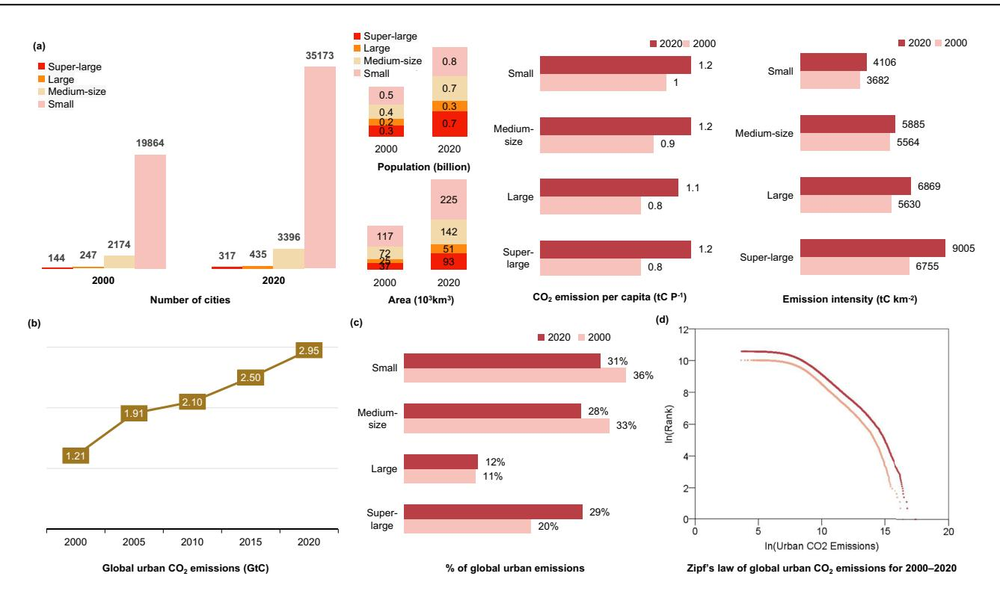
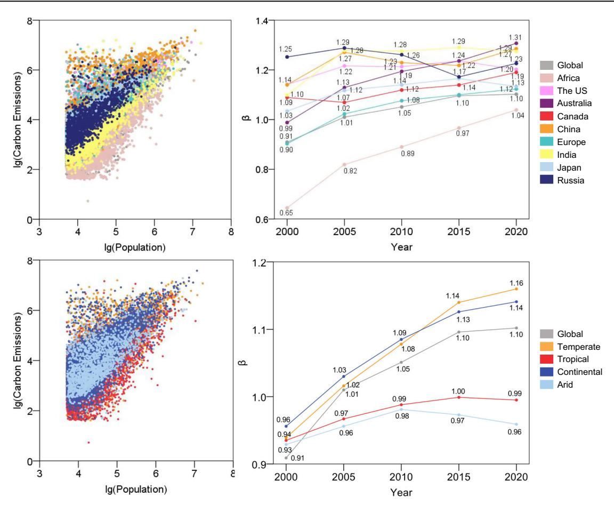
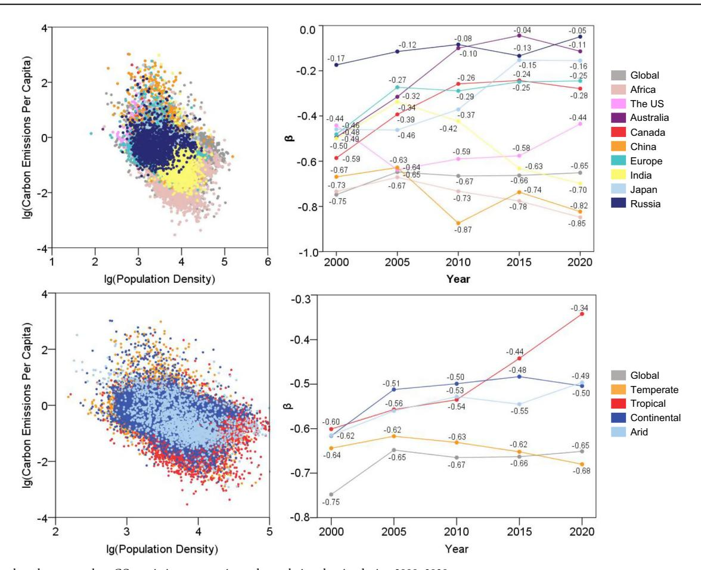
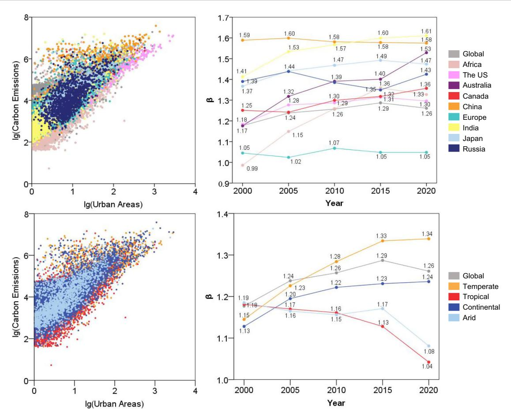
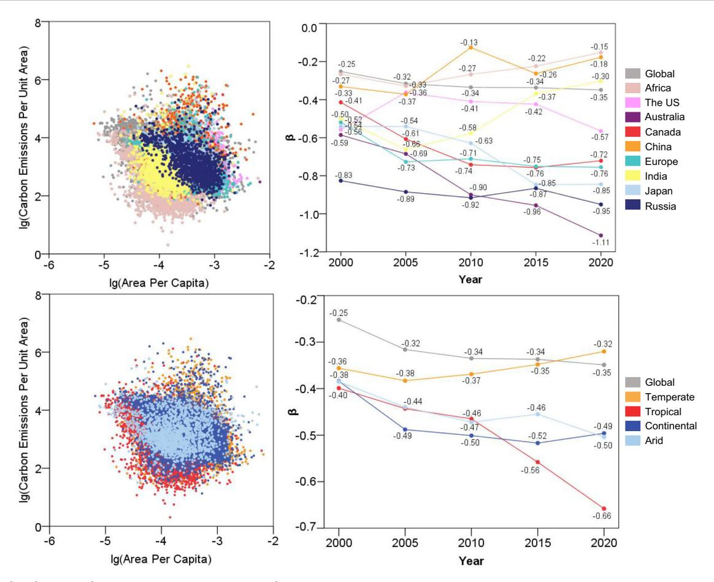
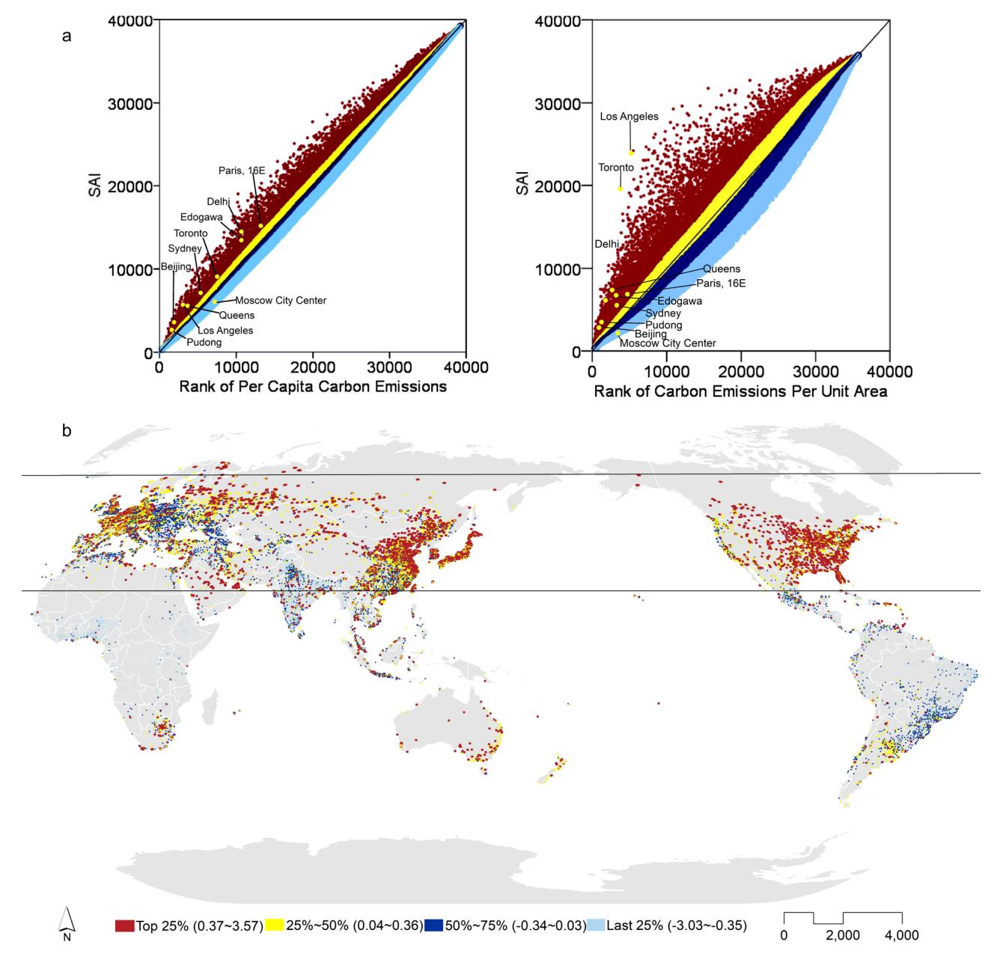

Published in partnership with RMIT University

https://doi.org/10.1038/s42949-024-00172-x

# Scaling laws of CO2 emissions during global urban expansion

Check for updates

Zhenshan Yang 1,2 ⊠, Junkang Wu³, Xu Shang1,2, Runde Fu1,2, Liou Xie 4 & Quansheng Ge 1,2 ⊠

Continuous urbanisation, rising energy usage, and CO2 emissions challenge global sustainability. Current understanding is fragmented due to regional research differences and conflicting data sources. We used RS and GIS technologies to create a comprehensive dataset on global urban CO2 emissions (2000–2020). Besides population and density, we included land area size and physical compactness. Our findings indicate that higher population density may reduce emissions, physical compactness can increase them, and land area size influences emissions more than population size. Thus, strategic planning is essential for emission reduction. We found varied relationships between per capita emissions and population density and between emission intensity and compactness. Different cities face unique challenges based on location and development stage. Developing economies, especially in Africa, face significant challenges as emission scaling shifts from sublinear to superlinear with urbanisation. Large cities should reduce fossil fuel use and adopt eco-friendly technologies, while smaller cities should enhance emission efficiency.

Cities serve as the primary hubs of human activities and anthropogenic CO2 emissions. Therefore, there is an urgent need to understand the dynamics and laws governing urbanisation and global CO2 emissions. Cities are complex systems that can be likened to living organisms1. They exhibit nonlinear relationships among their main indicators during their growth. This observation has led to the introduction of an urban scaling law, proposing that cities are quantitatively predictable owing to agglomeration effects2. The universal nature of scaling has been supported by several studies, which demonstrated the applicability of scaling to various urban indicators, including economic outputs, innovation, crime rates, road length, gasoline stations, job opportunities, and drinking water availability3. Furthermore, exploring whether a scaling relationship exists between CO2 emissions and urban sizes has gained considerable attention. However, previous studies on this topic primarily focused on country-level analyses or specific city groups4,5. Given the ongoing global urbanisation trend and the pressing challenge of climate change, it is imperative to understand the laws and dynamics governing urban CO2 emissions on a global scale.

In urban systems, two approaches have been adopted to address the scaling property of  $CO_2$  emissions. The first approach considers urban  $CO_2$  emissions (C) as a power-law function of population size (P), defining  $C \sim P^{\beta}$ , where  $\beta$  represents the scaling exponent. This analysis describes the scale of  $CO_2$  emissions with respect to population size. When  $\beta > 1$ , a superlinear relationship exists, indicating that larger cities emit higher amounts of  $CO_2$  relative to their size. Conversely, a sublinear relationship

 $(\beta<1)$  suggests that larger cities emit lower amounts of CO2 relative to their size, whereas a linear relationship  $(\beta\approx1)$  denotes constant returns to scale for CO2 emissions and population size. The second approach explores CO2 emissions per capita, which are influenced by population density, and can be expressed as  $C/P \sim (P/A)^\beta$ , where A represents the urban area. However, a consensus on the results of urban scaling of CO2 emissions has not been reached. For the  $C \sim P^\beta$  relationship, previous studies have reported nearly linear scaling ( $\beta=0.933$ )6, sublinear scaling ( $\beta=0.77$ )7, and even superlinear scaling ( $\beta=1.46$ ) for US cities8. These discrepancies can be attributed to the different sources and categories of data used in these studies. Some have collected statistical data based on the definition of metropolitan areas6, whereas others have used the definition of connected urban areas8.

Previous studies examining  $CO_2$  emissions were limited to a few countries or regions, which hampers our understanding of the global urban system and its impact on  $CO_2$  emissions. Studies have also examined the scaling effect of population size  $(C \sim P^{\beta})$  on  $CO_2$  emissions for European cities  $(\beta = 1.12)^2$  and Chinese cities  $(\beta = 0.6477)^9$ . Emissions per capita for US cities  $(\beta = -0.78 \sim -0.82)^{10}$  and Chinese cities (which vary significantly across regions) have also been examined. Although the scaling law has garnered interest in other countries, such as Brazil11, its application to  $CO_2$  emissions has not been explored. Attempts have been made to measure city emissions globally, such as a study by ref. 12, which included a group of 256 cities worldwide, which suggested superlinear scaling for cities in developing countries and sublinear scaling for developed ones based on

1Institute of Geographical Sciences and Natural Resources Research, Chinese Academy of Sciences, Beijing, 100101, China. 2College of Resources and Environment, University of Chinese Academy of Sciences, Beijing, 100039, China. 3Shaanxi Normal University, Xi'an, 710119, China. 4Center for Earth and Environmental Science, State University of New York at Plattsburgh, Plattsburgh, NY, 12901, USA. —e-mail: yangzs@igsnrr.ac.cn; gegs@igsnrr.ac.cn

population size, and that by ref. 5, which calculated the scaling relationship of per capita  $\mathrm{CO}_2$  emissions for 20 cities across different continents. However, these studies have limitations, as the limited number of cities included cannot capture the complexity of global urban systems. Additionally, the data used in these studies are highly selective and represent a segment of city growth or part of the entire global urban system, potentially leading to misleading or biased results. Despite the significant urbanisation trends in this century, our knowledge of urban scaling of  $\mathrm{CO}_2$  emissions for populous and rapidly urbanising countries or regions, such as India and the African continent, is limited except for China.

Our study makes several contributions to the understanding of global urban CO2 emissions. First, we derived a dataset of global urban CO2 emissions for multiple periods, which can be regularly updated to provide consistent monitoring of urban CO2 emissions with the advance of global urbanisation and support the assessment and management of Sustainable Development Goal (SDG) 13 (climate action) and SDG 4 (sustainable cities). The two issues listed here are correlated and require a refined approach to establish a dataset with consistently defined units of analysis that measures the urban scaling of CO2 emissions at the global level to clarify the extent to which CO2 emissions are associated with urban characteristics. To establish this dataset, we adopted advanced remote sensing and geoinformation science technology. We derived geo-coded global urban CO2 data at a 1 × 1 km grid size resolution by combining data sources such as ESACCI (land use), Landscan Global (population), GADM (geoboundary and administration), and ODIAC (anthropogenic CO2) (Methods). To the best of our knowledge, this dataset represents the most accurate measurement of urban CO2 emissions. Given the diverse and incompatible definitions of urban areas and cities worldwide, we defined urban areas as connected builtup areas covering at least 1 km2 with a total population of at least 5000 (Methods). We compared the geographical and administrative boundaries of these areas and excluded small scattered areas from our analysis.

Second, our study facilitates temporal comparisons of global urban systems. It is important to note that urban systems are path-dependent, evolving based on their historical context13. Our analysis covers five years: 2000, 2005, 2010, 2015, and 2020. We investigated sub-systems in key countries and regions, which allows a comparison of urban CO2 emissions using the same data and standards. Specifically, we focused on European nations (excluding Russia), which possess some of the oldest extant urban systems in the world2, the US, which is known for its well-developed urban system in the last century, China, which has experienced the fastest urbanisation in recent decades, as well as India and Africa, which will be the major areas of urbanisation in the coming decades. We also included Russia and Australia in our analysis. Additionally, we considered different latitude regions because natural conditions can influence energy usage, human behaviour, and city development. This approach enabled us to assess regional and national variations within distinct socioeconomic and natural contexts

Lastly, with respect to urban characteristics, we expanded beyond population and population density as primary indicators by including the analysis of urban areas and area emission intensity. Although population size is commonly used to gauge the role of (de)urbanisation in climate mitigation and indicates the relative importance of a city within the urban system, it has certain limitations as it is often strongly correlated with other socio-economic indicators between the sprawl, for example, can negatively impact social welfare, increase commuting times, and raise energy consumption. Area is an important indicator of city size. Larger cities often exhibit complex urban forms and a greater diversity of human activities. Recent studies have attempted to summarise urban  $CO_2$  emissions as a function of the interaction between population and area  $(P \times A)^{16}$ . However, this approach overlooks the strong correlation between these two aspects of urban development and fails to consider the impact of population density and urban form.

Population density reflects how people live within a settlement. For example, Asian cities typically have higher population densities compared to those in the US. Although some studies considered population density as an

indicator of urban form6, it primarily reflects human behaviours related to aspects such as transportation, lifestyle, and consumption rather than landrelated issues. Population density is directly linked to urban functions such as housing, transportation, and recreational and institutional facilities10, which can vary between low-density and high-density cities of different sizes. For instance, in the US, "doubling residential density across a metropolitan area might lower household VMT (vehicle miles travelled) by approximately 5-12%, and perhaps by as much as 25%, if coupled with higher employment concentrations, significant public transit improvements, mixed uses, and other supportive demand management measures" 18. In cities like Paris, London, Berlin, and Istanbul, neighbourhoods with tall buildings demonstrate higher heat-energy efficiency compared to those with detached housing 19. Therefore, the relationship  $C/P \sim (P/A)^{\beta}$  reflects CO2 emissions in connection with human behaviours, as people residing in different cities may contribute to varying levels of CO2 emissions, which are strongly influenced by population density.

To closely examine the relationship between CO2 emissions and urban form and spatial structure, it is important to have a comprehensive understanding of urban areas. In addition to technological and market methods, urban planning can serve as a vital pathway for emission reduction20. Built-up areas are a key variable used to measure urbanisation in space, and the power-law function  $C \sim A^{\beta}$  is employed to quantify urban  $CO_2$  emissions of urban areas. Urban  $CO_2$  emission intensity (C/A) reflects emissions during land development, as cities with varying urban forms, infrastructure, facilities, and buildings may generate different levels of CO2, as indicated by the land use metric land area per capita (A/P). A/P provides insights into land-use efficiency, where lower land area per capita suggests more efficient land utilisation. This concept forms the crux of the theory of compact cities, which posits that geographic efficiency and physical compactness can optimise land-use functionality. However, empirical studies have presented contrasting findings. Some studies demonstrated that compact cities can reduce CO2 emissions by reducing household heating21 and commuting trips22, whereas other studies argued that physical compactness exacerbates the urban heat island effect, leading to increased demand for cooling and higher energy consumption because of the lack of green spaces23. These studies suggested that urban function and urban form, although closely related, are not always synonymous. Population density and urban land use per capita represent the compactness of urban populations and the urban built environment, respectively24. Urban areas and land area per capita serve as more suitable indicators for assessing urban form and spatial structure.

Therefore, changes in the four metrics population, land area size, population density, and physical compactness are a reflection of human activities that transform the natural environment, and they reflect changes in the natural environment and impact functional spaces within cities and the avenues for humans to engage in natural-social transformations24. Moreover, these metrics are meaningful in implementing urban design and planning concepts to deal with CO2 emissions25. In this article, we explore the four complementary approaches that provide a comprehensive global perspective on the scaling of urban CO2 emissions and their implications for urban planning and policy in the context of climate change.

#### Results

# Global overview of urban expansion and CO2 emissions

The world's cities have experienced rapid growth in recent decades, with the number of cities increasing from 22,429 in 2000 to 39,321 in 2020, based on the definition of cities as built-up areas with an area of at least 1 km² and a population with a minimum of 5000 people (Fig. 1a). By 2020, approximately 261,000 km² of land had been transformed to urban area since 2000. This trend has continued and generated 1.1 billion new urban dwellers, which is considerable compared to the global population growth of 1.68 billion inhabitants. These figures highlight the significance of cities as the primary areas where people pursue economic prosperity and social welfare, with urbanisation corresponding to population concentration, industrial agglomeration, infrastructure development, and changes in land use.

Fig. 1 | Growth of cities and increase in urban CO2 emissions globally. a Changes in global urban systems and CO2 emissions, including the number of cities, urban population, area, CO2 emission per capita, and emission intensity of urban areas;

**b** global urban  $CO_2$  emissions; **c** proportion of  $CO_2$  emissions according to different city sizes in the global urban system; and (**d**) Zipf's law of global urban  $CO_2$  emissions for 2000–2020.

However, these human activities are not uniformly distributed across the planet, thus giving rise to various urban systems. In 2020, the US accounted for 8.7% of the global urban population, Europe accounted for 9.9%, East Asia accounted for 21.9%, and Africa accounted for 13.8%.

The rapid growth of cities has led to increased CO2 emissions, which pose a significant challenge to future climate and sustainability. In 2020, these emissions amounted to 2.95 gigatonnes of carbon (GtC) (Fig. 1b), accounting for approximately 32.7% of global emissions for that year. Over the past two decades, emissions have increased by 1.42 times, with a growth of 0.75 times between 2000 and 2010 and 0.38 times between 2010 and 2020. Notably, the distribution of emissions across cities was uneven (Fig. 1c), while the proportion of global emissions remained relatively stable between 2000 and 2020. Super-large cities (cities with an urban population over 1 million) contributed 25.6%  $\pm$  3.1% of the global emissions, large cities (with an urban population between 0.5 million and 1 million) contributed  $11.7\% \pm 0.3\%$ , medium-sized cities (with an urban population between 0.1 and 0.5 million) contributed 29.7%  $\pm$  1.6%, and small cities (with an urban population between 10,000 and 100,000) contributed  $33.0\% \pm 1.8\%$ . This distribution remained relatively stable despite changes in the number of cities in each category. The per capita CO2 emissions also remained stable at approximately 1.06 tonnes of carbon (tC) for all cities. When measured based on urban land area, the intensity of emissions displayed a gradient, with super-large cities emitting 8392 tC km-2, large cities emitting 6420 tC km-2, medium-sized cities emitting 5779 tC km-2, and small cities emitting 3947 tC km-2 (Fig. 1a).

An analysis based on Zipf's law revealed that the trend of  $\rm CO_2$  emissions became more serious (Fig. 1d). For example, cities with the same ranking emit increasing amounts of  $\rm CO_2$  over time. In 2000, there were 144 super-large cities, accounting for 0.6% of the total number of cities worldwide and emitting 20.3% of global urban  $\rm CO_2$  emissions. In 2020, 317 superlarge cities (0.8% of the total number of cities globally) contributed to 28.5% of global  $\rm CO_2$  emissions. When combined with large cities, these two categories accounted for approximately 40% of urban  $\rm CO_2$  emissions after 2015 despite representing only 2% of cities globally.

#### Urban scaling relationships of CO2 emissions

Population size is a key indicator that is often strongly correlated with other socio-economic indicators15 and provides insights into the general trend of urbanisation's impact on climate change, particularly in terms of anthropogenic emissions. This indicator is crucial for policymakers and planners as they strive to balance promoting urban population growth and implementing measures and regulations to mitigate its associated effects. From 2000 through 2020, the scaling component ( $\beta$ ) for urban populations increased from 0.91 to 1.10, implying that CO2 emissions have been growing at a faster rate than population growth in urban areas. This finding highlights that regulating the growth of large cities is a major global concern. Large cities face enormous social pressures due to their sheer size and complexity26, and the agglomeration of population continues to increase carbon emissions with industrial and transportation growth27.

Variations among countries were observed for this metric. For European and Japanese cities, the scaling component remained relatively stable at approximately 1 between 2000 and 2020, suggesting a more or less proportional increase in CO2 emissions with population growth. In contrast, a significant increase was observed for Africa (from 0.65 to 1.04) and Australia (from 0.99 to 1.31), indicating the immense pressure faced by these regions in controlling CO2 emissions with increasing urbanisation. Africa's energy intensity remains the highest in the world, increasing from 2.6 times in 1990 to 2.7 times in 2013 more than the global average, and continues to rise28,29. Australia is also experiencing a steady increase in carbon emissions, making it difficult to achieve the 2030 emissions reduction agenda30. The scaling component for the US, China, Canada, and Russia was quite similar at approximately 1.2. This is due to the fact that these developed economies, have generally developed a "decoupled" industrial structure and show increasing concern for environmental protection, active energy conservation, emission reductions, and vigorous green technology development. China is also approaching the transition from its fast-growth stage under the carbon neutral goal, as its economic growth rate is slowing down31.

Geolocation may be another important factor when examining emissions because daily behaviours, construction materials, and energy use for

Fig. 2 | Scaling laws between urban CO2 emissions and population size during 2000–2020. Note: few cities are located in the polar zone, with approximately 40 cities in each period; thus, this zone was not included in the analysis.

production and consumption can vary based on climate and temperature. Our analysis revealed that the scaling component rapidly increased from 0.94 to 1.16 for cities in the temperate zone, and from 0.96 to 1.14 for the continental zone from 2000 to 2020, which may have been due to the rapid urban development of these zones. Rapid urbanisation is accompanied by a steady increase in residential consumption patterns and energy consumption, especially for fossil-fuel-dependent heating and cooling and electricity supply systems in cities in temperate region[s32,33](#page-9-0). In contrast, the scaling component increased slowly and even dropped after 2010 for cities in the arid zone and 2015for cities in the tropical zone,whichwas possibly because these zones, such as the African continent, are still at a relatively low development stage. Africa currently accounts for only 3% of the world's carbon emission[s34](#page-9-0), and after nearly 30 years of rapid industrialisation and the introduction of foreign direct investment, the CO2 emissions from these cities have only begun to rise steadil[y35](#page-9-0) (Fig. 2).

Although population size is the key indicator of urbanisation, it has limited applicability for understanding the characteristics and behaviours of citizens. For instance, suburban households may have higher energy consumption than urban household[s10](#page-8-0). The relationship between CO2 emissions per capita and population density can be associated with the construction and road sectors, with β ≈−0.8 observed in US cities[10,16.](#page-8-0) Additionally, cities with high population density tend to have lower per capita gasoline consumption compared to cities with low population densit[y36](#page-9-0).

Globally, the scaling component for this relationship was −0.748 in 2000, which gradually changed to −0.651 in 2020, indicating that an increase in population density may lead to a reduction in CO2 emissions per capita. However, the impact has diminished, likely due to increased consumption as the world becomes more affluent.

Clear discrepancies were observed among countries. The negative impact of population density on per capita CO2 emissions has been increasing in Africa, India, and China over the past 20 years, as these regions have experienced rapid urban population growth. From 2000 to 2020, Africa, India, and China witnessed urban population increases of 105.50[%37](#page-9-0), 66.36[%38](#page-9-0), and 97.83[%39](#page-9-0), respectively. In contrast, the impact of population density on emissions per capita decreased in Japanese, European, Canadian, and Australian urban systems in which many cities witnessed a population decline due to factors such as decreasing fertility rates and an ageing population[40](#page-9-0)–[43](#page-9-0). For US cities, the impact initially increased from 2000 to 2005, but subsequently decreased, reaching a range of approximately −0.44 to−0.6from 2005 to 2020. This impactis lower than the previously reported values of approximately −0.[810,16](#page-8-0), which could be attributed to differences in the measurement criteria used in this study as we focused on connected urban areas with a minimum population of 5000.

Geolocational analysis revealed significant differences among cities located in different temperature zones in terms of the effects of the scaling factors of population density on emissions. Scaling components for cities in the temperate zone levelled off and slightly dropped, indicating that the emissions measured per capita were stable relative to those measured by population density. In comparison, the scaling components for cities were higher in arid and continental zones, implying less efficient energy and resource use and greater associated emissions. These regions have greater energy consumption and emission problems due to their energy consumption structure, industrial structure, and climatically adapted building and transportation modes. For example, the average CO2 emissions in Africa increased rapidly from 452,922.6 kilotonnes from 1980 to 1989 to 775,774 kilotonnes from 2010 to 2014, which was driven by crude technology and rapid industrialisation[35.](#page-9-0) The scaling factor increased rapidly

 $\textbf{Fig. 3} \mid \text{Scaling laws between urban } CO_2 \text{ emissions per capita and population density during } 2000-2020.$ 

from -0.60 to -0.34 for cities in the tropical zone. This was because under a rough energy consumption model, population agglomeration can significantly improve energy efficiency by realising more centralised infrastructure, efficient public transportation systems, and optimal allocation of resources, which can contribute to more rapid and greater carbon emission reductions  $^{5,44}$  (Fig. 3).

Although urban population is often associated with urban areas, the size of urban areas is an important indicator of urban form and land development. A larger land area allows cities to have more diverse urban functions, including housing, industries, transportation, recreation, and institutional facilities. Therefore, it is crucial to examine the trade-off between the benefits of urban growth and the associated CO2 emissions. At the global level, the scaling factor has remained at approximately 1.2 over the past two decades, implying that a 1% increase in urban land results in a 1.2% growth in CO2 emissions. However, this relationship varies greatly. The relationship was linear for Europe (1.05) and superlinear for the US (1.30), Canada (1.36), Russia (1.43), Japan (1.47), Australia (1.53), China (1.58), and India (1.61) in 2020, and it changed from sublinear in 2000 to superlinear after 2005 in Africa. Although the scaling factor was very high in China, it decreased from 2000 to 2020, thus reflecting the emission reduction efforts made by Chinese cities, which represent the largest urban system in the world. Additionally, cities in hotter areas may have lower emissions than those in colder areas, with factors of 1.35 for the tropical zone, 1.36 for the temperate zone, and 1.47 for the frigid zone on average during 2000–2020. The climatic characteristics of tropical cities greatly reduce the amount of energy needed to heat buildings, which can significantly reduce energy consumption and carbon emissions compared to cities in colder regions, which must rely on coal, gas, and electricity to provide centralised or decentralised heating45

In terms of geolocation, diverse trends were observed, with increases observed for temperate and continental zones and decreases observed for arid and tropical zones. Thus,  $CO_2$  emissions from cities in temperate and continental zones are increasing at a faster rate than those from urban areas, while  $CO_2$  emissions from cities in tropical and arid zones are lagging behind those from urban areas. This finding is consistent with the current rapid growth of cities in tropical regions, including Africa and South Asia, particularly Africa, which is one of the fastest urbanising regions in the world 34,47 (Fig. 4).

Land area per capita is a commonly used parameter for assessing landuse efficiency, and larger values indicate more inefficient use of land. An alternative approach for assessing land-use efficiency is the compact city theory, which emphasises the physical compactness of cities. This theory aims to optimise the functional aspects of urban built environments and promote geographic efficiency  $^{14}$ . In general, a negative sublinear scaling relationship occurs between  $CO_2$  emission intensity and land-use inefficiency, with variations ranging from -0.25 to -0.35 at the global level between 2000 and 2020.

Land use per capita is closely related to planning culture, and the scaling effect varies due to different planning cultures worldwide. For example, the scaling factor ranged from -0.36 to -0.57 for the US, -0.41 to -0.76 for Canada, -0.52 to -0.76 for Europe, -0.54 to -0.85 for Japan, and -0.83 to -0.95 for Russia during the specified period. In particular, the factor considerably changed from -0.6 to -1.1 for Australia. Notably, these countries and regions have relatively modern urban systems with a long history. In comparison, such an effect was relatively low for countries and regions with 'new' urban systems, such as Africa (-0.15), China (-0.18), and India (-0.30), in 2020, for which the scaling effect was lower. Thus, greater land use leads to limited reductions in emissions per unit area.

Fig. 4 | Scaling laws between urban  $CO_2$  emissions and urban areas between 2000 and 2020.

The negative scaling relationships indicate that higher land-use efficiency may be associated with lower emissions per area. Some studies have suggested that the urban heat island effect, often a result of compactness, can lead to higher emissions in certain areas, as reflected in emission intensity. However, this study measured the average status of entire built-up areas, suggesting that discrepancies among studies on emissions in compact cities24,25,48 arise from differences in measurement approaches.

In comparison, the scaling factor for cities in the temperate zone increased from -0.36 to -0.32, implying that people in this area occupied more land, although emissions were not reduced based on land area. The scaling factor decreased dramatically for the topical zone, which may be related to a more spacious land area available for urban use. For example, due to the relative abundance of land resources and relative lack of industrial development in Africa, urban sprawl is not overly dense; thus,  $\mathrm{CO}_2$  emissions have not increased rapidly compared to the rapid increase in per capita land area  $^{49}$  (Fig. 5).

Given that city parameters are closely related to city size  $^{50}$ , such as the higher population density in larger cities, scale-independent ranking (SAI) (as a dimensionless measurement) is used to measure and rank cities based on their  $CO_2$  emissions per capita and emission density, independent of city size  $^{50}$ . Following such analysis,  $CO_2$  emissions per capita and emission density are evidently overestimated in larger cities, whereas those in smaller cities are underestimated. Thus, it would be unwise to overlook emissions in small cities, as they could have higher  $CO_2$  emissions if they were the same size as larger cities.

Irrespective of scale, cities with high CO2 emissions per capita are concentrated in the US, Western Europe, Russia, China, Japan, and South Korea. These cities form a belt along the latitude range of 26°9′N–70°29′N, where approximately 68.4% of the top 25% *SAI* cities are located. Three additional concentration areas include southeast Australia and New

Zealand, South Africa, and Argentina. Conversely, cities with low  $CO_2$  emissions per capita are mainly found in Brazil, India, and western Africa (Fig. 6). In terms of  $CO_2$  emissions per unit area, cities with high scores are mainly located in East and South Asia.

#### **Discussion**

Cities serve as natural and social experiments, embodying both complex systems and heterogeneous characteristics. Utilising a global dataset with uniform and consistent definitions, we examined global urban  $\rm CO_2$  emissions in the 21st century, focusing on four pairs of scaling relationships: total emissions with population size, total emissions with urban land area size, emission per capita with population density, and emission intensity with physical compactness. Our findings revealed that scaling represents an important relationship between population and land area size and emissions, with land area size exerting a stronger influence than population size. Notable, the former remains fairly constant while the latter increases. Therefore, there is a need for more deliberate planning measures.

These systematic scaling relationships highlight how cities, within a broader paradigm, necessitate energy consumption to maintain structure and order. In this regard, cities can be explained using natural laws with flows, nonlinearities, and feedback loops integrating complex interactions among the individuals, households, firms, and these actors and their activities operating in spaces6. Furthermore, cities possess distinct social characteristics, as evidenced by scaling relationships, particularly in the context of emissions per capita with population density and emission intensity with physical compactness owing to path dependency, historical factors, and diverse planning cultures and practices across different urban systems13. Our research sheds light on the paradoxical view of urbanisation: some perceive cities as natural organisms3, whereas others emphasise their social and human heterogeneity13.

Fig. 5 | Scaling laws between urban CO2 emissions per unit area and area per capita

Our analysis highlights the inherent challenges posed by urbanisation in addressing climate change, necessitating the forging of synergy among various SDGs, notably SDG 13 (climate action), SDG 11 (sustainable cities), and SDG 8 (economic growth). Such challenges are evidenced by the continuously advancing ranking distribution frontier (Zipf's law) from 2000 to 2020 and the superlinear scaling relationship between urban population and area size and emissions. Currently, global urban emissions are disproportionally concentrated in large cities in which controlling and reducing emissions become increasingly difficult as city size increases. However, scalefree analysis cautions against underestimating small cities in terms of CO2 emissions per capita and density. In emerging urbanising regions, such as Africa, CO2 emissions are increasing at a faster rate than urban population and land area, highlighting the potential benefits of smarter emission strategies for these cities. To achieve this, a 'learning alliance' mechanism could be established between 'mature and young' cities, facilitating the exchange of ideas, policymaking, planning techniques, and other measures to help young cities minimise their emissions, driven by the underlying principles at play.

Our analysis of the relationship  $C/P \sim (P/A)^{\beta}$  demonstrates that higher population density may contribute to lower urban CO2 emissions overall, underscoring the significance of population density as a crucial parameter for urban planning and management in combating climate change. However, it is important to note that high land-use intensity is associated with higher emissions per area. Thus, sophisticated planning and management approaches are necessary to strike a balance between population density and land-use intensity, such as the adoption of a polycentric city structure, which could serve as a key solution towards achieving the aforementioned goals. For example, population density may increase emissions in a particular area but decrease emissions over a wider region. Thus, a tipping point or relationship between these factors should be investigated. Additionally, promoting innovation and the widespread application of eco-friendly technologies to support urbanisation is crucial. Significant efforts are required in this regard, as evidenced by the continued increase in urban emissions, particularly in large cities, which are hubs of innovation.

Our study is based on an ODIAC dataset, which is a production-based accounting approach that is heavily reliant on night-time light data. Although the dataset used here has been improved based on the calibration of power plant emissions, it might be biased in areas where there is a lack of night-time light. More importantly, as cities continuously interact with their hinterlands and exchange energy and materials with areas outside city limits, urban CO2 emissions are not limited to their built-up area. Therefore, a consumption-based accounting approach is required to consider indirect emissions during urban expansion in future studies.

# Methods

#### Zipf's law

Following the rank-size rule, Zipf's law51 was used to examine the distribution characteristics of city size.

$$InR = lnK - \alpha lnP + \epsilon, \qquad (1)$$

where R represents the rank of cities, P denotes the population size of cities,  $\alpha$ refers to the Pareto index, K is a constant, and  $\varepsilon$  represents the perturbation term. If the Pareto index α equals 1, it indicates conformity with Zipf's. A smaller α value signifies a more concentrated distribution of city sizes, resulting in an increased population size gap between cities.

#### Scaling measurement

The urban scaling law demonstrates the quantitative relationship between city indices and population size at the same time point within a city system.

Fig. 6 | Scale-independent ranking and its global distribution based on SAI. a Ranking and of  $CO_2$  emissions per capita and density from 2000 to 2020. The straight line in the figure is a 1:1 indicator line. Cities located on the lower right side

of the line are ranked lower than the SAI, and the ones on the upper left side are ranked higher than the SAI.  $\bf b$  Distribution of with respect to  ${\rm CO_2}$  emissions per capita and population density.

The equation takes the form of a power function:

$$Y = Y_0 N^{\beta}, \tag{2}$$

where Y represents the city index, such as built-up area or urban  $CO_2$  emission, N denotes the urban population size, Y0 and  $\beta$  are parameters, and  $\beta$  is the scaling component factor. By taking the logarithm of both sides of Eq. (2), we obtain Eq. (3):

$$\log Y = \beta \times \log N + \log Y_0, \tag{3}$$

The urban scaling law pertains to the dynamics of urban systems. Traditionally, per capita indicators have been used to measure urban performance, such as per capita GDP or per capita patent numbers. However, this approach overlooks the nonlinear scaling relationship between urban indicators and population size. To eliminate the influence of urban

population size, ref. 50. proposed scale-adjusted metropolitan indicators (SAMI). In this study, we adopted a similar concept, proposing a scale-adjusted indicator as follows:

$$SAI_i = \log Y_i - \log(Y_0 N_i^{\beta}) = \log(Y_i / Y_0 N_i^{\beta}), \tag{4}$$

where  $SAI_i$  is an indicator (such as GDP) of city i that eliminates the impact of size, which is the residual of the fitting equation of population size of the city indicator, representing the degree of deviation from its expected value.  $Y_i$  is the true value of an index for city i,  $Y_0N_i^\beta$  represents the estimated value of an indicator for city i,  $N_i$  signifies the permanent population size of city i, and  $Y_0$  and  $Y_0$  are the fitting parameters.

#### Robustness analysis

To ensure data reliability, in addition to extracting cities based on connected built-up areas with a minimum 5000 inhabitants for each

period, we re-extracted all data using 2010 as the base year to measure place-focused city growth. Patches that had not developed into cities by 2000 and 2005 were considered as cities, whereas some cities in 2015 and 2020 were excluded, that is, thus ensuring a consistent number of cities for each year. Comparing the results of the two derived datasets confirmed the reliability of our analysis (Supplementary Information).

#### Identification and derivation of cities worldwide

Defining cities is critical; however, the definition used for cities varies worldwide2. The Organisation for Economic Cooperation and Development has made significant efforts to define functional cities based on connected built-up areas, which is conceptually meaningful and empirically consistent, facilitating global investigation and comparison52. Additionally, many countries utilise population as a key indicator for defining cities, often employing a threshold of 5000 inhabitants52,53. Accordingly, cities in this study were defined and measured based on connected built-up areas over 1 km2 inhabited by at least 5000 individuals.

Built-up area was derived from global land-use data with a spatial grid resolution of 300 m obtained from the European Space Agency Climate Change Initiative dataset. Global population data were obtained from Landscan Global, which is part of ORNL's Landscan program. Additionally, administrative boundaries of countries and cities worldwide were acquired from the Global Administrative Division Database (GADM) to assist with the analysis. The analytical periods considered in this study were 2000, 2005, 2010, 2015, and 2020.

#### Calculating CO2 emissions

To calculate  $CO_2$  emissions, we utilised the urban areas and aggregated monthly emission data for each analysed year. These data were obtained from the ODIAC Fossil Fuel Emission Dataset published by the Global Environmental Research Centre (Nike.go.JP), at a spatial resolution of  $1 \times 1$  km. The records covered the period from 2000 to 2019, and data from 2019 were used as a proxy for 2020.

#### **Data availability**

The data generated and analysed during the study are described in the manuscript and are available upon reasonable request.

Received: 5 October 2023; Accepted: 25 June 2024; Published online: 12 February 2025

#### References

- Bettencourt, L. M. A., Lobo, J., Helbing, D., Kuhnert, C. & West, G. B. Growth, innovation, scaling, and the pace of life in cities. *Proc. Natl Acad. Sci. USA* 104, 7301–7306, https://doi.org/10.1073/pnas.0610172104 (2007).
- Bettencourt, L. M. A. & Lobo, J. Urban scaling in Europe. J. R. Soc. Interface. 13, https://doi.org/10.1098/rsif.2016.0005 (2016).
- 3. Bettencourt, L. M. A. The origins of scaling in cities. *Science* **340**, 1438–1441 (2013).
- Gudipudi, R. et al. The efficient, the intensive, and the productive: Insights from urban Kaya scaling. Appl. Energy 236, 155–162 (2019).
- Wu, D., Lin, J. C., Oda, T. & Kort, E. A. Space-based quantification of per capita CO2 emissions from cities. *Environ. Res. Lett.* 15, https:// doi.org/10.1088/1748-9326/ab68eb (2020).
- Fragkias, M., Lobo, J., Strumsky, D. & Seto, K. Does size matter? Scaling of CO2 emissions and U.S. urban areas. *PLoS ONE* 8, e64727 (2013).
- Zheng, B. J., de Beurs, K. M., Owsley, B. C. & Henebry, G. M. Scaling relationship between CO pollution and population size over major US metropolitan statistical areas. *Landsc. Urban Plan.* 187, 191–198 (2019).
- Oliveira, E. A., Andrade, J. S., Jr. & Makse, H. A. Large cities are less green. Sci. Rep. 4, https://doi.org/10.1038/srep04235 (2014).

- Cui, C., Cai, B., Bin, G. & Wang, Z. Decennary spatial pattern changes and scaling effects of CO2 emissions of urban agglomerations in China. Cities 105. 102818 (2020).
- Gudipudi, R., Fluschnik, T., Ros, A. G. C., Walther, C. & Kropp, J. P. City density and CO2 efficiency. *Energy Policy* 91, 352–361 (2016).
- Meirelles, J., Neto, C. R., Ferreira, F. F., Ribeiro, F. L. & Binder, C. R. Evolution of urban scaling: evidence from Brazil. *PLoS ONE* 13, https://doi.org/10.1371/journal.pone.0204574 (2018).
- 12. Rybski, D. et al. Cities as nuclei of sustainability?. Env. Plan. B Urban Anal. City Sci. 44, 425–440 (2017).
- Depersin, J. & Barthelemy, M. From global scaling to the dynamics of individual cities. *Proc. Natl Acad. Sci. USA* 115, 2317–2322 (2018).
- Ma, M., Rozema, J., Gianoli, A. & Zhang, W. The impacts of city size and density on CO2 emissions: evidence from the yangtze river delta urban agglomeration. *Appl. Spat. Anal. Policy* 15, 529–555 (2022).
- 15. Curiel, R. P., Cabrera-Arnau, C. & Bishop, S. R. Scaling Beyond Cities. Front. Physics 10, https://doi.org/10.3389/fphy.2022.858307 (2022).
- Ribeiro, H. V., Rybski, D. & Kropp, J. P. Effects of changing population or density on urban carbon dioxide emissions. *Nat. Commun.* 10, https://doi.org/10.1038/s41467-019-11184-y (2019).
- Batty, M. & Ferguson, P. Defining city size. *Environ. Plan. B Plan. Des.* 38, 753–756 (2011).
- National Research Council. Driving and the built environment: the effects of compact development on motorized travel, energy use, and CO2 Emissions–Special Report 298. (National Academies Press: Washington, DC, USA, 2010).
- Rode, P., Keim, C., Robazza, G., Viejo, P. & Schofield, J. Cities and energy: urban morphology and residential heat-energy demand. *Environ. Plan. B: Plan. Des.* 41, 138–162 (2014).
- Liu, X., Wang, M., Qiang, W., Wu, K. & Wang, X. Urban form, shrinking cities, and residential carbon emissions: evidence from Chinese cityregions. Appl. Energy 261, 114409 (2020).
- Liu, X. C. & Sweeney, J. Modelling the impact of urban form on household energy demand and related CO2 emissions in the greater dublin region. *Energy Policy* 46, 359–369 (2012).
- Ma, J., Liu, Z. L. & Chai, Y. W. The impact of urban form on CO2 emission from work and non-work trips: the case of Beijing, China. Habitat Int. 47, 1–10 (2015).
- Xu, C., Haase, D., Su, M. R. & Yang, Z. F. The impact of urban compactness on energy-related greenhouse gas emissions across EU member states: population density vs physical compactness. *Appl. Energy* 254, https://doi.org/10.1016/j.apenergy.2019. 113671 (2019).
- Hong, S., Hui, E. C. M. & Lin, Y. Relationship between urban spatial structure and carbon emissions: a literature review. *Ecol. Indic.* 144, https://doi.org/10.1016/j.ecolind.2022.109456 (2022).
- 25. Falahatkar, S. & Rezaei, F. Towards low carbon cities: spatio-temporal dynamics of urban form and carbon dioxide emissions. *Remote Sens. Appl. Soc. Environ.* **18**, 100317 (2020).
- Kennedy, C. A. et al. Energy and material flows of megacities. Proc. Natl Acad. Sci. USA 112, 5985–5990 (2015).
- Yi, Y., Qi, J. & Chen, D. Impact of population agglomeration in big cities on carbon emissions. *Environ. Sci. Pollut. Res. Int.* 29, 86692–86706 (2022).
- Lin, B. & Sai, R. Towards low carbon economy: performance of electricity generation and emission reduction potential in Africa. Energy 251, https://doi.org/10.1016/j.energy.2022.123952 (2022).
- IEA. Global Energy Review 2021. IEA, Paris, https://www.iea.org/ reports/global-energy-review-2021 (2021).
- Acheampong, A. O., Dzator, J. & Amponsah, M. Analyzing the role of economic globalization in achieving carbon neutrality in Australia. *Int. J. Sustain. Dev. World Ecol.* 29, 559–578 (2022).
- Wu, Y., Zhu, Q. & Zhu, B. Decoupling analysis of world economic growth and CO2 emissions: a study comparing developed and developing countries. *J. Clean. Prod.* 190, 94–103 (2018).

- 32. Ali, R., Bakhsh, K. & Yasin, M. A. Impact of urbanization on CO2 emissions in emerging economy: evidence from Pakistan. Sust. Cities Soc. 48, 101553 (2019).
- 33. Martínez-Zarzoso, I. & Maruotti, A. The impact of urbanization on CO2 emissions: evidence from developing countries. Ecol. Econ. 70, 1344–1353 (2011).
- 34. Duan, X., Li, X., Tan, W. & Xiao, R. Decoupling relationship analysis between urbanization and carbon emissions in 33 African countries. Heliyon 8, e0423 (2022).
- 35. Opoku, E. E. O. & Boachie, M. K. The environmental impact of industrialization and foreign direct investment. Energy Policy 137, <https://doi.org/10.1016/j.enpol.2019.111178> (2020).
- 36. Lariviere, I. & Lafrance, G. Modelling the electricity consumption of cities: effect of urban density. Energy Econ. 21, 53–66 (1999).
- 37. Galal, S. Urban population in Africa 2000-2026, [https://www.statista.](https://www.statista.com/statistics/1267863/number-of-people-living-in-urban-areas-in-africa/) [com/statistics/1267863/number-of-people-living-in-urban-areas-in](https://www.statista.com/statistics/1267863/number-of-people-living-in-urban-areas-in-africa/)[africa/](https://www.statista.com/statistics/1267863/number-of-people-living-in-urban-areas-in-africa/) (2023).
- 38. The World Bank. India Urban Population 1960-2023, [https://www.](https://www.macrotrends.net/countries/IND/india/urban-population) [macrotrends.net/countries/IND/india/urban-population](https://www.macrotrends.net/countries/IND/india/urban-population) (2022).
- 39. The World Bank. China Urban Population 1960-2023, [https://www.](https://www.macrotrends.net/countries/CHN/china/urban-population) [macrotrends.net/countries/CHN/china/urban-population](https://www.macrotrends.net/countries/CHN/china/urban-population) (2022).
- 40. Martin, A. K. T. For some shrinking towns in Japan, depopulation isn't all bad news, [https://www.japantimes.co.jp/news/2022/03/28/](https://www.japantimes.co.jp/news/2022/03/28/national/social-issues/japan-tokigawa-depopulation/) [national/social-issues/japan-tokigawa-depopulation/](https://www.japantimes.co.jp/news/2022/03/28/national/social-issues/japan-tokigawa-depopulation/) (2022).
- 41. Haase, A., Bernt, M., Großmann, K., Mykhnenko, V. & Rink, D. Varieties of shrinkage in European cities. Eur. Urban Reg. Stud. 23, 86–102 (2016).
- 42. Jean-Philippe Meloche, S. B., Thibaut, H. & Michaël, T Planning cities facing population decline: a study of shrinking cities in Canada. Can. J. Region. Sci. 41, 9 (2018).
- 43. Australian Bureau of Statistics. The population of the Australian states and local government areas (LGAs) according to official estimates., <https://citypopulation.de/en/australia/admin/> (2022).
- 44. Zhao, M. Z. et al. Labour productivity and economic impacts of carbon mitigation: a modelling study and benefit-cost analysis. Lancet Planet. Health 6, E941–E948 (2022).
- 45. Kumar, M. K. & Nagendra, S. S. Quantification of anthropogenic CO2 emissions in a tropical urban environment. Atmos. Environ. 125, 272–282 (2016).
- 46. Nematchoua, M. K. et al. Transition to zero energy and low carbon emission in residential buildings located in tropical and temperate climates. Energies 14, 4253 (2021).
- 47. Sulemana, I., Nketiah-Amponsah, E., Codjoe, E. A. & Andoh, J. A. N. Urbanization and income inequality in Sub-Saharan Africa. Sust. Cities Soc. 48, 101544 (2019).
- 48. Zhou, B., Rybski, D. & Kropp, J. P. The role of city size and urban form in the surface urban heat island. Sci. Rep. 7, 4791 (2017).
- 49. Dyachia, Z. S., Permana, A. S., Ho, C. S., Baba, A. N. & Agboola, O. P. Implications of present land use plan on urban growth and environmental sustainability in a Sub Saharan Africa City. Int. J. Built Environ. Sustain. 4, 2 (2017).

- 50. Bettencourt, L. M. A., Lobo, J., Strumsky, D. & West, G. B. Urban scaling and its deviations: revealing the structure of wealth, innovation and crime across cities. PLoS One 5, e13541 (2010).
- 51. Zipf, K. G. Human behavior and the principle of least effort. (Addison-Wesley Press, 1949).
- 52. OECD. Redefining "Urban": A New Way to Measure Metropolitan Areas. (2012).
- 53. The World Bank. World Development Report 2009: Reshaping Economic Geography. 383 (Washington DC, 2009).

# Acknowledgements

The research is sponsored by the Strategic Priority Research Program of the Chinese Academy of Sciences (Grant No. XDA23100402 to Zhenshan Yang, and Grant No. XDA23100403 to Quansheng Ge), and sponsored by China National Sciences Foundation (Grant No. 42271249 to Zhenshan Yang).

# Author contributions

Z.Y. and Q.G. designed research; Z.Y., Q.G., and J.W. performed research; S.X. and R.F. analyzed data; Z.Y., Q.G., J.W. and L.X. wrote the paper.

## Competing interests

The authors declare no competing interests.

## Additional information

Supplementary information The online version contains supplementary material available at <https://doi.org/10.1038/s42949-024-00172-x>.

Correspondence and requests for materials should be addressed to Zhenshan Yang or Quansheng Ge.

Reprints and permissions information is available at <http://www.nature.com/reprints>

Publisher's note Springer Nature remains neutral with regard to jurisdictional claims in published maps and institutional affiliations.

Open Access This article is licensed under a Creative Commons Attribution 4.0 International License, which permits use, sharing, adaptation, distribution and reproduction in any medium or format, as long as you give appropriate credit to the original author(s) and the source, provide a link to the Creative Commons licence, and indicate if changes were made. The images or other third party material in this article are included in the article's Creative Commons licence, unless indicated otherwise in a credit line to the material. If material is not included in the article's Creative Commons licence and your intended use is not permitted by statutory regulation or exceeds the permitted use, you will need to obtain permission directly from the copyright holder. To view a copy of this licence, visit <http://creativecommons.org/licenses/by/4.0/>.

© The Author(s) 2025